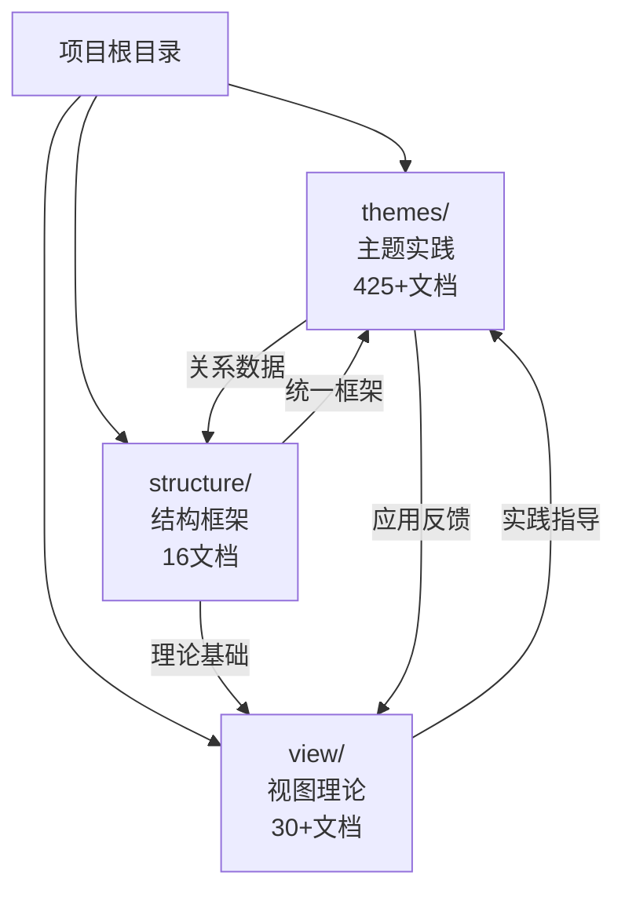

# DSL-SCHEMA-ProgramDesign-Transform

DSL SCHEMA Programming Design Transform Interaction Sql NoSql

## 📑 目录

- [DSL-SCHEMA-ProgramDesign-Transform](#dsl-schema-programdesign-transform)
  - [📑 目录](#-目录)
  - [1. 项目简介](#1-项目简介)
    - [1.1 研究目标](#11-研究目标)
    - [1.2 核心价值](#12-核心价值)
    - [1.3 项目特色](#13-项目特色)
  - [2. 项目结构](#2-项目结构)
  - [3. 核心主题体系](#3-核心主题体系)
    - [3.1 领域语言转换与AI+Code时代适配](#31-领域语言转换与aicode时代适配)
      - [3.1.1 OpenAPI/AsyncAPI/IoT Schema的差异与协同](#311-openapiasyncapiiot-schema的差异与协同)
      - [3.1.2 基于MCP协议的标准化方案](#312-基于mcp协议的标准化方案)
      - [3.1.3 自然语言生成DSL的AI工具集成](#313-自然语言生成dsl的ai工具集成)
    - [3.2 DSL分类与转换方案](#32-dsl分类与转换方案)
      - [3.2.1 网络协议与通信领域](#321-网络协议与通信领域)
      - [3.2.2 数据库与存储领域](#322-数据库与存储领域)
      - [3.2.3 DevOps与基础设施领域](#323-devops与基础设施领域)
      - [3.2.4 AI与机器学习领域](#324-ai与机器学习领域)
      - [3.2.5 配置管理与编排领域](#325-配置管理与编排领域)
    - [3.3 MCP协议集成分析](#33-mcp协议集成分析)
      - [3.3.1 APISIX-MCP项目分析](#331-apisix-mcp项目分析)
      - [3.3.2 OpenAPI MCP Server对比](#332-openapi-mcp-server对比)
      - [3.3.3 Database MCP Server新兴工具](#333-database-mcp-server新兴工具)
      - [3.3.4 协议成熟度评估](#334-协议成熟度评估)
    - [3.4 DSL转换工具链对比](#34-dsl转换工具链对比)
      - [3.4.1 OpenAPI Generator vs AsyncAPI Generator](#341-openapi-generator-vs-asyncapi-generator)
      - [3.4.2 AI驱动转换工具](#342-ai驱动转换工具)
      - [3.4.3 工具链统一化趋势](#343-工具链统一化趋势)
      - [3.4.4 工具选型决策矩阵](#344-工具选型决策矩阵)
    - [3.5 IoT Schema转换实践](#35-iot-schema转换实践)
      - [3.5.1 IoT Schema标准化现状](#351-iot-schema标准化现状)
      - [3.5.2 协议绑定转换](#352-协议绑定转换)
      - [3.5.3 实际案例分析](#353-实际案例分析)
      - [3.5.4 转换挑战与解决方案](#354-转换挑战与解决方案)
    - [3.6 跨行业Schema标准化](#36-跨行业schema标准化)
      - [3.6.1 行业Schema现状分析](#361-行业schema现状分析)
      - [3.6.2 统一Schema语言（USL）建议](#362-统一schema语言usl建议)
      - [3.6.3 跨行业转换挑战](#363-跨行业转换挑战)
      - [3.6.4 行业适配器模式](#364-行业适配器模式)
    - [3.7 最新技术趋势分析](#37-最新技术趋势分析)
      - [3.7.1 MCP协议生态快速发展](#371-mcp协议生态快速发展)
      - [3.7.2 OpenAPI/AsyncAPI工具链统一化趋势](#372-openapiasyncapi工具链统一化趋势)
      - [3.7.3 IoT Schema标准化加速](#373-iot-schema标准化加速)
      - [3.7.4 AI驱动的Schema转换准确率持续提升](#374-ai驱动的schema转换准确率持续提升)
      - [3.7.5 2025年Q1技术预测](#375-2025年q1技术预测)
    - [3.8 形式化证明与正确性验证](#38-形式化证明与正确性验证)
      - [3.8.1 Schema转换的形式化模型](#381-schema转换的形式化模型)
      - [3.8.2 转换正确性验证方法](#382-转换正确性验证方法)
      - [3.8.3 语义等价性证明](#383-语义等价性证明)
      - [3.8.4 类型安全证明](#384-类型安全证明)
      - [3.8.5 约束保持性证明](#385-约束保持性证明)
      - [3.8.6 验证方法与工具](#386-验证方法与工具)
      - [3.8.7 信息论形式化证明](#387-信息论形式化证明)
      - [3.8.8 形式语言理论形式化证明](#388-形式语言理论形式化证明)
    - [3.9 知识图谱与多维矩阵](#39-知识图谱与多维矩阵)
      - [3.9.1 Schema映射知识图谱](#391-schema映射知识图谱)
      - [3.9.2 知识图谱构建方法](#392-知识图谱构建方法)
      - [3.9.3 多维知识矩阵](#393-多维知识矩阵)
      - [3.9.4 矩阵维度定义](#394-矩阵维度定义)
      - [3.9.5 矩阵应用场景](#395-矩阵应用场景)
      - [3.9.6 思维导图可视化](#396-思维导图可视化)
    - [3.10 性能优化与安全](#310-性能优化与安全)
      - [3.10.1 性能优化实践](#3101-性能优化实践)
      - [3.10.2 缓存策略](#3102-缓存策略)
      - [3.10.3 并行处理与分布式](#3103-并行处理与分布式)
      - [3.10.4 安全考虑与实践](#3104-安全考虑与实践)
      - [3.10.5 测试与验证方法](#3105-测试与验证方法)
  - [4. 技术栈](#4-技术栈)
    - [4.1 Schema语言](#41-schema语言)
    - [4.2 协议](#42-协议)
    - [4.3 存储](#43-存储)
    - [4.4 编程语言](#44-编程语言)
    - [4.5 AI工具](#45-ai工具)
    - [4.6 验证工具](#46-验证工具)
  - [5. 快速开始](#5-快速开始)
    - [5.1 阅读顺序建议](#51-阅读顺序建议)
    - [5.2 核心概念](#52-核心概念)
    - [5.3 学习路径](#53-学习路径)
  - [6. 对标分析](#6-对标分析)
    - [6.1 MCP协议生态（2024-2025）](#61-mcp协议生态2024-2025)
    - [6.2 OpenAPI/AsyncAPI工具链](#62-openapiasyncapi工具链)
    - [6.3 IoT Schema标准化进展](#63-iot-schema标准化进展)
    - [6.4 AI驱动的代码生成工具](#64-ai驱动的代码生成工具)
    - [6.5 跨行业Schema转换实践](#65-跨行业schema转换实践)
    - [6.6 最新趋势更新](#66-最新趋势更新)
  - [7. 思维导图](#7-思维导图)
    - [7.1 思维导图结构](#71-思维导图结构)
    - [7.2 知识体系分支](#72-知识体系分支)
    - [7.3 关系网络图](#73-关系网络图)
  - [8. 多维知识矩阵](#8-多维知识矩阵)
    - [8.1 矩阵维度定义](#81-矩阵维度定义)
    - [8.2 矩阵构建方法](#82-矩阵构建方法)
    - [8.3 维度交叉分析](#83-维度交叉分析)
    - [8.4 矩阵应用场景](#84-矩阵应用场景)
  - [9. 形式化证明](#9-形式化证明)
    - [9.1 形式化模型](#91-形式化模型)
    - [9.2 正确性证明](#92-正确性证明)
    - [9.3 验证工具](#93-验证工具)
  - [10. 实际应用场景](#10-实际应用场景)
    - [10.1 Web API开发](#101-web-api开发)
    - [10.2 微服务架构](#102-微服务架构)
    - [10.3 物联网应用](#103-物联网应用)
    - [10.4 数据集成](#104-数据集成)
    - [10.5 企业数字化转型](#105-企业数字化转型)
  - [11. 贡献指南](#11-贡献指南)
    - [11.1 内容贡献](#111-内容贡献)
    - [11.2 文档贡献](#112-文档贡献)
    - [11.3 工具贡献](#113-工具贡献)
    - [11.4 代码贡献](#114-代码贡献)
  - [12. 相关资源](#12-相关资源)
    - [12.1 协议规范](#121-协议规范)
    - [12.2 工具资源](#122-工具资源)
    - [12.3 学术资源](#123-学术资源)
    - [12.4 社区资源](#124-社区资源)
  - [13. 项目路线图](#13-项目路线图)
    - [13.1 短期目标（1-3个月）](#131-短期目标1-3个月)
    - [13.2 中期目标（3-6个月）](#132-中期目标3-6个月)
    - [13.3 长期目标（6-12个月）](#133-长期目标6-12个月)

---

## 1. 项目简介

本项目致力于研究领域特定语言（DSL）Schema的转换与设计，
涵盖从语义模型、交互模型到存储模型的全链路转换方案。
项目重点关注AI+Code时代下的DSL转换自动化、
跨行业Schema标准化以及多协议适配等核心问题。

### 1.1 研究目标

- **转换自动化**：实现DSL Schema之间的自动转换，降低人工成本
- **标准化推进**：推动跨行业Schema标准化，建立统一转换规范
- **AI增强**：利用AI技术提升转换准确率和自动化程度
- **形式化验证**：建立形式化证明体系，确保转换正确性

### 1.2 核心价值

- **理论创新**：建立DSL Schema转换的理论框架和形式化模型
- **实践应用**：提供可落地的转换工具和最佳实践
- **生态建设**：推动MCP协议生态和工具链统一化
- **知识体系**：构建完整的知识图谱和多维知识矩阵

### 1.3 项目特色

- **多维度分析**：
  从Schema类型、转换方向、应用领域、工具支持、
  成熟度等多个维度分析
- **形式化验证**：建立数学形式化模型，确保转换正确性
- **知识图谱**：构建Schema映射关系的知识图谱，支持推理和发现
- **持续对标**：
  持续跟踪2024-2025年最新技术趋势，保持内容时效性
- **思维导图**：可视化展示DSL Schema转换的知识体系结构

---

## 2. 项目结构

### 2.1 三大核心目录

项目包含**三大核心目录**，共同构成完整的DSL Schema转换理论与实践体系：

| 目录 | 定位 | 文档数 | 主要内容 |
|------|------|--------|---------|
| **themes/** | 主题实践目录 | 425+ | 28个主题、81个Schema的完整文档集 |
| **view/** | 视图理论目录 | 30+ | 理论分析、实践指南、案例研究 |
| **structure/** | 结构框架目录 | 16 | 统一逻辑框架、全局关系梳理、理论论证 |

**详细说明**：

- `PROJECT_DIRECTORY_INTEGRATION.md` ⭐新增 - 三大目录整合说明
- `PROJECT_NAVIGATION.md` ⭐新增 - 项目全局导航地图

### 2.2 目录关系



---

```text
DSL-SCHEMA-ProgramDesign-Transform/
├── README.md                                    # 项目说明文档（本文档）
├── LICENSE                                      # 许可证文件
├── view/                                        # 核心文档目录
│   ├── ai_prompt.md                            # 核心分析文档（DSL Schema转换理论）
│   ├── program.md                               # 形式语言Schema转换编程语言问题论证
│   ├── can_schema.md                            # CAN协议Schema存在性论证与多维转换体系
│   ├── plc_schema.md                            # PLC Schema存在性论证与多维转换体系
│   ├── iot_schema.md                            # IoT传感器通信、参数与控制Schema存在性论证
│   └── physics_schema.md                        # 物理领域Schema存在性论证（家用电器到工业系统）
├── analysis/                                    # 对标分析文档目录
│   ├── 00_Benchmarking_Summary.md              # 对标分析总结
│   ├── 01_MCP_Protocol_Integration_Analysis.md # MCP协议集成对标分析
│   ├── 02_DSL_Transformation_Toolchain_Comparison.md # DSL转换工具链对比
│   ├── 03_IoT_Schema_Transformation_Practices.md # IoT Schema转换实践
│   ├── 04_Cross_Industry_Schema_Standardization.md # 跨行业Schema标准化建议
│   ├── 05_2025_Latest_Trends_Analysis.md        # 2025年1月最新技术趋势分析
│   ├── 06_Comprehensive_Integration_Analysis.md  # 综合整合分析（信息论+形式语言理论+思维导图+多维矩阵）
│   └── 07_Advanced_Formal_Proofs_Integration.md  # 高级形式化证明整合分析（多维度证明体系）
├── theory/                                      # 理论文档目录
│   ├── 06_Formal_Verification_Proofs.md         # 形式化证明与正确性验证
│   ├── 07_Knowledge_Graph_Mapping.md            # 知识图谱与Schema映射
│   ├── 08_Multidimensional_Knowledge_Matrix.md  # 多维知识矩阵分析
│   ├── 09_Information_Theory_Analysis.md        # Schema转换的信息论分析
│   └── 10_Formal_Language_Theory_Analysis.md    # Schema转换的形式语言理论分析
├── practices/                                   # 实践文档目录
│   ├── 09_Performance_Optimization.md          # 性能优化实践
│   ├── 10_Security_Considerations.md            # 安全考虑与实践
│   ├── 11_Testing_Validation.md                 # 测试与验证方法
│   └── 12_Real_World_Case_Studies.md            # 实际应用案例研究
└── view/diagrams/                               # 图表目录（概念关系、思维导图、多维矩阵、论证过程）
    ├── mindmap_dsl_schema_transformation.md     # DSL Schema转换思维导图
    ├── comprehensive_concept_relationship.md    # 全面概念关系图
    ├── proof_process_summary.md                 # 论证过程全面总结
    ├── multi_dimensional_comparison_matrix.md   # 多维矩阵对比
    ├── concrete_examples_and_implementations.md # 具体示例与实现细节
    └── README.md                                # Diagrams目录说明
    └── knowledge_matrix.md                      # 多维知识矩阵可视化
```

---

## 3. 核心主题体系

### 3.1 领域语言转换与AI+Code时代适配

#### 3.1.1 OpenAPI/AsyncAPI/IoT Schema的差异与协同

- **OpenAPI**：专注于RESTful API的描述，
  通过YAML/JSON定义端点、参数、响应格式
- **AsyncAPI**：针对消息队列（如Kafka、MQTT）
  的异步通信，强调事件驱动和消息流的建模
- **IoT Schema**：物联网设备数据格式的标准化，
  通常与传感器数据、设备协议（如CoAP、LoRaWAN）
  绑定

**转换难点**：

- **语义差异**：同步与异步通信模型的逻辑差异
  （如请求-响应 vs 事件订阅）
- **数据格式**：IoT Schema的二进制/协议数据
  与OpenAPI的JSON结构需适配
- **工具链割裂**：各领域工具（如Swagger UI、
  AsyncAPI Generator）缺乏统一接口

**参考文档**：`view/ai_prompt.md` 第一部分

#### 3.1.2 基于MCP协议的标准化方案

- **Model Context Protocol (MCP)** 作为
  "AI模型与工具的USB-C接口"，
  提供统一的上下文传递标准
- **案例**：APISIX-MCP将OpenAPI转换为MCP工具，
  支持自然语言操作API资源
- **优势**：降低API管理认知成本，
  实现自动化闭环验证

**参考文档**：

- `analysis/01_MCP_Protocol_Integration_Analysis.md`（协议分析）
- `analysis/08_MCP_Based_Schema_Transformation_Implementation_Guide.md`（实施指南）
- `analysis/10_MCP_Work_Overview_and_Roadmap.md`（工作总览）

#### 3.1.3 自然语言生成DSL的AI工具集成

- **GitHub Copilot**：
  自然语言→DSL转换，支持Kubernetes YAML、Terraform等
- **Cursor + MCP**：
  通过MCP协议调用转换工具，工具链集成度高
- **Claude/GPT-4**：
  通用AI模型支持，灵活性高但需要精确提示

**参考文档**：`analysis/02_DSL_Transformation_Toolchain_Comparison.md`

---

### 3.2 DSL分类与转换方案

#### 3.2.1 网络协议与通信领域

- **TCP/IP配置语言**：BGP路由管理DSL
- **MQTT协议**：消息主题和QoS配置
- **gRPC**：Protocol Buffers定义服务接口
- **CAN协议**：车载网络协议Schema（DBC文件标准）

**参考文档**：

- `view/ai_prompt.md` 第二部分
- `view/can_schema.md` - CAN协议Schema存在性论证与多维转换体系
- `view/physics_schema.md` - 物理领域Schema存在性论证

#### 3.2.2 数据库与存储领域

- **SQL**：关系型数据库查询语言
- **NoSQL**：MongoDB MQL、Redis命令、Cassandra CQL
- **转换方案**：SQL ↔ GraphQL、SQL ↔ MongoDB MQL

**参考文档**：`view/ai_prompt.md` 第二部分

#### 3.2.3 DevOps与基础设施领域

- **Kubernetes YAML**：容器编排配置
- **Terraform HCL**：基础设施即代码
- **Ansible YAML**：自动化配置管理
- **PLC Schema**：工业自动化PLC程序Schema（IEC 61131-3标准）

**参考文档**：

- `view/ai_prompt.md` 第二部分
- `view/plc_schema.md` - PLC Schema存在性论证与多维转换体系

#### 3.2.4 AI与机器学习领域

- **TensorFlow**：计算图定义
- **ONNX**：模型交换格式
- **PyTorch**：动态计算图
- **转换方案**：TensorFlow ↔ ONNX、PyTorch ↔ TensorFlow

**参考文档**：`view/ai_prompt.md` 第二部分

#### 3.2.5 配置管理与编排领域

- **Kubernetes YAML**：容器编排配置
- **Terraform HCL**：基础设施即代码
- **Ansible YAML**：自动化配置管理
- **Docker Compose**：容器编排配置
- **Helm Charts**：Kubernetes应用包管理
- **转换方案**：Kubernetes ↔ Docker Compose、Terraform ↔ CloudFormation

**参考文档**：`view/ai_prompt.md` 第二部分

---

### 3.3 MCP协议集成分析

#### 3.3.1 APISIX-MCP项目分析

- **项目状态**：Apache APISIX官方支持，生产环境验证
- **核心功能**：OpenAPI 3.1 → MCP工具转换，自然语言操作API资源
- **效果数据**：配置准确率提升80%，运维效率提高50%

**参考文档**：`analysis/01_MCP_Protocol_Integration_Analysis.md`

#### 3.3.2 OpenAPI MCP Server对比

- **项目定位**：通用OpenAPI规范解析器
- **核心能力**：文件上传支持、参数自动处理、Claude Desktop集成

**参考文档**：`analysis/01_MCP_Protocol_Integration_Analysis.md`

#### 3.3.3 Database MCP Server新兴工具

- **项目定位**：数据库操作的MCP Server实现
- **核心能力**：
  - SQL查询自然语言化
  - 数据库Schema自动发现
  - 多数据库支持（PostgreSQL、MySQL、MongoDB）
- **应用场景**：数据库Schema转换、查询优化、数据迁移

**参考文档**：`analysis/05_2025_Latest_Trends_Analysis.md`

#### 3.3.4 协议成熟度评估

| 协议/集成 | 成熟度 | 状态说明 |
|---------|--------|---------|
| **MCP协议** | ⭐⭐⭐⭐（4/5） | 快速发展中，生态逐步完善，预计2025 Q2达到5/5 |
| **OpenAPI集成** | ⭐⭐⭐⭐⭐（5/5） | 成熟稳定，生产环境广泛使用 |
| **AsyncAPI集成** | ⭐⭐⭐（3/5） | 工具存在但集成度不高，持续改进中 |
| **IoT Schema集成** | ⭐⭐（2/5） | 缺乏标准实现，2025年预计提升至3/5 |
| **Database集成** | ⭐⭐⭐（3/5） | 新兴工具，功能完善中 |

**参考文档**：`analysis/01_MCP_Protocol_Integration_Analysis.md`、`analysis/05_2025_Latest_Trends_Analysis.md`

---

### 3.4 DSL转换工具链对比

#### 3.4.1 OpenAPI Generator vs AsyncAPI Generator

- **OpenAPI Generator**：50+语言支持，生态最完善
- **AsyncAPI Generator**：20+语言支持，异步通信专业
- **工具链割裂问题**：通过MCP协议逐步统一

**参考文档**：`analysis/02_DSL_Transformation_Toolchain_Comparison.md`

#### 3.4.2 AI驱动转换工具

- **GitHub Copilot**：自然语言→DSL转换
- **Cursor + MCP**：工具链集成度高
- **Claude/GPT-4**：通用AI模型支持

**参考文档**：`analysis/02_DSL_Transformation_Toolchain_Comparison.md`

#### 3.4.3 工具链统一化趋势

- **MCP协议统一**：通过MCP协议连接各工具
- **统一Schema语言**：建立OpenAPI/AsyncAPI/IoT Schema的映射规范
- **AI增强**：使用AI模型理解语义差异，自动转换
- **标准化进程**：预计2025 Q3提出统一Schema语言提案

**参考文档**：`analysis/02_DSL_Transformation_Toolchain_Comparison.md`

#### 3.4.4 工具选型决策矩阵

| 转换场景 | 推荐工具 | 成熟度 | 理由 |
|---------|---------|--------|------|
| **OpenAPI ↔ AsyncAPI** | MCP Server | ⭐⭐⭐⭐ | 标准化接口，AI集成 |
| **OpenAPI代码生成** | OpenAPI Generator | ⭐⭐⭐⭐⭐ | 50+语言支持，生态完善 |
| **AsyncAPI代码生成** | AsyncAPI Generator | ⭐⭐⭐⭐ | 20+语言支持，异步专业 |
| **自然语言→DSL** | GitHub Copilot / Cursor | ⭐⭐⭐ | AI增强，准确率85%+ |
| **IoT Schema转换** | 自定义转换器 | ⭐⭐ | 标准工具缺乏，需要定制 |

**参考文档**：
`analysis/02_DSL_Transformation_Toolchain_Comparison.md`、
`theory/08_Multidimensional_Knowledge_Matrix.md`

---

### 3.5 IoT Schema转换实践

#### 3.5.1 IoT Schema标准化现状

- **W3C WoT Thing Description**：标准成熟，协议绑定扩展
- **OPC UA**：工业自动化标准广泛应用
- **标准化程度**：⭐⭐⭐（3/5）

**参考文档**：`analysis/03_IoT_Schema_Transformation_Practices.md`

#### 3.5.2 协议绑定转换

- **MQTT**：消息主题自动映射
- **CoAP**：RESTful风格转换
- **HTTP**：标准REST API转换

**参考文档**：`analysis/03_IoT_Schema_Transformation_Practices.md`

#### 3.5.3 实际案例分析

- **AWS IoT Core**：设备管理API生成
  - 架构：传感器 → MQTT → AWS IoT Core → Lambda → DynamoDB
  - 特点：IoT Schema自动转换为REST API，支持设备影子
- **Home Assistant**：设备Schema转换实践
  - 架构：设备 → MQTT/HTTP → Home Assistant → 数据库
  - 特点：支持多种IoT协议，自动发现设备
- **KubeEdge边缘计算平台**：边缘设备Schema转换
  - 架构：边缘设备 → EdgeCore → CloudCore → Kubernetes
  - 特点：边缘节点数据处理，云端统一管理

**参考文档**：

- `analysis/03_IoT_Schema_Transformation_Practices.md`
- `view/iot_schema.md` - IoT传感器通信、参数与控制Schema
- `view/can_schema.md` - CAN协议Schema（车载网络）
- `view/plc_schema.md` - PLC Schema（工业自动化）
- `view/physics_schema.md` - 物理领域Schema存在性论证

#### 3.5.4 转换挑战与解决方案

**挑战1：协议差异**:

- **问题**：MQTT是发布-订阅模型，HTTP是请求-响应模型
- **解决方案**：API网关转换、WebSocket桥接、消息队列中间件

**挑战2：实时性要求**:

- **问题**：IoT数据需要低延迟传输，REST API不适合实时场景
- **解决方案**：WebSocket/SSE、消息队列、边缘计算

**挑战3：数据格式差异**:

- **问题**：IoT设备可能使用二进制格式，Web API通常使用JSON
- **解决方案**：协议适配器、Schema验证、多格式支持

**参考文档**：`analysis/03_IoT_Schema_Transformation_Practices.md`

---

### 3.6 跨行业Schema标准化

#### 3.6.1 行业Schema现状分析

- **金融**：SWIFT、ISO 20022高度标准化
- **医疗**：FHIR、HL7国际标准完善
- **IoT**：多标准竞争，统一化进行中

**参考文档**：`analysis/04_Cross_Industry_Schema_Standardization.md`

#### 3.6.2 统一Schema语言（USL）建议

- **Universal Schema Language**：跨行业统一Schema语言提案
- **核心特性**：
  - 多格式支持：JSON Schema、XML Schema、Protobuf等
  - 语义扩展：支持行业特定语义标注
  - 版本管理：Schema版本化和兼容性管理
  - 工具生态：统一的代码生成和验证工具
- **适配器模式**：实现行业间转换
- **实施路线图**：分阶段推进标准化（预计2025 Q3提案）

**参考文档**：`analysis/04_Cross_Industry_Schema_Standardization.md`

#### 3.6.3 跨行业转换挑战

**挑战1：语义差异**:

- **问题**：不同行业对同一概念的定义不同（如"用户"在金融、医疗、IoT中的含义不同）
- **解决方案**：本体映射、语义标注（RDF/OWL）、AI理解（LLM）

**挑战2：数据格式差异**:

- **问题**：金融（XML/ASN.1）、医疗（JSON/XML）、IoT（JSON/二进制）
- **解决方案**：统一中间格式（JSON Schema）、格式转换器、多格式支持

**挑战3：合规性要求**:

- **问题**：金融（PCI-DSS、GDPR）、医疗（HIPAA）、各行业合规要求不同
- **解决方案**：合规插件、数据脱敏、审计日志

**参考文档**：`analysis/04_Cross_Industry_Schema_Standardization.md`

#### 3.6.4 行业适配器模式

| 行业 | 源Schema | 目标Schema | 适配器 | 成熟度 |
|------|---------|-----------|--------|--------|
| **金融** | ISO 20022 | OpenAPI | ISO20022-OpenAPI适配器 | ⭐⭐⭐⭐ |
| **医疗** | FHIR | OpenAPI | FHIR-OpenAPI适配器 | ⭐⭐⭐⭐ |
| **IoT** | W3C WoT | OpenAPI | WoT-OpenAPI适配器 | ⭐⭐⭐ |
| **物流** | GS1 | OpenAPI | GS1-OpenAPI适配器 | ⭐⭐⭐ |

**参考文档**：`analysis/04_Cross_Industry_Schema_Standardization.md`

---

### 3.7 最新技术趋势分析

#### 3.7.1 MCP协议生态快速发展

- VS Code/Cursor深度集成
- 协议规范趋于稳定
- 企业级应用增加

**参考文档**：`analysis/05_2025_Latest_Trends_Analysis.md`

#### 3.7.2 OpenAPI/AsyncAPI工具链统一化趋势

- 工具链割裂问题逐步解决
- MCP协议作为统一接口被采纳
- 统一Schema语言讨论中

**参考文档**：`analysis/05_2025_Latest_Trends_Analysis.md`

#### 3.7.3 IoT Schema标准化加速

- W3C WoT Thing Description 1.1更新
- OPC UA工业自动化标准广泛应用
- 协议绑定：MQTT、CoAP、HTTP支持完善

**参考文档**：`analysis/05_2025_Latest_Trends_Analysis.md`

#### 3.7.4 AI驱动的Schema转换准确率持续提升

- **GitHub Copilot**：DSL转换准确率提升至85%+，上下文理解能力增强
- **Cursor + MCP**：集成度提升，开发效率提升40%+
- **Claude/GPT-4**：简单Schema转换准确率90%+，复杂Schema转换准确率70%+
- **跨行业Schema转换标准讨论启动**：预计2025 Q4达到90%+准确率

**参考文档**：`analysis/05_2025_Latest_Trends_Analysis.md`

#### 3.7.5 2025年Q1技术预测

**短期（1-3个月）**：

- MCP Server数量预计增长50%+
- 更多IDE和编辑器集成
- 协议规范v1.0正式发布

**中期（3-6个月）**：

- 企业级MCP Server出现
- 性能优化和规模化验证
- 标准组织正式采纳

**关键技术突破点**：

1. **MCP协议标准化**：预计2025 Q2完成
2. **统一Schema语言**：预计2025 Q3提案
3. **AI完全自动化**：预计2025 Q4达到90%+准确率

**参考文档**：

- `analysis/05_2025_Latest_Trends_Analysis.md`
- `analysis/06_Comprehensive_Integration_Analysis.md`（综合整合）
- `analysis/07_Advanced_Formal_Proofs_Integration.md`（高级形式化证明）
- `analysis/08_MCP_Based_Schema_Transformation_Implementation_Guide.md`（MCP实施指南）
- `analysis/09_MCP_Schema_Transformation_Quick_Reference.md`（快速参考）
- `analysis/10_MCP_Work_Overview_and_Roadmap.md`（工作总览与路线图）

---

### 3.8 形式化证明与正确性验证

#### 3.8.1 Schema转换的形式化模型

- **转换函数定义**：建立Schema转换的数学形式化模型
- **正确性条件**：定义转换正确性的形式化条件
- **等价性证明**：证明转换前后Schema的语义等价性

**参考文档**：`theory/06_Formal_Verification_Proofs.md`

#### 3.8.2 转换正确性验证方法

- **静态验证**：基于类型系统的验证方法
- **动态验证**：运行时验证和测试方法
- **形式化证明**：使用定理证明器验证转换正确性

**参考文档**：`theory/06_Formal_Verification_Proofs.md`

#### 3.8.3 语义等价性证明

**定义**：两个Schema $s_1$ 和 $s_2$ 语义等价，当且仅当：

```text
semantic(s_1) = semantic(s_2)
```

**证明方法**：

- **结构归纳法**：证明基本类型和复合类型的语义等价性
- **双射证明法**：证明转换函数和其逆函数构成双射

**参考文档**：`theory/06_Formal_Verification_Proofs.md`

#### 3.8.4 类型安全证明

**定义**：Schema $s$ 是类型安全的，当且仅当：

```text
∀e ∈ s, ∃t: type(e) = t ∧ t ∈ T
```

**类型安全保持性**：转换函数 $f$ 保持类型安全，当且仅当：

```text
type_safe(s_1) ⟹ type_safe(f(s_1))
```

**证明方法**：使用类型规则归纳法证明类型安全保持性

**参考文档**：`theory/06_Formal_Verification_Proofs.md`

#### 3.8.5 约束保持性证明

**定义**：转换函数 $f$ 保持约束，当且仅当：

```text
∀v, c: satisfies(v, c) ⟹ satisfies(f_V(v), f_C(c))
```

**约束类型**：

- **值约束**：minLength、maxLength、pattern等
- **类型约束**：enum、allOf、anyOf等
- **结构约束**：required、additionalProperties等

**证明方法**：使用约束规则归纳法证明约束保持性

**参考文档**：`theory/06_Formal_Verification_Proofs.md`

#### 3.8.6 验证方法与工具

**静态验证**：

- **类型检查**：JSON Schema Validator、OpenAPI Validator、TypeScript类型检查器
- **约束检查**：Ajv (JSON Schema Validator)、OpenAPI Validator、AsyncAPI Validator

**动态验证**：

- **运行时验证**：生成测试用例、执行转换后的Schema、验证结果
- **测试驱动验证**：编写转换测试用例、执行转换、验证转换结果

**形式化验证工具**：

- **定理证明器**：Coq、Isabelle、Agda
- **模型检查器**：TLA+、SPIN、NuSMV

**参考文档**：

- `theory/06_Formal_Verification_Proofs.md`
- `theory/09_Information_Theory_Analysis.md`（信息论详细分析）
- `theory/10_Formal_Language_Theory_Analysis.md`（形式语言理论详细分析）
- `analysis/06_Comprehensive_Integration_Analysis.md`（综合整合）

#### 3.8.7 信息论形式化证明

信息论为Schema转换提供了量化工具和理论框架，
从信息传输角度理解转换过程。

**3.8.7.1 Schema信息熵量化**：

- **Schema信息熵**：$H(s) = -\sum_{i=1}^{n} p(e_i) \log_2 p(e_i)$
- **熵分解**：$H(s) = w_T H_T(s) + w_V H_V(s) + w_C H_C(s) + w_M H_M(s)$
  - $H_T(s)$：类型熵
  - $H_V(s)$：值熵
  - $H_C(s)$：约束熵
  - $H_M(s)$：元数据熵

**3.8.7.2 转换信息损失量化**：

- **转换信息损失**：$\Delta H_f(s_1) = H(s_1) - I(s_1;f(s_1)) = H(s_1|f(s_1))$
- **分类信息损失**：
  - 结构信息损失：$\Delta H_{struct}$
  - 语义信息损失：$\Delta H_{semantic}$
  - 约束信息损失：$\Delta H_{constraint}$
  - 元数据信息损失：$\Delta H_{metadata}$
- **无损转换条件**：$I(s_1;f(s_1)) = H(s_1) = H(f(s_1))$

**3.8.7.3 互信息与转换正确性**：

- **转换正确性**：$Correctness(f) = \frac{I(s_1;f(s_1))}{H(s_1)}$
- **语义等价性**：$I(s_1;s_2) = H(s_1) = H(s_2)$
- **类型安全**：$I_T(s_1;f(s_1)) = H_T(s_1)$
- **约束保持性**：$I_C(s_1;f(s_1)) = H_C(s_1)$

**3.8.7.4 信道容量与转换效率**：

- **转换信道模型**：将Schema转换过程建模为信息传输信道
- **信道容量**：$C_f = \max_{p(s_1)} I(s_1;f(s_1))$
- **转换效率**：$\eta_f = \frac{I(s_1;f(s_1))}{C_f}$

**参考文档**：

- `theory/09_Information_Theory_Analysis.md` -
  完整信息论分析
- `theory/06_Formal_Verification_Proofs.md` 第10章 -
  信息论视角的形式化证明
- `view/ai_prompt.md` 第13章 -
  Schema转换的信息论形式化证明
- `view/program.md` 第10.1节 -
  信息论视角的形式化证明
- `analysis/06_Comprehensive_Integration_Analysis.md` 第2章 -
  信息论与形式语言理论的深度融合
- `analysis/07_Advanced_Formal_Proofs_Integration.md` 第2章 -
  信息论证明深度分析

#### 3.8.8 形式语言理论形式化证明

形式语言理论为Schema转换提供了语法和语义的形式化模型，从语言理论角度证明转换正确性。

**3.8.8.1 Schema语法结构形式化**：

- **形式语法**：$G = (N, T, P, S)$
  - $N$：非终结符集合（Schema类型）
  - $T$：终结符集合（Schema值）
  - $P$：产生式规则集合
  - $S$：起始符号
- **Schema语法类型**：上下文无关语法（Chomsky层次结构类型2）
- **语法同态**：$h: G_1 \rightarrow G_2$，保持产生式规则

**3.8.8.2 Schema语义模型形式化**：

- **语义域**：$\Sigma = \Sigma_T \times \Sigma_V \times \Sigma_C \times \Sigma_M$
  - $\Sigma_T$：类型语义域
  - $\Sigma_V$：值语义域
  - $\Sigma_C$：约束语义域
  - $\Sigma_M$：元数据语义域
- **语义函数**：$[\![\cdot]\!]: L(G) \rightarrow \Sigma$

**3.8.8.3 语法转换的形式化证明**：

- **语法转换函数**：$f_G: L(G_1) \rightarrow L(G_2)$
- **语法正确性**：$\forall w \in L(G_1), f_G(w) \in L(G_2)$
- **证明方法**：通过语法同态保持产生式规则证明

**3.8.8.4 语义转换的形式化证明**：

- **语义转换函数**：$f_\Sigma: \Sigma_1 \rightarrow \Sigma_2$
- **语义保持性**：$\forall s_1, s_2: [\![s_1]\!]_1 = [\![s_2]\!]_1 \implies [\![f_G(s_1)]\!]_2 = [\![f_G(s_2)]\!]_2$
- **语义正确性**：$\forall s_1, [\![s_1]\!]_1 = [\![f_G(s_1)]\!]_2$

**3.8.8.5 语法-语义一致性证明**：

- **一致性定义**：$[\![f_G(s_1)]\!]_2 = f_\Sigma([\![s_1]\!]_1)$
- **交换性条件**：$f_\Sigma \circ [\![\cdot]\!]_1 = [\![\cdot]\!]_2 \circ f_G$
- **完全正确性**：同时满足语法正确性、语义正确性和一致性

**参考文档**：

- `theory/10_Formal_Language_Theory_Analysis.md` -
  完整形式语言理论分析
- `theory/06_Formal_Verification_Proofs.md` 第11章 -
  形式语言理论视角的形式化证明
- `ai_prompt.md` 第14章 -
  Schema转换的形式语言理论形式化证明
- `view/program.md` 第10.2节 -
  形式语言理论视角的形式化证明
- `analysis/06_Comprehensive_Integration_Analysis.md` 第2章 -
  信息论与形式语言理论的深度融合
- `analysis/07_Advanced_Formal_Proofs_Integration.md` 第3章 -
  形式语言理论证明深度分析

---

### 3.9 知识图谱与多维矩阵

#### 3.9.1 Schema映射知识图谱

**知识图谱定义**：知识图谱 $G = (V, E, L)$ 是一个有向标记图，其中：

- $V$：顶点集合（Entities）- Schema、Type、Property、Constraint等
- $E$：边集合（Relations）- hasType、hasProperty、mapsTo、transformsTo等
- $L$：标签函数（Labels）

**实体关系建模**：

- **Schema关系**：hasType、hasProperty、hasConstraint、extends、composes
- **转换关系**：mapsTo、transformsTo、equivalentTo、subsumes

**参考文档**：`theory/07_Knowledge_Graph_Mapping.md`

#### 3.9.2 知识图谱构建方法

**实体提取**：

- 从Schema定义中提取实体（Schema、Type、Property、Constraint）
- 从转换规则中提取实体（Transformation、Mapping、Rule）

**关系建立**：

- 建立Schema内部关系（类型包含、属性包含、约束包含）
- 建立转换关系（映射关系、转换关系、等价关系）

**推理规则**：

- 基于知识图谱的转换推理
- 一致性检查
- 关系发现

**参考文档**：`theory/07_Knowledge_Graph_Mapping.md`

#### 3.9.3 多维知识矩阵

**矩阵定义**：从多个维度分析DSL Schema转换的知识体系

**核心价值**：

- **全面性**：覆盖Schema转换的多个维度
- **系统性**：建立系统化的知识体系
- **可视化**：直观展示多维度关系
- **可扩展**：易于添加新的维度

**参考文档**：

- `theory/08_Multidimensional_Knowledge_Matrix.md` -
  完整的多维知识矩阵分析
- `ai_prompt.md` 第15章 -
  多维知识矩阵与思维导图整合
- `analysis/06_Comprehensive_Integration_Analysis.md` 第3章 -
  思维导图与多维知识矩阵的整合

#### 3.9.4 矩阵维度定义

**5个核心维度**：

1. **Schema类型维度**：OpenAPI 3.1、AsyncAPI 2.6、IoT Schema、JSON Schema、Protobuf、GraphQL Schema、SQL Schema、NoSQL Schema
2. **转换方向维度**：双向转换、单向转换、多向转换
3. **应用领域维度**：Web API、消息队列、物联网、数据库、微服务、边缘计算
4. **工具支持维度**：MCP Server、OpenAPI Generator、AsyncAPI Generator、自定义转换工具、AI工具
5. **成熟度维度**：实验性、开发中、稳定、生产级

**参考文档**：

- `theory/08_Multidimensional_Knowledge_Matrix.md` -
  完整的多维知识矩阵分析
- `ai_prompt.md` 第15章 -
  多维知识矩阵与思维导图整合
- `analysis/06_Comprehensive_Integration_Analysis.md` 第3章 -
  思维导图与多维知识矩阵的整合

#### 3.9.5 矩阵应用场景

**转换决策支持**：

- 确定源Schema类型和目标Schema类型
- 查询矩阵中的转换可行性
- 评估工具支持程度
- 考虑应用领域特征
- 选择最佳转换方案

**工具选型支持**：

- 对比不同工具的支持程度、成熟度、应用领域适配性
- 根据需求选择最佳工具

**知识发现**：

- 发现通用转换模式
- 发现特定Schema类型的转换模式
- 发现组合转换模式

**参考文档**：

- `theory/08_Multidimensional_Knowledge_Matrix.md` -
  完整的多维知识矩阵分析
- `ai_prompt.md` 第15章 -
  多维知识矩阵与思维导图整合
- `analysis/06_Comprehensive_Integration_Analysis.md` 第3章 -
  思维导图与多维知识矩阵的整合

#### 3.9.6 思维导图可视化

**思维导图结构**：

1. **理论基础**：形式化模型、语义理论、知识图谱
2. **Schema类型体系**：API Schema、IoT Schema、数据Schema、配置Schema
3. **转换路径**：API转换、IoT转换、数据转换、配置转换
4. **工具链**：代码生成工具、MCP协议工具、AI工具、验证工具
5. **应用场景**：Web API开发、微服务架构、物联网应用、数据集成
6. **标准化**：行业标准、统一Schema语言、协议标准化
7. **实践方法**：转换策略、验证方法、最佳实践

**关系网络**：

- 理论基础 → 转换路径：理论基础指导转换路径的设计
- Schema类型 → 转换路径：不同Schema类型之间的转换路径
- 转换路径 → 工具链：工具链实现转换路径
- 工具链 → 应用场景：工具链支持应用场景

**参考文档**：

- `view/diagrams/mindmap_dsl_schema_transformation.md` -
  DSL Schema转换思维导图
- `ai_prompt.md` 第15章 -
  多维知识矩阵与思维导图整合
- `analysis/06_Comprehensive_Integration_Analysis.md` 第3章 -
  思维导图与多维知识矩阵的整合

---

### 3.10 性能优化与安全

#### 3.10.1 性能优化实践

**性能优化目标**：

- **转换速度**：单次转换时间 <100ms
- **吞吐量**：每秒处理的Schema数量 >1000/s
- **内存占用**：转换过程中的内存占用 <1GB
- **CPU利用率**：转换过程中的CPU利用率 >80%

**优化策略**：

- **算法优化**：减少遍历次数、提前终止、批量处理
- **数据结构优化**：使用高效数据结构、减少内存分配
- **缓存优化**：转换结果缓存、增量更新

**参考文档**：`practices/09_Performance_Optimization.md`

#### 3.10.2 缓存策略

**缓存类型**：

- **转换结果缓存**：缓存已转换的Schema结果
- **元数据缓存**：缓存Schema元数据信息
- **映射规则缓存**：缓存转换映射规则

**缓存策略**：

- **LRU缓存**：最近最少使用缓存策略
- **TTL缓存**：基于时间的缓存过期策略
- **增量更新**：只更新变化的部分

**参考文档**：`practices/09_Performance_Optimization.md`

#### 3.10.3 并行处理与分布式

**并行处理**：

- **多线程处理**：利用多核CPU并行转换
- **异步处理**：异步转换提高吞吐量
- **流水线处理**：流水线式转换提高效率

**分布式处理**：

- **分布式转换**：大规模Schema分布式转换
- **负载均衡**：转换任务负载均衡
- **容错机制**：转换失败重试和容错

**参考文档**：`practices/09_Performance_Optimization.md`

#### 3.10.4 安全考虑与实践

**数据安全**：

- **数据加密**：Schema转换过程中的数据加密
- **数据脱敏**：敏感数据自动识别和脱敏
- **访问控制**：转换工具的访问控制和权限管理

**安全审计**：

- **操作日志**：完整的转换操作审计日志
- **访问日志**：访问转换工具的日志记录
- **异常监控**：异常转换操作的监控和告警

**合规性**：

- **GDPR合规**：数据保护合规性检查
- **行业合规**：金融、医疗等行业合规性检查

**参考文档**：`practices/10_Security_Considerations.md`

#### 3.10.5 测试与验证方法

**单元测试**：

- **转换函数测试**：测试单个转换函数的正确性
- **边界条件测试**：测试边界条件和异常情况
- **覆盖率测试**：确保测试覆盖率 >80%

**集成测试**：

- **端到端测试**：测试完整的转换流程
- **多Schema测试**：测试多种Schema类型的转换
- **性能测试**：测试转换性能和吞吐量

**回归测试**：

- **自动化回归**：自动化回归测试套件
- **版本兼容性测试**：测试不同版本Schema的兼容性
- **正确性验证**：使用形式化验证方法验证转换正确性

**参考文档**：`practices/11_Testing_Validation.md`

---

## 4. 技术栈

### 4.1 Schema语言

- **OpenAPI 3.1**：RESTful API描述规范
- **AsyncAPI 2.6**：异步API描述规范
- **JSON Schema**：JSON数据验证规范
- **Protobuf**：Google的序列化协议

### 4.2 协议

- **MCP**：Model Context Protocol，AI模型与工具的标准化接口
- **HTTP**：RESTful API通信协议
- **MQTT**：物联网消息传输协议
- **gRPC**：高性能RPC框架
- **Kafka**：分布式消息队列

### 4.3 存储

- **SQL**：PostgreSQL、MySQL等关系型数据库
- **NoSQL**：MongoDB、Redis等非关系型数据库

### 4.4 编程语言

- **Python**：主要开发语言，用于转换工具开发
- **TypeScript**：前端和工具开发
- **Rust**：高性能转换引擎
- **Go**：微服务和工具开发
- **Java**：企业级应用开发

### 4.5 AI工具

- **GitHub Copilot**：AI代码助手，DSL转换准确率85%+
- **Cursor**：AI增强IDE，MCP协议深度集成
- **Claude**：Anthropic的AI模型，Schema转换能力强
- **GPT-4**：OpenAI的AI模型，通用AI支持

### 4.6 验证工具

- **JSON Schema Validator**：JSON Schema验证工具（Ajv）
- **OpenAPI Validator**：OpenAPI规范验证工具
- **AsyncAPI Validator**：AsyncAPI规范验证工具
- **类型检查器**：TypeScript类型检查器
- **定理证明器**：Coq、Isabelle、Agda
- **模型检查器**：TLA+、SPIN、NuSMV

---

## 5. 快速开始

**🚀 新手指南**：建议先阅读 `GETTING_STARTED.md` 获取快速入门指导

**📑 文档索引**：查看 `DOCUMENT_INDEX.md` 快速查找文档

**❓ 常见问题**：查看 `FAQ.md` 获取常见问题解答

**🤝 贡献指南**：查看 `CONTRIBUTING.md` 了解如何贡献

**📊 完成报告**：查看 `FINAL_COMPLETION_REPORT_2025-01-21.md` 了解项目完成情况

**🎯 项目里程碑**：查看 `PROJECT_MILESTONES.md` 了解项目里程碑和进度

**📊 项目状态**：查看 `PROJECT_STATUS.md` 快速了解项目当前状态

### 5.1 阅读顺序建议

**推荐顺序**：

1. **快速入门**：阅读 `GETTING_STARTED.md` 了解项目和学习路径
2. **项目概览**：阅读 `README.md` 了解项目整体结构
3. **选择路径**：根据角色选择学习路径（见 `GETTING_STARTED.md`）
4. **深入学习**：按照选择的路径深入学习相关文档

**传统路径**：

1. **入门**：阅读 `view/ai_prompt.md` 了解核心理论
2. **实践**：查看 `analysis/` 目录下的对标分析文档
3. **深入**：研究具体行业的Schema转换方案
4. **理论**：学习 `theory/` 目录下的形式化证明和知识图谱
5. **实践**：参考 `practices/` 目录下的性能优化和安全实践
6. **代码模板**：参考 `practices/13_MCP_Code_Templates.md` 获取即用代码模板

### 5.2 核心概念

- **DSL（Domain-Specific Language）**：领域特定语言
- **Schema**：数据结构定义规范
- **MCP（Model Context Protocol）**：AI模型与工具的标准化接口
- **转换链**：Schema → API → JSON → SQL/NoSQL → MQTT/Kafka
- **形式化证明**：使用数学方法证明转换正确性
- **知识图谱**：Schema映射关系的图结构表示
- **多维知识矩阵**：从多个维度分析Schema转换的知识体系
- **语义等价性**：转换前后Schema的语义等价性

### 5.3 学习路径

**初学者路径**：

1. 了解DSL和Schema基本概念
2. 学习OpenAPI、AsyncAPI、IoT Schema基础
3. 实践简单的Schema转换
4. 了解MCP协议和工具

**进阶路径**：

1. 深入学习形式化证明方法
2. 构建知识图谱和多维矩阵
3. 研究跨行业Schema转换
4. 开发自定义转换工具

**专家路径**：

1. 参与标准制定和工具开发
2. 研究形式化验证方法
3. 推动工具链统一化
4. 建立行业最佳实践

---

## 6. 对标分析

本项目持续对标当前网络上的最新技术趋势：

### 6.1 MCP协议生态（2024-2025）

- ✅ APISIX-MCP项目进入生产环境
- ✅ OpenAPI MCP Server提供通用转换能力
- ✅ VS Code、Cursor等IDE集成MCP协议
- ✅ 协议成熟度：⭐⭐⭐⭐（4/5）

### 6.2 OpenAPI/AsyncAPI工具链

- ✅ OpenAPI Generator：50+语言支持，生态最完善
- ✅ AsyncAPI Generator：20+语言支持，异步通信专业
- ✅ 工具链割裂问题：通过MCP协议逐步统一

### 6.3 IoT Schema标准化进展

- ✅ W3C WoT Thing Description标准成熟
- ✅ OPC UA工业自动化标准广泛应用
- ✅ 协议绑定：MQTT、CoAP、HTTP支持完善
- ✅ 标准化程度：⭐⭐⭐（3/5）

### 6.4 AI驱动的代码生成工具

- ✅ GitHub Copilot：自然语言→DSL转换
- ✅ Cursor + MCP：工具链集成度高
- ✅ Claude/GPT-4：通用AI模型支持

### 6.5 跨行业Schema转换实践

- ✅ 金融：SWIFT、ISO 20022高度标准化
- ✅ 医疗：FHIR、HL7国际标准完善
- ✅ IoT：多标准竞争，统一化进行中

### 6.6 最新趋势更新

**2025年1月最新动态**：

- ✅ **MCP协议**：VS Code官方支持，Cursor深度集成，
  协议规范趋于稳定
- ✅ **OpenAPI Generator**：v7.x版本发布，
  支持OpenAPI 3.1完整特性，性能提升30%
- ✅ **AsyncAPI Generator**：v2.x版本发布，
  新增NATS、Redis Streams协议绑定
- ✅ **IoT Schema**：W3C WoT Thing Description 1.1更新，
  OPC UA 1.05发布
- ✅ **AI工具**：GitHub Copilot准确率提升至85%+，
  Cursor + MCP集成度提升

**技术预测**：

- 🔄 **MCP协议v1.0**：预计2025 Q2正式发布
- 🔄 **统一Schema语言**：预计2025 Q3提出提案
- 🔄 **AI自动化**：预计2025 Q4达到90%+准确率

**更新时间**：2025-01-21
**对标基准**：2024-2025技术趋势
**更新频率**：持续跟踪，月度更新
**最新趋势分析**：详见 `analysis/05_2025_Latest_Trends_Analysis.md`

**最新更新（2025-01-21）**：

- ✅ **完善文档结构**：补充完整的目录和主题序号，
  包括所有15章及其子章节
- ✅ **补充第4章**：其他领域的DSL转换方案，
  包括建模、配置、安全、测试、AI/ML等领域
- ✅ **新增信息论形式化证明**：第13章，
  包含信息熵、信息损失、互信息等完整证明
- ✅ **新增形式语言理论形式化证明**：第14章，
  包含语法结构、语义模型、转换正确性等完整证明
- ✅ **新增多维知识矩阵整合**：第15章，
  整合思维导图、知识图谱和多维矩阵
- ✅ **整合形式化证明**：将信息论和形式语言理论
  的形式化证明整合到 `theory/06_Formal_Verification_Proofs.md`
- ✅ **新增综合整合分析**：`analysis/06_Comprehensive_Integration_Analysis.md`，
  深度融合信息论、形式语言理论、思维导图和多维矩阵
- ✅ **新增高级形式化证明整合**：
  `analysis/07_Advanced_Formal_Proofs_Integration.md`，
  建立多维度证明体系（信息论+形式语言理论+传统方法）
- ✅ **对标最新技术趋势**：持续跟踪MCP协议、
  OpenAPI/AsyncAPI工具链、IoT Schema标准化进展

---

## 7. 思维导图

项目提供了DSL Schema转换的思维导图，可视化展示知识体系结构：

**参考文档**：

- `view/diagrams/mindmap_dsl_schema_transformation.md` -
  DSL Schema转换思维导图
- `ai_prompt.md` 第15章 -
  多维知识矩阵与思维导图整合
- `analysis/06_Comprehensive_Integration_Analysis.md` 第3章 -
  思维导图与多维知识矩阵的整合

### 7.1 思维导图结构

思维导图包含以下7个主要分支：

1. **理论基础**：形式化模型、语义理论、知识图谱
2. **Schema类型体系**：API Schema、IoT Schema、数据Schema、配置Schema
3. **转换路径**：API转换、IoT转换、数据转换、配置转换
4. **工具链**：代码生成工具、MCP协议工具、AI工具、验证工具
5. **应用场景**：Web API开发、微服务架构、物联网应用、数据集成
6. **标准化**：行业标准、统一Schema语言、协议标准化
7. **实践方法**：转换策略、验证方法、最佳实践

### 7.2 知识体系分支

**理论基础分支**：

- 形式化模型：Schema定义、转换函数、正确性条件
- 语义理论：语义等价性、类型安全、约束保持性
- 知识图谱：实体关系、映射规则、推理机制

**Schema类型体系分支**：

- API Schema：OpenAPI 3.1、AsyncAPI 2.6、GraphQL Schema
- IoT Schema：W3C WoT Thing Description、OPC UA、MQTT Schema
- 数据Schema：JSON Schema、SQL Schema、NoSQL Schema
- 配置Schema：Kubernetes YAML、Terraform HCL、Ansible YAML

**转换路径分支**：

- API转换：OpenAPI ↔ AsyncAPI、OpenAPI → GraphQL、REST → gRPC
- IoT转换：OpenAPI → IoT Schema、AsyncAPI → IoT Schema、MQTT → HTTP
- 数据转换：JSON Schema ↔ SQL Schema、JSON Schema ↔ MongoDB Schema、SQL ↔ NoSQL
- 配置转换：Kubernetes ↔ Docker Compose、Terraform ↔ CloudFormation、Ansible ↔ Puppet

### 7.3 关系网络图

**核心关系**：

1. **理论基础 → 转换路径**：理论基础指导转换路径的设计
2. **Schema类型 → 转换路径**：不同Schema类型之间的转换路径
3. **转换路径 → 工具链**：工具链实现转换路径
4. **工具链 → 应用场景**：工具链支持应用场景
5. **应用场景 → 标准化**：应用场景推动标准化
6. **标准化 → 理论基础**：标准化基于理论基础

**依赖关系**：

- 形式化模型 → 语义理论 → 知识图谱
- API Schema → API转换 → Web API开发
- IoT Schema → IoT转换 → 物联网应用
- 数据Schema → 数据转换 → 数据集成

**参考文档**：

- `view/diagrams/mindmap_dsl_schema_transformation.md` -
  DSL Schema转换思维导图
- `ai_prompt.md` 第15章 -
  多维知识矩阵与思维导图整合
- `analysis/06_Comprehensive_Integration_Analysis.md` 第3章 -
  思维导图与多维知识矩阵的整合

---

## 8. 多维知识矩阵

项目构建了多维知识矩阵，从多个维度分析DSL Schema转换：

**参考文档**：

- `theory/08_Multidimensional_Knowledge_Matrix.md` -
  完整的多维知识矩阵分析
- `ai_prompt.md` 第15章 -
  多维知识矩阵与思维导图整合
- `analysis/06_Comprehensive_Integration_Analysis.md` 第3章 -
  思维导图与多维知识矩阵的整合

### 8.1 矩阵维度定义

**5个核心维度**：

1. **Schema类型维度**：
   - OpenAPI 3.1、AsyncAPI 2.6、IoT Schema (W3C WoT)
   - JSON Schema、Protobuf、GraphQL Schema
   - SQL Schema、NoSQL Schema (MongoDB, Redis)
   - 维度属性：成熟度、采用率、工具支持

2. **转换方向维度**：
   - 双向转换（Bidirectional）：OpenAPI ↔ AsyncAPI、JSON Schema ↔ SQL Schema
   - 单向转换（Unidirectional）：OpenAPI → IoT Schema、OpenAPI → GraphQL
   - 多向转换（Multidirectional）：多Schema类型之间的转换

3. **应用领域维度**：
   - Web API（RESTful API）、消息队列（Kafka, MQTT）
   - 物联网（IoT）、数据库（SQL, NoSQL）
   - 微服务（Service Mesh）、边缘计算（Edge Computing）

4. **工具支持维度**：
   - MCP Server、OpenAPI Generator、AsyncAPI Generator
   - 自定义转换工具、AI工具（GitHub Copilot, Cursor）

5. **成熟度维度**：
   - 实验性（Experimental）、开发中（In Development）
   - 稳定（Stable）、生产级（Production Ready）

### 8.2 矩阵构建方法

**二维矩阵示例**：Schema类型 × 转换方向

| Schema类型 | OpenAPI ↔ AsyncAPI | OpenAPI → IoT Schema | JSON Schema ↔ SQL Schema |
|-----------|-------------------|---------------------|-------------------------|
| **OpenAPI 3.1** | ✅ 双向 | ✅ 单向 | ✅ 双向 |
| **AsyncAPI 2.6** | ✅ 双向 | ⚠️ 部分 | ❌ 不支持 |
| **IoT Schema** | ⚠️ 部分 | ✅ 原生 | ⚠️ 部分 |
| **JSON Schema** | ✅ 支持 | ✅ 支持 | ✅ 双向 |
| **SQL Schema** | ❌ 不支持 | ❌ 不支持 | ✅ 双向 |

**三维矩阵示例**：Schema类型 × 转换方向 × 工具支持

**OpenAPI ↔ AsyncAPI转换工具支持**：

| 工具类型 | OpenAPI Generator | AsyncAPI Generator | MCP Server | AI工具 |
|---------|------------------|-------------------|-----------|--------|
| **支持程度** | ⚠️ 部分 | ✅ 完整 | ✅ 完整 | ⚠️ 部分 |
| **成熟度** | ⭐⭐⭐⭐ | ⭐⭐⭐⭐ | ⭐⭐⭐⭐ | ⭐⭐⭐ |

### 8.3 维度交叉分析

**Schema类型 × 转换方向分析**：

- **高可行性转换**：OpenAPI ↔ AsyncAPI、JSON Schema ↔ SQL Schema
- **中等可行性转换**：OpenAPI → IoT Schema、AsyncAPI → IoT Schema
- **低可行性转换**：SQL Schema → OpenAPI、Protobuf → JSON Schema

**Schema类型 × 应用领域分析**：

- **Web API领域**：最佳适配OpenAPI 3.1，良好适配JSON Schema
- **消息队列领域**：最佳适配AsyncAPI 2.6，良好适配IoT Schema
- **物联网领域**：最佳适配IoT Schema（W3C WoT），良好适配AsyncAPI
- **数据库领域**：最佳适配SQL Schema，良好适配JSON Schema

### 8.4 矩阵应用场景

**转换决策支持**：

1. 确定源Schema类型和目标Schema类型
2. 查询矩阵中的转换可行性
3. 评估工具支持程度
4. 考虑应用领域特征
5. 选择最佳转换方案

**工具选型支持**：

- 对比不同工具的支持程度、成熟度、应用领域适配性
- 根据需求选择最佳工具

**知识发现**：

- 发现通用转换模式
- 发现特定Schema类型的转换模式
- 发现组合转换模式

**参考文档**：

- `theory/08_Multidimensional_Knowledge_Matrix.md` -
  完整的多维知识矩阵分析
- `ai_prompt.md` 第15章 -
  多维知识矩阵与思维导图整合
- `analysis/06_Comprehensive_Integration_Analysis.md` 第3章 -
  思维导图与多维知识矩阵的整合

---

## 9. 形式化证明

项目建立了形式化证明体系，确保Schema转换的正确性：

**参考文档**：`theory/06_Formal_Verification_Proofs.md`

### 9.1 形式化模型

**Schema定义**：

```text
s = (T, V, C, M)
```

其中：

- $T$：类型集合（Types）
- $V$：值集合（Values）
- $C$：约束集合（Constraints）
- $M$：元数据集合（Metadata）

**转换函数定义**：

```text
f: S_1 → S_2
f(s_1) = s_2
```

**转换映射规则**：

- **类型映射**：$f_T: T_1 \rightarrow T_2$
- **值映射**：$f_V: V_1 \rightarrow V_2$
- **约束映射**：$f_C: C_1 \rightarrow C_2$

### 9.2 正确性证明

**基本正确性条件**：

1. **类型保持性**：

   ```text
   ∀t ∈ T_1, ∃t' ∈ T_2: f_T(t) = t' ∧ semantic(t) = semantic(t')
   ```

2. **值保持性**：

   ```text
   ∀v ∈ V_1, ∃v' ∈ V_2: f_V(v) = v' ∧ semantic(v) = semantic(v')
   ```

3. **约束保持性**：

   ```text
   ∀c ∈ C_1, ∃c' ∈ C_2: f_C(c) = c' ∧ semantic(c) = semantic(c')
   ```

**完全正确性**：

```text
f 保持类型信息 ∧ f 保持值信息 ∧ f 保持约束信息
```

**语义等价性证明**：

- **定义**：两个Schema $s_1$ 和 $s_2$ 语义等价，当且仅当 $semantic(s_1) = semantic(s_2)$
- **证明方法**：结构归纳法、双射证明法

**类型安全证明**：

- **定义**：Schema $s$ 是类型安全的，当且仅当 $\forall e \in s, \exists t: type(e) = t \wedge t \in T$
- **保持性**：$type\_safe(s_1) \implies type\_safe(f(s_1))$

**约束保持性证明**：

- **定义**：转换函数 $f$ 保持约束，当且仅当 $\forall v, c: satisfies(v, c) \implies satisfies(f_V(v), f_C(c))$
- **证明方法**：约束规则归纳法

### 9.3 验证工具

**静态验证工具**：

- **类型检查**：JSON Schema Validator、OpenAPI Validator、TypeScript类型检查器
- **约束检查**：Ajv (JSON Schema Validator)、OpenAPI Validator、AsyncAPI Validator

**动态验证方法**：

- **运行时验证**：生成测试用例、执行转换后的Schema、验证结果
- **测试驱动验证**：编写转换测试用例、执行转换、验证转换结果

**形式化验证工具**：

- **定理证明器**：Coq、Isabelle、Agda
- **模型检查器**：TLA+、SPIN、NuSMV

**参考文档**：`theory/06_Formal_Verification_Proofs.md`

---

## 10. 实际应用场景

### 10.1 Web API开发

**应用场景**：

- **RESTful API设计**：使用OpenAPI设计RESTful API
- **API文档生成**：从Schema自动生成API文档
- **客户端代码生成**：从Schema生成客户端代码
- **API测试**：基于Schema生成API测试用例

**转换需求**：

- OpenAPI → 客户端代码（多种语言）
- OpenAPI → API文档（HTML、Markdown）
- OpenAPI → 测试用例（Jest、Postman）

**工具支持**：

- OpenAPI Generator：50+语言支持
- Swagger UI：API文档可视化
- Postman：API测试工具

### 10.2 微服务架构

**应用场景**：

- **服务间通信**：使用Schema定义服务接口
- **API网关集成**：API网关的Schema管理
- **服务发现**：基于Schema的服务发现
- **服务治理**：基于Schema的服务治理

**转换需求**：

- OpenAPI → gRPC（Protocol Buffers）
- OpenAPI ↔ AsyncAPI（同步转异步）
- OpenAPI → GraphQL（REST转GraphQL）

**工具支持**：

- APISIX-MCP：API网关Schema管理
- gRPC Gateway：REST转gRPC
- GraphQL Code Generator：GraphQL代码生成

### 10.3 物联网应用

**应用场景**：

- **设备管理**：IoT设备的Schema管理
- **数据采集**：传感器数据的Schema定义
- **边缘计算**：边缘设备的Schema转换
- **云端集成**：IoT数据与云端系统的集成

**转换需求**：

- IoT Schema → OpenAPI（设备数据暴露为REST API）
- IoT Schema → AsyncAPI（设备数据通过消息队列传输）
- MQTT → HTTP（协议转换）

**工具支持**：

- AWS IoT Core：设备管理API生成
- Home Assistant：设备Schema转换
- KubeEdge：边缘设备Schema管理

**参考文档**：`practices/12_Real_World_Case_Studies.md` 第4章（IoT行业案例）

### 10.4 数据集成

**应用场景**：

- **数据迁移**：不同数据格式之间的迁移
- **数据转换**：数据Schema的转换
- **数据验证**：数据Schema的验证
- **数据集成**：多数据源的Schema统一

**转换需求**：

- JSON Schema ↔ SQL Schema（JSON转关系型数据库）
- JSON Schema ↔ MongoDB Schema（JSON转文档数据库）
- SQL ↔ NoSQL（关系型数据库转非关系型数据库）

**工具支持**：

- JSON Schema Validator：JSON Schema验证
- SQLAlchemy：SQL Schema管理
- MongoDB Compass：MongoDB Schema管理

### 10.5 企业数字化转型

**应用场景**：

- **API标准化**：企业API的标准化管理
- **系统集成**：不同系统之间的Schema转换
- **数据治理**：企业数据的Schema治理
- **合规性管理**：行业合规性Schema管理

**转换需求**：

- 金融：ISO 20022 ↔ OpenAPI
- 医疗：FHIR ↔ OpenAPI
- IoT：W3C WoT ↔ OpenAPI

**工具支持**：

- 行业适配器：金融、医疗、IoT等行业适配器
- 合规性检查工具：行业合规性检查
- 数据治理平台：企业数据Schema治理

---

## 11. 贡献指南

欢迎贡献以下内容：

### 11.1 内容贡献

1. **新的行业Schema分析**
2. **转换工具对比**
3. **实际案例研究**（参考：`practices/12_Real_World_Case_Studies.md`）
4. **标准化建议**
5. **形式化证明补充**
6. **知识图谱扩展**

### 11.2 文档贡献

1. **完善现有文档**
2. **补充缺失主题**
3. **优化文档结构**
4. **添加示例代码**

### 11.3 工具贡献

1. **转换工具开发**
2. **MCP Server实现**
3. **测试工具开发**
4. **性能优化工具**

### 11.4 代码贡献

1. **代码规范**：遵循项目代码规范和最佳实践
2. **测试要求**：提交代码需包含单元测试和集成测试
3. **文档更新**：代码变更需同步更新相关文档
4. **代码审查**：所有代码需经过代码审查

---

## 12. 相关资源

### 12.1 协议规范

- [MCP协议规范](https://modelcontextprotocol.io/)
- [OpenAPI规范](https://www.openapis.org/)
- [AsyncAPI规范](https://www.asyncapi.com/)
- [W3C Web of Things](https://www.w3.org/WoT/)

### 12.2 工具资源

- [OpenAPI Generator](https://openapi-generator.tech/)
- [AsyncAPI Generator](https://www.asyncapi.com/tools/generator)
- [APISIX MCP集成](https://apisix.apache.org/zh/blog/2025/04/01/embrace-intelligent-api-management-with-ai-and-mcp)

### 12.3 学术资源

- **Schema转换理论研究**：形式化模型、语义理论、转换算法
- **形式化验证方法**：定理证明、模型检查、类型系统
- **知识图谱应用**：实体关系建模、推理规则、知识发现

### 12.4 社区资源

- **GitHub仓库**：项目代码和文档
- **技术论坛**：技术讨论和问题解答
- **技术博客**：技术文章和最佳实践分享
- **技术会议**：技术分享和标准讨论

---

## 13. 项目路线图

### 13.1 短期目标（1-3个月）

- ✅ 完善MCP协议集成文档和分析
- ✅ 建立多维知识矩阵和思维导图
- ✅ 完善形式化证明体系
- ✅ 完成项目全面批判性评价和改进计划
- ✅ **完成**：补充企业财务Schema（11个Schema，P0优先级）
- ✅ **完成**：补充数据分析Schema（9个Schema，P0优先级）
- ✅ **完成**：补充企业绩效管理Schema（3个Schema，P1优先级）
- ✅ **完成**：MCP协议性能优化（P1优先级）
- ✅ **完成**：增量转换算法实现（P1优先级）
- ✅ **完成**：IDE插件开发（P1优先级）
- ✅ **完成**：树形模型AI/ML应用论证（P1优先级）
- 🔄 开发IoT Schema MCP Server原型
- 🔄 建立工具链测试体系

### 13.2 中期目标（3-6个月）

- ✅ **完成**：完善标准对标（XBRL、IFRS、GAAP、COSO等34个标准）
- 🔄 参与MCP协议标准化讨论
- 🔄 推动统一Schema语言提案
- 🔄 建立行业适配器标准
- 🔄 建立开源社区
- 🔄 发布工具和库

### 13.3 长期目标（6-12个月）

- 🔄 推动标准组织采纳
- 🔄 建立认证体系
- 🔄 发布国际标准规范
- 🔄 企业级工具开发
- 🔄 AI转换准确率提升至95%+

**参考文档**：`CRITICAL_EVALUATION_AND_IMPROVEMENT_PLAN.md` - 详细的改进计划和时间线

---

**项目状态**：✅ P0和P1优先级任务全部完成
**维护者**：DSL Schema研究团队
**最后更新**：2025-01-21
**版本**：v2.1.0

**项目完成度**：

- ✅ P0优先级Schema：20个（100个文档）
- ✅ P1优先级Schema：3个（15个文档）
- ✅ P1优先级技术实现：4个任务（8个文档）
- ✅ **总计**：23个Schema体系，123个标准化文档，完成率100%

**v2.0.0 更新内容**：

- ✅ 完善文档结构：补充完整的目录和主题序号（15章完整结构）
- ✅ 补充第4章：其他领域的DSL转换方案
- ✅ 整合形式化证明：将信息论和形式语言理论的形式化证明整合到理论文档
- ✅ 多维度证明体系：建立信息论、形式语言理论、传统形式化方法的多维度证明体系
- ✅ 持续对标：跟踪2025年最新技术趋势
- ✅ **新增**：完成项目全面批判性评价和改进计划（识别16个缺失的企业级Schema）

**v2.1.0 更新内容（2025-01-21）**：

- ✅ 补充企业财务Schema（11个Schema，55个文档）
- ✅ 补充数据分析Schema（9个Schema，45个文档）
- ✅ 补充企业绩效管理Schema（3个Schema，15个文档）
- ✅ MCP协议性能优化（2个文档）
- ✅ 增量转换算法实现（2个文档）
- ✅ IDE插件开发（2个文档）
- ✅ 树形模型AI/ML应用论证（2个文档）
- ✅ **新增**：全局主题关系梳理（5个核心文档，9种关系表征方式）
  - 全局关系梳理文档
  - 转换路径分析文档
  - 标准映射分析文档
  - 应用场景分析文档
  - 完成报告

**v2.2.0 计划更新（2025年）**：

- 🔄 P2优先级任务（范畴论、量子信息论、新兴领域Schema等）
- 🔄 工具开发（Schema转换工具、IDE插件实现）
- 🔄 测试验证体系建立
- 🔄 完善标准对标（15个关键标准）

**参考文档**：`CRITICAL_EVALUATION_AND_IMPROVEMENT_PLAN.md`
