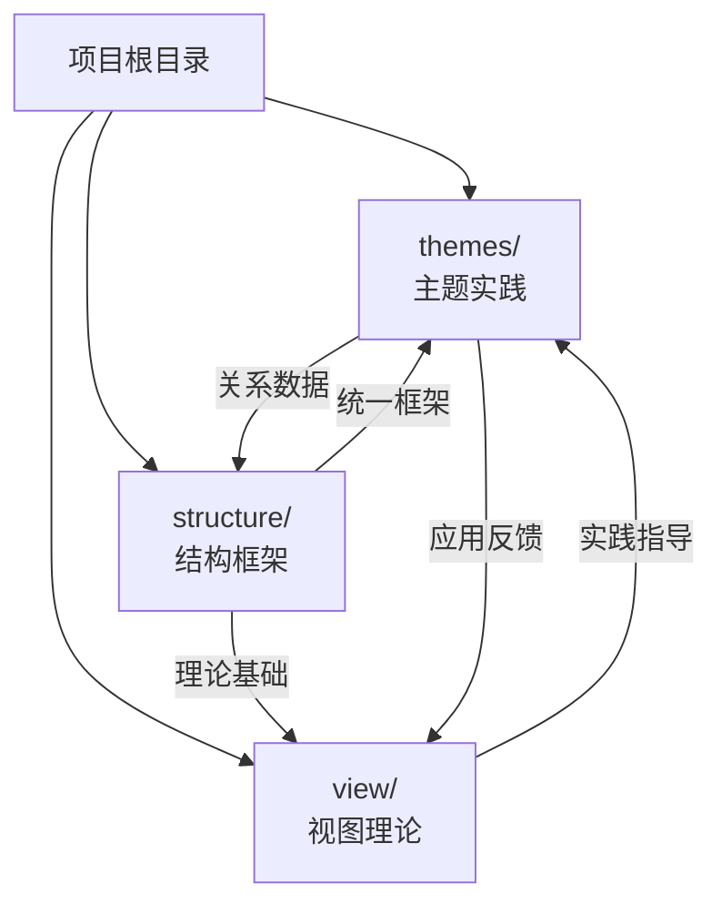
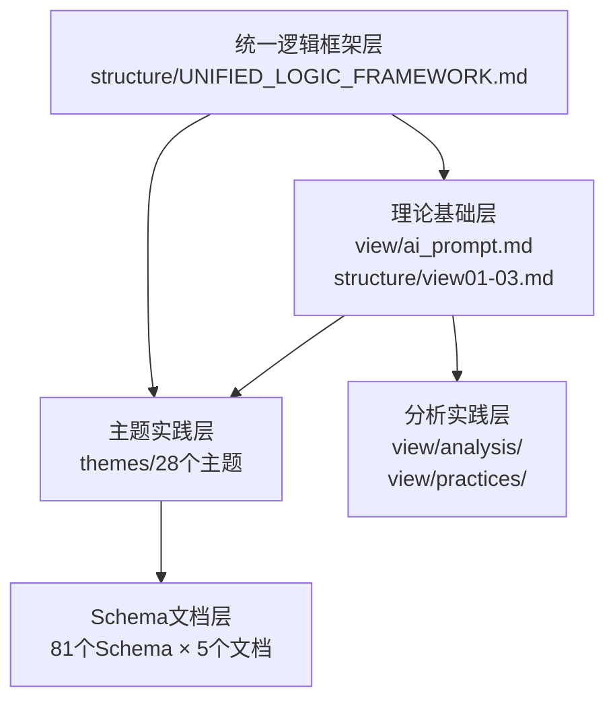
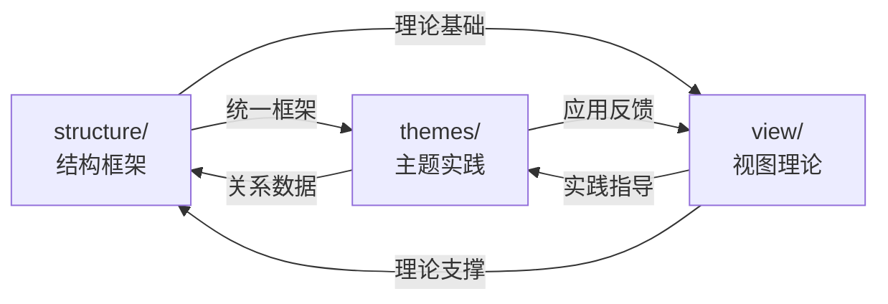
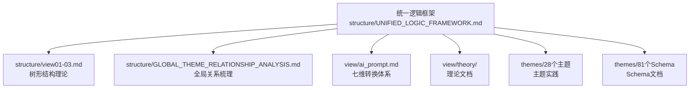

# 项目目录整合说明：Themes、View、Structure三大目录关系

## 📑 目录

- [项目目录整合说明：Themes、View、Structure三大目录关系](#项目目录整合说明themesviewstructure三大目录关系)
  - [📑 目录](#-目录)
  - [1. 概述](#1-概述)
    - [1.1 三大目录统计](#11-三大目录统计)
    - [1.2 核心关系](#12-核心关系)
  - [2. 三大目录定位与关系](#2-三大目录定位与关系)
    - [2.1 themes/ 目录：主题实践](#21-themes-目录主题实践)
    - [2.2 view/ 目录：视图理论](#22-view-目录视图理论)
    - [2.3 structure/ 目录：结构框架](#23-structure-目录结构框架)
  - [3. 目录内容体系](#3-目录内容体系)
    - [3.1 内容层次关系](#31-内容层次关系)
    - [3.2 内容统计](#32-内容统计)
  - [4. 目录间依赖关系](#4-目录间依赖关系)
    - [4.1 依赖关系图](#41-依赖关系图)
    - [4.2 依赖关系说明](#42-依赖关系说明)
  - [5. 统一逻辑框架整合](#5-统一逻辑框架整合)
    - [5.1 框架在三大目录中的位置](#51-框架在三大目录中的位置)
    - [5.2 框架整合路径](#52-框架整合路径)
  - [6. 文档使用路径](#6-文档使用路径)
    - [6.1 新手入门路径](#61-新手入门路径)
    - [6.2 理论研究者路径](#62-理论研究者路径)
    - [6.3 实践应用者路径](#63-实践应用者路径)
    - [6.4 全局关系研究者路径](#64-全局关系研究者路径)
  - [7. 总结](#7-总结)
    - [7.1 三大目录完整性](#71-三大目录完整性)
    - [7.2 目录间关系](#72-目录间关系)
    - [7.3 核心价值](#73-核心价值)

---

## 1. 概述

本项目包含**三大核心目录**：`themes/`、`view/`、`structure/`，它们共同构成了完整的DSL Schema转换理论与实践体系。

### 1.1 三大目录统计

| 目录 | 定位 | 文档数 | 主要内容 |
|------|------|--------|---------|
| **themes/** | 主题实践目录 | 425+ | 28个主题、81个Schema的完整文档集 |
| **view/** | 视图理论目录 | 30+ | 理论分析、实践指南、案例研究 |
| **structure/** | 结构框架目录 | 16 | 统一逻辑框架、全局关系梳理、理论论证 |

### 1.2 核心关系



---

## 2. 三大目录定位与关系

### 2.1 themes/ 目录：主题实践

**定位**：**主题实践目录**，包含28个主题、81个Schema的完整文档集。

**核心内容**：

- 28个主题目录（01-28）
- 81个Schema完整文档集（每个Schema包含5个标准文档）
- 主题级分析文档（标准分析、行业覆盖、内容深度等）

**文档结构**：

```text
themes/
├── 01_Industrial_Automation/     # 主题目录
│   ├── PLC_Schema/               # Schema目录
│   │   ├── 01_Overview.md        # 概述
│   │   ├── 02_Formal_Definition.md  # 形式化定义
│   │   ├── 03_Standards.md       # 标准对标
│   │   ├── 04_Transformation.md  # 转换体系
│   │   └── 05_Case_Studies.md    # 实践案例
│   └── README.md                 # 主题概览
├── ... (其他27个主题)
└── README.md                      # 主题总览
```

**关键文档**：

- `themes/README.md` - 主题总览
- `themes/DOCUMENT_INDEX.md` - 完整文档索引
- 各主题的`README.md` - 主题概览

---

### 2.2 view/ 目录：视图理论

**定位**：**视图理论目录**，包含理论分析、实践指南、案例研究。

**核心内容**：

- `ai_prompt.md` - DSL Schema转换理论（七维转换体系）
- `analysis/` - 分析文档（MCP协议、工具链对比、IoT实践等）
- `practices/` - 实践指南（性能优化、安全考虑、测试验证等）
- `theory/` - 理论文档（形式化证明、知识图谱、信息论等）
- `diagrams/` - 图表文档（思维导图、关系图等）

**文档结构**：

```text
view/
├── ai_prompt.md                  # 七维转换体系理论
├── analysis/                     # 分析文档
│   ├── 01_MCP_Protocol_Integration_Analysis.md
│   ├── 02_DSL_Transformation_Toolchain_Comparison.md
│   └── ...
├── practices/                     # 实践指南
│   ├── 09_Performance_Optimization.md
│   ├── 10_Security_Considerations.md
│   └── ...
├── theory/                        # 理论文档
│   ├── 06_Formal_Verification_Proofs.md
│   ├── 07_Knowledge_Graph_Mapping.md
│   └── ...
└── diagrams/                      # 图表文档
    └── ...
```

**关键文档**：

- `view/ai_prompt.md` - 七维转换体系理论
- `view/analysis/` - 各种分析文档
- `view/practices/` - 实践指南
- `view/theory/` - 理论文档

---

### 2.3 structure/ 目录：结构框架

**定位**：**结构框架目录**，包含统一逻辑框架、全局关系梳理、理论论证。

**核心内容**：

- **统一逻辑框架**（5个文档）：统一框架、思维表征、总结、快速入门、导航
- **全局关系梳理**（6个文档）：全局关系、转换路径、标准映射、应用场景等
- **扩展主题与任务**（2个文档）：扩展计划、可视化
- **树形结构论证**（3个文档）：view01-03.md

**文档结构**：

```text
structure/
├── UNIFIED_LOGIC_FRAMEWORK.md    # 统一逻辑框架
├── THINKING_REPRESENTATION_SYSTEM.md  # 思维表征体系
├── FRAMEWORK_QUICK_START.md      # 快速入门指南
├── FRAMEWORK_NAVIGATION.md       # 导航地图
├── FRAMEWORK_SUMMARY.md          # 框架总结
├── GLOBAL_THEME_RELATIONSHIP_ANALYSIS.md  # 全局关系梳理
├── DETAILED_THEME_CONVERSION_PATHS.md     # 转换路径分析
├── THEME_STANDARD_MAPPING_ANALYSIS.md     # 标准映射分析
├── THEME_APPLICATION_SCENARIOS_ANALYSIS.md # 应用场景分析
├── view01.md, view02.md, view03.md        # 树形结构论证
└── README.md                     # Structure目录导航
```

**关键文档**：

- `structure/FRAMEWORK_QUICK_START.md` - 快速入门指南（推荐新手）
- `structure/UNIFIED_LOGIC_FRAMEWORK.md` - 统一逻辑框架
- `structure/GLOBAL_THEME_RELATIONSHIP_ANALYSIS.md` - 全局关系梳理

---

## 3. 目录内容体系

### 3.1 内容层次关系



### 3.2 内容统计

| 层次 | 内容 | 数量 | 位置 |
|------|------|------|------|
| **L1: 统一框架层** | 统一逻辑框架文档 | 5个 | `structure/` |
| **L2: 理论基础层** | 理论文档 | 10+ | `view/`, `structure/view01-03.md` |
| **L3: 主题实践层** | 主题目录 | 28个 | `themes/` |
| **L4: Schema文档层** | Schema文档 | 405个 | `themes/*/Schema/` |
| **L5: 分析实践层** | 分析实践文档 | 20+ | `view/analysis/`, `view/practices/` |

---

## 4. 目录间依赖关系

### 4.1 依赖关系图



### 4.2 依赖关系说明

| 依赖方向 | 依赖类型 | 说明 | 示例 |
|---------|---------|------|------|
| **structure → themes** | 框架指导 | 统一逻辑框架指导主题实践 | `UNIFIED_LOGIC_FRAMEWORK.md` → 所有主题 |
| **structure → view** | 理论基础 | 树形结构理论支撑视图理论 | `view01-03.md` → `view/theory/` |
| **view → themes** | 实践指导 | 视图理论指导主题实践 | `view/ai_prompt.md` → 所有Schema转换 |
| **themes → view** | 应用反馈 | 主题实践反馈到视图理论 | Schema案例 → `view/practices/` |
| **themes → structure** | 关系数据 | 主题关系数据支撑结构框架 | 主题关系 → `GLOBAL_THEME_RELATIONSHIP_ANALYSIS.md` |
| **view → structure** | 理论支撑 | 视图理论支撑结构框架 | `view/ai_prompt.md` → `UNIFIED_LOGIC_FRAMEWORK.md` |

---

## 5. 统一逻辑框架整合

### 5.1 框架在三大目录中的位置

**统一逻辑框架**是连接三大目录的核心纽带：



### 5.2 框架整合路径

**从统一逻辑框架到各目录**：

1. **框架 → structure**：
   - `UNIFIED_LOGIC_FRAMEWORK.md` → `view01-03.md`（元模型层）
   - `UNIFIED_LOGIC_FRAMEWORK.md` → `GLOBAL_THEME_RELATIONSHIP_ANALYSIS.md`（表征层）

2. **框架 → view**：
   - `UNIFIED_LOGIC_FRAMEWORK.md` → `view/ai_prompt.md`（转换层）
   - `UNIFIED_LOGIC_FRAMEWORK.md` → `view/theory/`（证明层）

3. **框架 → themes**：
   - `UNIFIED_LOGIC_FRAMEWORK.md` → 所有主题（定义层）
   - `UNIFIED_LOGIC_FRAMEWORK.md` → 所有Schema（应用层）

---

## 6. 文档使用路径

### 6.1 新手入门路径

```text
1. structure/FRAMEWORK_QUICK_START.md (快速入门)
   ↓
2. structure/FRAMEWORK_NAVIGATION.md (导航地图)
   ↓
3. structure/UNIFIED_LOGIC_FRAMEWORK.md (统一框架)
   ↓
4. view/ai_prompt.md (七维转换体系)
   ↓
5. themes/README.md (主题总览)
   ↓
6. 选择具体主题深入阅读
```

### 6.2 理论研究者路径

```text
1. structure/UNIFIED_LOGIC_FRAMEWORK.md (统一框架)
   ↓
2. structure/view01-03.md (树形结构理论)
   ↓
3. view/ai_prompt.md (七维转换体系)
   ↓
4. view/theory/ (理论文档)
   ↓
5. themes/05_DSL_Theory/ (DSL理论主题)
```

### 6.3 实践应用者路径

```text
1. structure/FRAMEWORK_QUICK_START.md (快速入门)
   ↓
2. view/practices/ (实践指南)
   ↓
3. themes/README.md (主题总览)
   ↓
4. 选择具体主题和Schema
   ↓
5. 查看Schema的04_Transformation.md (转换实现)
   ↓
6. 查看Schema的05_Case_Studies.md (实践案例)
```

### 6.4 全局关系研究者路径

```text
1. structure/GLOBAL_THEME_RELATIONSHIP_ANALYSIS.md (全局关系)
   ↓
2. structure/DETAILED_THEME_CONVERSION_PATHS.md (转换路径)
   ↓
3. structure/THEME_STANDARD_MAPPING_ANALYSIS.md (标准映射)
   ↓
4. structure/THEME_APPLICATION_SCENARIOS_ANALYSIS.md (应用场景)
   ↓
5. themes/ (具体主题实践)
```

---

## 7. 总结

### 7.1 三大目录完整性

- ✅ **themes/**：28个主题、81个Schema、425+个文档
- ✅ **view/**：30+个理论、分析、实践文档
- ✅ **structure/**：16个结构框架文档

### 7.2 目录间关系

- ✅ **统一逻辑框架**连接三大目录
- ✅ **依赖关系**清晰明确
- ✅ **使用路径**完整

### 7.3 核心价值

1. **themes/**：提供完整的主题实践文档
2. **view/**：提供理论分析和实践指导
3. **structure/**：提供统一逻辑框架和全局关系梳理

---

**文档创建时间**：2025-01-21
**文档版本**：v1.0
**维护者**：DSL Schema研究团队

**相关文档**：

- `structure/UNIFIED_LOGIC_FRAMEWORK.md` - 统一逻辑框架
- `structure/STRUCTURE_DIRECTORY_INTEGRATION.md` - Structure目录整合
- `themes/README.md` - 主题总览
- `README.md` - 项目主文档
