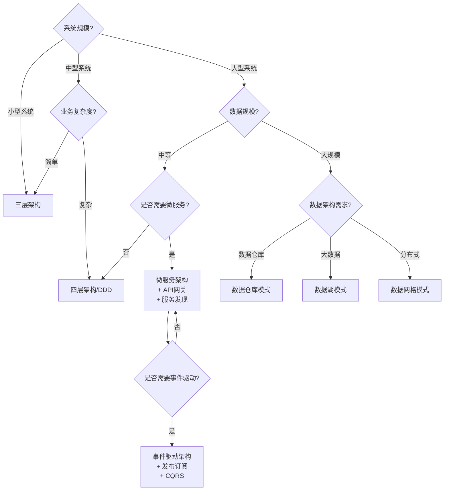

# 架构模式总结

## 📑 目录

- [架构模式总结](#架构模式总结)
  - [📑 目录](#-目录)
  - [1. 概述](#1-概述)
  - [2. 分层架构模式](#2-分层架构模式)
    - [2.1 三层架构（3-Tier Architecture）](#21-三层架构3-tier-architecture)
    - [2.2 四层架构（4-Tier Architecture）](#22-四层架构4-tier-architecture)
    - [2.3 五层架构（5-Tier Architecture）](#23-五层架构5-tier-architecture)
  - [3. 微服务架构模式](#3-微服务架构模式)
    - [3.1 API网关模式（API Gateway Pattern）](#31-api网关模式api-gateway-pattern)
    - [3.2 服务发现模式（Service Discovery Pattern）](#32-服务发现模式service-discovery-pattern)
    - [3.3 配置中心模式（Configuration Center Pattern）](#33-配置中心模式configuration-center-pattern)
    - [3.4 熔断器模式（Circuit Breaker Pattern）](#34-熔断器模式circuit-breaker-pattern)
  - [4. 事件驱动架构模式](#4-事件驱动架构模式)
    - [4.1 发布-订阅模式（Publish-Subscribe Pattern）](#41-发布-订阅模式publish-subscribe-pattern)
    - [4.2 事件溯源模式（Event Sourcing Pattern）](#42-事件溯源模式event-sourcing-pattern)
    - [4.3 CQRS模式（Command Query Responsibility Segregation）](#43-cqrs模式command-query-responsibility-segregation)
  - [5. 数据架构模式](#5-数据架构模式)
    - [5.1 数据仓库模式（Data Warehouse Pattern）](#51-数据仓库模式data-warehouse-pattern)
    - [5.2 数据湖模式（Data Lake Pattern)](#52-数据湖模式data-lake-pattern)
    - [5.3 数据网格模式（Data Mesh Pattern）](#53-数据网格模式data-mesh-pattern)
  - [6. 架构模式选择指南](#6-架构模式选择指南)
    - [6.1 模式选择决策树](#61-模式选择决策树)
    - [6.2 模式组合建议](#62-模式组合建议)
    - [6.3 在DSL Schema转换项目中的应用建议](#63-在dsl-schema转换项目中的应用建议)
  - [7. 总结](#7-总结)

---

## 1. 概述

本文档总结DSL Schema转换中的**12个架构模式**，分为4类：分层架构、微服务架构、事件驱动架构、数据架构。

---

## 2. 分层架构模式

### 2.1 三层架构（3-Tier Architecture）

**定义**：表示层、业务层、数据层三层架构。

**架构图**：

```text
┌─────────────────┐
│   表示层 (UI)    │  ← 用户界面、API接口
└────────┬────────┘
         │
┌────────▼────────┐
│   业务层 (BL)    │  ← 业务逻辑、转换规则
└────────┬────────┘
         │
┌────────▼────────┐
│   数据层 (DL)    │  ← 数据存储、数据库
└─────────────────┘
```

**适用场景**：

- 传统Web应用
- 企业级应用
- 简单系统架构
- Schema转换工具的基础架构

**在DSL Schema转换中的应用**：

- **表示层**：Schema编辑器、转换配置界面、API Gateway
- **业务层**：转换引擎、规则引擎、验证引擎
- **数据层**：Schema存储、转换历史、PostgreSQL数据库

**优缺点**：

- ✅ **优点**：结构简单、易于理解、开发快速
- ❌ **缺点**：业务层可能过于臃肿、难以扩展

**实现示例**：

```python
# 表示层：API接口
class SchemaConversionAPI:
    def convert_schema(self, source_schema: dict, target_type: str):
        # 调用业务层
        return self.business_layer.convert(source_schema, target_type)

# 业务层：转换逻辑
class SchemaConversionService:
    def convert(self, source_schema: dict, target_type: str):
        # 业务逻辑处理
        converted = self.transformer.transform(source_schema, target_type)
        # 保存到数据层
        return self.data_layer.save(converted)

# 数据层：数据存储
class SchemaRepository:
    def save(self, schema: dict):
        # 保存到数据库
        pass
```

### 2.2 四层架构（4-Tier Architecture）

**定义**：表示层、应用层、领域层、基础设施层四层架构。

**架构图**：

```text
┌─────────────────┐
│   表示层 (UI)    │  ← 用户界面、API接口
└────────┬────────┘
         │
┌────────▼────────┐
│   应用层 (AL)    │  ← 应用服务、用例编排
└────────┬────────┘
         │
┌────────▼────────┐
│   领域层 (DL)    │  ← 领域模型、业务规则
└────────┬────────┘
         │
┌────────▼────────┐
│ 基础设施层 (IL)  │  ← 数据访问、外部服务
└─────────────────┘
```

**适用场景**：

- 领域驱动设计（DDD）
- 复杂业务系统
- 需要领域模型分离
- 大型Schema转换系统

**在DSL Schema转换中的应用**：

- **表示层**：Schema编辑器、转换配置界面
- **应用层**：转换用例、验证用例、版本管理用例
- **领域层**：Schema领域模型、转换规则领域模型、验证规则领域模型
- **基础设施层**：PostgreSQL存储、文件系统、外部API

**优缺点**：

- ✅ **优点**：领域模型清晰、业务逻辑集中、易于测试
- ❌ **缺点**：架构复杂、开发成本高

**实现示例**：

```python
# 应用层：用例编排
class ConvertSchemaUseCase:
    def __init__(self, schema_repo, converter):
        self.schema_repo = schema_repo
        self.converter = converter

    def execute(self, source_id: str, target_type: str):
        # 获取源Schema
        source = self.schema_repo.get(source_id)
        # 执行转换
        return self.converter.convert(source, target_type)

# 领域层：领域模型
class Schema:
    def __init__(self, id: str, type: str, content: dict):
        self.id = id
        self.type = type
        self.content = content

    def validate(self):
        # 领域验证逻辑
        pass

# 基础设施层：数据访问
class PostgreSQLSchemaRepository:
    def get(self, id: str):
        # 从PostgreSQL获取
        pass
```

### 2.3 五层架构（5-Tier Architecture）

**定义**：表示层、应用层、领域层、基础设施层、数据层五层架构。

**架构图**：

```text
┌─────────────────┐
│   表示层 (UI)    │
└────────┬────────┘
         │
┌────────▼────────┐
│   应用层 (AL)    │
└────────┬────────┘
         │
┌────────▼────────┐
│   领域层 (DL)    │
└────────┬────────┘
         │
┌────────▼────────┐
│ 基础设施层 (IL)  │
└────────┬────────┘
         │
┌────────▼────────┐
│   数据层 (DL)    │  ← 独立的数据访问层
└─────────────────┘
```

**适用场景**：

- 大型企业系统
- 需要数据层独立
- 需要完整的分层架构
- 多数据源系统

**在DSL Schema转换中的应用**：

- **表示层**：Web UI、CLI、API Gateway
- **应用层**：转换服务、验证服务、版本管理服务
- **领域层**：Schema模型、转换规则模型
- **基础设施层**：数据访问抽象、缓存、消息队列
- **数据层**：PostgreSQL、MongoDB、文件系统

**优缺点**：

- ✅ **优点**：层次清晰、职责明确、易于扩展、支持多数据源
- ❌ **缺点**：架构复杂、开发成本高、可能存在过度设计

**实现示例**：

```python
# 数据层：数据访问接口
class IDataAccess:
    def save(self, entity):
        raise NotImplementedError

    def get(self, id):
        raise NotImplementedError

# 基础设施层：PostgreSQL实现
class PostgreSQLDataAccess(IDataAccess):
    def save(self, entity):
        # PostgreSQL实现
        pass

# 领域层：领域模型
class SchemaEntity:
    def __init__(self, id, content):
        self.id = id
        self.content = content
```

---

## 3. 微服务架构模式

### 3.1 API网关模式（API Gateway Pattern）

**定义**：统一API入口，提供API路由、认证、限流等功能。

**架构图**：

```text
┌─────────────┐
│   客户端     │
└──────┬──────┘
       │
┌──────▼──────────────────┐
│     API Gateway         │  ← 统一入口
│  - 路由                  │
│  - 认证/授权             │
│  - 限流                  │
│  - 监控                  │
└──────┬──────────────────┘
       │
   ┌───┴───┬────────┬────────┐
   │       │        │        │
┌──▼──┐ ┌─▼──┐ ┌──▼──┐ ┌──▼──┐
│服务1│ │服务2│ │服务3│ │服务N│
└─────┘ └────┘ └─────┘ └─────┘
```

**适用场景**：

- 微服务架构
- 需要统一API管理
- 需要API安全控制
- 多服务聚合

**在DSL Schema转换中的应用**：

- **路由**：根据Schema类型路由到不同的转换服务（OpenAPI转换器、AsyncAPI转换器等）
- **认证**：API密钥验证、OAuth2认证
- **限流**：防止转换服务过载
- **监控**：转换请求统计、性能监控

**优缺点**：

- ✅ **优点**：统一入口、简化客户端、集中安全控制、易于监控
- ❌ **缺点**：单点故障风险、可能成为性能瓶颈

**实现示例**：

```python
# API Gateway实现
class SchemaConversionGateway:
    def __init__(self):
        self.auth_service = AuthService()
        self.rate_limiter = RateLimiter()
        self.router = ServiceRouter()

    def convert_schema(self, request):
        # 认证
        if not self.auth_service.authenticate(request):
            raise UnauthorizedError()

        # 限流
        if not self.rate_limiter.allow(request.user_id):
            raise RateLimitError()

        # 路由到对应服务
        service = self.router.route(request.schema_type)
        return service.convert(request)
```

### 3.2 服务发现模式（Service Discovery Pattern）

**定义**：服务注册与发现，用于动态发现和注册服务。

**架构图**：

```text
┌──────────────┐
│  服务注册中心  │  ← Consul/Eureka/Zookeeper
└──────┬───────┘
       │
   ┌───┴───┬────────┬────────┐
   │       │        │        │
┌──▼──┐ ┌─▼──┐ ┌──▼──┐ ┌──▼──┐
│服务1│ │服务2│ │服务3│ │服务N│
│注册 │ │注册 │ │注册 │ │注册 │
└─────┘ └────┘ └─────┘ └─────┘
```

**适用场景**：

- 微服务架构
- 服务动态部署
- 需要服务自动发现
- 容器化部署（Kubernetes）

**在DSL Schema转换中的应用**：

- **服务注册**：转换服务启动时注册到服务发现中心
- **服务发现**：API Gateway动态发现可用的转换服务
- **负载均衡**：多个转换服务实例的负载均衡
- **健康检查**：监控服务健康状态

**优缺点**：

- ✅ **优点**：动态服务管理、自动负载均衡、高可用性
- ❌ **缺点**：需要额外的服务发现组件、网络延迟

**实现示例**：

```python
# 服务注册
class ConversionService:
    def __init__(self):
        self.service_registry = ServiceRegistry()

    def start(self):
        # 注册服务
        self.service_registry.register(
            service_name="schema-converter",
            address="http://localhost:8080",
            health_check=self.health_check
        )

# 服务发现
class ServiceDiscovery:
    def discover(self, service_name: str):
        # 从注册中心发现服务
        services = self.registry.get_services(service_name)
        # 负载均衡选择
        return self.load_balancer.select(services)
```

### 3.3 配置中心模式（Configuration Center Pattern）

**定义**：集中配置管理，用于统一管理配置信息。

**架构图**：

```text
┌──────────────┐
│  配置中心     │  ← Config Server
│  - 转换规则   │
│  - 验证规则   │
│  - 服务配置   │
└──────┬───────┘
       │
   ┌───┴───┬────────┬────────┐
   │       │        │        │
┌──▼──┐ ┌─▼──┐ ┌──▼──┐ ┌──▼──┐
│服务1│ │服务2│ │服务3│ │服务N│
│订阅 │ │订阅 │ │订阅 │ │订阅 │
└─────┘ └────┘ └─────┘ └─────┘
```

**适用场景**：

- 微服务架构
- 需要集中配置管理
- 需要配置动态更新
- 多环境配置管理

**在DSL Schema转换中的应用**：

- **转换规则配置**：OpenAPI到AsyncAPI的转换规则
- **验证规则配置**：Schema验证规则
- **服务配置**：数据库连接、缓存配置
- **环境配置**：开发、测试、生产环境配置

**优缺点**：

- ✅ **优点**：集中管理、动态更新、版本控制、环境隔离
- ❌ **缺点**：单点故障风险、配置同步延迟

**实现示例**：

```python
# 配置中心客户端
class ConfigClient:
    def __init__(self, config_server_url):
        self.config_server = ConfigServer(config_server_url)
        self.config_cache = {}

    def get_config(self, key: str):
        # 从配置中心获取配置
        if key not in self.config_cache:
            self.config_cache[key] = self.config_server.get(key)
        return self.config_cache[key]

    def watch_config(self, key: str, callback):
        # 监听配置变更
        self.config_server.watch(key, callback)

# 使用配置
class ConversionService:
    def __init__(self, config_client):
        self.config = config_client
        # 监听转换规则变更
        self.config.watch("conversion.rules", self.reload_rules)

    def reload_rules(self, new_rules):
        # 重新加载转换规则
        self.rules = new_rules
```

### 3.4 熔断器模式（Circuit Breaker Pattern）

**定义**：服务容错，用于防止服务雪崩。

**状态图**：

```text
   ┌─────────┐
   │  CLOSED │  ← 正常状态
   └────┬────┘
        │ 失败次数 > 阈值
        ▼
   ┌─────────┐
   │  OPEN   │  ← 熔断状态，直接返回错误
   └────┬────┘
        │ 超时
        ▼
   ┌─────────┐
   │ HALF-OPEN│ ← 半开状态，尝试恢复
   └────┬────┘
        │
   ┌────┴────┐
   │成功/失败 │
   └─────────┘
```

**适用场景**：

- 微服务架构
- 需要服务容错
- 需要防止服务雪崩
- 外部服务调用

**在DSL Schema转换中的应用**：

- **转换服务容错**：当转换服务不可用时，快速失败
- **外部API调用**：调用外部验证服务时的容错
- **数据库连接**：数据库连接失败时的容错
- **缓存服务**：缓存服务不可用时的降级

**优缺点**：

- ✅ **优点**：防止服务雪崩、快速失败、自动恢复
- ❌ **缺点**：可能误判、需要调优参数

**实现示例**：

```python
# 熔断器实现
class CircuitBreaker:
    def __init__(self, failure_threshold=5, timeout=60):
        self.failure_threshold = failure_threshold
        self.timeout = timeout
        self.failure_count = 0
        self.state = "CLOSED"  # CLOSED, OPEN, HALF_OPEN
        self.last_failure_time = None

    def call(self, func, *args, **kwargs):
        if self.state == "OPEN":
            if time.time() - self.last_failure_time > self.timeout:
                self.state = "HALF_OPEN"
            else:
                raise CircuitBreakerOpenError()

        try:
            result = func(*args, **kwargs)
            if self.state == "HALF_OPEN":
                self.state = "CLOSED"
                self.failure_count = 0
            return result
        except Exception as e:
            self.failure_count += 1
            self.last_failure_time = time.time()
            if self.failure_count >= self.failure_threshold:
                self.state = "OPEN"
            raise e

# 使用熔断器
class ConversionService:
    def __init__(self):
        self.circuit_breaker = CircuitBreaker()

    def convert(self, schema):
        return self.circuit_breaker.call(
            self._do_convert, schema
        )
```

---

## 4. 事件驱动架构模式

### 4.1 发布-订阅模式（Publish-Subscribe Pattern）

**定义**：事件发布与订阅，用于解耦事件生产者和消费者。

**架构图**：

```text
┌──────────┐
│ 发布者1   │──┐
└──────────┘  │
              │
┌──────────┐  │    ┌──────────────┐
│ 发布者2   │──┼───▶│  事件总线     │
└──────────┘  │    │ (Event Bus)  │
              │    └──────┬───────┘
┌──────────┐  │           │
│ 发布者N   │──┘           │
└──────────┘              │
                    ┌──────┴──────┬─────────┐
                    │              │         │
              ┌─────▼───┐   ┌─────▼───┐ ┌──▼────┐
              │订阅者1   │   │订阅者2   │ │订阅者N │
              └─────────┘   └─────────┘ └───────┘
```

**适用场景**：

- 事件驱动架构
- 需要解耦组件
- 需要异步通信
- 一对多通信

**在DSL Schema转换中的应用**：

- **Schema变更通知**：Schema更新时通知所有相关服务
- **转换完成通知**：转换完成后通知监控、日志等服务
- **验证结果通知**：验证完成后通知相关系统
- **版本发布通知**：新版本发布时通知所有订阅者

**优缺点**：

- ✅ **优点**：解耦、异步、可扩展、灵活
- ❌ **缺点**：事件顺序、一致性保证、调试困难

**实现示例**：

```python
# 事件总线
class EventBus:
    def __init__(self):
        self.subscribers = {}

    def subscribe(self, event_type: str, handler):
        if event_type not in self.subscribers:
            self.subscribers[event_type] = []
        self.subscribers[event_type].append(handler)

    def publish(self, event_type: str, event_data):
        if event_type in self.subscribers:
            for handler in self.subscribers[event_type]:
                handler(event_data)

# 发布者
class SchemaService:
    def __init__(self, event_bus):
        self.event_bus = event_bus

    def update_schema(self, schema_id, new_content):
        # 更新Schema
        # ...
        # 发布事件
        self.event_bus.publish("schema.updated", {
            "schema_id": schema_id,
            "content": new_content
        })

# 订阅者
class NotificationService:
    def __init__(self, event_bus):
        event_bus.subscribe("schema.updated", self.on_schema_updated)

    def on_schema_updated(self, event_data):
        # 发送通知
        print(f"Schema {event_data['schema_id']} updated")
```

### 4.2 事件溯源模式（Event Sourcing Pattern）

**定义**：事件存储与回放，用于存储和回放事件。

**架构图**：

```text
┌──────────┐
│  命令    │
└────┬─────┘
     │
     ▼
┌──────────┐      ┌──────────────┐
│ 命令处理  │────▶│  事件存储     │
└──────────┘      │ (Event Store)│
     │            └──────┬───────┘
     │                   │
     ▼                   │
┌──────────┐             │
│ 状态重建  │◀────────────┘
└──────────┘     事件回放
```

**适用场景**：

- 事件驱动架构
- 需要事件历史
- 需要事件回放
- 审计需求

**在DSL Schema转换中的应用**：

- **转换历史**：记录所有转换操作的事件
- **状态重建**：通过事件回放重建Schema状态
- **审计追踪**：完整的操作历史记录
- **时间旅行**：查看任意时间点的Schema状态

**优缺点**：

- ✅ **优点**：完整历史、可回放、审计友好、时间旅行
- ❌ **缺点**：存储开销、查询复杂、事件版本管理

**实现示例**：

```python
# 事件存储
class EventStore:
    def __init__(self):
        self.events = []

    def append(self, aggregate_id: str, event):
        self.events.append({
            "aggregate_id": aggregate_id,
            "event_type": event.__class__.__name__,
            "event_data": event.__dict__,
            "timestamp": time.time()
        })

    def get_events(self, aggregate_id: str):
        return [e for e in self.events if e["aggregate_id"] == aggregate_id]

# 事件
class SchemaCreatedEvent:
    def __init__(self, schema_id, content):
        self.schema_id = schema_id
        self.content = content

class SchemaUpdatedEvent:
    def __init__(self, schema_id, changes):
        self.schema_id = schema_id
        self.changes = changes

# 聚合根
class SchemaAggregate:
    def __init__(self, event_store):
        self.event_store = event_store
        self.state = {}

    def create(self, schema_id, content):
        event = SchemaCreatedEvent(schema_id, content)
        self.event_store.append(schema_id, event)
        self.apply(event)

    def apply(self, event):
        if isinstance(event, SchemaCreatedEvent):
            self.state[event.schema_id] = event.content
        elif isinstance(event, SchemaUpdatedEvent):
            self.state[event.schema_id].update(event.changes)

    def rebuild(self, schema_id):
        events = self.event_store.get_events(schema_id)
        for event in events:
            self.apply(event)
```

### 4.3 CQRS模式（Command Query Responsibility Segregation）

**定义**：命令查询职责分离，用于分离命令和查询。

**架构图**：

```text
┌──────────┐      ┌──────────┐
│  命令    │      │  查询    │
└────┬─────┘      └────┬─────┘
     │                 │
     ▼                 ▼
┌──────────┐      ┌──────────┐
│ 写模型    │      │ 读模型    │
│ (Write)  │      │ (Read)   │
└────┬─────┘      └────┬─────┘
     │                 │
     ▼                 ▼
┌──────────┐      ┌──────────┐
│ 事件存储  │      │ 读数据库  │
└──────────┘      └──────────┘
```

**适用场景**：

- 事件驱动架构
- 需要读写分离
- 需要性能优化
- 读写负载差异大

**在DSL Schema转换中的应用**：

- **写模型**：Schema创建、更新、删除操作
- **读模型**：Schema查询、搜索、统计操作
- **读写分离**：写操作使用事件存储，读操作使用优化的查询数据库
- **性能优化**：读模型可以针对查询场景优化

**优缺点**：

- ✅ **优点**：读写分离、性能优化、独立扩展、灵活查询
- ❌ **缺点**：数据一致性、复杂度增加、最终一致性

**实现示例**：

```python
# 命令端（写模型）
class SchemaCommandHandler:
    def __init__(self, event_store):
        self.event_store = event_store

    def handle_create(self, command):
        event = SchemaCreatedEvent(command.schema_id, command.content)
        self.event_store.append(command.schema_id, event)

    def handle_update(self, command):
        event = SchemaUpdatedEvent(command.schema_id, command.changes)
        self.event_store.append(command.schema_id, event)

# 查询端（读模型）
class SchemaQueryHandler:
    def __init__(self, read_db):
        self.read_db = read_db

    def get_schema(self, schema_id: str):
        return self.read_db.get(schema_id)

    def search_schemas(self, query: str):
        return self.read_db.search(query)

    def get_statistics(self):
        return self.read_db.get_stats()

# 投影（同步写模型到读模型）
class SchemaProjection:
    def __init__(self, event_store, read_db):
        self.event_store = event_store
        self.read_db = read_db

    def sync(self):
        events = self.event_store.get_new_events()
        for event in events:
            if isinstance(event, SchemaCreatedEvent):
                self.read_db.create(event.schema_id, event.content)
            elif isinstance(event, SchemaUpdatedEvent):
                self.read_db.update(event.schema_id, event.changes)
```

---

## 5. 数据架构模式

### 5.1 数据仓库模式（Data Warehouse Pattern）

**定义**：Kimball、Inmon、Data Vault数据仓库模式。

**架构图**：

```text
┌──────────┐  ┌──────────┐  ┌──────────┐
│ 数据源1  │  │ 数据源2   │  │ 数据源N   │
└────┬─────┘  └────┬─────┘  └────┬─────┘
     │              │            │
     └──────────────┼────────────┘
                  │ ETL
                  ▼
         ┌─────────────────┐
         │   数据仓库       │
         │  (Data Warehouse)│
         └────────┬─────────┘
                  │
         ┌────────▼─────────┐
         │   数据分析       │
         │  OLAP/BI         │
         └──────────────────┘
```

**三种模式对比**：

| 模式 | 特点 | 适用场景 |
|------|------|---------|
| **Kimball** | 星型/雪花型模型，自底向上 | 快速交付、业务导向 |
| **Inmon** | 规范化模型，自顶向下 | 企业级、数据一致性 |
| **Data Vault** | 中心-链接-卫星模型 | 敏捷、历史追踪 |

**适用场景**：

- 数据仓库建设
- 数据分析
- 历史数据存储
- 商业智能（BI）

**在DSL Schema转换中的应用**：

- **Schema元数据仓库**：存储所有Schema的元数据
- **转换历史仓库**：存储转换历史记录
- **分析报表**：Schema使用统计、转换成功率分析
- **数据挖掘**：转换模式发现、优化建议

**优缺点**：

- ✅ **优点**：结构化存储、支持复杂查询、历史数据保留
- ❌ **缺点**：ETL复杂、数据延迟、存储成本高

**实现示例**：

```python
# 数据仓库ETL
class SchemaDataWarehouse:
    def __init__(self):
        self.staging_area = StagingArea()
        self.dw = DataWarehouse()

    def etl_process(self):
        # Extract: 从源系统提取
        source_data = self.extract_from_sources()

        # Transform: 转换和清洗
        transformed = self.transform(source_data)

        # Load: 加载到数据仓库
        self.load_to_dw(transformed)

    def extract_from_sources(self):
        # 从多个数据源提取
        schemas = []
        schemas.extend(self.get_openapi_schemas())
        schemas.extend(self.get_asyncapi_schemas())
        return schemas

    def transform(self, data):
        # 数据转换和标准化
        return [self.normalize_schema(s) for s in data]

    def load_to_dw(self, data):
        # 加载到数据仓库
        self.dw.insert(data)
```

### 5.2 数据湖模式（Data Lake Pattern)

**定义**：原始数据存储，用于存储原始数据。

**架构图**：

```text
┌──────────┐  ┌──────────┐  ┌──────────┐
│ 数据源1   │  │ 数据源2   │  │ 数据源N   │
└────┬─────┘  └────┬─────┘  └────┬─────┘
     │            │            │
     └────────────┼────────────┘
                  │ 直接存储
                  ▼
         ┌─────────────────┐
         │    数据湖        │
         │  (Data Lake)     │
         │  - 原始数据       │
         │  - 结构化数据     │
         │  - 非结构化数据   │
         └────────┬─────────┘
                  │
         ┌────────▼─────────┐
         │   数据探索       │
         │  分析/ML         │
         └──────────────────┘
```

**适用场景**：

- 大数据存储
- 原始数据保留
- 数据探索分析
- 机器学习

**在DSL Schema转换中的应用**：

- **原始Schema存储**：存储所有原始Schema文件
- **转换结果存储**：存储转换后的Schema
- **日志数据**：转换日志、错误日志
- **机器学习**：训练转换模型、优化转换规则

**优缺点**：

- ✅ **优点**：存储成本低、支持多种格式、灵活查询、支持大数据
- ❌ **缺点**：数据质量、治理困难、查询性能、数据沼泽风险

**实现示例**：

```python
# 数据湖实现
class SchemaDataLake:
    def __init__(self, storage_backend):
        self.storage = storage_backend  # S3, HDFS等

    def store_raw_schema(self, schema_id: str, raw_data: bytes):
        # 存储原始Schema
        path = f"raw/{schema_id}/{timestamp()}.json"
        self.storage.put(path, raw_data)

    def store_converted_schema(self, schema_id: str, converted_data: dict):
        # 存储转换后的Schema
        path = f"converted/{schema_id}/{timestamp()}.json"
        self.storage.put(path, json.dumps(converted_data))

    def query(self, query: str):
        # 使用Spark/Presto等查询引擎
        return self.query_engine.execute(query)

    def analyze(self, schema_id: str):
        # 数据分析
        raw = self.get_raw_schema(schema_id)
        converted = self.get_converted_schema(schema_id)
        return self.analyze_differences(raw, converted)
```

### 5.3 数据网格模式（Data Mesh Pattern）

**定义**：分布式数据管理，用于分布式数据管理。

**架构图**：

```text
┌─────────────────────────────────────┐
│         数据网格平台                 │
│  - 数据目录                          │
│  - 数据治理                          │
│  - 数据访问控制                      │
└─────────────────────────────────────┘
         │
    ┌────┴────┬─────────┬─────────┐
    │         │         │         │
┌───▼───┐ ┌──▼───┐ ┌───▼───┐ ┌───▼───┐
│领域1   │ │领域2 │ │领域3  │ │领域N   │
│数据产品│ │数据产品│ │数据产品│ │数据产品│
└───────┘ └──────┘ └───────┘ └───────┘
```

**核心原则**：

1. **领域所有权**：每个领域拥有自己的数据
2. **数据即产品**：数据作为产品管理
3. **自助式数据平台**：提供统一的数据平台
4. **联合治理**：统一的数据治理标准

**适用场景**：

- 大型企业数据管理
- 分布式数据架构
- 数据所有权分散
- 多团队协作

**在DSL Schema转换中的应用**：

- **领域数据产品**：
  - OpenAPI领域：OpenAPI Schema数据产品
  - AsyncAPI领域：AsyncAPI Schema数据产品
  - IoT领域：IoT Schema数据产品
- **数据目录**：统一的Schema目录，便于发现和访问
- **数据治理**：统一的Schema标准、质量规则
- **数据访问**：统一的API访问各个领域的数据产品

**优缺点**：

- ✅ **优点**：领域自治、可扩展、数据所有权清晰、支持大规模
- ❌ **缺点**：复杂度高、需要组织变革、治理挑战

**实现示例**：

```python
# 数据产品接口
class DataProduct:
    def __init__(self, domain: str, name: str):
        self.domain = domain
        self.name = name
        self.metadata = {}

    def get_data(self, query):
        raise NotImplementedError

    def get_metadata(self):
        return self.metadata

# OpenAPI领域数据产品
class OpenAPISchemaDataProduct(DataProduct):
    def __init__(self):
        super().__init__("OpenAPI", "openapi-schemas")
        self.schemas = {}

    def get_data(self, query):
        # 返回OpenAPI Schema数据
        return self.schemas.get(query.schema_id)

    def get_metadata(self):
        return {
            "domain": self.domain,
            "name": self.name,
            "schema_count": len(self.schemas),
            "format": "OpenAPI 3.0"
        }

# 数据网格平台
class DataMeshPlatform:
    def __init__(self):
        self.data_products = {}
        self.catalog = DataCatalog()

    def register_data_product(self, product: DataProduct):
        self.data_products[f"{product.domain}/{product.name}"] = product
        self.catalog.register(product)

    def discover_data_products(self, domain: str = None):
        return self.catalog.search(domain=domain)

    def access_data(self, product_id: str, query):
        product = self.data_products[product_id]
        return product.get_data(query)
```

---

## 6. 架构模式选择指南

### 6.1 模式选择决策树



### 6.2 模式组合建议

**常见组合**：

1. **微服务 + API网关 + 服务发现 + 配置中心**
   - 适用于：大型微服务系统
   - 示例：多转换服务的Schema转换平台

2. **四层架构 + 事件驱动 + CQRS**
   - 适用于：复杂业务系统，需要事件历史
   - 示例：需要完整审计的Schema管理系统

3. **数据网格 + 微服务 + 事件驱动**
   - 适用于：大型企业，多领域数据管理
   - 示例：跨领域的Schema数据平台

4. **数据湖 + 事件驱动 + 流处理**
   - 适用于：大数据场景，实时处理
   - 示例：实时Schema转换和分析系统

### 6.3 在DSL Schema转换项目中的应用建议

**当前项目推荐架构**：

1. **核心转换服务**：四层架构（应用层、领域层、基础设施层、数据层）
2. **API服务**：微服务架构 + API网关
3. **数据存储**：数据仓库模式（Schema元数据）+ 数据湖模式（原始数据）
4. **事件处理**：发布-订阅模式（Schema变更通知）

**演进路径**：

- **阶段1**：三层架构 → 快速开发
- **阶段2**：四层架构 → 业务复杂化
- **阶段3**：微服务架构 → 服务拆分
- **阶段4**：数据网格 → 大规模扩展

---

## 7. 总结

本文档详细介绍了DSL Schema转换项目中的**12个架构模式**，分为4大类：

1. **分层架构模式**（3个）：三层、四层、五层架构
2. **微服务架构模式**（4个）：API网关、服务发现、配置中心、熔断器
3. **事件驱动架构模式**（3个）：发布-订阅、事件溯源、CQRS
4. **数据架构模式**（3个）：数据仓库、数据湖、数据网格

每个模式都包含：

- 定义和架构图
- 适用场景
- 在DSL Schema转换中的具体应用
- 优缺点分析
- 实现示例代码

**核心价值**：

- 为架构设计提供参考
- 帮助选择合适的架构模式
- 提供实现示例和最佳实践
- 支持系统的演进和扩展

**相关文档**：

- [设计模式总结](./DESIGN_PATTERNS_SUMMARY.md) - 15个设计模式
- [信息处理模式总结](./INFORMATION_PROCESSING_PATTERNS_SUMMARY.md) - 12个信息处理模式
- [表征模式总结](./REPRESENTATION_PATTERNS_SUMMARY.md) - 12个表征模式
- [决策树体系](./DECISION_TREES.md) - 架构选择决策树

---

**文档创建时间**：2025-01-21
**最后更新**：2025-01-27
**文档版本**：v2.0
**维护者**：DSL Schema研究团队
**下次审查时间**：2025-02-21
