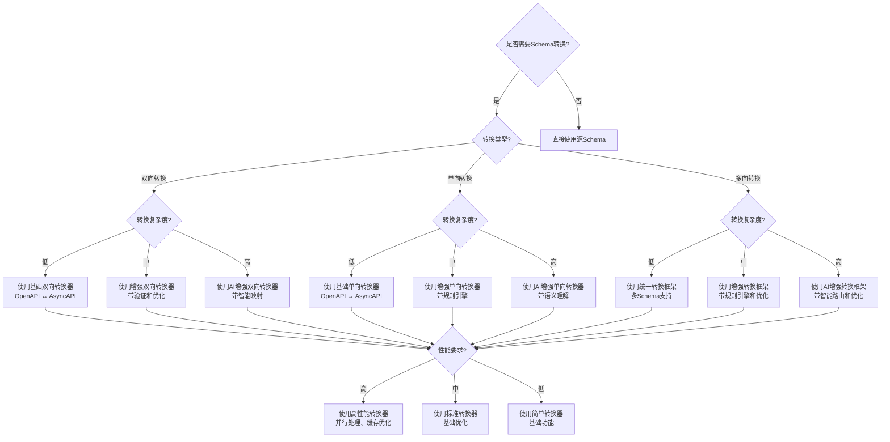
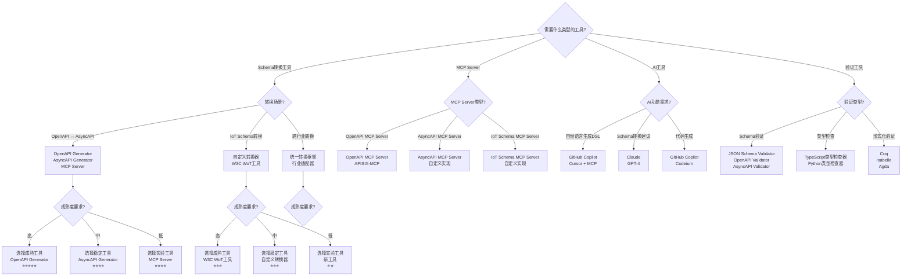
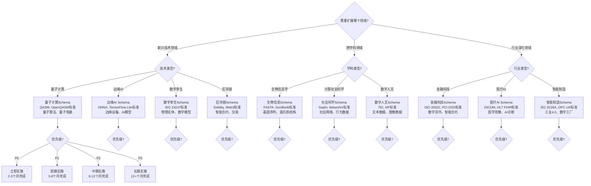

# 决策树体系

## 📑 目录

- [决策树体系](#决策树体系)
  - [📑 目录](#-目录)
  - [1. 概述](#1-概述)
  - [2. 决策树1：Schema转换方案选择](#2-决策树1schema转换方案选择)
  - [3. 决策树2：工具选型决策](#3-决策树2工具选型决策)
  - [4. 决策树3：领域扩展决策](#4-决策树3领域扩展决策)
  - [5. 决策树应用与工具](#5-决策树应用与工具)
    - [5.1 决策树应用场景](#51-决策树应用场景)
    - [5.2 决策树工具](#52-决策树工具)

---

## 1. 概述

本文档提供**3类决策树**，用于支持DSL Schema转换项目的关键决策。


**决策树体系结构**：

```text
决策树体系（3类）
├── 决策树1：Schema转换方案选择
├── 决策树2：工具选型决策
└── 决策树3：领域扩展决策
```

---

## 2. 决策树1：Schema转换方案选择

**决策树结构**：



**决策规则说明**：


**1. 转换类型判断**:

- **双向转换**：需要支持两个方向的转换（如OpenAPI ↔ AsyncAPI）
- **单向转换**：只需要一个方向的转换（如OpenAPI → IoT Schema）
- **多向转换**：需要支持多个Schema之间的转换


**2. 转换复杂度判断**:

- **低**：直接映射，无复杂规则
- **中**：需要规则转换，有部分复杂逻辑
- **高**：需要复杂算法，语义理解


**3. 性能要求判断**:

- **高**：需要高性能，支持大规模转换
- **中**：标准性能即可
- **低**：简单功能即可

**决策示例**：


**示例1**：OpenAPI ↔ AsyncAPI双向转换

- 转换类型：双向转换
- 转换复杂度：中（需要处理同步/异步差异）
- 性能要求：中
- **决策结果**：使用增强双向转换器（带验证和优化）


**示例2**：OpenAPI → IoT Schema单向转换

- 转换类型：单向转换
- 转换复杂度：高（需要语义理解）
- 性能要求：中
- **决策结果**：使用AI增强单向转换器（带语义理解）

---

## 3. 决策树2：工具选型决策

**决策树结构**：



**决策规则说明**：


**1. 工具类型判断**:

- **Schema转换工具**：用于Schema之间的转换
- **MCP Server**：用于MCP协议集成
- **AI工具**：用于AI增强功能
- **验证工具**：用于Schema验证


**2. 成熟度要求判断**:

- **高**：生产环境使用，需要高成熟度
- **中**：开发环境使用，中等成熟度即可
- **低**：实验环境使用，可以接受低成熟度

**决策示例**：


**示例1**：生产环境OpenAPI ↔ AsyncAPI转换

- 工具类型：Schema转换工具
- 转换场景：OpenAPI ↔ AsyncAPI
- 成熟度要求：高
- **决策结果**：OpenAPI Generator（⭐⭐⭐⭐⭐）+ AsyncAPI Generator（⭐⭐⭐⭐）


**示例2**：开发环境IoT Schema转换

- 工具类型：Schema转换工具
- 转换场景：IoT Schema转换
- 成熟度要求：中
- **决策结果**：自定义转换器（⭐⭐⭐）

---

## 4. 决策树3：领域扩展决策

**决策树结构**：



**决策规则说明**：


**1. 领域类型判断**:

- **新兴技术领域**：最新技术趋势
- **跨学科领域**：跨学科应用
- **行业深化领域**：现有行业深化


**2. 优先级判断**:

- **P0**：最高优先级，立即实施
- **P1**：高优先级，短期实施
- **P2**：中优先级，中期实施
- **P3**：低优先级，长期实施

**决策示例**：


**示例1**：边缘AI领域扩展（P0优先级）

- 领域类型：新兴技术领域
- 技术类型：边缘AI
- 优先级：P0
- **决策结果**：立即实施，2-3个月完成边缘AI Schema（ONNX、TensorFlow Lite标准）


**示例2**：生物信息学领域扩展（P2优先级）

- 领域类型：跨学科领域
- 学科类型：生物信息学
- 优先级：P2
- **决策结果**：中期实施，6-12个月完成生物信息Schema（FASTA、GenBank标准）

---

## 5. 决策树应用与工具

### 5.1 决策树应用场景


**1. 方案选择**:

- 使用决策树选择Schema转换方案
- 使用决策树选择工具
- 使用决策树选择领域扩展方向


**2. 决策支持**:

- 为决策提供结构化指导
- 减少决策的主观性
- 提高决策的准确性


**3. 知识传递**:

- 将决策经验结构化
- 便于知识传承
- 便于培训学习

### 5.2 决策树工具


**1. 决策树生成工具**:

- 自动从规则生成决策树
- 支持多种决策树格式


**2. 决策树可视化工具**:

- 图形化展示决策树
- 支持交互式决策


**3. 决策支持系统**:

- 基于决策树的决策支持
- 自动推荐决策路径
- 决策结果验证


**4. 决策树更新工具**:

- 自动检测规则变更
- 自动更新决策树
- 自动验证决策树一致性

---

**文档创建时间**：2025-01-21
**最后更新**：2025-01-21
**文档版本**：v1.0
**维护者**：DSL Schema研究团队
**下次审查时间**：2025-02-21
