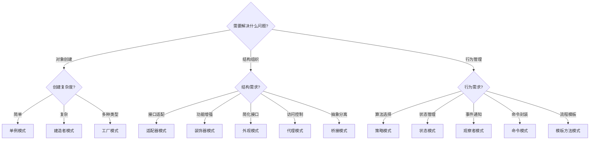

# 设计模式总结

## 📑 目录

- [设计模式总结](#设计模式总结)
  - [📑 目录](#-目录)
  - [1. 概述](#1-概述)
  - [2. 创建型模式](#2-创建型模式)
    - [2.1 工厂模式（Factory Pattern）](#21-工厂模式factory-pattern)
    - [2.2 建造者模式（Builder Pattern）](#22-建造者模式builder-pattern)
    - [2.3 单例模式（Singleton Pattern）](#23-单例模式singleton-pattern)
  - [3. 结构型模式](#3-结构型模式)
    - [3.1 适配器模式（Adapter Pattern）](#31-适配器模式adapter-pattern)
    - [3.2 桥接模式（Bridge Pattern）](#32-桥接模式bridge-pattern)
    - [3.3 装饰器模式（Decorator Pattern）](#33-装饰器模式decorator-pattern)
    - [3.4 外观模式（Facade Pattern）](#34-外观模式facade-pattern)
    - [3.5 代理模式（Proxy Pattern）](#35-代理模式proxy-pattern)
  - [4. 行为型模式](#4-行为型模式)
    - [4.1 策略模式（Strategy Pattern）](#41-策略模式strategy-pattern)
    - [4.2 观察者模式（Observer Pattern）](#42-观察者模式observer-pattern)
    - [4.3 命令模式（Command Pattern）](#43-命令模式command-pattern)
    - [4.4 状态模式（State Pattern）](#44-状态模式state-pattern)
    - [4.5 模板方法模式（Template Method Pattern）](#45-模板方法模式template-method-pattern)
  - [5. 设计模式选择指南](#5-设计模式选择指南)
    - [5.1 模式选择决策树](#51-模式选择决策树)
    - [5.2 模式组合建议](#52-模式组合建议)
    - [5.3 在DSL Schema转换项目中的应用建议](#53-在dsl-schema转换项目中的应用建议)
  - [6. 总结](#6-总结)

---

## 1. 概述

本文档总结DSL Schema转换中的**15个设计模式**，分为3类：创建型模式、结构型模式、行为型模式。

---

## 2. 创建型模式

### 2.1 工厂模式（Factory Pattern）

**定义**：Schema转换器工厂，用于创建不同类型的转换器。

**适用场景**：

- 需要创建多种类型的Schema转换器
- 转换器创建逻辑复杂
- 需要统一转换器接口

**实现示例**：

```python
class SchemaConverterFactory:
    @staticmethod
    def create_converter(source_type: str, target_type: str):
        if source_type == "OpenAPI" and target_type == "AsyncAPI":
            return OpenAPIToAsyncAPIConverter()
        elif source_type == "AsyncAPI" and target_type == "OpenAPI":
            return AsyncAPIToOpenAPIConverter()
        # ... 其他转换器
```

### 2.2 建造者模式（Builder Pattern）

**定义**：Schema构建器，用于逐步构建复杂的Schema。

**适用场景**：

- 需要构建复杂的Schema
- Schema构建过程需要多步骤
- 需要支持不同的构建方式

**在DSL Schema转换中的应用**：

- **复杂Schema构建**：逐步构建包含多个组件的Schema
- **配置式构建**：通过配置参数构建不同结构的Schema
- **链式构建**：支持链式调用构建Schema

**优缺点**：

- ✅ **优点**：构建过程清晰、支持复杂对象、易于扩展
- ❌ **缺点**：代码复杂度增加、需要额外的Builder类

**实现示例**：

```python
class SchemaBuilder:
    def __init__(self):
        self.schema = {}

    def set_info(self, title: str, version: str):
        self.schema["info"] = {"title": title, "version": version}
        return self

    def add_path(self, path: str, method: str, handler):
        if "paths" not in self.schema:
            self.schema["paths"] = {}
        if path not in self.schema["paths"]:
            self.schema["paths"][path] = {}
        self.schema["paths"][path][method] = handler
        return self

    def add_component(self, name: str, schema_def: dict):
        if "components" not in self.schema:
            self.schema["components"] = {}
        if "schemas" not in self.schema["components"]:
            self.schema["components"]["schemas"] = {}
        self.schema["components"]["schemas"][name] = schema_def
        return self

    def build(self):
        return self.schema

# 使用示例
schema = (SchemaBuilder()
    .set_info("User API", "1.0.0")
    .add_path("/users", "GET", {"summary": "Get users"})
    .add_component("User", {"type": "object", "properties": {...}})
    .build())
```

### 2.3 单例模式（Singleton Pattern）

**定义**：转换器单例，确保全局只有一个转换器实例。

**适用场景**：

- 转换器需要全局唯一
- 转换器状态需要共享
- 转换器资源需要复用

**在DSL Schema转换中的应用**：

- **转换器实例管理**：确保全局只有一个转换器实例
- **缓存管理**：共享转换结果缓存
- **配置管理**：共享全局配置

**优缺点**：

- ✅ **优点**：资源节约、状态共享、全局访问
- ❌ **缺点**：测试困难、线程安全问题、违反单一职责

**实现示例**：

```python
class SchemaConverterSingleton:
    _instance = None
    _lock = threading.Lock()

    def __new__(cls):
        if cls._instance is None:
            with cls._lock:
                if cls._instance is None:
                    cls._instance = super().__new__(cls)
                    cls._instance._initialized = False
        return cls._instance

    def __init__(self):
        if not self._initialized:
            self.cache = {}
            self.config = {}
            self._initialized = True

    def convert(self, schema: dict, target_type: str):
        cache_key = f"{hash(str(schema))}_{target_type}"
        if cache_key in self.cache:
            return self.cache[cache_key]

        result = self._do_convert(schema, target_type)
        self.cache[cache_key] = result
        return result
```

---

## 3. 结构型模式

### 3.1 适配器模式（Adapter Pattern）

**定义**：Schema适配器，用于适配不同Schema之间的差异。

**适用场景**：

- OpenAPI ↔ AsyncAPI转换
- JSON Schema ↔ SQL Schema转换
- 不同Schema格式之间的适配

**实现示例**：

```python
class SchemaAdapter:
    def adapt(self, source_schema: dict) -> dict:
        # 适配逻辑
        pass
```

### 3.2 桥接模式（Bridge Pattern）

**定义**：协议桥接，用于桥接不同协议之间的差异。

**架构图**：

```text
┌─────────────┐
│  抽象层      │
│ (Abstraction)│
└──────┬──────┘
       │
       │ 使用
       ▼
┌─────────────┐
│  实现层      │
│ (Implementation)│
└─────────────┘
```

**适用场景**：

- HTTP ↔ MQTT协议桥接
- REST ↔ gRPC协议桥接
- 不同协议之间的桥接

**在DSL Schema转换中的应用**：

- **协议抽象**：将协议细节与业务逻辑分离
- **多协议支持**：支持多种协议的统一接口
- **协议扩展**：易于添加新协议支持

**优缺点**：

- ✅ **优点**：解耦抽象与实现、易于扩展、符合开闭原则
- ❌ **缺点**：增加系统复杂度、需要理解抽象和实现的关系

**实现示例**：

```python
# 实现接口
class ProtocolImplementation:
    def send(self, data):
        raise NotImplementedError

    def receive(self):
        raise NotImplementedError

# HTTP实现
class HTTPImplementation(ProtocolImplementation):
    def send(self, data):
        # HTTP发送逻辑
        pass

    def receive(self):
        # HTTP接收逻辑
        pass

# MQTT实现
class MQTTImplementation(ProtocolImplementation):
    def send(self, data):
        # MQTT发送逻辑
        pass

    def receive(self):
        # MQTT接收逻辑
        pass

# 抽象层
class ProtocolBridge:
    def __init__(self, implementation: ProtocolImplementation):
        self.implementation = implementation

    def transmit(self, schema: dict):
        data = self.prepare_data(schema)
        return self.implementation.send(data)

    def prepare_data(self, schema: dict):
        # 准备数据
        return schema
```

### 3.3 装饰器模式（Decorator Pattern）

**定义**：Schema装饰器，用于为Schema添加额外功能。

**适用场景**：

- 为Schema添加验证功能
- 为Schema添加转换功能
- 为Schema添加缓存功能

**在DSL Schema转换中的应用**：

- **功能增强**：在不修改原有代码的情况下添加新功能
- **组合功能**：可以组合多个装饰器
- **动态扩展**：运行时动态添加功能

**优缺点**：

- ✅ **优点**：灵活扩展、符合开闭原则、功能组合
- ❌ **缺点**：装饰器链过长时难以理解、调试困难

**实现示例**：

```python
# 基础接口
class SchemaConverter:
    def convert(self, schema: dict) -> dict:
        raise NotImplementedError

# 基础转换器
class BaseConverter(SchemaConverter):
    def convert(self, schema: dict) -> dict:
        return schema

# 装饰器基类
class ConverterDecorator(SchemaConverter):
    def __init__(self, converter: SchemaConverter):
        self.converter = converter

    def convert(self, schema: dict) -> dict:
        return self.converter.convert(schema)

# 验证装饰器
class ValidationDecorator(ConverterDecorator):
    def convert(self, schema: dict) -> dict:
        self.validate(schema)
        return self.converter.convert(schema)

    def validate(self, schema: dict):
        # 验证逻辑
        pass

# 缓存装饰器
class CacheDecorator(ConverterDecorator):
    def __init__(self, converter: SchemaConverter):
        super().__init__(converter)
        self.cache = {}

    def convert(self, schema: dict) -> dict:
        cache_key = hash(str(schema))
        if cache_key in self.cache:
            return self.cache[cache_key]

        result = self.converter.convert(schema)
        self.cache[cache_key] = result
        return result

# 使用示例
converter = CacheDecorator(
    ValidationDecorator(
        BaseConverter()
    )
)
```

### 3.4 外观模式（Facade Pattern）

**定义**：统一转换接口，提供简化的转换接口。

**架构图**：

```text
┌─────────────┐
│   客户端     │
└──────┬──────┘
       │
       ▼
┌─────────────┐
│   外观       │  ← 简化接口
│  (Facade)    │
└──────┬──────┘
       │
   ┌───┴───┬────────┬────────┐
   │       │        │        │
┌──▼──┐ ┌─▼──┐ ┌──▼──┐ ┌──▼──┐
│系统1│ │系统2│ │系统3│ │系统N│
└─────┘ └────┘ └─────┘ └─────┘
```

**适用场景**：

- 需要统一多种转换器的接口
- 需要简化复杂的转换过程
- 需要提供统一的转换入口

**在DSL Schema转换中的应用**：

- **统一接口**：为多个转换器提供统一接口
- **简化调用**：隐藏复杂的转换流程
- **API Gateway**：作为API Gateway的简化层

**优缺点**：

- ✅ **优点**：简化接口、降低耦合、易于使用
- ❌ **缺点**：可能成为God Object、限制灵活性

**实现示例**：

```python
class SchemaConversionFacade:
    def __init__(self):
        self.openapi_converter = OpenAPIConverter()
        self.asyncapi_converter = AsyncAPIConverter()
        self.validator = SchemaValidator()
        self.cache = ConversionCache()

    def convert(self, source_type: str, target_type: str, schema: dict):
        # 统一转换接口
        # 1. 验证
        self.validator.validate(schema, source_type)

        # 2. 检查缓存
        cache_key = f"{source_type}_{target_type}_{hash(str(schema))}"
        if self.cache.exists(cache_key):
            return self.cache.get(cache_key)

        # 3. 转换
        if source_type == "OpenAPI" and target_type == "AsyncAPI":
            result = self.openapi_converter.to_asyncapi(schema)
        elif source_type == "AsyncAPI" and target_type == "OpenAPI":
            result = self.asyncapi_converter.to_openapi(schema)
        else:
            raise UnsupportedConversionError()

        # 4. 缓存结果
        self.cache.set(cache_key, result)

        return result
```

### 3.5 代理模式（Proxy Pattern）

**定义**：Schema代理，用于代理Schema的访问和操作。

**适用场景**：

- Schema缓存代理
- Schema验证代理
- Schema访问控制代理

**在DSL Schema转换中的应用**：

- **缓存代理**：缓存转换结果，提高性能
- **访问控制**：控制Schema的访问权限
- **延迟加载**：按需加载大型Schema
- **监控代理**：记录访问日志和性能指标

**优缺点**：

- ✅ **优点**：控制访问、增强功能、透明使用
- ❌ **缺点**：可能增加延迟、复杂度增加

**实现示例**：

```python
# 主题接口
class SchemaService:
    def get_schema(self, schema_id: str) -> dict:
        raise NotImplementedError

# 真实主题
class RealSchemaService(SchemaService):
    def get_schema(self, schema_id: str) -> dict:
        # 从数据库加载
        return self.db.get(schema_id)

# 代理
class SchemaServiceProxy(SchemaService):
    def __init__(self, real_service: SchemaService):
        self.real_service = real_service
        self.cache = {}
        self.access_log = []

    def get_schema(self, schema_id: str) -> dict:
        # 访问控制
        if not self.has_permission(schema_id):
            raise PermissionDeniedError()

        # 缓存检查
        if schema_id in self.cache:
            self.log_access(schema_id, "cache_hit")
            return self.cache[schema_id]

        # 延迟加载
        schema = self.real_service.get_schema(schema_id)
        self.cache[schema_id] = schema
        self.log_access(schema_id, "cache_miss")

        return schema

    def has_permission(self, schema_id: str) -> bool:
        # 权限检查逻辑
        return True

    def log_access(self, schema_id: str, cache_status: str):
        self.access_log.append({
            "schema_id": schema_id,
            "timestamp": time.time(),
            "cache_status": cache_status
        })
```

---

## 4. 行为型模式

### 4.1 策略模式（Strategy Pattern）

**定义**：转换策略选择，用于选择不同的转换策略。

**架构图**：

```text
┌─────────────┐
│  上下文      │
│ (Context)   │
└──────┬──────┘
       │ 使用
       ▼
┌─────────────┐
│  策略接口    │
│ (Strategy)  │
└──────┬──────┘
       │
   ┌───┴───┬────────┬────────┐
   │       │        │        │
┌──▼──┐ ┌─▼──┐ ┌──▼──┐ ┌──▼──┐
│策略1│ │策略2│ │策略3│ │策略N│
└─────┘ └────┘ └─────┘ └─────┘
```

**适用场景**：

- 需要支持多种转换策略
- 转换策略需要动态选择
- 转换策略需要可扩展

**在DSL Schema转换中的应用**：

- **转换策略**：不同的转换算法（简单映射、智能映射、AI增强）
- **验证策略**：不同的验证规则（严格验证、宽松验证）
- **优化策略**：不同的优化方案（性能优化、质量优化）

**优缺点**：

- ✅ **优点**：策略可替换、易于扩展、符合开闭原则
- ❌ **缺点**：策略类数量可能增加、客户端需要了解策略

**实现示例**：

```python
# 策略接口
class ConversionStrategy:
    def convert(self, schema: dict) -> dict:
        raise NotImplementedError

# 简单映射策略
class SimpleMappingStrategy(ConversionStrategy):
    def convert(self, schema: dict) -> dict:
        # 简单字段映射
        return self.map_fields(schema)

# 智能映射策略
class IntelligentMappingStrategy(ConversionStrategy):
    def convert(self, schema: dict) -> dict:
        # 智能语义映射
        return self.semantic_map(schema)

# AI增强策略
class AIMappingStrategy(ConversionStrategy):
    def convert(self, schema: dict) -> dict:
        # AI辅助映射
        return self.ai_enhanced_map(schema)

# 上下文
class SchemaConverter:
    def __init__(self, strategy: ConversionStrategy):
        self.strategy = strategy

    def set_strategy(self, strategy: ConversionStrategy):
        self.strategy = strategy

    def convert(self, schema: dict) -> dict:
        return self.strategy.convert(schema)

# 使用示例
converter = SchemaConverter(SimpleMappingStrategy())
result = converter.convert(schema)

# 动态切换策略
converter.set_strategy(AIMappingStrategy())
result = converter.convert(schema)
```

### 4.2 观察者模式（Observer Pattern）

**定义**：Schema变更通知，用于通知Schema的变更。

**架构图**：

```text
┌─────────────┐
│   主题       │
│  (Subject)   │
└──────┬──────┘
       │ 通知
       ▼
┌─────────────┐
│  观察者接口  │
│ (Observer)  │
└──────┬──────┘
       │
   ┌───┴───┬────────┬────────┐
   │       │        │        │
┌──▼──┐ ┌─▼──┐ ┌──▼──┐ ┌──▼──┐
│观察者1│ │观察者2│ │观察者3│ │观察者N│
└─────┘ └────┘ └─────┘ └─────┘
```

**适用场景**：

- Schema变更需要通知多个观察者
- 需要实现Schema变更的响应机制
- 需要解耦Schema和观察者

**在DSL Schema转换中的应用**：

- **变更通知**：Schema更新时通知相关服务
- **日志记录**：记录所有变更操作
- **缓存更新**：自动更新相关缓存
- **监控告警**：异常变更时发送告警

**优缺点**：

- ✅ **优点**：解耦、支持广播、动态订阅
- ❌ **缺点**：通知顺序不确定、可能影响性能

**实现示例**：

```python
# 观察者接口
class Observer:
    def update(self, event: dict):
        raise NotImplementedError

# 主题
class SchemaSubject:
    def __init__(self):
        self.observers = []
        self.schema = {}

    def attach(self, observer: Observer):
        self.observers.append(observer)

    def detach(self, observer: Observer):
        self.observers.remove(observer)

    def notify(self, event: dict):
        for observer in self.observers:
            observer.update(event)

    def update_schema(self, schema_id: str, new_content: dict):
        old_content = self.schema.get(schema_id)
        self.schema[schema_id] = new_content

        self.notify({
            "type": "schema_updated",
            "schema_id": schema_id,
            "old_content": old_content,
            "new_content": new_content
        })

# 具体观察者
class LogObserver(Observer):
    def update(self, event: dict):
        print(f"Log: {event['type']} - {event['schema_id']}")

class CacheObserver(Observer):
    def __init__(self, cache):
        self.cache = cache

    def update(self, event: dict):
        if event["type"] == "schema_updated":
            self.cache.invalidate(event["schema_id"])
```

### 4.3 命令模式（Command Pattern）

**定义**：转换命令封装，用于封装转换命令。

**适用场景**：

- 需要支持转换命令的撤销和重做
- 需要支持转换命令的队列执行
- 需要支持转换命令的日志记录

**在DSL Schema转换中的应用**：

- **命令队列**：批量执行转换命令
- **撤销重做**：支持转换操作的撤销和重做
- **日志记录**：记录所有转换命令
- **异步执行**：支持异步执行转换命令

**优缺点**：

- ✅ **优点**：解耦调用者和接收者、支持撤销、支持队列
- ❌ **缺点**：命令类数量增加、可能过度设计

**实现示例**：

```python
# 命令接口
class Command:
    def execute(self):
        raise NotImplementedError

    def undo(self):
        raise NotImplementedError

# 具体命令
class ConvertSchemaCommand(Command):
    def __init__(self, converter, schema, target_type):
        self.converter = converter
        self.schema = schema
        self.target_type = target_type
        self.result = None
        self.original_schema = schema.copy()

    def execute(self):
        self.result = self.converter.convert(self.schema, self.target_type)
        return self.result

    def undo(self):
        self.schema = self.original_schema.copy()

# 调用者
class Invoker:
    def __init__(self):
        self.history = []
        self.current_index = -1

    def execute_command(self, command: Command):
        # 清除重做历史
        self.history = self.history[:self.current_index + 1]

        result = command.execute()
        self.history.append(command)
        self.current_index += 1
        return result

    def undo(self):
        if self.current_index >= 0:
            command = self.history[self.current_index]
            command.undo()
            self.current_index -= 1

    def redo(self):
        if self.current_index < len(self.history) - 1:
            self.current_index += 1
            command = self.history[self.current_index]
            return command.execute()
```

### 4.4 状态模式（State Pattern）

**定义**：转换状态管理，用于管理转换过程中的状态。

**状态图**：

```text
   ┌─────────┐
   │  INIT   │
   └────┬────┘
        │
        ▼
   ┌─────────┐
   │VALIDATING│
   └────┬────┘
        │
        ▼
   ┌─────────┐
   │CONVERTING│
   └────┬────┘
        │
        ▼
   ┌─────────┐
   │COMPLETED│
   └─────────┘
```

**适用场景**：

- 转换过程有多个状态
- 状态转换有复杂逻辑
- 需要管理转换状态

**在DSL Schema转换中的应用**：

- **转换状态机**：管理转换的各个阶段
- **状态转换**：控制状态转换逻辑
- **状态持久化**：保存转换状态，支持恢复

**优缺点**：

- ✅ **优点**：状态转换清晰、易于扩展、符合单一职责
- ❌ **缺点**：状态类数量增加、可能过度设计

**实现示例**：

```python
# 状态接口
class ConversionState:
    def handle(self, context):
        raise NotImplementedError

# 具体状态
class InitState(ConversionState):
    def handle(self, context):
        print("Initializing conversion...")
        context.set_state(ValidatingState())

class ValidatingState(ConversionState):
    def handle(self, context):
        print("Validating schema...")
        if context.validate():
            context.set_state(ConvertingState())
        else:
            context.set_state(ErrorState())

class ConvertingState(ConversionState):
    def handle(self, context):
        print("Converting schema...")
        context.convert()
        context.set_state(CompletedState())

class CompletedState(ConversionState):
    def handle(self, context):
        print("Conversion completed!")

# 上下文
class ConversionContext:
    def __init__(self):
        self.state = InitState()
        self.schema = {}

    def set_state(self, state: ConversionState):
        self.state = state

    def process(self):
        self.state.handle(self)

    def validate(self):
        # 验证逻辑
        return True

    def convert(self):
        # 转换逻辑
        pass
```

### 4.5 模板方法模式（Template Method Pattern）

**定义**：转换模板方法，定义转换的骨架算法。

**适用场景**：

- 转换过程有固定步骤
- 需要支持步骤的定制
- 需要复用转换逻辑

**在DSL Schema转换中的应用**：

- **转换流程**：定义标准的转换流程
- **步骤定制**：允许子类定制特定步骤
- **代码复用**：复用通用的转换逻辑

**优缺点**：

- ✅ **优点**：代码复用、流程统一、易于扩展
- ❌ **缺点**：继承关系、可能违反里氏替换原则

**实现示例**：

```python
# 抽象类
class SchemaConverterTemplate:
    def convert(self, schema: dict) -> dict:
        # 模板方法
        validated = self.validate(schema)
        normalized = self.normalize(validated)
        transformed = self.transform(normalized)
        optimized = self.optimize(transformed)
        return optimized

    def validate(self, schema: dict) -> dict:
        # 默认实现
        return schema

    def normalize(self, schema: dict) -> dict:
        # 默认实现
        return schema

    def transform(self, schema: dict) -> dict:
        # 抽象方法，子类必须实现
        raise NotImplementedError

    def optimize(self, schema: dict) -> dict:
        # 默认实现
        return schema

# 具体实现
class OpenAPIToAsyncAPIConverter(SchemaConverterTemplate):
    def transform(self, schema: dict) -> dict:
        # 实现OpenAPI到AsyncAPI的转换
        return self.convert_openapi_to_asyncapi(schema)

    def validate(self, schema: dict) -> dict:
        # 重写验证方法，添加OpenAPI特定验证
        if not self.is_valid_openapi(schema):
            raise InvalidOpenAPISchemaError()
        return schema
```

---

## 5. 设计模式选择指南

### 5.1 模式选择决策树



### 5.2 模式组合建议

**常见组合**：

1. **工厂模式 + 策略模式**
   - 工厂创建不同的策略实例
   - 适用于：需要多种转换策略的场景

2. **装饰器模式 + 代理模式**
   - 装饰器增强功能，代理控制访问
   - 适用于：需要功能增强和访问控制的场景

3. **观察者模式 + 命令模式**
   - 命令执行后通知观察者
   - 适用于：需要事件通知和命令管理的场景

4. **模板方法模式 + 策略模式**
   - 模板定义流程，策略实现具体步骤
   - 适用于：有固定流程但需要灵活实现的场景

### 5.3 在DSL Schema转换项目中的应用建议

**核心转换服务推荐模式**：

1. **转换器创建**：工厂模式
2. **转换流程**：模板方法模式
3. **转换策略**：策略模式
4. **功能增强**：装饰器模式（验证、缓存）
5. **接口简化**：外观模式

**完整示例**：

```python
# 使用多个模式组合
class SchemaConversionService:
    def __init__(self):
        # 工厂模式：创建转换器
        self.factory = SchemaConverterFactory()

        # 外观模式：简化接口
        self.facade = SchemaConversionFacade()

        # 策略模式：选择转换策略
        self.strategy = IntelligentMappingStrategy()

        # 装饰器模式：添加功能
        self.converter = CacheDecorator(
            ValidationDecorator(
                self.factory.create_converter("OpenAPI", "AsyncAPI")
            )
        )

    def convert(self, schema: dict) -> dict:
        # 模板方法：定义转换流程
        return self.converter.convert(schema)
```

---

## 6. 总结

本文档详细介绍了DSL Schema转换项目中的**15个设计模式**，分为3大类：

1. **创建型模式**（3个）：工厂模式、建造者模式、单例模式
2. **结构型模式**（5个）：适配器模式、桥接模式、装饰器模式、外观模式、代理模式
3. **行为型模式**（5个）：策略模式、观察者模式、命令模式、状态模式、模板方法模式

每个模式都包含：

- 定义和架构图/状态图
- 适用场景
- 在DSL Schema转换中的具体应用
- 优缺点分析
- 实现示例代码

**核心价值**：

- 为代码设计提供参考
- 帮助选择合适的模式
- 提供实现示例和最佳实践
- 支持代码的可维护性和扩展性

**相关文档**：

- [架构模式总结](./ARCHITECTURE_PATTERNS_SUMMARY.md) - 12个架构模式
- [信息处理模式总结](./INFORMATION_PROCESSING_PATTERNS_SUMMARY.md) - 12个信息处理模式
- [表征模式总结](./REPRESENTATION_PATTERNS_SUMMARY.md) - 12个表征模式
- [决策树体系](./DECISION_TREES.md) - 模式选择决策树

---

**文档创建时间**：2025-01-21
**最后更新**：2025-01-27
**文档版本**：v2.0
**维护者**：DSL Schema研究团队
**下次审查时间**：2025-02-21
