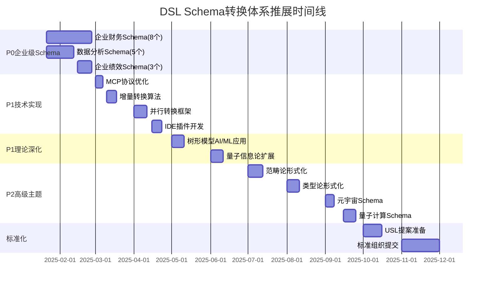
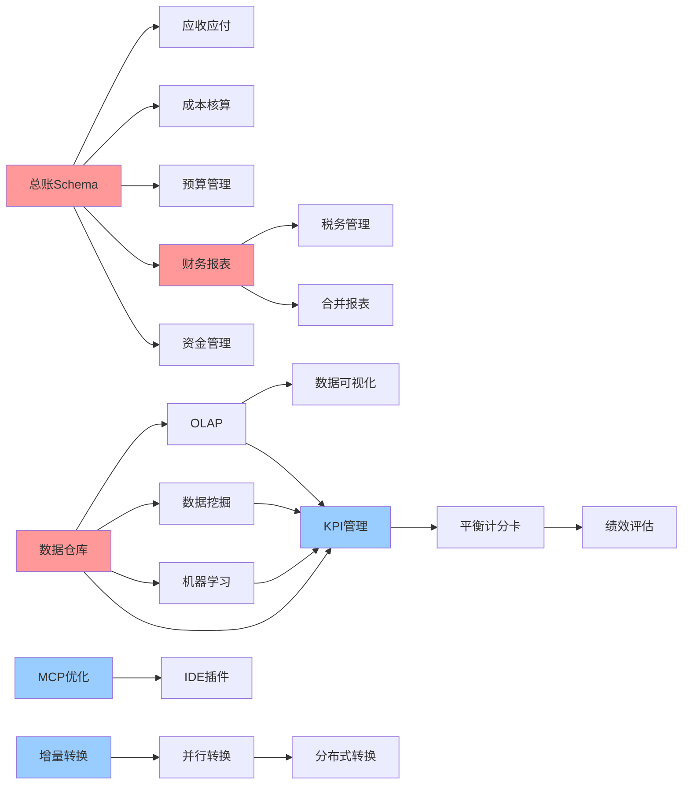

# DSL Schema转换体系：推展主题可视化表征

## 📊 快速导航

- [思维导图](#思维导图)
- [多维矩阵](#多维矩阵)
- [时间线甘特图](#时间线甘特图)
- [依赖关系网络](#依赖关系网络)

---

## 思维导图

### 核心主题树形结构

```mermaid
graph TD
    A[DSL Schema转换体系推展] --> B[理论深化]
    A --> C[技术实现]
    A --> D[行业扩展]
    A --> E[工具生态]
    A --> F[标准化推进]

    B --> B1[树形模型扩展]
    B --> B2[形式化证明深化]
    B --> B3[信息论扩展]

    B1 --> B1a[AI/ML应用]
    B1 --> B1b[量子计算映射]
    B1 --> B1c[图神经网络关系]
    B1 --> B1d[动态演化机制]

    B2 --> B2a[范畴论视角]
    B2 --> B2b[类型论形式化]
    B2 --> B2c[模型论语义]
    B2 --> B2d[证明自动化]

    B3 --> B3a[量子信息论]
    B3 --> B3b[网络信息论]
    B3 --> B3c[信息几何]
    B3 --> B3d[信息瓶颈理论]

    C --> C1[MCP协议生态]
    C --> C2[转换引擎优化]
    C --> C3[AI增强转换]

    C1 --> C1a[多协议Server]
    C1 --> C1b[性能优化]
    C1 --> C1c[安全增强]
    C1 --> C1d[标准化推进]

    C2 --> C2a[增量转换]
    C2 --> C2b[并行转换]
    C2 --> C2c[分布式转换]
    C2 --> C2d[缓存优化]

    C3 --> C3a[LLM微调]
    C3 --> C3b[规则自动学习]
    C3 --> C3c[语义理解增强]
    C3 --> C3d[错误自动修复]

    D --> D1[企业级Schema P0]
    D --> D2[新兴领域Schema]
    D --> D3[跨行业融合Schema]

    D1 --> D1a[企业财务 8个]
    D1 --> D1b[数据分析 5个]
    D1 --> D1c[企业绩效 3个]

    D2 --> D2a[元宇宙Schema]
    D2 --> D2b[量子计算Schema]
    D2 --> D2c[生物信息Schema]

    E --> E1[开发工具]
    E --> E2[运行时工具]
    E --> E3[协作工具]

    E1 --> E1a[IDE插件]
    E1 --> E1b[CLI工具链]
    E1 --> E1c[Web可视化]

    F --> F1[标准制定]
    F --> F2[标准推广]
    F --> F3[生态建设]

    F1 --> F1a[USL提案]
    F1 --> F1b[MCP标准化]
    F1 --> F1c[行业标准]
```



---

## 多维矩阵

### 矩阵1：主题优先级 × 复杂度 × 业务价值

| 主题 | 优先级 | 复杂度 | 业务价值 | 预计工作量 | 风险等级 |
|------|--------|--------|---------|-----------|---------|
| **总账Schema** | P0 | ⭐⭐⭐ | ⭐⭐⭐⭐⭐ | 5天 | 低 |
| **应收应付Schema** | P0 | ⭐⭐⭐ | ⭐⭐⭐⭐⭐ | 4天 | 低 |
| **成本核算Schema** | P0 | ⭐⭐⭐⭐ | ⭐⭐⭐⭐⭐ | 5天 | 低 |
| **财务报表Schema** | P0 | ⭐⭐⭐⭐ | ⭐⭐⭐⭐⭐ | 5天 | 低 |
| **数据仓库Schema** | P0 | ⭐⭐⭐⭐ | ⭐⭐⭐⭐⭐ | 5天 | 低 |
| **机器学习Schema** | P0 | ⭐⭐⭐⭐ | ⭐⭐⭐⭐⭐ | 5天 | 低 |
| **MCP协议性能优化** | P1 | ⭐⭐⭐ | ⭐⭐⭐⭐ | 6天 | 中 |
| **增量转换算法** | P1 | ⭐⭐⭐⭐ | ⭐⭐⭐⭐ | 8天 | 中 |
| **IDE插件开发** | P1 | ⭐⭐⭐ | ⭐⭐⭐⭐ | 8天 | 低 |
| **树形模型AI/ML应用** | P1 | ⭐⭐⭐⭐⭐ | ⭐⭐⭐⭐ | 10天 | 中 |
| **范畴论形式化** | P2 | ⭐⭐⭐⭐⭐ | ⭐⭐⭐ | 12天 | 高 |
| **USL提案准备** | P1 | ⭐⭐⭐⭐⭐ | ⭐⭐⭐⭐⭐ | 15天 | 高 |
| **量子计算Schema** | P2 | ⭐⭐⭐⭐⭐ | ⭐⭐ | 10天 | 中高 |

### 矩阵2：主题依赖关系矩阵

| 主题 | 直接依赖 | 间接依赖 | 依赖深度 | 可并行度 |
|------|---------|---------|---------|---------|
| **应收应付Schema** | 总账Schema | 无 | 1 | 高 |
| **成本核算Schema** | 总账Schema | 无 | 1 | 高 |
| **预算管理Schema** | 总账Schema | 无 | 1 | 高 |
| **财务报表Schema** | 总账Schema | 无 | 1 | 高 |
| **税务管理Schema** | 财务报表Schema | 总账Schema | 2 | 中 |
| **合并报表Schema** | 财务报表Schema | 总账Schema | 2 | 中 |
| **OLAP Schema** | 数据仓库Schema | 无 | 1 | 高 |
| **数据挖掘Schema** | 数据仓库Schema | 无 | 1 | 高 |
| **机器学习Schema** | 数据仓库Schema | 无 | 1 | 高 |
| **数据可视化Schema** | OLAP Schema | 数据仓库Schema | 2 | 中 |
| **KPI管理Schema** | 数据分析Schema | 数据仓库Schema | 2 | 中 |
| **平衡计分卡Schema** | KPI管理Schema | 数据分析Schema | 3 | 低 |
| **增量转换算法** | 转换引擎 | 无 | 1 | 高 |
| **并行转换框架** | 转换引擎 | 无 | 1 | 高 |
| **分布式转换系统** | 并行转换框架 | 转换引擎 | 2 | 中 |

### 矩阵3：资源需求矩阵

| 主题类别 | 人力需求 | 技术难度 | 时间需求 | 资金需求 | 外部依赖 |
|---------|---------|---------|---------|---------|---------|
| **企业财务Schema** | 2人 | 中 | 36天 | 低 | 标准文档 |
| **数据分析Schema** | 2人 | 中高 | 22天 | 低 | 标准文档 |
| **企业绩效Schema** | 1人 | 中 | 11天 | 低 | 标准文档 |
| **MCP协议优化** | 2人 | 中 | 6天 | 中 | 无 |
| **转换引擎优化** | 3人 | 高 | 50天 | 中 | 无 |
| **AI增强转换** | 3人 | 高 | 70天 | 高 | LLM API |
| **理论深化** | 2人 | 很高 | 115天 | 中 | 学术资源 |
| **工具生态** | 4人 | 中高 | 190天 | 中 | 无 |
| **标准化推进** | 3人 | 很高 | 130天 | 高 | 标准组织 |

### 矩阵4：风险-价值矩阵

```text
高价值
  ↑
  │
  │  [USL提案]     [财务报表]  [数据仓库]  [机器学习]
  │  [总账Schema]   [成本核算]  [合并报表]
  │
  │  [MCP优化]      [增量转换]  [IDE插件]
  │  [树形模型AI]   [并行转换]
  │
  │  [量子计算]     [范畴论]    [信息几何]
  │
  └──────────────────────────────────────────→ 风险
    低                          高
```

---

## 时间线甘特图

### 2025年推展时间线



---

## 依赖关系网络

### 任务依赖关系图



**图例**：

- 🔴 红色：P0优先级，关键依赖节点
- 🔵 蓝色：P1优先级，重要节点
- ⚪ 白色：其他节点

---

## 主题分类矩阵

### 按领域分类

| 领域 | 主题数量 | P0数量 | P1数量 | P2数量 | 总工作量 |
|------|---------|--------|--------|--------|---------|
| **企业财务** | 8 | 8 | 0 | 0 | 36天 |
| **数据分析** | 5 | 5 | 0 | 0 | 22天 |
| **企业绩效** | 3 | 0 | 3 | 0 | 11天 |
| **理论深化** | 12 | 0 | 4 | 8 | 115天 |
| **技术实现** | 12 | 0 | 8 | 4 | 180天 |
| **工具生态** | 12 | 0 | 6 | 6 | 190天 |
| **标准化** | 8 | 0 | 4 | 4 | 130天 |
| **新兴领域** | 5 | 0 | 0 | 5 | 40天 |
| **总计** | 65 | 13 | 25 | 27 | 724天 |

### 按优先级分布

```text
优先级分布饼图：

P0 (13个, 20%)  ████████
P1 (25个, 38%)  ████████████████
P2 (27个, 42%)  ██████████████████
```

### 按复杂度分布

```text
复杂度分布：

⭐⭐⭐ (简单)      : 15个 (23%)
⭐⭐⭐⭐ (中等)    : 25个 (38%)
⭐⭐⭐⭐⭐ (复杂)  : 25个 (38%)
```

---

## 关键路径分析

### 关键路径识别

**路径1：企业级Schema完整覆盖**:

```text
T001(总账) → T005(财务报表) → T006(税务) + T008(合并)
         → T002(应收应付) + T003(成本) + T004(预算) + T007(资金)

T009(数据仓库) → T010(OLAP) → T013(可视化)
              → T011(数据挖掘) + T012(机器学习)
              → T014(KPI) → T015(平衡计分卡) → T016(绩效评估)
```

**路径2：技术实现优化**:

```text
T017(MCP优化) → T019(IDE插件)
T018(增量转换) → T020(并行转换) → T021(分布式转换)
```

**路径3：理论深化与标准化**:

```text
T020(树形模型AI) → T021(范畴论) → T025(USL提案) → 标准组织提交
```

### 关键路径时间

- **路径1**：36天（企业财务）+ 22天（数据分析）+ 11天（企业绩效）= **69天**
- **路径2**：6天（MCP优化）+ 8天（增量转换）+ 10天（并行转换）= **24天**
- **路径3**：10天（树形模型AI）+ 12天（范畴论）+ 15天（USL提案）= **37天**

**最长路径**：路径1（69天）

---

## 资源分配矩阵

### 人力资源分配

| 角色 | P0任务 | P1任务 | P2任务 | 总计 |
|------|--------|--------|--------|------|
| **Schema设计师** | 70天 | 30天 | 20天 | 120天 |
| **转换工程师** | 50天 | 60天 | 40天 | 150天 |
| **工具开发者** | 0天 | 80天 | 50天 | 130天 |
| **理论研究员** | 0天 | 40天 | 75天 | 115天 |
| **测试工程师** | 30天 | 40天 | 30天 | 100天 |
| **文档编写者** | 20天 | 30天 | 20天 | 70天 |

### 时间资源分配

| 阶段 | 时间范围 | 主要任务 | 资源投入 |
|------|---------|---------|---------|
| **Phase 1** | 2025-01-21 ~ 2025-03-31 | P0企业级Schema | 70天 |
| **Phase 2** | 2025-04-01 ~ 2025-06-30 | P1技术实现+理论深化 | 120天 |
| **Phase 3** | 2025-07-01 ~ 2025-09-30 | P2高级主题+新兴领域 | 100天 |
| **Phase 4** | 2025-10-01 ~ 2025-12-31 | 标准化推进+生态建设 | 130天 |

---

## 成功指标矩阵

### 量化指标

| 指标类别 | 指标名称 | 目标值 | 当前值 | 完成度 |
|---------|---------|--------|--------|--------|
| **Schema覆盖** | 企业级Schema数量 | 16个 | 0个 | 0% |
| **Schema覆盖** | 总Schema数量 | 65个 | 44个 | 68% |
| **工具支持** | MCP Server数量 | 10个 | 3个 | 30% |
| **工具支持** | IDE插件数量 | 3个 | 0个 | 0% |
| **理论深度** | 形式化证明方法 | 5种 | 3种 | 60% |
| **标准化** | 标准提案数量 | 2个 | 0个 | 0% |
| **社区** | 贡献者数量 | 50人 | 5人 | 10% |
| **社区** | 文档数量 | 500+ | 400+ | 80% |

### 质量指标

| 指标类别 | 指标名称 | 目标值 | 当前值 |
|---------|---------|--------|--------|
| **代码质量** | 测试覆盖率 | >80% | 60% |
| **代码质量** | 代码审查通过率 | 100% | 90% |
| **文档质量** | 文档完整性 | 100% | 85% |
| **文档质量** | 文档准确性 | >95% | 90% |
| **性能** | 转换速度 | <100ms | 200ms |
| **性能** | 吞吐量 | >1000/s | 500/s |

---

## 总结

本文档通过多种可视化方式展示了DSL Schema转换体系的推展主题：

1. **思维导图**：展示主题的层次结构和关系
2. **多维矩阵**：从多个维度分析主题特征
3. **时间线甘特图**：展示任务的时间安排
4. **依赖关系网络**：展示任务间的依赖关系
5. **关键路径分析**：识别关键任务和瓶颈
6. **资源分配矩阵**：优化资源配置
7. **成功指标矩阵**：跟踪项目进展

这些可视化表征方式有助于：

- **决策支持**：快速识别优先级和依赖关系
- **资源规划**：合理分配人力和时间资源
- **风险管控**：识别关键路径和潜在风险
- **进度跟踪**：监控项目进展和完成度

---

**文档版本**：1.0
**创建日期**：2025-01-21
**维护者**：DSL Schema研究团队
