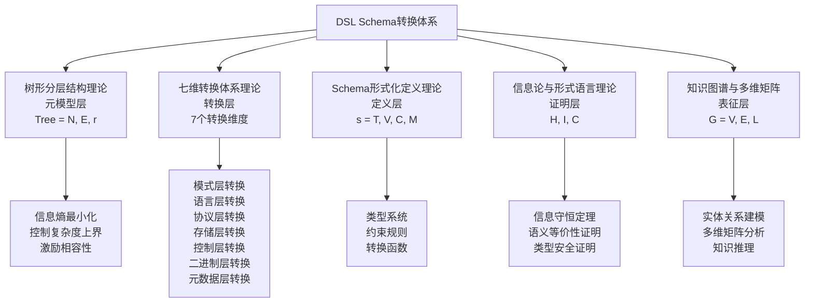
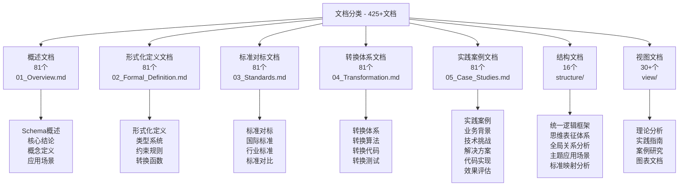
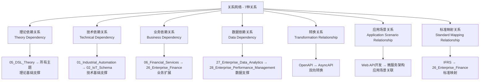
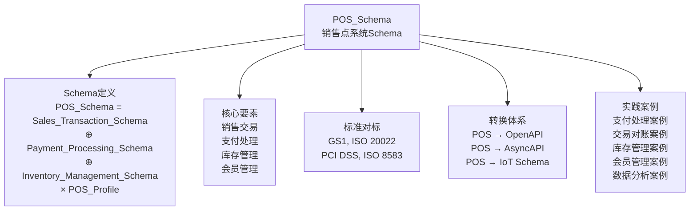

# 全局思维导图体系

## 📑 目录

- [全局思维导图体系](#全局思维导图体系)
  - [📑 目录](#-目录)
  - [1. 概述](#1-概述)
  - [2. 五层全局思维导图](#2-五层全局思维导图)
    - [2.1 第一层：核心理论层](#21-第一层核心理论层)
    - [2.2 第二层：主题分类层](#22-第二层主题分类层)
    - [2.3 第三层：Schema分类层](#23-第三层schema分类层)
    - [2.4 第四层：文档分类层](#24-第四层文档分类层)
    - [2.5 第五层：关系网络层](#25-第五层关系网络层)
  - [3. 主题级思维导图](#3-主题级思维导图)
  - [4. Schema级思维导图](#4-schema级思维导图)
  - [5. 思维导图更新机制](#5-思维导图更新机制)

---

## 1. 概述

本文档提供**五层全局思维导图体系**，用于全面把握DSL Schema转换项目的全局结构和关系。

**思维导图层次结构**：

```
全局思维导图（5层）
├── 第一层：核心理论层（5个理论）
├── 第二层：主题分类层（28个主题）
├── 第三层：Schema分类层（81个Schema）
├── 第四层：文档分类层（425+文档）
└── 第五层：关系网络层（7种关系）
```

---

## 2. 五层全局思维导图

### 2.1 第一层：核心理论层

**核心理论层思维导图**：



**理论关系**：

- **元模型层** → **转换层**：元模型指导转换设计
- **转换层** → **定义层**：转换基于Schema定义
- **定义层** → **证明层**：定义需要形式化证明
- **证明层** → **表征层**：证明结果需要表征展示

---

### 2.2 第二层：主题分类层

**主题分类层思维导图**：

```mermaid
graph TB
    Root[主题分类 - 28个主题]

    Root --> Base[基础技术主题<br/>01-05<br/>5个主题]
    Root --> Industry[行业应用主题<br/>06-24<br/>19个主题]
    Root --> Enterprise[企业级主题<br/>25-30<br/>6个主题]

    Base --> T01[01_Industrial_Automation<br/>工业自动化<br/>2个Schema]
    Base --> T02[02_IoT_Schema<br/>物联网Schema<br/>6个Schema]
    Base --> T03[03_Physical_Device<br/>物理设备<br/>6个Schema]
    Base --> T04[04_Programming_Conversion<br/>编程转换<br/>5个Schema]
    Base --> T05[05_DSL_Theory<br/>DSL理论<br/>3个Schema]

    Industry --> T06[06_Financial_Services<br/>金融服务<br/>3个Schema]
    Industry --> T07[07_Logistics_Supply_Chain<br/>物流供应链<br/>2个Schema]
    Industry --> T08[08_Smart_City<br/>智慧城市<br/>1个Schema]
    Industry --> T09[09_Maritime_Shipping<br/>海运<br/>1个Schema]
    Industry --> T10[10_Healthcare<br/>医疗健康<br/>3个Schema]
    Industry --> T11[11_Food_Industry<br/>食品行业<br/>1个Schema]
    Industry --> T12[12_Smart_Home<br/>智能家居<br/>3个Schema]
    Industry --> T13[13_OA_Office_Automation<br/>办公自动化<br/>1个Schema]
    Industry --> T14[14_Workflow_BPM<br/>工作流BPM<br/>3个Schema]
    Industry --> T15[15_ERP_Systems<br/>ERP系统<br/>1个Schema]
    Industry --> T16[16_Energy_Industry<br/>能源行业<br/>2个Schema]
    Industry --> T17[17_Manufacturing<br/>制造业<br/>2个Schema]
    Industry --> T18[18_Retail_Industry<br/>零售行业<br/>2个Schema]
    Industry --> T19[19_Transportation<br/>交通运输<br/>2个Schema]
    Industry --> T20[20_Building_Construction<br/>建筑建设<br/>1个Schema]
    Industry --> T21[21_Education<br/>教育<br/>3个Schema]
    Industry --> T22[22_Agriculture<br/>农业<br/>3个Schema]
    Industry --> T23[23_Telecommunications<br/>电信<br/>3个Schema]
    Industry --> T24[24_Other_Industries<br/>其他行业<br/>多个Schema]

    Enterprise --> T25[25_AI_Code_Integration<br/>AI代码集成<br/>6个Schema]
    Enterprise --> T26[26_Enterprise_Finance<br/>企业财务<br/>11个Schema]
    Enterprise --> T27[27_Enterprise_Data_Analytics<br/>企业数据分析<br/>9个Schema]
    Enterprise --> T28[28_Enterprise_Performance_Management<br/>企业绩效管理<br/>3个Schema]
    Enterprise --> T29[29_API_Protocol_Schemas<br/>API协议Schema<br/>6个Schema]
    Enterprise --> T30[30_Cloud_Native_DevOps<br/>云原生DevOps<br/>7个Schema]
```



**主题统计**：

- **基础技术主题**：5个主题，22个Schema
- **行业应用主题**：19个主题，35个Schema
- **企业级主题**：6个主题，42个Schema
- **总计**：30个主题，99个Schema

---

### 2.3 第三层：Schema分类层

**Schema分类层思维导图**：

```mermaid
graph TB
    Root[Schema分类 - 81个Schema]

    Root --> S1[基础技术Schema<br/>22个]
    Root --> S2[行业应用Schema<br/>35个]
    Root --> S3[企业级Schema<br/>42个]

    S1 --> S1A[工业自动化Schema<br/>CAN_Schema, PLC_Schema]
    S1 --> S1B[物联网Schema<br/>Communication, Control, Message_Queue, Observability, Security, Sensor]
    S1 --> S1C[物理设备Schema<br/>CAD, Digital_Twin, Electrical, Mechanical, Safety, Thermal]
    S1 --> S1D[编程转换Schema<br/>Code_Generation, Database, Formal_Model, Language_Mapping, Serialization]
    S1 --> S1E[DSL理论Schema<br/>Formal_Language_Theory, Information_Theory, Knowledge_Graph]

    S2 --> S2A[金融服务Schema<br/>ISO20022, Payment, SWIFT]
    S2 --> S2B[物流供应链Schema<br/>EDI, GS1]
    S2 --> S2C[医疗健康Schema<br/>FHIR, Healthcare, HL7]
    S2 --> S2D[其他行业Schema<br/>Smart_City, Maritime, Food, Smart_Home, OA, BPMN, ERP, Energy, Manufacturing, Retail, Transportation, Building, Education, Agriculture, Telecommunications]

    S3 --> S3A[企业财务Schema<br/>Accounting, Financial_Reporting, XBRL, Audit, Tax, Budget, Cost, AR_AP, Cash, Consolidated, Management]
    S3 --> S3B[企业数据分析Schema<br/>Data_Analytics, Business_Intelligence, Data_Warehouse, ETL, Data_Lake, OLAP, Data_Mining, Reporting, Dashboard]
    S3 --> S3C[企业绩效管理Schema<br/>EPM, KPI, Balanced_Scorecard]
    S3 --> S3D[AI代码集成Schema<br/>DSL_Transformation, Domain_Language, Industry_Analysis, IoT_Deep, Multi_Dimensional, Type_System]
    S3 --> S3E[API协议Schema<br/>AsyncAPI, Avro, GraphQL, gRPC, JSON, Protocol_Buffers]
    S3 --> S3F[云原生DevOps Schema<br/>Ansible, ArgoCD, CloudFormation, Docker, Flux, GitOps, Helm, Kubernetes, Pulumi, Terraform]
```



**Schema统计**：

- **基础技术Schema**：22个
- **行业应用Schema**：35个
- **企业级Schema**：42个
- **总计**：99个Schema

---

### 2.4 第四层：文档分类层

**文档分类层思维导图**：



**文档统计**：

- **Schema文档**：405个（81个Schema × 5个文档）
- **结构文档**：16个
- **视图文档**：30+个
- **总计**：450+个文档

---

### 2.5 第五层：关系网络层

**关系网络层思维导图**：



**关系类型说明**：

1. **理论依赖关系**：理论基础对应用主题的支撑关系
2. **技术依赖关系**：技术基础对上层技术的支撑关系
3. **业务依赖关系**：业务领域之间的扩展关系
4. **数据依赖关系**：数据流和数据处理的关系
5. **转换关系**：Schema之间的转换关系
6. **应用场景关系**：应用场景之间的关联关系
7. **标准映射关系**：标准与Schema之间的映射关系

---

## 3. 主题级思维导图

**主题级思维导图结构**：

每个主题包含：

- **主题概述**：主题定义、核心特征、应用场景
- **Schema列表**：主题下的所有Schema
- **标准对标**：相关国际标准和行业标准
- **转换路径**：与其他主题的转换关系
- **应用场景**：实际应用案例

**示例：26_Enterprise_Finance主题思维导图**：

```mermaid
graph TB
    Root[26_Enterprise_Finance<br/>企业财务主题]

    Root --> S1[Accounting_Schema<br/>会计Schema]
    Root --> S2[Financial_Reporting_Schema<br/>财务报告Schema]
    Root --> S3[XBRL_Schema<br/>XBRL Schema]
    Root --> S4[Audit_Schema<br/>审计Schema]
    Root --> S5[Tax_Accounting_Schema<br/>税务会计Schema]
    Root --> S6[Budget_Management_Schema<br/>预算管理Schema]
    Root --> S7[Cost_Accounting_Schema<br/>成本会计Schema]
    Root --> S8[AR_AP_Schema<br/>应收应付Schema]
    Root --> S9[Cash_Management_Schema<br/>资金管理Schema]
    Root --> S10[Consolidated_Reporting_Schema<br/>合并报表Schema]
    Root --> S11[Management_Accounting_Schema<br/>管理会计Schema]

    Root --> Std[标准对标<br/>IFRS, GAAP, XBRL, COSO]
    Root --> Trans[转换路径<br/>06_Financial_Services → 26_Enterprise_Finance]
    Root --> App[应用场景<br/>企业会计核算<br/>财务报告生成<br/>税务申报<br/>审计支持]
```



---

## 4. Schema级思维导图

**Schema级思维导图结构**：

每个Schema包含：

- **Schema定义**：形式化定义、核心要素
- **标准对标**：相关标准
- **转换体系**：转换算法、转换代码
- **实践案例**：5个实践案例

**示例：POS_Schema思维导图**：



---

## 5. 思维导图更新机制

**更新频率**：

- **每日更新**：新增Schema、新增文档
- **每周更新**：主题关系变化、转换路径更新
- **每月更新**：全局结构审查、关系网络优化
- **每季度更新**：全面审查、深度优化

**更新流程**：

1. **变更检测**：检测Schema、文档、关系的变更
2. **影响分析**：分析变更对思维导图的影响
3. **导图更新**：更新相应的思维导图
4. **一致性验证**：验证更新后的一致性
5. **文档发布**：发布更新后的思维导图文档

**自动化工具**：

- **变更检测工具**：自动检测项目变更
- **导图生成工具**：自动生成思维导图
- **一致性检查工具**：自动检查一致性
- **可视化工具**：自动生成可视化图表

---

**文档创建时间**：2025-01-21
**最后更新**：2025-01-21
**文档版本**：v1.0
**维护者**：DSL Schema研究团队
**下次审查时间**：2025-02-21
