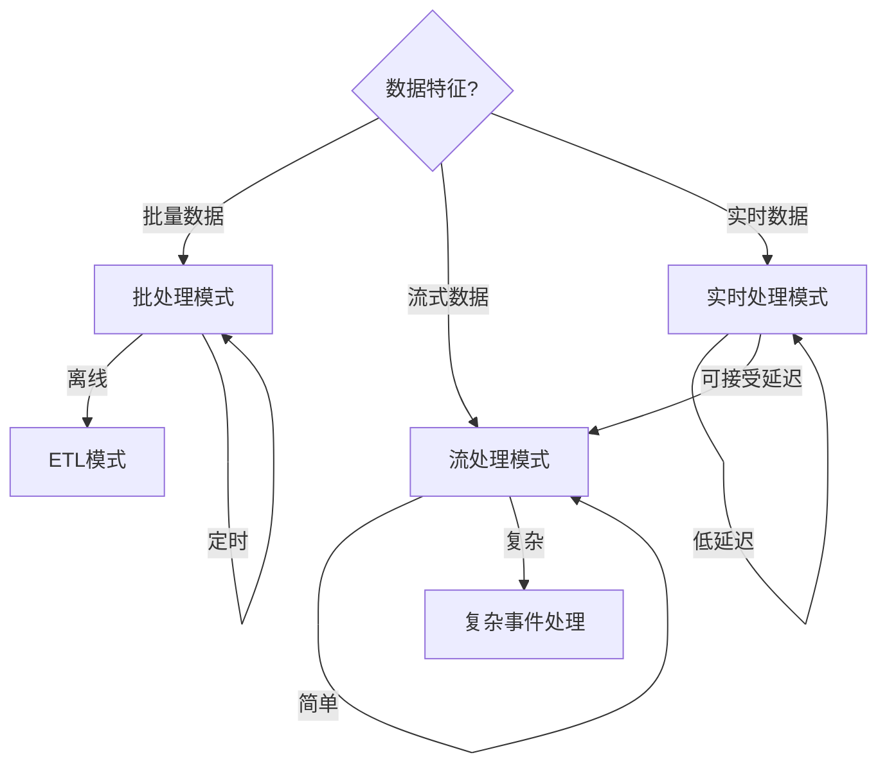

# 信息处理模式总结

## 📑 目录

- [信息处理模式总结](#信息处理模式总结)
  - [📑 目录](#-目录)
  - [1. 概述](#1-概述)
  - [2. ETL模式](#2-etl模式)
    - [2.1 提取模式（Extract Pattern）](#21-提取模式extract-pattern)
    - [2.2 转换模式（Transform Pattern）](#22-转换模式transform-pattern)
    - [2.3 加载模式（Load Pattern）](#23-加载模式load-pattern)
  - [3. 流处理模式](#3-流处理模式)
    - [3.1 事件流处理（Event Stream Processing）](#31-事件流处理event-stream-processing)
    - [3.2 数据流处理（Data Stream Processing）](#32-数据流处理data-stream-processing)
    - [3.3 复杂事件处理（Complex Event Processing）](#33-复杂事件处理complex-event-processing)
  - [4. 批处理模式](#4-批处理模式)
    - [4.1 批量转换（Batch Transformation）](#41-批量转换batch-transformation)
    - [4.2 批量加载（Batch Loading）](#42-批量加载batch-loading)
    - [4.3 批量验证（Batch Validation）](#43-批量验证batch-validation)
  - [5. 实时处理模式](#5-实时处理模式)
    - [5.1 实时转换（Real-time Transformation）](#51-实时转换real-time-transformation)
    - [5.2 实时验证（Real-time Validation）](#52-实时验证real-time-validation)
    - [5.3 实时同步（Real-time Synchronization）](#53-实时同步real-time-synchronization)
  - [6. 模式选择指南](#6-模式选择指南)
    - [6.1 处理模式选择决策树](#61-处理模式选择决策树)
    - [6.2 在DSL Schema转换项目中的应用建议](#62-在dsl-schema转换项目中的应用建议)
  - [7. 总结](#7-总结)

---

## 1. 概述

本文档总结DSL Schema转换中的**12个信息处理模式**，分为4类：ETL模式、流处理模式、批处理模式、实时处理模式。

---

## 2. ETL模式

### 2.1 提取模式（Extract Pattern）

**定义**：从源系统提取数据。

**架构图**：

```text
┌──────────┐  ┌──────────┐  ┌──────────┐
│ 数据源1  │  │ 数据源2   │  │ 数据源N   │
└────┬─────┘  └────┬─────┘  └────┬─────┘
     │            │            │
     └────────────┼────────────┘
                  │ Extract
                  ▼
         ┌─────────────────┐
         │   提取层        │
         │  (Extract)      │
         └─────────────────┘
```

**适用场景**：

- 数据迁移
- 数据集成
- 数据同步

**在DSL Schema转换中的应用**：

- **Schema提取**：从文件系统、数据库、API等提取Schema
- **批量提取**：批量提取多个Schema文件
- **增量提取**：只提取变更的Schema

**优缺点**：

- ✅ **优点**：统一提取接口、支持多数据源、易于扩展
- ❌ **缺点**：可能成为性能瓶颈、需要处理数据源差异

**实现示例**：

```python
class SchemaExtractor:
    def extract(self, source: str) -> dict:
        raise NotImplementedError

class FileExtractor(SchemaExtractor):
    def extract(self, file_path: str) -> dict:
        with open(file_path, 'r') as f:
            return json.load(f)

class DatabaseExtractor(SchemaExtractor):
    def __init__(self, db_connection):
        self.db = db_connection

    def extract(self, schema_id: str) -> dict:
        return self.db.query("SELECT * FROM schemas WHERE id = ?", schema_id)

class APIExtractor(SchemaExtractor):
    def __init__(self, api_client):
        self.api = api_client

    def extract(self, schema_url: str) -> dict:
        response = self.api.get(schema_url)
        return response.json()

# 统一提取接口
class UnifiedExtractor:
    def __init__(self):
        self.extractors = {
            "file": FileExtractor(),
            "database": DatabaseExtractor(db),
            "api": APIExtractor(api_client)
        }

    def extract(self, source_type: str, source: str) -> dict:
        extractor = self.extractors[source_type]
        return extractor.extract(source)
```

### 2.2 转换模式（Transform Pattern）

**定义**：数据转换和清洗。

**架构图**：

```text
┌──────────┐
│  原始数据 │
└────┬─────┘
     │
     ▼
┌──────────┐
│ 转换层    │  ← 清洗、转换、标准化
└────┬─────┘
     │
     ▼
┌──────────┐
│转换后数据 │
└──────────┘
```

**适用场景**：

- 数据清洗
- 数据转换
- 数据标准化

**在DSL Schema转换中的应用**：

- **格式转换**：OpenAPI到AsyncAPI的格式转换
- **数据清洗**：去除无效字段、修复错误数据
- **数据标准化**：统一Schema格式和结构
- **规则转换**：应用转换规则

**优缺点**：

- ✅ **优点**：数据质量提升、格式统一、支持复杂转换
- ❌ **缺点**：转换逻辑复杂、可能丢失信息

**实现示例**：

```python
class SchemaTransformer:
    def transform(self, schema: dict, rules: dict) -> dict:
        # 1. 清洗
        cleaned = self.clean(schema)

        # 2. 转换
        transformed = self.convert(cleaned, rules)

        # 3. 标准化
        normalized = self.normalize(transformed)

        return normalized

    def clean(self, schema: dict) -> dict:
        # 移除无效字段
        cleaned = {k: v for k, v in schema.items() if v is not None}
        return cleaned

    def convert(self, schema: dict, rules: dict) -> dict:
        # 应用转换规则
        converted = {}
        for key, value in schema.items():
            if key in rules:
                converted[rules[key]] = value
            else:
                converted[key] = value
        return converted

    def normalize(self, schema: dict) -> dict:
        # 标准化格式
        return self.apply_standard_format(schema)
```

### 2.3 加载模式（Load Pattern）

**定义**：加载到目标系统。

**适用场景**：

- 数据加载
- 数据导入
- 数据更新

**在DSL Schema转换中的应用**：

- **Schema存储**：将转换后的Schema存储到数据库
- **批量加载**：批量加载多个Schema
- **增量更新**：只更新变更的Schema

**优缺点**：

- ✅ **优点**：统一加载接口、支持批量操作、事务支持
- ❌ **缺点**：可能成为性能瓶颈、需要处理冲突

**实现示例**：

```python
class SchemaLoader:
    def load(self, schema: dict, target: str):
        raise NotImplementedError

class DatabaseLoader(SchemaLoader):
    def __init__(self, db_connection):
        self.db = db_connection

    def load(self, schema: dict, target: str):
        # 加载到数据库
        self.db.insert("schemas", schema)

class FileLoader(SchemaLoader):
    def load(self, schema: dict, target: str):
        # 保存到文件
        with open(target, 'w') as f:
            json.dump(schema, f, indent=2)

class APILoader(SchemaLoader):
    def __init__(self, api_client):
        self.api = api_client

    def load(self, schema: dict, target: str):
        # 通过API上传
        self.api.post(target, json=schema)

# 批量加载
class BatchLoader:
    def __init__(self, loader: SchemaLoader):
        self.loader = loader

    def load_batch(self, schemas: list, target: str):
        for schema in schemas:
            try:
                self.loader.load(schema, target)
            except Exception as e:
                print(f"Failed to load schema: {e}")
```

---

## 3. 流处理模式

### 3.1 事件流处理（Event Stream Processing）

**定义**：实时事件处理。

**架构图**：

```text
┌──────────┐
│ 事件源    │
└────┬─────┘
     │
     ▼
┌──────────┐
│ 事件流    │  ← Kafka/RabbitMQ
└────┬─────┘
     │
     ▼
┌──────────┐
│ 流处理器  │  ← 实时处理
└────┬─────┘
     │
     ▼
┌──────────┐
│ 结果输出  │
└──────────┘
```

**适用场景**：

- 实时监控
- 事件响应
- 流式分析

**在DSL Schema转换中的应用**：

- **Schema变更事件**：实时处理Schema变更事件
- **转换请求流**：处理实时转换请求流
- **监控告警**：实时监控转换状态

**优缺点**：

- ✅ **优点**：低延迟、实时响应、可扩展
- ❌ **缺点**：复杂度高、需要处理背压、状态管理困难

**实现示例**：

```python
class EventStreamProcessor:
    def __init__(self, event_source, event_handler):
        self.event_source = event_source
        self.handler = event_handler

    def process_stream(self):
        for event in self.event_source.stream():
            try:
                result = self.handler.handle(event)
                self.emit_result(result)
            except Exception as e:
                self.handle_error(event, e)

    def handle_error(self, event, error):
        # 错误处理
        pass

# Schema变更事件处理
class SchemaChangeHandler:
    def handle(self, event):
        if event.type == "schema_updated":
            # 触发转换
            return self.convert_schema(event.schema)
        elif event.type == "schema_deleted":
            # 清理缓存
            return self.clear_cache(event.schema_id)
```

### 3.2 数据流处理（Data Stream Processing）

**定义**：连续数据流处理。

**适用场景**：

- 流式数据
- 连续处理
- 实时分析

**在DSL Schema转换中的应用**：

- **Schema数据流**：处理连续的Schema数据流
- **转换流水线**：构建转换流水线处理数据流
- **实时统计**：实时统计转换指标

**优缺点**：

- ✅ **优点**：连续处理、低延迟、高吞吐
- ❌ **缺点**：状态管理、容错处理、资源消耗

**实现示例**：

```python
class DataStreamProcessor:
    def __init__(self):
        self.pipeline = []

    def add_stage(self, stage):
        self.pipeline.append(stage)
        return self

    def process(self, data_stream):
        result = data_stream
        for stage in self.pipeline:
            result = stage.process(result)
        return result

# 转换流水线
pipeline = (DataStreamProcessor()
    .add_stage(ValidationStage())
    .add_stage(TransformationStage())
    .add_stage(OptimizationStage())
    .add_stage(OutputStage()))

# 处理数据流
for schema in schema_stream:
    result = pipeline.process(schema)
```

### 3.3 复杂事件处理（Complex Event Processing）

**定义**：复杂事件模式匹配。

**适用场景**：

- 复杂事件
- 模式匹配
- 事件关联

**在DSL Schema转换中的应用**：

- **事件模式匹配**：匹配复杂的Schema变更模式
- **事件关联**：关联多个相关事件
- **规则引擎**：基于规则的复杂事件处理

**优缺点**：

- ✅ **优点**：支持复杂模式、事件关联、规则灵活
- ❌ **缺点**：规则复杂、性能开销、调试困难

**实现示例**：

```python
class ComplexEventProcessor:
    def __init__(self):
        self.patterns = []
        self.event_buffer = []

    def add_pattern(self, pattern):
        self.patterns.append(pattern)

    def process_event(self, event):
        self.event_buffer.append(event)

        # 检查模式匹配
        for pattern in self.patterns:
            if pattern.match(self.event_buffer):
                pattern.execute(self.event_buffer)
                self.event_buffer.clear()

# 复杂事件模式
class EventPattern:
    def match(self, events):
        raise NotImplementedError

    def execute(self, events):
        raise NotImplementedError

# 示例：连续3次Schema更新触发告警
class ConsecutiveUpdatePattern(EventPattern):
    def match(self, events):
        if len(events) < 3:
            return False
        return all(e.type == "schema_updated" for e in events[-3:])

    def execute(self, events):
        print(f"Alert: 3 consecutive updates detected for {events[-1].schema_id}")
```

---

## 4. 批处理模式

### 4.1 批量转换（Batch Transformation）

**定义**：批量数据转换。

**架构图**：

```text
┌──────────┐  ┌──────────┐  ┌──────────┐
│ Schema1  │  │ Schema2  │  │ SchemaN  │
└────┬─────┘  └────┬─────┘  └────┬─────┘
     │             │             │
     └──────────────┼────────────┘
                  │
                  ▼
         ┌─────────────────┐
         │  批量转换器      │
         │  (Batch)        │
         └────────┬────────┘
                  │
         ┌────────▼────────┐
         │  转换结果        │
         └─────────────────┘
```

**适用场景**：

- 批量处理
- 离线转换
- 数据迁移

**在DSL Schema转换中的应用**：

- **批量Schema转换**：一次性转换多个Schema
- **离线转换任务**：定时批量转换任务
- **数据迁移**：迁移大量Schema到新系统

**优缺点**：

- ✅ **优点**：高吞吐、资源利用高、易于调度
- ❌ **缺点**：延迟高、需要批处理框架

**实现示例**：

```python
class BatchTransformer:
    def __init__(self, transformer, batch_size=100):
        self.transformer = transformer
        self.batch_size = batch_size

    def transform_batch(self, schemas: list) -> list:
        results = []
        for i in range(0, len(schemas), self.batch_size):
            batch = schemas[i:i + self.batch_size]
            batch_results = self.process_batch(batch)
            results.extend(batch_results)
        return results

    def process_batch(self, batch: list) -> list:
        return [self.transformer.transform(s) for s in batch]
```

### 4.2 批量加载（Batch Loading）

**定义**：批量数据加载。

**适用场景**：

- 批量导入
- 数据初始化
- 数据更新

**在DSL Schema转换中的应用**：

- **批量Schema导入**：一次性导入多个Schema
- **数据初始化**：系统初始化时批量加载Schema
- **批量更新**：批量更新Schema数据

**优缺点**：

- ✅ **优点**：高效、事务支持、错误处理
- ❌ **缺点**：内存占用、需要批处理框架

**实现示例**：

```python
class BatchLoader:
    def __init__(self, loader, batch_size=1000):
        self.loader = loader
        self.batch_size = batch_size

    def load_batch(self, schemas: list):
        for i in range(0, len(schemas), self.batch_size):
            batch = schemas[i:i + self.batch_size]
            self.loader.load_batch(batch)
```

### 4.3 批量验证（Batch Validation）

**定义**：批量数据验证。

**适用场景**：

- 数据质量检查
- 数据验证
- 数据清洗

**在DSL Schema转换中的应用**：

- **批量Schema验证**：批量验证Schema的有效性
- **数据质量检查**：检查Schema数据质量
- **批量修复**：批量修复Schema错误

**优缺点**：

- ✅ **优点**：高效、统一验证、易于报告
- ❌ **缺点**：延迟高、需要批处理框架

**实现示例**：

```python
class BatchValidator:
    def __init__(self, validator):
        self.validator = validator

    def validate_batch(self, schemas: list) -> dict:
        results = {
            "valid": [],
            "invalid": [],
            "errors": []
        }

        for schema in schemas:
            try:
                if self.validator.validate(schema):
                    results["valid"].append(schema)
                else:
                    results["invalid"].append(schema)
            except Exception as e:
                results["errors"].append({
                    "schema": schema,
                    "error": str(e)
                })

        return results
```

---

## 5. 实时处理模式

### 5.1 实时转换（Real-time Transformation）

**定义**：实时数据转换。

**适用场景**：

- 实时处理
- 低延迟要求
- 流式转换

**在DSL Schema转换中的应用**：

- **实时Schema转换**：接收到Schema后立即转换
- **API实时转换**：API请求时实时转换
- **低延迟转换**：满足低延迟要求的转换

**优缺点**：

- ✅ **优点**：低延迟、实时响应、用户体验好
- ❌ **缺点**：资源消耗、需要优化、容错困难

**实现示例**：

```python
class RealTimeTransformer:
    def __init__(self, transformer):
        self.transformer = transformer
        self.cache = {}

    def transform(self, schema: dict) -> dict:
        # 检查缓存
        cache_key = hash(str(schema))
        if cache_key in self.cache:
            return self.cache[cache_key]

        # 实时转换
        result = self.transformer.transform(schema)

        # 缓存结果
        self.cache[cache_key] = result

        return result
```

### 5.2 实时验证（Real-time Validation）

**定义**：实时数据验证。

**适用场景**：

- 实时验证
- 数据质量监控
- 异常检测

**在DSL Schema转换中的应用**：

- **实时Schema验证**：接收Schema时立即验证
- **质量监控**：实时监控Schema质量
- **异常检测**：实时检测异常Schema

**优缺点**：

- ✅ **优点**：即时反馈、快速发现问题、用户体验好
- ❌ **缺点**：性能开销、需要优化验证逻辑

**实现示例**：

```python
class RealTimeValidator:
    def __init__(self, validator):
        self.validator = validator
        self.metrics = {}

    def validate(self, schema: dict) -> tuple[bool, list]:
        start_time = time.time()

        # 实时验证
        is_valid, errors = self.validator.validate(schema)

        # 记录指标
        duration = time.time() - start_time
        self.metrics["validation_time"] = duration
        self.metrics["validation_count"] = self.metrics.get("validation_count", 0) + 1

        return is_valid, errors
```

### 5.3 实时同步（Real-time Synchronization）

**定义**：实时数据同步。

**适用场景**：

- 数据同步
- 多系统一致性
- 实时更新

**在DSL Schema转换中的应用**：

- **Schema实时同步**：多个系统间实时同步Schema
- **缓存同步**：实时同步缓存数据
- **配置同步**：实时同步配置变更

**优缺点**：

- ✅ **优点**：数据一致、实时更新、多系统协调
- ❌ **缺点**：网络开销、冲突处理、复杂度高

**实现示例**：

```python
class RealTimeSynchronizer:
    def __init__(self, sources, targets):
        self.sources = sources
        self.targets = targets

    def sync(self, schema_id: str):
        # 从源获取最新数据
        latest = self.get_latest(schema_id)

        # 同步到所有目标
        for target in self.targets:
            target.update(schema_id, latest)

    def get_latest(self, schema_id: str) -> dict:
        # 从多个源获取最新版本
        versions = [source.get(schema_id) for source in self.sources]
        return max(versions, key=lambda v: v["version"])
```

---

## 6. 模式选择指南

### 6.1 处理模式选择决策树



### 6.2 在DSL Schema转换项目中的应用建议

**推荐模式组合**：

1. **ETL模式**：用于Schema迁移和初始化
2. **流处理模式**：用于实时Schema变更处理
3. **批处理模式**：用于定时批量转换任务
4. **实时处理模式**：用于API实时转换

**完整示例**：

```python
# 组合使用多种模式
class SchemaProcessingSystem:
    def __init__(self):
        # ETL模式：数据迁移
        self.etl = ETLPipeline()

        # 流处理模式：实时变更
        self.stream_processor = EventStreamProcessor()

        # 批处理模式：定时任务
        self.batch_processor = BatchTransformer()

        # 实时处理模式：API转换
        self.real_time_processor = RealTimeTransformer()

    def migrate_schemas(self, source, target):
        # 使用ETL模式
        return self.etl.extract_transform_load(source, target)

    def handle_schema_change(self, event):
        # 使用流处理模式
        return self.stream_processor.process(event)

    def batch_convert(self, schemas):
        # 使用批处理模式
        return self.batch_processor.transform_batch(schemas)

    def real_time_convert(self, schema):
        # 使用实时处理模式
        return self.real_time_processor.transform(schema)
```

---

## 7. 总结

本文档详细介绍了DSL Schema转换项目中的**12个信息处理模式**，分为4大类：

1. **ETL模式**（3个）：提取模式、转换模式、加载模式
2. **流处理模式**（3个）：事件流处理、数据流处理、复杂事件处理
3. **批处理模式**（3个）：批量转换、批量加载、批量验证
4. **实时处理模式**（3个）：实时转换、实时验证、实时同步

每个模式都包含：

- 定义和架构图
- 适用场景
- 在DSL Schema转换中的具体应用
- 优缺点分析
- 实现示例代码

**核心价值**：

- 为数据处理提供参考
- 帮助选择合适的处理模式
- 提供实现示例和最佳实践
- 支持系统的性能和可扩展性

**相关文档**：

- [架构模式总结](./ARCHITECTURE_PATTERNS_SUMMARY.md) - 12个架构模式
- [设计模式总结](./DESIGN_PATTERNS_SUMMARY.md) - 15个设计模式
- [表征模式总结](./REPRESENTATION_PATTERNS_SUMMARY.md) - 12个表征模式
- [决策树体系](./DECISION_TREES.md) - 模式选择决策树

---

**文档创建时间**：2025-01-21
**最后更新**：2025-01-27
**文档版本**：v2.0
**维护者**：DSL Schema研究团队
**下次审查时间**：2025-02-21
