# 知识结构图体系

## 📑 目录

- [知识结构图体系](#知识结构图体系)
  - [📑 目录](#-目录)
  - [1. 概述](#1-概述)
  - [2. 知识结构图1：理论体系知识结构](#2-知识结构图1理论体系知识结构)
  - [3. 知识结构图2：应用领域知识结构](#3-知识结构图2应用领域知识结构)
  - [4. 知识结构图应用与工具](#4-知识结构图应用与工具)
    - [4.1 知识结构图应用场景](#41-知识结构图应用场景)
    - [4.2 知识结构图工具](#42-知识结构图工具)

---

## 1. 概述

本文档提供**2类知识结构图**，用于展示DSL Schema转换项目的知识体系结构。

**知识结构图体系**：

```
知识结构图体系（2类）
├── 知识结构图1：理论体系知识结构
└── 知识结构图2：应用领域知识结构
```

---

## 2. 知识结构图1：理论体系知识结构

**理论体系知识结构图**：

```mermaid
graph TB
    Root[DSL Schema转换理论体系]

    Root --> Theory[理论基础]
    Root --> Method[转换方法]
    Root --> Verify[验证方法]

    Theory --> Formal[形式化模型]
    Theory --> Semantic[语义理论]
    Theory --> Knowledge[知识图谱]

    Formal --> F1[Schema定义模型<br/>s = T, V, C, M]
    Formal --> F2[转换函数模型<br/>f: S1 → S2]
    Formal --> F3[正确性条件模型<br/>Correctness Conditions]

    Semantic --> S1[语义等价性<br/>semantic s1 = semantic s2]
    Semantic --> S2[类型安全<br/>type_safe s]
    Semantic --> S3[约束保持性<br/>constraint_preserving f]

    Knowledge --> K1[实体关系建模<br/>Entity-Relationship]
    Knowledge --> K2[映射规则<br/>Mapping Rules]
    Knowledge --> K3[推理机制<br/>Inference Mechanism]

    Method --> M1[模式层转换<br/>Pattern Layer]
    Method --> M2[语言层转换<br/>Language Layer]
    Method --> M3[协议层转换<br/>Protocol Layer]
    Method --> M4[存储层转换<br/>Storage Layer]
    Method --> M5[控制层转换<br/>Control Layer]
    Method --> M6[二进制层转换<br/>Binary Layer]
    Method --> M7[元数据层转换<br/>Metadata Layer]

    M1 --> M1A[实体映射<br/>Entity Mapping]
    M1 --> M1B[属性映射<br/>Attribute Mapping]
    M1 --> M1C[关系映射<br/>Relationship Mapping]

    M2 --> M2A[语法转换<br/>Syntax Transformation]
    M2 --> M2B[语义转换<br/>Semantic Transformation]
    M2 --> M2C[语法-语义一致性<br/>Syntax-Semantic Consistency]

    M3 --> M3A[协议格式转换<br/>Protocol Format]
    M3 --> M3B[消息结构转换<br/>Message Structure]

    M4 --> M4A[数据库结构转换<br/>Database Structure]
    M4 --> M4B[存储格式转换<br/>Storage Format]

    M5 --> M5A[状态机转换<br/>State Machine]
    M5 --> M5B[工作流转换<br/>Workflow]

    M6 --> M6A[序列化格式转换<br/>Serialization Format]
    M6 --> M6B[编码转换<br/>Encoding]

    M7 --> M7A[版本转换<br/>Version]
    M7 --> M7B[依赖转换<br/>Dependency]
    M7 --> M7C[标准转换<br/>Standard]

    Verify --> V1[静态验证<br/>Static Verification]
    Verify --> V2[动态验证<br/>Dynamic Verification]
    Verify --> V3[形式化验证<br/>Formal Verification]

    V1 --> V1A[类型检查<br/>Type Checking]
    V1 --> V1B[约束检查<br/>Constraint Checking]

    V2 --> V2A[运行时验证<br/>Runtime Verification]
    V2 --> V2B[测试驱动验证<br/>Test-Driven Verification]

    V3 --> V3A[定理证明<br/>Theorem Proving]
    V3 --> V3B[模型检查<br/>Model Checking]
```



**知识结构说明**：

**1. 理论基础**

- **形式化模型**：提供Schema转换的数学基础
- **语义理论**：提供语义等价性、类型安全、约束保持性的理论基础
- **知识图谱**：提供实体关系建模、映射规则、推理机制

**2. 转换方法**

- **七维转换体系**：覆盖模式层、语言层、协议层、存储层、控制层、二进制层、元数据层
- **每层转换**：包含具体的转换方法和规则

**3. 验证方法**

- **静态验证**：编译时验证
- **动态验证**：运行时验证
- **形式化验证**：数学证明验证

---

## 3. 知识结构图2：应用领域知识结构

**应用领域知识结构图**：

```mermaid
graph TB
    Root[应用领域知识结构]

    Root --> WebAPI[Web API开发]
    Root --> Microservice[微服务架构]
    Root --> IoT[物联网应用]
    Root --> DataIntegration[数据集成]
    Root --> Enterprise[企业数字化转型]

    WebAPI --> W1[RESTful API设计<br/>OpenAPI规范]
    WebAPI --> W2[API文档生成<br/>Swagger UI]
    WebAPI --> W3[客户端代码生成<br/>OpenAPI Generator]
    WebAPI --> W4[API测试<br/>Postman, Jest]

    Microservice --> M1[服务间通信<br/>gRPC, REST]
    Microservice --> M2[API网关集成<br/>Kong, APISIX]
    Microservice --> M3[服务发现<br/>Consul, Eureka]
    Microservice --> M4[服务治理<br/>Istio, Linkerd]

    IoT --> I1[设备管理<br/>设备注册、配置]
    IoT --> I2[数据采集<br/>传感器数据]
    IoT --> I3[边缘计算<br/>边缘节点处理]
    IoT --> I4[云端集成<br/>云端统一管理]

    DataIntegration --> D1[数据迁移<br/>不同格式迁移]
    DataIntegration --> D2[数据转换<br/>Schema转换]
    DataIntegration --> D3[数据验证<br/>Schema验证]
    DataIntegration --> D4[数据集成<br/>多数据源统一]

    Enterprise --> E1[API标准化<br/>企业API管理]
    Enterprise --> E2[系统集成<br/>不同系统集成]
    Enterprise --> E3[数据治理<br/>企业数据Schema治理]
    Enterprise --> E4[合规性管理<br/>行业合规性]

    W1 --> Schema1[OpenAPI Schema]
    W2 --> Schema1
    W3 --> Schema1
    W4 --> Schema1

    M1 --> Schema2[gRPC Schema<br/>Protocol Buffers]
    M2 --> Schema1
    M3 --> Schema3[服务发现Schema]
    M4 --> Schema4[服务治理Schema]

    I1 --> Schema5[IoT Schema<br/>W3C WoT]
    I2 --> Schema5
    I3 --> Schema5
    I4 --> Schema1

    D1 --> Schema6[JSON Schema<br/>SQL Schema]
    D2 --> Schema6
    D3 --> Schema6
    D4 --> Schema6

    E1 --> Schema1
    E2 --> Schema7[行业Schema<br/>ISO 20022, HL7 FHIR]
    E3 --> Schema6
    E4 --> Schema7
```



**应用领域说明**：

**1. Web API开发**

- **RESTful API设计**：使用OpenAPI规范设计API
- **API文档生成**：自动生成API文档
- **客户端代码生成**：自动生成客户端代码
- **API测试**：基于Schema生成测试用例

**2. 微服务架构**

- **服务间通信**：使用gRPC、REST等协议
- **API网关集成**：统一API入口
- **服务发现**：服务注册与发现
- **服务治理**：服务监控和管理

**3. 物联网应用**

- **设备管理**：IoT设备的Schema管理
- **数据采集**：传感器数据的Schema定义
- **边缘计算**：边缘设备的Schema转换
- **云端集成**：IoT数据与云端系统的集成

**4. 数据集成**

- **数据迁移**：不同数据格式之间的迁移
- **数据转换**：数据Schema的转换
- **数据验证**：数据Schema的验证
- **数据集成**：多数据源的Schema统一

**5. 企业数字化转型**

- **API标准化**：企业API的标准化管理
- **系统集成**：不同系统之间的Schema转换
- **数据治理**：企业数据的Schema治理
- **合规性管理**：行业合规性Schema管理

---

## 4. 知识结构图应用与工具

### 4.1 知识结构图应用场景

**1. 知识组织**

- 使用知识结构图组织理论知识
- 使用知识结构图组织应用知识
- 使用知识结构图组织领域知识

**2. 知识发现**

- 通过知识结构图发现知识关系
- 通过知识结构图发现知识缺口
- 通过知识结构图发现知识模式

**3. 知识传递**

- 使用知识结构图进行知识传递
- 使用知识结构图进行培训教学
- 使用知识结构图进行文档组织

**4. 知识查询**

- 基于知识结构图进行知识查询
- 基于知识结构图进行知识导航
- 基于知识结构图进行知识推荐

### 4.2 知识结构图工具

**1. 知识结构图生成工具**

- 自动从文档生成知识结构图
- 支持多种知识结构图格式

**2. 知识结构图可视化工具**

- 图形化展示知识结构图
- 支持交互式浏览
- 支持知识结构图搜索

**3. 知识结构图分析工具**

- 知识结构图统计分析
- 知识关系挖掘
- 知识模式识别

**4. 知识结构图更新工具**

- 自动检测知识变更
- 自动更新知识结构图
- 自动验证知识结构图一致性

---

**文档创建时间**：2025-01-21
**最后更新**：2025-01-21
**文档版本**：v1.0
**维护者**：DSL Schema研究团队
**下次审查时间**：2025-02-21
