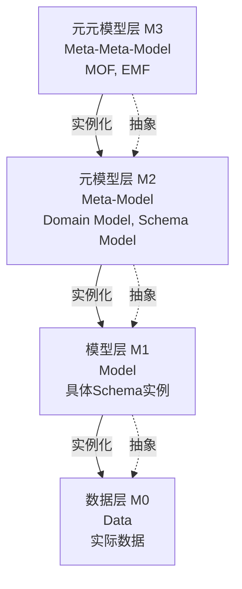

# 元模型理论框架

## 📑 目录

- [元模型理论框架](#元模型理论框架)
  - [📑 目录](#-目录)
  - [1. 概述](#1-概述)
  - [2. 元模型层次结构](#2-元模型层次结构)
  - [3. 元模型关系](#3-元模型关系)
  - [4. 元模型应用](#4-元模型应用)

---

## 1. 概述

本文档提供**元模型理论框架**，用于指导DSL Schema转换的元模型设计和应用。

**元模型理论框架**：

```
元模型理论框架
├── 元模型层次结构（M0-M3层）
├── 元模型关系（抽象、实例化、转换）
└── 元模型应用（模式总结、工具开发）
```

---

## 2. 元模型层次结构

**元模型四层架构（M0-M3）**：



**层次说明**：

**M3层：元元模型层（Meta-Meta-Model）**

- **定义**：定义元模型的语言
- **标准**：MOF（Meta Object Facility）、EMF（Eclipse Modeling Framework）
- **作用**：提供元模型定义的基础设施

**M2层：元模型层（Meta-Model）**

- **定义**：定义模型的语言
- **示例**：Domain Model、Schema Model
- **作用**：定义领域模型和Schema模型的结构

**M1层：模型层（Model）**

- **定义**：具体的模型实例
- **示例**：OpenAPI Schema实例、AsyncAPI Schema实例
- **作用**：表示具体的Schema定义

**M0层：数据层（Data）**

- **定义**：实际的数据
- **示例**：API请求数据、API响应数据
- **作用**：表示实际运行时的数据

---

## 3. 元模型关系

**关系类型**：

**1. 抽象关系（Abstraction）**

- **方向**：M0 → M1 → M2 → M3
- **含义**：从具体到抽象
- **应用**：从数据抽象出模型，从模型抽象出元模型

**2. 实例化关系（Instantiation）**

- **方向**：M3 → M2 → M1 → M0
- **含义**：从抽象到具体
- **应用**：从元模型实例化模型，从模型实例化数据

**3. 转换关系（Transformation）**

- **方向**：同层模型之间
- **含义**：模型之间的转换
- **应用**：OpenAPI Schema ↔ AsyncAPI Schema

---

## 4. 元模型应用

**应用场景**：

**1. 模式总结**

- 基于元模型总结设计模式
- 基于元模型总结架构模式
- 基于元模型总结表征模式

**2. 工具开发**

- 基于元模型开发转换工具
- 基于元模型开发验证工具
- 基于元模型开发生成工具

**3. 标准制定**

- 基于元模型制定Schema标准
- 基于元模型制定转换标准
- 基于元模型制定验证标准

---

**文档创建时间**：2025-01-21
**最后更新**：2025-01-21
**文档版本**：v1.0
**维护者**：DSL Schema研究团队
