# 模式关系图谱

## 📑 目录

- [模式关系图谱](#模式关系图谱)
  - [📑 目录](#-目录)
  - [1. 概述](#1-概述)
  - [2. 设计模式关系](#2-设计模式关系)
  - [3. 架构模式关系](#3-架构模式关系)
  - [4. 表征模式关系](#4-表征模式关系)
  - [5. 信息处理模式关系](#5-信息处理模式关系)
  - [6. 跨模式关系](#6-跨模式关系)

---

## 1. 概述

本文档提供**模式关系图谱**，用于展示51个模式之间的关系网络。

**模式关系类型**：

- **继承关系**：模式之间的继承
- **组合关系**：模式之间的组合
- **依赖关系**：模式之间的依赖
- **转换关系**：模式之间的转换

---

## 2. 设计模式关系

**创建型模式关系**：

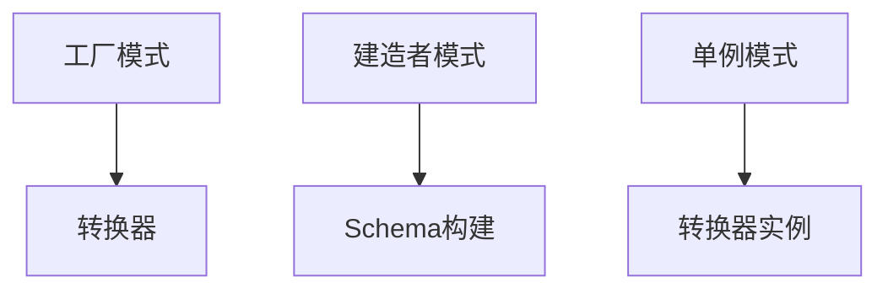

**结构型模式关系**：

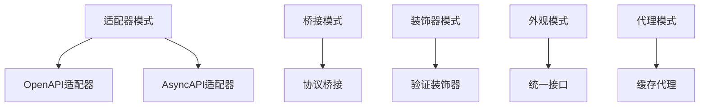

**行为型模式关系**：

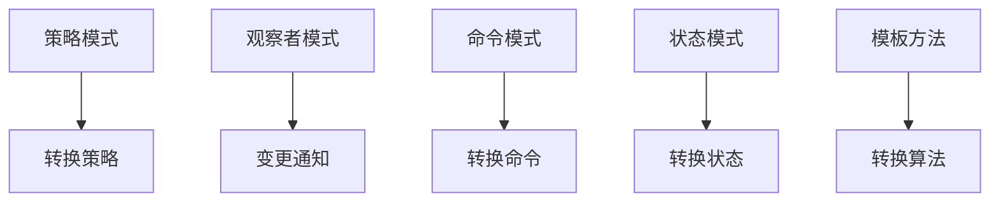

---

## 3. 架构模式关系

**分层架构关系**：

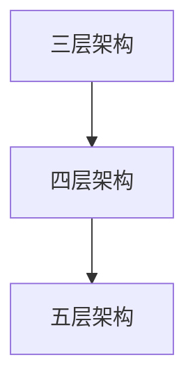

**微服务架构关系**：

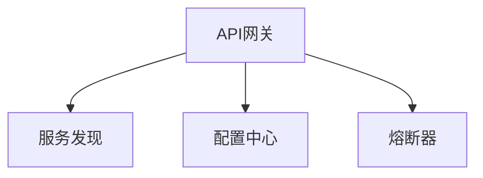

**事件驱动架构关系**：

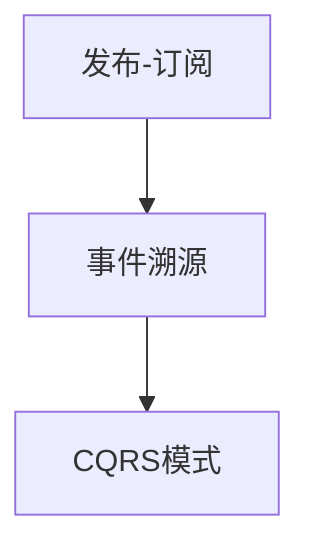

---

## 4. 表征模式关系

**形式化表征关系**：

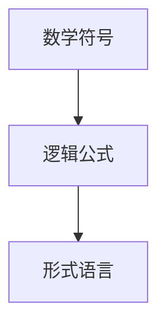

**图形化表征关系**：

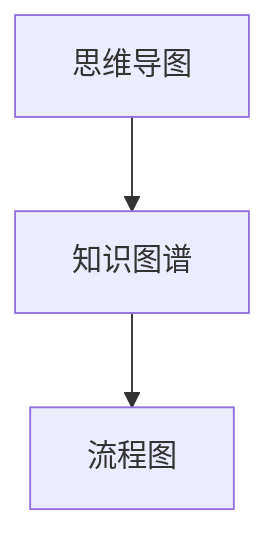

**混合表征关系**：

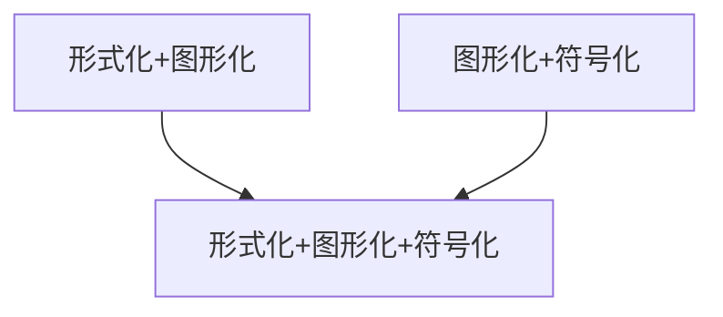

---

## 5. 信息处理模式关系

**ETL模式关系**：

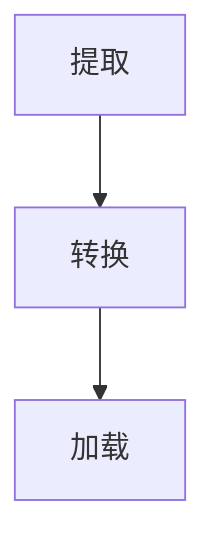

**流处理模式关系**：

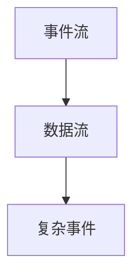

**批处理模式关系**：

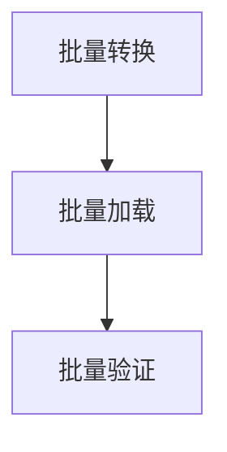

---

## 6. 跨模式关系

**设计模式 ↔ 架构模式**：

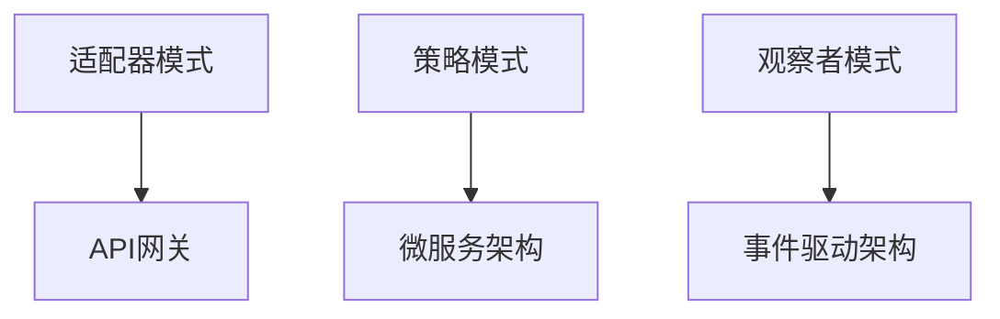

**架构模式 ↔ 信息处理模式**：

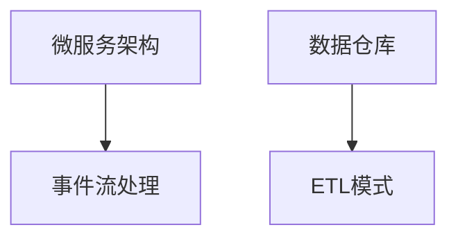

**表征模式 ↔ 设计模式**：

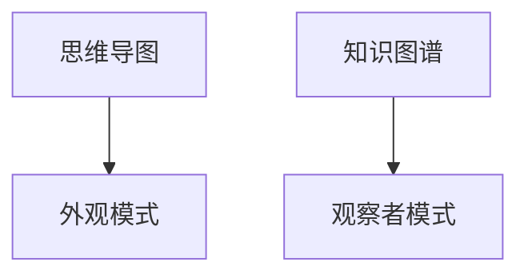

---

**文档创建时间**：2025-01-21
**最后更新**：2025-01-21
**文档版本**：v1.0
**维护者**：DSL Schema研究团队
