# 模式关系图谱

## 📑 目录

- [模式关系图谱](#模式关系图谱)
  - [📑 目录](#-目录)
  - [1. 概述](#1-概述)
  - [2. 设计模式关系](#2-设计模式关系)
  - [3. 架构模式关系](#3-架构模式关系)
  - [4. 表征模式关系](#4-表征模式关系)
  - [5. 信息处理模式关系](#5-信息处理模式关系)
  - [6. 跨模式关系](#6-跨模式关系)
  - [7. 模式应用关系](#7-模式应用关系)
  - [8. 模式选择关系](#8-模式选择关系)

---

## 1. 概述

本文档提供**模式关系图谱**，用于展示51个模式之间的关系网络。

**模式统计**：

- **架构模式**：12个（分层架构3个、微服务4个、事件驱动3个、数据架构3个）
- **设计模式**：15个（创建型3个、结构型5个、行为型5个）
- **信息处理模式**：12个（ETL 3个、流处理3个、批处理3个、实时处理3个）
- **表征模式**：12个（形式化3个、图形化3个、符号化3个、混合3个）
- **总计**：51个模式

**模式关系类型**：

- **继承关系**：模式之间的继承（如三层架构 → 四层架构 → 五层架构）
- **组合关系**：模式之间的组合（如工厂模式 + 策略模式）
- **依赖关系**：模式之间的依赖（如API网关依赖服务发现）
- **转换关系**：模式之间的转换（如ETL模式的提取 → 转换 → 加载）
- **应用关系**：模式在DSL Schema转换中的具体应用关系

---

## 2. 设计模式关系

**创建型模式关系**：

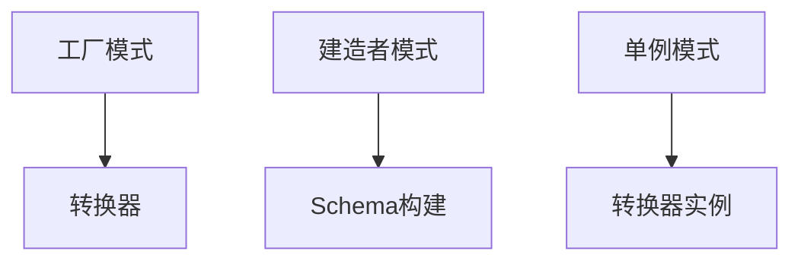

**结构型模式关系**：

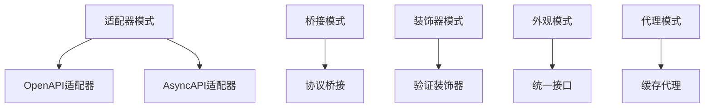

**行为型模式关系**：

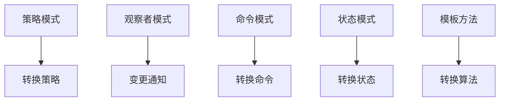

---

## 3. 架构模式关系

**分层架构关系**：

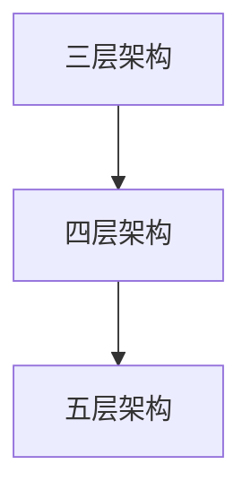

**微服务架构关系**：

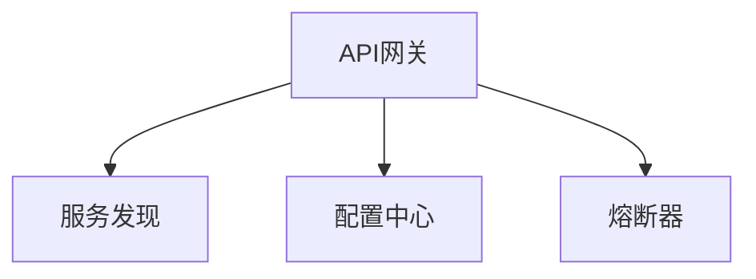

**事件驱动架构关系**：

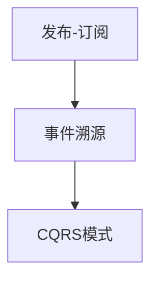

---

## 4. 表征模式关系

**形式化表征关系**：

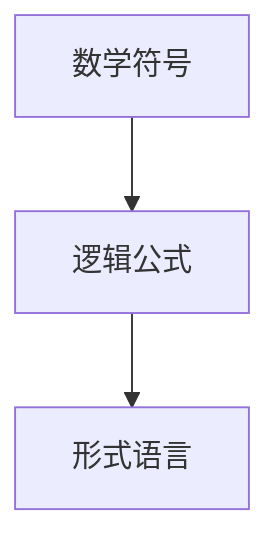

**图形化表征关系**：

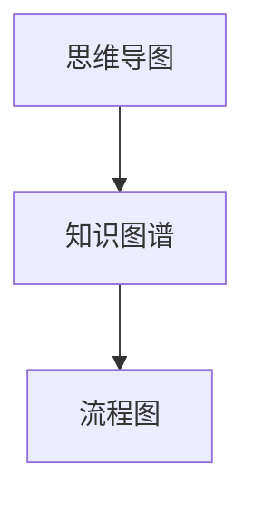

**混合表征关系**：

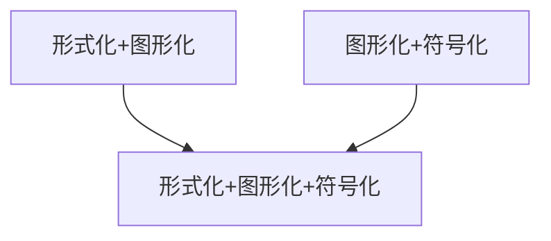

---

## 5. 信息处理模式关系

**ETL模式关系**：

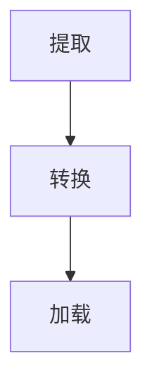

**流处理模式关系**：

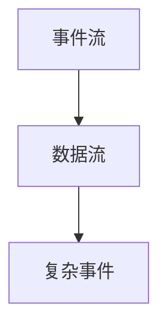

**批处理模式关系**：

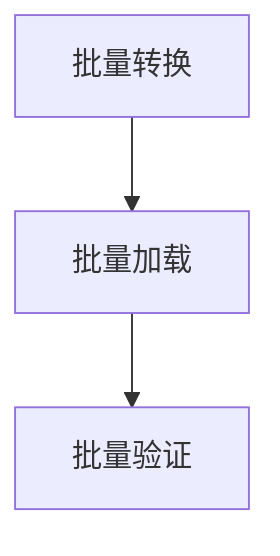

---

## 6. 跨模式关系

**设计模式 ↔ 架构模式**：

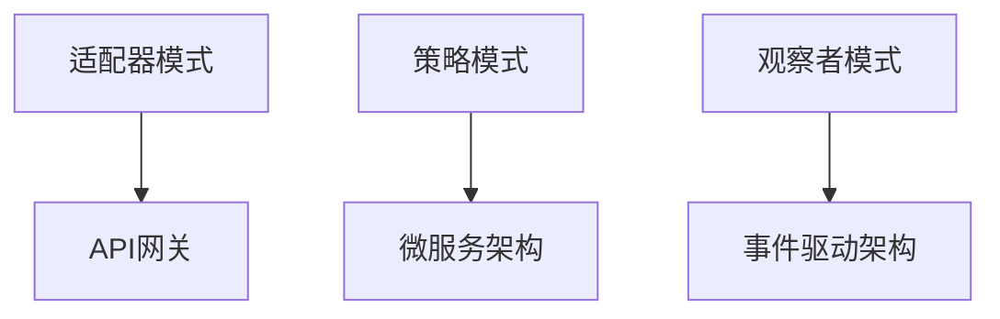

**架构模式 ↔ 信息处理模式**：

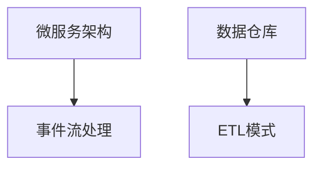

**表征模式 ↔ 设计模式**：

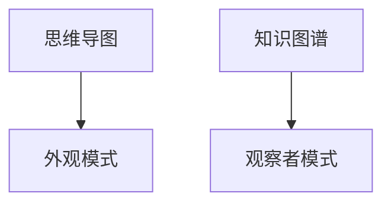

---

## 7. 模式应用关系

**在DSL Schema转换项目中的模式应用关系**：

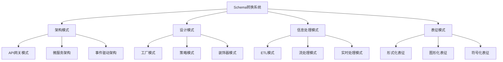

**模式组合示例**：

1. **API网关 + 工厂模式 + 策略模式**
   - API网关路由请求
   - 工厂模式创建转换器
   - 策略模式选择转换策略

2. **事件驱动架构 + 观察者模式 + 流处理模式**
   - 事件驱动架构处理事件
   - 观察者模式通知变更
   - 流处理模式实时处理

3. **数据仓库 + ETL模式 + 批处理模式**
   - 数据仓库存储数据
   - ETL模式提取转换加载
   - 批处理模式批量处理

---

## 8. 模式选择关系

**模式选择决策关系**：

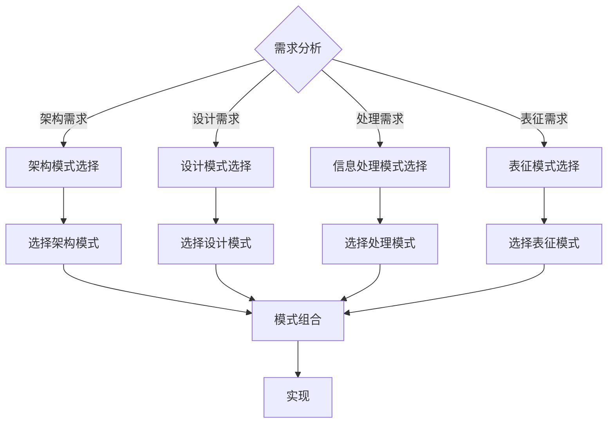

**相关文档**：

- [架构模式总结](./ARCHITECTURE_PATTERNS_SUMMARY.md) - 详细的架构模式说明
- [设计模式总结](./DESIGN_PATTERNS_SUMMARY.md) - 详细的设计模式说明
- [信息处理模式总结](./INFORMATION_PROCESSING_PATTERNS_SUMMARY.md) - 详细的信息处理模式说明
- [表征模式总结](./REPRESENTATION_PATTERNS_SUMMARY.md) - 详细的表征模式说明
- [决策树体系](./DECISION_TREES.md) - 模式选择决策树

---

**文档创建时间**：2025-01-21
**最后更新**：2025-01-27
**文档版本**：v2.0
**维护者**：DSL Schema研究团队
**下次审查时间**：2025-02-21
