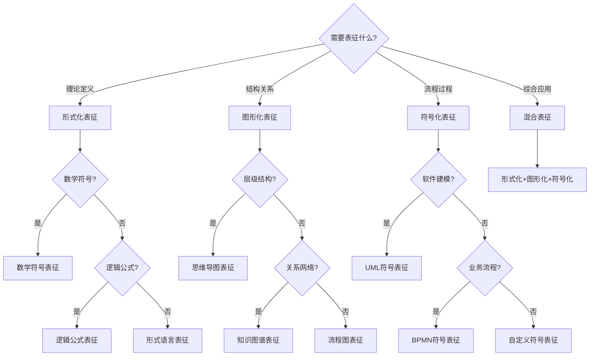

# 表征模式整合框架

## 📑 目录

- [表征模式整合框架](#表征模式整合框架)
  - [📑 目录](#-目录)
  - [1. 概述](#1-概述)
  - [2. 表征模式分类](#2-表征模式分类)
    - [2.1 形式化表征模式](#21-形式化表征模式)
    - [2.2 图形化表征模式](#22-图形化表征模式)
    - [2.3 符号化表征模式](#23-符号化表征模式)
    - [2.4 混合表征模式](#24-混合表征模式)
  - [3. 表征模式选择指南](#3-表征模式选择指南)
  - [4. 表征模式转换工具](#4-表征模式转换工具)
  - [5. 表征模式评估标准](#5-表征模式评估标准)

---

## 1. 概述

本文档提供**表征模式整合框架**，用于整合多种表征模式，提供统一的表征方法。

**框架结构**：

```text
表征模式整合框架
├── 形式化表征模式（3个）
├── 图形化表征模式（3个）
├── 符号化表征模式（3个）
└── 混合表征模式（3个）
```

---

## 2. 表征模式分类

### 2.1 形式化表征模式

**数学符号表征**：

- 使用数学符号表示Schema
- 适用于：形式化定义、理论证明

**逻辑公式表征**：

- 使用逻辑公式表示约束
- 适用于：约束定义、验证规则

**形式语言表征**：

- 使用形式语言表示语法
- 适用于：语法定义、语言规范

### 2.2 图形化表征模式

**思维导图表征**：

- 使用思维导图表示层级结构
- 适用于：知识组织、结构展示

**知识图谱表征**：

- 使用知识图谱表示关系网络
- 适用于：关系网络、知识发现

**流程图表征**：

- 使用流程图表示流程过程
- 适用于：流程展示、过程分析

### 2.3 符号化表征模式

**UML符号表征**：

- 使用UML符号表示模型
- 适用于：软件建模、系统设计

**BPMN符号表征**：

- 使用BPMN符号表示流程
- 适用于：业务流程、工作流设计

**自定义符号表征**：

- 使用自定义符号表示领域概念
- 适用于：领域特定、专业术语

### 2.4 混合表征模式

**形式化+图形化**：

- 结合数学符号和图形
- 适用于：理论可视化、证明展示

**图形化+符号化**：

- 结合图形和符号
- 适用于：模型可视化、流程展示

**形式化+图形化+符号化**：

- 三种方式结合
- 适用于：完整表征、多视角展示

---

## 3. 表征模式选择指南

**选择决策树**：



---

## 4. 表征模式转换工具

**转换工具**：

- **形式化 ↔ 图形化**：自动生成思维导图
- **图形化 ↔ 符号化**：自动生成UML图
- **符号化 ↔ 形式化**：自动生成形式化定义

---

## 5. 表征模式评估标准

**评估维度**：

- **准确性**：表征的准确性
- **完整性**：表征的完整性
- **可理解性**：表征的可理解性
- **可维护性**：表征的可维护性

---

**文档创建时间**：2025-01-21
**最后更新**：2025-01-21
**文档版本**：v1.0
**维护者**：DSL Schema研究团队
