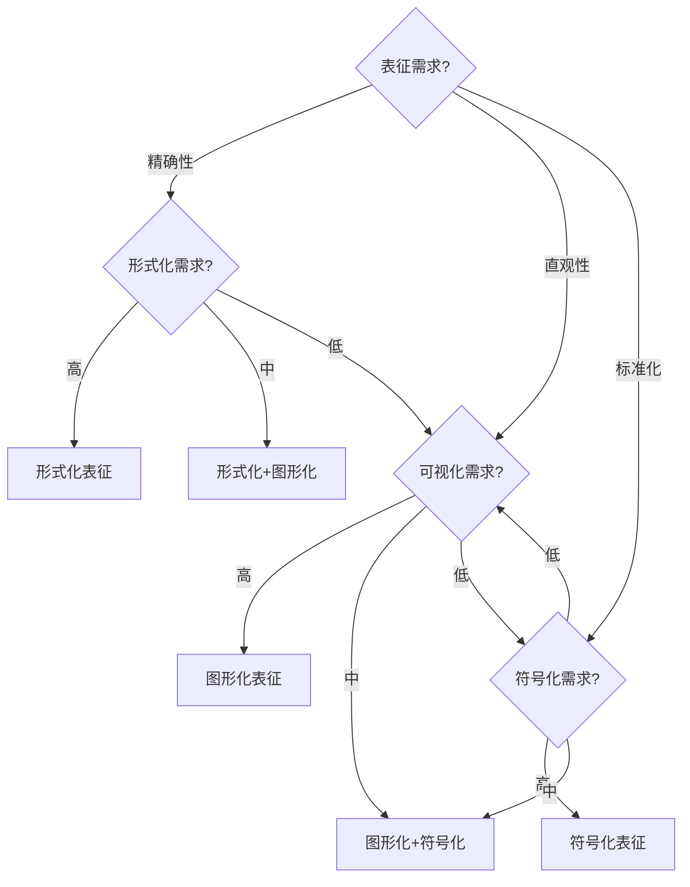

# 表征模式总结

## 📑 目录

- [表征模式总结](#表征模式总结)
  - [📑 目录](#-目录)
  - [1. 概述](#1-概述)
  - [2. 形式化表征模式](#2-形式化表征模式)
    - [2.1 数学符号表征](#21-数学符号表征)
    - [2.2 逻辑公式表征](#22-逻辑公式表征)
    - [2.3 形式语言表征](#23-形式语言表征)
  - [3. 图形化表征模式](#3-图形化表征模式)
    - [3.1 思维导图表征](#31-思维导图表征)
    - [3.2 知识图谱表征](#32-知识图谱表征)
    - [3.3 流程图表征](#33-流程图表征)
  - [4. 符号化表征模式](#4-符号化表征模式)
    - [4.1 UML符号表征](#41-uml符号表征)
    - [4.2 BPMN符号表征](#42-bpmn符号表征)
    - [4.3 自定义符号表征](#43-自定义符号表征)
  - [5. 混合表征模式](#5-混合表征模式)
    - [5.1 形式化+图形化](#51-形式化图形化)
    - [5.2 图形化+符号化](#52-图形化符号化)
    - [5.3 形式化+图形化+符号化](#53-形式化图形化符号化)
  - [6. 表征模式选择指南](#6-表征模式选择指南)
    - [6.1 模式选择决策树](#61-模式选择决策树)
    - [6.2 在DSL Schema转换项目中的应用建议](#62-在dsl-schema转换项目中的应用建议)
  - [7. 总结](#7-总结)

---

## 1. 概述

本文档总结DSL Schema转换中的**12个表征模式**，分为4类：形式化表征、图形化表征、符号化表征、混合表征。

---

## 2. 形式化表征模式

### 2.1 数学符号表征

**定义**：使用数学符号表示Schema。

**示例**：

```text
Schema = (S, T, R, C)
其中：
- S: 结构集合 (Structure Set)
- T: 类型集合 (Type Set)
- R: 关系集合 (Relation Set)
- C: 约束集合 (Constraint Set)
```

**适用场景**：

- 形式化定义
- 理论证明
- 学术研究

**在DSL Schema转换中的应用**：

- **Schema形式化定义**：使用数学符号精确定义Schema
- **转换理论**：形式化转换规则和定理
- **证明系统**：证明转换的正确性

**优缺点**：

- ✅ **优点**：精确、无歧义、适合理论分析
- ❌ **缺点**：可读性差、需要数学背景、实现困难

**实现示例**：

```python
# 数学符号表征的实现
class FormalSchema:
    def __init__(self, S, T, R, C):
        self.structures = S  # 结构集合
        self.types = T       # 类型集合
        self.relations = R   # 关系集合
        self.constraints = C # 约束集合

    def __repr__(self):
        return f"Schema(S={len(self.structures)}, T={len(self.types)}, R={len(self.relations)}, C={len(self.constraints)})"
```

### 2.2 逻辑公式表征

**定义**：使用逻辑公式表示约束。

**示例**：

```text
约束公式：
∀x ∈ Schema: type(x) ∈ ValidTypes
∀r ∈ Relations: valid(r) → ∃s1, s2 ∈ Structures: r(s1, s2)
```

**适用场景**：

- 约束定义
- 验证规则
- 形式化验证

**在DSL Schema转换中的应用**：

- **约束定义**：使用逻辑公式定义Schema约束
- **验证规则**：形式化验证规则
- **转换规则**：形式化转换规则

**优缺点**：

- ✅ **优点**：精确、可验证、支持自动推理
- ❌ **缺点**：复杂度高、需要逻辑知识、工具支持

**实现示例**：

```python
# 逻辑公式表征
class LogicalConstraint:
    def __init__(self, formula):
        self.formula = formula

    def validate(self, schema):
        # 使用逻辑推理引擎验证
        return self.logic_engine.prove(self.formula, schema)

# 示例约束
constraint = LogicalConstraint(
    "∀x ∈ Schema: type(x) ∈ ValidTypes"
)
```

### 2.3 形式语言表征

**定义**：使用形式语言表示语法。

**示例**：

```text
BNF语法：
Schema ::= '{' Structure* '}'
Structure ::= Identifier ':' Type
Type ::= 'string' | 'number' | 'object' | 'array'
```

**适用场景**：

- 语法定义
- 语言规范
- 编译器设计

**在DSL Schema转换中的应用**：

- **Schema语法定义**：使用BNF/EBNF定义Schema语法
- **解析器生成**：从语法定义生成解析器
- **语法转换**：不同语法之间的转换

**优缺点**：

- ✅ **优点**：精确、可自动生成工具、标准化
- ❌ **缺点**：需要语法知识、工具复杂

**实现示例**：

```python
# 使用语法定义解析Schema
from lark import Lark

schema_grammar = """
    schema: "{" structure* "}"
    structure: IDENTIFIER ":" type
    type: "string" | "number" | "object" | "array"
    IDENTIFIER: /[a-zA-Z_][a-zA-Z0-9_]*/
"""

parser = Lark(schema_grammar, start='schema')
tree = parser.parse('{ name: string, age: number }')
```

---

## 3. 图形化表征模式

### 3.1 思维导图表征

**定义**：使用思维导图表示层级结构。

**示例结构**：

```text
        Schema
         /|\
        / | \
    OpenAPI AsyncAPI IoT
      /|\    /|\    /|\
     / | \  / | \  / | \
   API Path Event Device
```

**适用场景**：

- 知识组织
- 结构展示
- 关系可视化

**在DSL Schema转换中的应用**：

- **Schema分类**：使用思维导图组织Schema类型
- **转换路径**：可视化Schema之间的转换路径
- **知识管理**：组织Schema相关知识

**优缺点**：

- ✅ **优点**：直观、易于理解、层次清晰
- ❌ **缺点**：不适合复杂关系、难以精确表达

**实现示例**：

```python
class MindMapGenerator:
    def generate(self, schema_hierarchy):
        # 生成思维导图
        root = Node("Schema")
        for category, schemas in schema_hierarchy.items():
            category_node = Node(category, parent=root)
            for schema in schemas:
                Node(schema, parent=category_node)
        return root
```

### 3.2 知识图谱表征

**定义**：使用知识图谱表示关系网络。

**示例结构**：

```text
OpenAPI ──converts_to──> AsyncAPI
   │                        │
   │                        │
   └──related_to───────────┘
```

**适用场景**：

- 关系网络
- 知识发现
- 语义分析

**在DSL Schema转换中的应用**：

- **Schema关系网络**：表示Schema之间的转换关系
- **知识发现**：发现Schema之间的隐含关系
- **语义分析**：分析Schema的语义关系

**优缺点**：

- ✅ **优点**：关系清晰、支持推理、知识发现
- ❌ **缺点**：构建复杂、需要图数据库、查询复杂

**实现示例**：

```python
class KnowledgeGraph:
    def __init__(self):
        self.nodes = {}
        self.edges = []

    def add_schema(self, schema_id, properties):
        self.nodes[schema_id] = properties

    def add_relation(self, source, target, relation_type):
        self.edges.append({
            "source": source,
            "target": target,
            "type": relation_type
        })

    def find_path(self, source, target):
        # 使用图算法查找路径
        return self.bfs(source, target)
```

### 3.3 流程图表征

**定义**：使用流程图表示流程过程。

**示例流程**：

```text
开始 → 提取Schema → 验证 → 转换 → 优化 → 输出 → 结束
         ↓
      错误处理
```

**适用场景**：

- 流程展示
- 过程分析
- 工作流设计

**在DSL Schema转换中的应用**：

- **转换流程**：可视化Schema转换流程
- **工作流设计**：设计转换工作流
- **流程优化**：分析和优化转换流程

**优缺点**：

- ✅ **优点**：流程清晰、易于理解、支持流程优化
- ❌ **缺点**：复杂流程难以表达、维护困难

**实现示例**：

```python
class FlowchartGenerator:
    def generate(self, process_steps):
        flowchart = []
        flowchart.append("开始")
        for step in process_steps:
            flowchart.append(f"  ↓")
            flowchart.append(f"  {step}")
        flowchart.append("  ↓")
        flowchart.append("结束")
        return "\n".join(flowchart)
```

---

## 4. 符号化表征模式

### 4.1 UML符号表征

**定义**：使用UML符号表示模型。

**UML类图示例**：

```text
┌─────────────────┐
│   Schema        │
├─────────────────┤
│ + id: string    │
│ + type: string  │
│ + content: dict │
├─────────────────┤
│ + validate()    │
│ + convert()     │
└─────────────────┘
```

**适用场景**：

- 软件建模
- 系统设计
- 文档生成

**在DSL Schema转换中的应用**：

- **Schema模型设计**：使用UML设计Schema模型
- **系统架构**：使用UML表示系统架构
- **文档生成**：从UML模型生成文档

**优缺点**：

- ✅ **优点**：标准化、工具支持、易于理解
- ❌ **缺点**：需要UML知识、工具复杂

**实现示例**：

```python
# 使用PlantUML生成UML图
class UMLGenerator:
    def generate_class_diagram(self, classes):
        uml = "@startuml\n"
        for cls in classes:
            uml += f"class {cls.name} {{\n"
            for attr in cls.attributes:
                uml += f"  {attr}\n"
            for method in cls.methods:
                uml += f"  {method}\n"
            uml += "}\n"
        uml += "@enduml"
        return uml
```

### 4.2 BPMN符号表征

**定义**：使用BPMN符号表示流程。

**BPMN示例**：

```text
[开始] → (任务1) → {网关} → (任务2) → [结束]
              ↓
          (错误处理)
```

**适用场景**：

- 业务流程
- 工作流设计
- 流程分析

**在DSL Schema转换中的应用**：

- **转换工作流**：使用BPMN设计转换工作流
- **业务流程**：表示Schema转换的业务流程
- **流程执行**：使用BPMN引擎执行流程

**优缺点**：

- ✅ **优点**：标准化、支持执行、易于理解
- ❌ **缺点**：需要BPMN知识、工具复杂

**实现示例**：

```python
class BPMNGenerator:
    def generate_workflow(self, tasks, gateways):
        bpmn = {
            "start": "开始",
            "tasks": tasks,
            "gateways": gateways,
            "end": "结束"
        }
        return bpmn
```

### 4.3 自定义符号表征

**定义**：使用自定义符号表示领域概念。

**示例**：

```text
Schema符号：
○ = Schema节点
→ = 转换关系
● = 必需字段
○ = 可选字段
```

**适用场景**：

- 领域特定
- 专业术语
- 行业标准

**在DSL Schema转换中的应用**：

- **领域符号**：定义Schema领域的专用符号
- **可视化**：使用自定义符号可视化Schema
- **文档生成**：生成使用自定义符号的文档

**优缺点**：

- ✅ **优点**：领域特定、灵活、易于理解
- ❌ **缺点**：需要学习、工具支持少

**实现示例**：

```python
class CustomSymbolGenerator:
    def __init__(self, symbol_map):
        self.symbols = symbol_map

    def represent(self, schema):
        representation = []
        for field in schema.fields:
            symbol = self.symbols.get(field.type, "?")
            representation.append(f"{symbol} {field.name}")
        return "\n".join(representation)
```

---

## 5. 混合表征模式

### 5.1 形式化+图形化

**定义**：结合数学符号和图形。

**示例**：

```text
数学公式 + 图形：
Schema = (S, T, R, C)
    ↓
[可视化图形]
```

**适用场景**：

- 理论可视化
- 证明展示
- 教学演示

**在DSL Schema转换中的应用**：

- **理论可视化**：将形式化理论可视化
- **教学材料**：制作教学演示材料
- **文档生成**：生成包含公式和图形的文档

**优缺点**：

- ✅ **优点**：精确且直观、适合教学、易于理解
- ❌ **缺点**：制作复杂、需要多种工具

**实现示例**：

```python
class HybridRepresentation:
    def __init__(self, formal_def, visualizer):
        self.formal = formal_def
        self.visualizer = visualizer

    def represent(self):
        # 形式化定义
        formula = self.formal.get_formula()

        # 图形化
        graph = self.visualizer.visualize(self.formal)

        return {
            "formula": formula,
            "graph": graph
        }
```

### 5.2 图形化+符号化

**定义**：结合图形和符号。

**适用场景**：

- 模型可视化
- 流程展示
- 系统设计

**在DSL Schema转换中的应用**：

- **模型可视化**：使用图形和符号可视化Schema模型
- **流程展示**：使用流程图和符号展示转换流程
- **系统设计**：结合图形和符号设计系统

**优缺点**：

- ✅ **优点**：直观且标准化、易于理解、工具支持
- ❌ **缺点**：需要多种工具、制作复杂

**实现示例**：

```python
class GraphicalSymbolicRepresentation:
    def generate(self, model):
        # 生成图形
        graph = self.graph_generator.generate(model)

        # 添加符号
        symbolic_graph = self.symbol_generator.add_symbols(graph)

        return symbolic_graph
```

### 5.3 形式化+图形化+符号化

**定义**：三种方式结合。

**适用场景**：

- 完整表征
- 多视角展示
- 综合应用

**在DSL Schema转换中的应用**：

- **完整文档**：生成包含形式化、图形化、符号化的完整文档
- **多视角展示**：从多个角度展示Schema
- **综合应用**：在复杂场景中综合使用

**优缺点**：

- ✅ **优点**：完整、多视角、适合复杂场景
- ❌ **缺点**：制作复杂、维护困难、需要多种工具

**实现示例**：

```python
class ComprehensiveRepresentation:
    def __init__(self, formal, graphical, symbolic):
        self.formal = formal
        self.graphical = graphical
        self.symbolic = symbolic

    def represent(self, schema):
        return {
            "formal": self.formal.represent(schema),
            "graphical": self.graphical.represent(schema),
            "symbolic": self.symbolic.represent(schema)
        }
```

---

## 6. 表征模式选择指南

### 6.1 模式选择决策树



### 6.2 在DSL Schema转换项目中的应用建议

**推荐模式组合**：

1. **理论文档**：形式化表征 + 图形化表征
2. **用户文档**：图形化表征 + 符号化表征
3. **技术文档**：形式化表征 + 符号化表征
4. **完整文档**：三种模式结合

**完整示例**：

```python
# 综合使用多种表征模式
class SchemaDocumentation:
    def __init__(self):
        self.formal = FormalRepresentation()
        self.graphical = GraphicalRepresentation()
        self.symbolic = SymbolicRepresentation()

    def generate_documentation(self, schema):
        return {
            "formal_definition": self.formal.define(schema),
            "visualization": self.graphical.visualize(schema),
            "symbolic_diagram": self.symbolic.diagram(schema)
        }
```

---

## 7. 总结

本文档详细介绍了DSL Schema转换项目中的**12个表征模式**，分为4大类：

1. **形式化表征模式**（3个）：数学符号表征、逻辑公式表征、形式语言表征
2. **图形化表征模式**（3个）：思维导图表征、知识图谱表征、流程图表征
3. **符号化表征模式**（3个）：UML符号表征、BPMN符号表征、自定义符号表征
4. **混合表征模式**（3个）：形式化+图形化、图形化+符号化、形式化+图形化+符号化

每个模式都包含：

- 定义和示例
- 适用场景
- 在DSL Schema转换中的具体应用
- 优缺点分析
- 实现示例代码

**核心价值**：

- 为文档和可视化提供参考
- 帮助选择合适的表征方式
- 提供实现示例和最佳实践
- 支持多视角展示和理解

**相关文档**：

- [架构模式总结](./ARCHITECTURE_PATTERNS_SUMMARY.md) - 12个架构模式
- [设计模式总结](./DESIGN_PATTERNS_SUMMARY.md) - 15个设计模式
- [信息处理模式总结](./INFORMATION_PROCESSING_PATTERNS_SUMMARY.md) - 12个信息处理模式
- [决策树体系](./DECISION_TREES.md) - 模式选择决策树

---

**文档创建时间**：2025-01-21
**最后更新**：2025-01-27
**文档版本**：v2.0
**维护者**：DSL Schema研究团队
**下次审查时间**：2025-02-21
