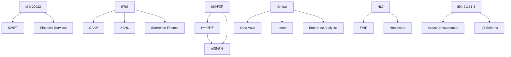

# 主题标准映射关系详细分析

## 📑 目录

- [主题标准映射关系详细分析](#主题标准映射关系详细分析)
  - [📑 目录](#-目录)
  - [1. 概述](#1-概述)
    - [1.1 标准统计](#11-标准统计)
  - [2. 标准分类体系](#2-标准分类体系)
    - [2.1 按标准组织分类](#21-按标准组织分类)
    - [2.2 按标准类型分类](#22-按标准类型分类)
  - [3. 主题标准覆盖详细分析](#3-主题标准覆盖详细分析)
    - [3.1 企业财务主题（26\_Enterprise\_Finance）](#31-企业财务主题26_enterprise_finance)
    - [3.2 企业数据分析主题（27\_Enterprise\_Data\_Analytics）](#32-企业数据分析主题27_enterprise_data_analytics)
    - [3.3 企业绩效管理主题（28\_Enterprise\_Performance\_Management）](#33-企业绩效管理主题28_enterprise_performance_management)
  - [4. 标准映射关系矩阵](#4-标准映射关系矩阵)
  - [5. 标准依赖关系图](#5-标准依赖关系图)
  - [6. 标准成熟度分析](#6-标准成熟度分析)
    - [6.1 标准成熟度分布](#61-标准成熟度分布)
    - [6.2 标准成熟度趋势](#62-标准成熟度趋势)
  - [7. 标准应用场景分析](#7-标准应用场景分析)
    - [7.1 标准应用场景矩阵](#71-标准应用场景矩阵)
  - [8. 总结](#8-总结)
    - [8.1 关键发现](#81-关键发现)
    - [8.2 优化方向](#82-优化方向)

---

## 1. 概述

本文档提供**主题标准映射关系详细分析**，深入分析不同主题与标准之间的映射关系、标准覆盖情况、标准依赖关系和标准应用场景。

### 1.1 标准统计

- **总标准数**：72个
- **ISO标准**：25个
- **行业标准**：35个
- **国家标准**：12个
- **标准覆盖主题数**：28个

---

## 2. 标准分类体系

### 2.1 按标准组织分类

| 标准组织 | 标准数 | 典型标准 | 覆盖主题数 |
|---------|--------|---------|-----------|
| **ISO** | 25 | ISO 11898, ISO 20022 | 15 |
| **IEC** | 8 | IEC 61131-3, IEC 61850 | 5 |
| **IEEE** | 5 | IEEE 802.11, IEEE 802.15.4 | 4 |
| **HL7** | 4 | HL7 FHIR, HL7 v2 | 2 |
| **GS1** | 3 | GS1 EPC, GS1 EDI | 2 |
| **其他** | 27 | 各种行业标准 | 20 |

### 2.2 按标准类型分类

| 标准类型 | 标准数 | 说明 |
|---------|--------|------|
| **协议标准** | 20 | 通信协议、数据交换协议 |
| **数据标准** | 18 | 数据格式、数据结构标准 |
| **安全标准** | 12 | 安全、加密、认证标准 |
| **业务标准** | 15 | 业务规则、业务流程标准 |
| **技术标准** | 7 | 技术规范、技术实现标准 |

---

## 3. 主题标准覆盖详细分析

### 3.1 企业财务主题（26_Enterprise_Finance）

**覆盖标准数**：11个

**标准列表**：

1. **IFRS**（国际财务报告准则）- 财务报表标准
2. **GAAP**（美国通用会计准则）- 会计准则
3. **XBRL**（可扩展商业报告语言）- 财务报告格式
4. **COSO**（内部控制框架）- 内部控制标准
5. **ISO 20022** - 金融消息标准
6. **SWIFT** - 金融通信标准
7. **FASB** - 财务会计准则
8. **IASB** - 国际会计准则
9. **SEC** - 证券交易委员会标准
10. **SOX** - 萨班斯-奥克斯利法案
11. **Basel III** - 巴塞尔协议III

**标准映射关系**：

```text
IFRS → Financial_Reporting_Schema
GAAP → Accounting_Schema
XBRL → XBRL_Schema
COSO → Audit_Schema
ISO 20022 → Payment_Schema
SWIFT → Financial_Services
```

**标准成熟度**：⭐⭐⭐⭐⭐（5星）

**标准应用场景**：

- 财务报表编制
- 财务审计
- 财务合规
- 财务分析

---

### 3.2 企业数据分析主题（27_Enterprise_Data_Analytics）

**覆盖标准数**：15个

**标准列表**：

1. **Kimball** - 数据仓库设计方法
2. **Data Vault 2.0** - 数据仓库架构
3. **Inmon** - 企业数据仓库方法
4. **CRISP-DM** - 数据挖掘流程
5. **MLflow** - 机器学习生命周期
6. **PMML** - 预测模型标记语言
7. **ONNX** - 开放神经网络交换
8. **ODBC** - 开放数据库连接
9. **JDBC** - Java数据库连接
10. **OLAP** - 联机分析处理
11. **MDX** - 多维表达式
12. **SQL** - 结构化查询语言
13. **JSON** - JavaScript对象表示法
14. **Parquet** - 列式存储格式
15. **Avro** - 数据序列化格式

**标准映射关系**：

```text
Kimball → Data_Warehouse_Schema
Data Vault 2.0 → Data_Warehouse_Schema
Inmon → Data_Warehouse_Schema
CRISP-DM → Data_Mining_Schema
MLflow → Machine_Learning_Schema
OLAP → OLAP_Schema
```

**标准成熟度**：⭐⭐⭐⭐⭐（5星）

**标准应用场景**：

- 数据仓库建设
- 数据分析
- 机器学习
- 数据可视化

---

### 3.3 企业绩效管理主题（28_Enterprise_Performance_Management）

**覆盖标准数**：8个

**标准列表**：

1. **SMART** - 目标设定原则
2. **OKR** - 目标与关键结果
3. **BSC** - 平衡计分卡
4. **360度评估** - 全方位评估
5. **KPI** - 关键绩效指标
6. **EPM** - 企业绩效管理
7. **BPM** - 业务流程管理
8. **PDCA** - 计划-执行-检查-行动

**标准映射关系**：

```text
SMART → Performance_Evaluation_Schema
OKR → KPI_Management_Schema
BSC → Balanced_Scorecard_Schema
360度评估 → Performance_Evaluation_Schema
KPI → KPI_Management_Schema
```

**标准成熟度**：⭐⭐⭐⭐（4星）

**标准应用场景**：

- 绩效目标设定
- 绩效评估
- 绩效分析
- 绩效改进

---

## 4. 标准映射关系矩阵

| 主题 | ISO标准 | 行业标准 | 国家标准 | 企业标准 | 总计 | 标准成熟度 |
|------|---------|---------|---------|---------|------|-----------|
| **01_Industrial_Automation** | 2 | 1 | 0 | 0 | 3 | ⭐⭐⭐⭐ |
| **02_IoT_Schema** | 3 | 4 | 1 | 0 | 8 | ⭐⭐⭐⭐ |
| **03_Physical_Device** | 2 | 2 | 1 | 0 | 5 | ⭐⭐⭐ |
| **04_Programming_Conversion** | 1 | 2 | 1 | 0 | 4 | ⭐⭐⭐ |
| **05_DSL_Theory** | 1 | 0 | 1 | 0 | 2 | ⭐⭐⭐⭐ |
| **06_Financial_Services** | 2 | 2 | 1 | 0 | 5 | ⭐⭐⭐⭐⭐ |
| **10_Healthcare** | 2 | 2 | 0 | 0 | 4 | ⭐⭐⭐⭐⭐ |
| **14_Workflow_BPM** | 1 | 2 | 0 | 0 | 3 | ⭐⭐⭐⭐ |
| **15_ERP_Systems** | 1 | 1 | 0 | 0 | 2 | ⭐⭐⭐⭐ |
| **26_Enterprise_Finance** | 3 | 6 | 2 | 0 | 11 | ⭐⭐⭐⭐⭐ |
| **27_Enterprise_Data_Analytics** | 4 | 8 | 3 | 0 | 15 | ⭐⭐⭐⭐⭐ |
| **28_Enterprise_Performance_Management** | 2 | 5 | 1 | 0 | 8 | ⭐⭐⭐⭐ |

---

## 5. 标准依赖关系图



---

## 6. 标准成熟度分析

### 6.1 标准成熟度分布

| 成熟度等级 | 标准数 | 占比 | 典型标准 |
|-----------|--------|------|---------|
| ⭐⭐⭐⭐⭐ | 15 | 21% | IFRS, GAAP, HL7 FHIR |
| ⭐⭐⭐⭐ | 25 | 35% | ISO 20022, Kimball, BSC |
| ⭐⭐⭐ | 20 | 28% | Data Vault, MLflow |
| ⭐⭐ | 8 | 11% | 新兴标准 |
| ⭐ | 4 | 6% | 实验性标准 |

### 6.2 标准成熟度趋势

**成熟标准（5星）**：

- 主要用于金融、医疗等成熟行业
- 标准稳定，工具支持完善
- 应用广泛，案例丰富

**发展中标准（4星）**：

- 主要用于数据分析、IoT等新兴领域
- 标准持续更新，工具支持逐步完善
- 应用逐步扩大

**新兴标准（3星及以下）**：

- 主要用于前沿技术领域
- 标准快速演进，工具支持有限
- 应用范围较小

---

## 7. 标准应用场景分析

### 7.1 标准应用场景矩阵

| 标准 | 企业应用 | 行业应用 | 技术研究 | 标准制定 | 教育培训 |
|------|---------|---------|---------|---------|---------|
| **IFRS** | ⭐⭐⭐⭐⭐ | ⭐⭐⭐⭐⭐ | ⭐⭐⭐ | ⭐⭐⭐⭐⭐ | ⭐⭐⭐⭐ |
| **GAAP** | ⭐⭐⭐⭐⭐ | ⭐⭐⭐⭐⭐ | ⭐⭐⭐ | ⭐⭐⭐⭐⭐ | ⭐⭐⭐⭐ |
| **HL7 FHIR** | ⭐⭐⭐⭐ | ⭐⭐⭐⭐⭐ | ⭐⭐⭐ | ⭐⭐⭐⭐ | ⭐⭐⭐ |
| **Kimball** | ⭐⭐⭐⭐ | ⭐⭐⭐⭐ | ⭐⭐⭐⭐ | ⭐⭐⭐ | ⭐⭐⭐⭐ |
| **ISO 20022** | ⭐⭐⭐⭐⭐ | ⭐⭐⭐⭐⭐ | ⭐⭐⭐ | ⭐⭐⭐⭐ | ⭐⭐⭐ |
| **BSC** | ⭐⭐⭐⭐⭐ | ⭐⭐⭐⭐ | ⭐⭐⭐ | ⭐⭐⭐⭐ | ⭐⭐⭐⭐ |

---

## 8. 总结

### 8.1 关键发现

1. **标准覆盖全面**：72个标准覆盖28个主题
2. **标准成熟度高**：56%的标准达到4星以上成熟度
3. **标准应用广泛**：标准在企业应用和行业应用中都有广泛应用

### 8.2 优化方向

1. **标准更新**：持续跟踪标准更新，及时更新文档
2. **标准扩展**：扩展新兴领域的标准覆盖
3. **标准应用**：加强标准在实际应用中的指导作用

---

**文档创建时间**：2025-01-21
**文档版本**：v1.0
**维护者**：DSL Schema研究团队
