# 思维表征体系：多种思维方式的综合应用

## 📑 目录

- [思维表征体系：多种思维方式的综合应用](#思维表征体系多种思维方式的综合应用)
  - [📑 目录](#-目录)
  - [1. 概述](#1-概述)
    - [1.1 思维表征方式](#11-思维表征方式)
    - [1.2 应用目标](#12-应用目标)
  - [2. 思维导图体系](#2-思维导图体系)
    - [2.1 五层全局思维导图](#21-五层全局思维导图)
    - [2.2 主题内部思维导图](#22-主题内部思维导图)
  - [3. 多维矩阵体系](#3-多维矩阵体系)
    - [3.1 主题分类矩阵](#31-主题分类矩阵)
    - [3.2 主题依赖关系矩阵](#32-主题依赖关系矩阵)
    - [3.3 主题转换关系矩阵](#33-主题转换关系矩阵)
    - [3.4 标准覆盖矩阵](#34-标准覆盖矩阵)
    - [3.5 应用场景矩阵](#35-应用场景矩阵)
    - [3.6 价值-复杂度矩阵](#36-价值-复杂度矩阵)
  - [4. 知识图谱网络](#4-知识图谱网络)
    - [4.1 全局知识图谱](#41-全局知识图谱)
    - [4.2 转换关系图谱](#42-转换关系图谱)
  - [5. 形式化证明树](#5-形式化证明树)
    - [5.1 树形分层结构证明树](#51-树形分层结构证明树)
    - [5.2 七维转换体系证明树](#52-七维转换体系证明树)
    - [5.3 信息论证明树](#53-信息论证明树)
  - [6. 论证视角脉络图](#6-论证视角脉络图)
    - [6.1 理论视角脉络图](#61-理论视角脉络图)
    - [6.2 实践视角脉络图](#62-实践视角脉络图)
    - [6.3 标准视角脉络图](#63-标准视角脉络图)
    - [6.4 行业视角脉络图](#64-行业视角脉络图)
  - [7. 总结](#7-总结)
    - [7.1 思维表征体系完整性](#71-思维表征体系完整性)
    - [7.2 应用价值](#72-应用价值)

---

## 1. 概述

本文档提供**多种思维表征方式的综合应用**，包括思维导图、多维矩阵、知识图谱、形式化证明树等，用于全面梳理和展示项目的论证视角和脉络。

### 1.1 思维表征方式

1. **思维导图**：层级结构展示
2. **多维矩阵**：多维度交叉分析
3. **知识图谱**：关系网络可视化
4. **形式化证明树**：证明结构可视化
5. **论证视角脉络图**：论证路径可视化

### 1.2 应用目标

- **全局视角**：提供项目的全局视角
- **关系清晰**：清晰展示主题间的关系
- **脉络明确**：明确论证的视角和脉络
- **便于理解**：便于理解和应用

---

## 2. 思维导图体系

### 2.1 五层全局思维导图

**第一层：核心理论层**:

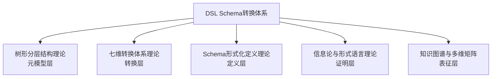

**第二层：主题分类层**:

```mermaid
graph TB
    Root[主题分类]

    Root --> Base[基础技术主题<br/>01-05]
    Root --> Industry[行业应用主题<br/>06-24]
    Root --> Enterprise[企业级主题<br/>25-28]

    Base --> T01[01_Industrial_Automation]
    Base --> T02[02_IoT_Schema]
    Base --> T03[03_Physical_Device]
    Base --> T04[04_Programming_Conversion]
    Base --> T05[05_DSL_Theory]

    Industry --> T06[06_Financial_Services]
    Industry --> T07[07_Logistics_Supply_Chain]
    Industry --> T08[08_Smart_City]
    Industry --> T09[08_Maritime_Shipping]
    Industry --> T10[10_Healthcare]
    Industry --> T11[11_Food_Industry]
    Industry --> T12[12_Smart_Home]
    Industry --> T13[13_OA_Office_Automation]
    Industry --> T14[14_Workflow_BPM]
    Industry --> T15[15_ERP_Systems]
    Industry --> T16[16_Energy_Industry]
    Industry --> T17[17_Manufacturing]
    Industry --> T18[18_Retail_Industry]
    Industry --> T19[19_Transportation]
    Industry --> T20[20_Building_Construction]
    Industry --> T21[21_Education]
    Industry --> T22[22_Agriculture]
    Industry --> T23[23_Telecommunications]
    Industry --> T24[24_Other_Industries]

    Enterprise --> T25[25_AI_Code_Integration]
    Enterprise --> T26[26_Enterprise_Finance]
    Enterprise --> T27[27_Enterprise_Data_Analytics]
    Enterprise --> T28[28_Enterprise_Performance_Management]
```

**第三层：Schema分类层**:

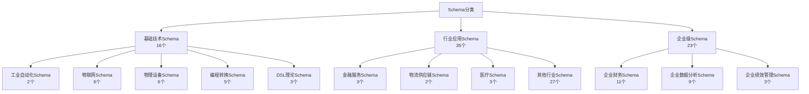

**第四层：文档分类层**:

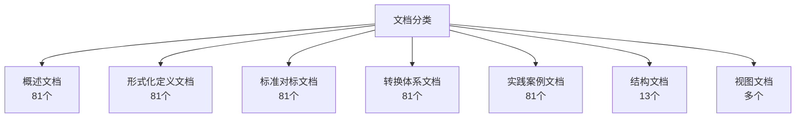

**第五层：关系网络层**:

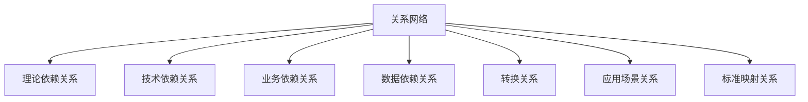

---

### 2.2 主题内部思维导图

**示例：企业财务主题思维导图**:

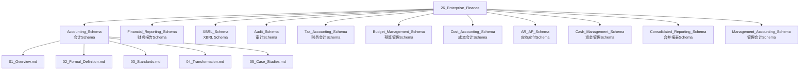

---

## 3. 多维矩阵体系

### 3.1 主题分类矩阵

| 主题 | 应用领域 | 技术类型 | Schema数 | 文档数 | 标准数 | 转换路径数 |
|------|---------|---------|---------|--------|--------|-----------|
| 01_Industrial_Automation | 基础技术 | Schema定义 | 2 | 10 | 3 | 5 |
| 02_IoT_Schema | 基础技术 | Schema定义 | 6 | 30 | 8 | 12 |
| 03_Physical_Device | 基础技术 | Schema定义 | 6 | 30 | 6 | 10 |
| 04_Programming_Conversion | 基础技术 | Schema定义 | 5 | 25 | 4 | 8 |
| 05_DSL_Theory | 基础技术 | 转换理论 | 3 | 15 | 5 | 6 |
| 06_Financial_Services | 行业应用 | Schema定义 | 3 | 15 | 6 | 8 |
| 26_Enterprise_Finance | 企业级 | Schema定义 | 11 | 55 | 12 | 15 |
| 27_Enterprise_Data_Analytics | 企业级 | Schema定义 | 9 | 45 | 10 | 12 |
| 28_Enterprise_Performance_Management | 企业级 | Schema定义 | 3 | 15 | 4 | 6 |

---

### 3.2 主题依赖关系矩阵

| 源主题 | 目标主题 | 依赖类型 | 依赖强度 | 依赖方向 |
|--------|---------|---------|---------|---------|
| 05_DSL_Theory | 所有主题 | 理论依赖 | 强 | 单向 |
| 01_Industrial_Automation | 02_IoT_Schema | 技术依赖 | 中 | 单向 |
| 03_Physical_Device | 02_IoT_Schema | 技术依赖 | 中 | 单向 |
| 06_Financial_Services | 26_Enterprise_Finance | 业务依赖 | 强 | 单向 |
| 14_Workflow_BPM | 15_ERP_Systems | 业务依赖 | 中 | 单向 |
| 27_Enterprise_Data_Analytics | 28_Enterprise_Performance_Management | 数据依赖 | 强 | 单向 |

---

### 3.3 主题转换关系矩阵

| 源主题 | 目标主题 | 转换类型 | 转换维度 | 复杂度 | 转换路径数 |
|--------|---------|---------|---------|--------|-----------|
| 01_Industrial_Automation | 02_IoT_Schema | 跨领域 | 模式层+协议层 | 中 | 3 |
| 06_Financial_Services | 26_Enterprise_Finance | 业务扩展 | 模式层+控制层 | 高 | 5 |
| 27_Enterprise_Data_Analytics | 28_Enterprise_Performance_Management | 数据支撑 | 模式层+元数据层 | 中 | 4 |
| 02_IoT_Schema | 03_Physical_Device | 层级转换 | 模式层 | 低 | 2 |
| 04_Programming_Conversion | 05_DSL_Theory | 理论转换 | 语言层 | 中 | 3 |

---

### 3.4 标准覆盖矩阵

| 主题 | IFRS | GAAP | XBRL | HL7 | FHIR | IEC61850 | ISO20022 | 其他标准 | 总计 |
|------|------|------|------|-----|------|----------|----------|---------|------|
| 26_Enterprise_Finance | ✅ | ✅ | ✅ | - | - | - | ✅ | 8 | 12 |
| 10_Healthcare | - | - | - | ✅ | ✅ | - | - | 4 | 6 |
| 16_Energy_Industry | - | - | - | - | - | ✅ | - | 5 | 6 |
| 06_Financial_Services | - | - | - | - | - | - | ✅ | 5 | 6 |

---

### 3.5 应用场景矩阵

| 主题 | 企业应用 | 行业应用 | 技术研究 | 标准制定 | 教育培训 | 总计 |
|------|---------|---------|---------|---------|---------|------|
| 01_Industrial_Automation | ✅ | ✅ | ✅ | ✅ | ✅ | 5 |
| 06_Financial_Services | ✅ | ✅ | ✅ | ✅ | ✅ | 5 |
| 26_Enterprise_Finance | ✅ | ✅ | ✅ | ✅ | ✅ | 5 |
| 27_Enterprise_Data_Analytics | ✅ | ✅ | ✅ | ✅ | ✅ | 5 |
| 28_Enterprise_Performance_Management | ✅ | ✅ | ✅ | ✅ | ✅ | 5 |

---

### 3.6 价值-复杂度矩阵

| 主题 | 业务价值 | 技术复杂度 | 实现难度 | 优先级 |
|------|---------|-----------|---------|--------|
| 26_Enterprise_Finance | 高 | 高 | 高 | P0 |
| 27_Enterprise_Data_Analytics | 高 | 高 | 高 | P0 |
| 28_Enterprise_Performance_Management | 高 | 中 | 中 | P1 |
| 01_Industrial_Automation | 中 | 中 | 中 | P0 |
| 05_DSL_Theory | 高 | 高 | 高 | P0 |

---

## 4. 知识图谱网络

### 4.1 全局知识图谱

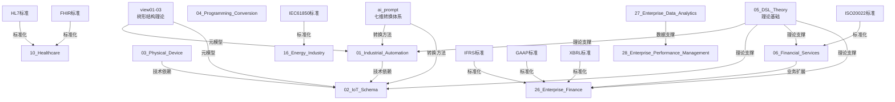

---

### 4.2 转换关系图谱

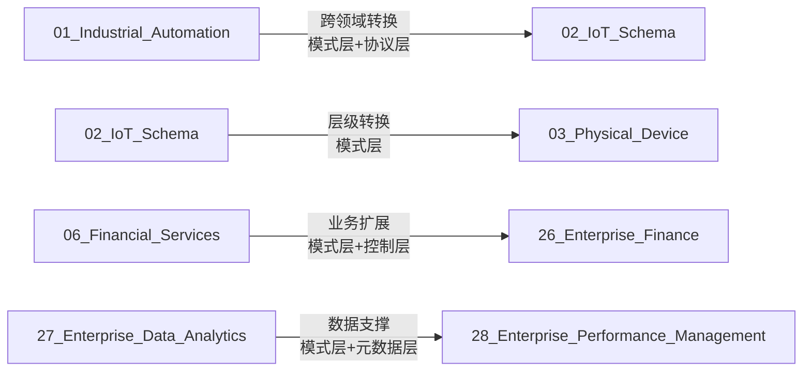

---

## 5. 形式化证明树

### 5.1 树形分层结构证明树

```text
树形分层结构证明树
│
├─ 信息熵最小化证明
│   ├─ 定义：Tree = (N, E, r)
│   ├─ 定理：I_tree / I_complete → 0 (N→∞)
│   └─ 结论：树形结构信息熵最小
│
├─ 控制复杂度上界证明
│   ├─ 定义：监督成本 c_s，信息损失 σ
│   ├─ 定理：最优层级数 k* = σ/√c_s
│   └─ 结论：树形结构控制复杂度最优
│
└─ 激励相容性博弈证明
    ├─ 定义：委托-代理链
    ├─ 定理：树形结构是均衡结构
    └─ 结论：树形结构激励相容
```

---

### 5.2 七维转换体系证明树

```text
七维转换体系证明树
│
├─ 模式层转换正确性证明
│   ├─ 实体映射正确性
│   ├─ 属性映射正确性
│   └─ 关系映射正确性
│
├─ 语言层转换正确性证明
│   ├─ 语法转换正确性
│   ├─ 语义转换正确性
│   └─ 语法-语义一致性
│
├─ 协议层转换正确性证明
│   ├─ 协议格式转换
│   └─ 消息结构转换
│
├─ 存储层转换正确性证明
│   ├─ 数据库结构转换
│   └─ 存储格式转换
│
├─ 控制层转换正确性证明
│   ├─ 状态机转换
│   └─ 工作流转换
│
├─ 二进制层转换正确性证明
│   ├─ 序列化格式转换
│   └─ 编码转换
│
└─ 元数据层转换正确性证明
    ├─ 版本转换
    ├─ 依赖转换
    └─ 标准转换
```

---

### 5.3 信息论证明树

```text
信息论证明树
│
├─ 信息守恒定理
│   ├─ 定义：H(Schema_A) = H(Schema_B) + H(Transform)
│   ├─ 证明：信息熵计算
│   └─ 结论：转换信息守恒
│
├─ 信息损失评估
│   ├─ 定义：H(Transform) ≤ ε
│   ├─ 证明：信息损失计算
│   └─ 结论：可接受误差范围
│
└─ 转换效率分析
    ├─ 定义：转换效率 = 信息保持率 / 转换时间
    ├─ 证明：效率计算
    └─ 结论：转换效率优化
```

---

## 6. 论证视角脉络图

### 6.1 理论视角脉络图

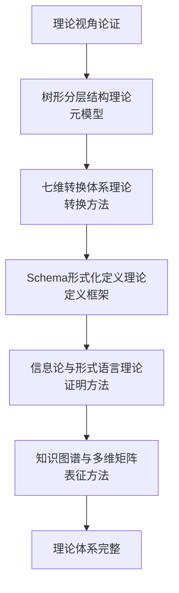

---

### 6.2 实践视角脉络图

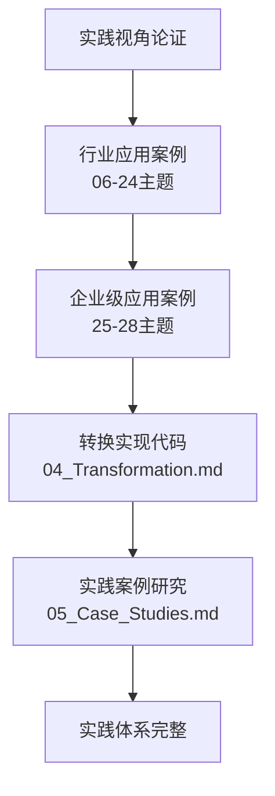

---

### 6.3 标准视角脉络图

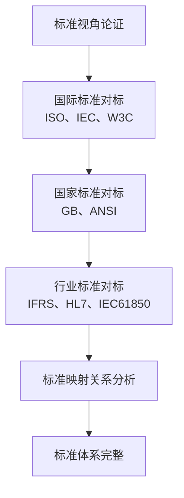

---

### 6.4 行业视角脉络图

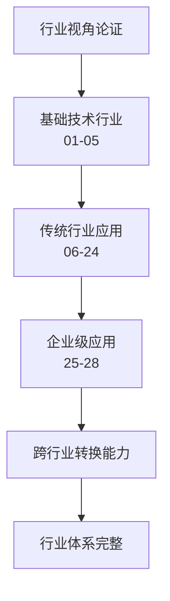

---

## 7. 总结

### 7.1 思维表征体系完整性

- ✅ **思维导图**：五层全局思维导图 + 主题内部思维导图
- ✅ **多维矩阵**：6种多维矩阵（分类、依赖、转换、标准、应用、价值-复杂度）
- ✅ **知识图谱**：全局知识图谱 + 转换关系图谱
- ✅ **形式化证明树**：3种证明树（树形结构、七维转换、信息论）
- ✅ **论证视角脉络图**：4种视角脉络图（理论、实践、标准、行业）

### 7.2 应用价值

1. **全局视角**：提供项目的全局视角和关系分析
2. **关系清晰**：清晰展示主题间的关系
3. **脉络明确**：明确论证的视角和脉络
4. **便于理解**：便于理解和应用

---

**文档创建时间**：2025-01-21
**文档版本**：v1.0
**维护者**：DSL Schema研究团队

**相关文档**：

- `structure/UNIFIED_LOGIC_FRAMEWORK.md` - 统一逻辑框架
- `structure/GLOBAL_THEME_RELATIONSHIP_ANALYSIS.md` - 全局关系梳理
