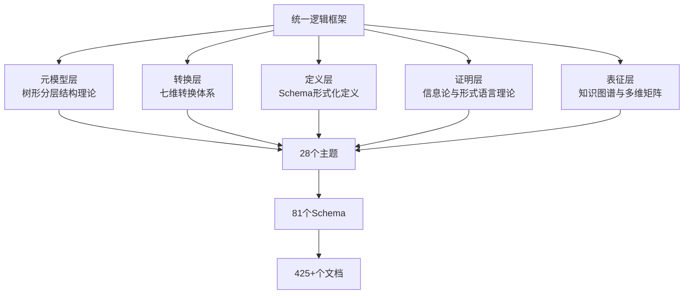
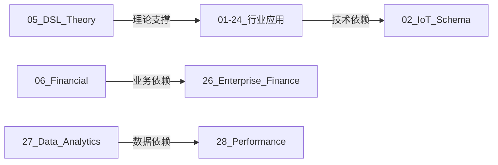
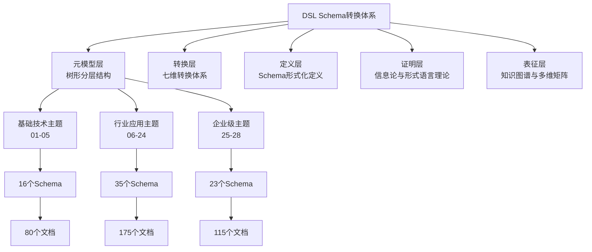
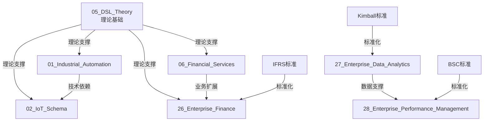

# DSL Schema转换体系：统一逻辑框架与形式理论

## 📑 目录

- [DSL Schema转换体系：统一逻辑框架与形式理论](#dsl-schema转换体系统一逻辑框架与形式理论)
  - [📑 目录](#-目录)
  - [1. 概述](#1-概述)
    - [1.1 核心问题](#11-核心问题)
    - [1.2 框架目标](#12-框架目标)
    - [1.3 框架结构](#13-框架结构)
  - [2. 核心形式理论框架](#2-核心形式理论框架)
    - [2.1 树形分层结构理论（元模型层）](#21-树形分层结构理论元模型层)
    - [2.2 七维转换体系理论（转换层）](#22-七维转换体系理论转换层)
    - [2.3 Schema形式化定义理论（定义层）](#23-schema形式化定义理论定义层)
    - [2.4 信息论与形式语言理论（证明层）](#24-信息论与形式语言理论证明层)
    - [2.5 知识图谱与多维矩阵（表征层）](#25-知识图谱与多维矩阵表征层)
  - [3. 主题-子主题逻辑关联体系](#3-主题-子主题逻辑关联体系)
    - [3.1 主题分类逻辑](#31-主题分类逻辑)
    - [3.2 主题依赖关系逻辑](#32-主题依赖关系逻辑)
    - [3.3 主题转换关系逻辑](#33-主题转换关系逻辑)
    - [3.4 主题应用场景逻辑](#34-主题应用场景逻辑)
  - [4. 思维表征体系](#4-思维表征体系)
    - [4.1 全局思维导图](#41-全局思维导图)
    - [4.2 多维矩阵体系](#42-多维矩阵体系)
    - [4.3 知识图谱网络](#43-知识图谱网络)
    - [4.4 形式化证明树](#44-形式化证明树)
  - [5. 论证视角与脉络梳理](#5-论证视角与脉络梳理)
    - [5.1 理论视角](#51-理论视角)
    - [5.2 实践视角](#52-实践视角)
    - [5.3 标准视角](#53-标准视角)
    - [5.4 行业视角](#54-行业视角)
  - [6. 统一框架应用指南](#6-统一框架应用指南)
    - [6.1 如何理解主题关联](#61-如何理解主题关联)
    - [6.2 如何应用转换理论](#62-如何应用转换理论)
    - [6.3 如何验证转换正确性](#63-如何验证转换正确性)
    - [6.4 如何扩展新主题](#64-如何扩展新主题)
  - [7. 总结](#7-总结)
    - [7.1 框架核心](#71-框架核心)
    - [7.2 逻辑关联](#72-逻辑关联)
    - [7.3 思维表征](#73-思维表征)
    - [7.4 论证脉络](#74-论证脉络)

---

## 1. 概述

### 1.1 核心问题

当前项目包含**28个主题、81个Schema、425+个文档**，但存在以下问题：

1. **内容分散**：各主题文档相对独立，缺乏统一的逻辑关联
2. **理论割裂**：树形结构理论、转换理论、形式化定义等缺乏统一框架
3. **视角混乱**：理论视角、实践视角、标准视角、行业视角缺乏整合
4. **脉络不清**：论证的视角和脉络缺乏系统性梳理

### 1.2 框架目标

建立**统一逻辑框架与形式理论**，实现：

1. **理论统一**：将树形分层结构、七维转换体系、形式化定义、信息论证明等统一在一个框架下
2. **逻辑关联**：建立主题-子主题之间的清晰逻辑关联关系
3. **视角整合**：整合理论、实践、标准、行业等多重视角
4. **脉络清晰**：梳理论证的视角和脉络，形成完整的知识体系

### 1.3 框架结构



---

## 2. 核心形式理论框架

### 2.1 树形分层结构理论（元模型层）

**核心命题**：树形分层结构是跨行业通用组织与治理模型。

**理论基础**：

- **系统论**：层次性是系统稳定存在的结构基础
- **控制论**：分级调节与信息反馈（活系统模型S1-S5级）
- **分形理论**：自相似性降低复杂度，规则可跨层复制
- **数学必然性**：信息熵最小化、控制复杂度上界、激励相容性博弈

**形式化定义**：

```text
Tree = (N, E, r)
其中：
- N: 节点集合（组织单元）
- E: 边集合（层级关系）
- r: 根节点（顶层组织）

约束条件：
1. 连通性：∀n ∈ N, ∃path(r, n)
2. 无环性：∀path(n1, n2), n1 ≠ n2
3. 唯一父节点：∀n ∈ N\{r}, |parent(n)| = 1
```

**应用范围**：所有28个主题都基于树形分层结构进行组织。

**参考文档**：

- `structure/view01.md` - 树形分层结构通用模型论证
- `structure/view02.md` - 多维度系统论证
- `structure/view03.md` - 技术论证

---

### 2.2 七维转换体系理论（转换层）

**核心命题**：DSL Schema转换在七个维度上进行。

**七维定义**：

| 维度 | 说明 | 转换内容 | 示例 |
|------|------|---------|------|
| **模式层** | Schema结构定义 | 实体、属性、关系 | PLC Schema → IoT Schema |
| **语言层** | 语法和语义 | 语法规则、语义模型 | JSON Schema → XML Schema |
| **协议层** | 通信协议 | 协议格式、消息结构 | HTTP → MQTT |
| **存储层** | 数据存储 | 数据库结构、存储格式 | PostgreSQL → MongoDB |
| **控制层** | 控制逻辑 | 状态机、工作流 | BPMN → BPEL |
| **二进制层** | 二进制表示 | 序列化格式、编码 | JSON → Protobuf |
| **元数据层** | 元数据管理 | 版本、依赖、标准 | XBRL → IFRS |

**形式化定义**：

```text
Transform: Schema_A → Schema_B
Transform = (T_mode, T_lang, T_prot, T_stor, T_ctrl, T_bin, T_meta)

其中：
- T_mode: 模式层转换函数
- T_lang: 语言层转换函数
- T_prot: 协议层转换函数
- T_stor: 存储层转换函数
- T_ctrl: 控制层转换函数
- T_bin: 二进制层转换函数
- T_meta: 元数据层转换函数
```

**应用范围**：所有Schema转换都遵循七维转换体系。

**参考文档**：

- `view/ai_prompt.md` - DSL Schema转换理论

---

### 2.3 Schema形式化定义理论（定义层）

**核心命题**：所有Schema都遵循统一的形式化定义框架。

**形式化定义框架**：

```text
Schema = (E, A, R, C, F)
其中：
- E: 实体集合（Entities）
- A: 属性集合（Attributes）
- R: 关系集合（Relations）
- C: 约束集合（Constraints）
- F: 函数集合（Functions）

实体定义：
Entity = (name, attributes, relations, constraints)

属性定义：
Attribute = (name, type, domain, constraints)

关系定义：
Relation = (source, target, type, cardinality)

约束定义：
Constraint = (type, expression, message)
```

**应用范围**：所有81个Schema都遵循此形式化定义框架。

**参考文档**：

- 各Schema的`02_Formal_Definition.md`文档

---

### 2.4 信息论与形式语言理论（证明层）

**核心命题**：Schema转换的正确性可以通过信息论和形式语言理论证明。

**信息论证明**：

```text
信息守恒定理：
H(Schema_A) = H(Schema_B) + H(Transform)

其中：
- H(Schema_A): Schema_A的信息熵
- H(Schema_B): Schema_B的信息熵
- H(Transform): 转换过程的信息损失

转换正确性条件：
H(Transform) = 0 或 H(Transform) ≤ ε（可接受误差）
```

**形式语言理论证明**：

```text
语法-语义一致性定理：
∀s ∈ L(Schema_A),
  Semantic(Transform(s)) = Transform(Semantic(s))

其中：
- L(Schema_A): Schema_A的语言集合
- Semantic: 语义函数
- Transform: 转换函数
```

**应用范围**：所有Schema转换的正确性证明都基于此理论。

**参考文档**：

- `themes/05_DSL_Theory/Information_Theory/` - 信息论分析
- `themes/05_DSL_Theory/Formal_Language_Theory/` - 形式语言理论

---

### 2.5 知识图谱与多维矩阵（表征层）

**核心命题**：主题和Schema之间的关系可以通过知识图谱和多维矩阵表征。

**知识图谱定义**：

```text
KG = (V, E, L)
其中：
- V: 顶点集合（主题、Schema、标准等）
- E: 边集合（关系：依赖、转换、应用等）
- L: 标签集合（关系类型、属性等）

关系类型：
- depends_on: 依赖关系
- transforms_to: 转换关系
- applies_to: 应用关系
- implements: 实现关系
- standardizes: 标准化关系
```

**多维矩阵定义**：

```text
Matrix[i][j] = value
其中：
- i: 行索引（主题、Schema等）
- j: 列索引（标准、应用场景等）
- value: 关系值（覆盖度、依赖强度等）
```

**应用范围**：所有主题关系分析都基于知识图谱和多维矩阵。

**参考文档**：

- `structure/GLOBAL_THEME_RELATIONSHIP_ANALYSIS.md` - 全局关系梳理
- `themes/05_DSL_Theory/Knowledge_Graph/` - 知识图谱

---

## 3. 主题-子主题逻辑关联体系

### 3.1 主题分类逻辑

**一级分类**（按应用领域）：

```text
主题分类树：
├─ 基础技术主题（01-05）
│   ├─ 01_Industrial_Automation（工业自动化）
│   ├─ 02_IoT_Schema（物联网）
│   ├─ 03_Physical_Device（物理设备）
│   ├─ 04_Programming_Conversion（编程转换）
│   └─ 05_DSL_Theory（DSL理论）
│
├─ 行业应用主题（06-24）
│   ├─ 金融服务（06）
│   ├─ 物流供应链（07）
│   ├─ 智慧城市（08）
│   ├─ 医疗（10）
│   ├─ 食品（11）
│   ├─ 智慧家居（12）
│   ├─ 办公自动化（13）
│   ├─ 工作流BPM（14）
│   ├─ ERP系统（15）
│   ├─ 能源（16）
│   ├─ 制造（17）
│   ├─ 零售（18）
│   ├─ 交通（19）
│   ├─ 建筑（20）
│   ├─ 教育（21）
│   ├─ 农业（22）
│   ├─ 通信（23）
│   └─ 其他行业（24）
│
└─ 企业级主题（25-28）
    ├─ 25_AI_Code_Integration（AI+Code集成）
    ├─ 26_Enterprise_Finance（企业财务）
    ├─ 27_Enterprise_Data_Analytics（企业数据分析）
    └─ 28_Enterprise_Performance_Management（企业绩效管理）
```

**二级分类**（按技术类型）：

| 技术类型 | 说明 | 主题示例 |
|---------|------|---------|
| **Schema定义主题** | 定义特定领域的Schema | 01-24（行业应用） |
| **转换理论主题** | 研究转换理论和方法 | 05_DSL_Theory |
| **工具实现主题** | 实现转换工具和平台 | 25_AI_Code_Integration |
| **标准对标主题** | 对标国际和行业标准 | 所有主题（03_Standards.md） |

---

### 3.2 主题依赖关系逻辑

**依赖关系类型**：

1. **理论依赖**：基础理论支撑应用
   - `05_DSL_Theory` → 所有主题（提供理论基础）
   - `structure/view01-03.md` → 所有主题（提供元模型）

2. **技术依赖**：技术基础依赖
   - `01_Industrial_Automation` → `02_IoT_Schema`（工业自动化是IoT的基础）
   - `03_Physical_Device` → `02_IoT_Schema`（物理设备是IoT的组成部分）

3. **业务依赖**：业务逻辑关联
   - `06_Financial_Services` → `26_Enterprise_Finance`（金融服务是企业财务的基础）
   - `14_Workflow_BPM` → `15_ERP_Systems`（工作流是ERP的组成部分）

4. **数据依赖**：数据支撑业务
   - `27_Enterprise_Data_Analytics` → `28_Enterprise_Performance_Management`（数据分析支撑绩效管理）

**依赖关系矩阵**：



---

### 3.3 主题转换关系逻辑

**转换关系类型**：

1. **同领域转换**：同一领域内的Schema转换
   - `PLC_Schema` ↔ `CAN_Schema`（工业自动化领域内）

2. **跨领域转换**：不同领域间的Schema转换
   - `Financial_Schema` → `XBRL_Schema`（金融领域到标准格式）

3. **层级转换**：不同抽象层级间的转换
   - `Physical_Device_Schema` → `Digital_Twin_Schema`（物理到数字）

4. **格式转换**：不同格式间的转换
   - `JSON_Schema` → `XML_Schema`（格式转换）

**转换关系矩阵**：

| 源主题 | 目标主题 | 转换类型 | 转换维度 | 复杂度 |
|--------|---------|---------|---------|--------|
| 01_Industrial_Automation | 02_IoT_Schema | 跨领域 | 模式层+协议层 | 中 |
| 06_Financial_Services | 26_Enterprise_Finance | 业务扩展 | 模式层+控制层 | 高 |
| 27_Enterprise_Data_Analytics | 28_Enterprise_Performance_Management | 数据支撑 | 模式层+元数据层 | 中 |

**参考文档**：

- `structure/DETAILED_THEME_CONVERSION_PATHS.md` - 详细转换路径分析

---

### 3.4 主题应用场景逻辑

**应用场景分类**：

1. **企业应用**：企业内部系统集成
   - ERP系统集成、财务系统集成、数据分析系统集成

2. **行业应用**：行业标准对接
   - 金融行业标准对接、医疗行业标准对接、工业标准对接

3. **技术研究**：理论研究和技术验证
   - Schema转换理论研究、形式化证明研究、性能优化研究

4. **标准制定**：标准制定和推广
   - 国际标准制定、行业标准制定、企业标准制定

**应用场景矩阵**：

| 主题 | 企业应用 | 行业应用 | 技术研究 | 标准制定 |
|------|---------|---------|---------|---------|
| 01_Industrial_Automation | ✅ | ✅ | ✅ | ✅ |
| 06_Financial_Services | ✅ | ✅ | ✅ | ✅ |
| 26_Enterprise_Finance | ✅ | ✅ | ✅ | ✅ |
| 27_Enterprise_Data_Analytics | ✅ | ✅ | ✅ | ✅ |

**参考文档**：

- `structure/THEME_APPLICATION_SCENARIOS_ANALYSIS.md` - 应用场景详细分析

---

## 4. 思维表征体系

### 4.1 全局思维导图

**五层思维导图结构**：



---

### 4.2 多维矩阵体系

**矩阵类型**：

1. **主题分类矩阵**：主题 × 应用领域 × 技术类型
2. **主题依赖矩阵**：主题 × 主题 × 依赖类型 × 依赖强度
3. **主题转换矩阵**：主题 × 主题 × 转换类型 × 转换复杂度
4. **标准覆盖矩阵**：主题 × 标准 × 覆盖度
5. **应用场景矩阵**：主题 × 应用场景 × 适用度

**示例：主题分类矩阵**:

| 主题 | 应用领域 | 技术类型 | Schema数 | 文档数 |
|------|---------|---------|---------|--------|
| 01_Industrial_Automation | 基础技术 | Schema定义 | 2 | 10 |
| 05_DSL_Theory | 基础技术 | 转换理论 | 3 | 15 |
| 06_Financial_Services | 行业应用 | Schema定义 | 3 | 15 |
| 26_Enterprise_Finance | 企业级 | Schema定义 | 11 | 55 |
| 27_Enterprise_Data_Analytics | 企业级 | Schema定义 | 9 | 45 |

**参考文档**：

- `structure/GLOBAL_THEME_RELATIONSHIP_ANALYSIS.md` - 全局关系梳理（包含多个矩阵）

---

### 4.3 知识图谱网络

**知识图谱结构**：



**关系类型**：

- `理论支撑`：理论基础关系
- `技术依赖`：技术依赖关系
- `业务扩展`：业务扩展关系
- `数据支撑`：数据支撑关系
- `标准化`：标准化关系

**参考文档**：

- `structure/GLOBAL_THEME_RELATIONSHIP_ANALYSIS.md` - 知识图谱部分
- `themes/05_DSL_Theory/Knowledge_Graph/` - 知识图谱Schema

---

### 4.4 形式化证明树

**证明树结构**：

```text
证明树：
├─ 树形分层结构证明
│   ├─ 信息熵最小化证明
│   ├─ 控制复杂度上界证明
│   └─ 激励相容性博弈证明
│
├─ 七维转换体系证明
│   ├─ 模式层转换正确性证明
│   ├─ 语言层转换正确性证明
│   └─ 其他维度转换正确性证明
│
├─ Schema形式化定义证明
│   ├─ 实体定义完备性证明
│   ├─ 关系定义一致性证明
│   └─ 约束定义有效性证明
│
└─ 信息论与形式语言理论证明
    ├─ 信息守恒定理证明
    └─ 语法-语义一致性定理证明
```

**参考文档**：

- `structure/view01.md`, `view02.md`, `view03.md` - 树形结构证明
- `themes/05_DSL_Theory/Information_Theory/` - 信息论证明
- `themes/05_DSL_Theory/Formal_Language_Theory/` - 形式语言理论证明

---

## 5. 论证视角与脉络梳理

### 5.1 理论视角

**论证脉络**：

```text
理论视角论证脉络：
1. 树形分层结构理论（元模型）
   ↓
2. 七维转换体系理论（转换方法）
   ↓
3. Schema形式化定义理论（定义框架）
   ↓
4. 信息论与形式语言理论（证明方法）
   ↓
5. 知识图谱与多维矩阵（表征方法）
```

**关键文档**：

- `structure/view01.md`, `view02.md`, `view03.md` - 树形结构理论
- `view/ai_prompt.md` - 七维转换体系理论
- 各Schema的`02_Formal_Definition.md` - 形式化定义
- `themes/05_DSL_Theory/` - 信息论与形式语言理论

---

### 5.2 实践视角

**论证脉络**：

```text
实践视角论证脉络：
1. 行业应用案例（06-24主题）
   ↓
2. 企业级应用案例（25-28主题）
   ↓
3. 转换实现代码（04_Transformation.md）
   ↓
4. 实践案例研究（05_Case_Studies.md）
```

**关键文档**：

- 各主题的`05_Case_Studies.md` - 实践案例
- 各主题的`04_Transformation.md` - 转换实现

---

### 5.3 标准视角

**论证脉络**：

```text
标准视角论证脉络：
1. 国际标准对标（ISO、IEC、W3C等）
   ↓
2. 国家标准对标（GB、ANSI等）
   ↓
3. 行业标准对标（IFRS、HL7、IEC61850等）
   ↓
4. 标准映射关系分析
```

**关键文档**：

- 各Schema的`03_Standards.md` - 标准对标
- `structure/THEME_STANDARD_MAPPING_ANALYSIS.md` - 标准映射分析
- `themes/STANDARDS_COMPREHENSIVE_ANALYSIS.md` - 标准综合分析

---

### 5.4 行业视角

**论证脉络**：

```text
行业视角论证脉络：
1. 基础技术行业（01-05）
   ↓
2. 传统行业应用（06-24）
   ↓
3. 企业级应用（25-28）
   ↓
4. 跨行业转换能力
```

**关键文档**：

- `structure/GLOBAL_THEME_RELATIONSHIP_ANALYSIS.md` - 全局关系梳理
- `structure/THEME_APPLICATION_SCENARIOS_ANALYSIS.md` - 应用场景分析
- `themes/INDUSTRY_COVERAGE_ANALYSIS.md` - 行业覆盖分析

---

## 6. 统一框架应用指南

### 6.1 如何理解主题关联

**步骤**：

1. **确定主题分类**：查看主题分类逻辑（3.1节）
2. **分析依赖关系**：查看主题依赖关系逻辑（3.2节）
3. **理解转换关系**：查看主题转换关系逻辑（3.3节）
4. **查看应用场景**：查看主题应用场景逻辑（3.4节）

**工具**：

- 全局思维导图（4.1节）
- 知识图谱网络（4.3节）
- 多维矩阵体系（4.2节）

---

### 6.2 如何应用转换理论

**步骤**：

1. **确定转换维度**：根据转换需求确定涉及的维度（七维转换体系）
2. **选择转换函数**：根据源Schema和目标Schema选择转换函数
3. **验证转换正确性**：使用信息论和形式语言理论验证转换正确性
4. **实现转换代码**：参考`04_Transformation.md`实现转换代码

**工具**：

- 七维转换体系理论（2.2节）
- Schema形式化定义（2.3节）
- 信息论与形式语言理论（2.4节）

---

### 6.3 如何验证转换正确性

**步骤**：

1. **信息论验证**：计算信息熵，验证信息守恒
2. **形式语言理论验证**：验证语法-语义一致性
3. **形式化证明**：参考形式化证明树（4.4节）

**工具**：

- 信息论证明（2.4节）
- 形式语言理论证明（2.4节）
- 形式化证明树（4.4节）

---

### 6.4 如何扩展新主题

**步骤**：

1. **确定主题分类**：确定新主题属于哪个分类（基础技术/行业应用/企业级）
2. **分析依赖关系**：确定新主题依赖哪些现有主题
3. **定义Schema**：使用Schema形式化定义框架定义新Schema
4. **实现转换**：使用七维转换体系实现转换
5. **验证正确性**：使用信息论和形式语言理论验证转换正确性
6. **更新关系**：更新知识图谱和多维矩阵

**工具**：

- 主题分类逻辑（3.1节）
- Schema形式化定义框架（2.3节）
- 七维转换体系（2.2节）

---

## 7. 总结

### 7.1 框架核心

本统一逻辑框架包含**五个理论层次**：

1. **元模型层**：树形分层结构理论
2. **转换层**：七维转换体系理论
3. **定义层**：Schema形式化定义理论
4. **证明层**：信息论与形式语言理论
5. **表征层**：知识图谱与多维矩阵

### 7.2 逻辑关联

建立了**四种逻辑关联关系**：

1. **主题分类逻辑**：按应用领域和技术类型分类
2. **主题依赖关系逻辑**：理论依赖、技术依赖、业务依赖、数据依赖
3. **主题转换关系逻辑**：同领域转换、跨领域转换、层级转换、格式转换
4. **主题应用场景逻辑**：企业应用、行业应用、技术研究、标准制定

### 7.3 思维表征

提供了**四种思维表征方式**：

1. **全局思维导图**：五层结构展示全局关系
2. **多维矩阵体系**：多维度交叉分析
3. **知识图谱网络**：关系网络可视化
4. **形式化证明树**：证明结构可视化

### 7.4 论证脉络

梳理了**四种论证视角**：

1. **理论视角**：从理论到应用的论证脉络
2. **实践视角**：从案例到实现的论证脉络
3. **标准视角**：从标准到对标的论证脉络
4. **行业视角**：从基础到应用的论证脉络

---

**文档创建时间**：2025-01-21
**文档版本**：v1.0
**维护者**：DSL Schema研究团队

**相关文档**：

- `structure/GLOBAL_THEME_RELATIONSHIP_ANALYSIS.md` - 全局关系梳理
- `structure/view01.md`, `view02.md`, `view03.md` - 树形结构理论
- `view/ai_prompt.md` - 七维转换体系理论
- `themes/05_DSL_Theory/` - 信息论与形式语言理论
