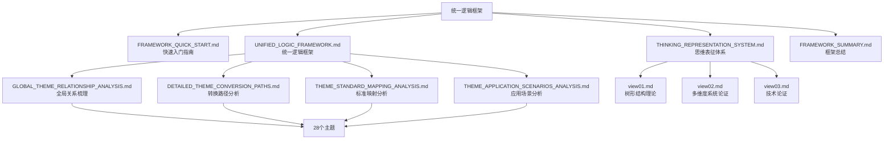

# 统一逻辑框架导航地图

## 📑 目录

- [统一逻辑框架导航地图](#统一逻辑框架导航地图)
  - [📑 目录](#-目录)
  - [1. 导航地图概览](#1-导航地图概览)
  - [2. 文档体系导航](#2-文档体系导航)
  - [3. 主题导航](#3-主题导航)
  - [4. 功能导航](#4-功能导航)
  - [5. 快速链接](#5-快速链接)

---

## 1. 导航地图概览

### 1.1 框架文档体系



### 1.2 文档分类

| 文档类型 | 文档数 | 说明 |
|---------|--------|------|
| **框架核心文档** | 4 | 统一框架、思维表征、总结、快速入门 |
| **关系分析文档** | 6 | 全局关系、转换路径、标准映射、应用场景等 |
| **理论论证文档** | 3 | 树形结构理论论证 |
| **主题文档** | 425+ | 28个主题的完整文档集 |
| **总计** | **438+** | **完整文档体系** |

---

## 2. 文档体系导航

### 2.1 框架核心文档

| 文档 | 用途 | 适合人群 | 阅读时间 |
|------|------|---------|---------|
| **FRAMEWORK_QUICK_START.md** | 快速入门 | 新手 | 5-10分钟 |
| **UNIFIED_LOGIC_FRAMEWORK.md** | 完整框架 | 所有用户 | 30-60分钟 |
| **THINKING_REPRESENTATION_SYSTEM.md** | 思维表征 | 研究者 | 20-40分钟 |
| **FRAMEWORK_SUMMARY.md** | 框架总结 | 管理者 | 10-15分钟 |

### 2.2 关系分析文档

| 文档 | 用途 | 关键内容 |
|------|------|---------|
| **GLOBAL_THEME_RELATIONSHIP_ANALYSIS.md** | 全局关系梳理 | 9种关系表征方式，28个主题全景 |
| **DETAILED_THEME_CONVERSION_PATHS.md** | 转换路径分析 | 45+条转换路径详细分析 |
| **THEME_STANDARD_MAPPING_ANALYSIS.md** | 标准映射分析 | 72个标准映射关系分析 |
| **THEME_APPLICATION_SCENARIOS_ANALYSIS.md** | 应用场景分析 | 150+个应用场景详细分析 |
| **GLOBAL_RELATIONSHIP_QUICK_REFERENCE.md** | 快速参考 | 文档导航和快速查找表 |
| **GLOBAL_RELATIONSHIP_COMPLETION_REPORT.md** | 完成报告 | 完成工作总览和统计 |

### 2.3 理论论证文档

| 文档 | 用途 | 核心内容 |
|------|------|---------|
| **view01.md** | 树形分层结构通用模型论证 | 跨行业通用组织与治理模型论证 |
| **view02.md** | 多维度系统论证 | 全域行业归纳体系、形式化证明 |
| **view03.md** | 技术论证 | 数据、架构与控制领域的深度技术论证 |

---

## 3. 主题导航

### 3.1 按分类导航

**基础技术主题（01-05）**：

- `01_Industrial_Automation` - 工业自动化（2个Schema）
- `02_IoT_Schema` - 物联网（6个Schema）
- `03_Physical_Device` - 物理设备（6个Schema）
- `04_Programming_Conversion` - 编程转换（5个Schema）
- `05_DSL_Theory` - DSL理论（3个Schema）

**行业应用主题（06-24）**：

- `06_Financial_Services` - 金融服务（3个Schema）
- `07_Logistics_Supply_Chain` - 物流供应链（2个Schema）
- `08_Smart_City` - 智慧城市（1个Schema）
- `08_Maritime_Shipping` - 海运（1个Schema）
- `10_Healthcare` - 医疗（3个Schema）
- `11_Food_Industry` - 食品（1个Schema）
- `12_Smart_Home` - 智慧家居（3个Schema）
- `13_OA_Office_Automation` - 办公自动化（1个Schema）
- `14_Workflow_BPM` - 工作流BPM（3个Schema）
- `15_ERP_Systems` - ERP系统（1个Schema）
- `16_Energy_Industry` - 能源（2个Schema）
- `17_Manufacturing` - 制造（2个Schema）
- `18_Retail_Industry` - 零售（2个Schema）
- `19_Transportation` - 交通（2个Schema）
- `20_Building_Construction` - 建筑（1个Schema）
- `21_Education` - 教育（3个Schema）
- `22_Agriculture` - 农业（3个Schema）
- `23_Telecommunications` - 通信（3个Schema）
- `24_Other_Industries` - 其他行业（3个Schema）

**企业级主题（25-28）**：

- `25_AI_Code_Integration` - AI+Code集成（7个Schema）
- `26_Enterprise_Finance` - 企业财务（11个Schema）
- `27_Enterprise_Data_Analytics` - 企业数据分析（9个Schema）
- `28_Enterprise_Performance_Management` - 企业绩效管理（3个Schema）

### 3.2 按依赖关系导航

**理论依赖链**：

```text
05_DSL_Theory (理论基础)
    ↓ 理论支撑
所有主题 (01-28)
```

**技术依赖链**：

```text
01_Industrial_Automation
    ↓ 技术依赖
02_IoT_Schema
    ↓ 技术依赖
03_Physical_Device
```

**业务依赖链**：

```text
06_Financial_Services
    ↓ 业务扩展
26_Enterprise_Finance
```

**数据依赖链**：

```text
27_Enterprise_Data_Analytics
    ↓ 数据支撑
28_Enterprise_Performance_Management
```

### 3.3 按转换关系导航

**高频转换路径**：

1. `01_Industrial_Automation` → `02_IoT_Schema`（跨领域转换）
2. `06_Financial_Services` → `26_Enterprise_Finance`（业务扩展）
3. `27_Enterprise_Data_Analytics` → `28_Enterprise_Performance_Management`（数据支撑）
4. `02_IoT_Schema` → `03_Physical_Device`（层级转换）

详细转换路径见：`DETAILED_THEME_CONVERSION_PATHS.md`

---

## 4. 功能导航

### 4.1 我想了解

| 需求 | 推荐文档 | 关键章节 |
|------|---------|---------|
| **快速入门** | `FRAMEWORK_QUICK_START.md` | 第1-2节 |
| **完整框架** | `UNIFIED_LOGIC_FRAMEWORK.md` | 全部 |
| **思维表征** | `THINKING_REPRESENTATION_SYSTEM.md` | 全部 |
| **全局关系** | `GLOBAL_THEME_RELATIONSHIP_ANALYSIS.md` | 全部 |
| **转换路径** | `DETAILED_THEME_CONVERSION_PATHS.md` | 全部 |
| **标准映射** | `THEME_STANDARD_MAPPING_ANALYSIS.md` | 全部 |
| **应用场景** | `THEME_APPLICATION_SCENARIOS_ANALYSIS.md` | 全部 |

### 4.2 我想实现

| 需求 | 推荐文档 | 关键章节 |
|------|---------|---------|
| **Schema转换** | `UNIFIED_LOGIC_FRAMEWORK.md` | 第2.2节、第6.2节 |
| **验证转换正确性** | `UNIFIED_LOGIC_FRAMEWORK.md` | 第2.4节、第6.3节 |
| **扩展新主题** | `UNIFIED_LOGIC_FRAMEWORK.md` | 第6.4节 |
| **理解主题关系** | `UNIFIED_LOGIC_FRAMEWORK.md` | 第3节 |
| **应用转换理论** | `UNIFIED_LOGIC_FRAMEWORK.md` | 第6.2节 |

### 4.3 我想研究

| 需求 | 推荐文档 | 关键章节 |
|------|---------|---------|
| **树形结构理论** | `view01.md`, `view02.md`, `view03.md` | 全部 |
| **七维转换体系** | `view/ai_prompt.md` | 全部 |
| **信息论证明** | `themes/05_DSL_Theory/Information_Theory/` | 全部 |
| **形式语言理论** | `themes/05_DSL_Theory/Formal_Language_Theory/` | 全部 |
| **知识图谱** | `themes/05_DSL_Theory/Knowledge_Graph/` | 全部 |

---

## 5. 快速链接

### 5.1 框架核心文档

- 📖 [统一逻辑框架](./UNIFIED_LOGIC_FRAMEWORK.md) - 完整框架文档
- 🧠 [思维表征体系](./THINKING_REPRESENTATION_SYSTEM.md) - 思维表征方式
- 📋 [框架总结](./FRAMEWORK_SUMMARY.md) - 问题分析与解决方案
- 🚀 [快速入门指南](./FRAMEWORK_QUICK_START.md) - 新手必读

### 5.2 关系分析文档

- 🌐 [全局关系梳理](./GLOBAL_THEME_RELATIONSHIP_ANALYSIS.md) - 28个主题全景
- 🔄 [转换路径分析](./DETAILED_THEME_CONVERSION_PATHS.md) - 45+条转换路径
- 📊 [标准映射分析](./THEME_STANDARD_MAPPING_ANALYSIS.md) - 72个标准映射
- 🎯 [应用场景分析](./THEME_APPLICATION_SCENARIOS_ANALYSIS.md) - 150+个应用场景
- ⚡ [快速参考指南](./GLOBAL_RELATIONSHIP_QUICK_REFERENCE.md) - 快速查找表

### 5.3 理论论证文档

- 🌳 [树形结构理论1](./view01.md) - 通用模型论证
- 🌳 [树形结构理论2](./view02.md) - 多维度系统论证
- 🌳 [树形结构理论3](./view03.md) - 技术论证

### 5.4 主题文档

- 📁 [主题总览](../themes/README.md) - 所有主题概览
- 📁 [主题索引](../themes/DOCUMENT_INDEX.md) - 完整文档索引

### 5.5 项目文档

- 📖 [项目主文档](../README.md) - 项目概述
- 📑 [文档索引](../DOCUMENT_INDEX.md) - 完整文档索引

---

## 6. 使用建议

### 6.1 新手路径

```text
1. FRAMEWORK_QUICK_START.md (5-10分钟)
   ↓
2. UNIFIED_LOGIC_FRAMEWORK.md 第1-2节 (20-30分钟)
   ↓
3. 选择一个主题深入阅读
```

### 6.2 研究者路径

```text
1. UNIFIED_LOGIC_FRAMEWORK.md (完整阅读)
   ↓
2. THINKING_REPRESENTATION_SYSTEM.md (完整阅读)
   ↓
3. view01-03.md (理论论证)
   ↓
4. themes/05_DSL_Theory/ (理论深入)
```

### 6.3 实践者路径

```text
1. FRAMEWORK_QUICK_START.md 场景3 (实现转换)
   ↓
2. UNIFIED_LOGIC_FRAMEWORK.md 第6.2节 (应用转换理论)
   ↓
3. DETAILED_THEME_CONVERSION_PATHS.md (转换路径)
   ↓
4. 具体Schema的04_Transformation.md (转换实现)
```

### 6.4 管理者路径

```text
1. FRAMEWORK_SUMMARY.md (框架总结)
   ↓
2. GLOBAL_THEME_RELATIONSHIP_ANALYSIS.md (全局关系)
   ↓
3. EXPANSION_THEMES_AND_TASKS.md (扩展计划)
```

---

**文档创建时间**：2025-01-21
**文档版本**：v1.0
**维护者**：DSL Schema研究团队

**相关文档**：

- `structure/FRAMEWORK_QUICK_START.md` - 快速入门指南
- `structure/UNIFIED_LOGIC_FRAMEWORK.md` - 统一逻辑框架
- `structure/THINKING_REPRESENTATION_SYSTEM.md` - 思维表征体系
