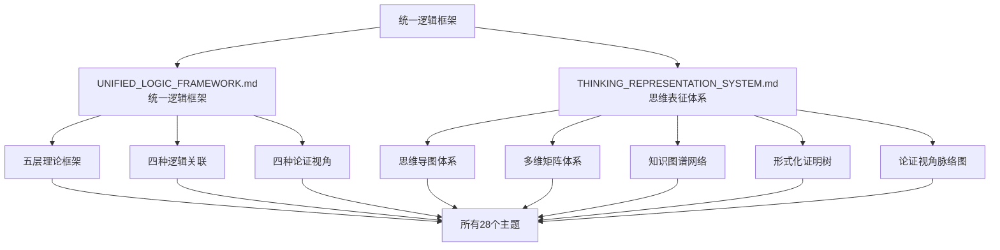

# 统一逻辑框架总结：解决主题关联问题

## 📑 目录

- [统一逻辑框架总结：解决主题关联问题](#统一逻辑框架总结解决主题关联问题)
  - [📑 目录](#-目录)
  - [1. 问题分析](#1-问题分析)
    - [1.1 用户提出的核心问题](#11-用户提出的核心问题)
    - [1.2 问题根源](#12-问题根源)
  - [2. 解决方案](#2-解决方案)
    - [2.1 统一逻辑框架](#21-统一逻辑框架)
    - [2.2 思维表征体系](#22-思维表征体系)
  - [3. 框架结构](#3-框架结构)
    - [3.1 文档结构](#31-文档结构)
    - [3.2 框架关系](#32-框架关系)
  - [4. 应用指南](#4-应用指南)
    - [4.1 如何理解主题关联](#41-如何理解主题关联)
    - [4.2 如何应用转换理论](#42-如何应用转换理论)
    - [4.3 如何扩展新主题](#43-如何扩展新主题)
  - [5. 总结](#5-总结)
    - [5.1 解决的问题](#51-解决的问题)
    - [5.2 核心价值](#52-核心价值)
    - [5.3 文档位置](#53-文档位置)

---

## 1. 问题分析

### 1.1 用户提出的核心问题

用户发现：**很多文件内容与主题并没有什么关联**，需要：

1. **建立总体逻辑框架或形式理论**，把所有主题子主题关联起来
2. **结合多种思维导图、多维矩阵等思维表征方式**，把论证的视角和脉络梳理

### 1.2 问题根源

1. **内容分散**：28个主题、81个Schema、425+个文档相对独立，缺乏统一逻辑关联
2. **理论割裂**：树形结构理论、转换理论、形式化定义等缺乏统一框架
3. **视角混乱**：理论视角、实践视角、标准视角、行业视角缺乏整合
4. **脉络不清**：论证的视角和脉络缺乏系统性梳理

---

## 2. 解决方案

### 2.1 统一逻辑框架

创建了**统一逻辑框架与形式理论**文档（`UNIFIED_LOGIC_FRAMEWORK.md`），包含：

1. **五层理论框架**：
   - 元模型层：树形分层结构理论
   - 转换层：七维转换体系理论
   - 定义层：Schema形式化定义理论
   - 证明层：信息论与形式语言理论
   - 表征层：知识图谱与多维矩阵

2. **四种逻辑关联**：
   - 主题分类逻辑：按应用领域和技术类型分类
   - 主题依赖关系逻辑：理论依赖、技术依赖、业务依赖、数据依赖
   - 主题转换关系逻辑：同领域转换、跨领域转换、层级转换、格式转换
   - 主题应用场景逻辑：企业应用、行业应用、技术研究、标准制定

3. **四种论证视角**：
   - 理论视角：从理论到应用的论证脉络
   - 实践视角：从案例到实现的论证脉络
   - 标准视角：从标准到对标的论证脉络
   - 行业视角：从基础到应用的论证脉络

### 2.2 思维表征体系

创建了**思维表征体系**文档（`THINKING_REPRESENTATION_SYSTEM.md`），包含：

1. **思维导图体系**：
   - 五层全局思维导图（核心理论层、主题分类层、Schema分类层、文档分类层、关系网络层）
   - 主题内部思维导图

2. **多维矩阵体系**：
   - 主题分类矩阵
   - 主题依赖关系矩阵
   - 主题转换关系矩阵
   - 标准覆盖矩阵
   - 应用场景矩阵
   - 价值-复杂度矩阵

3. **知识图谱网络**：
   - 全局知识图谱
   - 转换关系图谱

4. **形式化证明树**：
   - 树形分层结构证明树
   - 七维转换体系证明树
   - 信息论证明树

5. **论证视角脉络图**：
   - 理论视角脉络图
   - 实践视角脉络图
   - 标准视角脉络图
   - 行业视角脉络图

---

## 3. 框架结构

### 3.1 文档结构

```text
structure/
├── UNIFIED_LOGIC_FRAMEWORK.md          # 统一逻辑框架与形式理论
├── THINKING_REPRESENTATION_SYSTEM.md   # 思维表征体系
├── GLOBAL_THEME_RELATIONSHIP_ANALYSIS.md  # 全局关系梳理（已有）
├── DETAILED_THEME_CONVERSION_PATHS.md     # 转换路径分析（已有）
├── THEME_STANDARD_MAPPING_ANALYSIS.md      # 标准映射分析（已有）
├── THEME_APPLICATION_SCENARIOS_ANALYSIS.md # 应用场景分析（已有）
└── ...（其他文档）
```

### 3.2 框架关系



---

## 4. 应用指南

### 4.1 如何理解主题关联

**步骤**：

1. **阅读统一逻辑框架**：`UNIFIED_LOGIC_FRAMEWORK.md`
   - 了解五层理论框架
   - 理解四种逻辑关联
   - 掌握四种论证视角

2. **查看思维表征体系**：`THINKING_REPRESENTATION_SYSTEM.md`
   - 查看五层全局思维导图
   - 查看多维矩阵
   - 查看知识图谱网络

3. **深入具体主题**：根据框架指引，深入具体主题文档

### 4.2 如何应用转换理论

**步骤**：

1. **确定转换维度**：根据统一逻辑框架的七维转换体系，确定涉及的维度
2. **选择转换函数**：根据源Schema和目标Schema选择转换函数
3. **验证转换正确性**：使用信息论和形式语言理论验证转换正确性
4. **实现转换代码**：参考`04_Transformation.md`实现转换代码

### 4.3 如何扩展新主题

**步骤**：

1. **确定主题分类**：根据统一逻辑框架的主题分类逻辑，确定新主题属于哪个分类
2. **分析依赖关系**：根据统一逻辑框架的主题依赖关系逻辑，确定新主题依赖哪些现有主题
3. **定义Schema**：使用Schema形式化定义框架定义新Schema
4. **实现转换**：使用七维转换体系实现转换
5. **验证正确性**：使用信息论和形式语言理论验证转换正确性
6. **更新关系**：更新知识图谱和多维矩阵

---

## 5. 总结

### 5.1 解决的问题

✅ **内容分散问题**：通过统一逻辑框架，建立了所有主题和子主题之间的逻辑关联

✅ **理论割裂问题**：通过五层理论框架，统一了树形结构理论、转换理论、形式化定义等

✅ **视角混乱问题**：通过四种论证视角，整合了理论、实践、标准、行业等多重视角

✅ **脉络不清问题**：通过思维表征体系，清晰梳理了论证的视角和脉络

### 5.2 核心价值

1. **统一的理论框架**：所有主题和子主题都在统一的逻辑框架下
2. **清晰的逻辑关联**：建立了主题之间的清晰逻辑关联关系
3. **完整的思维表征**：提供了多种思维表征方式，便于理解和应用
4. **明确的论证脉络**：清晰梳理了论证的视角和脉络

### 5.3 文档位置

- **统一逻辑框架**：`structure/UNIFIED_LOGIC_FRAMEWORK.md`
- **思维表征体系**：`structure/THINKING_REPRESENTATION_SYSTEM.md`
- **本文档**：`structure/FRAMEWORK_SUMMARY.md`

---

**文档创建时间**：2025-01-21
**文档版本**：v1.0
**维护者**：DSL Schema研究团队
