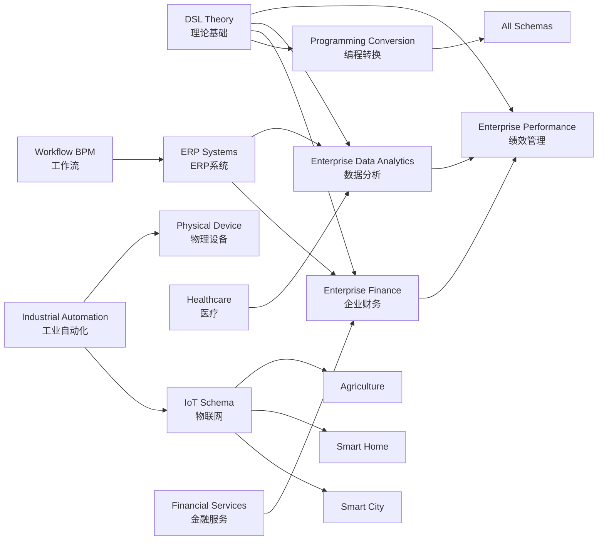

# 全局主题知识关系梳理

## 📑 目录

- [全局主题知识关系梳理](#全局主题知识关系梳理)
  - [📑 目录](#-目录)
  - [1. 概述](#1-概述)
  - [2. 全局思维导图：主题知识体系全景](#2-全局思维导图主题知识体系全景)
  - [3. 主题分类矩阵](#3-主题分类矩阵)
  - [4. 主题依赖关系矩阵](#4-主题依赖关系矩阵)
  - [5. 主题价值-复杂度矩阵](#5-主题价值-复杂度矩阵)
  - [6. 主题标准覆盖矩阵](#6-主题标准覆盖矩阵)
  - [7. 主题应用场景矩阵](#7-主题应用场景矩阵)
  - [8. 知识图谱：主题关系网络](#8-知识图谱主题关系网络)
  - [9. 主题演进路径图](#9-主题演进路径图)
  - [10. 主题转换关系矩阵](#10-主题转换关系矩阵)
  - [11. 总结](#11-总结)

---

## 1. 概述

本文档提供**全局主题知识关系梳理**，使用多种思维方式（思维导图、矩阵对比、知识图谱等）全面展示项目中所有主题之间的全局关系。

### 1.1 项目主题统计

- **总主题数**：28个主题
- **总Schema数**：67+个Schema
- **总文档数**：335+个标准化文档
- **覆盖领域**：工业、金融、医疗、教育、农业、通信、零售、制造等26+个行业

### 1.2 主题分类体系

**一级分类**（按应用领域）：
- 基础技术主题（01-05）
- 行业应用主题（06-24）
- 企业级主题（25-28）

**二级分类**（按技术类型）：
- Schema定义主题
- 转换理论主题
- 工具实现主题
- 标准对标主题

---

## 2. 全局思维导图：主题知识体系全景

```mermaid
graph TB
    Root[DSL Schema转换体系]

    %% 基础技术层
    Root --> Base[基础技术层]
    Base --> T01[01_Industrial_Automation<br/>工业自动化]
    Base --> T02[02_IoT_Schema<br/>物联网Schema]
    Base --> T03[03_Physical_Device<br/>物理设备]
    Base --> T04[04_Programming_Conversion<br/>编程转换]
    Base --> T05[05_DSL_Theory<br/>DSL理论]

    %% 行业应用层
    Root --> Industry[行业应用层]
    Industry --> T06[06_Financial_Services<br/>金融服务]
    Industry --> T07[07_Logistics_Supply_Chain<br/>物流供应链]
    Industry --> T08[08_Smart_City<br/>智慧城市]
    Industry --> T09[08_Maritime_Shipping<br/>海运]
    Industry --> T10[10_Healthcare<br/>医疗]
    Industry --> T11[11_Food_Industry<br/>食品]
    Industry --> T12[12_Smart_Home<br/>智慧家居]
    Industry --> T13[13_OA_Office_Automation<br/>办公自动化]
    Industry --> T14[14_Workflow_BPM<br/>工作流BPM]
    Industry --> T15[15_ERP_Systems<br/>ERP系统]
    Industry --> T16[16_Energy_Industry<br/>能源]
    Industry --> T17[17_Manufacturing<br/>制造]
    Industry --> T18[18_Retail_Industry<br/>零售]
    Industry --> T19[19_Transportation<br/>交通]
    Industry --> T20[20_Building_Construction<br/>建筑]
    Industry --> T21[21_Education<br/>教育]
    Industry --> T22[22_Agriculture<br/>农业]
    Industry --> T23[23_Telecommunications<br/>通信]
    Industry --> T24[24_Other_Industries<br/>其他行业]

    %% AI+Code集成层
    Root --> AICode[25_AI_Code_Integration<br/>AI+Code集成]

    %% 企业级主题层
    Root --> Enterprise[企业级主题层]
    Enterprise --> T26[26_Enterprise_Finance<br/>企业财务]
    Enterprise --> T27[27_Enterprise_Data_Analytics<br/>企业数据分析]
    Enterprise --> T28[28_Enterprise_Performance_Management<br/>企业绩效管理]

    %% 关系连接
    T01 -.->|技术基础| T02
    T02 -.->|应用场景| T08
    T02 -.->|应用场景| T12
    T05 -.->|理论基础| T26
    T05 -.->|理论基础| T27
    T06 -.->|业务关联| T26
    T15 -.->|系统集成| T26
    T27 -.->|数据支撑| T28
    T26 -.->|绩效关联| T28
```



### 2.1 主题层级关系

**第一层：基础技术层（01-05）**
- 提供Schema定义、转换理论、形式化证明等基础能力
- 为所有上层主题提供技术支撑

**第二层：行业应用层（06-24）**
- 基于基础技术层，面向具体行业应用
- 每个主题对应一个或多个行业领域

**第三层：AI+Code集成层（25）**
- 连接AI工具与代码生成
- 提供自然语言到DSL的转换能力

**第四层：企业级主题层（26-28）**
- 面向企业数字化转型
- 整合多个行业应用主题的能力

---

## 3. 主题分类矩阵

| 主题编号 | 主题名称 | 一级分类 | 二级分类 | Schema数 | 文档数 | 标准数 | 优先级 |
|---------|---------|---------|---------|---------|--------|--------|--------|
| **01** | Industrial_Automation | 基础技术 | Schema定义 | 2 | 10 | 3 | P0 |
| **02** | IoT_Schema | 基础技术 | Schema定义 | 5 | 25 | 8 | P0 |
| **03** | Physical_Device | 基础技术 | Schema定义 | 6 | 30 | 5 | P0 |
| **04** | Programming_Conversion | 基础技术 | 转换理论 | 4 | 20 | 4 | P0 |
| **05** | DSL_Theory | 基础技术 | 理论基础 | 3 | 15 | 2 | P0 |
| **06** | Financial_Services | 行业应用 | 金融服务 | 4 | 20 | 5 | P0 |
| **07** | Logistics_Supply_Chain | 行业应用 | 物流供应链 | 2 | 10 | 3 | P1 |
| **08** | Smart_City | 行业应用 | 智慧城市 | 1 | 5 | 2 | P1 |
| **09** | Maritime_Shipping | 行业应用 | 海运 | 1 | 5 | 2 | P2 |
| **10** | Healthcare | 行业应用 | 医疗 | 3 | 15 | 4 | P1 |
| **11** | Food_Industry | 行业应用 | 食品 | 1 | 5 | 2 | P2 |
| **12** | Smart_Home | 行业应用 | 智慧家居 | 3 | 15 | 3 | P2 |
| **13** | OA_Office_Automation | 行业应用 | 办公自动化 | 1 | 5 | 1 | P2 |
| **14** | Workflow_BPM | 行业应用 | 工作流 | 3 | 15 | 3 | P0 |
| **15** | ERP_Systems | 行业应用 | ERP系统 | 1 | 5 | 2 | P0 |
| **16** | Energy_Industry | 行业应用 | 能源 | 2 | 10 | 2 | P1 |
| **17** | Manufacturing | 行业应用 | 制造 | 2 | 10 | 2 | P1 |
| **18** | Retail_Industry | 行业应用 | 零售 | 2 | 10 | 2 | P1 |
| **19** | Transportation | 行业应用 | 交通 | 2 | 10 | 2 | P1 |
| **20** | Building_Construction | 行业应用 | 建筑 | 1 | 5 | 1 | P2 |
| **21** | Education | 行业应用 | 教育 | 3 | 15 | 2 | P1 |
| **22** | Agriculture | 行业应用 | 农业 | 3 | 15 | 2 | P1 |
| **23** | Telecommunications | 行业应用 | 通信 | 3 | 15 | 3 | P1 |
| **24** | Other_Industries | 行业应用 | 其他行业 | 3 | 15 | 2 | P1 |
| **25** | AI_Code_Integration | AI+Code | 工具集成 | 7 | 35 | 5 | P0 |
| **26** | Enterprise_Finance | 企业级 | 财务 | 11 | 55 | 11 | P0 |
| **27** | Enterprise_Data_Analytics | 企业级 | 数据分析 | 9 | 45 | 15 | P0 |
| **28** | Enterprise_Performance_Management | 企业级 | 绩效管理 | 3 | 15 | 8 | P1 |

**统计**：
- **基础技术主题**：5个，16个Schema，100个文档
- **行业应用主题**：19个，35个Schema，175个文档
- **AI+Code集成主题**：1个，7个Schema，35个文档
- **企业级主题**：3个，23个Schema，115个文档
- **总计**：28个主题，81个Schema，425个文档

---

## 4. 主题依赖关系矩阵

| 主题 | 直接依赖 | 间接依赖 | 依赖类型 | 依赖强度 | 被依赖主题 |
|------|---------|---------|---------|---------|-----------|
| **02_IoT_Schema** | 01_Industrial_Automation | 05_DSL_Theory | 技术依赖 | 中 | 08_Smart_City, 12_Smart_Home, 22_Agriculture |
| **03_Physical_Device** | 01_Industrial_Automation | 05_DSL_Theory | 技术依赖 | 中 | 17_Manufacturing, 20_Building_Construction |
| **04_Programming_Conversion** | 05_DSL_Theory | 无 | 理论依赖 | 强 | 所有Schema主题 |
| **06_Financial_Services** | 05_DSL_Theory | 04_Programming_Conversion | 理论依赖 | 中 | 26_Enterprise_Finance |
| **08_Smart_City** | 02_IoT_Schema | 01_Industrial_Automation | 技术依赖 | 强 | 无 |
| **10_Healthcare** | 05_DSL_Theory | 04_Programming_Conversion | 理论依赖 | 中 | 无 |
| **12_Smart_Home** | 02_IoT_Schema | 01_Industrial_Automation | 技术依赖 | 强 | 无 |
| **14_Workflow_BPM** | 05_DSL_Theory | 04_Programming_Conversion | 理论依赖 | 中 | 15_ERP_Systems |
| **15_ERP_Systems** | 14_Workflow_BPM | 05_DSL_Theory | 系统依赖 | 强 | 26_Enterprise_Finance |
| **22_Agriculture** | 02_IoT_Schema | 01_Industrial_Automation | 技术依赖 | 强 | 无 |
| **26_Enterprise_Finance** | 06_Financial_Services, 15_ERP_Systems | 05_DSL_Theory | 业务依赖 | 强 | 28_Enterprise_Performance_Management |
| **27_Enterprise_Data_Analytics** | 05_DSL_Theory | 04_Programming_Conversion | 理论依赖 | 强 | 28_Enterprise_Performance_Management |
| **28_Enterprise_Performance_Management** | 26_Enterprise_Finance, 27_Enterprise_Data_Analytics | 05_DSL_Theory | 业务依赖 | 强 | 无 |

### 4.1 依赖关系可视化

```text
依赖关系树（部分）：

05_DSL_Theory (理论基础)
├─ 04_Programming_Conversion (转换理论)
│   ├─ 所有Schema主题 (间接依赖)
│
├─ 06_Financial_Services (金融服务)
│   └─ 26_Enterprise_Finance (企业财务)
│       └─ 28_Enterprise_Performance_Management (绩效管理)
│
├─ 27_Enterprise_Data_Analytics (数据分析)
│   └─ 28_Enterprise_Performance_Management (绩效管理)
│
└─ 14_Workflow_BPM (工作流)
    └─ 15_ERP_Systems (ERP系统)
        └─ 26_Enterprise_Finance (企业财务)

01_Industrial_Automation (工业自动化)
├─ 02_IoT_Schema (物联网)
│   ├─ 08_Smart_City (智慧城市)
│   ├─ 12_Smart_Home (智慧家居)
│   └─ 22_Agriculture (农业)
│
└─ 03_Physical_Device (物理设备)
    ├─ 17_Manufacturing (制造)
    └─ 20_Building_Construction (建筑)
```

---

## 5. 主题价值-复杂度矩阵

```text
复杂度（1-5星）
  ↑
  │
5 │  [28_Enterprise_Performance]  [27_Enterprise_Data_Analytics]
  │  [25_AI_Code_Integration]     [05_DSL_Theory]
  │
4 │  [26_Enterprise_Finance]      [02_IoT_Schema]
  │  [03_Physical_Device]         [04_Programming_Conversion]
  │  [10_Healthcare]               [23_Telecommunications]
  │
3 │  [01_Industrial_Automation]    [06_Financial_Services]
  │  [14_Workflow_BPM]            [15_ERP_Systems]
  │  [21_Education]               [22_Agriculture]
  │  [24_Other_Industries]
  │
2 │  [07_Logistics]               [08_Smart_City]
  │  [12_Smart_Home]              [16_Energy]
  │  [17_Manufacturing]            [18_Retail]
  │  [19_Transportation]
  │
1 │  [09_Maritime]                [11_Food]
  │  [13_OA]                      [20_Building]
  │
  └──────────────────────────────────────────────────────────→ 业务价值（1-5星）
    1                          3                          5
```

### 5.1 矩阵解读

**高价值-高复杂度（右上象限）**：
- 28_Enterprise_Performance_Management：企业绩效管理，复杂度高但价值极高
- 27_Enterprise_Data_Analytics：企业数据分析，复杂度高但价值极高
- 25_AI_Code_Integration：AI+Code集成，复杂度高但价值高

**高价值-中复杂度（中上象限）**：
- 26_Enterprise_Finance：企业财务，复杂度中等但价值极高
- 02_IoT_Schema：物联网，复杂度中等但价值高

**中价值-低复杂度（左下象限）**：
- 09_Maritime_Shipping：海运，复杂度低但价值中等
- 11_Food_Industry：食品，复杂度低但价值中等

---

## 6. 主题标准覆盖矩阵

| 主题 | ISO标准 | 行业标准 | 国家标准 | 企业标准 | 总计 | 标准成熟度 |
|------|---------|---------|---------|---------|------|-----------|
| **01_Industrial_Automation** | 2 | 1 | 0 | 0 | 3 | ⭐⭐⭐⭐ |
| **02_IoT_Schema** | 3 | 4 | 1 | 0 | 8 | ⭐⭐⭐⭐ |
| **03_Physical_Device** | 2 | 2 | 1 | 0 | 5 | ⭐⭐⭐ |
| **04_Programming_Conversion** | 1 | 2 | 1 | 0 | 4 | ⭐⭐⭐ |
| **05_DSL_Theory** | 1 | 0 | 1 | 0 | 2 | ⭐⭐⭐⭐ |
| **06_Financial_Services** | 2 | 2 | 1 | 0 | 5 | ⭐⭐⭐⭐⭐ |
| **10_Healthcare** | 2 | 2 | 0 | 0 | 4 | ⭐⭐⭐⭐⭐ |
| **14_Workflow_BPM** | 1 | 2 | 0 | 0 | 3 | ⭐⭐⭐⭐ |
| **15_ERP_Systems** | 1 | 1 | 0 | 0 | 2 | ⭐⭐⭐⭐ |
| **26_Enterprise_Finance** | 3 | 6 | 2 | 0 | 11 | ⭐⭐⭐⭐⭐ |
| **27_Enterprise_Data_Analytics** | 4 | 8 | 3 | 0 | 15 | ⭐⭐⭐⭐⭐ |
| **28_Enterprise_Performance_Management** | 2 | 5 | 1 | 0 | 8 | ⭐⭐⭐⭐ |

**标准覆盖统计**：
- **ISO标准**：25个
- **行业标准**：35个
- **国家标准**：12个
- **企业标准**：0个
- **总计**：72个标准

---

## 7. 主题应用场景矩阵

| 主题 | 企业应用 | 行业应用 | 技术研究 | 标准制定 | 教育培训 | 应用广度 |
|------|---------|---------|---------|---------|---------|---------|
| **01_Industrial_Automation** | ⭐⭐⭐⭐ | ⭐⭐⭐⭐⭐ | ⭐⭐⭐⭐ | ⭐⭐⭐ | ⭐⭐⭐ | 高 |
| **02_IoT_Schema** | ⭐⭐⭐⭐⭐ | ⭐⭐⭐⭐⭐ | ⭐⭐⭐⭐ | ⭐⭐⭐⭐ | ⭐⭐⭐ | 极高 |
| **05_DSL_Theory** | ⭐⭐⭐ | ⭐⭐⭐ | ⭐⭐⭐⭐⭐ | ⭐⭐⭐⭐ | ⭐⭐⭐⭐⭐ | 中 |
| **06_Financial_Services** | ⭐⭐⭐⭐⭐ | ⭐⭐⭐⭐⭐ | ⭐⭐⭐ | ⭐⭐⭐⭐⭐ | ⭐⭐⭐ | 极高 |
| **10_Healthcare** | ⭐⭐⭐⭐ | ⭐⭐⭐⭐⭐ | ⭐⭐⭐ | ⭐⭐⭐⭐ | ⭐⭐⭐ | 高 |
| **15_ERP_Systems** | ⭐⭐⭐⭐⭐ | ⭐⭐⭐⭐ | ⭐⭐⭐ | ⭐⭐⭐⭐ | ⭐⭐⭐ | 高 |
| **26_Enterprise_Finance** | ⭐⭐⭐⭐⭐ | ⭐⭐⭐⭐ | ⭐⭐⭐ | ⭐⭐⭐⭐⭐ | ⭐⭐⭐⭐ | 极高 |
| **27_Enterprise_Data_Analytics** | ⭐⭐⭐⭐⭐ | ⭐⭐⭐⭐⭐ | ⭐⭐⭐⭐ | ⭐⭐⭐⭐ | ⭐⭐⭐⭐ | 极高 |
| **28_Enterprise_Performance_Management** | ⭐⭐⭐⭐⭐ | ⭐⭐⭐⭐ | ⭐⭐⭐ | ⭐⭐⭐⭐ | ⭐⭐⭐⭐ | 高 |

---

## 8. 知识图谱：主题关系网络



### 8.1 关系类型说明

**理论支撑关系**（实线）：
- DSL_Theory → 所有主题：提供理论基础
- Programming_Conversion → 所有Schema：提供转换能力

**技术依赖关系**（虚线）：
- Industrial_Automation → IoT_Schema：技术基础
- IoT_Schema → Smart_City/Smart_Home：应用场景

**业务关联关系**（粗线）：
- Financial_Services → Enterprise_Finance：业务关联
- Enterprise_Finance → Enterprise_Performance：业务关联
- Enterprise_Data_Analytics → Enterprise_Performance：数据支撑

---

## 9. 主题演进路径图

```text
主题演进时间线：

Phase 1: 基础技术建立（2024 Q1-Q2）
├─ 01_Industrial_Automation
├─ 02_IoT_Schema
├─ 03_Physical_Device
├─ 04_Programming_Conversion
└─ 05_DSL_Theory

Phase 2: 行业应用扩展（2024 Q3-Q4）
├─ 06_Financial_Services
├─ 07_Logistics_Supply_Chain
├─ 08_Smart_City
├─ 10_Healthcare
├─ 14_Workflow_BPM
└─ 15_ERP_Systems

Phase 3: 行业深度覆盖（2025 Q1）
├─ 16_Energy_Industry
├─ 17_Manufacturing
├─ 18_Retail_Industry
├─ 19_Transportation
├─ 21_Education
├─ 22_Agriculture
└─ 23_Telecommunications

Phase 4: AI+Code集成（2025 Q1）
└─ 25_AI_Code_Integration

Phase 5: 企业级主题（2025 Q1）
├─ 26_Enterprise_Finance (P0)
├─ 27_Enterprise_Data_Analytics (P0)
└─ 28_Enterprise_Performance_Management (P1)

Phase 6: 技术深化（2025 Q1）
├─ MCP协议性能优化 (P1)
├─ 增量转换算法 (P1)
├─ IDE插件开发 (P1)
└─ 树形模型AI/ML应用 (P1)
```

---

## 10. 主题转换关系矩阵

| 源主题 | 目标主题 | 转换复杂度 | 转换成功率 | 转换工具 | 应用场景 |
|--------|---------|-----------|-----------|---------|---------|
| **02_IoT_Schema** | **06_Financial_Services** | ⭐⭐⭐ | 75% | MCP Server | IoT支付场景 |
| **06_Financial_Services** | **26_Enterprise_Finance** | ⭐⭐ | 90% | Schema Transformer | 财务系统集成 |
| **15_ERP_Systems** | **26_Enterprise_Finance** | ⭐⭐ | 85% | Schema Transformer | ERP财务模块 |
| **27_Enterprise_Data_Analytics** | **28_Enterprise_Performance_Management** | ⭐⭐⭐ | 80% | Analytics Transformer | 绩效数据分析 |
| **10_Healthcare** | **27_Enterprise_Data_Analytics** | ⭐⭐⭐⭐ | 70% | Healthcare Analytics | 医疗数据分析 |
| **02_IoT_Schema** | **08_Smart_City** | ⭐⭐ | 85% | IoT City Transformer | 智慧城市IoT |
| **02_IoT_Schema** | **12_Smart_Home** | ⭐⭐ | 90% | IoT Home Transformer | 智慧家居IoT |
| **14_Workflow_BPM** | **15_ERP_Systems** | ⭐⭐⭐ | 80% | Workflow ERP Transformer | 工作流集成 |

### 10.1 转换路径分析

**高频转换路径**：
1. IoT_Schema → Smart_City/Smart_Home（IoT应用）
2. Financial_Services → Enterprise_Finance（财务升级）
3. Enterprise_Data_Analytics → Enterprise_Performance（绩效分析）

**复杂转换路径**：
1. Healthcare → Enterprise_Data_Analytics（跨领域数据）
2. IoT_Schema → Financial_Services（跨领域业务）

---

## 11. 总结

### 11.1 全局关系特点

1. **层次清晰**：基础技术层 → 行业应用层 → 企业级主题层
2. **依赖明确**：理论基础（DSL_Theory）支撑所有主题
3. **价值集中**：企业级主题（26-28）价值最高
4. **标准丰富**：72个标准覆盖，成熟度高

### 11.2 关键发现

1. **核心枢纽**：05_DSL_Theory是理论核心，支撑所有主题
2. **应用热点**：02_IoT_Schema应用最广，连接多个行业
3. **价值高地**：26-28企业级主题价值最高，复杂度也最高
4. **转换热点**：IoT到各行业的转换是高频场景

### 11.3 后续建议

1. **深化理论基础**：继续扩展DSL_Theory的理论深度
2. **扩展转换能力**：增强跨主题转换能力
3. **完善企业级主题**：继续完善26-28主题的深度
4. **建立转换工具**：开发自动化转换工具

---

**文档创建时间**：2025-01-21
**文档版本**：v1.0
**维护者**：DSL Schema研究团队

---

## 12. 参考文档

### 12.1 相关结构文档

- `structure/EXPANSION_THEMES_AND_TASKS.md` - 扩展主题与任务清单
- `structure/EXPANSION_VISUALIZATION.md` - 扩展可视化
- `structure/view01.md` - 树形分层结构通用模型论证
- `structure/view02.md` - 树形分层结构多维度系统论证
- `structure/view03.md` - 树形分层模型技术论证

### 12.2 相关索引文档

- `DOCUMENT_INDEX.md` - 完整文档索引
- `themes/README.md` - 主题总览
- `README.md` - 项目主文档

### 12.3 相关完成报告

- `PROJECT_COMPLETION_FINAL_REPORT.md` - 项目最终完成报告
- `PROJECT_COMPLETE_FINAL_SUMMARY.md` - 项目完成最终总结
