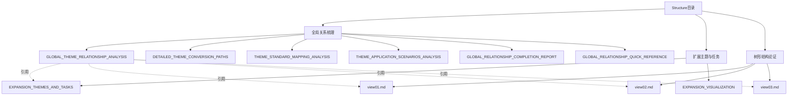

# Structure目录文档导航

## 📑 目录说明

`structure/` 目录包含项目结构相关的核心文档，主要包括：

1. **全局主题关系梳理文档** - 使用多种思维方式全面展示主题间的关系
2. **扩展主题与任务文档** - 项目扩展主题和推进任务清单
3. **树形分层结构论证文档** - 树形分层结构的理论论证

---

## 📚 文档导航

### 1. 统一逻辑框架（5个文档）

#### 1.1 核心文档

| 文档 | 说明 | 主要内容 |
|------|------|---------|
| **FRAMEWORK_QUICK_START.md** | 快速入门指南 ⭐推荐新手 | 5分钟快速了解、核心概念速查、常见问题、使用场景 |
| **UNIFIED_LOGIC_FRAMEWORK.md** | 统一逻辑框架与形式理论 | 五层理论框架、四种逻辑关联、四种论证视角 |
| **THINKING_REPRESENTATION_SYSTEM.md** | 思维表征体系 | 思维导图、多维矩阵、知识图谱、证明树 |
| **FRAMEWORK_SUMMARY.md** | 框架总结 | 问题分析、解决方案、框架结构、应用指南 |
| **FRAMEWORK_NAVIGATION.md** | 导航地图 | 文档体系导航、主题导航、功能导航、快速链接 |

### 2. 全局主题关系梳理（6个文档）

#### 2.1 核心文档

| 文档 | 说明 | 主要内容 |
|------|------|---------|
| **GLOBAL_THEME_RELATIONSHIP_ANALYSIS.md** | 全局关系梳理主文档 | 9种关系表征方式，28个主题全景 |
| **DETAILED_THEME_CONVERSION_PATHS.md** | 转换路径分析 | 45+条转换路径详细分析 |
| **THEME_STANDARD_MAPPING_ANALYSIS.md** | 标准映射分析 | 72个标准映射关系分析 |
| **THEME_APPLICATION_SCENARIOS_ANALYSIS.md** | 应用场景分析 | 150+个应用场景详细分析 |
| **GLOBAL_RELATIONSHIP_COMPLETION_REPORT.md** | 完成报告 | 完成工作总览和统计 |
| **GLOBAL_RELATIONSHIP_QUICK_REFERENCE.md** | 快速参考指南 | 文档导航和快速查找表 |

#### 1.2 关系表征方式

**9种关系表征方式**：

1. **全局思维导图** - 28个主题全景
2. **主题分类矩阵** - 4大分类体系
3. **主题依赖关系矩阵** - 依赖关系分析
4. **主题价值-复杂度矩阵** - 价值评估
5. **主题标准覆盖矩阵** - 72个标准
6. **主题应用场景矩阵** - 应用广度分析
7. **知识图谱** - 主题关系网络
8. **主题演进路径图** - 时间线演进
9. **主题转换关系矩阵** - 转换能力分析

---

### 3. 扩展主题与任务（2个文档）

| 文档 | 说明 | 主要内容 |
|------|------|---------|
| **EXPANSION_THEMES_AND_TASKS.md** | 扩展主题与任务清单 | 推展主题详细规划、任务清单、时间线 |
| **EXPANSION_VISUALIZATION.md** | 扩展可视化 | 思维导图、多维矩阵、时间线甘特图 |

---

### 4. 树形分层结构论证（3个文档）

| 文档 | 说明 | 主要内容 |
|------|------|---------|
| **view01.md** | 树形分层结构通用模型论证 | 跨行业通用组织与治理模型论证 |
| **view02.md** | 多维度系统论证 | 全域行业归纳体系、形式化证明 |
| **view03.md** | 技术论证 | 数据、架构与控制领域的深度技术论证 |

---

## 🎯 快速导航

### 按需求查找

**我想了解...**

- **快速入门** → `FRAMEWORK_QUICK_START.md` ⭐推荐新手
- **导航地图** → `FRAMEWORK_NAVIGATION.md` ⭐推荐查看
- **统一逻辑框架** → `UNIFIED_LOGIC_FRAMEWORK.md`
- **思维表征体系** → `THINKING_REPRESENTATION_SYSTEM.md`
- **框架总结** → `FRAMEWORK_SUMMARY.md`
- **全局主题关系** → `GLOBAL_THEME_RELATIONSHIP_ANALYSIS.md`
- **转换路径** → `DETAILED_THEME_CONVERSION_PATHS.md`
- **标准映射** → `THEME_STANDARD_MAPPING_ANALYSIS.md`
- **应用场景** → `THEME_APPLICATION_SCENARIOS_ANALYSIS.md`
- **快速查找** → `GLOBAL_RELATIONSHIP_QUICK_REFERENCE.md`
- **扩展计划** → `EXPANSION_THEMES_AND_TASKS.md`
- **树形结构理论** → `view01.md`, `view02.md`, `view03.md`

**我想查找...**

- **高频转换路径** → `DETAILED_THEME_CONVERSION_PATHS.md` 第3章
- **复杂转换路径** → `DETAILED_THEME_CONVERSION_PATHS.md` 第4章
- **标准覆盖情况** → `THEME_STANDARD_MAPPING_ANALYSIS.md` 第3章
- **企业应用场景** → `THEME_APPLICATION_SCENARIOS_ANALYSIS.md` 第3章
- **主题依赖关系** → `GLOBAL_THEME_RELATIONSHIP_ANALYSIS.md` 第4章

---

## 📊 文档统计

### 文档数量

| 类别 | 文档数 | 说明 |
|------|--------|------|
| **统一逻辑框架** | 5 | 统一框架、思维表征、框架总结、快速入门、导航地图 |
| **全局关系梳理** | 6 | 关系分析、转换路径、标准映射、应用场景 |
| **扩展主题与任务** | 2 | 扩展计划、可视化 |
| **树形结构论证** | 3 | 理论论证文档 |
| **总计** | **16** | **结构文档** |

### 内容统计

- **主题覆盖**：28个主题
- **转换路径**：45+条
- **标准覆盖**：72个标准
- **应用场景**：150+个
- **关系表征方式**：9种
- **矩阵对比**：10+个
- **思维导图**：5+个
- **知识图谱**：3+个

---

## 🔗 相关文档

### 项目核心文档

- `../README.md` - 项目主文档
- `../DOCUMENT_INDEX.md` - 完整文档索引
- `../PROJECT_COMPREHENSIVE_COMPLETION_REPORT.md` - 项目综合完成报告
- `../PROJECT_DIRECTORY_INTEGRATION.md` ⭐新增 - 三大目录整合说明
- `../PROJECT_NAVIGATION.md` ⭐新增 - 项目全局导航地图

### 主题文档

- `../themes/README.md` - 主题总览
- `../themes/` - 28个主题文档目录

### 视图文档

- `../view/` - 视图文档目录
- `../view/analysis/` - 分析文档
- `../view/practices/` - 实践文档
- `../view/theory/` - 理论文档

---

## 📝 文档关系图

---

## 🎯 文档使用指南

### 新手入门

1. **开始阅读**：`GLOBAL_THEME_RELATIONSHIP_ANALYSIS.md` - 了解全局关系
2. **快速查找**：`GLOBAL_RELATIONSHIP_QUICK_REFERENCE.md` - 快速查找信息
3. **深入理解**：`view01.md`, `view02.md`, `view03.md` - 理解理论基础

### 深入研究

1. **转换路径**：`DETAILED_THEME_CONVERSION_PATHS.md` - 深入研究转换路径
2. **标准映射**：`THEME_STANDARD_MAPPING_ANALYSIS.md` - 深入研究标准映射
3. **应用场景**：`THEME_APPLICATION_SCENARIOS_ANALYSIS.md` - 深入研究应用场景

### 项目规划

1. **扩展计划**：`EXPANSION_THEMES_AND_TASKS.md` - 查看扩展计划
2. **可视化**：`EXPANSION_VISUALIZATION.md` - 查看可视化表征

---

## 📋 文档更新记录

- **2025-01-21**：创建全局关系梳理文档体系（6个文档）
- **2025-01-21**：创建structure目录README导航文档
- **2025-01-21**：创建统一逻辑框架文档体系（5个文档）
- **2025-01-21**：创建项目全局导航地图

---

**文档创建时间**：2025-01-21
**文档版本**：v1.0
**维护者**：DSL Schema研究团队
