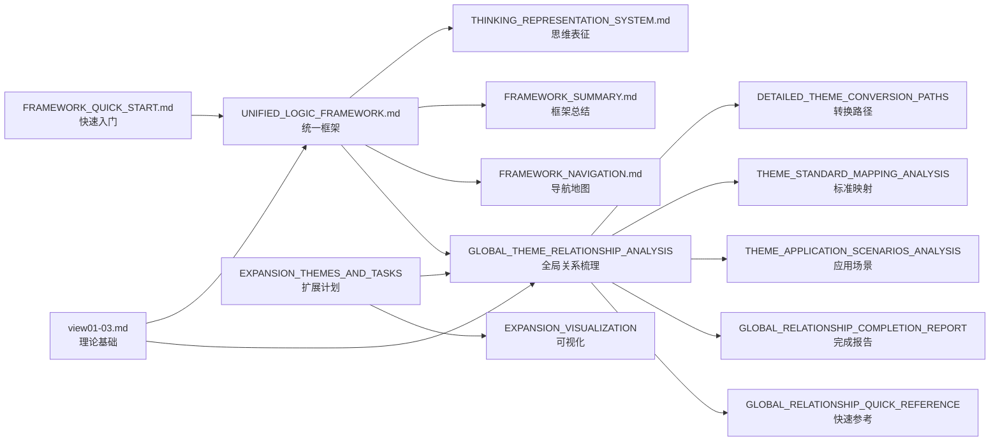

# Structure目录文档整合说明

## 📑 目录

- [Structure目录文档整合说明](#structure目录文档整合说明)
  - [📑 目录](#-目录)
  - [1. 概述](#1-概述)
    - [1.1 Structure目录定位](#11-structure目录定位)
    - [1.2 文档统计](#12-文档统计)
  - [2. 文档体系结构](#2-文档体系结构)
    - [2.1 文档分类](#21-文档分类)
    - [2.2 文档层级关系](#22-文档层级关系)
  - [3. 文档关系网络](#3-文档关系网络)
    - [3.1 依赖关系](#31-依赖关系)
    - [3.2 引用关系](#32-引用关系)
  - [4. 文档使用路径](#4-文档使用路径)
    - [4.1 新手入门路径](#41-新手入门路径)
    - [4.2 深入研究路径](#42-深入研究路径)
    - [4.3 项目规划路径](#43-项目规划路径)
  - [5. 文档交叉引用](#5-文档交叉引用)
    - [5.1 统一逻辑框架文档引用](#51-统一逻辑框架文档引用)
    - [5.2 全局关系梳理文档引用](#52-全局关系梳理文档引用)
    - [5.3 详细分析文档引用](#53-详细分析文档引用)
    - [5.4 树形结构论证文档引用](#54-树形结构论证文档引用)
  - [6. 总结](#6-总结)
    - [6.1 文档体系完整性](#61-文档体系完整性)
    - [6.2 核心价值](#62-核心价值)

---

## 1. 概述

本文档提供**Structure目录文档整合说明**，全面整合structure目录下的所有文档，说明文档之间的关系、使用路径和交叉引用。

### 1.1 Structure目录定位

`structure/` 目录是项目的**结构核心目录**，包含：

1. **统一逻辑框架** - 将28个主题、81个Schema关联起来的理论体系
2. **全局主题关系梳理** - 使用多种思维方式全面展示主题间的关系
3. **扩展主题与任务** - 项目扩展主题和推进任务清单
4. **树形分层结构论证** - 树形分层结构的理论论证

### 1.2 文档统计

- **总文档数**：16个
- **统一逻辑框架**：5个文档
- **全局关系梳理**：6个文档
- **扩展主题与任务**：2个文档
- **树形结构论证**：3个文档

---

## 2. 文档体系结构

### 2.1 文档分类

```mermaid
graph TB
    Structure[Structure目录]

    Structure --> Framework[统一逻辑框架<br/>5个文档]
    Structure --> Global[全局关系梳理<br/>6个文档]
    Structure --> Expansion[扩展主题与任务<br/>2个文档]
    Structure --> View[树形结构论证<br/>3个文档]

    Framework --> F1[FRAMEWORK_QUICK_START.md<br/>快速入门指南]
    Framework --> F2[UNIFIED_LOGIC_FRAMEWORK.md<br/>统一逻辑框架]
    Framework --> F3[THINKING_REPRESENTATION_SYSTEM.md<br/>思维表征体系]
    Framework --> F4[FRAMEWORK_SUMMARY.md<br/>框架总结]
    Framework --> F5[FRAMEWORK_NAVIGATION.md<br/>导航地图]

    Global --> G1[GLOBAL_THEME_RELATIONSHIP_ANALYSIS<br/>全局关系梳理主文档]
    Global --> G2[DETAILED_THEME_CONVERSION_PATHS<br/>转换路径分析]
    Global --> G3[THEME_STANDARD_MAPPING_ANALYSIS<br/>标准映射分析]
    Global --> G4[THEME_APPLICATION_SCENARIOS_ANALYSIS<br/>应用场景分析]
    Global --> G5[GLOBAL_RELATIONSHIP_COMPLETION_REPORT<br/>完成报告]
    Global --> G6[GLOBAL_RELATIONSHIP_QUICK_REFERENCE<br/>快速参考指南]

    Expansion --> E1[EXPANSION_THEMES_AND_TASKS<br/>扩展主题与任务]
    Expansion --> E2[EXPANSION_VISUALIZATION<br/>扩展可视化]

    View --> V1[view01.md<br/>通用模型论证]
    View --> V2[view02.md<br/>多维度系统论证]
    View --> V3[view03.md<br/>技术论证]
```



### 2.2 文档层级关系

**第一层：框架核心文档**:

- `FRAMEWORK_QUICK_START.md` - 快速入门指南（推荐新手）
- `UNIFIED_LOGIC_FRAMEWORK.md` - 统一逻辑框架与形式理论
- `THINKING_REPRESENTATION_SYSTEM.md` - 思维表征体系
- `FRAMEWORK_SUMMARY.md` - 框架总结
- `FRAMEWORK_NAVIGATION.md` - 导航地图（推荐查看）

**第二层：关系分析文档**:

- `GLOBAL_THEME_RELATIONSHIP_ANALYSIS.md` - 全局关系梳理主文档
- `DETAILED_THEME_CONVERSION_PATHS.md` - 转换路径详细分析
- `THEME_STANDARD_MAPPING_ANALYSIS.md` - 标准映射详细分析
- `THEME_APPLICATION_SCENARIOS_ANALYSIS.md` - 应用场景详细分析

**第三层：辅助文档**:

- `GLOBAL_RELATIONSHIP_COMPLETION_REPORT.md` - 完成报告
- `GLOBAL_RELATIONSHIP_QUICK_REFERENCE.md` - 快速参考指南
- `EXPANSION_THEMES_AND_TASKS.md` - 扩展主题与任务
- `EXPANSION_VISUALIZATION.md` - 扩展可视化
- `view01.md`, `view02.md`, `view03.md` - 树形结构论证文档

---

## 3. 文档关系网络

### 3.1 依赖关系



### 3.2 引用关系

| 源文档 | 引用文档 | 引用位置 | 引用原因 |
|--------|---------|---------|---------|
| **FRAMEWORK_QUICK_START.md** | UNIFIED_LOGIC_FRAMEWORK.md | 多处 | 框架详细说明 |
| **UNIFIED_LOGIC_FRAMEWORK.md** | view01-03.md | 第2.1节 | 元模型层理论基础 |
| **UNIFIED_LOGIC_FRAMEWORK.md** | GLOBAL_THEME_RELATIONSHIP_ANALYSIS.md | 第3节 | 主题关系参考 |
| **THINKING_REPRESENTATION_SYSTEM.md** | UNIFIED_LOGIC_FRAMEWORK.md | 参考文档 | 统一框架参考 |
| **GLOBAL_THEME_RELATIONSHIP_ANALYSIS.md** | view01-03.md | 第12章 | 理论基础支撑 |
| **GLOBAL_THEME_RELATIONSHIP_ANALYSIS.md** | UNIFIED_LOGIC_FRAMEWORK.md | 第12.5节 | 统一逻辑框架参考 |
| **GLOBAL_THEME_RELATIONSHIP_ANALYSIS.md** | EXPANSION_THEMES_AND_TASKS.md | 第12章 | 扩展计划参考 |
| **DETAILED_THEME_CONVERSION_PATHS.md** | GLOBAL_THEME_RELATIONSHIP_ANALYSIS.md | 参考文档 | 全局关系参考 |
| **THEME_STANDARD_MAPPING_ANALYSIS.md** | GLOBAL_THEME_RELATIONSHIP_ANALYSIS.md | 参考文档 | 全局关系参考 |
| **THEME_APPLICATION_SCENARIOS_ANALYSIS.md** | GLOBAL_THEME_RELATIONSHIP_ANALYSIS.md | 参考文档 | 全局关系参考 |

---

## 4. 文档使用路径

### 4.1 新手入门路径

```text
1. README.md (本目录导航)
   ↓
2. FRAMEWORK_QUICK_START.md (快速入门指南) ⭐推荐
   ↓
3. FRAMEWORK_NAVIGATION.md (导航地图) ⭐推荐
   ↓
4. UNIFIED_LOGIC_FRAMEWORK.md (统一逻辑框架)
   ↓
5. THINKING_REPRESENTATION_SYSTEM.md (思维表征体系)
   ↓
6. GLOBAL_THEME_RELATIONSHIP_ANALYSIS.md (全局关系梳理)
   ↓
7. view01.md, view02.md, view03.md (理论基础)
```

### 4.2 深入研究路径

```text
1. UNIFIED_LOGIC_FRAMEWORK.md (统一逻辑框架)
   ↓
2. THINKING_REPRESENTATION_SYSTEM.md (思维表征体系)
   ↓
3. GLOBAL_THEME_RELATIONSHIP_ANALYSIS.md (全局关系)
   ↓
4. DETAILED_THEME_CONVERSION_PATHS.md (转换路径)
   ↓
5. THEME_STANDARD_MAPPING_ANALYSIS.md (标准映射)
   ↓
6. THEME_APPLICATION_SCENARIOS_ANALYSIS.md (应用场景)
```

### 4.3 项目规划路径

```text
1. EXPANSION_THEMES_AND_TASKS.md (扩展计划)
   ↓
2. EXPANSION_VISUALIZATION.md (可视化)
   ↓
3. GLOBAL_THEME_RELATIONSHIP_ANALYSIS.md (关系分析)
```

---

## 5. 文档交叉引用

### 5.1 统一逻辑框架文档引用

**FRAMEWORK_QUICK_START.md** 引用：

- `structure/UNIFIED_LOGIC_FRAMEWORK.md` - 统一逻辑框架
- `structure/THINKING_REPRESENTATION_SYSTEM.md` - 思维表征体系
- `structure/FRAMEWORK_SUMMARY.md` - 框架总结

**UNIFIED_LOGIC_FRAMEWORK.md** 引用：

- `structure/view01.md`, `view02.md`, `view03.md` - 树形分层结构理论
- `structure/GLOBAL_THEME_RELATIONSHIP_ANALYSIS.md` - 全局关系梳理
- `structure/DETAILED_THEME_CONVERSION_PATHS.md` - 转换路径分析
- `structure/THEME_STANDARD_MAPPING_ANALYSIS.md` - 标准映射分析
- `structure/THEME_APPLICATION_SCENARIOS_ANALYSIS.md` - 应用场景分析

**THINKING_REPRESENTATION_SYSTEM.md** 引用：

- `structure/UNIFIED_LOGIC_FRAMEWORK.md` - 统一逻辑框架
- `structure/GLOBAL_THEME_RELATIONSHIP_ANALYSIS.md` - 全局关系梳理

### 5.2 全局关系梳理文档引用

**GLOBAL_THEME_RELATIONSHIP_ANALYSIS.md** 引用：

- `structure/UNIFIED_LOGIC_FRAMEWORK.md` - 统一逻辑框架
- `structure/THINKING_REPRESENTATION_SYSTEM.md` - 思维表征体系
- `structure/FRAMEWORK_SUMMARY.md` - 框架总结
- `structure/FRAMEWORK_QUICK_START.md` - 快速入门指南
- `structure/EXPANSION_THEMES_AND_TASKS.md` - 扩展主题与任务清单
- `structure/EXPANSION_VISUALIZATION.md` - 扩展可视化
- `structure/view01.md` - 树形分层结构通用模型论证
- `structure/view02.md` - 树形分层结构多维度系统论证
- `structure/view03.md` - 树形分层模型技术论证
- `structure/DETAILED_THEME_CONVERSION_PATHS.md` - 详细转换路径分析
- `structure/THEME_STANDARD_MAPPING_ANALYSIS.md` - 标准映射分析
- `structure/THEME_APPLICATION_SCENARIOS_ANALYSIS.md` - 应用场景分析

### 5.3 详细分析文档引用

**DETAILED_THEME_CONVERSION_PATHS.md** 引用：

- `structure/GLOBAL_THEME_RELATIONSHIP_ANALYSIS.md` - 全局关系梳理

**THEME_STANDARD_MAPPING_ANALYSIS.md** 引用：

- `structure/GLOBAL_THEME_RELATIONSHIP_ANALYSIS.md` - 全局关系梳理

**THEME_APPLICATION_SCENARIOS_ANALYSIS.md** 引用：

- `structure/GLOBAL_THEME_RELATIONSHIP_ANALYSIS.md` - 全局关系梳理

### 5.4 树形结构论证文档引用

**view01.md, view02.md, view03.md** 被引用：

- `structure/GLOBAL_THEME_RELATIONSHIP_ANALYSIS.md` - 作为理论基础
- `structure/EXPANSION_THEMES_AND_TASKS.md` - 作为核心理论体系

---

## 6. 总结

### 6.1 文档体系完整性

- ✅ **16个文档**全部创建完成
- ✅ **统一逻辑框架**5个文档（新增）
- ✅ **文档关系**清晰明确
- ✅ **交叉引用**完整
- ✅ **使用路径**明确

### 6.2 核心价值

1. **统一框架**：提供统一逻辑框架，关联所有主题和子主题
2. **全局视角**：提供项目的全局视角和关系分析
3. **理论基础**：提供树形分层结构的理论论证
4. **扩展规划**：提供项目扩展主题和任务清单
5. **便捷访问**：提供快速参考和导航
6. **思维表征**：提供多种思维表征方式，便于理解和应用

---

**文档创建时间**：2025-01-21
**文档版本**：v1.0
**维护者**：DSL Schema研究团队
