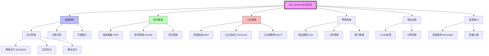

# 行业应用场景树

## 概述

本文档提供DSL Schema在各行业中的应用场景树，帮助理解Schema转换在不同领域的具体应用。

---

## 全局行业应用树

```
                    ┌─────────────────────────────────────────┐
                    │        DSL Schema 行业应用场景          │
                    └───────────────────┬─────────────────────┘
                                        │
    ┌───────────┬───────────┬───────────┼───────────┬───────────┬───────────┐
    │           │           │           │           │           │           │
    ▼           ▼           ▼           ▼           ▼           ▼           ▼
┌───────┐  ┌───────┐  ┌───────────┐  ┌───────┐  ┌───────┐  ┌───────┐  ┌───────┐
│ 金融  │  │ 医疗  │  │ 工业/制造 │  │ 零售  │  │ 政务  │  │ 电信  │  │ 能源  │
└───┬───┘  └───┬───┘  └─────┬─────┘  └───┬───┘  └───┬───┘  └───┬───┘  └───┬───┘
    │          │            │            │            │            │            │
    ▼          ▼            ▼            ▼            ▼            ▼            ▼
```

---

## 金融服务行业应用树

```
金融服务 (Financial Services)
│
├─ 支付系统 (Payment Systems)
│   ├─ 跨境支付
│   │   ├─ ISO 20022 SWIFT MX消息
│   │   ├─ Schema转换: MT103 ↔ MX
│   │   ├─ 数据映射: 字段映射、格式转换
│   │   └─ 验证规则: 合规检查、风险控制
│   │
│   ├─ 实时支付
│   │   ├─ 实时全额结算(RTGS)
│   │   ├─ 即时支付(Instant Payment)
│   │   ├─ 消息格式: JSON/XML
│   │   └─ 性能要求: 毫秒级延迟
│   │
│   └─ 移动支付
│       ├─ 移动钱包接口
│       ├─ Tokenization Schema
│       └─ 安全加密转换
│
├─ 证券交易 (Securities Trading)
│   ├─ 订单管理
│   │   ├─ FIX协议消息
│   │   ├─ 新订单(New Order Single)
│   │   ├─ 执行报告(Execution Report)
│   │   └─ Schema版本: FIX.4.4/5.0
│   │
│   ├─ 市场数据
│   │   ├─ 行情数据格式
│   │   ├─  fastfix压缩
│   │   └─ 二进制编码
│   │
│   └─ 清算结算
│       ├─ ISO 15022 MT消息
│       ├─ T2S平台接口
│       └─ 对账数据Schema
│
├─ 银行业务 (Banking)
│   ├─ 核心银行系统
│   │   ├─ 账户Schema设计
│   │   ├─ 交易记录格式
│   │   └─ 客户数据模型
│   │
│   ├─ 开放银行(Open Banking)
│   │   ├─ PSD2 XS2A接口
│   │   ├─ 账户信息服务(AIS)
│   │   ├─ 支付发起服务(PIS)
│   │   └─ OpenAPI规范
│   │
│   └─ 监管报送
│       ├─ XBRL财务报告
│       ├─ 巴塞尔协议数据
│       └─ 反洗钱(AML)报告
│
└─ 保险业务 (Insurance)
    ├─ 保单管理
    │   ├─ ACORD标准
    │   ├─ 保单数据模型
    │   └─ 理赔Schema
    │
    └─ 再保险
        ├─ 再保险合同Schema
        └─ 风险数据交换
```

---

## 医疗健康行业应用树

```
医疗健康 (Healthcare)
│
├─ 临床数据交换 (Clinical Data Exchange)
│   ├─ 电子病历(EHR)
│   │   ├─ FHIR资源建模
│   │   ├─ Patient资源
│   │   ├─ Observation资源
│   │   ├─ Encounter资源
│   │   └─ DocumentReference资源
│   │
│   ├─ 实验室结果
│   │   ├─ HL7 v2 ORU消息
│   │   ├─ FHIR DiagnosticReport
│   │   └─ LOINC编码映射
│   │
│   └─ 医学影像
│       ├─ DICOM标准
│       ├─ DICOMweb RESTful接口
│       └─ 影像元数据Schema
│
├─ 药品管理 (Pharmacy Management)
│   ├─ 处方电子传输
│   │   ├─ NCPDP SCRIPT标准
│   │   ├─ 处方Schema
│   │   └─ 药房系统集成
│   │
│   └─ 药物追溯
│       ├─ GS1医药追溯标准
│       ├─ 序列化数据格式
│       └─ 区块链存证Schema
│
├─ 医疗设备 (Medical Devices)
│   ├─ 设备数据接口
│   │   ├─ IEEE 11073标准
│   │   ├─ 生命体征数据
│   │   └─ 设备控制消息
│   │
│   └─ 远程监控
│       ├─ 远程患者监控(RPM)
│       ├─ 实时数据流
│       └─ 告警Schema
│
└─ 公共卫生 (Public Health)
    ├─ 疾病监测
    │   ├─ CDC病例报告格式
    │   ├─ 症状监测数据
    │   └─ 疫情上报Schema
    │
    └─ 疫苗管理
        ├─ 免疫信息系统(IIS)
        ├─ 疫苗接种记录
        └─ HL7 VXU消息
```

---

## 工业与制造行业应用树

```
工业制造 (Industrial & Manufacturing)
│
├─ 智能制造 (Smart Manufacturing)
│   ├─ MES系统
│   │   ├─ ISA-95标准
│   │   ├─ 生产订单Schema
│   │   ├─ 工单数据模型
│   │   └─ 质量控制记录
│   │
│   ├─ 产品生命周期(PLM)
│   │   ├─ 产品设计数据
│   │   ├─ BOM管理
│   │   └─ 变更管理Schema
│   │
│   └─ 数字孪生
│       ├─ 数字孪生模型
│       ├─ 实时数据映射
│       └─ 仿真数据格式
│
├─ 工业自动化 (Industrial Automation)
│   ├─ PLC编程
│   │   ├─ IEC 61131-3
│   │   ├─ 结构化文本(ST)
│   │   ├─ 功能块图(FBD)
│   │   └─ 程序数据结构
│   │
│   ├─ SCADA系统
│   │   ├─ 监控点Schema
│   │   ├─ 报警数据格式
│   │   └─ 历史数据存储
│   │
│   └─ 工业机器人
│       ├─ 机器人程序接口
│       ├─ 运动控制数据
│       └─ 安全监控Schema
│
├─ 物联网IoT (Industrial IoT)
│   ├─ 传感器数据
│   │   ├─ 时序数据格式
│   │   ├─ MQTT消息Payload
│   │   └─ 边缘计算Schema
│   │
│   ├─ 设备管理
│   │   ├─ OMA LwM2M对象
│   │   ├─ 设备生命周期数据
│   │   └─ 固件升级(FOTA)
│   │
│   └─ 预测性维护
│       ├─ 设备健康数据
│       ├─ 故障预测模型输入
│       └─ 维护工单生成
│
└─ 质量控制 (Quality Management)
    ├─ 质量检测数据
    │   ├─ 检测计划Schema
    │   ├─ 检测结果记录
    │   └─ 统计过程控制(SPC)
    │
    └─ 追溯系统
        ├─ 产品追溯码
        ├─ 批次记录Schema
        └─ 供应链追溯
```

---

## 零售与电商行业应用树

```
零售电商 (Retail & E-commerce)
│
├─ 商品管理 (Product Management)
│   ├─ 商品主数据
│   │   ├─ GS1 GDSN标准
│   │   ├─ 商品分类Schema
│   │   ├─ 属性管理
│   │   └─ 多语言描述
│   │
│   ├─ 价格管理
│   │   ├─ 价格列表Schema
│   │   ├─ 促销规则数据
│   │   └─ 动态定价模型
│   │
│   └─ 库存管理
│       ├─ 库存状态Schema
│       ├─ 补货计划数据
│       └─ 库存同步消息
│
├─ 订单管理 (Order Management)
│   ├─ 订单生命周期
│   │   ├─ 订单Schema设计
│   │   ├─ 订单状态机
│   │   ├─ 订单变更记录
│   │   └─ 拆分合并规则
│   │
│   ├─ 支付集成
│   │   ├─ 支付网关接口
│   │   ├─ PCI DSS合规数据
│   │   └─ 交易记录Schema
│   │
│   └─ 履约配送
│       ├─ 配送地址Schema
│       ├─ 物流跟踪数据
│       └─ 最后一公里优化
│
├─ 客户管理 (Customer Management)
│   ├─ 客户主数据
│   │   ├─ 客户画像Schema
│   │   ├─ 偏好数据模型
│   │   └─ 隐私合规(GDPR)
│   │
│   └─ 会员体系
│       ├─ 会员等级规则
│       ├─ 积分数据Schema
│       └─ 权益管理
│
└─ 营销推广 (Marketing)
    ├─ 个性化推荐
    │   ├─ 用户行为数据
    │   ├─ 推荐算法输入
    │   └─ A/B测试Schema
    │
    └─ 营销自动化
        ├─ 营销活动数据
        ├─ 触达渠道管理
        └─ 效果分析Schema
```

---

## 快速参考矩阵

### 行业-场景-标准映射

| 行业 | 核心场景 | 推荐标准 | Schema复杂度 |
|------|----------|----------|--------------|
| **金融** | 支付结算 | ISO 20022 | 高 |
| **金融** | 证券交易 | FIX 5.0 | 中 |
| **金融** | 监管报送 | XBRL | 高 |
| **医疗** | 临床数据 | FHIR R4 | 高 |
| **医疗** | 传统集成 | HL7 v2 | 中 |
| **医疗** | 医学影像 | DICOM | 高 |
| **工业** | 设备通信 | OPC UA | 高 |
| **工业** | PLC编程 | IEC 61131-3 | 中 |
| **工业** | IoT数据 | MQTT+自定义 | 低 |
| **零售** | 商品数据 | GS1 GDSN | 中 |
| **零售** | 订单管理 | OpenAPI | 中 |
| **电信** | 运营管理 | eTOM/SID | 高 |
| **能源** | 电网管理 | IEC 61850 | 高 |

---

## Mermaid应用树



---

**创建时间**: 2026-02-17  
**最后更新**: 2026-02-17  
**维护者**: DSL Schema研究团队
