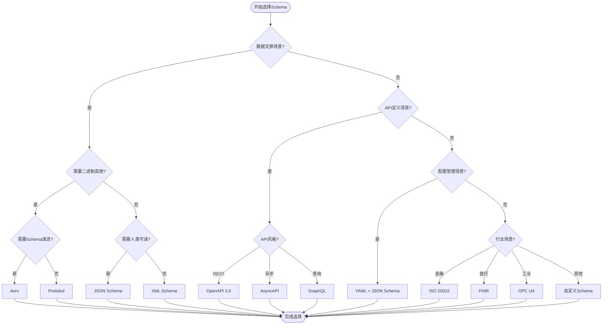

# Schema选择决策树

## 决策树概述

本文档提供Schema选择的多维度决策树，帮助用户根据具体需求选择最适合的Schema类型和标准。

---

## 决策树 1: Schema类型选择

```
                    ┌─────────────────────────────────────────┐
                    │        您需要什么类型的Schema?          │
                    └───────────────────┬─────────────────────┘
                                        │
        ┌───────────────────┬───────────┴───────────┬───────────────────┐
        │                   │                       │                   │
        ▼                   ▼                       ▼                   ▼
   ┌─────────┐       ┌──────────┐          ┌──────────┐         ┌──────────┐
   │ 数据交换│       │ API定义  │          │ 配置管理 │         │ 文档描述 │
   │ (Data)  │       │ (API)    │          │ (Config) │         │ (Doc)    │
   └────┬────┘       └────┬─────┘          └────┬─────┘         └────┬─────┘
        │                 │                     │                    │
        ▼                 ▼                     ▼                    ▼
   ┌─────────┐      ┌──────────┐        ┌──────────┐         ┌──────────┐
   │JSON/XML │      │OpenAPI   │        │YAML/TOML │         │Markdown  │
   │Protobuf │      │AsyncAPI  │        │JSON      │         │HTML      │
   │Avro     │      │GraphQL   │        │XML       │         │XML       │
   └─────────┘      └──────────┘        └──────────┘         └──────────┘
```

### 详细决策路径

**路径1: 数据交换场景**

```
需要数据交换?
    │
    ├─ 是 → 需要二进制高效?
    │       │
    │       ├─ 是 → 需要Schema演进?
    │       │       │
    │       │       ├─ 是 → Avro (推荐)
    │       │       │           - 支持Schema演进
    │       │       │           - 紧凑二进制格式
    │       │       │           - Hadoop生态标准
    │       │       │
    │       │       └─ 否 → Protobuf (推荐)
    │       │               - Google开发
    │       │               - 高效序列化
    │       │               - 多语言支持
    │       │
    │       └─ 否 → 需要人类可读?
    │               │
    │               ├─ 是 → JSON (推荐)
    │               │       - 广泛支持
    │               │       - 易于调试
    │               │       - Web标准
    │               │
    │               └─ 否 → XML (推荐)
    │                       - 企业级标准
    │                       - 丰富工具生态
    │                       - 严格验证
    │
    └─ 否 → 继续其他场景...
```

**路径2: API定义场景**

```
需要定义API?
    │
    ├─ 是 → API风格?
    │       │
    │       ├─ RESTful → OpenAPI 3.0 (推荐)
    │       │           - 行业标准
    │       │           - 丰富工具链
    │       │           - 代码生成
    │       │
    │       ├─ 异步/事件驱动 → AsyncAPI (推荐)
    │       │               - 消息系统标准
    │       │               - 支持Kafka/MQTT等
    │       │               - 事件架构文档化
    │       │
    │       └─ 灵活查询 → GraphQL (推荐)
    │                   - 客户端驱动查询
    │                   - 减少过度获取
    │                   - 强类型Schema
    │
    └─ 否 → 继续其他场景...
```

---

## 决策树 2: 行业标准选择

```
                    ┌─────────────────────────────────────────┐
                    │         您属于哪个行业?                  │
                    └───────────────────┬─────────────────────┘
                                        │
    ┌───────────┬───────────┬───────────┴───────────┬───────────┬───────────┐
    │           │           │                       │           │           │
    ▼           ▼           ▼                       ▼           ▼           ▼
┌───────┐  ┌───────┐  ┌───────────┐          ┌──────────┐  ┌───────┐  ┌───────┐
│ 金融  │  │ 医疗  │  │ 工业/IoT  │          │ 电信     │  │ 政务  │  │ 零售  │
└───┬───┘  └───┬───┘  └─────┬─────┘          └────┬─────┘  └───┬───┘  └───┬───┘
    │          │            │                     │            │          │
    ▼          ▼            ▼                     ▼            ▼          ▼
┌─────────────────────────────────────────────────────────────────────────────┐
│                            行业特定标准推荐                                  │
├──────────┬──────────┬──────────────┬──────────────┬──────────────┬──────────┤
│ 金融     │ 医疗     │ 工业         │ 电信         │ 政务         │ 零售     │
├──────────┼──────────┼──────────────┼──────────────┼──────────────┼──────────┤
│ ISO20022 │ FHIR     │ IEC 61850    │ eTOM         │ NIEM         │ GS1      │
│ FIX      │ HL7 v2   │ OPC UA       │ SID          │ XBRL         │ EPCIS    │
│ XBRL     │ DICOM    │ IEC 61131-3  │ TM Forum API │ FIBO         │ ARTS     │
│ SWIFT    │ CDA      │ MQTT/CoAP    │ TMF630+      │ GRDDL        │ GDSN     │
└──────────┴──────────┴──────────────┴──────────────┴──────────────┴──────────┘
```

### 行业选择详细路径

**金融服务业决策路径**

```
金融支付场景?
    │
    ├─ 国际支付 → ISO 20022 (SWIFT MX)
    │               - 全球标准
    │               - 丰富业务语义
    │               -  XML/JSON格式
    │
    ├─ 证券交易 → FIX 5.0
    │               - 实时交易
    │               - 低延迟
    │               - Tag=Value或XML
    │
    ├─ 监管报送 → XBRL
    │               - 财务报告标准
    │               - 可扩展分类标准
    │               - 多国监管支持
    │
    └─ 银行间通信 → SWIFT MT/MX
                    - MT: 传统消息
                    - MX: ISO 20022 XML
```

**医疗健康业决策路径**

```
医疗数据交换?
    │
    ├─ 现代Web API → FHIR R4/R5
    │                 - RESTful设计
    │                 - JSON/XML格式
    │                 - 模块化资源
    │
    ├─ 传统系统集成 → HL7 v2.x
    │                 - 消息管道
    │                 - 广泛部署
    │                 - 管道分隔格式
    │
    ├─ 医学影像 → DICOM
    │             - 影像+元数据
    │             - 存储和传输
    │             - 工作流管理
    │
    └─ 临床文档 → CDA (Clinical Document Architecture)
                  - 结构化文档
                  - 语义互操作
                  - XML格式
```

---

## 决策树 3: 技术栈选择

```
                    ┌─────────────────────────────────────────┐
                    │       您的技术栈偏好?                    │
                    └───────────────────┬─────────────────────┘
                                        │
        ┌───────────────┬───────────────┼───────────────┬───────────────┐
        │               │               │               │               │
        ▼               ▼               ▼               ▼               ▼
   ┌─────────┐    ┌──────────┐    ┌──────────┐    ┌──────────┐    ┌──────────┐
   │ Java    │    │ Python   │    │ JavaScript│   │ .NET     │    │ Go       │
   │ 生态    │    │ 生态     │    │ 生态      │    │ 生态     │    │ 生态     │
   └────┬────┘    └────┬─────┘    └────┬─────┘    └────┬─────┘    └────┬─────┘
        │              │               │               │               │
        ▼              ▼               ▼               ▼               ▼
   ┌──────────────────────────────────────────────────────────────────────────┐
│                           推荐Schema工具/库                                │
├──────────────┬──────────────┬──────────────┬──────────────┬───────────────┤
│ Java         │ Python       │ JavaScript   │ .NET         │ Go            │
├──────────────┼──────────────┼──────────────┼──────────────┼───────────────┤
│ JAXB         │ Pydantic     │ AJV          │ System.Text  │ go-validator  │
│ Jackson      │ Marshmallow  │ Yup          │ Json.NET     │ gojsonschema  │
│ Hibernate    │ SQLAlchemy   │ Joi          │ XmlSerializer│ encoding/json │
│ Validator    │ Cerberus     │ class-       │ DataContract │ protobuf-go   │
│              │              │ validator    │ Serializer   │               │
└──────────────┴──────────────┴──────────────┴──────────────┴───────────────┘
```

---

## 决策树 4: 复杂度与规模选择

```
                    ┌─────────────────────────────────────────┐
                    │      Schema复杂度与数据规模?             │
                    └───────────────────┬─────────────────────┘
                                        │
                ┌───────────────────────┴───────────────────────┐
                │                                               │
                ▼                                               ▼
        ┌───────────────┐                               ┌───────────────┐
        │  简单Schema    │                               │  复杂Schema    │
        │  (< 20字段)   │                               │  (> 50字段)   │
        └───────┬───────┘                               └───────┬───────┘
                │                                               │
        ┌───────┴───────┐                               ┌───────┴───────┐
        │               │                               │               │
        ▼               ▼                               ▼               ▼
   ┌──────────┐   ┌──────────┐                  ┌──────────┐   ┌──────────┐
   │ 小规模   │   │ 大规模   │                  │ 小规模   │   │ 大规模   │
   │ 数据    │   │ 数据    │                  │ 数据    │   │ 数据    │
   └────┬─────┘   └────┬─────┘                  └────┬─────┘   └────┬─────┘
        │              │                             │              │
        ▼              ▼                             ▼              ▼
   ┌──────────┐   ┌──────────┐                  ┌──────────┐   ┌──────────┐
   │ JSON     │   │ Avro/    │                  │ XML/     │   │ Protobuf/│
   │ Schema   │   │ Parquet  │                  │ XSD      │   │ ORC      │
   │ (轻量)   │   │ (列存)   │                  │ (强约束) │   │ (高性能) │
   └──────────┘   └──────────┘                  └──────────┘   └──────────┘
```

---

## 决策矩阵

### 快速选择矩阵

| 场景 | 推荐Schema | 备选方案 | 关键考量 |
|------|-----------|----------|----------|
| **Web API** | OpenAPI 3.0 | AsyncAPI, GraphQL | 工具生态, 代码生成 |
| **配置管理** | YAML + JSON Schema | TOML, HOCON | 人类可读, 验证 |
| **数据存储** | Avro | Parquet, ORC | Schema演进, 压缩 |
| **消息队列** | Avro/Protobuf | JSON Schema | 性能, 兼容性 |
| **金融支付** | ISO 20022 | FIX | 行业标准, 合规 |
| **医疗健康** | FHIR | HL7 v2 | 现代性, 互操作 |
| **工业IoT** | OPC UA | MQTT + 自定义 | 实时性, 可靠性 |
| **日志监控** | JSON Lines | Protocol Buffers | 可读性, 解析速度 |

---

## Mermaid决策图



---

## 使用指南

### 如何使用本决策树

1. **明确场景**: 首先确定您的主要使用场景（数据交换、API定义、配置管理等）
2. **评估约束**: 考虑性能、可读性、工具支持等约束条件
3. **参考矩阵**: 使用快速选择矩阵进行初步筛选
4. **详细路径**: 沿着决策树路径深入分析
5. **验证选择**: 用Mermaid流程图验证决策路径

### 决策检查清单

- [ ] 明确主要使用场景
- [ ] 评估数据规模和复杂度
- [ ] 考虑团队技术栈
- [ ] 验证行业标准要求
- [ ] 评估工具生态支持
- [ ] 测试概念验证(PoC)

---

**创建时间**: 2026-02-17  
**最后更新**: 2026-02-17  
**维护者**: DSL Schema研究团队
