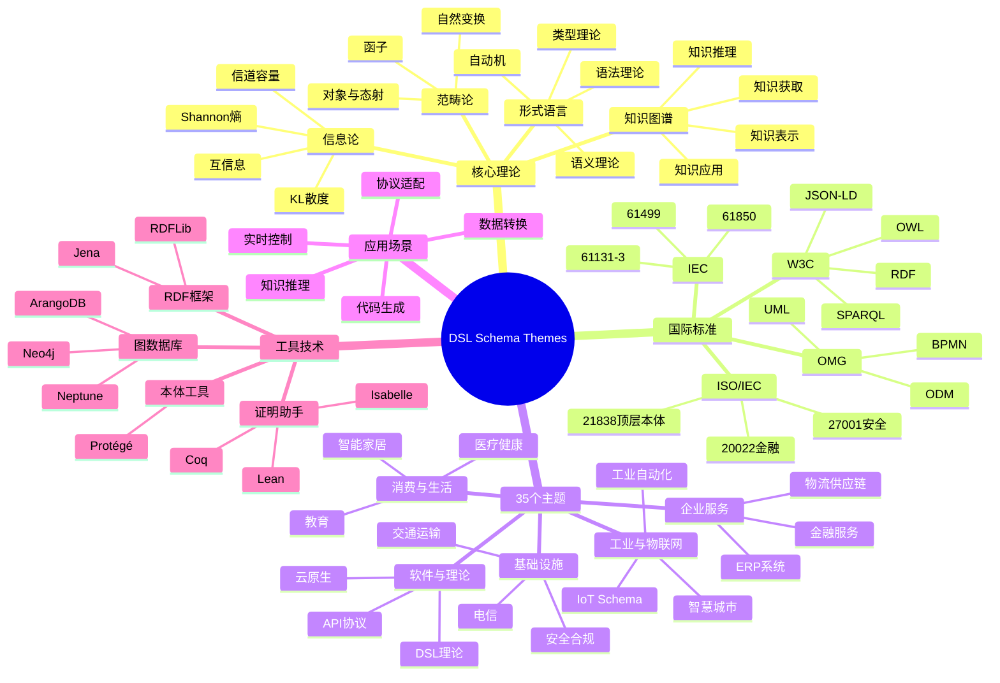

# Themes 全局思维导图

## DSL Schema Themes 知识体系

```
                        ┌─────────────────────────────────────────┐
                        │         DSL Schema Themes               │
                        │           知识体系架构                   │
                        └───────────────────┬─────────────────────┘
                                            │
    ┌───────────────┬───────────────────────┼───────────────────────┬───────────────┐
    ▼               ▼                       ▼                       ▼               ▼
┌───────┐      ┌────────┐            ┌──────────┐            ┌────────┐      ┌───────┐
│核心理论│      │行业标准│            │ 应用场景  │            │工具技术│      │35主题 │
│体系   │      │体系    │            │          │            │体系    │      │分类   │
└───┬───┘      └───┬────┘            └────┬─────┘            └───┬────┘      └───┬───┘
    │               │                      │                      │               │
    ▼               ▼                      ▼                      ▼               ▼
```

## 核心理论体系分支

```
核心理论体系
│
├─ 信息论 (Information Theory)
│   ├─ Shannon熵
│   │   ├─ 定义: H(X) = -ΣP(x)log₂P(x)
│   │   ├─ Schema信息熵
│   │   └─ 七维信息熵模型
│   │
│   ├─ 互信息 (Mutual Information)
│   │   ├─ 定义: I(X;Y) = H(X) - H(X|Y)
│   │   ├─ 转换质量评估
│   │   └─ 信息依赖度量
│   │
│   ├─ 信道容量 (Channel Capacity)
│   │   ├─ 定义: C = max I(X;Y)
│   │   ├─ 转换效率上限
│   │   └─ 优化策略
│   │
│   └─ KL散度 (Kullback-Leibler Divergence)
│       ├─ 信息损失量化
│       ├─ 分布差异度量
│       └─ 压缩极限分析
│
├─ 形式语言理论 (Formal Language Theory)
│   ├─ 语法理论
│   │   ├─ 上下文无关文法 (CFG)
│   │   ├─ 正则表达式
│   │   ├─ BNF/EBNF表示
│   │   └─ 语法分析算法
│   │
│   ├─ 语义理论
│   │   ├─ 指称语义
│   │   ├─ 操作语义
│   │   ├─ 公理语义
│   │   └─ 类型系统
│   │
│   ├─ 自动机理论
│   │   ├─ 有限状态机
│   │   ├─ 下推自动机
│   │   └─ 图灵机
│   │
│   └─ 类型理论
│       ├─ 简单类型
│       ├─ 多态类型
│       ├─ 依赖类型
│       └─ 线性类型
│
├─ 知识图谱 (Knowledge Graph)
│   ├─ 知识表示
│   │   ├─ RDF三元组
│   │   ├─ OWL本体
│   │   ├─ 属性图模型
│   │   └─ 向量表示
│   │
│   ├─ 知识推理
│   │   ├─ 规则推理
│   │   ├─ 图推理
│   │   ├─ 语义推理
│   │   └─ 神经网络推理
│   │
│   ├─ 知识获取
│   │   ├─ 实体抽取
│   │   ├─ 关系抽取
│   │   ├─ 事件抽取
│   │   └─ 知识融合
│   │
│   └─ 知识应用
│       ├─ 智能问答
│       ├─ 推荐系统
│       ├─ 语义搜索
│       └─ 知识推理
│
└─ 范畴论 (Category Theory)
    ├─ 基本概念
    │   ├─ 对象 (Object)
    │   ├─ 态射 (Morphism)
    │   ├─ 函子 (Functor)
    │   └─ 自然变换 (Natural Transformation)
    │
    ├─ Schema作为范畴
    │   ├─ 对象是类型
    │   ├─ 态射是转换
    │   └─ 组合是管道
    │
    └─ 应用
        ├─ 转换组合
        ├─ 泛型编程
        └─ 类型系统基础
```

## 国际标准体系分支

```
国际标准体系
│
├─ W3C标准 (语义网)
│   ├─ 数据层
│   │   ├─ RDF 1.2 - 资源描述框架
│   │   ├─ RDF Schema - 词汇定义
│   │   └─ JSON-LD - JSON序列化
│   │
│   ├─ 本体层
│   │   ├─ OWL 2 - Web本体语言
│   │   └─ SKOS - 知识组织系统
│   │
│   ├─ 约束层
│   │   └─ SHACL - 形状约束语言
│   │
│   └─ 查询层
│       └─ SPARQL 1.2 - RDF查询语言
│
├─ ISO/IEC标准 (通用)
│   ├─ ISO/IEC 21838 - 顶层本体
│   │   ├─ Part 1: Requirements
│   │   ├─ Part 2: BFO
│   │   ├─ Part 3: DOLCE
│   │   ├─ Part 4: TUpper
│   │   └─ Part 5: UFO (开发中)
│   │
│   ├─ ISO/IEC 27001 - 信息安全管理
│   ├─ ISO/IEC 20000 - IT服务管理
│   └─ ISO/IEC 24744 - 元模型
│
├─ IEC标准 (工业)
│   ├─ IEC 61131-3 - PLC编程
│   ├─ IEC 61499 - 功能块
│   ├─ IEC 61850 - 变电站通信
│   ├─ IEC 61970 - 能量管理系统 (CIM)
│   ├─ IEC 61968 - 配电管理
│   └─ IEC 62443 - 工业安全
│
├─ OMG标准 (建模)
│   ├─ ODM - 本体定义元模型
│   ├─ MOF - 元对象设施
│   ├─ UML - 统一建模语言
│   ├─ SysML - 系统建模语言
│   └─ BPMN - 业务流程建模
│
└─ 行业标准 (特定领域)
    ├─ 金融
    │   ├─ ISO 20022 - 金融报文
    │   ├─ FIX - 证券交易
    │   └─ XBRL - 财务报告
    │
    ├─ 医疗
    │   ├─ FHIR - 医疗数据交换
    │   ├─ HL7 v2.x - 医疗消息
    │   └─ DICOM - 医学影像
    │
    ├─ 物联网
    │   ├─ MQTT - 消息传输
    │   ├─ CoAP - 约束应用协议
    │   └─ Matter - 智能家居
    │
    └─ API
        ├─ OpenAPI - REST API
        ├─ AsyncAPI - 异步API
        └─ GraphQL - 查询语言
```

## 35主题分类思维导图

```
35个主题分类
│
├─ 工业与物联网 (8个)
│   ├─ 01_Industrial_Automation - 工业自动化
│   ├─ 02_IoT_Schema - 物联网
│   ├─ 03_Physical_Device - 物理设备
│   ├─ 08_Maritime_Shipping - 海事航运
│   ├─ 08_Smart_City - 智慧城市
│   ├─ 16_Energy_Industry - 能源行业
│   ├─ 17_Manufacturing - 制造业
│   └─ 20_Building_Construction - 建筑建造
│
├─ 软件与理论 (5个)
│   ├─ 04_Programming_Conversion - 编程转换
│   ├─ 05_DSL_Theory - DSL理论
│   ├─ 25_AI_Code_Integration - AI代码集成
│   ├─ 29_API_Protocol_Schemas - API协议
│   └─ 30_Cloud_Native_DevOps - 云原生DevOps
│
├─ 企业服务 (7个)
│   ├─ 06_Financial_Services - 金融服务
│   ├─ 07_Logistics_Supply_Chain - 物流供应链
│   ├─ 13_OA_Office_Automation - 办公自动化
│   ├─ 14_Workflow_BPM - 工作流BPM
│   ├─ 15_ERP_Systems - ERP系统
│   ├─ 26_Enterprise_Finance - 企业财务
│   └─ 27_Enterprise_Data_Analytics - 企业数据分析
│
├─ 消费与生活 (6个)
│   ├─ 10_Healthcare - 医疗健康
│   ├─ 11_Food_Industry - 食品行业
│   ├─ 12_Smart_Home - 智能家居
│   ├─ 18_Retail_Industry - 零售行业
│   ├─ 21_Education - 教育
│   └─ 22_Agriculture - 农业
│
├─ 基础设施 (4个)
│   ├─ 19_Transportation - 交通运输
│   ├─ 23_Telecommunications - 电信
│   ├─ 32_Security_Compliance - 安全合规
│   └─ 33_Industry_Deepening - 行业深化
│
└─ 跨领域 (5个)
    ├─ 24_Other_Industries - 其他行业
    ├─ 28_Enterprise_Performance_Management - 绩效管理
    ├─ 31_Emerging_Technologies - 新兴技术
    ├─ 32_Cross_Disciplinary - 跨学科
    └─ tools - 工具
```

## 应用场景分支

```
应用场景
│
├─ 数据转换
│   ├─ Schema到Schema转换
│   ├─ 格式转换 (JSON↔XML↔YAML)
│   ├─ 编码转换
│   └─ 压缩/解压
│
├─ 协议适配
│   ├─ 协议转换 (REST↔gRPC)
│   ├─ 消息格式转换
│   ├─ 编解码器
│   └─ 网关集成
│
├─ 代码生成
│   ├─ API客户端生成
│   ├─ 服务端存根生成
│   ├─ 文档生成
│   └─ 测试用例生成
│
├─ 知识推理
│   ├─ Schema映射发现
│   ├─ 转换路径优化
│   ├─ 质量评估
│   └─ 智能推荐
│
├─ 实时控制
│   ├─ PLC编程
│   ├─ SCADA集成
│   ├─ 设备控制
│   └─ 流程编排
│
└─ 数据集成
    ├─ ETL流程
    ├─ 数据仓库
    ├─ 数据湖
    └─ 主数据管理
```

## 工具技术体系分支

```
工具技术体系
│
├─ 证明助手
│   ├─ Coq - 构造性证明
│   ├─ Isabelle - 高阶逻辑
│   ├─ Lean - 数学证明
│   ├─ Agda - 依赖类型
│   └─ TLA+ - 时序逻辑
│
├─ 图数据库
│   ├─ Neo4j - 原生图数据库
│   ├─ ArangoDB - 多模型数据库
│   ├─ Amazon Neptune - 托管图数据库
│   ├─ PostgreSQL+AGE - 关系图扩展
│   └─ JanusGraph - 分布式图
│
├─ RDF框架
│   ├─ Apache Jena - Java RDF框架
│   ├─ RDFLib - Python RDF库
│   ├─ Eclipse RDF4J - Java RDF框架
│   └─ Redland - C RDF库
│
├─ 本体工具
│   ├─ Protégé - 本体编辑器
│   ├─ WebProtégé - 在线编辑器
│   ├─ TopBraid Composer - 企业级工具
│   └─ PoolParty - 语义平台
│
├─ Schema工具
│   ├─ JSON Schema Validator
│   ├─ OpenAPI Generator
│   ├─ AsyncAPI Tools
│   └─ GraphQL Code Generator
│
└─ 开发工具
    ├─ VS Code + 插件
    ├─ IntelliJ IDEA
    ├─ Eclipse
    └─ 在线编辑器
```

## 概念关系网络

```
                    ┌─────────────────────────────────────────┐
                    │           DSL Schema 核心概念            │
                    └───────────────────┬─────────────────────┘
                                        │
        ┌───────────────┬───────────────┼───────────────┬───────────────┐
        ▼               ▼               ▼               ▼               ▼
   ┌─────────┐    ┌─────────┐    ┌─────────┐    ┌─────────┐    ┌─────────┐
   │ Schema  │◄──►│Transform│◄──►│Ontology │◄──►│Protocol │◄──►│  Model  │
   │(结构)   │    │(转换)   │    │(本体)   │    │(协议)   │    │(模型)   │
   └────┬────┘    └────┬────┘    └────┬────┘    └────┬────┘    └────┬────┘
        │               │               │               │               │
        ▼               ▼               ▼               ▼               ▼
   ┌─────────┐    ┌─────────┐    ┌─────────┐    ┌─────────┐    ┌─────────┐
   │Element  │    │Mapping  │    │Concept  │    │Message  │    │Entity   │
   │Type     │    │Function │    │Relation │    │Format   │    │Relation │
   │Constraint│   │Proof    │    │Axiom    │    │Encoding │    │Attribute│
   └─────────┘    └─────────┘    └─────────┘    └─────────┘    └─────────┘
        │               │               │               │               │
        └───────────────┴───────────────┴───────────────┴───────────────┘
                                        │
                                        ▼
                    ┌─────────────────────────────────────────┐
                    │         统一转换框架 (UTF)               │
                    └─────────────────────────────────────────┘
```

## Mermaid 思维导图



---

**创建时间**: 2026-02-17  
**最后更新**: 2026-02-17  
**维护者**: DSL Schema研究团队
