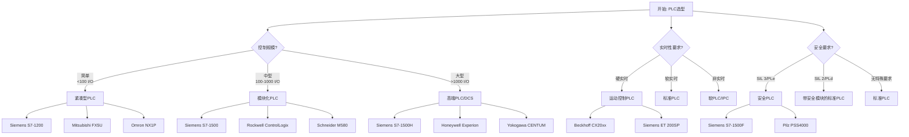
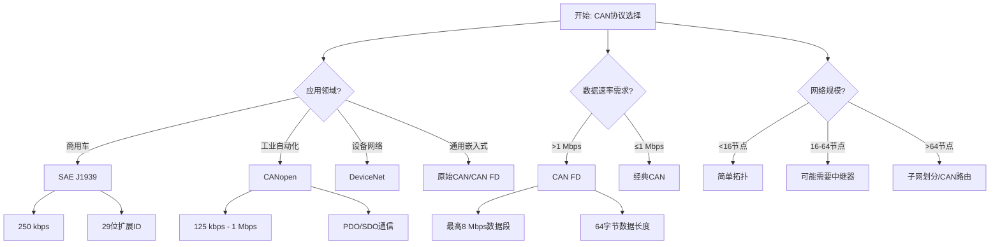
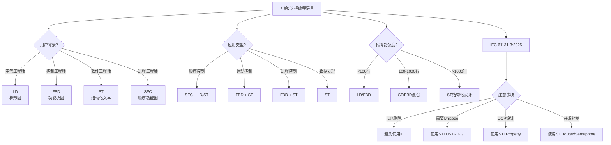

# 工业自动化Schema决策树图

**版本**: v1.0
**创建日期**: 2026-02-15
**适用范围**: 工业自动化Schema设计和选型

---

## 📑 目录

- [工业自动化Schema决策树图](#工业自动化schema决策树图)
  - [📑 目录](#-目录)
  - [1. PLC选型决策树](#1-plc选型决策树)
    - [1.1 系统复杂度决策树](#11-系统复杂度决策树)
    - [1.2 品牌/厂商决策矩阵](#12-品牌厂商决策矩阵)
  - [2. CAN协议选择决策树](#2-can协议选择决策树)
    - [2.1 CAN协议选型决策](#21-can协议选型决策)
    - [2.2 DBC文件设计决策](#22-dbc文件设计决策)
  - [3. 通信协议选择决策树](#3-通信协议选择决策树)
  - [4. 编程语言选择决策树](#4-编程语言选择决策树)
    - [4.1 IEC 61131-3语言选择](#41-iec-61131-3语言选择)
    - [4.2 语言组合策略](#42-语言组合策略)
  - [5. 安全等级选择决策树](#5-安全等级选择决策树)
  - [6. Mermaid可视化](#6-mermaid可视化)
    - [6.1 PLC选型决策流程图](#61-plc选型决策流程图)
    - [6.2 CAN协议选择流程图](#62-can协议选择流程图)
    - [6.3 编程语言选择流程图](#63-编程语言选择流程图)

---

## 1. PLC选型决策树

### 1.1 系统复杂度决策树

```text
开始: 确定PLC需求
│
├─ 控制规模?
│   ├─ 简单 (<100 I/O点)
│   │   └─ 紧凑型PLC
│   │       ├─ Siemens S7-1200
│   │       ├─ Mitsubishi FX5U
│   │       └─ Omron NX1P
│   │
│   ├─ 中型 (100-1000 I/O点)
│   │   └─ 模块化PLC
│   │       ├─ Siemens S7-1500
│   │       ├─ Rockwell ControlLogix
│   │       └─ Schneider M580
│   │
│   └─ 大型 (>1000 I/O点)
│       └─ 高端PLC/DCS
│           ├─ Siemens S7-1500H (冗余)
│           ├─ Honeywell Experion
│           └─ Yokogawa CENTUM
│
├─ 实时性要求?
│   ├─ 硬实时 (<1ms)
│   │   └─ 运动控制PLC
│   │       ├─ Beckhoff CX20xx
│   │       ├─ Siemens ET 200SP
│   │       └─ B&R X20
│   │
│   ├─ 软实时 (1-10ms)
│   │   └─ 标准PLC
│   │
│   └─ 非实时 (>10ms)
│       └─ 软PLC/IPC
│           ├─ CODESYS Runtime
│           └─ TwinCAT
│
├─ 安全要求?
│   ├─ SIL 3/PLe
│   │   └─ 安全PLC
│   │       ├─ Siemens S7-1500F
│   │       ├─ Pilz PSS4000
│   │       └─ Phoenix Contact PSR-TRISAFE
│   │
│   ├─ SIL 2/PLd
│   │   └─ 带安全模块的标准PLC
│   │
│   └─ 无特殊要求
│       └─ 标准PLC
│
└─ 网络要求?
    ├─ Profinet
    │   └─ Siemens/Phoenix Contact
    ├─ EtherNet/IP
    │   └─ Rockwell/Omron
    ├─ Modbus TCP
    │   └─ 通用支持
    └─ 专用协议
        └─ 特定厂商
```

### 1.2 品牌/厂商决策矩阵

| 应用场景 | 推荐厂商 | 主要优势 | 注意事项 |
|---------|---------|---------|---------|
| 汽车制造 | Siemens | TIA Portal集成度高 | 成本较高 |
| 过程控制 | Schneider | 模拟量处理强 | 编程习惯差异 |
| 机械设备 | Mitsubishi | 性价比高 | 软件功能有限 |
| 运动控制 | Beckhoff | EtherCAT性能 | 学习曲线陡峭 |
| 北美市场 | Rockwell | 本地支持好 | 封闭性强 |

---

## 2. CAN协议选择决策树

### 2.1 CAN协议选型决策

```text
开始: 确定CAN应用需求
│
├─ 应用领域?
│   ├─ 商用车/重型机械
│   │   └─ SAE J1939
│   │       ├─ 标准: SAE J1939-21/71/81
│   │       ├─ 速率: 250 kbps
│   │       └─ 特性: 29位扩展ID，广播通信
│   │
│   ├─ 工业自动化
│   │   └─ CANopen
│   │       ├─ 标准: CiA 301/402
│   │       ├─ 速率: 125 kbps - 1 Mbps
│   │       └─ 特性: PDO/SDO，对象字典
│   │
│   ├─ 设备网络
│   │   └─ DeviceNet
│   │       ├─ 标准: IEC 62026-3
│   │       ├─ 速率: 125/250/500 kbps
│   │       └─ 特性: CIP协议，主从架构
│   │
│   └─ 通用嵌入式
│       └─ 原始CAN/CAN FD
│           ├─ 标准: ISO 11898-1:2024
│           ├─ 速率: 125 kbps - 8 Mbps (CAN FD)
│           └─ 特性: 灵活，需自定义协议
│
├─ 数据速率需求?
│   ├─ >1 Mbps
│   │   └─ CAN FD
│   │       ├─ 数据段: 最高8 Mbps
│   │       ├─ 数据长度: 最高64字节
│   │       └─ 兼容性: 需FD支持设备
│   │
│   └─ ≤1 Mbps
│       └─ 经典CAN
│           ├─ 速率: 最高1 Mbps
│           ├─ 数据长度: 8字节
│           └─ 兼容性: 广泛支持
│
├─ 网络规模?
│   ├─ 小规模 (<16节点)
│   │   └─ 简单拓扑，无需中继
│   ├─ 中规模 (16-64节点)
│   │   └─ 可能需要总线中继器
│   └─ 大规模 (>64节点)
│       └─ 考虑子网划分或CAN路由
│
└─ 物理环境?
    ├─ 恶劣环境
    │   └─ ISO 11898-2 (高速CAN)
    │       ├─ 双绞线屏蔽
    │       └─ 高抗干扰
    └─ 一般环境
        └─ ISO 11898-3 (低速容错CAN)
            └─ 单线故障容错
```

### 2.2 DBC文件设计决策

```text
开始: 设计CAN数据库(DBC)
│
├─ 消息类型?
│   ├─ 周期性消息
│   │   ├─ 设置周期时间(2-1000ms)
│   │   ├─ 考虑总线负载(<50%)
│   │   └─ 定义超时处理
│   └─ 事件触发消息
│       ├─ 定义触发条件
│       └─ 考虑优先级分配
│
├─ 信号设计?
│   ├─ 物理值范围?
│   │   ├─ 小范围(-128~127)
│   │   │   └─ 使用8位有符号
│   │   ├─ 中范围(-32768~32767)
│   │   │   └─ 使用16位有符号
│   │   └─ 大范围/高精度
│   │       └─ 使用32位浮点
│   │
│   ├─ 字节序?
│   │   ├─  Intel格式 (小端)
│   │   │   └─ x86架构常用
│   │   └─  Motorola格式 (大端)
│   │       └─ 汽车/嵌入式常用
│   │
│   └─ 缩放因子?
│       ├─ 整数缩放
│       │   └─ 整数因子(1, 10, 100...)
│       └─ 小数缩放
│           └─ 浮点因子(0.1, 0.01...)
│
└─ 网络管理?
    ├─ 是否需要节点监控?
    │   ├─ 是 → 实现心跳/生命信号
    │   └─ 否 → 简化设计
    └─ 错误处理?
        ├─ 在线诊断
        └─ 错误计数
```

---

## 3. 通信协议选择决策树

```text
开始: 选择工业通信协议
│
├─ 实时性要求?
│   ├─ 硬实时 (cycle time < 1ms)
│   │   └─ EtherCAT
│   │       ├─ 100 Mbps全双工
│   │       ├─ 分布式时钟
│   │       └─ Beckhoff主导
│   │
│   ├─ 软实时 (cycle time 1-10ms)
│   │   ├─ Profinet IRT
│   │   ├─ EtherNet/IP with CIP Sync
│   │   └─ SERCOS III
│   │
│   └─ 非实时
│       └─ 标准以太网协议
│           ├─ Modbus TCP
│           ├─ Profinet RT
│           └─ EtherNet/IP
│
├─ 网络拓扑?
│   ├─ 线性/总线
│   │   └─ Profibus DP
│   │       ├─ 最高12 Mbps
│   │       └─ 西门子生态
│   │
│   ├─ 星型/树型
│   │   └─ 工业以太网
│   │
│   └─ 环网冗余
│       └─ PRP/HSR
│           └─ 高可用性网络
│
├─ 与IT系统集成?
│   ├─ 深度集成
│   │   └─ OPC UA
│   │       ├─ 跨平台互操作
│   │       ├─ 信息模型标准化
│   │       └─ 安全性支持
│   │
│   └─ 独立网络
│       └─ 传统现场总线
│
└─ 成本约束?
    ├─ 低成本
    │   └─ Modbus RTU/TCP
    ├─ 中成本
    │   └─ Profinet/EtherNet/IP
    └─ 高成本可接受
        └─ EtherCAT/SERCOS
```

---

## 4. 编程语言选择决策树

### 4.1 IEC 61131-3语言选择

```text
开始: 选择PLC编程语言
│
├─ 用户背景?
│   ├─ 电气工程师
│   │   └─ LD (梯形图)
│   │       ├─ 直观易懂
│   │       ├─ 适合逻辑控制
│   │       └─ 调试方便
│   │
│   ├─ 控制工程师
│   │   └─ FBD (功能块图)
│   │       ├─ 模块化设计
│   │       ├─ 信号流清晰
│   │       └─ 适合复杂算法
│   │
│   ├─ 软件工程师
│   │   └─ ST (结构化文本)
│   │       ├─ 类Pascal语法
│   │       ├─ 适合复杂逻辑
│   │       ├─ 代码复用性高
│   │       └─ IEC 61131-3:2025推荐
│   │
│   └─ 过程工程师
│       └─ SFC (顺序功能图)
│           ├─ 状态机表达
│           ├─ 适合批处理
│           └─ 流程清晰
│
├─ 应用类型?
│   ├─ 顺序控制
│   │   └─ SFC + LD/ST
│   ├─ 运动控制
│   │   └─ FBD + ST
│   ├─ 过程控制
│   │   └─ FBD + ST
│   └─ 数据处理
│       └─ ST (首选)
│
├─ 代码复杂度?
│   ├─ 简单 (<100行)
│   │   └─ LD/FBD
│   ├─ 中等 (100-1000行)
│   │   └─ ST/FBD混合
│   └─ 复杂 (>1000行)
│       └─ ST (结构化设计)
│
└─ IEC 61131-3:2025注意事项
    ├─ IL语言已删除 → 避免使用
    ├─ USTRING支持 → 需要Unicode时用ST
    ├─ Property支持 → OOP设计时用ST
    └─ Mutex/Semaphore → 并发控制时用ST
```

### 4.2 语言组合策略

| 应用场景 | 主语言 | 辅助语言 | 理由 |
|---------|-------|---------|------|
| 设备控制 | LD | ST | 逻辑清晰+数据处理 |
| 运动控制 | FBD | ST | 模块化+算法实现 |
| 批处理 | SFC | ST | 流程控制+配方管理 |
| 通信接口 | ST | - | 复杂协议处理 |
| 安全功能 | FBD | LD | 易于验证和认证 |

---

## 5. 安全等级选择决策树

```text
开始: 确定安全完整性等级
│
├─ 风险评估?
│   ├─ 伤害严重程度?
│   │   ├─ 轻微 (S1)
│   │   ├─ 严重 (S2)
│   │   └─ 致命 (S3)
│   │
│   ├─ 暴露频率?
│   │   ├─ 低 (F1)
│   │   └─ 高 (F2)
│   │
│   └─ 避免可能性?
│       ├─ 可能 (P1)
│       └─ 不可能 (P2)
│
├─ 确定PL/SIL等级
│   ├─ ISO 13849 (PL)
│   │   ├─ PL a: 低贡献风险降低
│   │   ├─ PL b: 单故障安全
│   │   ├─ PL c: 单故障检测
│   │   ├─ PL d: 高完整性
│   │   └─ PL e: 最高完整性
│   │
│   └─ IEC 62061/61508 (SIL)
│       ├─ SIL 1: 10⁻⁵ - 10⁻⁶ 失效概率
│       ├─ SIL 2: 10⁻⁶ - 10⁻⁷ 失效概率
│       ├─ SIL 3: 10⁻⁷ - 10⁻⁸ 失效概率
│       └─ SIL 4: 10⁻⁸ - 10⁻⁹ 失效概率
│
├─ 架构选择?
│   ├─ Category B: 单通道
│   ├─ Category 1: 单通道+测试
│   ├─ Category 2: 单通道+监控
│   ├─ Category 3: 双通道+单故障检测
│   └─ Category 4: 双通道+全故障检测
│
└─ 验证要求?
    ├─ PL a/b: 基本验证
    ├─ PL c/d: 详细验证+计算
    └─ PL e/SIL 3: 全面验证+第三方认证
```

---

## 6. Mermaid可视化

### 6.1 PLC选型决策流程图



### 6.2 CAN协议选择流程图



### 6.3 编程语言选择流程图



---

**参考文档**:

- `README.md` - 主题概览
- `PLC_Schema/03_Standards.md` - PLC标准详细说明
- `CAN_Schema/03_Standards.md` - CAN标准详细说明
- `../UNIFIED_GLOSSARY.md` - 统一术语表

**维护者**: DSL Schema研究团队
**更新周期**: 随标准更新同步修订
