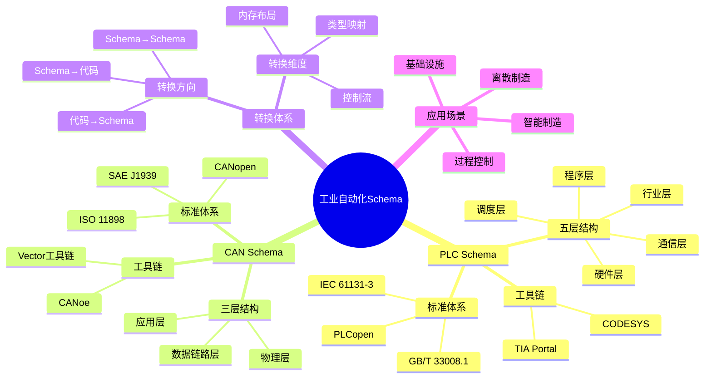

# 工业自动化Schema思维导图

## 📑 目录

- [工业自动化Schema思维导图](#工业自动化schema思维导图)
  - [📑 目录](#-目录)
  - [1. 思维导图概述](#1-思维导图概述)
    - [1.1 导图结构](#11-导图结构)
  - [2. 完整思维导图](#2-完整思维导图)
  - [3. PLC Schema分支](#3-plc-schema分支)
    - [3.1 五层结构关系](#31-五层结构关系)
    - [3.2 标准关系](#32-标准关系)
  - [4. CAN Schema分支](#4-can-schema分支)
    - [4.1 三层结构关系](#41-三层结构关系)
    - [4.2 DBC文件结构](#42-dbc文件结构)
  - [5. 转换体系分支](#5-转换体系分支)
    - [5.1 转换流程](#51-转换流程)
    - [5.2 转换维度关系](#52-转换维度关系)
  - [6. 应用场景分支](#6-应用场景分支)
    - [6.1 行业应用关系](#61-行业应用关系)
  - [7. Mermaid可视化](#7-mermaid可视化)
    - [7.1 思维导图Mermaid图](#71-思维导图mermaid图)

---

## 1. 思维导图概述

本文档以思维导图的形式展示工业自动化Schema
的知识体系结构，帮助理解各个主题之间的关系。

### 1.1 导图结构

思维导图分为以下主要分支：

1. **PLC Schema**：可编程逻辑控制器Schema
2. **CAN Schema**：控制器局域网协议Schema
3. **转换体系**：Schema转换和映射
4. **应用场景**：实际应用领域
5. **标准体系**：相关标准组织

---

## 2. 完整思维导图

```text
工业自动化Schema
│
├─ 1. PLC Schema
│   │
│   ├─ 1.1 五层结构
│   │   ├─ 硬件层（Hardware）
│   │   │   ├─ CPU模块
│   │   │   ├─ I/O模块
│   │   │   ├─ 电源模块
│   │   │   └─ 通信模块
│   │   │
│   │   ├─ 程序层（Program）
│   │   │   ├─ Program
│   │   │   ├─ Function Block
│   │   │   ├─ Function
│   │   │   └─ 变量声明
│   │   │
│   │   ├─ 调度层（Task）
│   │   │   ├─ 任务定义
│   │   │   ├─ 优先级
│   │   │   ├─ 执行周期
│   │   │   └─ 触发条件
│   │   │
│   │   ├─ 通信层（Communication）
│   │   │   ├─ Modbus
│   │   │   ├─ Profibus
│   │   │   ├─ Ethernet/IP
│   │   │   └─ OPC UA
│   │   │
│   │   └─ 行业层（Industry）
│   │       ├─ 标准功能块
│   │       ├─ 自定义功能块
│   │       └─ 行业模型
│   │
│   ├─ 1.2 标准体系
│   │   ├─ IEC 61131-3
│   │   ├─ IEC 61499
│   │   ├─ GB/T 33008.1
│   │   └─ PLCopen
│   │
│   ├─ 1.3 转换维度
│   │   ├─ 类型映射
│   │   ├─ 内存布局
│   │   ├─ 控制流
│   │   ├─ 错误模型
│   │   ├─ 并发原语
│   │   ├─ 二进制编码
│   │   └─ 安全边界
│   │
│   └─ 1.4 工具链
│       ├─ CODESYS
│       ├─ TIA Portal
│       ├─ Unity Pro
│       └─ GX Works
│
├─ 2. CAN Schema
│   │
│   ├─ 2.1 三层结构
│   │   ├─ 物理层（Physical）
│   │   │   ├─ ISO 11898-2/3
│   │   │   ├─ 电气特性
│   │   │   ├─ 波特率
│   │   │   └─ 终端电阻
│   │   │
│   │   ├─ 数据链路层（DataLink）
│   │   │   ├─ ISO 11898-1
│   │   │   ├─ 帧结构
│   │   │   ├─ 仲裁机制
│   │   │   ├─ 错误检测
│   │   │   └─ MAC子层
│   │   │
│   │   └─ 应用层（Application）
│   │       ├─ SAE J1939
│   │       ├─ CANopen
│   │       ├─ DeviceNet
│   │       └─ DBC文件
│   │
│   ├─ 2.2 标准体系
│   │   ├─ ISO 11898系列
│   │   ├─ SAE J1939
│   │   ├─ CANopen
│   │   └─ DeviceNet
│   │
│   └─ 2.3 工具链
│       ├─ CANoe
│       ├─ CANalyzer
│       ├─ Vector工具链
│       └─ DBC编辑器
│
├─ 3. 转换体系
│   │
│   ├─ 3.1 转换方向
│   │   ├─ Schema → 代码
│   │   ├─ 代码 → Schema
│   │   └─ Schema → Schema
│   │
│   ├─ 3.2 转换维度
│   │   ├─ 类型映射
│   │   ├─ 内存布局
│   │   ├─ 控制流
│   │   ├─ 错误模型
│   │   ├─ 并发原语
│   │   ├─ 二进制编码
│   │   └─ 安全边界
│   │
│   └─ 3.3 转换工具
│       ├─ 代码生成器
│       ├─ Schema解析器
│       └─ 转换引擎
│
├─ 4. 应用场景
│   │
│   ├─ 4.1 智能制造
│   │   ├─ 工业4.0
│   │   ├─ 智能工厂
│   │   └─ 数字化生产
│   │
│   ├─ 4.2 过程控制
│   │   ├─ 化工行业
│   │   ├─ 石油行业
│   │   └─ 电力行业
│   │
│   ├─ 4.3 离散制造
│   │   ├─ 汽车制造
│   │   ├─ 电子制造
│   │   └─ 机械制造
│   │
│   └─ 4.4 基础设施
│       ├─ 交通系统
│       ├─ 能源系统
│       └─ 建筑系统
│
└─ 5. 理论基础
    │
    ├─ 5.1 形式化方法
    │   ├─ 数学形式化定义
    │   ├─ 形式化证明
    │   └─ 形式化验证
    │
    ├─ 5.2 信息论
    │   ├─ 信息熵
    │   ├─ 互信息
    │   └─ 信道容量
    │
    ├─ 5.3 形式语言理论
    │   ├─ 语法分析
    │   ├─ 语义分析
    │   └─ 转换理论
    │
    └─ 5.4 类型理论
        ├─ 类型系统
        ├─ 类型安全
        └─ 类型转换

├─ 6. 国际标准体系
    │
    ├─ 6.1 ISO/IEC标准
    │   ├─ ISO/IEC 19510 (BPMN)
    │   ├─ ISO/IEC 24744 (元模型)
    │   ├─ ISO/IEC 23247 (数字孪生)
    │   └─ ISO/IEC 21838 (顶层本体)
    │
    ├─ 6.2 IEC标准
    │   ├─ IEC 61131-3 (PLC编程)
    │   ├─ IEC 61499 (功能块)
    │   ├─ IEC 61850 (变电站)
    │   └─ IEC 63278 (数字孪生)
    │
    ├─ 6.3 IEEE标准
    │   ├─ IEEE 802.11 (WiFi)
    │   └─ IEEE 1451 (智能传感器)
    │
    ├─ 6.4 OMG标准
    │   ├─ UML (统一建模语言)
    │   ├─ MOF (元对象设施)
    │   ├─ QVT (查询/视图/转换)
    │   └─ SysML (系统建模语言)
    │
    └─ 6.5 W3C标准
        ├─ RDF (资源描述框架)
        ├─ OWL (Web本体语言)
        └─ JSON-LD (链接数据)

├─ 7. 行业标准体系
    │
    ├─ 7.1 工业自动化
    │   ├─ SAE J1939 (商用车)
    │   ├─ CANopen (CAN应用层)
    │   ├─ DeviceNet (设备网络)
    │   └─ OPC UA (统一架构)
    │
    ├─ 7.2 物联网
    │   ├─ MQTT (消息队列)
    │   ├─ CoAP (受限应用协议)
    │   ├─ W3C WoT (物联Web)
    │   └─ LoRaWAN (低功耗广域网)
    │
    └─ 7.3 软件工程
        ├─ OpenAPI (RESTful API)
        ├─ AsyncAPI (异步API)
        └─ GraphQL (查询语言)

├─ 8. 开源规范与框架
    │
    ├─ 8.1 Eclipse基金会
    │   ├─ EMF (建模框架)
    │   ├─ ATL (转换语言)
    │   └─ Epsilon (模型管理)
    │
    ├─ 8.2 Apache基金会
    │   ├─ Thrift (RPC框架)
    │   └─ Avro (数据序列化)
    │
    └─ 8.3 其他开源
        ├─ Modelica (物理建模)
        └─ Protocol Buffers (数据序列化)

└─ 9. 跨领域转换
    │
    ├─ 9.1 模型驱动工程 (MDE)
    │   ├─ MDA (模型驱动架构)
    │   ├─ 元建模
    │   └─ 模型转换
    │
    ├─ 9.2 领域特定语言 (DSL)
    │   ├─ 外部DSL
    │   ├─ 内部DSL
    │   └─ DSL转换
    │
    └─ 9.3 知识图谱
        ├─ RDF/OWL
        ├─ 本体映射
        └─ 语义转换

├─ 10. IT技术标准体系
    │
    ├─ 10.1 信息安全标准
    │   ├─ ISO/IEC 27001 (信息安全管理)
    │   ├─ ISO/IEC 27002 (安全控制措施)
    │   ├─ ISO/IEC 27017 (云安全)
    │   └─ ISO/IEC 27018 (隐私保护)
    │
    ├─ 10.2 IT服务管理标准
    │   ├─ ISO/IEC 20000 (IT服务管理)
    │   └─ ITIL 4 (IT服务最佳实践)
    │
    ├─ 10.3 软件工程标准
    │   ├─ ISO/IEC 12207 (软件生命周期)
    │   ├─ ISO/IEC 25010 (软件质量模型)
    │   ├─ ISO/IEC 29119 (软件测试)
    │   └─ ISO/IEC 15504 (过程评估)
    │
    └─ 10.4 数据管理标准
        ├─ ISO/IEC 38500 (IT治理)
        ├─ ISO/IEC 17788 (云计算概述)
        └─ ISO/IEC 17789 (云计算架构)

├─ 11. 行业标准体系
    │
    ├─ 11.1 汽车行业标准
    │   ├─ ISO 26262 (功能安全)
    │   ├─ ISO 21448 (SOTIF)
    │   └─ ISO 14229 (UDS诊断)
    │
    ├─ 11.2 医疗行业标准
    │   ├─ IEC 62304 (医疗软件)
    │   ├─ IEC 62366 (可用性工程)
    │   └─ ISO 13485 (质量管理)
    │
    ├─ 11.3 金融行业标准
    │   ├─ ISO 20022 (金融消息)
    │   ├─ ISO 8583 (金融交易)
    │   └─ PCI DSS (支付卡安全)
    │
    ├─ 11.4 能源行业标准
    │   ├─ IEC 61850 (变电站通信)
    │   ├─ IEC 61970 (CIM模型)
    │   └─ IEC 61968 (配电管理)
    │
    └─ 11.5 工业安全标准
        ├─ IEC 62443 (工业安全)
        ├─ IEC 61508 (功能安全)
        └─ ISO 13849 (机械安全)

├─ 12. 中国国家标准体系
    │
    ├─ 12.1 IT服务标准
    │   ├─ ITSS 5.0 (信息技术服务标准)
    │   └─ SJ/T11623-2016 (从业人员能力规范)
    │
    ├─ 12.2 智能制造标准
    │   ├─ CMMM (智能制造能力成熟度模型)
    │   ├─ 国家智能制造标准体系
    │   └─ 工业软件标准化路线图
    │
    ├─ 12.3 软件工程标准
    │   └─ GJB 5000B (军用软件能力成熟度模型)
    │
    └─ 12.4 金融标准
        └─ IMIX (银行间市场业务数据交换协议)

├─ 13. 电信行业标准体系
    │
    └─ 13.1 电信运营标准
        └─ eTOM (增强型电信运营图谱)

├─ 14. 知识表示标准体系
    │
    └─ 14.1 知识表示标准
        └─ Topic Maps (ISO/IEC 13250)
```

---

## 3. PLC Schema分支

### 3.1 五层结构关系

```text
硬件层
    ↓ (硬件配置)
程序层
    ↓ (程序组织)
调度层
    ↓ (任务调度)
通信层
    ↓ (数据交换)
行业层
    ↓ (功能实现)
应用系统
```

### 3.2 标准关系

```text
IEC 61131-3（国际标准）
    ↓
GB/T 33008.1（国家标准）
    ↓
PLCopen XML（行业标准）
    ↓
厂商实现（厂商标准）
```

---

## 4. CAN Schema分支

### 4.1 三层结构关系

```text
物理层（统一标准）
    ↓
数据链路层（统一标准）
    ↓
应用层（行业分化）
    ├─ SAE J1939（商用车）
    ├─ CANopen（工业自动化）
    └─ DeviceNet（设备网络）
```

### 4.2 DBC文件结构

```text
DBC文件
├─ 版本信息
├─ 节点定义（Nodes）
├─ 消息定义（Messages）
│   ├─ 消息ID
│   ├─ 消息名称
│   ├─ 数据长度
│   └─ 发送节点
└─ 信号定义（Signals）
    ├─ 信号名称
    ├─ 起始位
    ├─ 长度
    ├─ 字节序
    ├─ 数据类型
    └─ 缩放因子
```

---

## 5. 转换体系分支

### 5.1 转换流程

```text
源Schema
    ↓ (解析)
中间表示（IR）
    ↓ (转换)
目标Schema
    ↓ (生成)
目标代码/Schema
```

### 5.2 转换维度关系

```text
类型映射
    ↓
内存布局
    ↓
控制流
    ↓
错误模型
    ↓
并发原语
    ↓
二进制编码
    ↓
安全边界
```

---

## 6. 应用场景分支

### 6.1 行业应用关系

```text
工业自动化Schema
    ├─ 智能制造
    │   └─ 工业4.0
    ├─ 过程控制
    │   ├─ 化工
    │   ├─ 石油
    │   └─ 电力
    ├─ 离散制造
    │   ├─ 汽车
    │   ├─ 电子
    │   └─ 机械
    └─ 基础设施
        ├─ 交通
        ├─ 能源
        └─ 建筑
```

---

## 7. Mermaid可视化

### 7.1 思维导图Mermaid图



---

**参考文档**：

- `../PLC_Schema/01_Overview.md` - PLC Schema概述
- `../CAN_Schema/01_Overview.md` - CAN Schema概述
- `Knowledge_Matrix.md` - 多维知识矩阵
- `Formal_Proofs.md` - 形式化证明

**创建时间**：2025-01-21
**最后更新**：2025-01-21
