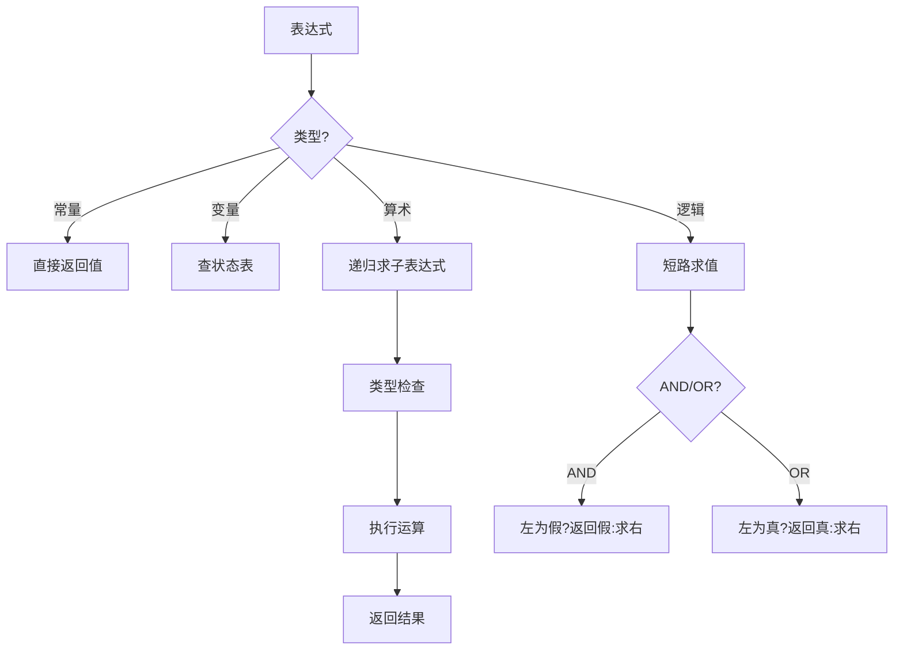
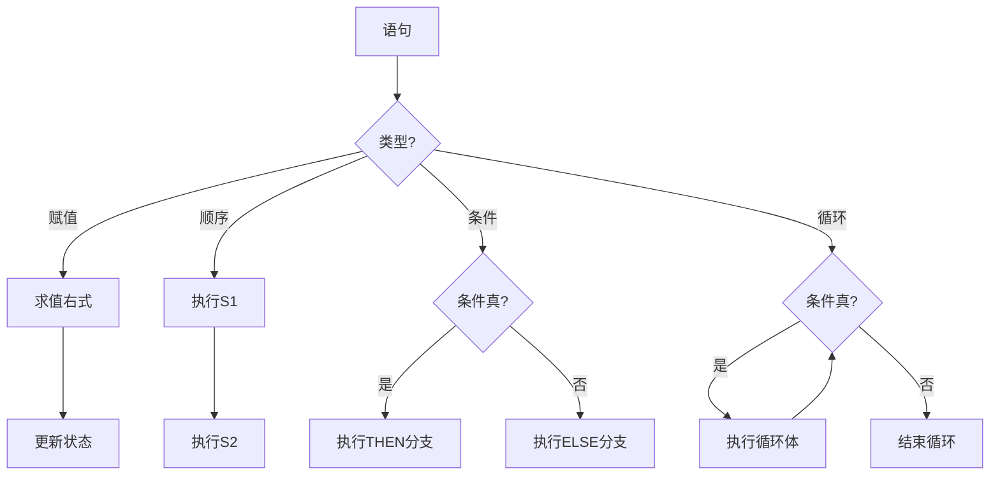
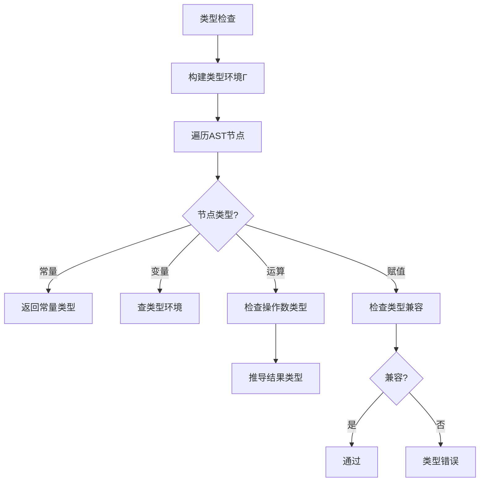

# PLC Schema形式语法与语义分析视图

**版本**: v1.0
**创建日期**: 2026-02-15
**标准**: IEC 61131-3:2025 Edition 4.0

---

## 📑 目录

- [PLC Schema形式语法与语义分析视图](#plc-schema形式语法与语义分析视图)
  - [📑 目录](#-目录)
  - [1. 形式文法定义](#1-形式文法定义)
    - [1.1 EBNF文法](#11-ebnf文法)
      - [1.1.1 程序结构文法](#111-程序结构文法)
      - [1.1.2 功能块文法](#112-功能块文法)
    - [1.2 语法规则](#12-语法规则)
      - [1.2.1 优先级与结合性](#121-优先级与结合性)
      - [1.2.2 上下文相关约束](#122-上下文相关约束)
  - [2. 形式语义定义](#2-形式语义定义)
    - [2.1 指称语义 (Denotational Semantics)](#21-指称语义-denotational-semantics)
      - [2.1.1 语义域定义](#211-语义域定义)
      - [2.1.2 表达式语义](#212-表达式语义)
      - [2.1.3 语句语义](#213-语句语义)
    - [2.2 操作语义 (Operational Semantics)](#22-操作语义-operational-semantics)
      - [2.2.1 大步语义 (Big-Step Semantics)](#221-大步语义-big-step-semantics)
      - [2.2.2 小步语义 (Small-Step Semantics)](#222-小步语义-small-step-semantics)
    - [2.3 公理语义 (Axiomatic Semantics)](#23-公理语义-axiomatic-semantics)
      - [2.3.1 Hoare三元组](#231-hoare三元组)
      - [2.3.2 推理规则](#232-推理规则)
      - [2.3.3 示例：循环不变式证明](#233-示例循环不变式证明)
  - [3. 类型系统](#3-类型系统)
    - [3.1 类型规则](#31-类型规则)
    - [3.2 子类型关系](#32-子类型关系)
  - [4. 语义等价性](#4-语义等价性)
    - [4.1 程序等价定义](#41-程序等价定义)
    - [4.2 等价变换规则](#42-等价变换规则)
  - [5. Mermaid可视化](#5-mermaid可视化)
    - [5.1 表达式求值流程](#51-表达式求值流程)
    - [5.2 语句执行流程](#52-语句执行流程)
    - [5.3 类型检查流程](#53-类型检查流程)

---

## 1. 形式文法定义

### 1.1 EBNF文法

#### 1.1.1 程序结构文法

```ebnf
(* IEC 61131-3:2025 核心文法 - 结构化文本(ST)子集 *)

Program ::= 'PROGRAM' Identifier
            [ProgramInterface]
            ProgramBody
            'END_PROGRAM'

ProgramInterface ::= VariableDeclaration*

ProgramBody ::= StatementList

VariableDeclaration ::=
    'VAR' [VariableQualifier] VariableSpec* 'END_VAR'
  | 'VAR_INPUT' [VariableQualifier] VariableSpec* 'END_VAR'
  | 'VAR_OUTPUT' [VariableQualifier] VariableSpec* 'END_VAR'
  | 'VAR_IN_OUT' VariableSpec* 'END_VAR'
  | 'VAR_GLOBAL' VariableSpec* 'END_VAR'
  | 'VAR_TEMP' VariableSpec* 'END_VAR'
  | 'VAR_STAT' VariableSpec* 'END_VAR'
  | 'VAR_EXTERNAL' VariableSpec* 'END_VAR'

VariableQualifier ::= 'RETAIN' | 'NON_RETAIN' | 'CONSTANT'

VariableSpec ::= IdentifierList ':' DataType [':=' InitialValue]

IdentifierList ::= Identifier {',' Identifier}

DataType ::=
    ElementaryType
  | DerivedType
  | ReferenceType

ElementaryType ::=
    'BOOL'
  | IntegerType
  | RealType
  | StringType
  | TimeType

IntegerType ::=
    'SINT' | 'INT' | 'DINT' | 'LINT'    (* 有符号 *)
  | 'USINT' | 'UINT' | 'UDINT' | 'ULINT'  (* 无符号 *)

RealType ::= 'REAL' | 'LREAL'

StringType ::=
    'STRING' ['[' Integer ']']
  | 'WSTRING' ['[' Integer ']']
  | 'USTRING' ['[' Integer ']']    (* 2025新增 *)

TimeType ::= 'TIME' | 'DATE' | 'TIME_OF_DAY' | 'DATE_AND_TIME'

DerivedType ::=
    EnumeratedType
  | SubrangeType
  | ArrayType
  | StructureType
  | FunctionBlockType

StatementList ::= Statement {';' Statement}

Statement ::=
    Assignment
  | FunctionCall
  | IfStatement
  | CaseStatement
  | ForStatement
  | WhileStatement
  | RepeatStatement
  | ExitStatement
  | ReturnStatement
  | EmptyStatement

Assignment ::= Variable ':=' Expression

IfStatement ::=
    'IF' Expression 'THEN' StatementList
    {'ELSIF' Expression 'THEN' StatementList}
    ['ELSE' StatementList]
    'END_IF'

CaseStatement ::=
    'CASE' Expression 'OF'
    CaseElement {';' CaseElement}
    ['ELSE' StatementList]
    'END_CASE'

CaseElement ::= CaseList ':' StatementList

CaseList ::= CaseCondition {',' CaseCondition}

CaseCondition ::= Integer | IntegerRange | EnumeratedValue

ForStatement ::=
    'FOR' Identifier ':=' Expression 'TO' Expression ['BY' Expression] 'DO'
    StatementList
    'END_FOR'

WhileStatement ::=
    'WHILE' Expression 'DO'
    StatementList
    'END_WHILE'

RepeatStatement ::=
    'REPEAT'
    StatementList
    'UNTIL' Expression
    'END_REPEAT'

Expression ::=
    XORExpression
  | Expression 'OR' XORExpression

XORExpression ::=
    ANDExpression
  | XORExpression 'XOR' ANDExpression

ANDExpression ::=
    CompareExpression
  | ANDExpression '&' CompareExpression
  | ANDExpression 'AND' CompareExpression

CompareExpression ::=
    AddExpression
  | AddExpression CompareOp AddExpression

CompareOp ::= '=' | '<>' | '<' | '>' | '<=' | '>='

AddExpression ::=
    MulExpression
  | AddExpression '+' MulExpression
  | AddExpression '-' MulExpression

MulExpression ::=
    PowerExpression
  | MulExpression '*' PowerExpression
  | MulExpression '/' PowerExpression
  | MulExpression 'MOD' PowerExpression

PowerExpression ::=
    UnaryExpression
  | PowerExpression '**' UnaryExpression

UnaryExpression ::=
    Primary
  | '+' UnaryExpression
  | '-' UnaryExpression
  | 'NOT' UnaryExpression

Primary ::=
    Variable
  | Literal
  | FunctionCall
  | '(' Expression ')'

Variable ::=
    Identifier
  | Variable '.' Identifier
  | Variable '[' ExpressionList ']'
  | Variable '^'  (* 指针解引用 *)

ExpressionList ::= Expression {',' Expression}

Literal ::=
    IntegerLiteral
  | RealLiteral
  | BooleanLiteral
  | StringLiteral
  | TimeLiteral

BooleanLiteral ::= 'TRUE' | 'FALSE'
```

#### 1.1.2 功能块文法

```ebnf
FunctionBlockDeclaration ::=
    'FUNCTION_BLOCK' Identifier
    [FBInterface]
    FBBody
    'END_FUNCTION_BLOCK'

FBInterface ::=
    [VariableDeclaration*]
    [MethodDeclaration*]
    [PropertyDeclaration*]    (* 2025新增 *)

MethodDeclaration ::=
    'METHOD' [AccessSpecifier] Identifier
    [MethodInterface]
    MethodBody
    'END_METHOD'

AccessSpecifier ::= 'PUBLIC' | 'PRIVATE' | 'PROTECTED' | 'INTERNAL'

PropertyDeclaration ::=    (* 2025新增 *)
    'PROPERTY' [AccessSpecifier] Identifier ':' DataType
    ['GET' [PropertyBody]]
    ['SET' [PropertyBody]]
    'END_PROPERTY'

FBBody ::= StatementList
```

### 1.2 语法规则

#### 1.2.1 优先级与结合性

| 优先级 | 运算符 | 结合性 | 描述 |
|-------|-------|-------|------|
| 1 (最高) | `()` `[]` `.` | 左结合 | 分组、索引、访问 |
| 2 | `**` | 右结合 | 幂运算 |
| 3 | `+` `-` `NOT` | 右结合 | 一元运算 |
| 4 | `*` `/` `MOD` | 左结合 | 乘除模 |
| 5 | `+` `-` | 左结合 | 加减 |
| 6 | `<` `>` `<=` `>=` | 左结合 | 关系运算 |
| 7 | `=` `<>` | 左结合 | 相等判断 |
| 8 | `&` `AND` | 左结合 | 逻辑与 |
| 9 | `XOR` | 左结合 | 逻辑异或 |
| 10 (最低) | `OR` | 左结合 | 逻辑或 |

#### 1.2.2 上下文相关约束

```
约束1: 变量声明必须在引用之前
  ∀v ∈ VariableReference : declared_before(v, reference_point(v))

约束2: 类型兼容性
  ∀a ∈ Assignment : compatible(type(a.lhs), type(a.rhs))

约束3: 数组索引有效性
  ∀i ∈ ArrayIndex : 0 ≤ i.value < array_length(i.array)

约束4: 函数参数匹配
  ∀c ∈ FunctionCall :
    length(c.arguments) = length(c.function.parameters) ∧
    ∀i : compatible(type(c.arguments[i]), type(c.function.parameters[i]))

约束5: 明确的控制流
  ∀s ∈ Statement : s ∈ ReachableStatements(ProgramEntry)
```

---

## 2. 形式语义定义

### 2.1 指称语义 (Denotational Semantics)

#### 2.1.1 语义域定义

```
D[Program] : Environment → State → State

State = Variable → Value ∪ {⊥}  (* 部分函数，⊥表示未初始化 *)

Value =
    BooleanValue
  | IntegerValue
  | RealValue
  | StringValue
  | ArrayValue
  | StructureValue

BooleanValue = {true, false}
IntegerValue = ℤ (有界整数)
RealValue = ℝ (IEEE 754浮点)
StringValue = Char*
ArrayValue = ℕ → Value  (* 自然数索引到值 *)
StructureValue = Identifier → Value

Environment = Identifier → Denotable
Denotable =
    VariableLocation
  | FunctionDenotation
  | TypeDenotation
```

#### 2.1.2 表达式语义

```
E[Expression] : Environment → State → Value

(* 常量 *)
E[n] env sto = n                    (* 整数常量 *)
E[r] env sto = r                    (* 实数常量 *)
E[b] env sto = b                    (* 布尔常量 *)

(* 变量引用 *)
E[x] env sto = sto(lookup(env, x))  (* 查找变量值 *)

(* 算术运算 *)
E[e1 + e2] env sto = E[e1] env sto + E[e2] env sto
E[e1 - e2] env sto = E[e1] env sto - E[e2] env sto
E[e1 * e2] env sto = E[e1] env sto × E[e2] env sto
E[e1 / e2] env sto =
    if E[e2] env sto ≠ 0
    then E[e1] env sto ÷ E[e2] env sto
    else error "Division by zero"

(* 关系运算 *)
E[e1 = e2] env sto = (E[e1] env sto = E[e2] env sto)
E[e1 < e2] env sto = (E[e1] env sto < E[e2] env sto)

(* 逻辑运算 *)
E[e1 AND e2] env sto = E[e1] env sto ∧ E[e2] env sto
E[e1 OR e2] env sto = E[e1] env sto ∨ E[e2] env sto
E[NOT e] env sto = ¬(E[e] env sto)
```

#### 2.1.3 语句语义

```
S[Statement] : Environment → State → State

(* 赋值语句 *)
S[x := e] env sto = sto[lookup(env, x) ↦ E[e] env sto]

(* 顺序执行 *)
S[s1 ; s2] env sto = S[s2] env (S[s1] env sto)

(* 条件语句 *)
S[IF e THEN s1 ELSE s2] env sto =
    if E[e] env sto = true
    then S[s1] env sto
    else S[s2] env sto

(* While循环 - 使用不动点 *)
S[WHILE e DO s] env sto = fix(λf.λs.
    if E[e] env s = true
    then f(S[s] env s)
    else s) sto

(* For循环 *)
S[FOR i := e1 TO e2 BY e3 DO s] env sto =
    let init = E[e1] env sto in
    let final = E[e2] env sto in
    let step = E[e3] env sto in
    loop(env, sto, i, init, final, step, s)

loop(env, sto, i, cur, final, step, s) =
    if (step > 0 ∧ cur ≤ final) ∨ (step < 0 ∧ cur ≥ final)
    then loop(env, S[s] env sto', i, cur + step, final, step, s)
    else sto
    where sto' = sto[lookup(env, i) ↦ cur]
```

### 2.2 操作语义 (Operational Semantics)

#### 2.2.1 大步语义 (Big-Step Semantics)

```
配置: ⟨Expression, State⟩ ⇓ Value
      ⟨Statement, State⟩ ⇓ State'

(* 表达式求值 *)
⟨n, σ⟩ ⇓ n                              (E-Const)
⟨x, σ⟩ ⇓ σ(x)                           (E-Var)
⟨e1, σ⟩ ⇓ n1  ⟨e2, σ⟩ ⇓ n2              (E-Add)
─────────────────────────────────
⟨e1 + e2, σ⟩ ⇓ n1 + n2

⟨e, σ⟩ ⇓ n  n > 0                       (E-Pos)
─────────────────────────────────
⟨+e, σ⟩ ⇓ n

⟨e, σ⟩ ⇓ n                              (E-Neg)
─────────────────────────────────
⟨-e, σ⟩ ⇓ -n

(* 语句执行 *)
⟨e, σ⟩ ⇓ v                              (S-Assign)
─────────────────────────────────
⟨x := e, σ⟩ ⇓ σ[x ↦ v]

⟨s1, σ⟩ ⇓ σ'  ⟨s2, σ'⟩ ⇓ σ''            (S-Seq)
─────────────────────────────────
⟨s1 ; s2, σ⟩ ⇓ σ''

⟨e, σ⟩ ⇓ true  ⟨s1, σ⟩ ⇓ σ'             (S-IfTrue)
─────────────────────────────────
⟨IF e THEN s1 ELSE s2, σ⟩ ⇓ σ'

⟨e, σ⟩ ⇓ false  ⟨s2, σ⟩ ⇓ σ'            (S-IfFalse)
─────────────────────────────────
⟨IF e THEN s1 ELSE s2, σ⟩ ⇓ σ'

⟨e, σ⟩ ⇓ false                          (S-WhileFalse)
─────────────────────────────────
⟨WHILE e DO s, σ⟩ ⇓ σ

⟨e, σ⟩ ⇓ true  ⟨s, σ⟩ ⇓ σ'  ⟨WHILE e DO s, σ'⟩ ⇓ σ''  (S-WhileTrue)
────────────────────────────────────────────────────────
⟨WHILE e DO s, σ⟩ ⇓ σ''
```

#### 2.2.2 小步语义 (Small-Step Semantics)

```
配置: ⟨Statement, State⟩ → ⟨Statement', State'⟩
      或 ⟨Statement, State⟩ → State'  (终止)

(* 赋值 *)
⟨x := n, σ⟩ → σ[x ↦ n]                  (S-Assign)

⟨e, σ⟩ → ⟨e', σ⟩                        (S-Assign-Exp)
─────────────────────────────────
⟨x := e, σ⟩ → ⟨x := e', σ⟩

(* 顺序执行 *)
⟨skip ; s, σ⟩ → ⟨s, σ⟩                  (S-Seq-Skip)

⟨s1, σ⟩ → ⟨s1', σ'⟩                     (S-Seq)
─────────────────────────────────
⟨s1 ; s2, σ⟩ → ⟨s1' ; s2, σ'⟩

⟨s1, σ⟩ → σ'                            (S-Seq-Done)
─────────────────────────────────
⟨s1 ; s2, σ⟩ → ⟨s2, σ'⟩

(* 条件 *)
⟨IF true THEN s1 ELSE s2, σ⟩ → ⟨s1, σ⟩  (S-IfTrue)
⟨IF false THEN s1 ELSE s2, σ⟩ → ⟨s2, σ⟩ (S-IfFalse)

⟨e, σ⟩ → ⟨e', σ⟩                        (S-If-Guard)
─────────────────────────────────
⟨IF e THEN s1 ELSE s2, σ⟩ → ⟨IF e' THEN s1 ELSE s2, σ⟩

(* While循环展开 *)
⟨WHILE e DO s, σ⟩ → ⟨IF e THEN (s ; WHILE e DO s) ELSE skip, σ⟩ (S-While)
```

### 2.3 公理语义 (Axiomatic Semantics)

#### 2.3.1 Hoare三元组

```
{P} S {Q}

含义: 如果前置条件P在执行语句S前成立，
      且S终止，
      则后置条件Q在S执行后成立。
```

#### 2.3.2 推理规则

```
(* 赋值公理 *)
{Q[x ↦ e]} x := e {Q}                   (Axiom-Assign)

(* 顺序规则 *)
{P} s1 {R}  {R} s2 {Q}                  (Rule-Seq)
─────────────────────────────────
{P} s1 ; s2 {Q}

(* 条件规则 *)
{P ∧ e} s1 {Q}  {P ∧ ¬e} s2 {Q}         (Rule-If)
─────────────────────────────────
{P} IF e THEN s1 ELSE s2 {Q}

(* While规则 *)
{I ∧ e} s {I}                           (Rule-While)
─────────────────────────────────
{I} WHILE e DO s {I ∧ ¬e}

I称为循环不变式(Loop Invariant)

(* 强化前置条件 *)
P' ⇒ P  {P} s {Q}                       (Rule-Strengthen)
─────────────────────────────────
{P'} s {Q}

(* 弱化后置条件 *)
{P} s {Q}  Q ⇒ Q'                       (Rule-Weaken)
─────────────────────────────────
{P} s {Q'}
```

#### 2.3.3 示例：循环不变式证明

```
求和程序: sum := 0; i := 1;
          WHILE i <= n DO
            sum := sum + i;
            i := i + 1
          END_WHILE

目标: 证明 {n ≥ 0} program {sum = n(n+1)/2}

循环不变式 I: sum = (i-1)i/2 ∧ i ≤ n+1

证明步骤:
1. 初始化: {n ≥ 0}
           sum := 0; i := 1
           {sum = 0 ∧ i = 1} = {sum = (i-1)i/2 ∧ i ≤ n+1}

2. 保持: {sum = (i-1)i/2 ∧ i ≤ n ∧ i ≤ n+1}
         sum := sum + i; i := i + 1
         {sum = (i-1)i/2 ∧ i ≤ n+1}

3. 终止: {sum = (i-1)i/2 ∧ i ≤ n+1 ∧ i > n}
         ⇒ {sum = n(n+1)/2}
```

---

## 3. 类型系统

### 3.1 类型规则

```
(* 常量类型 *)
Γ ⊢ n : INT                              (T-Int)
Γ ⊢ r : REAL                             (T-Real)
Γ ⊢ b : BOOL                             (T-Bool)
Γ ⊢ s : STRING                           (T-String)

(* 变量类型 *)
Γ(x) = τ                                 (T-Var)
───────
Γ ⊢ x : τ

(* 算术运算 *)
Γ ⊢ e1 : INT  Γ ⊢ e2 : INT               (T-AddInt)
─────────────────────────────────
Γ ⊢ e1 + e2 : INT

Γ ⊢ e1 : REAL  Γ ⊢ e2 : REAL             (T-AddReal)
─────────────────────────────────
Γ ⊢ e1 + e2 : REAL

Γ ⊢ e1 : INT  Γ ⊢ e2 : REAL              (T-AddMix)
─────────────────────────────────
Γ ⊢ e1 + e2 : REAL

(* 比较运算 *)
Γ ⊢ e1 : τ  Γ ⊢ e2 : τ  τ ∈ {INT, REAL}  (T-Compare)
─────────────────────────────────
Γ ⊢ e1 = e2 : BOOL

(* 逻辑运算 *)
Γ ⊢ e1 : BOOL  Γ ⊢ e2 : BOOL             (T-Logic)
─────────────────────────────────
Γ ⊢ e1 AND e2 : BOOL

(* 赋值 *)
Γ ⊢ x : τ  Γ ⊢ e : τ'  τ' ≤ τ            (T-Assign)
─────────────────────────────────
Γ ⊢ x := e : Unit
```

### 3.2 子类型关系

```
(* 数值类型层次 *)
REAL
├── LREAL
└── INT
    ├── DINT
    ├── INT
    └── SINT
    └── USINT
        ├── UINT
        └── UDINT
            └── ULINT

子类型规则:
SINT ≤ INT ≤ DINT ≤ LREAL
USINT ≤ UINT ≤ UDINT ≤ ULINT ≤ LREAL
INT ≤ REAL

(* 字符串类型 *)
STRING ≤ WSTRING ≤ USTRING   (2025新增)
```

---

## 4. 语义等价性

### 4.1 程序等价定义

```
定义: 两个程序P1和P2语义等价 (P1 ≡ P2) 当且仅当:
∀σ, σ' : ⟨P1, σ⟩ ⇓ σ' ⟺ ⟨P2, σ⟩ ⇓ σ'
```

### 4.2 等价变换规则

```
(* 循环展开 *)
WHILE e DO s  ≡  IF e THEN (s ; WHILE e DO s) ELSE skip

(* For循环转While *)
FOR i := e1 TO e2 BY e3 DO s
≡
i := e1;
WHILE (i ≤ e2 ∧ e3 > 0) ∨ (i ≥ e2 ∧ e3 < 0) DO
    s;
    i := i + e3
END_WHILE

(* 条件合并 *)
IF e THEN s ELSE s  ≡  s

(* 短路优化 *)
e1 AND e2  ≡  IF e1 THEN e2 ELSE false
e1 OR e2   ≡  IF e1 THEN true ELSE e2
```

---

## 5. Mermaid可视化

### 5.1 表达式求值流程



### 5.2 语句执行流程



### 5.3 类型检查流程



---

**参考文档**:

- `02_Formal_Definition.md` - 形式化定义
- `Formal_Proofs.md` - 形式化证明
- IEC 61131-3:2025 标准文档

**维护者**: DSL Schema研究团队
**标准**: IEC 61131-3:2025 Edition 4.0
