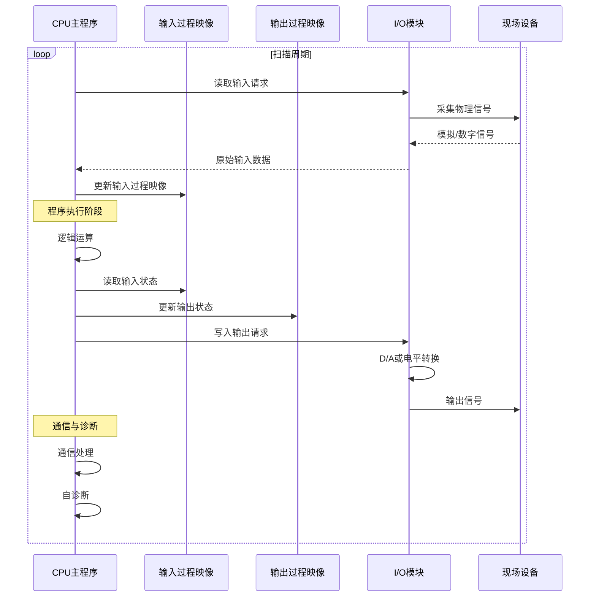
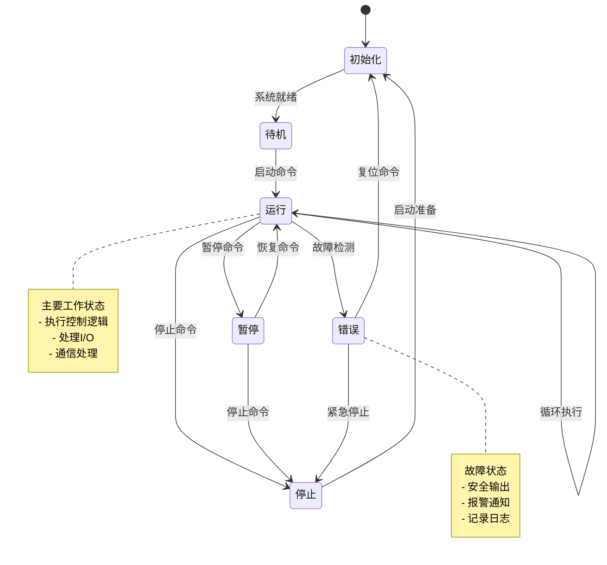
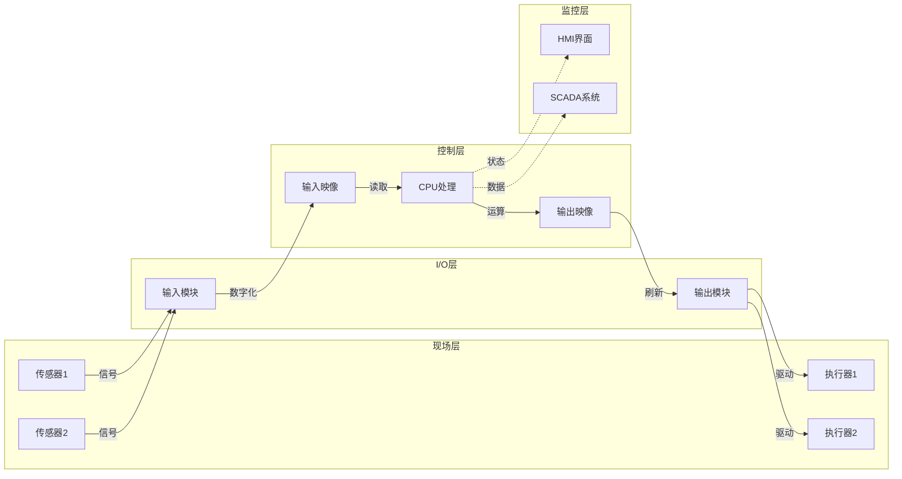
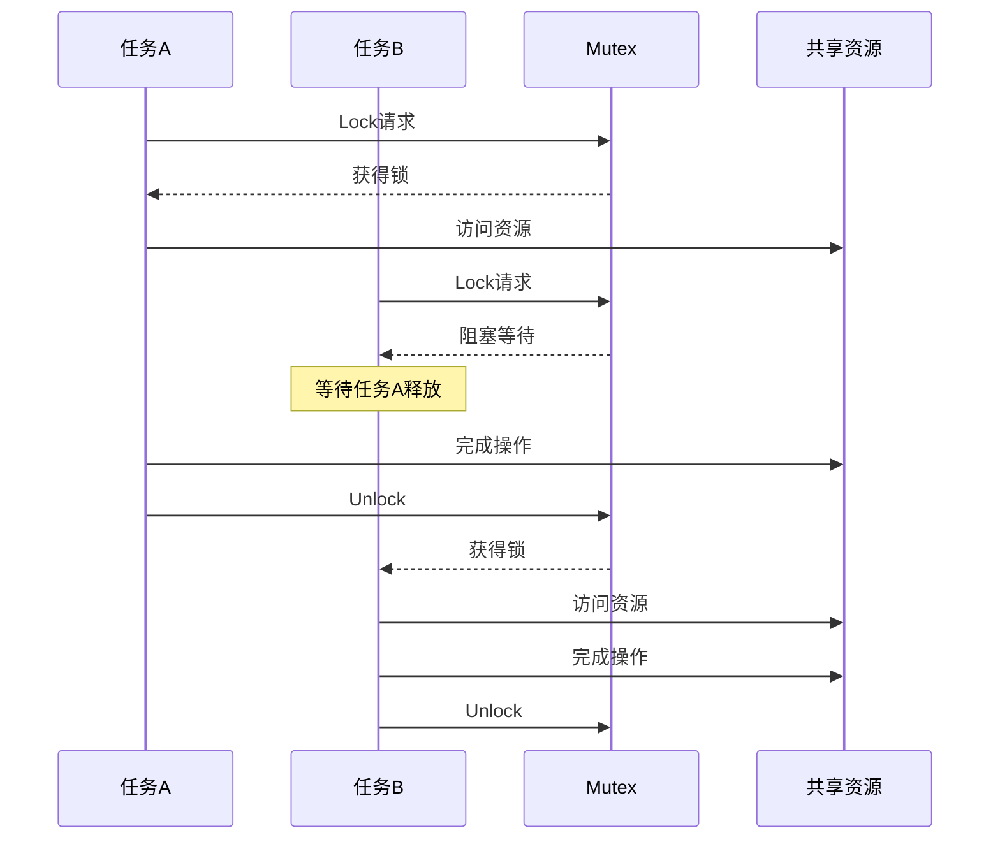

# PLC Schema信息表征动态动作分析视图

**版本**: v1.0
**创建日期**: 2026-02-15
**标准**: IEC 61131-3:2025 Edition 4.0

---

## 📑 目录

- [PLC Schema信息表征动态动作分析视图](#plc-schema信息表征动态动作分析视图)
  - [📑 目录](#-目录)
  - [1. 动态动作分析概述](#1-动态动作分析概述)
  - [2. PLC扫描周期动态分析](#2-plc扫描周期动态分析)
    - [2.1 扫描周期状态机](#21-扫描周期状态机)
    - [2.2 扫描周期时间分析](#22-扫描周期时间分析)
    - [2.3 过程映像动态更新](#23-过程映像动态更新)
  - [3. 状态转换分析](#3-状态转换分析)
    - [3.1 顺序功能图(SFC)状态转换](#31-顺序功能图sfc状态转换)
    - [3.2 状态转换矩阵](#32-状态转换矩阵)
    - [3.3 状态转换时序图](#33-状态转换时序图)
  - [4. 信息流动分析](#4-信息流动分析)
    - [4.1 数据流向图](#41-数据流向图)
    - [4.2 数据包流动分析](#42-数据包流动分析)
    - [4.3 信息熵变化分析](#43-信息熵变化分析)
  - [5. 时序交互分析](#5-时序交互分析)
    - [5.1 任务调度时序](#51-任务调度时序)
    - [5.2 通信时序分析](#52-通信时序分析)
    - [5.3 输入输出响应时间](#53-输入输出响应时间)
  - [6. 并发与同步分析 (2025新增)](#6-并发与同步分析-2025新增)
    - [6.1 任务并行执行模型](#61-任务并行执行模型)
    - [6.2 Mutex与Semaphore动态行为](#62-mutex与semaphore动态行为)
    - [6.3 死锁分析](#63-死锁分析)
  - [7. Mermaid动态视图](#7-mermaid动态视图)
    - [7.1 PLC扫描周期动态流程](#71-plc扫描周期动态流程)
    - [7.2 状态转换动态图](#72-状态转换动态图)
    - [7.3 信息流动动态图](#73-信息流动动态图)
    - [7.4 任务调度动态时序](#74-任务调度动态时序)
    - [7.5 并发同步动态图](#75-并发同步动态图)

---

## 1. 动态动作分析概述

动态动作分析关注系统在运行时的行为特征，包括：

- **状态转换**: 系统在不同状态间的迁移
- **信息流动**: 数据在系统各组件间的传递
- **时序交互**: 事件的时间顺序和因果关系
- **并发行为**: 多任务并行执行的交互

---

## 2. PLC扫描周期动态分析

### 2.1 扫描周期状态机

```
状态: {初始化, 读取输入, 执行程序, 写入输出, 通信处理, 诊断}

转换函数:
δ(初始化) = 读取输入
δ(读取输入) = 执行程序
δ(执行程序) = 写入输出
δ(写入输出) = 通信处理
δ(通信处理) = 诊断
δ(诊断) = 读取输入  (循环，若正常)
δ(诊断) = 停机      (若错误严重)
```

### 2.2 扫描周期时间分析

```
扫描周期 T_cycle = T_input + T_program + T_output + T_comm + T_diag + T_idle

典型值:
- 小型PLC: 1-10 ms
- 中型PLC: 5-50 ms
- 大型PLC: 10-100 ms

时间预算分配:
┌─────────────────────────────────────────────────────────────┐
│ 输入读取 [10%] │ 程序执行 [60%] │ 输出写入 [10%] │ 其他 [20%] │
└─────────────────────────────────────────────────────────────┘
```

### 2.3 过程映像动态更新

```
过程映像区 (Process Image):
├── 输入过程映像 (PII)
│   └── 物理输入 → 读取 → PII → 程序读取
│
└── 输出过程映像 (PIQ)
    └── 程序写入 → PIQ → 写入 → 物理输出

动态更新时序:
t0: 读取物理输入 → 更新PII
t1: 程序基于PII执行

t2: 程序更新PIQ
t3: 将PIQ写入物理输出
```

---

## 3. 状态转换分析

### 3.1 顺序功能图(SFC)状态转换

```
SFC状态转换规则:

当前状态 S，转换条件 T，目标状态 S'
⟨S, T, S'⟩ ⊢ 状态转换

转换触发条件:
1. 当前步处于活动状态: active(S) = true
2. 前一步已完成: completed(predecessor(S)) = true
3. 转换条件满足: eval(T) = true
4. 互斥条件: ¬active(conflict(S'))

状态转换动作:
entry_action(S'): 进入新状态时执行
exit_action(S):   离开旧状态时执行
action(S'):       处于状态时持续执行
```

### 3.2 状态转换矩阵

| 当前状态 | 条件1 | 条件2 | 条件3 | 默认 |
|---------|-------|-------|-------|------|
| **初始** | 启动→运行 | - | - | 保持 |
| **运行** | 暂停→暂停 | 停止→停止 | 错误→错误 | 保持 |
| **暂停** | 恢复→运行 | 停止→停止 | - | 保持 |
| **错误** | 复位→初始 | - | - | 保持 |
| **停止** | 启动→初始 | - | - | 保持 |

### 3.3 状态转换时序图

```
时间 →

状态A:  ████████░░░░░░░░░░████████░░░░
        [活动]  [转换]      [活动]

状态B:  ░░░░░░░░████████░░░░░░░░░░████
                [活动]              [活动]

转换T:  ░░░░░░░░▓▓░░░░░░░░░░░░░░░░▓▓░░
                [触发]              [触发]

条件C:  ══════════════════════╤══════
                              │
                        [条件满足]
```

---

## 4. 信息流动分析

### 4.1 数据流向图

```
传感器层
    │
    ▼ (模拟信号/数字信号)
输入模块
    │
    ▼ (A/D转换/电平转换)
输入过程映像 (PII)
    │
    ▼ (PLC总线/背板)
CPU处理
    │
    ├─→ 程序逻辑运算
    │       │
    │       ▼
    │   内部变量/标志位
    │       │
    │       └────────┐
    │                │
    └─→ 输出计算 ◄───┘
            │
            ▼
    输出过程映像 (PIQ)
            │
            ▼ (D/A转换/电平转换)
    输出模块
            │
            ▼ (模拟信号/数字信号)
    执行器层
```

### 4.2 数据包流动分析

```
通信数据包生命周期:

1. 生成阶段
   ┌─────────────────────────────────────┐
   │ 应用层: 数据封装                     │
   │   - 功能码定义                       │
   │   - 数据区填充                       │
   │   - 校验和计算                       │
   └─────────────────────────────────────┘
                    │
                    ▼
2. 传输阶段
   ┌─────────────────────────────────────┐
   │ 传输层: 协议处理                     │
   │   - 地址解析                         │
   │   - 路由选择                         │
   │   - 流量控制                         │
   └─────────────────────────────────────┘
                    │
                    ▼
3. 接收阶段
   ┌─────────────────────────────────────┐
   │ 应用层: 数据解包                     │
   │   - 校验验证                         │
   │   - 功能码解析                       │
   │   - 数据提取                         │
   └─────────────────────────────────────┘
```

### 4.3 信息熵变化分析

```
信息在PLC系统中的熵变:

传感器信号:    H ≈ 8 bits (原始模拟)
     │
     │ A/D转换 (量化)
     ▼
数字输入:      H ≈ 1 bit (0/1)
     │
     │ 逻辑运算 (信息融合)
     ▼
中间结果:      H 可变 (取决于运算)
     │
     │ 控制决策 (信息压缩)
     ▼
输出信号:      H ≈ 1 bit (开/关)

信息损失点:
1. 模拟→数字转换: 量化误差
2. 逻辑过滤: 忽略部分输入
3. 决策输出: 多输入映射到少输出
```

---

## 5. 时序交互分析

### 5.1 任务调度时序

```
任务类型与优先级:

优先级 │ 任务类型      │ 周期   │ 执行时间 │ 截止时间
───────┼──────────────┼───────┼─────────┼─────────
  1    │ 中断任务      │ 事件   │ <1ms    │ <1ms
  2    │ 安全任务      │ 10ms   │ 2ms     │ 10ms
  3    │ 快速控制      │ 20ms   │ 5ms     │ 20ms
  4    │ 标准控制      │ 100ms  │ 10ms    │ 100ms
  5    │ 监控任务      │ 1000ms │ 50ms    │ 1000ms

调度策略: 抢占式优先级调度

时序示例:
时间(ms): 0    10   20   30   40   50   60   70   80   90   100
          │    │    │    │    │    │    │    │    │    │
安全任务: ██   ██   ██   ██   ██   ██   ██   ██   ██   ██
          │         │         │         │         │
快速控制: ░░████    ░░████    ░░████    ░░████    ░░████
          │                   │                   │
标准控制: ░░░░░░████████        ░░░░░░████████

图例: ██ 高优先级任务, ░░ 低优先级任务被抢占
```

### 5.2 通信时序分析

```
Modbus RTU 通信时序:

主站          从站
  │             │
  │──请求帧──▶│  t0: 发送开始
  │             │
  │             │  t1 = t0 + 3.5字符时间: 帧间隔
  │             │
  │             │  t2 = t1 + 处理时间: 准备响应
  │             │
  │◀──响应帧──│  t3 = t2 + 传输时间: 接收完成
  │             │
  │             │

完整周期时间: T = t3 - t0
            = 传输延迟 + 处理时间 + 传输延迟
            ≈ 2 × (帧长度 / 波特率) + T_processing
```

### 5.3 输入输出响应时间

```
输入到输出的完整响应链:

事件检测              逻辑处理              输出动作
    │                    │                    │
    ▼                    ▼                    ▼
┌─────────┐        ┌─────────┐        ┌─────────┐
│ 物理输入 │        │ 程序扫描 │        │ 物理输出 │
│ 变化检测 │───────▶│ 逻辑判断 │───────▶│ 状态更新 │
└─────────┘        └─────────┘        └─────────┘
    │                    │                    │
    │ 输入滤波            │ 程序执行            │ 输出刷新
    │ (1-10ms)           │ (1-50ms)           │ (1-5ms)
    │                    │                    │

总响应时间: T_response = T_filter + T_scan + T_execution + T_output
                     = 3 - 65 ms (典型值)

优化策略:
- 降低滤波时间 (需权衡噪声)
- 提高扫描频率 (需平衡CPU负载)
- 优化程序逻辑 (减少执行时间)
- 使用立即I/O指令 (绕过过程映像)
```

---

## 6. 并发与同步分析 (2025新增)

### 6.1 任务并行执行模型

```
IEC 61131-3:2025 并发模型:

任务类型:
├── 周期性任务 (Cyclic)
│   └── 固定时间间隔执行
│
├── 事件驱动任务 (Event-driven)
│   └── 特定事件触发
│
└── 中断任务 (Interrupt)
    └── 硬件中断触发

资源共享:
├── 全局变量
│   └── 需要同步保护
│
├── I/O设备
│   └── 需要互斥访问
│
└── 通信端口
    └── 需要序列化访问
```

### 6.2 Mutex与Semaphore动态行为

```
互斥锁(Mutex)状态机:

状态: {未锁定, 锁定(任务A), 锁定(任务B), ...}

操作:
- Lock(m):
    若 state(m) = 未锁定 → state(m) = 锁定(当前任务), 成功
    若 state(m) = 锁定(X)  → 阻塞当前任务, 加入等待队列

- Unlock(m):
    若 state(m) = 锁定(当前任务) →
        若 waiting_queue(m) 非空:
            state(m) = 锁定(队首任务)
            唤醒队首任务
        否则:
            state(m) = 未锁定

信号量(Semaphore)动态:

初始化: count = N (最大并发数)

操作:
- Wait(s):
    若 count > 0 → count--, 继续执行
    若 count = 0 → 阻塞, 加入等待队列

- Signal(s):
    若 waiting_queue(s) 非空 → 唤醒一个等待任务
    否则 → count++
```

### 6.3 死锁分析

```
死锁四条件 (Coffman Conditions):

1. 互斥条件: 资源一次只能被一个任务占用
2. 占有并等待: 任务持有资源同时等待其他资源
3. 不可抢占: 已分配资源不能被强制剥夺
4. 循环等待: 任务间形成循环等待链

PLC中的死锁预防:

策略1: 资源有序分配
   对所有资源编号，任务必须按升序申请

策略2: 超时机制
   设置资源获取超时，超时后释放已持有资源

策略3: 优先级 Ceiling Protocol
   提升持有高优先级资源任务的优先级

死锁检测算法:

资源分配图算法:
- 节点: 任务T, 资源R
- 边: T→R (请求), R→T (分配)
- 检测: 图中存在环 ⟺ 死锁存在
```

---

## 7. Mermaid动态视图

### 7.1 PLC扫描周期动态流程



### 7.2 状态转换动态图



### 7.3 信息流动动态图



### 7.4 任务调度动态时序

```mermaid
gantt
    title PLC任务调度时序图
    dateFormat X
    axisFormat %d ms

    section 中断任务
    紧急处理      :crit, 0, 2

    section 安全任务
    安全检查      :crit, 0, 3
    安全检查      :crit, 10, 13
    安全检查      :crit, 20, 23

    section 快速控制
    控制任务1     :5, 10
    控制任务2     :15, 20
    控制任务3     :25, 30

    section 标准控制
    标准任务      :0, 15
    标准任务      :30, 45

    section 监控任务
    监控任务      :0, 50
```



### 7.5 并发同步动态图



---

**参考文档**:

- `01_Overview.md` - PLC概述
- `02_Formal_Definition.md` - 形式化定义
- `06_Formal_Grammar_Semantics.md` - 形式语法语义
- IEC 61131-3:2025 Edition 4.0

**维护者**: DSL Schema研究团队
