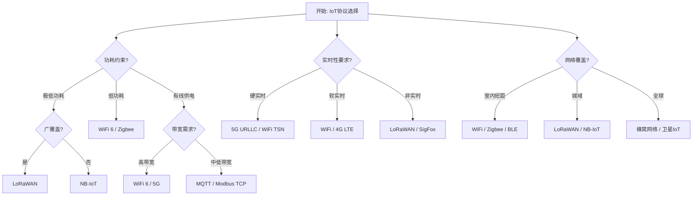
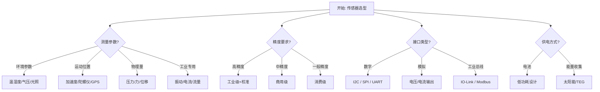
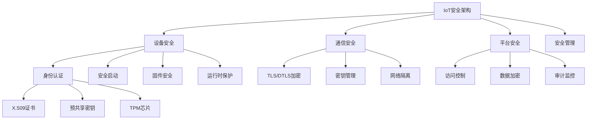

# IoT Schema决策树图

**版本**: v1.0
**创建日期**: 2026-02-15
**适用范围**: IoT Schema设计和协议选型

---

## 📑 目录

- [IoT Schema决策树图](#iot-schema决策树图)
  - [📑 目录](#-目录)
  - [1. IoT通信协议选择决策树](#1-iot通信协议选择决策树)
    - [1.1 主要协议选择决策](#11-主要协议选择决策)
    - [1.2 应用层协议选择](#12-应用层协议选择)
  - [2. 传感器选型决策树](#2-传感器选型决策树)
  - [3. 云平台选择决策树](#3-云平台选择决策树)
  - [4. 物联网安全架构决策树](#4-物联网安全架构决策树)
  - [5. 边缘计算架构决策树](#5-边缘计算架构决策树)
  - [6. Mermaid可视化](#6-mermaid可视化)
    - [6.1 IoT协议选择流程图](#61-iot协议选择流程图)
    - [6.2 传感器选型流程图](#62-传感器选型流程图)
    - [6.3 IoT安全架构流程图](#63-iot安全架构流程图)

---

## 1. IoT通信协议选择决策树

### 1.1 主要协议选择决策

```text
开始: 选择IoT通信协议
│
├─ 功耗约束? (电池寿命)
│   ├─ 极低功耗 (>5年)
│   │   ├─ 广覆盖需求?
│   │   │   ├─ 是 → LoRaWAN
│   │   │   │       ├─ 速率: 0.3-50 kbps
│   │   │   │       ├─ 距离: 2-15 km
│   │   │   │       ├─ 频段: 433/868/915 MHz
│   │   │   │       └─ 适用: 智能表计、农业监测
│   │   │   │
│   │   │   └─ 否 → NB-IoT
│   │   │           ├─ 速率: <100 kbps
│   │   │           ├─ 覆盖: 运营商网络
│   │   │           ├─ 频段: 授权频谱
│   │   │           └─ 适用: 城市监控、资产追踪
│   │   │
│   │   └─ 短距离?
│   │       ├─ 网状网络? → Zigbee/Thread
│   │       │   ├─ Zigbee: 成熟生态，多厂商
│   │       │   └─ Thread: IPv6原生，更安全
│   │       │
│   │       └─ 点对点? → BLE 5.x
│   │           ├─ 速率: 125 kbps - 2 Mbps
│   │           ├─ 距离: 100m-1km (LE Coded)
│   │           └─ 适用: 可穿戴、智能家居
│   │
│   ├─ 低功耗 (1-5年)
│   │   ├─ WiFi 6 (TWT功能)
│   │   ├─ Zigbee 3.0
│   │   └─ BLE 5 Low Power
│   │
│   └─ 有线供电
│       └─ 带宽需求?
│           ├─ 高带宽 (>10 Mbps)
│           │   ├─ WiFi 6/6E
│           │   ├─ 5G/4G LTE
│           │   └─ 以太网
│           │
│           └─ 中低带宽
│               ├─ 工业: Modbus TCP
│               ├─ 楼宇: BACnet IP
│               └─ 通用: MQTT over TCP
│
├─ 实时性要求?
│   ├─ 硬实时 (<10ms)
│   │   ├─ 5G URLLC
│   │   ├─ WiFi 6 (TSN)
│   │   └─ 专用无线
│   │
│   ├─ 软实时 (10-100ms)
│   │   ├─ WiFi
│   │   ├─ 4G LTE
│   │   └─ NB-IoT
│   │
│   └─ 非实时 (>100ms)
│       ├─ LoRaWAN
│       ├─ SigFox
│       └─ 卫星IoT
│
├─ 网络覆盖?
│   ├─ 室内短距 (<100m)
│   │   ├─ WiFi
│   │   ├─ Zigbee
│   │   ├─ BLE
│   │   └─ Thread
│   │
│   ├─ 建筑/园区 (<1km)
│   │   ├─ LoRa
│   │   ├─ WiFi HaLow
│   │   └─ 私有5G
│   │
│   ├─ 城域 (<15km)
│   │   ├─ LoRaWAN
│   │   ├─ NB-IoT
│   │   └─ LTE-M
│   │
│   └─ 广域/全球
│       ├─ 蜂窝网络 (2G/3G/4G/5G)
│       ├─ 卫星IoT (LEO/GEO)
│       └─ SigFox (有限区域)
│
└─ 成本约束?
    ├─ 极低成本 (<$1/模块)
    │   ├─ LoRa (私有协议)
    │   └─ 简单Sub-GHz
    │
    ├─ 低成本 ($1-5/模块)
    │   ├─ LoRaWAN
    │   ├─ NB-IoT (批量)
    │   └─ Zigbee
    │
    ├─ 中成本 ($5-20/模块)
    │   ├─ WiFi
    │   ├─ BLE 5
    │   └─ LTE-M
    │
    └─ 高成本可接受 (>$20/模块)
        ├─ 5G
        ├─ 卫星
        └─ 私有网络
```

### 1.2 应用层协议选择

```text
开始: 选择应用层协议
│
├─ 传输层协议?
│   ├─ TCP可靠传输
│   │   └─ MQTT
│   │       ├─ 发布/订阅模式
│   │       ├─ 轻量级头部
│   │       ├─ 支持QoS 0/1/2
│   │       ├─ 遗嘱消息
│   │       └─ 适用: 大多数IoT场景
│   │
│   └─ UDP低延迟
│       ├─ CoAP
│       │   ├─ RESTful接口
│       │   ├─ 支持观察模式
│       │   ├─ DTLS安全
│       │   └─ 适用: 受限设备
│       │
│       └─ LwM2M
│           ├─ 设备管理标准
│           ├─ 基于CoAP
│           └─ 适用: 蜂窝IoT管理
│
├─ 数据格式?
│   ├─ 文本可读
│   │   ├─ JSON
│   │   │   └─ 通用，易解析
│   │   ├─ XML
│   │   │   └─ 复杂结构，自描述
│   │   └─ CSV
│   │       └─ 简单时序数据
│   │
│   └─ 二进制高效
│       ├─ CBOR
│       │   └─ JSON二进制化
│       ├─ MessagePack
│       │   └─ 紧凑高效
│       ├─ Protobuf
│       │   └─ 强类型，需Schema
│       └─ ASN.1 PER
│           └─ 电信级应用
│
└─ 语义互操作?
    ├─ 需要语义理解
    │   └─ W3C WoT Thing Description
    │       ├─ 标准化描述
    │       ├─ 语义注释
    │       └─ 跨平台互操作
    │
    └─ 仅数据交换
        └─ 自定义格式或JSON
```

---

## 2. 传感器选型决策树

```text
开始: IoT传感器选型
│
├─ 测量参数类型?
│   ├─ 环境参数
│   │   ├─ 温湿度 → DHT22/SHT30
│   │   ├─ 气压 → BMP280
│   │   ├─ 光照 → BH1750
│   │   ├─ 空气质量 → CCS811/PMS5003
│   │   └─ 噪声 → MEMS麦克风
│   │
│   ├─ 运动/位置
│   │   ├─ 加速度 → ADXL345/MPU6050
│   │   ├─ 陀螺仪 → MPU6050/ICM-20948
│   │   ├─ 磁力计 → HMC5883L
│   │   ├─ GPS/GNSS → u-blox系列
│   │   └─ 雷达 → 毫米波雷达
│   │
│   ├─ 物理量
│   │   ├─ 压力 → 压阻式/电容式
│   │   ├─ 力/应变 → 应变片
│   │   ├─ 位移 → 激光/LVDT
│   │   └─ 速度 → 编码器/多普勒
│   │
│   └─ 工业专用
│       ├─ 振动 → IEPE加速度计
│       ├─ 电流 → 霍尔传感器
│       ├─ 电压 → 分压/隔离
│       └─ 流量 → 电磁/超声波
│
├─ 精度要求?
│   ├─ 高精度 (<0.1%)
│   │   ├─ 工业级传感器
│   │   ├─ 校准证书
│   │   └─ 温度补偿
│   │
│   ├─ 中精度 (0.1-1%)
│   │   └─ 商用级传感器
│   │
│   └─ 一般精度 (>1%)
│       └─ 消费级传感器
│
├─ 接口类型?
│   ├─ 数字接口
│   │   ├─ I2C
│   │   │   └─ 多设备共享，2线
│   │   ├─ SPI
│   │   │   └─ 高速，4线
│   │   ├─ UART
│   │   │   └─ 点对点，异步
│   │   └─ 1-Wire
│   │       └─ 单线，简单
│   │
│   ├─ 模拟输出
│   │   ├─ 电压 (0-5V, 0-10V)
│   │   └─ 电流 (4-20mA)
│   │
│   ├─ 工业总线
│   │   ├─ IO-Link
│   │   ├─ Modbus RTU
│   │   └─ CAN
│   │
│   └─ 无线直连
│       ├─ BLE beacon
│       └─ LoRa sensor
│
├─ 供电方式?
│   ├─ 有线供电
│   │   └─ 可选择性广
│   │
│   ├─ 电池供电
│   │   ├─ 低功耗设计
│   │   ├─ 休眠模式
│   │   └─ 能量预算计算
│   │
│   └─ 能量收集
│       ├─ 太阳能
│       ├─ 热能 (TEG)
│       ├─ 振动能量
│       └─ RF能量收集
│
└─ 环境条件?
    ├─ 温度范围?
    │   ├─ 常温 (-20~60°C)
    │   ├─ 工业 (-40~85°C)
    │   └─ 极端 (-55~125°C)
    │
    ├─ 防护等级?
    │   ├─ 室内 (IP20)
    │   ├─ 户外 (IP65)
    │   └─ 浸水 (IP67/68)
    │
    └─ 电磁环境?
        ├─ 一般环境
        └─ 强电磁干扰 → 屏蔽/隔离
```

---

## 3. 云平台选择决策树

```text
开始: 选择IoT云平台
│
├─ 部署模式?
│   ├─ 公有云
│   │   ├─ 全球覆盖?
│   │   │   ├─ 是 → AWS IoT / Azure IoT
│   │   │   └─ 否 → 阿里云IoT / 华为云IoT
│   │   │
│   │   └─ 行业特性?
│   │       ├─ 零售 → AWS IoT
│   │       ├─ 制造 → Azure Digital Twins
│   │       └─ 智能城市 → 阿里云IoT
│   │
│   ├─ 私有云
│   │   ├─ 开源平台
│   │   │   ├─ ThingsBoard
│   │   │   ├─ Node-RED + InfluxDB
│   │   │   └─ EMQX + PostgreSQL
│   │   │
│   │   └─ 商业平台
│   │       ├─ PTC ThingWorx
│   │       └─ Siemens MindSphere
│   │
│   └─ 混合云
│       └─ 边缘+云端协同
│
├─ 核心需求?
│   ├─ 设备管理为主
│   │   ├─ 设备影子
│   │   ├─ OTA升级
│   │   ├─ 远程配置
│   │   └─ 设备分组
│   │
│   ├─ 数据处理为主
│   │   ├─ 规则引擎
│   │   ├─ 流处理
│   │   ├─ 时序数据库
│   │   └─ 数据湖
│   │
│   ├─ 分析洞察为主
│   │   ├─ AI/ML平台
│   │   ├─ 预测分析
│   │   ├─ 异常检测
│   │   └─ 可视化
│   │
│   └─ 数字孪生
│       ├─ 3D可视化
│       ├─ 仿真模拟
│       └─ 虚实映射
│
├─ 安全合规?
│   ├─ 数据主权
│   │   └─ 区域部署要求
│   │
│   ├─ 行业认证
│   │   ├─ ISO 27001
│   │   ├─ SOC 2
│   │   └─ 等保2.0
│   │
│   └─ 端到端加密
│       ├─ TLS 1.3
│       ├─ 设备证书
│       └─ 硬件安全模块
│
└─ 成本模型?
    ├─ 按设备数
    ├─ 按消息量
    ├─ 按存储量
    └─ 按计算资源
```

---

## 4. 物联网安全架构决策树

```text
开始: IoT安全架构设计
│
├─ 安全等级评估
│   ├─ 资产价值?
│   │   ├─ 高 → 全面防护
│   │   └─ 低 → 基础防护
│   │
│   ├─ 威胁等级?
│   │   ├─ 高风险环境
│   │   └─ 一般环境
│   │
│   └─ 合规要求?
│       ├─ 等保2.0
│       ├─ GDPR
│       └─ 行业法规
│
├─ 设备安全
│   ├─ 身份认证
│   │   ├─ 设备证书 (X.509)
│   │   ├─ 预共享密钥
│   │   └─ TPM芯片
│   │
│   ├─ 安全启动
│   │   ├─ 固件签名验证
│   │   └─ 安全引导链
│   │
│   ├─ 固件安全
│   │   ├─ OTA加密
│   │   ├─ 版本回滚保护
│   │   └─ 漏洞管理
│   │
│   └─ 运行时保护
│       ├─ 内存保护
│       ├─ 代码签名
│       └─ 异常检测
│
├─ 通信安全
│   ├─ 传输加密
│   │   ├─ TLS 1.3
│   │   ├─ DTLS
│   │   └─ 应用层加密
│   │
│   ├─ 密钥管理
│   │   ├─ 密钥分发
│   │   ├─ 密钥轮换
│   │   └─ 密钥存储
│   │
│   └─ 网络隔离
│       ├─ VLAN划分
│       ├─ 防火墙规则
│       └─ 零信任架构
│
├─ 平台安全
│   ├─ 访问控制
│   │   ├─ RBAC
│   │   ├─ ABAC
│   │   └─ MFA
│   │
│   ├─ 数据安全
│   │   ├─ 加密存储
│   │   ├─ 数据脱敏
│   │   └─ 备份恢复
│   │
│   └─ 审计监控
│       ├─ 日志收集
│       ├─ 行为分析
│       └─ 告警响应
│
└─ 安全管理
    ├─ 安全开发生命周期
    ├─ 渗透测试
    ├─ 应急响应
    └─ 合规审计
```

---

## 5. 边缘计算架构决策树

```text
开始: 边缘计算架构设计
│
├─ 计算位置?
│   ├─ 设备边缘 (Device Edge)
│   │   ├─ MCU级处理
│   │   ├─ 简单推理
│   │   └─ 数据预处理
│   │
│   ├─ 网关边缘 (Gateway Edge)
│   │   ├─ 协议转换
│   │   ├─ 本地聚合
│   │   ├─ 轻量级分析
│   │   └─ 边缘AI推理
│   │
│   └─ 基础设施边缘 (Infrastructure Edge)
│       ├─ 边缘服务器
│       ├─ 微数据中心
│       └─ 复杂AI工作负载
│
├─ 处理延迟要求?
│   ├─ 极低延迟 (<1ms)
│   │   └─ 设备端处理
│   │       ├─ TinyML
│   │       └─ 裸机/RTOS
│   │
│   ├─ 低延迟 (1-10ms)
│   │   └─ 网关处理
│   │       ├─ EdgeX Foundry
│   │       ├─ Azure IoT Edge
│   │       └─ AWS Greengrass
│   │
│   └─ 可接受延迟 (>10ms)
│       └─ 云端处理
│
├─ AI/ML推理?
│   ├─ 端侧推理
│   │   ├─ TensorFlow Lite
│   │   ├─ ONNX Runtime
│   │   └─ 专用NPU
│   │
│   ├─ 边缘推理
│   │   ├─ GPU加速
│   │   ├─ FPGA加速
│   │   └─ 边缘AI盒子
│   │
│   └─ 云边协同
│       ├─ 模型分发
│       ├─ 联邦学习
│       └─ 结果聚合
│
├─ 数据策略?
│   ├─ 本地存储?
│   │   ├─ 时序数据库
│   │   ├─ 边缘缓存
│   │   └─ 数据压缩
│   │
│   ├─ 云同步策略
│   │   ├─ 全量同步
│   │   ├─ 变化同步
│   │   └─ 按需同步
│   │
│   └─ 数据过滤
│       ├─ 阈值过滤
│       ├─ 变化率过滤
│       └─ 智能采样
│
└─ 管理平台?
    ├─ 开源方案
    │   ├─ KubeEdge
    │   ├─ K3s
    │   └─ Baetyl
    │
    └─ 商业方案
        ├─ Azure IoT Edge
        ├─ AWS Greengrass
        └─ 阿里云Link Edge
```

---

## 6. Mermaid可视化

### 6.1 IoT协议选择流程图



### 6.2 传感器选型流程图



### 6.3 IoT安全架构流程图



---

**参考文档**:

- `README.md` - 主题概览
- `Sensor_Schema/03_Standards.md` - 传感器标准
- `Communication_Schema/03_Standards.md` - 通信标准
- `Security_Schema/03_Standards.md` - 安全标准

**维护者**: DSL Schema研究团队
**更新周期**: 随技术发展同步修订
