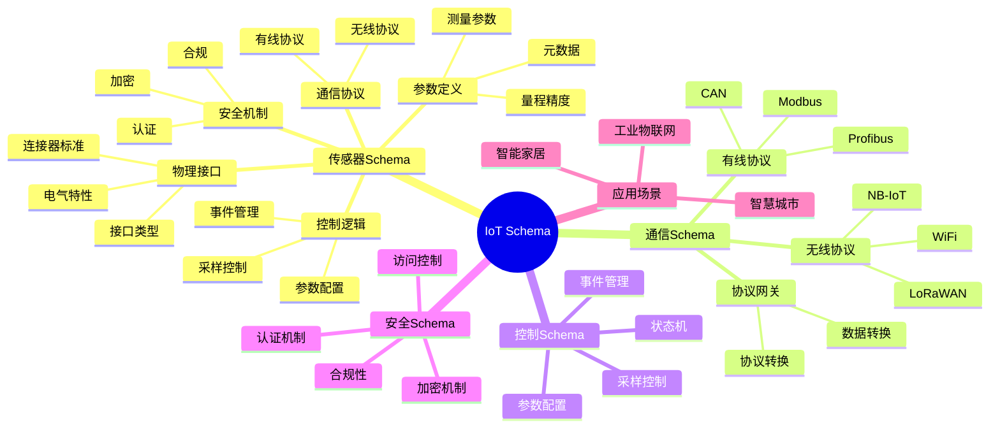

# IoT Schema思维导图

## 📑 目录

- [IoT Schema思维导图](#iot-schema思维导图)
  - [📑 目录](#-目录)
  - [1. 思维导图概述](#1-思维导图概述)
    - [1.1 导图结构](#11-导图结构)
  - [2. 完整思维导图](#2-完整思维导图)
  - [3. 五维结构分支](#3-五维结构分支)
    - [3.1 五维关系](#31-五维关系)
  - [4. 标准体系分支](#4-标准体系分支)
    - [4.1 标准关系](#41-标准关系)
  - [5. 应用场景分支](#5-应用场景分支)
    - [5.1 行业应用关系](#51-行业应用关系)
  - [6. Mermaid可视化](#6-mermaid可视化)
    - [6.1 思维导图Mermaid图](#61-思维导图mermaid图)

---

## 1. 思维导图概述

本文档以思维导图的形式展示IoT Schema
的知识体系结构，帮助理解各个主题之间的关系。

### 1.1 导图结构

思维导图分为以下主要分支：

1. **传感器Schema**：物理接口、参数定义
2. **通信Schema**：通信协议、数据链路
3. **控制Schema**：采样控制、参数配置
4. **安全Schema**：认证、加密、合规
5. **应用场景**：智能家居、智慧城市、工业物联网

---

## 2. 完整思维导图

```text
IoT Schema
│
├─ 1. 传感器Schema
│   │
│   ├─ 1.1 物理接口
│   │   ├─ 接口类型
│   │   │   ├─ 模拟接口
│   │   │   ├─ 数字接口
│   │   │   └─ 调制接口
│   │   ├─ 连接器标准
│   │   │   ├─ RJ45
│   │   │   ├─ RS485
│   │   │   └─ 光纤
│   │   └─ 电气特性
│   │       ├─ 电压
│   │       ├─ 功耗
│   │       └─ 能量收集
│   │
│   ├─ 1.2 通信协议
│   │   ├─ 有线协议
│   │   │   ├─ Modbus
│   │   │   ├─ CAN
│   │   │   └─ Profibus
│   │   └─ 无线协议
│   │       ├─ WiFi
│   │       ├─ LoRaWAN
│   │       └─ NB-IoT
│   │
│   ├─ 1.3 参数定义
│   │   ├─ 测量参数
│   │   ├─ 量程精度
│   │   └─ 元数据
│   │
│   ├─ 1.4 控制逻辑
│   │   ├─ 采样控制
│   │   ├─ 参数配置
│   │   └─ 事件管理
│   │
│   └─ 1.5 安全机制
│       ├─ 认证
│       ├─ 加密
│       └─ 合规
│
├─ 2. 通信Schema
│   │
│   ├─ 2.1 有线协议
│   │   ├─ Modbus（GB/T 19582）
│   │   ├─ CAN（ISO 11898）
│   │   └─ Profibus（GB/T 20540）
│   │
│   ├─ 2.2 无线协议
│   │   ├─ WiFi（IEEE 802.11）
│   │   ├─ LoRaWAN
│   │   ├─ NB-IoT（3GPP）
│   │   └─ 5G
│   │
│   └─ 2.3 协议网关
│       ├─ 协议转换
│       ├─ 数据转换
│       └─ 地址映射
│
├─ 3. 控制Schema
│   │
│   ├─ 3.1 采样控制
│   │   ├─ 采样模式
│   │   ├─ 采样频率
│   │   └─ 触发条件
│   │
│   ├─ 3.2 参数配置
│   │   ├─ 参数定义
│   │   ├─ 参数范围
│   │   └─ 参数验证
│   │
│   ├─ 3.3 事件管理
│   │   ├─ 事件定义
│   │   ├─ 触发条件
│   │   └─ 处理逻辑
│   │
│   └─ 3.4 状态机
│       ├─ 状态定义
│       ├─ 转换条件
│       └─ 转换动作
│
├─ 4. 安全Schema
│   │
│   ├─ 4.1 认证机制
│   │   ├─ 设备证书
│   │   ├─ 密钥管理
│   │   └─ 身份验证
│   │
│   ├─ 4.2 加密机制
│   │   ├─ 加密算法
│   │   ├─ 密钥交换
│   │   └─ 数据加密
│   │
│   ├─ 4.3 访问控制
│   │   ├─ 权限定义
│   │   ├─ 角色管理
│   │   └─ 访问策略
│   │
│   └─ 4.4 合规性
│       ├─ GDPR合规
│       ├─ 数据保护
│       └─ 安全审计
│
└─ 5. 应用场景
    │
    ├─ 5.1 智能家居
    │   ├─ 智能家电
    │   ├─ 安防系统
    │   └─ 环境监测
    │
    ├─ 5.2 智慧城市
    │   ├─ 环境监测
    │   ├─ 交通管理
    │   └─ 能源管理
    │
    └─ 5.3 工业物联网
        ├─ 设备监控
        ├─ 预测维护
        └─ 质量控制

├─ 6. 国际标准体系
    │
    ├─ 6.1 W3C标准
    │   ├─ W3C WoT (Web of Things)
    │   ├─ JSON-LD (链接数据)
    │   └─ RDF/OWL (语义Web)
    │
    ├─ 6.2 IEEE标准
    │   ├─ IEEE 802.11 (WiFi)
    │   ├─ IEEE 802.15.4 (Zigbee)
    │   └─ IEEE 1451 (智能传感器)
    │
    ├─ 6.3 3GPP标准
    │   ├─ NB-IoT (窄带物联网)
    │   ├─ LTE-M (LTE-Machine)
    │   └─ 5G IoT (5G物联网)
    │
    └─ 6.4 IETF标准
        ├─ CoAP (受限应用协议)
        ├─ 6LoWPAN (IPv6 over Low-Power)
        └─ MQTT (消息队列)

├─ 7. 行业标准体系
    │
    ├─ 7.1 物联网协议
    │   ├─ MQTT (OASIS)
    │   ├─ CoAP (IETF)
    │   ├─ LoRaWAN (LoRa Alliance)
    │   └─ Thread (Thread Group)
    │
    ├─ 7.2 工业物联网
    │   ├─ OPC UA (OPC Foundation)
    │   ├─ IO-Link (IO-Link Consortium)
    │   └─ Modbus (Modbus Organization)
    │
    └─ 7.3 云平台标准
        ├─ AWS IoT Core
        ├─ Azure IoT Hub
        └─ Google Cloud IoT

├─ 8. 开源规范与框架
    │
    ├─ 8.1 Eclipse基金会
    │   ├─ Eclipse Kura (边缘计算)
    │   ├─ Eclipse Paho (MQTT客户端)
    │   └─ Eclipse Leshan (CoAP服务器)
    │
    ├─ 8.2 Apache基金会
    │   ├─ Apache Kafka (消息流)
    │   └─ Apache Pulsar (消息队列)
    │
    └─ 8.3 其他开源
        ├─ Node-RED (流程编程)
        └─ Home Assistant (智能家居)

└─ 9. 跨领域转换
    │
    ├─ 9.1 协议转换
    │   ├─ MQTT ↔ CoAP
    │   ├─ Modbus ↔ MQTT
    │   └─ LoRaWAN ↔ HTTP
    │
    ├─ 9.2 数据格式转换
    │   ├─ JSON ↔ XML
    │   ├─ JSON ↔ Protobuf
    │   └─ JSON ↔ CBOR
    │
    └─ 9.3 平台转换
        ├─ AWS IoT ↔ Azure IoT
        ├─ 边缘计算 ↔ 云端
        └─ 本地 ↔ 云端
```

---

## 3. 五维结构分支

### 3.1 五维关系

```text
物理接口
    ↓ (电气连接)
通信协议
    ↓ (数据传输)
参数定义
    ↓ (数据解析)
控制逻辑
    ↓ (行为控制)
安全机制
    ↓ (安全保障)
应用系统
```

---

## 4. 标准体系分支

### 4.1 标准关系

```text
国际标准（IEEE、ISO、3GPP）
    ↓
国家标准（GB/T）
    ↓
行业标准（IO-Link、OPC UA、MQTT）
    ↓
厂商标准（设备厂商规范）
```

---

## 5. 应用场景分支

### 5.1 行业应用关系

```text
IoT Schema
    ├─ 智能家居
    │   └─ 消费物联网
    ├─ 智慧城市
    │   └─ 城市物联网
    ├─ 工业物联网
    │   └─ 工业4.0
    └─ 农业物联网
        └─ 精准农业
```

---

## 6. Mermaid可视化

### 6.1 思维导图Mermaid图



---

**参考文档**：

- `../README.md` - 主题概览
- `Knowledge_Matrix.md` - 多维知识矩阵
- `Formal_Proofs.md` - 形式化证明
- `../Sensor_Schema/` - 传感器Schema
- `../Communication_Schema/` - 通信Schema
- `../Control_Schema/` - 控制Schema
- `../Security_Schema/` - 安全Schema

├─ 12. 中国国家标准体系
    │
    ├─ 12.1 IT服务标准
    │   ├─ ITSS 5.0 (信息技术服务标准)
    │   └─ SJ/T11623-2016 (从业人员能力规范)
    │
    ├─ 12.2 智能制造标准
    │   ├─ CMMM (智能制造能力成熟度模型)
    │   ├─ 国家智能制造标准体系
    │   └─ 工业软件标准化路线图
    │
    ├─ 12.3 软件工程标准
    │   └─ GJB 5000B (军用软件能力成熟度模型)
    │
    └─ 12.4 金融标准
        └─ IMIX (银行间市场业务数据交换协议)

├─ 13. 电信行业标准体系
    │
    └─ 13.1 电信运营标准
        └─ eTOM (增强型电信运营图谱)

├─ 14. 知识表示标准体系
    │
    └─ 14.1 知识表示标准
        └─ Topic Maps (ISO/IEC 13250)

```

**创建时间**：2025-01-21
**最后更新**：2025-01-21（扩展网络检索标准内容，新增中国国家标准、电信标准、知识表示标准分支）
