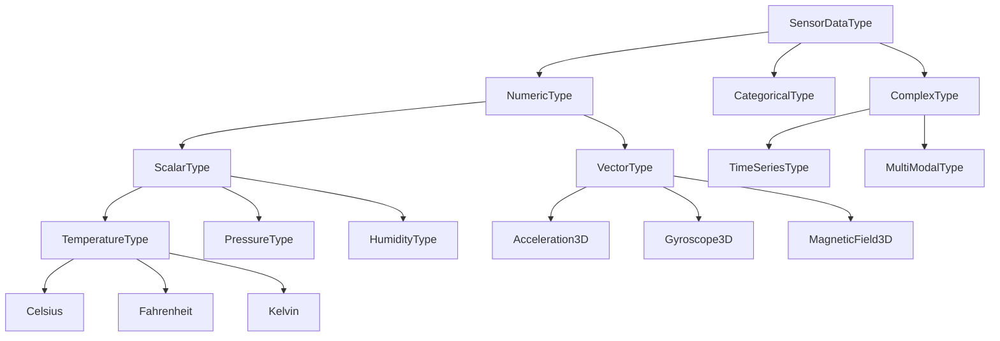
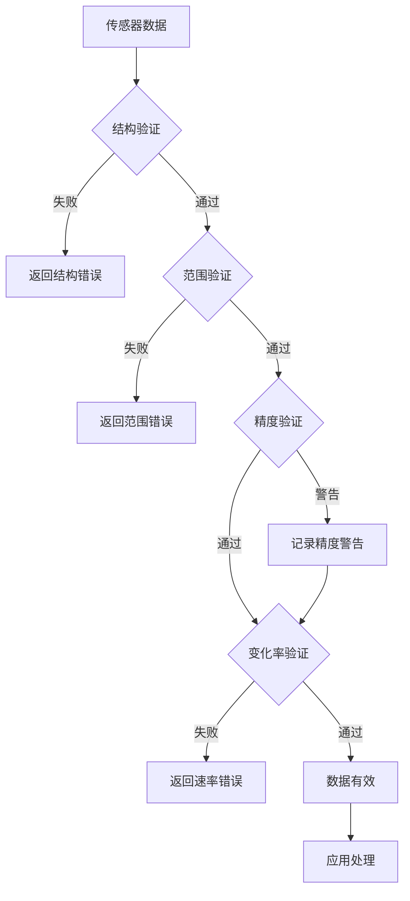
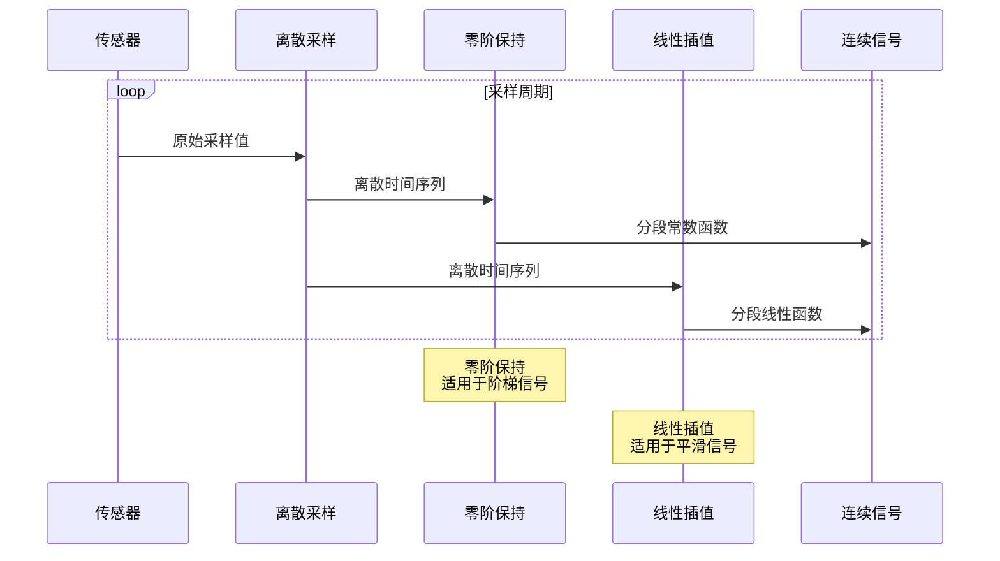

# IoT传感器Schema形式语法与语义分析视图

**版本**: v1.0
**创建日期**: 2026-02-15
**标准**: IEEE 1451.0-2024, GB/T 34068-2017

---

## 📑 目录

- [IoT传感器Schema形式语法与语义分析视图](#iot传感器schema形式语法与语义分析视图)
  - [📑 目录](#-目录)
  - [1. 形式文法定义](#1-形式文法定义)
    - [1.1 EBNF文法](#11-ebnf文法)
    - [1.2 JSON Schema文法](#12-json-schema文法)
  - [2. 形式语义定义](#2-形式语义定义)
    - [2.1 传感器数据语义](#21-传感器数据语义)
      - [数据值语义函数](#数据值语义函数)
    - [2.2 时序数据语义](#22-时序数据语义)
      - [采样保持语义](#采样保持语义)
  - [3. 类型系统](#3-类型系统)
    - [3.1 传感器数据类型层次](#31-传感器数据类型层次)
    - [3.2 类型转换规则](#32-类型转换规则)
    - [3.3 类型验证规则](#33-类型验证规则)
  - [4. 验证规则](#4-验证规则)
    - [4.1 Schema验证](#41-schema验证)
    - [4.2 数据验证规则](#42-数据验证规则)
  - [5. Mermaid可视化](#5-mermaid可视化)
    - [5.1 传感器数据类型层次图](#51-传感器数据类型层次图)
    - [5.2 传感器Schema验证流程](#52-传感器schema验证流程)
    - [5.3 时序数据语义转换](#53-时序数据语义转换)

---

## 1. 形式文法定义

### 1.1 EBNF文法

```ebnf
(* IoT传感器Schema核心文法 *)

SensorSchema ::= '{'
    SensorMetadata ','
    PhysicalInterface ','
    CommunicationInterface ','
    DataDefinition ','
    SecurityPolicy?
'}'

SensorMetadata ::= '"metadata"' ':' '{'
    Identifier ','
    SensorType ','
    Manufacturer ','
    Version ','
    CalibrationInfo?
'}'

Identifier ::= '"id"' ':' String

SensorType ::= '"type"' ':'
    ('"temperature"' | '"humidity"' | '"pressure"' |
     '"acceleration"' | '"gyroscope"' | '"magnetic"' |
     '"light"' | '"sound"' | '"gas"' | '"custom"')

Manufacturer ::= '"manufacturer"' ':' String

Version ::= '"version"' ':' VersionString

PhysicalInterface ::= '"physical"' ':' '{'
    ConnectorType ','
    ElectricalSpec ','
    MechanicalSpec?
'}'

ConnectorType ::= '"connector"' ':'
    ('"rj45"' | '"m12"' | '"usb"' | '"header"' |
     '"wireless"' | '"custom"')

ElectricalSpec ::= '"electrical"' ':' '{'
    Voltage ','
    Current ','
    PowerConsumption ','
    SignalType
'}'

Voltage ::= '"voltage"' ':' '{'
    '"min"' ':' Number ','
    '"max"' ':' Number ','
    '"unit"' ':' '"V"'
'}'

SignalType ::= '"signal"' ':'
    ('"analog_voltage"' | '"analog_current"' |
     '"digital_i2c"' | '"digital_spi"' | '"digital_uart"' |
     '"digital_onewire"' | '"wireless_rf"')

CommunicationInterface ::= '"communication"' ':' '{'
    Protocol ','
    DataRate ','
    AddressConfig?
'}'

Protocol ::= '"protocol"' ':'
    ('"modbus_rtu"' | '"modbus_tcp"' |
     '"can"' | '"canopen"' |
     '"mqtt"' | '"coap"' | '"http"' |
     '"zigbee"' | '"lorawan"' | '"ble"')

DataRate ::= '"data_rate"' ':' '{'
    '"value"' ':' Number ','
    '"unit"' ':' ('"bps"' | '"kbps"' | '"mbps"')
'}'

DataDefinition ::= '"data"' ':' '{'
    Measurements ','
    SamplingConfig ','
    DataFormat
'}'

Measurements ::= '"measurements"' ':' '[' MeasurementSpec {',' MeasurementSpec}* ']'

MeasurementSpec ::= '{'
    Quantity ','
    Unit ','
    Range ','
    Precision ','
    SamplingRate?
'}'

Quantity ::= '"quantity"' ':' String

Unit ::= '"unit"' ':'
    ('"celsius"' | '"fahrenheit"' | '"kelvin"' |    (* 温度 *)
     '"percent"' |                                      (* 湿度 *)
     '"pascal"' | '"bar"' | '"psi"' |                  (* 压力 *)
     '"meter_per_second_squared"' |                    (* 加速度 *)
     '"degree_per_second"' |                           (* 角速度 *)
     '"lux"' | '"watt_per_square_meter"' |            (* 光照 *)
     '"decibel"' |                                     (* 声音 *)
     '"ppm"' | '"ppb"')                                (* 气体浓度 *)

Range ::= '"range"' ':' '{'
    '"min"' ':' Number ','
    '"max"' ':' Number
'}'

Precision ::= '"precision"' ':' '{'
    '"value"' ':' Number ','
    '"unit"' ':' ('"absolute"' | '"relative"' | '"percent_fs"')
'}'

SamplingConfig ::= '"sampling"' ':' '{'
    Mode ','
    Rate ','
    BufferSize?
'}'

Mode ::= '"mode"' ':'
    ('"continuous"' | '"triggered"' | '"periodic"' | '"event_driven"')

Rate ::= '"rate"' ':' '{'
    '"value"' ':' Number ','
    '"unit"' ':' '"hz"'
'}'

DataFormat ::= '"format"' ':'
    ('"raw_adc"' | '"calibrated"' | '"engineering_units"')

SecurityPolicy ::= '"security"' ':' '{'
    Authentication ','
    Encryption ','
    AccessControl?
'}'

Authentication ::= '"auth"' ':'
    ('"none"' | '"psk"' | '"certificate"' | '"oauth2"')

Encryption ::= '"encryption"' ':'
    ('"none"' | '"tls12"' | '"tls13"' | '"dtls"' | '"aes128"' | '"aes256"')
```

### 1.2 JSON Schema文法

```json
{
  "$schema": "http://json-schema.org/draft/2020-12/schema#",
  "$id": "http://example.org/iot-sensor-schema.json",
  "title": "IoT Sensor Schema",
  "type": "object",
  "required": ["metadata", "physical", "communication", "data"],
  "properties": {
    "metadata": {
      "type": "object",
      "required": ["id", "type", "manufacturer", "version"],
      "properties": {
        "id": {
          "type": "string",
          "pattern": "^[a-zA-Z0-9_-]+$"
        },
        "type": {
          "type": "string",
          "enum": ["temperature", "humidity", "pressure",
                   "acceleration", "gyroscope", "magnetic",
                   "light", "sound", "gas", "custom"]
        },
        "manufacturer": { "type": "string" },
        "version": {
          "type": "string",
          "pattern": "^\\d+\\.\\d+\\.\\d+$"
        },
        "calibration": {
          "type": "object",
          "properties": {
            "date": { "type": "string", "format": "date" },
            "certificate": { "type": "string" }
          }
        }
      }
    },
    "physical": {
      "type": "object",
      "required": ["connector", "electrical"],
      "properties": {
        "connector": {
          "type": "string",
          "enum": ["rj45", "m12", "usb", "header", "wireless", "custom"]
        },
        "electrical": {
          "type": "object",
          "required": ["voltage", "current", "power", "signal"],
          "properties": {
            "voltage": {
              "type": "object",
              "required": ["min", "max", "unit"],
              "properties": {
                "min": { "type": "number" },
                "max": { "type": "number" },
                "unit": { "const": "V" }
              }
            },
            "signal": {
              "type": "string",
              "enum": ["analog_voltage", "analog_current",
                       "digital_i2c", "digital_spi", "digital_uart",
                       "digital_onewire", "wireless_rf"]
            }
          }
        }
      }
    },
    "communication": {
      "type": "object",
      "required": ["protocol", "data_rate"],
      "properties": {
        "protocol": {
          "type": "string",
          "enum": ["modbus_rtu", "modbus_tcp", "can", "canopen",
                   "mqtt", "coap", "http", "zigbee", "lorawan", "ble"]
        },
        "data_rate": {
          "type": "object",
          "required": ["value", "unit"],
          "properties": {
            "value": { "type": "number", "minimum": 0 },
            "unit": { "enum": ["bps", "kbps", "mbps"] }
          }
        }
      }
    },
    "data": {
      "type": "object",
      "required": ["measurements", "sampling", "format"],
      "properties": {
        "measurements": {
          "type": "array",
          "minItems": 1,
          "items": {
            "type": "object",
            "required": ["quantity", "unit", "range", "precision"],
            "properties": {
              "quantity": { "type": "string" },
              "unit": {
                "type": "string",
                "enum": ["celsius", "fahrenheit", "kelvin",
                         "percent", "pascal", "bar", "psi",
                         "meter_per_second_squared", "lux", "ppm"]
              },
              "range": {
                "type": "object",
                "required": ["min", "max"],
                "properties": {
                  "min": { "type": "number" },
                  "max": { "type": "number" }
                }
              },
              "precision": {
                "type": "object",
                "required": ["value", "unit"],
                "properties": {
                  "value": { "type": "number", "minimum": 0 },
                  "unit": { "enum": ["absolute", "relative", "percent_fs"] }
                }
              }
            }
          }
        },
        "sampling": {
          "type": "object",
          "required": ["mode", "rate"],
          "properties": {
            "mode": {
              "enum": ["continuous", "triggered", "periodic", "event_driven"]
            },
            "rate": {
              "type": "object",
              "required": ["value", "unit"],
              "properties": {
                "value": { "type": "number", "minimum": 0 },
                "unit": { "const": "hz" }
              }
            }
          }
        }
      }
    }
  }
}
```

---

## 2. 形式语义定义

### 2.1 传感器数据语义

```
语义域定义:

SensorData = (Timestamp, MeasurementValue, Quality, Metadata)

Timestamp = ℕ  (* Unix时间戳，毫秒 *)

MeasurementValue =
    ScalarValue ℝ
  | VectorValue ℝⁿ
  | TensorValue ℝⁿˣᵐ

Quality =
    Good
  | Uncertain { reason: String }
  | Bad { reason: String }

Metadata =
    SensorID × CalibrationStatus × EnvironmentalConditions

EnvironmentalConditions =
    Temperature × Humidity × Pressure
```

#### 数据值语义函数

```
V[SensorData] : Environment → SensorValue

(* 标量值解释 *)
V[{"value": v, "unit": u}] env =
    convert_to_base_unit(v, u)

(* 向量值解释（如加速度XYZ） *)
V[{"x": vx, "y": vy, "z": vz, "unit": u}] env =
    (convert(vx, u), convert(vy, u), convert(vz, u))

(* 带时间戳的时序值 *)
V[{"timestamp": t, "value": v}] env =
    (eval_timestamp(t), V[v] env)
```

### 2.2 时序数据语义

```
时序数据流:

TimeSeries = ℕ → SensorData  (* 离散时间函数 *)

语义约束:
∀ts ∈ TimeSeries:
    monotonic_increasing(dom(ts))  (* 时间戳单调递增 *)

采样语义:
Sample(ts, Δt) = { ts(t) | t ∈ dom(ts), t mod Δt = 0 }

聚合语义:
Aggregate(ts, window, op) =
    { op(ts[t, t+window]) | t ∈ dom(ts), step(window) }

其中:
- op ∈ { mean, max, min, std, count }
- ts[t₁, t₂] 表示时间窗口[t₁, t₂]内的所有数据点
```

#### 采样保持语义

```
ZeroOrderHold : TimeSeries → ContinuousFunction

ZeroOrderHold(ts)(t) = ts(max { t' ∈ dom(ts) | t' ≤ t })

(* 零阶保持：采样点之间保持常数值 *)

LinearInterpolation : TimeSeries → ContinuousFunction

LinearInterpolation(ts)(t) =
    let t₁ = max { t' ∈ dom(ts) | t' ≤ t }
        t₂ = min { t' ∈ dom(ts) | t' > t }
        v₁ = ts(t₁)
        v₂ = ts(t₂)
    in v₁ + (v₂ - v₁) * (t - t₁) / (t₂ - t₁)

(* 线性插值：采样点之间线性过渡 *)
```

---

## 3. 类型系统

### 3.1 传感器数据类型层次

```
SensorDataType
├── NumericType
│   ├── ScalarType
│   │   ├── TemperatureType
│   │   │   ├── Celsius
│   │   │   ├── Fahrenheit
│   │   │   └── Kelvin
│   │   ├── PressureType
│   │   ├── HumidityType
│   │   └── GenericScalar
│   │
   └── VectorType
       ├── Acceleration3D
       ├── Gyroscope3D
       ├── MagneticField3D
       └── GenericVector
│
├── CategoricalType
│   ├── EnumType
│   └── StateType
│
└── ComplexType
    ├── TimeSeriesType
    │   └── Parameterized by: element_type, sampling_rate
    └── MultiModalType
        └── Parameterized by: component_types
```

### 3.2 类型转换规则

```
温度转换:
CelsiusToFahrenheit(c) = c × 9/5 + 32
CelsiusToKelvin(c) = c + 273.15
FahrenheitToCelsius(f) = (f - 32) × 5/9

压力转换:
PascalToBar(p) = p / 100000
PascalToPsi(p) = p / 6894.76

(* 类型安全约束 *)
type_safe_convert(t₁, t₂) ⟺
    physical_dimension(t₁) = physical_dimension(t₂)

(* 精度损失警告 *)
lossy_convert(t₁, t₂) ⟺
    precision(t₁) > precision(t₂)
```

### 3.3 类型验证规则

```
规则1: 范围检查
∀v ∈ Value : min_range ≤ v ≤ max_range

规则2: 精度检查
∀v ∈ Value :
    precision(v) ≤ specified_precision ∨
    warning("Precision loss detected")

规则3: 单位一致性
∀op ∈ BinaryOperation :
    compatible_units(operand₁.unit, operand₂.unit)

规则4: 采样率检查
∀ts ∈ TimeSeries :
    actual_sampling_rate(ts) ≥ required_sampling_rate
```

---

## 4. 验证规则

### 4.1 Schema验证

```
ValidateSchema : SensorSchema → ValidationResult

ValidationResult = Valid | Invalid { errors: [Error] }

验证步骤:
1. 结构验证
   - 必需字段存在性
   - 字段类型匹配
   - 枚举值合法性

2. 语义验证
   - 范围一致性 (min < max)
   - 单位合理性
   - 采样率可行性

3. 一致性验证
   - 信号类型与连接器兼容
   - 协议与数据率匹配
   - 功耗与电源能力匹配
```

### 4.2 数据验证规则

```python
# 伪代码表示验证逻辑

def validate_sensor_data(data, schema):
    errors = []

    # 1. 时间戳验证
    if not is_valid_timestamp(data.timestamp):
        errors.append(Error("INVALID_TIMESTAMP", "Timestamp out of range"))

    # 2. 数值范围验证
    for measurement in data.measurements:
        spec = find_spec(schema, measurement.quantity)
        if not (spec.range.min <= measurement.value <= spec.range.max):
            errors.append(Error("OUT_OF_RANGE",
                f"{measurement.quantity}: {measurement.value} not in [{spec.range.min}, {spec.range.max}]"))

    # 3. 精度验证
    if measurement.uncertainty > spec.precision.value:
        warnings.append(Warning("PRECISION_EXCEEDED",
            f"Measurement uncertainty exceeds specification"))

    # 4. 变化率验证 (抖动检测)
    if data.history:
        rate = calculate_change_rate(data, data.history[-1])
        if rate > spec.max_change_rate:
            errors.append(Error("RATE_LIMIT_EXCEEDED",
                f"Change rate {rate} exceeds maximum {spec.max_change_rate}"))

    return ValidationResult(errors=[], warnings=[]) if not errors else \
           ValidationResult(errors=errors, warnings=warnings)
```

---

## 5. Mermaid可视化

### 5.1 传感器数据类型层次图



### 5.2 传感器Schema验证流程



### 5.3 时序数据语义转换



---

**参考文档**:

- `01_Overview.md` - 传感器Schema概述
- `02_Formal_Definition.md` - 形式化定义
- `03_Standards.md` - 标准对标
- IEEE 1451.0-2024
- GB/T 34068-2017

**维护者**: DSL Schema研究团队
