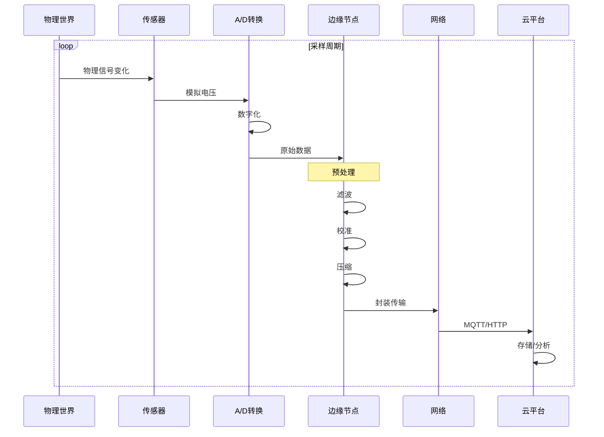
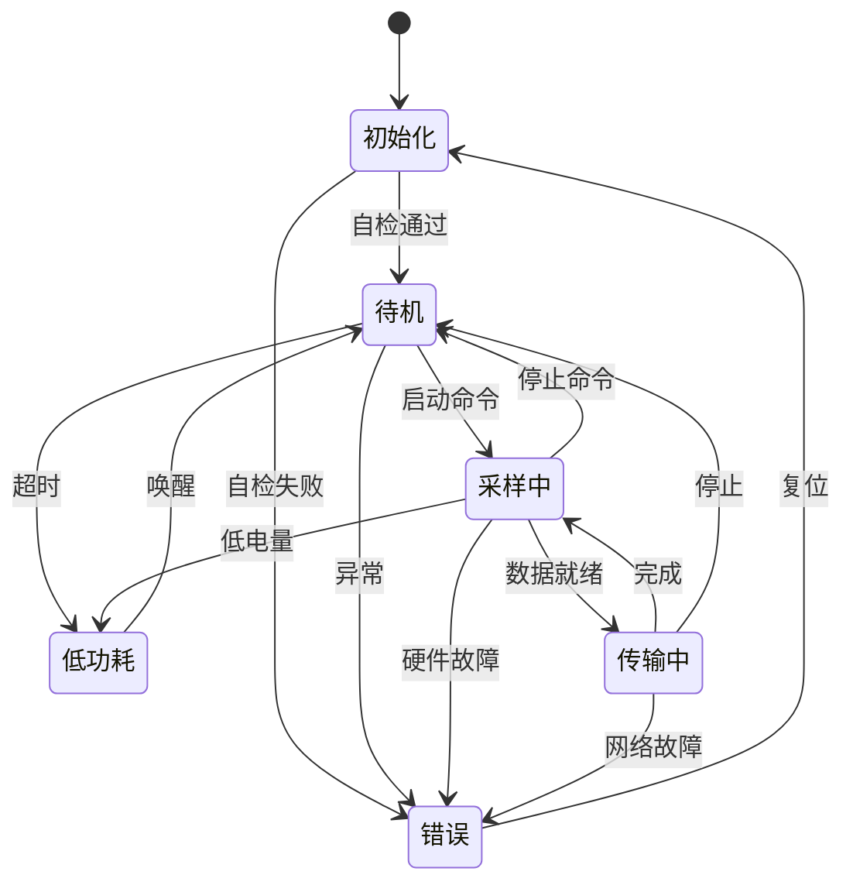
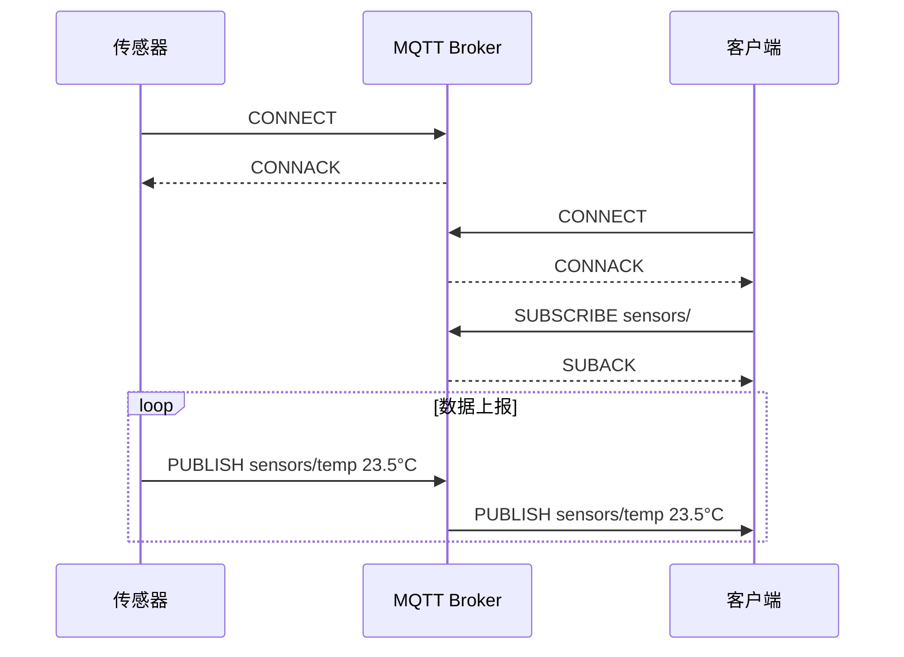

# IoT传感器Schema信息表征动态动作分析视图

**版本**: v1.0
**创建日期**: 2026-02-15

---

## 📑 目录

- [IoT传感器Schema信息表征动态动作分析视图](#iot传感器schema信息表征动态动作分析视图)
  - [📑 目录](#-目录)
  - [1. 传感器数据流动态分析](#1-传感器数据流动态分析)
    - [1.1 数据采集流水线](#11-数据采集流水线)
    - [1.2 数据处理延迟分析](#12-数据处理延迟分析)
  - [2. 采样与传输时序](#2-采样与传输时序)
    - [2.1 采样策略时序](#21-采样策略时序)
    - [2.2 数据传输时序](#22-数据传输时序)
  - [3. 状态转换分析](#3-状态转换分析)
    - [3.1 传感器状态机](#31-传感器状态机)
    - [3.2 状态转换矩阵](#32-状态转换矩阵)
    - [3.3 电池供电传感器状态](#33-电池供电传感器状态)
  - [4. 网络通信动态](#4-网络通信动态)
    - [4.1 协议栈数据封装](#41-协议栈数据封装)
    - [4.2 网络拓扑动态](#42-网络拓扑动态)
  - [5. 信息熵变化分析](#5-信息熵变化分析)
    - [5.1 传感器数据信息熵](#51-传感器数据信息熵)
    - [5.2 数据压缩熵分析](#52-数据压缩熵分析)
  - [6. Mermaid动态视图](#6-mermaid动态视图)
    - [6.1 传感器数据流水线时序](#61-传感器数据流水线时序)
    - [6.2 传感器状态机](#62-传感器状态机)
    - [6.3 网络传输时序](#63-网络传输时序)

---

## 1. 传感器数据流动态分析

### 1.1 数据采集流水线

```text
物理世界              传感器层              边缘层              云端/应用层
    │                   │                   │                   │
    │ 物理信号          │                   │                   │
    ▼                   ▼                   │                   │
┌─────────┐       ┌─────────┐              │                   │
│ 物理量  │──────▶│ 传感元件│              │                   │
│ 变化    │       │ 转换    │              │                   │
└─────────┘       └─────────┘              │                   │
                        │                  │                   │
                        │ 模拟信号         │                   │
                        ▼                  │                   │
                  ┌─────────┐              │                   │
                  │ A/D转换 │              │                   │
                  │ 数字化  │              │                   │
                  └─────────┘              │                   │
                        │                  │                   │
                        │ 数字原始值       │                   │
                        ▼                  │                   │
                  ┌─────────┐              │                   │
                  │ 预处理  │─────────────▶│                   │
                  │ 滤波/校准              │                   │
                  └─────────┘              │                   │
                                           │                   │
                                           │ 处理后的数据      │
                                           ▼                   │
                                     ┌─────────┐              │
                                     │ 边缘计算│              │
                                     │ 聚合/分析              │
                                     └─────────┘              │
                                           │                  │
                                           │ 聚合数据         │
                                           ▼                  │
                                     ┌─────────┐             │
                                     │ 网络传输│────────────▶│
                                     │ MQTT/HTTP             │
                                     └─────────┘             │
                                                              │
                                                              ▼
                                                        ┌─────────┐
                                                        │ 云平台  │
                                                        │ 存储/分析
                                                        └─────────┘
```

### 1.2 数据处理延迟分析

```text
端到端延迟组成:

总延迟 = T_sampling + T_processing + T_transmission + T_cloud + T_application

其中:
- T_sampling: 采样延迟 (1-1000ms)
  ├─ 传感器响应时间: 1-100ms
  ├─ A/D转换时间: 0.1-10ms
  └─ 预处理时间: 0-50ms

- T_processing: 边缘处理延迟 (0-500ms)
  ├─ 数据清洗: 0-10ms
  ├─ 特征提取: 0-100ms
  ├─ 本地分析: 0-500ms
  └─ 数据聚合: 0-50ms

- T_transmission: 传输延迟 (10-5000ms)
  ├─ 协议封装: 1-10ms
  ├─ 网络传输: 10-5000ms (取决于网络类型)
  │   ├─ WiFi: 10-50ms
  │   ├─ 4G: 50-200ms
  │   ├─ NB-IoT: 500-2000ms
  │   └─ LoRaWAN: 1000-5000ms
  └─ 协议解封装: 1-10ms

- T_cloud: 云端处理延迟 (10-1000ms)
  ├─ 消息队列: 1-100ms
  ├─ 数据处理: 10-500ms
  └─ 存储写入: 1-100ms

- T_application: 应用层延迟 (0-1000ms)
  ├─ 实时告警: 0-100ms
  ├─ 可视化更新: 100-1000ms
  └─ 控制响应: 0-500ms
```

---

## 2. 采样与传输时序

### 2.1 采样策略时序

```text
连续采样模式:

时间 → 0    10   20   30   40   50   60   70   80   90  100 ms
       │    │    │    │    │    │    │    │    │    │
采样:  █    █    █    █    █    █    █    █    █    █   (100Hz)

触发采样模式:

时间 → 0    50   100  150  200  250  300  350  400 ms
       │         │              │              │
触发:              ▲              ▲              ▲
       │         │              │              │
采样:           █              █              █

周期性批量采样:

时间 → 0    100  200  300  400  500  600  700  800 ms
       │    │    │    │    │    │    │    │
采样窗口:████    ████    ████    ████
       (10个样本)(10个样本)(10个样本)(10个样本)

事件驱动采样:

时间 → 0    50   100  150  200  250  300  350  400 ms
       │                   │                   │
事件:        ▲    ▲              ▲    ▲    ▲
       │                   │                   │
采样:      █    █              █    █    █
```

### 2.2 数据传输时序

```text
MQTT传输时序:

传感器          MQTT Broker          订阅者
   │                │                  │
   │──CONNECT────▶│                  │
   │◀──CONNACK────│                  │
   │                │                  │
   │──PUBLISH────▶│                  │
   │   QoS 0       │                  │
   │                │                  │
   │                │──PUBLISH───────▶│
   │                │                  │

带QoS的传输:

传感器          MQTT Broker          订阅者
   │                │                  │
   │──PUBLISH────▶│                  │
   │   QoS 1       │                  │
   │◀──PUBACK─────│                  │
   │                │──PUBLISH───────▶│
   │                │◀──PUBACK───────│
   │                │                  │

CoAP传输时序 (请求/响应):

客户端            服务器
   │                │
   │──GET─────────▶│
   │   /sensor/temp │
   │                │
   │◀──2.05 Content│
   │   payload      │
   │                │

CoAP观察模式:

客户端            服务器
   │                │
   │──GET(Observe)▶│
   │                │
   │◀──2.05 Content│  (初始值)
   │                │
   │◀──2.05 Content│  (变化时推送)
   │                │
   │◀──2.05 Content│  (变化时推送)
```

---

## 3. 状态转换分析

### 3.1 传感器状态机

```text
状态: {初始化, 待机, 采样中, 传输中, 错误, 低功耗}

转换函数:
δ(初始化) = 待机 (自检通过)
δ(初始化) = 错误 (自检失败)

δ(待机) = 采样中 (启动命令)
δ(待机) = 低功耗 (超时/命令)
δ(待机) = 错误 (异常检测)

δ(采样中) = 传输中 (缓冲区满/周期到)
δ(采样中) = 待机 (停止命令)
δ(采样中) = 低功耗 (低电量)
δ(采样中) = 错误 (硬件故障)

δ(传输中) = 采样中 (传输完成)
δ(传输中) = 待机 (停止命令)
δ(传输中) = 错误 (网络故障)

δ(低功耗) = 待机 (唤醒事件)

δ(错误) = 初始化 (复位命令)
δ(错误) = 待机 (错误恢复)
```

### 3.2 状态转换矩阵

| 当前状态 | 启动命令 | 停止命令 | 数据就绪 | 传输完成 | 错误发生 | 超时 | 低电量 |
|---------|---------|---------|---------|---------|---------|------|-------|
| **初始化** | 待机 | - | - | - | 错误 | - | - |
| **待机** | 采样中 | - | - | - | 错误 | 低功耗 | - |
| **采样中** | - | 待机 | 传输中 | - | 错误 | - | 低功耗 |
| **传输中** | - | 待机 | - | 采样中 | 错误 | - | - |
| **低功耗** | - | - | - | - | - | - | - |
| **错误** | - | - | - | - | - | - | - |

### 3.3 电池供电传感器状态

```text
正常模式 ◀──────▶ 低功耗模式
   │                  │
   │ 活动周期         │ 休眠周期
   │                  │
   ▼                  ▼
┌─────────┐      ┌─────────┐
│ 采样    │      │ 深度休眠 │
│ 处理    │      │ RAM保持 │
│ 传输    │      │ 定时器运行
└─────────┘      └─────────┘
   │                  │
   │ 50ms             │ 9900ms
   │ (0.5% duty)      │ (99.5% duty)
   │                  │
   └──────────────────┘
      10秒周期

功耗分析:
- 正常模式: 50mA @ 3.3V = 165mW
- 低功耗模式: 0.01mA @ 3.3V = 0.033mW
- 平均功耗: 165×0.005 + 0.033×0.995 ≈ 0.86mW
- 电池寿命: 2000mAh / 0.26mA ≈ 300天
```

---

## 4. 网络通信动态

### 4.1 协议栈数据封装

```text
应用层数据封装流程:

原始传感器数据
    ↓ (JSON编码)
{
  "timestamp": 1708000000000,
  "sensor_id": "temp_01",
  "value": 23.5,
  "unit": "celsius"
}
    ↓ (MQTT封装)
MQTT固定报头: 0x30 (PUBLISH)
MQTT可变报头:
  - Topic: "sensors/zone1/temp_01"
  - Packet ID: 1234
MQTT负载: JSON数据 (约80字节)
    ↓ (TCP封装)
TCP报头:
  - Src Port: 51823
  - Dst Port: 1883
  - Seq/ACK
  - Flags: PSH, ACK
TCP负载: MQTT消息 (约100字节)
    ↓ (IP封装)
IP报头:
  - Version: 4
  - Src IP: 192.168.1.100
  - Dst IP: 203.0.113.1
  - Protocol: TCP(6)
IP负载: TCP段 (约120字节)
    ↓ (以太网封装)
以太网帧头:
  - Src MAC: aa:bb:cc:dd:ee:ff
  - Dst MAC: 11:22:33:44:55:66
  - Type: IP(0x0800)
以太网帧: 约134字节
```

### 4.2 网络拓扑动态

```text
星型拓扑 (WiFi/以太网):

           ┌─────────┐
           │  路由器  │
           │ /AP     │
           └────┬────┘
                │
      ┌─────────┼─────────┐
      │         │         │
   ┌──┴──┐  ┌──┴──┐  ┌──┴──┐
   │传感器1│  │传感器2│  │传感器3│
   └──┬──┘  └──┬──┘  └──┬──┘
      │         │         │
      └─────────┴─────────┘

特性: 单点故障, 带宽共享, 延迟稳定

网状拓扑 (Zigbee/Thread):

   ┌─────┐     ┌─────┐     ┌─────┐
   │  S1 │◀───▶│  S2 │◀───▶│  S3 │
   └──┬──┘     └──┬──┘     └──┬──┘
      │           │           │
      ▼           ▼           ▼
   ┌─────┐     ┌─────┐     ┌─────┐
   │  S4 │◀───▶│  S5 │◀───▶│  S6 │
   └──┬──┘     └──┬──┘     └──┬──┘
      │           │           │
      └───────────┴───────────┘
                  │
               ┌─────┐
               │网关 │
               └─────┘

特性: 自愈合, 多跳路由, 延迟累积
```

---

## 5. 信息熵变化分析

### 5.1 传感器数据信息熵

```text
信息在传感器系统中的熵变:

物理世界信号:     H ≈ ∞ (连续模拟信号)
     │
     │ 传感元件转换 (采样定理)
     ▼
离散采样:         H = log₂(N) bits (N量化级别)
     │
     │ A/D转换 (量化)
     ▼
数字原始值:       H = n bits (n位ADC分辨率)
     │
     │ 数据压缩/编码
     ▼
编码数据:         H' ≤ H (可能的信息损失)
     │
     │ 网络传输
     ▼
接收数据:         H'' ≈ H' (信道噪声)
     │
     │ 数据解码
     ▼
应用数据:         H''' ≤ H'' (特征提取损失)

信息损失点:
1. 采样: 连续→离散 (混叠风险)
2. 量化: 精度限制
3. 压缩: 有损压缩
4. 特征提取: 降维处理
```

### 5.2 数据压缩熵分析

```text
原始温度数据流:
[23.5, 23.6, 23.7, 23.6, 23.5, 23.4, 23.5, 23.6] °C
(每个值32位浮点 = 256 bits)

Delta编码后:
[23.5, +0.1, +0.1, -0.1, -0.1, -0.1, +0.1, +0.1]
(基础值32位 + 7×8位delta = 88 bits)
压缩比: 2.9:1

信息熵分析:
原始熵: H(X) ≈ 4.2 bits/样本
Delta熵: H(ΔX) ≈ 1.8 bits/样本

Huffman编码后: 约 1.5 bits/样本
总压缩: 256 bits → 12 bits (21:1)
```

---

## 6. Mermaid动态视图

### 6.1 传感器数据流水线时序



### 6.2 传感器状态机



### 6.3 网络传输时序



---

**参考文档**:

- `01_Overview.md` - 传感器Schema概述
- `06_Formal_Grammar_Semantics.md` - 形式语法语义

**维护者**: DSL Schema研究团队
