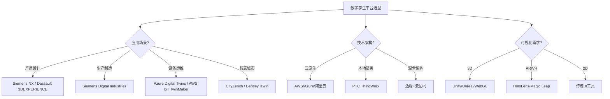
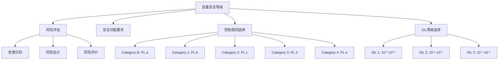
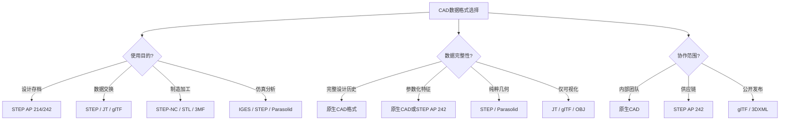

# 物理设备Schema决策树图

**版本**: v1.0
**创建日期**: 2026-02-15
**适用范围**: 物理设备Schema设计和数字孪生建模

---

## 📑 目录

- [物理设备Schema决策树图](#物理设备schema决策树图)
  - [📑 目录](#-目录)
  - [1. 数字孪生平台选型决策树](#1-数字孪生平台选型决策树)
  - [2. 设备安全等级决策树](#2-设备安全等级决策树)
  - [3. CAD数据格式选择决策树](#3-cad数据格式选择决策树)
  - [4. 设备预测维护决策树](#4-设备预测维护决策树)
  - [5. Mermaid可视化](#5-mermaid可视化)
    - [5.1 数字孪生平台选型流程图](#51-数字孪生平台选型流程图)
    - [5.2 设备安全等级选择流程图](#52-设备安全等级选择流程图)
    - [5.3 CAD数据格式选择流程图](#53-cad数据格式选择流程图)

---

## 1. 数字孪生平台选型决策树

```text
开始: 数字孪生平台选型
│
├─ 应用场景?
│   ├─ 产品设计与仿真
│   │   ├─ CAD集成需求?
│   │   │   ├─ 是 → Siemens NX + Teamcenter
│   │   │   ├─ 是 → Dassault 3DEXPERIENCE
│   │   │   └─ 是 → PTC Creo + Windchill
│   │   │
│   │   └─ 仿真需求?
│   │       ├─ FEA结构 → ANSYS
│   │       ├─ CFD流体 → SimScale
│   │       ├─ 多物理场 → COMSOL
│   │       └─ 系统仿真 → MATLAB/Simulink
│   │
│   ├─ 生产制造监控
│   │   ├─ 生产线级 → Siemens Digital Industries
│   │   ├─ 工厂级 → GE Digital Twin
│   │   └─ 设备级 → 阿里云数字孪生
│   │
│   ├─ 设备运维管理
│   │   ├─ 工业设备 → Azure Digital Twins
│   │   ├─ 能源设备 → AWS IoT TwinMaker
│   │   └─ 建筑设备 → Bentley iTwin
│   │
│   └─ 城市/基础设施
│       ├─ 智慧城市 → CityZenith
│       ├─ 交通系统 → Siemens Mobility
│       └─ 水利环境 → AVEVA Unified Engineering
│
├─ 技术架构?
│   ├─ 云原生
│   │   ├─ AWS IoT TwinMaker
│   │   ├─ Azure Digital Twins
│   │   └─ 阿里云数字孪生
│   │
│   ├─ 本地部署
│   │   ├─ PTC ThingWorx
│   │   └─ Siemens MindSphere (私有云)
│   │
│   └─ 混合架构
│       └─ 边缘+云协同
│
├─ 集成能力?
│   ├─ 数据源
│   │   ├─ 传感器实时数据
│   │   ├─ SCADA/Historian
│   │   ├─ ERP/MES
│   │   └─ CAD/PLM
│   │
│   ├─ 协议支持
│   │   ├─ OPC UA
│   │   ├─ MQTT
│   │   ├─ Modbus
│   │   └─ 专有协议
│   │
│   └─ API接口
│       ├─ REST API
│       ├─ GraphQL
│       └─ 实时流
│
├─ 可视化需求?
│   ├─ 3D可视化
│   │   ├─ Unity/Unreal引擎
│   │   ├─ WebGL (Three.js/Cesium)
│   │   └─ 专用3D引擎
│   │
│   ├─ AR/VR集成
│   │   ├─ HoloLens
│   │   ├─ Magic Leap
│   │   └─ 移动AR
│   │
│   └─ 2D仪表盘
│       └─ 传统BI工具集成
│
└─ AI/分析能力?
    ├─ 预测分析
    │   ├─ 故障预测
    │   ├─ 性能预测
    │   └─ 寿命预测
    │
    ├─ 优化算法
    │   ├─ 参数优化
    │   ├─ 排程优化
    │   └─ 能耗优化
    │
    └─ 仿真能力
        ├─ 实时仿真
        ├─ 离散事件仿真
        └─ 物理仿真
```

---

## 2. 设备安全等级决策树

```text
开始: 确定设备安全等级
│
├─ 风险评估 (ISO 12100)
│   ├─ 危害识别
│   │   ├─ 机械危害
│   │   ├─ 电气危害
│   │   ├─ 热危害
│   │   ├─ 辐射危害
│   │   └─ 人机工程学危害
│   │
│   ├─ 风险估计
│   │   ├─ 伤害严重程度 (S1/S2)
│   │   ├─ 暴露频率 (F1/F2)
│   │   └─ 避免可能性 (P1/P2)
│   │
│   └─ 风险评价
│       ├─ 风险矩阵分析
│       └─ 确定风险等级
│
├─ 安全功能要求
│   ├─ 停止功能
│   │   ├─ 类别0: 非控制停止
│   │   ├─ 类别1: 控制停止，动力移除
│   │   └─ 类别2: 控制停止，动力保持
│   │
│   ├─ 安全防护
│   │   ├─ 固定防护
│   │   ├─ 联锁防护
│   │   ├─ 敏感保护设备
│   │   └─ 双手控制
│   │
│   └─ 安全距离
│       ├─ 最小安全距离计算
│       └─ 到达时间分析
│
├─ 控制类别选择 (ISO 13849)
│   ├─ Category B: 基本安全原则
│   │   └─ PL a，单通道，无诊断
│   │
│   ├─ Category 1: 经验证的安全元件
│   │   └─ PL b，单通道，无诊断
│   │
│   ├─ Category 2: 单通道+测试
│   │   └─ PL c，单通道，测试间隔依赖
│   │
│   ├─ Category 3: 双通道+单故障检测
│   │   └─ PL d，双通道，部分故障检测
│   │
│   └─ Category 4: 双通道+全故障检测
│       └─ PL e，双通道，全故障检测
│
├─ SIL等级选择 (IEC 62061/IEC 61508)
│   ├─ SIL 1: 低风险降低
│   │   └─ PFH: 10⁻⁵ - 10⁻⁶
│   │
│   ├─ SIL 2: 中等风险降低
│   │   └─ PFH: 10⁻⁶ - 10⁻⁷
│   │
│   ├─ SIL 3: 高风险降低
│   │   └─ PFH: 10⁻⁷ - 10⁻⁸
│   │
│   └─ SIL 4: 极高风险降低
│       └─ PFH: 10⁻⁸ - 10⁻⁹
│       └─ 极少用于机械行业
│
└─ 验证与确认
    ├─ 设计验证
    │   ├─ 可靠性计算
    │   ├─ 共因失效分析
    │   └─ 系统失效分析
    │
    ├─ 测试验证
    │   ├─ 功能测试
    │   ├─ 故障注入测试
    │   └─ 环境测试
    │
    └─ 文档记录
        ├─ 技术文件
        ├─ 使用说明书
        └─ 符合性声明
```

---

## 3. CAD数据格式选择决策树

```text
开始: CAD数据格式选择
│
├─ 使用目的?
│   ├─ 设计存档
│   │   ├─ 长期保存 → STEP (ISO 10303)
│   │   │   ├─ AP 214: 汽车机械设计
│   │   │   ├─ AP 242: 管理型3D工程
│   │   │   └─ AP 238: STEP-NC加工
│   │   │
│   │   └─ 厂商原生格式
│   │       ├─ Siemens: .prt/.asm
│   │       ├─ Dassault: .CATPart/.CATProduct
│   │       └─ PTC: .prt/.asm
│   │
│   ├─ 数据交换
│   │   ├─ 3D几何 → STEP AP 242
│   │   ├─ 轻量化 → JT
│   │   ├─ 可视化 → glTF/USDZ
│   │   └─ 互联网共享 → 3DXML/3MF
│   │
│   ├─ 制造加工
│   │   ├─ CNC编程 → STEP-NC (ISO 14649)
│   │   ├─ 3D打印 → STL/3MF/AMF
│   │   ├─ 钣金 → DXF/SAT
│   │   └─ 线切割 → DXF/IGES
│   │
│   └─ 仿真分析
│       ├─ FEA → IGES/STEP/Parasolid
│       ├─ CFD → STL/STEP
│       └─ 系统仿真 → FBX/glTF
│
├─ 数据完整性要求?
│   ├─ 完整设计历史
│   │   └─ 原生CAD格式
│   │
│   ├─ 参数化特征
│   │   └─ 原生CAD或STEP AP 242
│   │
│   ├─ 纯粹几何
│   │   ├─ STEP
│   │   ├─ IGES (遗留)
│   │   └─ Parasolid
│   │
│   └─ 仅可视化
│       ├─ JT (轻量化)
│       ├─ glTF (Web)
│       └─ OBJ (通用)
│
├─ 协作范围?
│   ├─ 内部团队
│   │   └─ 原生CAD格式
│   │
│   ├─ 供应链协作
│   │   └─ STEP AP 242
│   │
│   ├─ 跨行业
│   │   └─ STEP + 轻量化格式
│   │
│   └─ 公开发布
│       └─ glTF/3DXML
│
└─ 性能要求?
    ├─ 文件大小
    │   ├─ 紧凑 → JT/glTF
    │   └─ 可接受 → STEP
    │
    ├─ 加载速度
    │   ├─ 快速 → 轻量化格式
    │   └─ 一般 → STEP
    │
    └─ 精度
        ├─ 工程级 → STEP/Parasolid
        └─ 可视级 → 轻量化格式
```

---

## 4. 设备预测维护决策树

```text
开始: 设备预测维护策略
│
├─ 设备关键性评估
│   ├─ 关键设备
│   │   ├─ 故障影响安全
│   │   ├─ 故障影响环境
│   │   ├─ 故障导致重大停机
│   │   └─ 故障成本极高
│   │
│   ├─ 重要设备
│   │   ├─ 故障影响生产
│   │   └─ 维修成本中等
│   │
│   └─ 一般设备
│       ├─ 故障影响小
│       └─ 易于更换
│
├─ 故障模式分析
│   ├─ FMEA分析
│   │   ├─ 潜在故障模式
│   │   ├─ 故障原因
│   │   ├─ 故障影响
│   │   └─ 风险优先级数(RPN)
│   │
│   ├─ 故障机制
│   │   ├─ 磨损 (轴承、齿轮)
│   │   ├─ 疲劳 (结构件)
│   │   ├─ 腐蚀 (管道、容器)
│   │   ├─ 老化 (电气绝缘)
│   │   └─ 污染 (液压系统)
│   │
│   └─ 故障征兆
│       ├─ 振动异常
│       ├─ 温度升高
│       ├─ 电流变化
│       ├─ 声音异常
│       └─ 性能下降
│
├─ 监测技术选择
│   ├─ 振动监测
│   │   ├─ 加速度传感器
│   │   ├─ 速度传感器
│   │   ├─ 位移传感器
│   │   └─ 分析技术
│   │       ├─ 时域分析
│   │       ├─ 频域分析(FFT)
│   │       ├─ 包络分析
│   │       └─ 阶次分析
│   │
│   ├─ 热成像
│   │   ├─ 红外热像仪
│   │   └─ 温度趋势分析
│   │
│   ├─ 油液分析
│   │   ├─ 颗粒计数
│   │   ├─ 化学成分
│   │   └─ 粘度检测
│   │
│   ├─ 电气监测
│   │   ├─ 电流特征分析(MCSA)
│   │   ├─ 局放检测
│   │   └─ 绝缘电阻监测
│   │
│   └─ 过程参数
│       ├─ 压力
│       ├─ 流量
│       └─ 功率
│
├─ 分析算法选择
│   ├─ 基于阈值
│   │   ├─ 固定阈值
│   │   └─ 动态阈值
│   │
│   ├─ 基于统计
│   │   ├─ 趋势分析
│   │   ├─ 回归分析
│   │   └─ 异常检测
│   │
│   ├─ 基于物理模型
│   │   ├─ 退化模型
│   │   └─ 寿命预测
│   │
│   └─ 基于AI/ML
│       ├─ 监督学习
│       │   ├─ 分类: 正常/异常
│       │   └─ 回归: RUL预测
│       ├─ 无监督学习
│       │   ├─ 聚类分析
│       │   └─ 异常检测
│       └─ 深度学习
│           ├─ CNN: 图像/振动图谱
│           └─ LSTM: 时序预测
│
└─ 维护决策
    ├─ 预警级别
    │   ├─ 绿色: 正常
    │   ├─ 黄色: 注意，加强监测
    │   ├─ 橙色: 预警，计划维护
    │   └─ 红色: 报警，立即处理
    │
    ├─ 维护策略
    │   ├─ 纠正性维护
    │   ├─ 预防性维护(定期)
    │   ├─ 预测性维护(基于状态)
    │   └─ 主动性维护(根因消除)
    │
    └─ 备件管理
        ├─ 关键备件库存
        ├─ 供应商管理
        └─ 维修资源调度
```

---

## 5. Mermaid可视化

### 5.1 数字孪生平台选型流程图



### 5.2 设备安全等级选择流程图



### 5.3 CAD数据格式选择流程图



---

**参考文档**:

- `README.md` - 主题概览
- `Digital_Twin/03_Standards.md` - 数字孪生标准
- `Safety_Schema/03_Standards.md` - 安全标准
- `CAD_Schema/03_Standards.md` - CAD标准

**维护者**: DSL Schema研究团队
