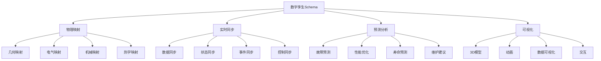

# 数字孪生Schema概述

## 📑 目录

- [数字孪生Schema概述](#数字孪生schema概述)
  - [📑 目录](#-目录)
  - [1. 核心结论](#1-核心结论)
    - [1.1 数字孪生Schema定义](#11-数字孪生schema定义)
    - [1.2 标准依据](#12-标准依据)
  - [2. 概念定义](#2-概念定义)
    - [2.1 数字孪生Schema定义](#21-数字孪生schema定义)
    - [2.2 核心特征](#22-核心特征)
    - [2.3 Schema与数字孪生的关系](#23-schema与数字孪生的关系)
  - [3. 数字孪生Schema结构](#3-数字孪生schema结构)
    - [3.1 物理映射Schema](#31-物理映射schema)
    - [3.2 实时同步Schema](#32-实时同步schema)
    - [3.3 预测分析Schema](#33-预测分析schema)
    - [3.4 可视化Schema](#34-可视化schema)
  - [4. 标准对标](#4-标准对标)
    - [4.1 国际标准](#41-国际标准)
    - [4.2 国家标准](#42-国家标准)
    - [4.3 行业标准](#43-行业标准)
  - [5. 应用场景](#5-应用场景)
    - [5.1 智能制造](#51-智能制造)
    - [5.2 预测维护](#52-预测维护)
    - [5.3 产品设计](#53-产品设计)
  - [6. 思维导图](#6-思维导图)

---

## 1. 核心结论

**数字孪生存在完整的Schema体系，实现物理到数字
的映射和同步**。

### 1.1 数字孪生Schema定义

```text
Digital_Twin_Schema = Physical_Schema ⊕ Digital_Model
                    ⊕ Synchronization ⊕ Analytics
                    ⊕ Visualization
```

### 1.2 标准依据

- **ISO/IEC 23247**：数字孪生参考架构标准
- **IEC 63278**：数字孪生系统标准
- **GB/T 41479**：数字孪生系统通用要求

---

## 2. 概念定义

### 2.1 数字孪生Schema定义

**数字孪生Schema**是描述物理设备在数字空间
的完整映射和同步的形式化规范，包括几何模型、
物理模型、行为模型、数据模型等。

### 2.2 核心特征

1. **物理映射**：物理到数字的完整映射
2. **实时同步**：物理与数字实时同步
3. **预测分析**：基于数字模型预测分析
4. **可视化**：三维可视化和交互
5. **形式化**：数学形式化定义

### 2.3 Schema与数字孪生的关系

- **Schema**：描述数字孪生结构（What）
- **模型**：实现数字孪生功能（How）
- **同步**：保持物理数字一致性（Sync）

---

## 3. 数字孪生Schema结构

### 3.1 物理映射Schema

**定义**：描述物理设备到数字模型的映射关系。

**包含内容**：

- 几何映射：3D模型映射
- 电气映射：电气特性映射
- 机械映射：机械特性映射
- 热学映射：热学特性映射

### 3.2 实时同步Schema

**定义**：描述物理设备与数字模型的实时同步。

**包含内容**：

- 数据同步：传感器数据同步
- 状态同步：设备状态同步
- 事件同步：设备事件同步
- 控制同步：控制指令同步

### 3.3 预测分析Schema

**定义**：描述基于数字模型的预测分析。

**包含内容**：

- 故障预测：设备故障预测
- 性能优化：设备性能优化
- 寿命预测：设备寿命预测
- 维护建议：维护策略建议

### 3.4 可视化Schema

**定义**：描述数字孪生的可视化表示。

**包含内容**：

- 3D模型：三维几何模型
- 动画：运动动画
- 数据可视化：数据图表
- 交互：用户交互

---

## 4. 标准对标

### 4.1 国际标准

- **ISO/IEC 23247**：数字孪生参考架构
- **IEC 63278**：数字孪生系统标准
- **ISO 10303**：产品数据表示和交换标准

### 4.2 国家标准

- **GB/T 41479-2022**：数字孪生系统通用要求
- **GB/T 41480-2022**：数字孪生系统功能要求
- **GB/T 41481-2022**：数字孪生系统测试要求

### 4.3 行业标准

- **IIC Digital Twin**：工业互联网联盟标准
- **OPC UA for Digital Twin**：OPC基金会标准
- **Digital Twin Consortium**：数字孪生联盟标准

---

## 5. 应用场景

### 5.1 智能制造

**场景描述**：

- 智能工厂数字孪生
- 生产线数字孪生
- 设备数字孪生

**价值**：

- 虚拟调试
- 生产优化
- 故障诊断

### 5.2 预测维护

**场景描述**：

- 设备健康监测
- 故障预测
- 维护计划优化

**价值**：

- 降低维护成本
- 提高设备可用性
- 延长设备寿命

### 5.3 产品设计

**场景描述**：

- 产品设计验证
- 性能仿真
- 优化设计

**价值**：

- 缩短设计周期
- 降低开发成本
- 提高产品质量

---

## 6. 思维导图



---

**参考文档**：

- `../README.md` - 主题概览
- `../Electrical_Schema/` - 电气Schema
- `../Mechanical_Schema/` - 机械Schema
- `../Thermal_Schema/` - 热学Schema
- `../CAD_Schema/` - CAD Schema
- `02_Formal_Definition.md` - 形式化定义
- `03_Standards.md` - 标准对标
- `04_Transformation.md` - 转换体系
- `05_Case_Studies.md` - 实践案例

**创建时间**：2025-01-21
**最后更新**：2025-01-21
