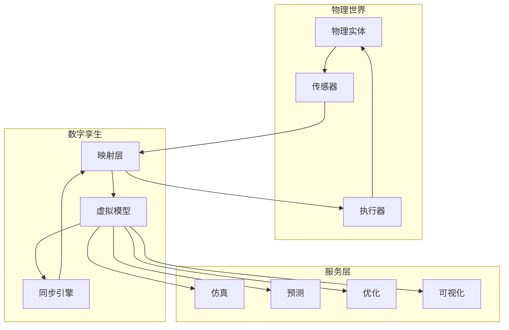
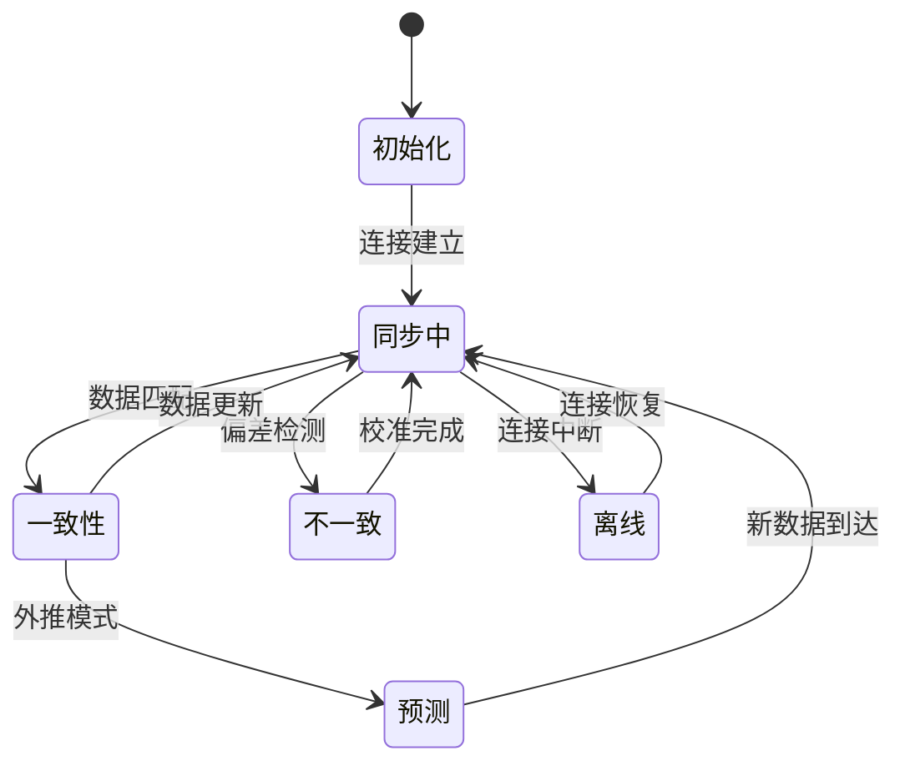

# 数字孪生Schema形式语法与语义分析视图

**版本**: v1.0
**创建日期**: 2026-02-15
**标准**: ISO/IEC 23247:2021, IEC 63278-1:2024

---

## 📑 目录

- [数字孪生Schema形式语法与语义分析视图](#数字孪生schema形式语法与语义分析视图)
  - [📑 目录](#-目录)
  - [1. 形式文法定义](#1-形式文法定义)
    - [1.1 数字孪生核心文法](#11-数字孪生核心文法)
    - [1.2 同步规则文法](#12-同步规则文法)
  - [2. 形式语义定义](#2-形式语义定义)
    - [2.1 物理-虚拟映射语义](#21-物理-虚拟映射语义)
    - [2.2 时间语义](#22-时间语义)
  - [3. 一致性规则](#3-一致性规则)
  - [4. Mermaid可视化](#4-mermaid可视化)
    - [4.1 数字孪生架构图](#41-数字孪生架构图)
    - [4.2 同步状态机](#42-同步状态机)

---

## 1. 形式文法定义

### 1.1 数字孪生核心文法

```ebnf
DigitalTwinSchema ::= '{'
    TwinIdentity ','
    PhysicalEntity ','
    VirtualEntity ','
    Connection ','
    Services?
'}'

TwinIdentity ::= '"id"' ':' String ','
                  '"name"' ':' String ','
                  '"version"' ':' Version ','
                  '"created"' ':' Timestamp ','
                  '"updated"' ':' Timestamp

PhysicalEntity ::= '"physical"' ':' '{'
    EntityType ','
    Identifier ','
    Properties ','
    Sensors ','
    Actuators?
'}'

EntityType ::= '"type"' ':'
    ('"machine"' | '"component"' | '"system"' | '"process"' | '"product"')

VirtualEntity ::= '"virtual"' ':' '{'
    ModelType ','
    Geometry? ','
    Physics? ','
    Behavior? ','
    Rules?
'}'

ModelType ::= '"models"' ':' '{'
    '"geometric"' ':' ModelRef ','
    '"physics"' ':' ModelRef ','
    '"behavior"' ':' ModelRef?
'}'

Connection ::= '"connection"' ':' '{'
    MappingRules ','
    Synchronization ','
    DataFlow
'}'

MappingRules ::= '"mappings"' ':' '[' Mapping {',' Mapping}* ']'

Mapping ::= '{'
    Source ','
    Target ','
    Transformation? ','
    Validation?
'}'

Source ::= '"source"' ':' '{'
    '"entity"' ':' ('"physical"' | '"virtual"') ','
    '"property"' ':' String
'}'

Target ::= '"target"' ':' '{'
    '"entity"' ':' ('"physical"' | '"virtual"') ','
    '"property"' ':' String
'}'

Transformation ::= '"transform"' ':'
    ('"identity"' | '"scale"' | '"offset"' | '"formula"' | '"ml_model"')

Synchronization ::= '"sync"' ':' '{'
    Mode ','
    Frequency ','
    Direction ','
    Latency?
'}'

Mode ::= '"mode"' ':'
    ('"realtime"' | '"near_realtime"' | '"periodic"' | '"on_demand"' | '"event_driven"')

Frequency ::= '"frequency"' ':' '{'
    '"value"' ':' Number ','
    '"unit"' ':' '"hz"'
'}'

Direction ::= '"direction"' ':'
    ('"p2v"' | '"v2p"' | '"bidirectional"')

Services ::= '"services"' ':' '[' Service {',' Service}* ']'

Service ::= '{'
    ServiceType ','
    Input ','
    Output ','
    Configuration?
'}'

ServiceType ::= '"type"' ':'
    ('"monitoring"' | '"simulation"' | '"prediction"' |
     '"optimization"' | '"visualization"' | '"control"')
```

### 1.2 同步规则文法

```ebnf
SyncRule ::= 'SYNC' SyncCondition 'THEN' SyncAction

SyncCondition ::=
    TimeCondition
  | EventCondition
  | DataCondition
  | CompositeCondition

TimeCondition ::= 'EVERY' Duration

EventCondition ::= 'ON' EventType

EventType ::=
    'PHYSICAL_CHANGE'
  | 'VIRTUAL_CHANGE'
  | 'EXTERNAL_TRIGGER'
  | 'ALARM'

DataCondition ::= 'WHEN' Expression

CompositeCondition ::= Condition ('AND' | 'OR') Condition

SyncAction ::=
    UpdateAction
  | CommandAction
  | NotifyAction

UpdateAction ::= 'UPDATE' Target 'WITH' Source

CommandAction ::= 'COMMAND' Device 'EXECUTE' Operation

NotifyAction ::= 'NOTIFY' Recipient 'MESSAGE' String
```

---

## 2. 形式语义定义

### 2.1 物理-虚拟映射语义

```
映射语义函数:

M[Mapping] : PhysicalState × VirtualState → (PhysicalState × VirtualState)

基本映射类型:

1. 恒等映射 (Identity)
   M_id(p, v) = (p, v[p.property ↦ p.value])

2. 比例映射 (Scale)
   M_scale(p, v, factor) = (p, v[p.property ↦ p.value × factor])

3. 偏移映射 (Offset)
   M_offset(p, v, delta) = (p, v[p.property ↦ p.value + delta])

4. 公式映射 (Formula)
   M_formula(p, v, f) = (p, v[p.property ↦ f(p.value)])

双向同步语义:
sync_bidirectional(p₀, v₀, Δt) =
    let p₁ = update_physical(p₀, Δt) in
    let v₁' = map_p2v(p₁) in
    let v₁ = update_virtual(v₀, v₁', Δt) in
    let p₁' = map_v2p(v₁) in
    (p₁', v₁)
```

### 2.2 时间语义

```
时间语义定义:

Timestamp = ℝ⁺  (* 非负实数，表示时间 *)

物理时间: t_p ∈ Timestamp
虚拟时间: t_v ∈ Timestamp

时间同步关系:
sync_time(t_p, t_v) = |t_p - t_v| ≤ ε

其中 ε 是允许的时间偏差阈值

延迟语义:
delay(t_send, t_receive) = t_receive - t_send

实时性分类:
- 硬实时: delay < 1ms
- 软实时: delay < 100ms
- 近实时: delay < 1s
- 非实时: delay ≥ 1s
```

---

## 3. 一致性规则

```
一致性约束:

1. 结构一致性
   structure(physical) ≅ structure(virtual)

2. 状态一致性
   |value(physical.property) - map(value(virtual.property))| < threshold

3. 时间一致性
   timestamp(physical) ≈ timestamp(virtual)

4. 行为一致性
   behavior(virtual) accurately models behavior(physical)
```

---

## 4. Mermaid可视化

### 4.1 数字孪生架构图



### 4.2 同步状态机



---

**维护者**: DSL Schema研究团队
