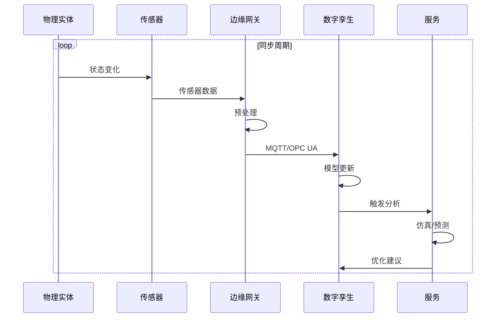
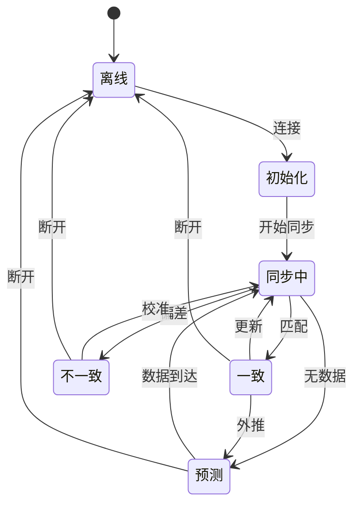

# 数字孪生Schema信息表征动态动作分析视图

**版本**: v1.0
**创建日期**: 2026-02-15

---

## 📑 目录

- [数字孪生Schema信息表征动态动作分析视图](#数字孪生schema信息表征动态动作分析视图)
  - [📑 目录](#-目录)
  - [1. 数字孪生数据流动态分析](#1-数字孪生数据流动态分析)
    - [1.1 数据同步流水线](#11-数据同步流水线)
    - [1.2 延迟分析](#12-延迟分析)
  - [2. 同步时序分析](#2-同步时序分析)
    - [2.1 实时同步时序](#21-实时同步时序)
    - [2.2 批量同步时序](#22-批量同步时序)
  - [3. 状态转换分析](#3-状态转换分析)
    - [3.1 数字孪生状态机](#31-数字孪生状态机)
    - [3.2 一致性维护](#32-一致性维护)
  - [4. Mermaid动态视图](#4-mermaid动态视图)
    - [4.1 数据同步时序](#41-数据同步时序)
    - [4.2 状态转换图](#42-状态转换图)

---

## 1. 数字孪生数据流动态分析

### 1.1 数据同步流水线

```text
物理实体          数据采集          边缘网关          数字孪生平台        应用服务
    │               │               │                 │               │
    │ 状态变化      │               │                 │               │
    ▼               ▼               │                 │               │
┌─────────┐   ┌─────────┐          │                 │               │
│ 传感器  │──▶│ 边缘计算 │          │                 │               │
│ 数据    │   │ 预处理  │          │                 │               │
└─────────┘   └─────────┘          │                 │               │
                    │              │                 │               │
                    │ 流数据       │                 │               │
                    ▼              ▼                 │               │
                              ┌─────────┐           │               │
                              │ 协议转换 │           │               │
                              │ MQTT/OPC│──────────▶│               │
                              └─────────┘           │               │
                                                    │               │
                                                    │ 映射转换      │
                                                    ▼               │
                                              ┌─────────┐         │
                                              │ 虚拟模型 │         │
                                              │ 更新    │         │
                                              └─────────┘         │
                                                    │             │
                                                    │ 状态变化    │
                                                    ▼             │
                                              ┌─────────┐       │
                                              │ 仿真分析 │       │
                                              │ 预测优化 │       │
                                              └─────────┘       │
                                                    │           │
                                                    │ 结果      │
                                                    ▼           │
                                              ┌─────────┐     │
                                              │ 可视化  │     │
                                              │ 控制决策│────▶│
                                              └─────────┘     │
                                                              │
                                                              ▼
                                                        ┌─────────┐
                                                        │ 物理实体│
                                                        │ 控制    │
                                                        └─────────┘
```

### 1.2 延迟分析

```text
端到端同步延迟:

T_total = T_sensor + T_edge + T_network + T_platform + T_processing

T_sensor: 传感器采样 + 传输到边缘 (1-100ms)
T_edge: 边缘处理 + 协议转换 (10-500ms)
T_network: 网络传输 (10-1000ms, 取决于网络)
T_platform: 平台接收 + 模型更新 (10-500ms)
T_processing: 仿真/分析/优化 (100-5000ms)

总延迟范围: 131ms - 6.1s
```

---

## 2. 同步时序分析

### 2.1 实时同步时序

```text
时间(ms): 0   10   20   30   40   50   60   70   80   90  100
          │    │    │    │    │    │    │    │    │    │
物理采样: █    █    █    █    █    █    █    █    █    █  (100Hz)
          │    │    │    │    │    │    │    │    │    │
数据传输:      ██████     ██████     ██████     ██████
          │         │         │         │         │
模型更新:           ████           ████           ████
          │              │              │
仿真计算:                ████████            ████████
          │                       │
可视化:                              ████████████████

总延迟: ~50ms (近实时)
```

### 2.2 批量同步时序

```text
时间(s): 0    5    10   15   20   25   30   35   40   45   50
          │    │    │    │    │    │    │    │    │    │
数据采集: ██████
          (收集5秒数据)
               │
               ▼
          数据压缩
               │
               ▼
          批量上传 ██████
                         │
                         ▼
                    模型更新    ██████
                                     │
                                     ▼
                                分析处理    ████████
```

---

## 3. 状态转换分析

### 3.1 数字孪生状态机

```text
状态: {离线, 初始化, 同步中, 一致, 预测, 不一致, 错误}

转换:
离线 → 初始化: 连接建立
初始化 → 同步中: 首次数据同步
同步中 → 一致: 数据匹配
同步中 → 不一致: 偏差超限
一致 → 同步中: 新数据到达
一致 → 预测: 外推模式
预测 → 同步中: 新数据校正
不一致 → 同步中: 校准完成
任何 → 错误: 异常
错误 → 离线: 关闭
```

### 3.2 一致性维护

```text
一致性检查周期:

实时模式: 每10ms检查
近实时: 每100ms检查
周期性: 每1s检查
事件驱动: 变化时检查

偏差处理:
- 轻微偏差 (<1%): 平滑过渡
- 中等偏差 (1-5%): 快速同步
- 严重偏差 (>5%): 告警 + 人工介入
```

---

## 4. Mermaid动态视图

### 4.1 数据同步时序



### 4.2 状态转换图



---

**维护者**: DSL Schema研究团队
