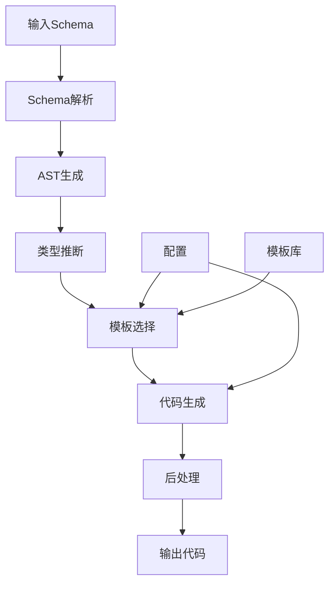
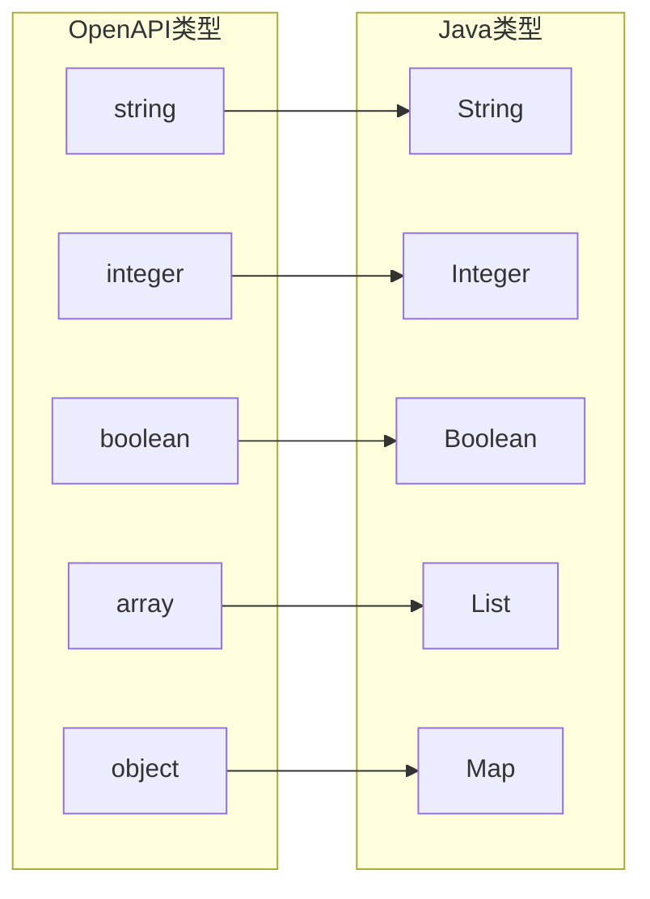

# 代码生成Schema形式语法与语义分析视图

**版本**: v1.0
**创建日期**: 2026-02-15
**标准**: OMG MDA, OpenAPI Specification 3.1.1

---

## 📑 目录

- [代码生成Schema形式语法与语义分析视图](#代码生成schema形式语法与语义分析视图)
  - [📑 目录](#-目录)
  - [1. 形式文法定义](#1-形式文法定义)
    - [1.1 代码生成核心文法](#11-代码生成核心文法)
  - [2. 转换语义](#2-转换语义)
    - [2.1 Schema到代码转换语义](#21-schema到代码转换语义)
    - [2.2 模板应用语义](#22-模板应用语义)
  - [3. 类型映射语义](#3-类型映射语义)
    - [3.1 类型映射函数](#31-类型映射函数)
    - [3.2 复合类型映射](#32-复合类型映射)
  - [4. Mermaid可视化](#4-mermaid可视化)
    - [4.1 代码生成流程](#41-代码生成流程)
    - [4.2 类型映射图](#42-类型映射图)

---

## 1. 形式文法定义

### 1.1 代码生成核心文法

```ebnf
CodeGenerationSchema ::= '{'
    SourceSchema ','
    TargetLanguage ','
    TransformationRules ','
    GeneratorConfig?
'}'

SourceSchema ::= '"source"' ':'
    OpenAPISchema | JSONSchema | ProtobufSchema | XMLSchema

TargetLanguage ::= '"target"' ':'
    ('"java"' | '"python"' | '"typescript"' | '"go"' | '"rust"' |
     '"csharp"' | '"cpp"' | '"kotlin"' | '"swift"')

TransformationRules ::= '"rules"' ':' '[' Rule {',' Rule}* ']'

Rule ::= '{'
    Pattern ','
    Template ','
    Condition?
'}'

Pattern ::= '"pattern"' ':' '{' TypePattern ',' NamePattern? '}'

TypePattern ::= '"type"' ':' String

Template ::= '"template"' ':' String

GeneratorConfig ::= '"config"' ':' '{'
    PackageName? ','
    NamingConvention? ','
    IndentStyle? ','
    LicenseHeader?
'}'
```

---

## 2. 转换语义

### 2.1 Schema到代码转换语义

```text
转换函数语义:

T: Schema → Code

T(schema) = generate(parse(schema), templates, config)

其中:
- parse: 解析Schema为AST
- generate: 应用模板生成代码
- templates: 目标语言模板库
- config: 生成器配置

转换正确性:
∀s ∈ Schema: syntactically_valid(T(s)) ∧ semantically_equivalent(s, T(s))
```

### 2.2 模板应用语义

```text
模板替换语义:

template = "class {{name}} { {{#fields}}{{type}} {{name}};{{/fields}} }"

data = { name: "User", fields: [{type: "String", name: "username"}] }

apply(template, data) = "class User { String username; }"
```

---

## 3. 类型映射语义

### 3.1 类型映射函数

```text
类型映射: TypeMap(SourceType, TargetLang) → TargetType

TypeMap("string", "java") = "String"
TypeMap("string", "python") = "str"
TypeMap("string", "go") = "string"
TypeMap("integer", "java") = "Integer"
TypeMap("integer", "python") = "int"
TypeMap("array", "java") = "List<T>"
TypeMap("object", "python") = "Dict[str, Any]"
```

### 3.2 复合类型映射

```text
数组映射:
TypeMap([T], java) = List<TypeMap(T, java)>

对象映射:
TypeMap({k: V}, java) = Map<String, TypeMap(V, java)>

可选类型:
TypeMap(T?, java) = Optional<TypeMap(T, java)>
```

---

## 4. Mermaid可视化

### 4.1 代码生成流程



### 4.2 类型映射图



---

**维护者**: DSL Schema研究团队
