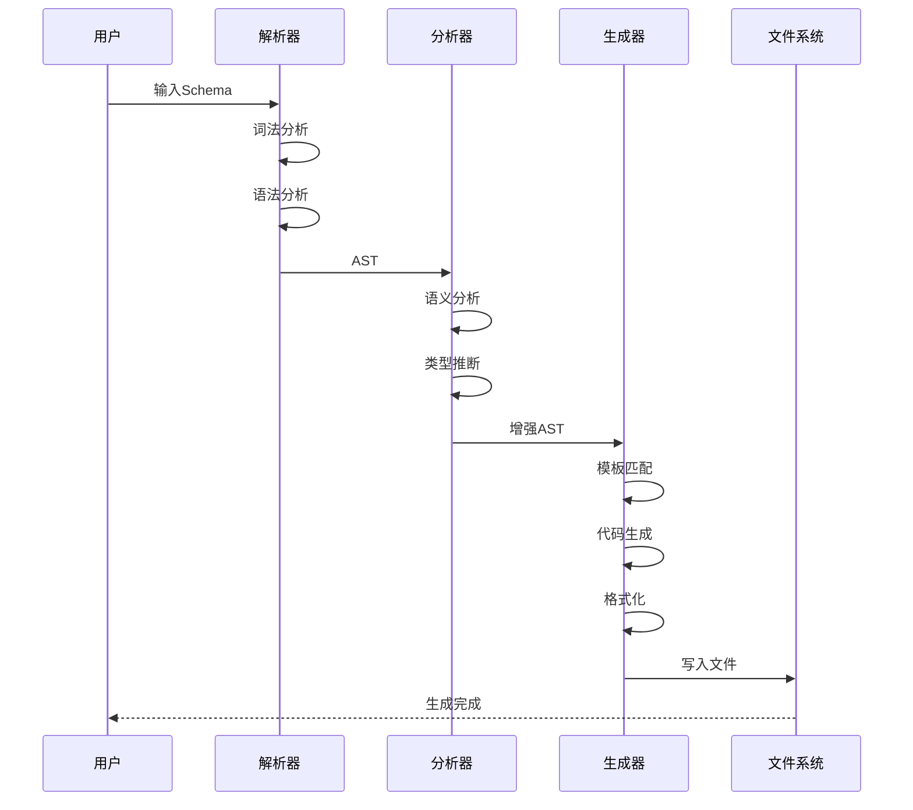
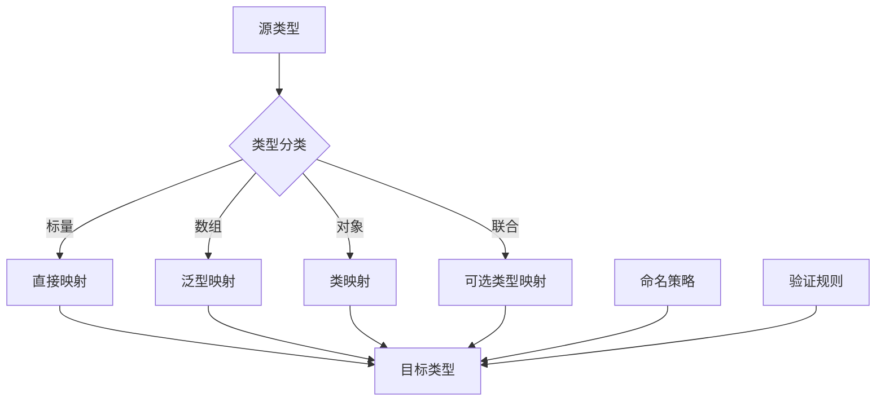

# 代码生成Schema信息表征动态动作分析视图

**版本**: v1.0
**创建日期**: 2026-02-15

---

## 📑 目录

- [代码生成Schema信息表征动态动作分析视图](#代码生成schema信息表征动态动作分析视图)
  - [📑 目录](#-目录)
  - [1. 代码生成流水线动态分析](#1-代码生成流水线动态分析)
    - [1.1 生成流水线](#11-生成流水线)
    - [1.2 性能分析](#12-性能分析)
  - [2. 转换时序分析](#2-转换时序分析)
    - [2.1 增量生成时序](#21-增量生成时序)
  - [3. Mermaid动态视图](#3-mermaid动态视图)
    - [3.1 代码生成时序](#31-代码生成时序)
    - [3.2 类型转换流程](#32-类型转换流程)

---

## 1. 代码生成流水线动态分析

### 1.1 生成流水线

```text
输入                解析               分析               生成               输出
 │                  │                 │                 │                 │
 │ Schema文件       │                 │                 │                 │
 ▼                  ▼                 │                 │                 │
┌─────────┐    ┌─────────┐           │                 │                 │
│ OpenAPI │───▶│ 解析器  │           │                 │                 │
│ JSON    │    │ 词法分析 │           │                 │                 │
│ Protobuf│    │ 语法分析 │           │                 │                 │
└─────────┘    └─────────┘           │                 │                 │
                      │              │                 │                 │
                      │ AST          │                 │                 │
                      ▼              ▼                 │                 │
                                ┌─────────┐           │                 │
                                │ 语义分析 │           │                 │
                                │ 类型检查 │           │                 │
                                │ 引用解析 │           │                 │
                                └─────────┘           │                 │
                                      │               │                 │
                                      │ 增强AST       │                 │
                                      ▼               ▼                 │
                                                ┌─────────┐           │
                                                │ 模板引擎 │           │
                                                │ 代码生成 │           │
                                                └─────────┘           │
                                                      │               │
                                                      │ 源代码        │
                                                      ▼               │
                                                ┌─────────┐         │
                                                │ 后处理  │         │
                                                │ 格式化  │         │
                                                │ 优化    │         │
                                                └─────────┘         │
                                                      │             │
                                                      │ 最终代码    │
                                                      ▼             │
                                                ┌─────────┐       │
                                                │ 输出文件│       │
                                                │ .java   │       │
                                                │ .py     │       │
                                                └─────────┘       │
                                                                    │
                                                                    ▼
                                                              ┌─────────┐
                                                              │ 编译/使用│
                                                              └─────────┘
```

### 1.2 性能分析

```text
代码生成各阶段时间占比:

解析阶段:    10% (10-100ms)
分析阶段:    20% (20-200ms)
生成阶段:    50% (50-500ms)
后处理阶段:  20% (20-200ms)

总时间: 100ms - 1s (取决于Schema复杂度)
```

---

## 2. 转换时序分析

### 2.1 增量生成时序

```text
时间:     t0   t1   t2   t3   t4   t5   t6   t7   t8
          │    │    │    │    │    │    │    │    │
Schema    ██████████████████████████████████████████
变化:         ▲              ▲              ▲
          初始           修改A          修改B

生成:      ████████              ████████    ████████
          (全量)              (增量A)     (增量B)

增量检测:       │              │              │
              diff          diff           diff
               │              │              │
受影响文件:     │              │              │
              3个            1个            2个
```

---

## 3. Mermaid动态视图

### 3.1 代码生成时序



### 3.2 类型转换流程



---

**维护者**: DSL Schema研究团队
