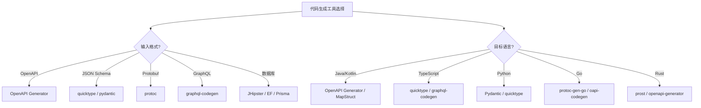
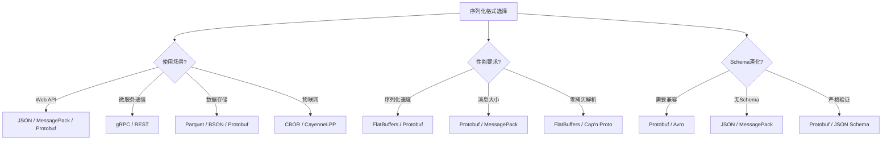

# 编程语言转换决策树图

**版本**: v1.0  
**创建日期**: 2026-02-15  
**适用范围**: 编程语言转换和代码生成决策

---

## 📑 目录

- [1. 代码生成工具选择决策树](#1-代码生成工具选择决策树)
- [2. 序列化格式选择决策树](#2-序列化格式选择决策树)
- [3. 类型系统映射决策树](#3-类型系统映射决策树)
- [4. Mermaid可视化](#4-mermaid可视化)

---

## 1. 代码生成工具选择决策树

```text
开始: 选择代码生成工具
│
├─ 输入格式?
│   ├─ OpenAPI/Swagger
│   │   ├─ OpenAPI Generator
│   │   │   ├─ 支持50+语言
│   │   │   ├─ 客户端+服务端
│   │   │   └─ 高度可定制
│   │   │
│   │   ├─ Swagger Codegen
│   │   │   └─ OpenAPI Generator的分支
│   │   │
│   │   └─ NSwag (.NET专用)
│   │
│   ├─ JSON Schema
│   │   ├─ quicktype
│   │   │   ├─ 多语言支持
│   │   │   ├─ 类型推导
│   │   │   └─ 简单易用
│   │   │
│   │   ├─ jsonschema2pojo (Java)
│   │   └─ pydantic (Python专用)
│   │
│   ├─ Protocol Buffers
│   │   ├─ protoc
│   │   │   ├─ 官方编译器
│   │   │   ├─ 多语言插件
│   │   │   └─ gRPC集成
│   │   │
│   │   └─ protobuf.js / protobuf-python
│   │
│   ├─ GraphQL
│   │   ├─ graphql-codegen
│   │   │   ├─ TypeScript优先
│   │   │   ├─ 客户端代码生成
│   │   │   └─ 插件丰富
│   │   │
│   │   └─ Apollo CLI
│   │
│   ├─ 数据库Schema
│   │   ├─ JHipster (Java)
│   │   ├─ Entity Framework (.NET)
│   │   ├─ SQLAlchemy ORM (Python)
│   │   └─ Prisma (TypeScript/Node)
│   │
│   └─ UML/模型
│       ├─ Enterprise Architect
│       ├─ MagicDraw
│       └─ Eclipse EMF/Acceleo
│
├─ 目标语言?
│   ├─ Java/Kotlin
│   │   ├─ OpenAPI Generator
│   │   ├─ MapStruct (DTO映射)
│   │   └─ Lombok (代码简化)
│   │
│   ├─ TypeScript/JavaScript
│   │   ├─ quicktype
│   │   ├─ graphql-codegen
│   │   └─ tRPC (类型安全API)
│   │
│   ├─ Python
│   │   ├─ dataclasses + mypy
│   │   ├─ Pydantic
│   │   ├─ quicktype
│   │   └─ SQLAlchemy ORM
│   │
│   ├─ Go
│   │   ├─ protoc-gen-go
│   │   ├─ oapi-codegen (OpenAPI)
│   │   └─ sqlc (SQL生成)
│   │
│   ├─ Rust
│   │   ├─ prost (Protobuf)
│   │   ├─ openapi-generator
│   │   ├─ serde (序列化)
│   │   └─ diesel (ORM)
│   │
│   ├─ C++
│   │   ├─ protoc-gen-cpp
│   │   ├─ oatpp (Web框架)
│   │   └─ cpp-httplib
│   │
│   └─ C#
│       ├─ NSwag
│       ├─ AutoMapper
│       └─ Entity Framework
│
├─ 集成需求?
│   ├─ CI/CD集成
│   │   ├─ 命令行工具
│   │   ├─ Docker镜像
│   │   └─ GitHub Actions插件
│   │
│   ├─ IDE集成
│   │   ├─ VS Code插件
│   │   ├─ IntelliJ插件
│   │   └─ 实时生成
│   │
│   └─ 构建工具集成
│       ├─ Maven/Gradle (Java)
│       ├─ npm/yarn (Node)
│       ├─ Cargo (Rust)
│       └─ Go modules
│
└─ 定制化需求?
    ├─ 模板定制
    │   ├─ Mustache模板
    │   ├─ Handlebars模板
    │   └─ 自定义模板引擎
    │
    ├─ 插件扩展
    │   ├─ 自定义生成器
    │   └─ 后处理器
    │
    └─ 企业定制
        ├─ 代码风格
        ├─ 注释规范
        └─ 框架集成
```

---

## 2. 序列化格式选择决策树

```text
开始: 选择序列化格式
│
├─ 使用场景?
│   ├─ Web API
│   │   ├─ 人机可读 → JSON
│   │   ├─ 高性能 → MessagePack
│   │   └─ 强类型 → Protocol Buffers
│   │
│   ├─ 微服务通信
│   │   ├─ gRPC → Protocol Buffers
│   │   ├─ REST → JSON
│   │   └─ 消息队列 → Avro/Protobuf
│   │
│   ├─ 数据存储
│   │   ├─ 文档存储 → BSON (MongoDB)
│   │   ├─ 列存储 → Parquet
│   │   ├─ 时序数据 → Protobuf/FlatBuffers
│   │   └─ 缓存 → JSON/MessagePack
│   │
│   ├─ 配置管理
│   │   ├─ 简单配置 → JSON/YAML
│   │   ├─ 复杂配置 → HOCON/CUE
│   │   └─ 类型安全 → Dhall
│   │
│   └─ 物联网/嵌入式
│       ├─ 极低资源 → CBOR
│       ├─ 低功耗LoRa → CayenneLPP
│       └─ 工业协议 → Protobuf/ASN.1
│
├─ 性能要求?
│   ├─ 序列化速度
│   │   ├─ 最快 → FlatBuffers
│   │   ├─ 很快 → Cap'n Proto/Protobuf
│   │   ├─ 中等 → JSON/MessagePack
│   │   └─ 较慢 → XML
│   │
│   ├─ 消息大小
│   │   ├─ 最小 → Protocol Buffers
│   │   ├─ 小 → MessagePack/CBOR
│   │   ├─ 中等 → JSON
│   │   └─ 大 → XML
│   │
│   ├─ 解析速度
│   │   ├─ 零拷贝 → FlatBuffers/Cap'n Proto
│   │   ├─ 快 → Protobuf/simdjson
│   │   └─ 一般 → 标准库解析
│   │
│   └─ 内存占用
│       ├─ 极低 → FlatBuffers
│       ├─ 低 → Protobuf
│       └─ 可接受 → JSON
│
├─ Schema演化?
│   ├─ 向前兼容 (新代码读旧数据)
│   │   ├─ Protocol Buffers
│   │   ├─ Avro
│   │   └─ Thrift
│   │
│   ├─ 向后兼容 (旧代码读新数据)
│   │   ├─ Protocol Buffers
│   │   └─ Avro (with defaults)
│   │
│   ├─ 无Schema要求
│   │   ├─ JSON
│   │   ├─ MessagePack
│   │   └─ CBOR
│   │
│   └─ 严格Schema验证
│       ├─ JSON Schema
│       ├─ Protobuf
│       └─ XSD (XML)
│
├─ 语言支持?
│   ├─ 多语言项目
│   │   ├─ Protocol Buffers (10+语言)
│   │   ├─ JSON (所有语言)
│   │   ├─ Avro (JVM生态强)
│   │   └─ Thrift (Facebook生态)
│   │
│   ├─ 单一语言
│   │   ├─ Java → Protobuf/Kryo
│   │   ├─ Python → Pydantic/dataclasses
│   │   ├─ Go → Protobuf/json
│   │   └─ Rust → Serde + 任意格式
│   │
│   └─ 特定平台
│       ├─ JavaScript → JSON
│       ├─ Embedded → CBOR/Protobuf-nanopb
│       └─ GPU → FlatBuffers
│
└─ 生态系统?
    ├─ RPC框架集成
    │   ├─ gRPC → Protobuf
    │   ├─ Thrift → Thrift IDL
    │   ├─ Cap'n Proto RPC → Cap'n Proto
    │   └─ REST → JSON
    │
    ├─ 消息队列
    │   ├─ Kafka → Avro/Protobuf/JSON
    │   ├─ Pulsar → Avro/Protobuf
    │   └─ RabbitMQ → JSON/MessagePack
    │
    └─ 数据库
        ├─ PostgreSQL → JSONB
        ├─ MongoDB → BSON
        └─ Redis → JSON/MessagePack
```

---

## 3. 类型系统映射决策树

```text
开始: 类型系统映射策略
│
├─ 源类型系统?
│   ├─ JSON Schema
│   │   ├─ 类型推断
│   │   │   ├─ "type": 明确类型
│   │   │   ├─ "enum": 枚举类型
│   │   │   └─ "oneOf": 联合类型
│   │   │
│   │   ├─ 约束映射
│   │   │   ├─ "minimum/maximum" → 范围类型
│   │   │   ├─ "pattern" → 正则验证
│   │   │   ├─ "minLength/maxLength" → 长度约束
│   │   │   └─ "required" → 非空/可选
│   │   │
│   │   └─ 高级特性
│   │       ├─ "$ref" → 类型引用/导入
│   │       ├─ "allOf" → 继承/组合
│   │       └─ "anyOf/oneOf" → 联合/互斥类型
│   │
│   ├─ Protocol Buffers
│   │   ├─ 标量类型映射
│   │   │   ├─ double/float → 浮点
│   │   │   ├─ int32/int64 → 整数
│   │   │   ├─ string → 字符串
│   │   │   ├─ bytes → 字节数组
│   │   │   └─ bool → 布尔
│   │   │
│   │   ├─ 复合类型
│   │   │   ├─ message → struct/class
│   │   │   ├─ enum → 枚举
│   │   │   └─ map<K,V> → Map/Dict
│   │   │
│   │   └─ 特殊处理
│   │       ├─ optional → Optional/Nullable
│   │       ├─ repeated → Array/List
│   │       ├─ oneof → 联合类型/继承
│   │       └─ 字段编号 → 序列化顺序
│   │
│   ├─ GraphQL
│   │   ├─ Scalar类型
│   │   │   ├─ Int → 整数
│   │   │   ├─ Float → 浮点
│   │   │   ├─ String → 字符串
│   │   │   ├─ Boolean → 布尔
│   │   │   └─ ID → 标识符类型
│   │   │
│   │   ├─ Object类型 → 对象/类
│   │   ├─ Interface → 接口
│   │   ├─ Union → 联合类型
│   │   └─ Enum → 枚举
│   │
│   └─ SQL/数据库
│       ├─ 数值类型
│       │   ├─ INTEGER → int/long
│       │   ├─ DECIMAL/NUMERIC → BigDecimal
│       │   └─ FLOAT/DOUBLE → float/double
│       │
│       ├─ 字符串类型
│       │   ├─ VARCHAR → String
│       │   ├─ TEXT → String
│       │   └─ CHAR → 固定长度String
│       │
│       ├─ 日期时间
│       │   ├─ DATE → LocalDate
│       │   ├─ TIME → LocalTime
│       │   ├─ TIMESTAMP → Instant/DateTime
│       │   └─ INTERVAL → Duration
│       │
│       ├─ 二进制
│       │   └─ BLOB/BYTEA → byte[]
│       │
│       └─ 特殊类型
│           ├─ JSON/JSONB → 对象类型
│           ├─ ARRAY → 数组类型
│           └─ ENUM → 枚举类型
│
├─ 目标语言?
│   ├─ Java
│   │   ├─ 基本类型 → 包装类
│   │   ├─ 可选字段 → Optional<T>
│   │   ├─ 集合 → List/Set/Map
│   │   ├─ 日期 → java.time.*
│   │   ├─ 验证 → Bean Validation
│   │   └─ 构建器 → Lombok @Builder
│   │
│   ├─ TypeScript
│   │   ├─ 可选字段 → property?: type
│   │   ├─ 联合类型 → type1 | type2
│   │   ├─ 交集类型 → type1 & type2
│   │   ├─ 泛型 → <T>
│   │   ├─ 工具类型 → Partial/Required/Pick/Omit
│   │   └─ 运行时验证 → io-ts/zod
│   │
│   ├─ Python
│   │   ├─ 类型注解 → type hints
│   │   ├─ 可选 → Optional[T]
│   │   ├─ 联合 → Union[T1, T2]
│   │   ├─ 数据类 → @dataclass
│   │   ├─ 验证 → Pydantic
│   │   └─ 枚举 → Enum
│   │
│   ├─ Go
│   │   ├─ 零值处理
│   │   ├─ 指针 → 可选语义
│   │   ├─ 切片 → 数组
│   │   ├─ 映射 → Map
│   │   ├─ 接口 → 多态
│   │   └─ 结构体标签 → 序列化元数据
│   │
│   ├─ Rust
│   │   ├─ Option<T> → 可选
│   │   ├─ Result<T,E> → 错误处理
│   │   ├─ Vec<T> → 数组
│   │   ├─ HashMap<K,V> → 映射
│   │   ├─ trait → 接口/抽象
│   │   └─ 生命周期 → 借用检查
│   │
│   └─ C#
│       ├─ 可空类型 → int?
│       ├─ 集合 → List/Dictionary
│       ├─ 记录 → record
│       ├─ 属性验证 → DataAnnotations
│       └─ 异步 → async/await
│
├─ 特殊映射场景?
│   ├─ 多态/继承
│   │   ├─ 单表继承
│   │   ├─ 类表继承
│   │   ├─ 鉴别器字段
│   │   └─ 联合类型
│   │
│   ├─ 循环引用
│   │   ├─ 打破循环 (ID引用)
│   │   └─ 延迟加载
│   │
│   ├─ 泛型/模板
│   │   ├─ 类型擦除 (Java)
│   │   ├─ 具体化 (C#/TypeScript)
│   │   └─ 单态化 (Rust/C++)
│   │
│   └─ 跨语言兼容
│       ├─ 64位整数 (JavaScript处理)
│       ├─ 浮点精度
│       ├─ 字符编码
│       └─ 时区处理
│
└─ 验证策略?
    ├─ 编译时验证
    │   ├─ 静态类型检查
    │   └─ 编译期约束
    │
    ├─ 运行时验证
    │   ├─ 反序列化验证
    │   ├─ 业务规则验证
    │   └─ 自定义校验器
    │
    └─ 两者结合
        ├─ 类型安全 + 值验证
        └─ 编译时尽可能多，运行时兜底
```

---

## 4. Mermaid可视化

### 4.1 代码生成工具选择流程图



### 4.2 序列化格式选择流程图



---

**参考文档**:
- `README.md` - 主题概览
- `Code_Generation/03_Standards.md` - 代码生成标准
- `Serialization_Schema/03_Standards.md` - 序列化标准

**维护者**: DSL Schema研究团队
