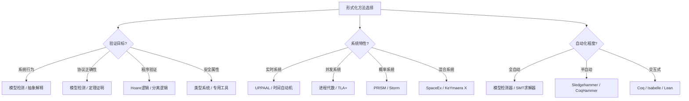
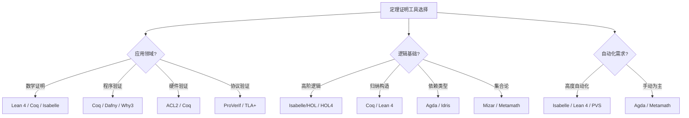
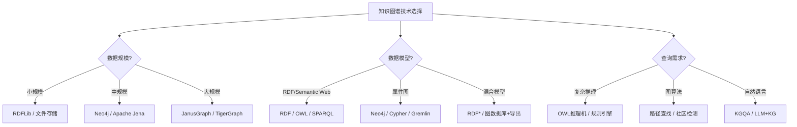

# DSL理论决策树图

**版本**: v1.0
**创建日期**: 2026-02-15
**适用范围**: DSL设计理论选择和形式化方法决策

---

## 📑 目录

- [DSL理论决策树图](#dsl理论决策树图)
  - [📑 目录](#-目录)
  - [1. 形式化方法选择决策树](#1-形式化方法选择决策树)
  - [2. 证明工具选择决策树](#2-证明工具选择决策树)
  - [3. 知识图谱技术选择决策树](#3-知识图谱技术选择决策树)
  - [4. Mermaid可视化](#4-mermaid可视化)
    - [4.1 形式化方法选择流程图](#41-形式化方法选择流程图)
    - [4.2 定理证明工具选择流程图](#42-定理证明工具选择流程图)
    - [4.3 知识图谱技术选择流程图](#43-知识图谱技术选择流程图)

---

## 1. 形式化方法选择决策树

```text
开始: 选择形式化方法
│
├─ 验证目标?
│   ├─ 系统行为验证
│   │   ├─ 状态空间小 → 模型检测 (Model Checking)
│   │   │   ├─ 显式状态: SPIN, PAT
│   │   │   ├─ 符号模型: NuSMV, nuXmv
│   │   │   └─ 实时系统: UPPAAL
│   │   │
│   │   └─ 状态空间大 → 抽象解释 (Abstract Interpretation)
│   │       ├─ 静态分析: Astrée, Polyspace
│   │       └─ 定理证明: Frama-C
│   │
│   ├─ 协议/算法正确性
│   │   ├─ 有限状态 → 模型检测
│   │   │   └─ TLA+, Alloy
│   │   │
│   │   └─ 参数化/无限状态 → 定理证明
│   │       ├─ 交互式: Isabelle/HOL, Coq
│   │       └─ 自动: Vampire, Z3
│   │
│   ├─ 程序验证
│   │   ├─ 自动验证
│   │   │   ├─ Hoare逻辑: Dafny, Why3
│   │   │   ├─ 分离逻辑: Infer, VeriFast
│   │   │   └─ SMT求解: Boogie, VCC
│   │   │
│   │   └─ 交互式验证
│   │       ├─ Coq: 高确信度，学习曲线陡
│   │       ├─ Isabelle/HOL: 自动化较好
│   │       ├─ Lean 4: 现代，数学友好
│   │       └─ Agda: 依赖类型，构造主义
│   │
│   └─ 安全属性验证
│       ├─ 信息流 → 类型系统: JIF, FlowCaml
│       ├─ 访问控制 → 逻辑: SecPAL, XACML
│       └─ 密码协议 → 专用工具: ProVerif, Tamarin
│
├─ 系统特性?
│   ├─ 实时系统
│   │   ├─ 时间自动机: UPPAAL
│   │   ├─ 时间Petri网: Tina
│   │   └─ 实时逻辑: RTL, TCTL
│   │
│   ├─ 并发系统
│   │   ├─ 进程代数: CSP (FDR4), CCS
│   │   ├─ 通信系统: π-calculus
│   │   └─ Actor模型: Rebeca
│   │
│   ├─ 概率系统
│   │   ├─ 马尔可夫链: PRISM, Storm
│   │   └─ 概率模型检测: MRMC
│   │
│   ├─ 混合系统 (离散+连续)
│   │   ├─ 混成自动机: SpaceEx, HyTech
│   │   └─ 微分动态逻辑: KeYmaera X
│   │
│   └─ 分布式系统
│       ├─ TLA+: 规范和验证
│       ├─ Event-B: 逐步精化
│       └─ PlusCal: TLA+的算法语言
│
├─ 自动化程度?
│   ├─ 全自动
│   │   ├─ 模型检测器
│   │   ├─ SMT求解器 (Z3, CVC5)
│   │   └─ 符号执行 (KLEE, angr)
│   │
│   ├─ 半自动 (人机交互)
│   │   ├─ Sledgehammer (Isabelle)
│   │   ├─ CoqHammer
│   │   └─ auto tactics
│   │
│   └─ 交互式
│       ├─ 完全手动证明
│       └─ 高确信度需求
│
└─ 团队专长?
    ├─ 逻辑背景强
    │   ├─ 高阶逻辑 → Isabelle/HOL
    │   ├─ 类型论 → Coq, Agda
    │   └─ 集合论 → TLA+, Event-B
    │
    ├─ 编程背景强
    │   ├─ OCaml → Coq
    │   ├─ Haskell → Isabelle, Agda
    │   ├─ Scala → Stainless
    │   └─ Python → Z3 Py, CrossHair
    │
    └─ 工程背景强
        ├─ 模型检测 → UPPAAL, SPIN
        ├─ 抽象解释 → Astree
        └─ 符号执行 → KLEE
```

---

## 2. 证明工具选择决策树

```text
开始: 选择定理证明工具
│
├─ 应用领域?
│   ├─ 数学证明
│   │   ├─ 代数 → Lean 4, Coq
│   │   ├─ 分析 → Isabelle/HOL
│   │   ├─ 拓扑 → Mizar
│   │   └─ 数论 → Lean 4
│   │
│   ├─ 程序验证
│   │   ├─ 函数式程序 → Coq, Agda
│   │   ├─ 命令式程序 → Why3, Dafny
│   │   ├─ 系统软件 → Isabelle/LLVM
│   │   └─ 并发程序 → Iris (Coq框架)
│   │
│   ├─ 硬件验证
│   │   ├─ 组合逻辑 → ACL2
│   │   ├─ 时序逻辑 → PSL, SVA
│   │   └─ 系统级 → Coq + Bluespec
│   │
│   └─ 协议验证
│       ├─ 安全协议 → ProVerif, Tamarin
│       ├─ 分布式算法 → TLA+, Event-B
│       └─ 网络协议 → Coq, Isabelle
│
├─ 逻辑基础?
│   ├─ 高阶逻辑 (HOL)
│   │   ├─ Isabelle/HOL
│   │   │   ├─ 自动化好 (Sledgehammer)
│   │   │   ├─ 库丰富 (Archive of Formal Proofs)
│   │   │   ├─ 可读性高 (Isar)
│   │   │   └─ 应用: 系统验证，数学
│   │   │
│   │   └─ HOL4
│   │       └─ 英国传统，硬件验证强
│   │
│   ├─ 归纳构造演算 (CiC)
│   │   ├─ Coq
│   │   │   ├─ 依赖类型
│   │   │   ├─ 提取可执行代码
│   │   │   ├─ 插件生态 (SSReflect, Iris)
│   │   │   └─ 应用: CompCert, 数学基础
│   │   │
│   │   └─ Lean 4
│   │       ├─ 现代设计
│   │       ├─ 元编程 (宏系统)
│   │       ├─ 自动化 (Aesop, LeanInfer)
│   │       └─ Mathlib: 大规模数学库
│   │
│   ├─ 依赖类型 (Martin-Löf)
│   │   ├─ Agda
│   │   │   ├─ 纯函数式
│   │   │   ├─ 证明即程序
│   │   │   └─ 类型驱动开发
│   │   │
│   │   └─ Idris
│   │       ├─ 实用编程语言
│   │       └─ 效果系统
│   │
│   └─ 集合论/ZFC
│       ├─ Mizar
│       │   ├─ 最古老，数学库最大
│       │   └─ 自然语言风格证明
│       │
│       ├─ Metamath
│       │   └─ 极简主义，可验证
│       │
│       └─ Isabelle/ZF
│           └─ 较少使用
│
├─ 自动化需求?
│   ├─ 高度自动化
│   │   ├─ Isabelle (Sledgehammer)
│   │   ├─ Lean 4 (Aesop, tactics)
│   │   └─ PVS (决策过程)
│   │
│   ├─ 中等自动化
│   │   ├─ Coq (auto, eauto)
│   │   └─ ACL2 (启发式)
│   │
│   └─ 手动为主
│       ├─ Agda (tactic少)
│       └─ Metamath
│
├─ 代码提取需求?
│   ├─ 提取可执行程序
│   │   ├─ Coq → OCaml, Haskell
│   │   ├─ Agda → Haskell, JavaScript
│   │   ├─ Lean 4 → C, LLVM
│   │   └─ Idris → 多种目标
│   │
│   ├─ 提取规范
│   │   └─ Isabelle → Haskell, Scala, OCaml
│   │
│   └─ 不提取
│       └─ 纯验证，无运行需求
│
└─ 学习曲线考量?
    ├─ 平缓 (易上手)
    │   ├─ Lean 4 (现代语法)
    │   ├─ Dafny (类C语法)
    │   └─ TLA+ (伪代码)
    │
    ├─ 中等
    │   ├─ Isabelle (Isar可读)
    │   └─ Why3 (多后端)
    │
    └─ 陡峭 (高投入高回报)
        ├─ Coq (复杂生态)
        ├─ Agda (依赖类型)
        └─ Isabelle专家级
```

---

## 3. 知识图谱技术选择决策树

```text
开始: 知识图谱技术选择
│
├─ 数据规模?
│   ├─ 小规模 (<100万三元组)
│   │   ├─ 内存存储 → RDFLib, rdflib
│   │   ├─ 文件存储 → Turtle, N-Triples
│   │   └─ 嵌入式 → SQLite + rdflib
│   │
│   ├─ 中规模 (100万-10亿)
│   │   ├─ 原生图数据库
│   │   │   ├─ Neo4j (属性图)
│   │   │   ├─ Amazon Neptune
│   │   │   ├─ ArangoDB
│   │   │   └─ OrientDB
│   │   │
│   │   └─ RDF存储
│   │       ├─ Apache Jena
│   │       ├─ Virtuoso
│   │       ├─ GraphDB
│   │       └─ Stardog
│   │
│   └─ 大规模 (>10亿)
│       ├─ 分布式图计算
│       │   ├─ JanusGraph
│       │   ├─ TigerGraph
│       │   ├─ Dgraph
│       │   └─ NebulaGraph
│       │
│       └─ 知识图谱平台
│           ├─ Apache Atlas
│           ├─ Google Enterprise KG
│           └─ 阿里云图数据库
│
├─ 数据模型?
│   ├─ RDF/Semantic Web
│   │   ├─ W3C标准
│   │   │   ├─ RDF: 三元组模型
│   │   │   ├─ RDFS: 模式定义
│   │   │   ├─ OWL: 本体语言
│   │   │   └─ SPARQL: 查询语言
│   │   │
│   │   ├─ 适用场景
│   │   │   ├─ 跨领域知识集成
│   │   │   ├─ 语义互操作
│   │   │   └─ 链接数据发布
│   │   │
│   │   └─ 工具链
│   │       ├─ Apache Jena (Java)
│   │       ├─ RDFLib (Python)
│   │       ├─ rdflib.js (JavaScript)
│   │       └─ Protégé (本体编辑)
│   │
│   ├─ 属性图 (Labeled Property Graph)
│   │   ├─ 模型特点
│   │   │   ├─ 节点标签
│   │   │   ├─ 关系类型
│   │   │   └─ 属性键值对
│   │   │
│   │   ├─ 适用场景
│   │   │   ├─ 复杂关系分析
│   │   │   ├─ 图算法 (路径, 社区)
│   │   │   └─ 实时查询
│   │   │
│   │   └─ 工具链
│   │       ├─ Neo4j + Cypher
│   │       ├─ Amazon Neptune
│   │       ├─ Gremlin (Apache TinkerPop)
│   │       └─ GQL (ISO标准查询语言)
│   │
│   └─ 混合模型
│       ├─ RDF* / SPARQL*
│       │   └─ 在RDF中表示属性
│       │
│       ├─ 图数据库 + RDF导出
│       │   └─ Neo4j + neosemantics
│       │
│       └─ 知识图谱平台
│           └─ 统一抽象层
│
├─ 查询需求?
│   ├─ 复杂推理
│   │   ├─ OWL推理机
│   │   │   ├─ Pellet
│   │   │   ├─ HermiT
│   │   │   └─ FaCT++
│   │   │
│   │   ├─ 规则引擎
│   │   │   ├─ Datalog
│   │   │   ├─ SWRL
│   │   │   └─ SHACL (约束验证)
│   │   │
│   │   └─ 自定义推理
│   │       └─ 编程实现
│   │
│   ├─ 图算法
│   │   ├─ 路径查找
│   │   │   ├─ 最短路径
│   │   │   ├─ 所有路径
│   │   │   └─ 路径模式匹配
│   │   │
│   │   ├─ 中心性分析
│   │   │   ├─ PageRank
│   │   │   ├─ Betweenness
│   │   │   └─ Closeness
│   │   │
│   │   ├─ 社区检测
│   │   │   ├─ Louvain
│   │   │   ├─ Label Propagation
│   │   │   └─ Triangle Count
│   │   │
│   │   └─ 相似度计算
│   │       ├─ 节点相似度
│   │       └─ 图嵌入
│   │
│   └─ 自然语言查询
│       ├─ 知识图谱问答 (KGQA)
│       ├─ 语义解析
│       └─ LLM + KG (检索增强生成)
│
├─ 推理能力?
│   ├─ 基于本体的推理
│   │   ├─ 类层次推理
│   │   ├─ 属性推理
│   │   ├─ 等价推理
│   │   └─ 一致性检查
│   │
│   ├─ 基于规则的推理
│   │   ├─ 前向链
│   │   ├─ 后向链
│   │   └─ 混合推理
│   │
│   ├─ 概率推理
│   │   ├─ 马尔可夫逻辑网
│   │   ├─ 概率软逻辑
│   │   └─ 不确定性推理
│   │
│   └─ 神经符号推理
│       ├─ 知识图谱嵌入
│       ├─ 神经定理证明
│       └─ 大模型 + 符号推理
│
└─ 生态集成?
    ├─ LLM集成
    │   ├─ GraphRAG
    │   ├─ 知识增强生成
    │   └─ 实体链接/消歧
    │
    ├─ 大数据平台
    │   ├─ Spark GraphX
    │   ├─ Flink Gelly
    │   └─ 图计算框架
    │
    └─ 可视化工具
        ├─ GraphXR
        ├─ Linkurious
        ├─ Cytoscape.js
        └─ D3.js (自定义)
```

---

## 4. Mermaid可视化

### 4.1 形式化方法选择流程图



### 4.2 定理证明工具选择流程图



### 4.3 知识图谱技术选择流程图



---

**参考文档**:

- `README.md` - 主题概览
- `Information_Theory/02_Formal_Definition.md` - 信息论形式化定义
- `Formal_Language_Theory/02_Formal_Definition.md` - 形式语言理论
- `Knowledge_Graph/02_Formal_Definition.md` - 知识图谱形式化定义

**维护者**: DSL Schema研究团队
