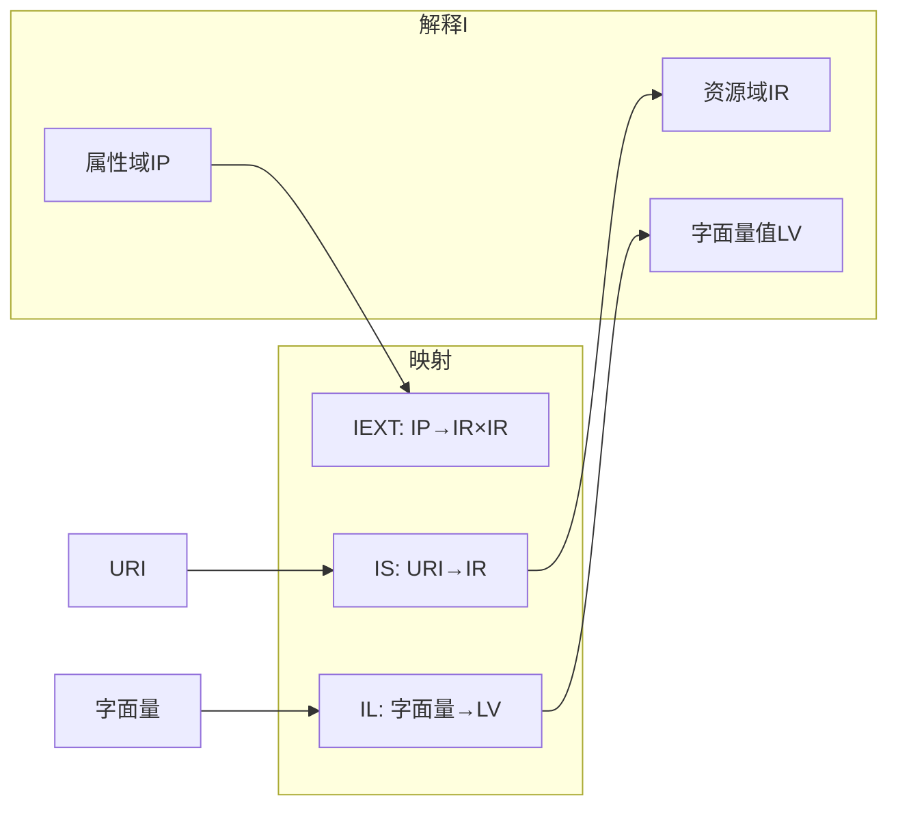
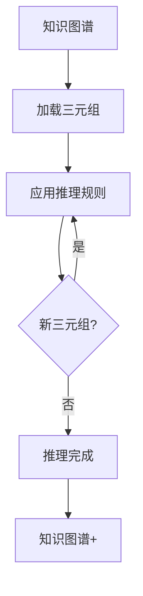

# 知识图谱Schema形式语法与语义分析视图

**版本**: v1.0
**创建日期**: 2026-02-15
**标准**: W3C RDF 1.2, W3C OWL 2, ISO/IEC 21838

---

## 📑 目录

- [知识图谱Schema形式语法与语义分析视图](#知识图谱schema形式语法与语义分析视图)
  - [📑 目录](#-目录)
  - [1. 形式文法定义](#1-形式文法定义)
    - [1.1 RDF三元组文法](#11-rdf三元组文法)
    - [1.2 SPARQL查询文法](#12-sparql查询文法)
  - [2. 形式语义定义](#2-形式语义定义)
    - [2.1 RDF模型论语义](#21-rdf模型论语义)
    - [2.2 知识图谱语义](#22-知识图谱语义)
  - [3. 推理规则](#3-推理规则)
    - [3.1 RDFS推理规则](#31-rdfs推理规则)
    - [3.2 OWL推理规则](#32-owl推理规则)
  - [4. Mermaid可视化](#4-mermaid可视化)
    - [4.1 RDF模型结构](#41-rdf模型结构)
    - [4.2 推理流程](#42-推理流程)

---

## 1. 形式文法定义

### 1.1 RDF三元组文法

```ebnf
RDFDocument ::= Triple*

Triple ::= Subject Predicate Object '.'

Subject ::= IRI | BlankNode

Predicate ::= IRI

Object ::= IRI | BlankNode | Literal

Literal ::= String '^^' DatatypeIRI
          | String '@' LanguageTag

IRI ::= '<' AbsoluteURI '>'
      | PrefixedName

BlankNode ::= '_:' Label

PrefixedName ::= Prefix ':' LocalName
```

### 1.2 SPARQL查询文法

```ebnf
Query ::= SelectQuery | ConstructQuery | AskQuery | DescribeQuery

SelectQuery ::= 'SELECT' (Variable+ | '*')
                DatasetClause* WhereClause SolutionModifier

WhereClause ::= 'WHERE' '{' TriplePattern* '}'

TriplePattern ::= Subject Predicate Object

Variable ::= '?' Name
```

---

## 2. 形式语义定义

### 2.1 RDF模型论语义

```
解释 I = (IR, IP, IEXT, IS, IL, LV)

IR: 资源集合 (非空)
IP: 属性集合 (IR的子集)
IEXT: IP → 2^(IR×IR)  (属性扩展)
IS: URI → IR ∪ IP  (URI解释)
IL: 字面量 → LV  (字面量解释)
LV: 字面值集合

三元组 (s, p, o) 为真当且仅当:
(IS(o), IS(o)) ∈ IEXT(IS(p))
```

### 2.2 知识图谱语义

```
知识图谱 K = (E, R, T)

E: 实体集合
R: 关系集合
T ⊆ E × R × E: 三元组集合

语义解释:
e ∈ IR  (实体解释)
r ∈ IP  (关系解释)
(e₁, r, e₂) = true ⟺ (e₁, e₂) ∈ IEXT(r)
```

---

## 3. 推理规则

### 3.1 RDFS推理规则

```
规则1 (类型继承):
(x, type, C₁) ∧ (C₁, subClassOf, C₂) ⊢ (x, type, C₂)

规则2 (属性继承):
(x, p₁, y) ∧ (p₁, subPropertyOf, p₂) ⊢ (x, p₂, y)

规则3 (定义域范围):
(x, p, y) ∧ (p, domain, C) ⊢ (x, type, C)
(x, p, y) ∧ (p, range, C) ⊢ (y, type, C)
```

### 3.2 OWL推理规则

```
规则4 (等价类):
(x, type, C₁) ∧ (C₁, equivalentClass, C₂) ⊢ (x, type, C₂)

规则5 (传递性):
(x, p, y) ∧ (y, p, z) ∧ p ∈ TransitiveProperty ⊢ (x, p, z)

规则6 (对称性):
(x, p, y) ∧ p ∈ SymmetricProperty ⊢ (y, p, x)
```

---

## 4. Mermaid可视化

### 4.1 RDF模型结构



### 4.2 推理流程



---

**维护者**: DSL Schema研究团队
