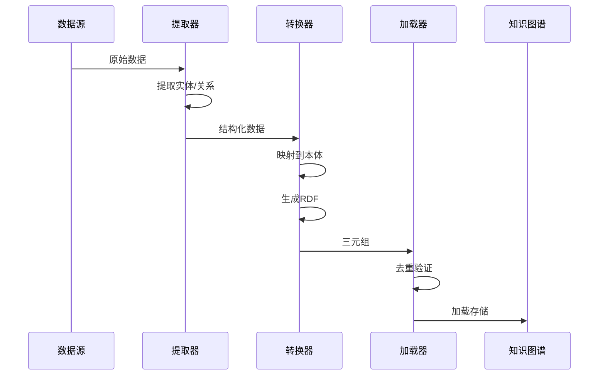
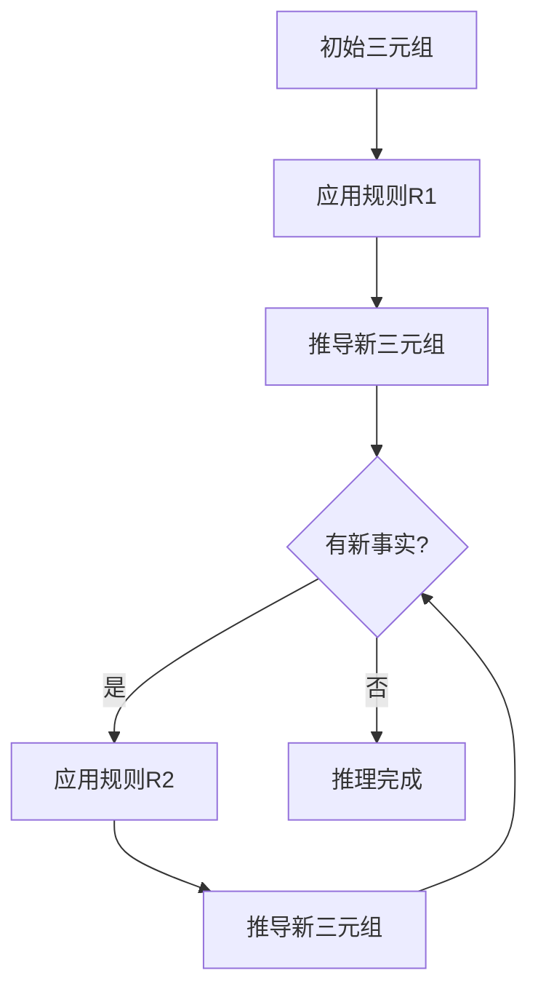
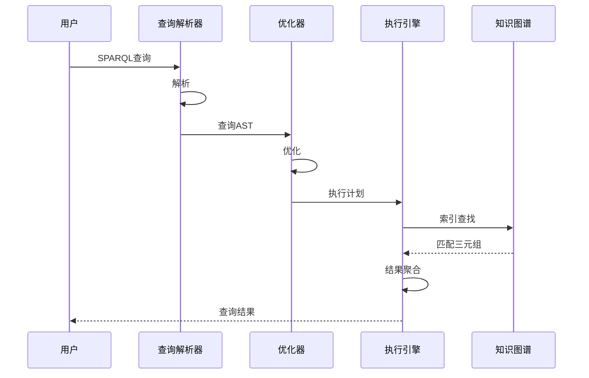

# 知识图谱Schema信息表征动态动作分析视图

**版本**: v1.0
**创建日期**: 2026-02-15

---

## 📑 目录

- [知识图谱Schema信息表征动态动作分析视图](#知识图谱schema信息表征动态动作分析视图)
  - [📑 目录](#-目录)
  - [1. 知识图谱操作动态分析](#1-知识图谱操作动态分析)
    - [1.1 数据流入动态](#11-数据流入动态)
  - [2. 推理过程时序](#2-推理过程时序)
    - [2.1 前向链推理](#21-前向链推理)
  - [3. 查询执行动态](#3-查询执行动态)
    - [3.1 SPARQL查询执行](#31-sparql查询执行)
  - [4. Mermaid动态视图](#4-mermaid动态视图)
    - [4.1 知识图谱构建时序](#41-知识图谱构建时序)
    - [4.2 推理动态图](#42-推理动态图)
    - [4.3 查询执行流程](#43-查询执行流程)

---

## 1. 知识图谱操作动态分析

### 1.1 数据流入动态

```
数据源          提取            转换            加载            存储
  │             │              │              │              │
  │ 原始数据    │              │              │              │
  ▼             ▼              │              │              │
┌─────────┐  ┌─────────┐      │              │              │
│ 数据库  │─▶│ 提取器  │      │              │              │
│ API     │  │ (ETL)   │      │              │              │
│ 文件    │  └─────────┘      │              │              │
└─────────┘       │           │              │              │
                  │ 提取结果  │              │              │
                  ▼           ▼              │              │
                           ┌─────────┐      │              │
                           │ 转换器  │      │              │
                           │ 映射规则 │      │              │
                           │ 数据清洗 │      │              │
                           └─────────┘      │              │
                                  │         │              │
                                  │ RDF三元组             │
                                  ▼         ▼              │
                                           ┌─────────┐    │
                                           │ 加载器  │    │
                                           │ 去重    │────┤
                                           │ 验证    │    │
                                           └─────────┘    │
                                                      │   │
                                                      ▼   ▼
                                                   ┌─────────┐
                                                   │ 图数据库│
                                                   │ RDF存储 │
                                                   └─────────┘
```

---

## 2. 推理过程时序

### 2.1 前向链推理

```
时间:    t0   t1   t2   t3   t4   t5   t6
         │    │    │    │    │    │    │
初始:    ▓▓▓▓▓▓
三元组   (T1,T2,T3)
              │
              ▼
规则R1   ─────────▶████
触发          (T4推导)
                   │
                   ▼
规则R2   ───────────────▶████
触发                        (T5推导)
                              │
                              ▼
规则R3   ────────────────────────▶████
触发                                  (T6推导)
                                        │
饱和点   ───────────────────────────────┘
(无新三元组)

最终知识图谱: {T1, T2, T3, T4, T5, T6}
```

---

## 3. 查询执行动态

### 3.1 SPARQL查询执行

```
查询解析          查询优化          执行计划          结果生成
    │               │               │               │
    ▼               ▼               │               │
┌─────────┐    ┌─────────┐         │               │
│ 词法分析 │    │ 代数优化 │         │               │
│ 语法分析 │    │ 统计优化 │         │               │
└─────────┘    └─────────┘         │               │
      │              │             │               │
      │ AST          │ 优化AST     │               │
      ▼              ▼             ▼               │
                              ┌─────────┐         │
                              │ 执行引擎 │         │
                              │ 索引查找 │         │
                              │ 图遍历   │────────▶│
                              └─────────┘         │
                                          │       │
                                          ▼       ▼
                                      ┌─────────┐
                                      │ 结果集  │
                                      │ 序列化  │
                                      └─────────┘
```

---

## 4. Mermaid动态视图

### 4.1 知识图谱构建时序



### 4.2 推理动态图



### 4.3 查询执行流程



---

**维护者**: DSL Schema研究团队
