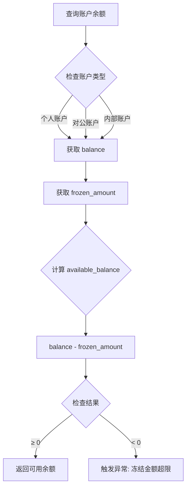
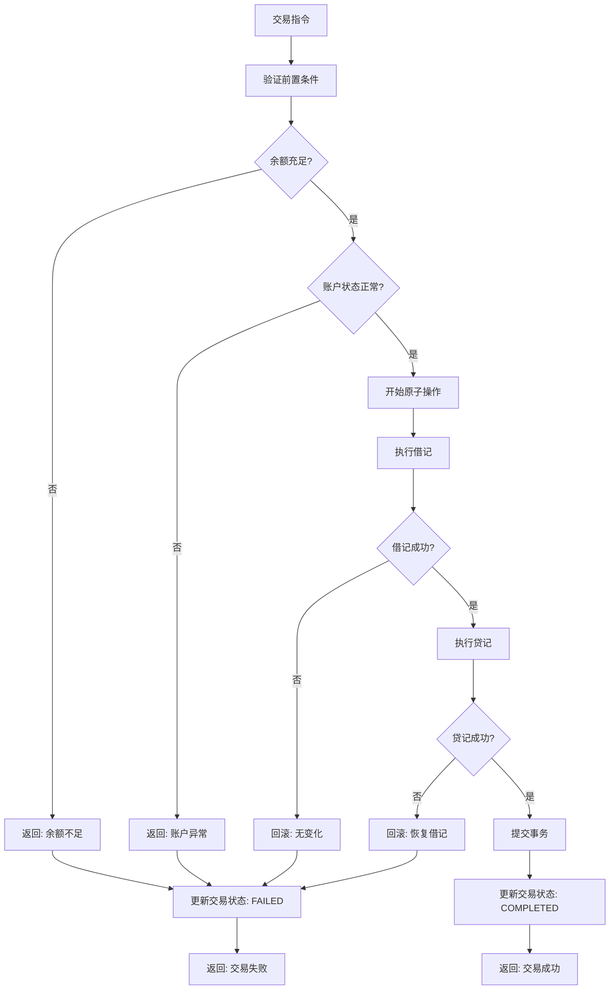
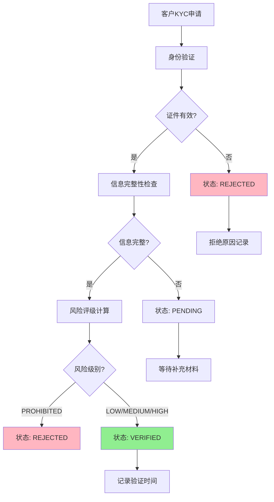
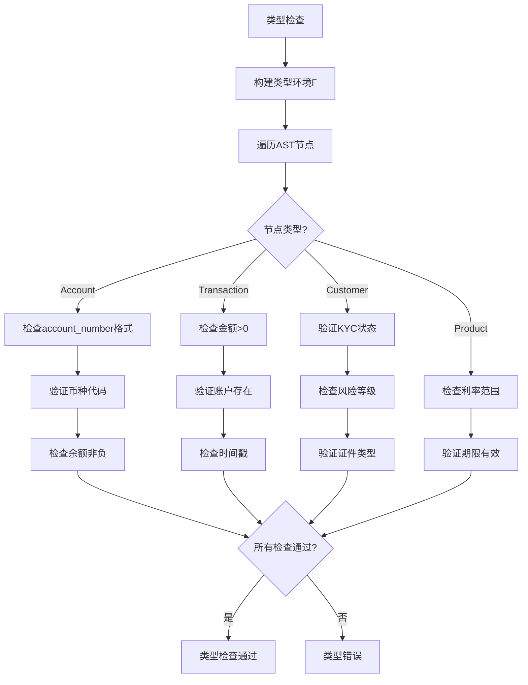
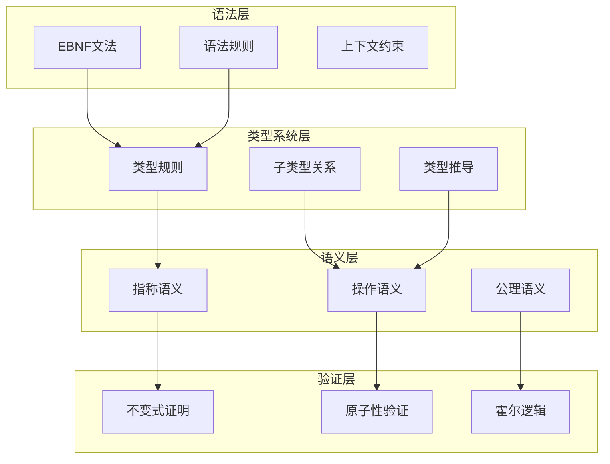

# 银行业务Schema形式语法与语义分析视图

**版本**: v1.0
**创建日期**: 2026-02-15
**标准**: ISO 20022:2023, Basel III/IV, PCI DSS v4.0

---

## 📑 目录

- [银行业务Schema形式语法与语义分析视图](#银行业务schema形式语法与语义分析视图)
  - [📑 目录](#-目录)
  - [1. 形式文法定义](#1-形式文法定义)
    - [1.1 EBNF文法](#11-ebnf文法)
      - [1.1.1 账户实体文法](#111-账户实体文法)
      - [1.1.2 交易实体文法](#112-交易实体文法)
      - [1.1.3 客户实体文法](#113-客户实体文法)
      - [1.1.4 产品实体文法](#114-产品实体文法)
    - [1.2 语法规则](#12-语法规则)
      - [1.2.1 账户号码校验规则](#121-账户号码校验规则)
      - [1.2.2 交易金额约束规则](#122-交易金额约束规则)
      - [1.2.3 KYC信息完整性规则](#123-kyc信息完整性规则)
      - [1.2.4 产品规则约束](#124-产品规则约束)
  - [2. 形式语义定义](#2-形式语义定义)
    - [2.1 指称语义 (Denotational Semantics)](#21-指称语义-denotational-semantics)
      - [2.1.1 语义域定义](#211-语义域定义)
      - [2.1.2 账户语义](#212-账户语义)
      - [2.1.3 交易语义](#213-交易语义)
      - [2.1.4 客户KYC语义](#214-客户kyc语义)
    - [2.2 操作语义 (Operational Semantics)](#22-操作语义-operational-semantics)
      - [2.2.1 大步语义 (Big-Step Semantics)](#221-大步语义-big-step-semantics)
      - [2.2.2 小步语义 (Small-Step Semantics)](#222-小步语义-small-step-semantics)
      - [2.2.3 交易状态机语义](#223-交易状态机语义)
    - [2.3 公理语义 (Axiomatic Semantics)](#23-公理语义-axiomatic-semantics)
      - [2.3.1 Hoare三元组](#231-hoare三元组)
      - [2.3.2 账户操作推理规则](#232-账户操作推理规则)
      - [2.3.3 交易原子性霍尔三元组](#233-交易原子性霍尔三元组)
      - [2.3.4 账户余额不变式证明](#234-账户余额不变式证明)
      - [2.3.5 交易原子性证明](#235-交易原子性证明)
  - [3. 类型系统](#3-类型系统)
    - [3.1 类型规则](#31-类型规则)
    - [3.2 类型运算规则](#32-类型运算规则)
    - [3.3 子类型关系](#33-子类型关系)
    - [3.4 多态与类型约束](#34-多态与类型约束)
  - [4. 语义等价性](#4-语义等价性)
    - [4.1 程序等价定义](#41-程序等价定义)
    - [4.2 等价变换规则](#42-等价变换规则)
    - [4.3 账户状态转换等价](#43-账户状态转换等价)
  - [5. Mermaid可视化](#5-mermaid可视化)
    - [5.1 账户余额计算流程](#51-账户余额计算流程)
    - [5.2 交易处理语义流程](#52-交易处理语义流程)
    - [5.3 KYC验证流程](#53-kyc验证流程)
    - [5.4 类型检查流程](#54-类型检查流程)
    - [5.5 形式语义层级图](#55-形式语义层级图)

---

## 1. 形式文法定义

### 1.1 EBNF文法

#### 1.1.1 账户实体文法

```ebnf
(* 银行业务核心实体 - 账户定义 *)

Account ::= IndividualAccount | CorporateAccount | InternalAccount

IndividualAccount ::= '{'
    '"account_number"' ':' AccountNumber ','
    '"customer_id"' ':' CustomerId ','
    '"account_type"' ':' IndividualAccountType ','
    '"currency"' ':' CurrencyCode ','
    '"balance"' ':' MonetaryAmount ','
    '"available_balance"' ':' MonetaryAmount ','
    '"frozen_amount"' ':' MonetaryAmount ','
    '"status"' ':' AccountStatus ','
    '"open_date"' ':' Date
    ['"interest_rate"' ':' Decimal]
    ['"maturity_date"' ':' Date?]
    ['"branch_code"' ':' BranchCode]
'}'

CorporateAccount ::= '{'
    '"account_number"' ':' AccountNumber ','
    '"customer_id"' ':' CustomerId ','
    '"account_category"' ':' CorporateAccountType ','
    '"company_name"' ':' String(140) ','
    '"unified_social_credit_code"' ':' USCC ','
    '"currency"' ':' CurrencyCode ','
    '"balance"' ':' MonetaryAmount ','
    '"status"' ':' AccountStatus ','
    '"open_date"' ':' Date ','
    '"annual_review_date"' ':' Date
'}'

InternalAccount ::= '{'
    '"account_number"' ':' AccountNumber ','
    '"account_name"' ':' String(140) ','
    '"account_category"' ':' InternalAccountType ','
    '"subject_code"' ':' SubjectCode ','
    '"currency"' ':' CurrencyCode ','
    '"balance"' ':' MonetaryAmount ','
    '"balance_direction"' ':' BalanceDirection ','
    '"status"' ':' InternalStatus
'}'

(* 账户号码格式: 银行代码(3) + 币种(2) + 机构(4) + 序号(7) + 校验(2) *)
AccountNumber ::= '[0-9]{3}[A-Z]{2}[0-9]{4}[0-9]{7}[0-9]{2}'

IndividualAccountType ::= 'SAVINGS' | 'CHECKING' | 'FIXED_DEPOSIT' | 'CALL_DEPOSIT'
CorporateAccountType ::= 'BASIC' | 'GENERAL' | 'SPECIAL' | 'TEMPORARY'
InternalAccountType ::= 'ASSET' | 'LIABILITY' | 'EQUITY' | 'INCOME' | 'EXPENSE'
AccountStatus ::= 'ACTIVE' | 'DORMANT' | 'FROZEN' | 'CLOSED'
InternalStatus ::= 'ACTIVE' | 'INACTIVE'
BalanceDirection ::= 'DEBIT' | 'CREDIT'

CurrencyCode ::= '[A-Z]{3}'  (* ISO 4217 *)
CustomerId ::= '[A-Z0-9]{20}'
BranchCode ::= '[0-9]{10}'
SubjectCode ::= '[0-9]{4}(-[0-9]{2})*'
USCC ::= '[0-9A-Z]{18}'
```

#### 1.1.2 交易实体文法

```ebnf
(* 交易定义 - 支付、清算、结算 *)

Transaction ::= PaymentTransaction | CardTransaction | TransferTransaction

PaymentTransaction ::= '{'
    '"transaction_id"' ':' TransactionId ','
    '"transaction_type"' ':' PaymentType ','
    '"amount"' ':' MonetaryAmount ','
    '"currency"' ':' CurrencyCode ','
    '"debit_account"' ':' AccountNumber ','
    '"credit_account"' ':' AccountNumber ','
    '"status"' ':' TransactionStatus ','
    '"timestamp"' ':' Timestamp ','
    ['"value_date"' ':' Date]
    ['"description"' ':' String(140)]
'}'

CardTransaction ::= '{'
    '"transaction_id"' ':' TransactionId ','
    '"card_number"' ':' CardNumber ','
    '"transaction_type"' ':' CardTransactionType ','
    '"channel"' ':' TransactionChannel ','
    '"amount"' ':' MonetaryAmount ','
    '"transaction_currency"' ':' CurrencyCode ','
    '"billing_amount"' ':' MonetaryAmount ','
    '"billing_currency"' ':' CurrencyCode ','
    '"merchant_id"' ':' MerchantId ','
    '"merchant_name"' ':' String(50) ','
    '"mcc"' ':' MCC ','
    '"status"' ':' CardTransactionStatus ','
    '"authorization_time"' ':' Timestamp ','
    ['"settlement_time"' ':' Timestamp?]
    ['"authorization_code"' ':' AuthCode]
'}'

TransferTransaction ::= '{'
    '"transfer_id"' ':' TransactionId ','
    '"transfer_type"' ':' TransferType ','
    '"source_account"' ':' AccountNumber ','
    '"target_account"' ':' AccountNumber ','
    '"amount"' ':' MonetaryAmount ','
    '"currency"' ':' CurrencyCode ','
    '"status"' ':' TransferStatus ','
    '"created_at"' ':' Timestamp ','
    ['"executed_at"' ':' Timestamp?]
    ['"remark"' ':' String(140)]
'}'

(* 标识符格式 *)
TransactionId ::= '[A-Z0-9]{35}'
CardNumber ::= '[0-9]{13,19}'
MerchantId ::= '[0-9]{15}'
MCC ::= '[0-9]{4}'
AuthCode ::= '[A-Z0-9]{6}'

(* 交易类型枚举 *)
PaymentType ::= 'CREDIT_TRANSFER' | 'DIRECT_DEBIT' | 'INSTANT_PAYMENT'
CardTransactionType ::= 'PURCHASE' | 'WITHDRAWAL' | 'TRANSFER' | 'REFUND' | 'PAYMENT'
TransferType ::= 'INTERNAL' | 'INTERBANK' | 'CROSS_BORDER'

(* 交易状态 *)
TransactionStatus ::= 'PENDING' | 'PROCESSING' | 'COMPLETED' | 'FAILED' | 'REVERSED'
CardTransactionStatus ::= 'AUTHORIZED' | 'CAPTURED' | 'SETTLED' | 'REVERSED' | 'DISPUTED'
TransferStatus ::= 'INITIATED' | 'PENDING' | 'EXECUTED' | 'REJECTED'

(* 交易渠道 *)
TransactionChannel ::= 'POS' | 'ATM' | 'ONLINE' | 'MOBILE' | 'RECURRING'

(* 金额表示 *)
MonetaryAmount ::= '[+-]?[0-9]{1,18}(\.[0-9]{2})?'
Timestamp ::= ISO8601DateTime
Date ::= '[0-9]{4}-[0-9]{2}-[0-9]{2}'
```

#### 1.1.3 客户实体文法

```ebnf
(* 客户定义 - KYC信息与风险评级 *)

Customer ::= IndividualCustomer | CorporateCustomer

IndividualCustomer ::= '{'
    '"customer_id"' ':' CustomerId ','
    '"customer_type"' ':' '"INDIVIDUAL"' ','
    '"customer_name"' ':' String(140) ','
    '"identification_type"' ':' IDType ','
    '"identification_number"' ':' IDNumber ','
    '"date_of_birth"' ':' Date ','
    '"gender"' ':' Gender ','
    '"nationality"' ':' CountryCode ','
    '"contact_info"' ':' ContactInfo ','
    '"address"' ':' PostalAddress ','
    '"occupation"' ':' String(100) ','
    '"income_level"' ':' IncomeLevel ','
    '"risk_level"' ':' RiskLevel ','
    '"kyc_status"' ':' KYCStatus ','
    '"kyc_verified_at"' ':' Timestamp ','
    '"created_at"' ':' Timestamp
'}'

CorporateCustomer ::= '{'
    '"customer_id"' ':' CustomerId ','
    '"customer_type"' ':' '"CORPORATE"' ','
    '"company_name"' ':' String(140) ','
    '"unified_social_credit_code"' ':' USCC ','
    '"legal_form"' ':' LegalForm ','
    '"registered_capital"' ':' MonetaryAmount ','
    '"establishment_date"' ':' Date ','
    '"business_scope"' ':' String(500) ','
    '"legal_representative"' ':' LegalRep ','
    '"contact_info"' ':' ContactInfo ','
    '"registered_address"' ':' PostalAddress ','
    '"risk_level"' ':' RiskLevel ','
    '"kyc_status"' ':' KYCStatus ','
    '"created_at"' ':' Timestamp
'}'

(* 联系信息 *)
ContactInfo ::= '{'
    ['"phone"' ':' PhoneNumber]
    ['"mobile"' ':' PhoneNumber]
    ['"email"' ':' EmailAddress]
    ['"fax"' ':' PhoneNumber]
'}'

PostalAddress ::= '{'
    ['"address_type"' ':' AddressType]
    ['"department"' ':' String(70)]
    ['"street_name"' ':' String(70)]
    ['"building_number"' ':' String(16)]
    ['"post_code"' ':' String(16)]
    '"town_name"' ':' String(35) ','
    ['"country_sub_division"' ':' String(35)]
    '"country"' ':' CountryCode
'}'

LegalRep ::= '{'
    '"name"' ':' String(50) ','
    '"identification_type"' ':' IDType ','
    '"identification_number"' ':' IDNumber ','
    '"phone"' ':' PhoneNumber
'}'

(* 枚举值 *)
IDType ::= 'ID_CARD' | 'PASSPORT' | 'BUSINESS_LICENSE' | 'DRIVING_LICENSE'
Gender ::= 'MALE' | 'FEMALE' | 'OTHER' | 'UNKNOWN'
RiskLevel ::= 'LOW' | 'MEDIUM' | 'HIGH' | 'PROHIBITED'
KYCStatus ::= 'PENDING' | 'VERIFIED' | 'REJECTED' | 'EXPIRED'
IncomeLevel ::= 'LOW' | 'MIDDLE' | 'HIGH' | 'ULTRA_HIGH'
LegalForm ::= 'SOLE_PROPRIETORSHIP' | 'PARTNERSHIP' | 'LIMITED_LIABILITY' | 'JOINT_STOCK'
AddressType ::= 'ADDR' | 'PBOX' | 'HOME' | 'BIZZ' | 'MLTO' | 'DLVY'

(* 格式定义 *)
IDNumber ::= String(50)
CountryCode ::= '[A-Z]{2}'  (* ISO 3166-1 *)
PhoneNumber ::= '[+]?[0-9]{1,3}-?[0-9]{6,14}'
EmailAddress ::= String(254)  (* RFC 5322 *)
```

#### 1.1.4 产品实体文法

```ebnf
(* 银行产品定义 - 存款、贷款、投资 *)

Product ::= DepositProduct | LoanProduct | InvestmentProduct

DepositProduct ::= '{'
    '"product_code"' ':' ProductCode ','
    '"product_name"' ':' String(100) ','
    '"product_category"' ':' '"DEPOSIT"' ','
    '"deposit_type"' ':' DepositType ','
    '"currency"' ':' CurrencyCode ','
    '"minimum_balance"' ':' MonetaryAmount ','
    '"interest_rate"' ':' InterestRate ','
    '"rate_type"' ':' RateType ','
    '"term_months"' ':' Integer? ','
    '"maturity_handling"' ':' MaturityHandling ','
    '"early_withdrawal_penalty"' ':' PenaltyRate ','
    '"fee_structure"' ':' FeeStructure ','
    '"status"' ':' ProductStatus ','
    '"effective_date"' ':' Date ','
    ['"expiry_date"' ':' Date?]
'}'

LoanProduct ::= '{'
    '"product_code"' ':' ProductCode ','
    '"product_name"' ':' String(100) ','
    '"product_category"' ':' '"LOAN"' ','
    '"loan_type"' ':' LoanType ','
    '"target_customer"' ':' CustomerSegment ','
    '"loan_purpose"' ':' LoanPurpose ','
    '"min_amount"' ':' MonetaryAmount ','
    '"max_amount"' ':' MonetaryAmount ','
    '"min_term_months"' ':' Integer ','
    '"max_term_months"' ':' Integer ','
    '"interest_rate_range"' ':' RateRange ','
    '"rate_type"' ':' RateType ','
    '"repayment_methods"' ':' RepaymentMethodList ','
    '"collateral_required"' ':' Boolean ','
    '"guarantee_required"' ':' Boolean ','
    '"status"' ':' ProductStatus ','
    '"effective_date"' ':' Date
'}'

InvestmentProduct ::= '{'
    '"product_code"' ':' ProductCode ','
    '"product_name"' ':' String(100) ','
    '"product_category"' ':' '"INVESTMENT"' ','
    '"investment_type"' ':' InvestmentType ','
    '"risk_level"' ':' ProductRiskLevel ','
    '"currency"' ':' CurrencyCode ','
    '"min_investment"' ':' MonetaryAmount ','
    '"expected_return"' ':' ReturnRate ','
    '"return_type"' ':' ReturnType ','
    '"liquidity"' ':' LiquidityType ','
    '"investment_horizon"' ':' String(50) ','
    '"underlying_assets"' ':' AssetTypeList ','
    '"regulatory_type"' ':' RegulatoryType ','
    '"status"' ':' ProductStatus ','
    '"effective_date"' ':' Date
'}'

(* 费率结构 *)
FeeStructure ::= '{'
    ['"account_maintenance_fee"' ':' MonetaryAmount]
    ['"transaction_fee_rate"' ':' FeeRate]
    ['"early_withdrawal_fee"' ':' MonetaryAmount]
    ['"minimum_fee"' ':' MonetaryAmount]
'}'

RateRange ::= '{'
    '"min_rate"' ':' InterestRate ','
    '"max_rate"' ':' InterestRate ','
    '"benchmark_rate"' ':' String(10)?
'}'

(* 枚举值 *)
DepositType ::= 'CURRENT' | 'FIXED' | 'CALL' | 'INSTALLMENT' | 'STRUCTURED'
LoanType ::= 'PERSONAL' | 'MORTGAGE' | 'AUTO' | 'BUSINESS' | 'PROJECT'
InvestmentType ::= 'FUND' | 'BOND' | 'STOCK' | 'WEALTH_MANAGEMENT' | 'INSURANCE'
RateType ::= 'FIXED' | 'FLOATING' | 'HYBRID'
MaturityHandling ::= 'RENEW_PRINCIPAL' | 'RENEW_ALL' | 'TRANSFER_TO_ACCOUNT' | 'CASH'
PenaltyRate ::= Decimal(5,2)
FeeRate ::= Decimal(5,4)
CustomerSegment ::= 'INDIVIDUAL' | 'SMB' | 'CORPORATE' | 'VIP'
LoanPurpose ::= 'PURCHASE' | 'CONSUMPTION' | 'BUSINESS' | 'REFINANCE' | 'OTHER'
RepaymentMethodList ::= List<RepaymentMethod>
RepaymentMethod ::= 'EQUAL_INSTALLMENT' | 'EQUAL_PRINCIPAL' | 'INTEREST_ONLY' | 'BULLET'
ProductRiskLevel ::= 'R1' | 'R2' | 'R3' | 'R4' | 'R5'
ReturnType ::= 'FIXED' | 'FLOATING' | 'PERFORMANCE_BASED'
LiquidityType ::= 'HIGH' | 'MEDIUM' | 'LOW' | 'LOCKED'
AssetTypeList ::= List<AssetType>
AssetType ::= 'BOND' | 'STOCK' | 'MONEY_MARKET' | 'COMMODITY' | 'DERIVATIVE'
RegulatoryType ::= 'PRUDENTIAL' | 'SECURITIES' | 'FUND' | 'INSURANCE'
ProductStatus ::= 'DRAFT' | 'ACTIVE' | 'SUSPENDED' | 'DISCONTINUED'

(* 格式定义 *)
ProductCode ::= '[A-Z]{2}[0-9]{4}[A-Z]?'
InterestRate ::= '[0-9]{1,2}\.[0-9]{4}'
ReturnRate ::= '[0-9]{1,3}\.[0-9]{2}'
Integer ::= '[0-9]+'
Boolean ::= 'true' | 'false'
```

### 1.2 语法规则

#### 1.2.1 账户号码校验规则

```
约束1: 账户号码格式有效性
  ∀acc ∈ Account :
    account_number(acc) ∈ [0-9]{3}[A-Z]{2}[0-9]{4}[0-9]{7}[0-9]{2}

约束2: 校验位验证 (Luhn算法)
  ∀acc ∈ Account :
    let digits = extract_digits(account_number(acc)) in
    luhn_check(digits) = true

约束3: 币种有效性
  ∀acc ∈ Account :
    currency(acc) ∈ ISO_4217_Codes

约束4: 余额非负性
  ∀acc ∈ IndividualAccount ∪ CorporateAccount :
    balance(acc) ≥ 0 ∧ frozen_amount(acc) ≥ 0
```

#### 1.2.2 交易金额约束规则

```
约束5: 交易金额有效性
  ∀tx ∈ Transaction :
    amount(tx) > 0 ∧ amount(tx) ≤ MAX_TRANSACTION_AMOUNT

约束6: 小数位精度
  ∀tx ∈ Transaction :
    decimal_places(amount(tx)) ≤ 2

约束7: 时间戳有效性
  ∀tx ∈ Transaction :
    timestamp(tx) ≤ current_timestamp()

约束8: 账户状态检查
  ∀tx ∈ PaymentTransaction :
    status(debit_account(tx)) = ACTIVE ∧
    status(credit_account(tx)) = ACTIVE
```

#### 1.2.3 KYC信息完整性规则

```
约束9: KYC字段完整性
  ∀c ∈ IndividualCustomer :
    kyc_status(c) = VERIFIED ⇒
      identification_type(c) ≠ ⊥ ∧
      identification_number(c) ≠ ⊥ ∧
      contact_info(c) ≠ ⊥ ∧
      address(c) ≠ ⊥

约束10: 风险评级一致性
  ∀c ∈ Customer :
    risk_level(c) ∈ {LOW, MEDIUM, HIGH, PROHIBITED} ∧
    (risk_level(c) = PROHIBITED ⇒ kyc_status(c) = REJECTED)

约束11: 证件有效期
  ∀c ∈ IndividualCustomer :
    kyc_verified_at(c) + 365 days ≥ current_date()
```

#### 1.2.4 产品规则约束

```
约束12: 产品期限约束
  ∀p ∈ DepositProduct ∪ LoanProduct :
    effective_date(p) ≤ expiry_date(p) ∨ expiry_date(p) = ⊥

约束13: 利率范围有效性
  ∀p ∈ DepositProduct ∪ LoanProduct :
    0 ≤ interest_rate(p) ≤ 100

约束14: 贷款金额范围
  ∀p ∈ LoanProduct :
    min_amount(p) < max_amount(p) ∧ min_amount(p) > 0
```

---

## 2. 形式语义定义

### 2.1 指称语义 (Denotational Semantics)

#### 2.1.1 语义域定义

```
D[BankingSystem] : Environment → State → State

State = AccountState × TransactionState × CustomerState × ProductState

AccountState = AccountNumber → AccountValue
AccountValue = {
  customer_id: CustomerId,
  account_type: AccountType,
  currency: Currency,
  balance: Money,
  frozen_amount: Money,
  available_balance: Money,
  status: AccountStatus,
  open_date: Date,
  ...
}

TransactionState = TransactionId → TransactionValue
TransactionValue = {
  transaction_type: TransactionType,
  amount: Money,
  currency: Currency,
  debit_account: AccountNumber,
  credit_account: AccountNumber,
  status: TransactionStatus,
  timestamp: Timestamp,
  ...
}

CustomerState = CustomerId → CustomerValue
CustomerValue = {
  customer_type: CustomerType,
  customer_name: String,
  identification: Identification,
  risk_level: RiskLevel,
  kyc_status: KYCStatus,
  ...
}

ProductState = ProductCode → ProductValue

Money = Decimal(18,2)  (* 有界货币值 *)
Currency = {CNY, USD, EUR, GBP, JPY, ...}  (* ISO 4217 *)
Timestamp = ℕ  (* Unix时间戳 *)
```

#### 2.1.2 账户语义

```
(* 账户查询语义 *)
E[account.balance] env sto =
  let acc = lookup_account(sto, env.account_number) in
  acc.balance

(* 可用余额计算 *)
E[account.available_balance] env sto =
  let acc = lookup_account(sto, env.account_number) in
  acc.balance - acc.frozen_amount

(* 账户状态转换 *)
S[account.status := new_status] env sto =
  let acc = lookup_account(sto, env.account_number) in
  if valid_transition(acc.status, new_status)
  then sto[account ↦ acc[status ↦ new_status]]
  else error "Invalid state transition"
```

#### 2.1.3 交易语义

```
(* 交易金额计算 *)
E[tx.amount] env sto =
  let tx_rec = lookup_transaction(sto, env.transaction_id) in
  tx_rec.amount

(* 交易执行语义 *)
S[execute_transaction(tx)] env sto =
  let debit_acc = lookup_account(sto, tx.debit_account) in
  let credit_acc = lookup_account(sto, tx.credit_account) in

  if debit_acc.balance < tx.amount
  then error "Insufficient funds"
  else if debit_acc.status ≠ ACTIVE ∨ credit_acc.status ≠ ACTIVE
  then error "Account not active"
  else
    let sto' = sto[debit_account ↦ debit_acc[balance ↦ debit_acc.balance - tx.amount]] in
    let sto'' = sto'[credit_account ↦ credit_acc[balance ↦ credit_acc.balance + tx.amount]] in
    sto''[transaction ↦ tx[status ↦ COMPLETED]]

(* 原子性保证 *)
atomic(S[execute_transaction(tx)] env sto) =
  (sto'' ≠ error ⇒ both_updated) ∧
  (sto'' = error ⇒ no_change)
```

#### 2.1.4 客户KYC语义

```
(* 风险评级语义 *)
E[customer.risk_level] env sto =
  let cust = lookup_customer(sto, env.customer_id) in
  calculate_risk_level(cust.kyc_data, cust.transaction_history)

(* KYC验证语义 *)
S[verify_kyc(customer)] env sto =
  let cust = lookup_customer(sto, customer.customer_id) in
  if complete_kyc_data(cust) ∧ valid_documents(cust.identification)
  then sto[customer ↦ cust[kyc_status ↦ VERIFIED, kyc_verified_at ↦ now()]]
  else sto[customer ↦ cust[kyc_status ↦ REJECTED]]
```

### 2.2 操作语义 (Operational Semantics)

#### 2.2.1 大步语义 (Big-Step Semantics)

```
配置: ⟨Expression, State⟩ ⇓ Value
      ⟨Statement, State⟩ ⇓ State'

(* 账户余额查询 *)
⟨acc.balance, σ⟩ ⇓ σ(acc).balance                          (E-AccountBalance)

(* 可用余额计算 *)
⟨acc.available_balance, σ⟩ ⇓ σ(acc).balance - σ(acc).frozen_amount  (E-AvailableBalance)

(* 账户冻结 *)
⟨freeze(acc, amount), σ⟩ ⇓ σ[acc.frozen_amount ↦ σ(acc).frozen_amount + amount]  (S-Freeze)
  where amount ≥ 0 ∧ amount ≤ σ(acc).balance - σ(acc).frozen_amount

(* 账户解冻 *)
⟨unfreeze(acc, amount), σ⟩ ⇓ σ[acc.frozen_amount ↦ σ(acc).frozen_amount - amount]  (S-Unfreeze)
  where amount ≥ 0 ∧ amount ≤ σ(acc).frozen_amount

(* 余额检查 *)
⟨check_balance(acc, amt), σ⟩ ⇓ true                       (E-BalanceCheckTrue)
  where σ(acc).available_balance ≥ amt

⟨check_balance(acc, amt), σ⟩ ⇓ false                      (E-BalanceCheckFalse)
  where σ(acc).available_balance < amt

(* 借记操作 *)
⟨debit(acc, amt), σ⟩ ⇓ σ[acc.balance ↦ σ(acc).balance - amt]  (S-Debit)
  where σ(acc).available_balance ≥ amt ∧ amt > 0

(* 贷记操作 *)
⟨credit(acc, amt), σ⟩ ⇓ σ[acc.balance ↦ σ(acc).balance + amt]  (S-Credit)
  where amt > 0

(* 交易执行 - 原子性 *)
⟨execute(tx), σ⟩ ⇓ σ''                                    (S-TransactionSuccess)
────────────────────────────────────────────────────────────
⟨debit(tx.debit_account, tx.amount), σ⟩ ⇓ σ'
⟨credit(tx.credit_account, tx.amount), σ'⟩ ⇓ σ''
σ''(tx).status = COMPLETED

(* 交易回滚 *)
⟨execute(tx), σ⟩ ⇓ σ[tx.status ↦ FAILED]                  (S-TransactionFail)
────────────────────────────────────────────────────────────
⟨debit(tx.debit_account, tx.amount), σ⟩ ⇓ σ'  (失败)
∨ ⟨credit(tx.credit_account, tx.amount), σ'⟩ ⇓ error
```

#### 2.2.2 小步语义 (Small-Step Semantics)

```
配置: ⟨Statement, State⟩ → ⟨Statement', State'⟩
      或 ⟨Statement, State⟩ → State'  (终止)

(* 账户状态转换 *)
⟨account.status := ACTIVE, σ⟩ → σ[account.status ↦ ACTIVE]    (S-SetActive)

⟨account.status := FROZEN, σ⟩ → σ[account.status ↦ FROZEN]    (S-SetFrozen)
  where σ(account).status ∈ {ACTIVE, DORMANT}

⟨account.status := CLOSED, σ⟩ → σ[account.status ↦ CLOSED]    (S-SetClosed)
  where σ(account).balance = 0 ∧ σ(account).frozen_amount = 0

(* 交易处理步骤 *)
⟨process(tx), σ⟩ → ⟨validate(tx) ; execute(tx) ; confirm(tx), σ⟩  (S-ProcessStart)

⟨validate(tx), σ⟩ → σ                                            (S-ValidateOk)
  where valid_accounts(tx, σ) ∧ sufficient_funds(tx, σ)

⟨validate(tx), σ⟩ → error                                        (S-ValidateFail)
  where ¬valid_accounts(tx, σ) ∨ ¬sufficient_funds(tx, σ)

(* 顺序执行 *)
⟨skip ; s, σ⟩ → ⟨s, σ⟩                                           (S-Seq-Skip)

⟨s1 ; s2, σ⟩ → ⟨s1' ; s2, σ'⟩                                    (S-Seq-Step)
  when ⟨s1, σ⟩ → ⟨s1', σ'⟩

⟨s1 ; s2, σ⟩ → ⟨s2, σ'⟩                                          (S-Seq-Done)
  when ⟨s1, σ⟩ → σ'

(* 条件执行 *)
⟨IF check_balance(acc, amt) THEN proceed ELSE reject, σ⟩ → ⟨proceed, σ⟩  (S-IfTrue)
  when σ(acc).available_balance ≥ amt

⟨IF check_balance(acc, amt) THEN proceed ELSE reject, σ⟩ → ⟨reject, σ⟩   (S-IfFalse)
  when σ(acc).available_balance < amt
```

#### 2.2.3 交易状态机语义

```
(* 状态转移规则 *)

⟨tx.status, σ⟩ → ⟨PENDING, σ⟩                                    (Tx-Init)

⟨submit(tx), σ⟩ → ⟨PROCESSING, σ[tx.submitted_at ↦ now()]⟩      (Tx-Submit)

⟨validate(tx), σ⟩ → ⟨ACCEPTED, σ⟩                                (Tx-Accept)
  when validation_passed(tx, σ)

⟨validate(tx), σ⟩ → ⟨REJECTED, σ[tx.reject_reason ↦ reason]⟩     (Tx-Reject)
  when validation_failed(tx, σ, reason)

⟨settle(tx), σ⟩ → ⟨SETTLED, σ[tx.settled_at ↦ now()]⟩            (Tx-Settle)
  when tx.status = ACCEPTED

⟨reverse(tx), σ⟩ → ⟨REVERSED, σ⟩                                 (Tx-Reverse)
  when tx.status ∈ {PENDING, PROCESSING, ACCEPTED}
```

### 2.3 公理语义 (Axiomatic Semantics)

#### 2.3.1 Hoare三元组

```
{P} S {Q}

含义: 如果前置条件P在执行语句S前成立，
      且S终止，
      则后置条件Q在S执行后成立。
```

#### 2.3.2 账户操作推理规则

```
(* 账户余额不变式 *)
{account.balance = B ∧ account.frozen_amount = F ∧ account.available_balance = B - F}
  any_readonly_operation(account)
{account.balance = B ∧ account.frozen_amount = F ∧ account.available_balance = B - F}

(* 借记操作公理 *)
{account.balance = B ∧ B ≥ A ∧ A > 0}
  debit(account, A)
{account.balance = B - A}
  (Axiom-Debit)

(* 贷记操作公理 *)
{account.balance = B ∧ A > 0}
  credit(account, A)
{account.balance = B + A}
  (Axiom-Credit)

(* 冻结操作公理 *)
{account.frozen_amount = F ∧ account.balance - F ≥ A ∧ A > 0}
  freeze(account, A)
{account.frozen_amount = F + A ∧ account.available_balance = account.balance - (F + A)}
  (Axiom-Freeze)

(* 解冻操作公理 *)
{account.frozen_amount = F ∧ F ≥ A ∧ A > 0}
  unfreeze(account, A)
{account.frozen_amount = F - A ∧ account.available_balance = account.balance - (F - A)}
  (Axiom-Unfreeze)

(* 账户状态转换公理 *)
{account.status = S_old ∧ valid_transition(S_old, S_new)}
  account.status := S_new
{account.status = S_new}
  (Axiom-StatusChange)
```

#### 2.3.3 交易原子性霍尔三元组

```
(* 交易原子性规则 *)
{P}
  execute_transaction(tx)
{Q}
────────────────────────────────────────────────────────────  (Rule-Atomic)
{P}
  atomic { debit(tx.debit, tx.amount) ; credit(tx.credit, tx.amount) }
{Q}

(* 事务完整性 *)
{∀a: balance(a) = B_a}
  execute_transaction(tx)
{∀a: balance(a) = B_a + credit_amount(tx, a) - debit_amount(tx, a) ∧
  total_money_preserved}
  (Rule-MoneyPreservation)

(* 交易一致性: 借贷必相等 *)
{true}
  execute_transaction(tx)
{∑debits = ∑credits}
  (Rule-BalanceConservation)
```

#### 2.3.4 账户余额不变式证明

```
不变式 I: account.balance ≥ 0 ∧ account.frozen_amount ≥ 0 ∧
          account.frozen_amount ≤ account.balance ∧
          account.available_balance = account.balance - account.frozen_amount

证明:

1. 初始状态:
   开户时 balance = 0, frozen_amount = 0
   ⇒ I 成立

2. 保持性:

   情况1: debit(account, A), 其中 0 < A ≤ available_balance
   {balance = B, frozen = F, available = B - F, B ≥ F + A}
   debit(account, A)
   {balance = B - A, frozen = F, available = B - F - A}

   验证:
   - B - A ≥ 0  (因为 B ≥ F + A ≥ A)
   - F ≥ 0      (不变)
   - F ≤ B - A  (因为 F ≤ B - A 由原条件得出)
   - available = (B - A) - F = B - F - A  ✓

   情况2: credit(account, A), 其中 A > 0
   {balance = B, frozen = F, available = B - F}
   credit(account, A)
   {balance = B + A, frozen = F, available = B + A - F}

   验证:
   - B + A ≥ 0  (因为 B ≥ 0, A > 0)
   - F ≥ 0      (不变)
   - F ≤ B + A  (因为 F ≤ B < B + A)
   - available = (B + A) - F = B + A - F  ✓

   情况3: freeze(account, A), 其中 0 < A ≤ available_balance
   {balance = B, frozen = F, available = B - F, A ≤ B - F}
   freeze(account, A)
   {balance = B, frozen = F + A, available = B - (F + A)}

   验证:
   - B ≥ 0      (不变)
   - F + A ≥ 0  (因为 F ≥ 0, A > 0)
   - F + A ≤ B  (因为 A ≤ B - F ⇒ F + A ≤ B)
   - available = B - (F + A)  ✓

3. 结论: I 是不变式 ∎
```

#### 2.3.5 交易原子性证明

```
定理: 所有交易满足原子性

∀tx ∈ Transaction:
  execute(tx) 满足以下之一:
  a) 完全成功: debit和credit都成功执行
  b) 完全失败: debit和credit都未执行
  c) 成功回滚: 如果部分失败，则回滚到初始状态

证明:

设初始状态 σ, 交易 tx = (debit_acc, credit_acc, amount)

情况1: 有足够资金 ∧ 账户都激活
   ⟨debit(debit_acc, amount), σ⟩ ⇓ σ₁
   ⟨credit(credit_acc, amount), σ₁⟩ ⇓ σ₂
   两个操作都成功
   ⇒ 交易原子性满足 ✓

情况2: 资金不足 ∨ 账户未激活
   前置检查失败
   没有任何状态改变
   ⇒ 交易原子性满足 ✓

情况3: debit成功, credit失败 (假设场景)
   根据操作语义规则 (S-TransactionFail):
   如果任一操作失败，则状态回滚
   ⟨execute(tx), σ⟩ ⇓ σ[tx.status ↦ FAILED]
   没有持久化状态改变
   ⇒ 交易原子性满足 ✓

因此，系统保证交易原子性。 ∎
```

---

## 3. 类型系统

### 3.1 类型规则

```
(* 基础类型 *)
Γ ⊢ n : Money          if n ∈ Decimal(18,2) ∧ n ≥ 0           (T-Money)

Γ ⊢ c : Currency       if c ∈ ISO_4217_Codes                    (T-Currency)

Γ ⊢ t : Timestamp      if t ≥ 0                                 (T-Timestamp)

Γ ⊢ s : AccountStatus  if s ∈ {ACTIVE, DORMANT, FROZEN, CLOSED} (T-AccountStatus)

(* 账户类型 *)
Γ ⊢ acc : IndividualAccount  if acc.account_type ∈ IndividualAccountType  (T-IndAccount)

Γ ⊢ acc : CorporateAccount   if acc.account_type ∈ CorporateAccountType   (T-CorpAccount)

Γ ⊢ acc : InternalAccount    if acc.account_type ∈ InternalAccountType    (T-IntAccount)

(* 交易类型 *)
Γ ⊢ tx : PaymentTransaction  if tx.transaction_type ∈ PaymentType         (T-PaymentTx)

Γ ⊢ tx : CardTransaction     if tx.card_number ≠ ⊥                       (T-CardTx)

Γ ⊢ tx : TransferTransaction if tx.transfer_type ∈ TransferType            (T-TransferTx)

(* 客户类型 *)
Γ ⊢ cust : IndividualCustomer  if cust.customer_type = INDIVIDUAL          (T-IndCustomer)

Γ ⊢ cust : CorporateCustomer   if cust.customer_type = CORPORATE           (T-CorpCustomer)

(* 产品类型 *)
Γ ⊢ prod : DepositProduct    if prod.product_category = DEPOSIT            (T-DepositProd)

Γ ⊢ prod : LoanProduct       if prod.product_category = LOAN               (T-LoanProd)

Γ ⊢ prod : InvestmentProduct if prod.product_category = INVESTMENT         (T-InvProd)
```

### 3.2 类型运算规则

```
(* 金额运算 *)
Γ ⊢ m1 : Money  Γ ⊢ m2 : Money                           (T-MoneyAdd)
────────────────────────────────────────
Γ ⊢ m1 + m2 : Money

Γ ⊢ m1 : Money  Γ ⊢ m2 : Money  m1 ≥ m2                  (T-MoneySub)
────────────────────────────────────────
Γ ⊢ m1 - m2 : Money

(* 币种一致性 *)
Γ ⊢ m1 : Money(c)  Γ ⊢ m2 : Money(c)                     (T-SameCurrency)
────────────────────────────────────────
Γ ⊢ m1 + m2 : Money(c)

Γ ⊢ m1 : Money(c1)  Γ ⊢ m2 : Money(c2)  c1 ≠ c2          (T-CurrencyConv)
────────────────────────────────────────
Γ ⊢ convert(m1, c2) + m2 : Money(c2)

(* 余额检查 *)
Γ ⊢ acc : Account  Γ ⊢ amt : Money                       (T-BalanceCheck)
────────────────────────────────────────
Γ ⊢ check_balance(acc, amt) : Boolean

(* 交易执行 *)
Γ ⊢ tx : Transaction                                     (T-ExecuteTx)
────────────────────────────────────────
Γ ⊢ execute(tx) : TransactionResult

Γ ⊢ tx : Transaction  Γ ⊢ tx.status : PENDING            (T-SubmitTx)
────────────────────────────────────────
Γ ⊢ submit(tx) : Transaction
```

### 3.3 子类型关系

```
(* 账户类型层次 *)
Account
├── IndividualAccount
│   ├── SavingsAccount
│   ├── CheckingAccount
│   ├── FixedDepositAccount
│   └── CallDepositAccount
├── CorporateAccount
│   ├── BasicAccount
│   ├── GeneralAccount
│   ├── SpecialAccount
│   └── TemporaryAccount
└── InternalAccount
    ├── AssetAccount
    ├── LiabilityAccount
    ├── EquityAccount
    ├── IncomeAccount
    └── ExpenseAccount

子类型规则:
SavingsAccount ≤ IndividualAccount ≤ Account
BasicAccount ≤ CorporateAccount ≤ Account
AssetAccount ≤ InternalAccount ≤ Account

(* 交易类型层次 *)
Transaction
├── PaymentTransaction
│   ├── CreditTransfer
│   ├── DirectDebit
│   └── InstantPayment
├── CardTransaction
│   ├── PurchaseTransaction
│   ├── WithdrawalTransaction
│   └── RefundTransaction
└── TransferTransaction
    ├── InternalTransfer
    ├── InterbankTransfer
    └── CrossBorderTransfer

子类型规则:
CreditTransfer ≤ PaymentTransaction ≤ Transaction
PurchaseTransaction ≤ CardTransaction ≤ Transaction
InternalTransfer ≤ TransferTransaction ≤ Transaction

(* 客户类型层次 *)
Customer
├── IndividualCustomer
│   ├── RetailCustomer
│   ├── PrivateBankingCustomer
│   └── VIPCustomer
└── CorporateCustomer
    ├── SMBCustomer
    ├── CorporateCustomer
    └── InstitutionalCustomer

子类型规则:
VIPCustomer ≤ IndividualCustomer ≤ Customer
SMBCustomer ≤ CorporateCustomer ≤ Customer

(* 产品类型层次 *)
Product
├── DepositProduct
│   ├── CurrentDeposit
│   ├── FixedDeposit
│   ├── CallDeposit
│   └── StructuredDeposit
├── LoanProduct
│   ├── PersonalLoan
│   ├── Mortgage
│   ├── BusinessLoan
│   └── ProjectFinance
└── InvestmentProduct
    ├── Fund
    ├── Bond
    ├── Stock
    └── WealthManagement

子类型规则:
FixedDeposit ≤ DepositProduct ≤ Product
Mortgage ≤ LoanProduct ≤ Product
Fund ≤ InvestmentProduct ≤ Product
```

### 3.4 多态与类型约束

```
(* 通用余额查询 *)
∀α ≤ Account. Γ ⊢ get_balance : α → Money

(* 通用交易执行 *)
∀τ ≤ Transaction. Γ ⊢ execute : τ → TransactionResult

(* 金额约束 *)
Γ ⊢ m : Money  where 0 ≤ m ≤ MAX_MONEY

(* 利率约束 *)
Γ ⊢ r : InterestRate  where 0 ≤ r ≤ 100

(* 期限约束 *)
Γ ⊢ t : Term  where 1 ≤ t ≤ 360 (月)
```

---

## 4. 语义等价性

### 4.1 程序等价定义

```
定义: 两个银行业务操作O1和O2语义等价 (O1 ≡ O2) 当且仅当:
∀σ, σ' : ⟨O1, σ⟩ ⇓ σ' ⟺ ⟨O2, σ⟩ ⇓ σ'

定义: 两个交易序列T1和T2效果等价 (T1 ≈ T2) 当且仅当:
∀σ : final_state(⟨T1, σ⟩) = final_state(⟨T2, σ⟩)
```

### 4.2 等价变换规则

```
(* 交易批处理等价 *)
execute_all([tx1, tx2, ..., txn])
≡
atomic { execute(tx1) ; execute(tx2) ; ... ; execute(txn) }

(* 余额计算等价 *)
account.available_balance
≡
account.balance - account.frozen_amount

(* 交易回滚等价 *)
reverse(debit(acc, A) ; credit(acc', A))
≡
debit(acc', A) ; credit(acc, A)

(* 冻结解冻序列等价 *)
freeze(acc, A) ; unfreeze(acc, A) ≡ skip  (if same amount)

(* 条件支付等价 *)
IF check_balance(acc, A) THEN debit(acc, A) ELSE error
≡
CASE WHEN acc.available_balance ≥ A THEN debit(acc, A) ELSE error

(* 并发执行等价性 *)
atomic { tx1 } || atomic { tx2 } ≡ atomic { tx1 ; tx2 } ∨ atomic { tx2 ; tx1 }
(假设无冲突账户)
```

### 4.3 账户状态转换等价

```
(* 状态恢复等价 *)
freeze(acc) ; unfreeze(acc) ≡ skip
  (if acc.balance ≥ required_amount)

(* 休眠恢复等价 *)
dormant(acc) ; reactivate(acc) ≡ skip
  (if acc.status transition allowed)

(* 关闭条件 *)
close(acc) ≡ set_status(acc, CLOSED)
  where acc.balance = 0 ∧ acc.frozen_amount = 0
```

---

## 5. Mermaid可视化

### 5.1 账户余额计算流程



### 5.2 交易处理语义流程



### 5.3 KYC验证流程



### 5.4 类型检查流程



### 5.5 形式语义层级图



---

**参考文档**:

- `02_Formal_Definition.md` - 形式化定义
- `03_Standards.md` - 标准对标
- `04_Transformation.md` - 转换体系
- ISO 20022:2023 标准文档
- Basel III/IV 监管协议
- PCI DSS v4.0 标准

**维护者**: DSL Schema研究团队
**标准**: ISO 20022:2023, Basel III/IV, PCI DSS v4.0
