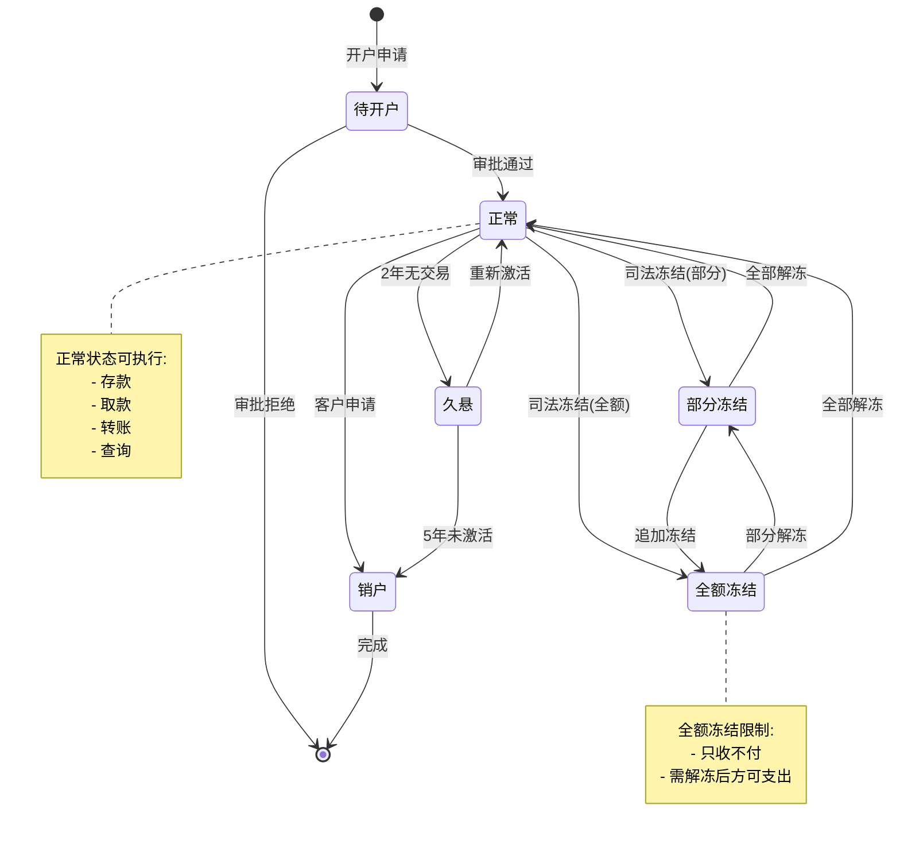
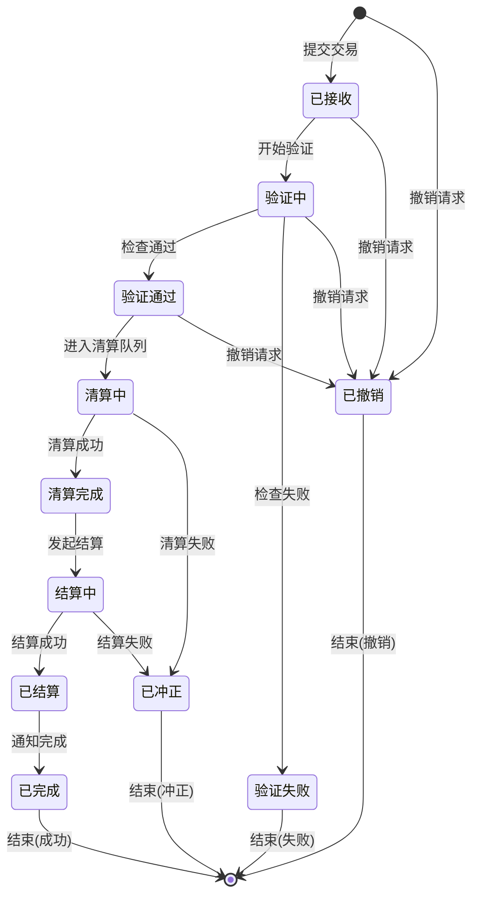
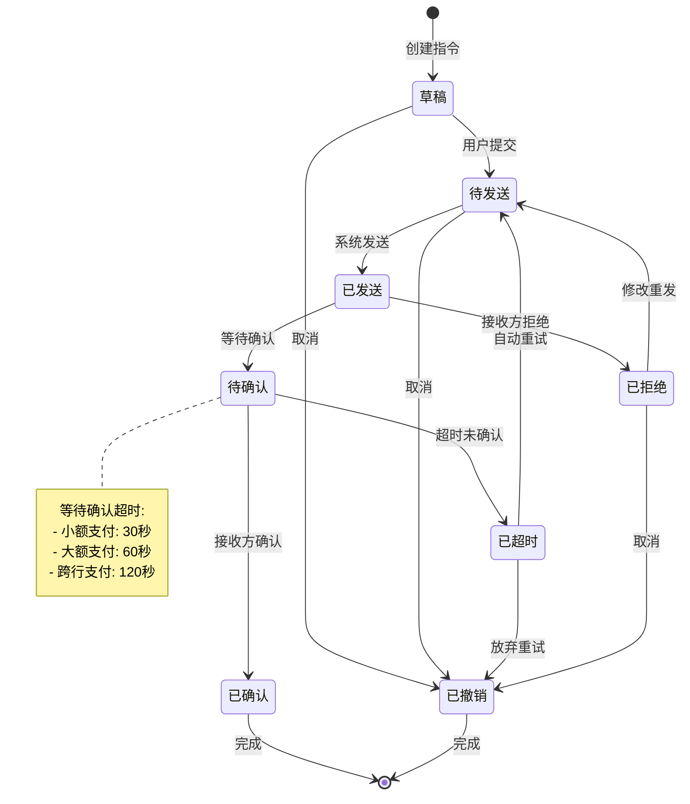
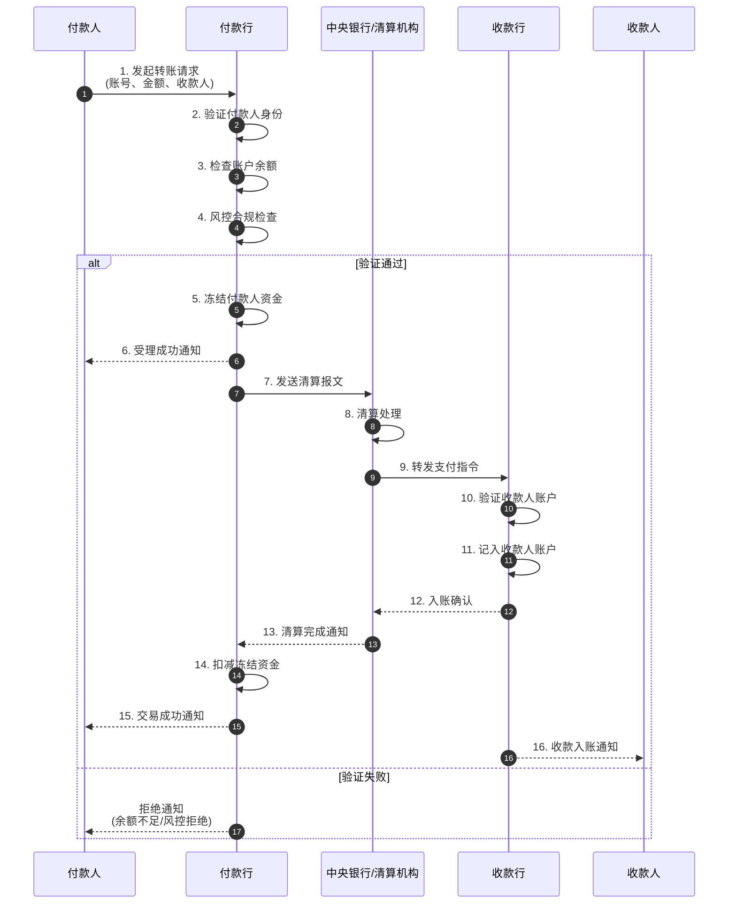
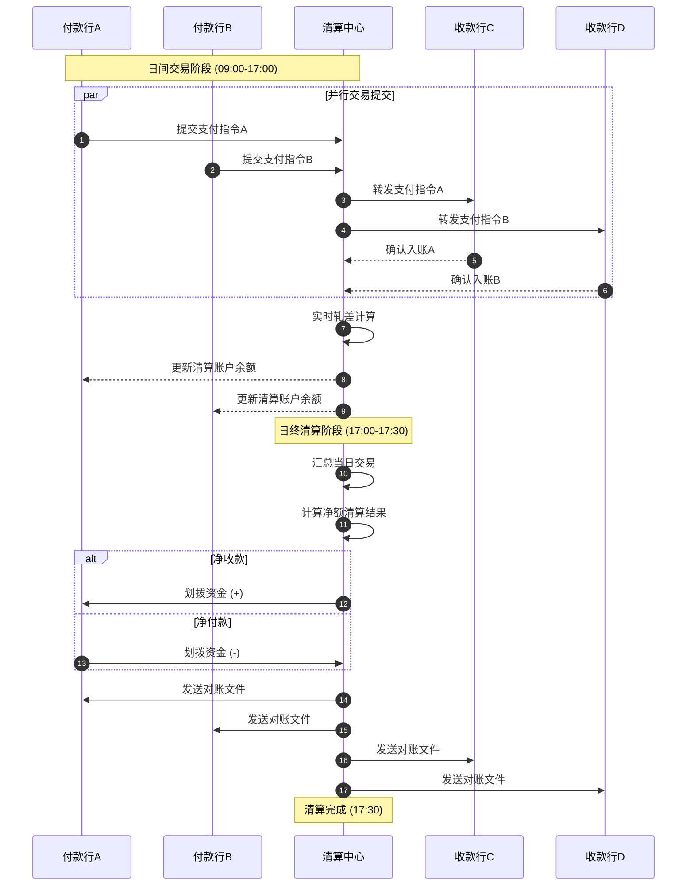
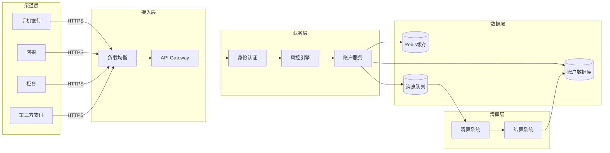

# Banking Schema信息表征动态动作分析视图

**版本**: v1.0
**创建日期**: 2026-02-15
**标准**: ISO 20022:2023, SWIFT MX/MT, CNAPS2

---

## 📑 目录

- [Banking Schema信息表征动态动作分析视图](#banking-schema信息表征动态动作分析视图)
  - [📑 目录](#-目录)
  - [1. 动态动作分析概述](#1-动态动作分析概述)
  - [2. 状态机形式化](#2-状态机形式化)
    - [2.1 账户生命周期状态机](#21-账户生命周期状态机)
    - [2.2 交易处理状态机](#22-交易处理状态机)
    - [2.3 支付指令状态机](#23-支付指令状态机)
  - [3. 时序交互分析](#3-时序交互分析)
    - [3.1 转账交易完整流程](#31-转账交易完整流程)
    - [3.2 跨行清算流程](#32-跨行清算流程)
    - [3.3 实时支付(RTGS)流程](#33-实时支付rtgs流程)
  - [4. 数据流分析](#4-数据流分析)
    - [4.1 交易数据流动路径](#41-交易数据流动路径)
    - [4.2 数据包流动分析](#42-数据包流动分析)
    - [4.3 信息熵变化分析](#43-信息熵变化分析)
  - [5. 实时性分析](#5-实时性分析)
    - [5.1 SLA要求定义](#51-sla要求定义)
    - [5.2 延迟分析模型](#52-延迟分析模型)
    - [5.3 吞吐量计算](#53-吞吐量计算)
  - [6. 异常处理机制](#6-异常处理机制)
    - [6.1 超时处理机制](#61-超时处理机制)
    - [6.2 重试机制设计](#62-重试机制设计)
    - [6.3 回滚机制设计](#63-回滚机制设计)
    - [6.4 异常处理决策矩阵](#64-异常处理决策矩阵)
  - [7. Mermaid动态视图](#7-mermaid动态视图)
    - [7.1 账户生命周期状态机图](#71-账户生命周期状态机图)
    - [7.2 交易处理状态机图](#72-交易处理状态机图)
    - [7.3 支付指令状态机图](#73-支付指令状态机图)
    - [7.4 转账交易完整流程时序图](#74-转账交易完整流程时序图)
    - [7.5 跨行清算流程时序图](#75-跨行清算流程时序图)
    - [7.6 实时支付(RTGS)流程时序图](#76-实时支付rtgs流程时序图)
    - [7.7 交易数据流图](#77-交易数据流图)
    - [7.8 异常处理流程图](#78-异常处理流程图)

---

## 1. 动态动作分析概述

银行信息系统动态动作分析关注金融交易在运行时的行为特征，包括：

- **状态转换**: 账户和交易在不同状态间的迁移
- **时序交互**: 参与方之间的消息传递顺序和因果关系
- **数据流动**: 交易数据在各系统组件间的传递路径
- **实时性能**: 满足SLA要求的延迟和吞吐量保障
- **异常恢复**: 故障场景下的超时、重试和回滚机制

---

## 2. 状态机形式化

### 2.1 账户生命周期状态机

```
状态集合: S = {待开户, 正常, 部分冻结, 全额冻结, 久悬, 销户}

状态转换函数:
δ(待开户) = 正常        (开户审批通过)
δ(正常)   = 部分冻结    (司法冻结部分金额)
δ(正常)   = 全额冻结    (司法全额冻结)
δ(正常)   = 久悬        (长期无交易)
δ(正常)   = 销户        (客户申请销户)
δ(部分冻结) = 正常      (冻结解除)
δ(部分冻结) = 全额冻结  (追加冻结)
δ(全额冻结) = 部分冻结  (部分解冻)
δ(全额冻结) = 正常      (全部解冻)
δ(久悬)   = 正常        (重新激活)

状态不变式:
∀账户: 余额(账户) ≥ 冻结金额(账户)
∀账户: 状态(账户) ∈ S
```

**账户状态转换矩阵:**

| 当前状态 | 开户审批 | 司法冻结 | 冻结解除 | 长期无交易 | 客户销户 | 重新激活 |
|---------|---------|---------|---------|-----------|---------|---------|
| **待开户** | 正常 | - | - | - | - | - |
| **正常** | - | 部分/全额冻结 | - | 久悬 | 销户 | - |
| **部分冻结** | - | 全额冻结 | 正常 | - | - | - |
| **全额冻结** | - | - | 部分冻结/正常 | - | - | - |
| **久悬** | - | - | - | - | 销户 | 正常 |
| **销户** | - | - | - | - | - | - |

### 2.2 交易处理状态机

```
交易状态集合: T = {已接收, 验证中, 验证通过, 验证失败, 清算中, 清算完成, 结算中, 已结算, 已完成, 已冲正, 已撤销}

状态转换流程:
1. 交易提交阶段
   已接收 → 验证中

2. 交易验证阶段
   验证中 → 验证通过  (余额充足、风控通过、签名有效)
   验证中 → 验证失败  (余额不足、风控拒绝、签名无效)

3. 交易清算阶段
   验证通过 → 清算中  (进入清算队列)
   清算中 → 清算完成  (清算成功)
   清算中 → 已冲正    (清算失败，自动冲正)

4. 交易结算阶段
   清算完成 → 结算中  (发起结算请求)
   结算中 → 已结算    (结算成功)
   结算中 → 已冲正    (结算失败)

5. 交易完成阶段
   已结算 → 已完成    (通知发送完成)

6. 异常处理
   任意状态 → 已撤销  (客户主动撤销)
   任意状态 → 已冲正  (系统异常触发)
```

**交易状态转换条件:**

| 转换 | 触发条件 | 执行动作 | 时间限制 |
|-----|---------|---------|---------|
| 已接收→验证中 | 报文解析成功 | 风控检查启动 | < 100ms |
| 验证中→验证通过 | 所有检查通过 | 扣减可用余额 | < 500ms |
| 验证中→验证失败 | 任一检查失败 | 记录失败原因 | < 500ms |
| 验证通过→清算中 | 进入处理队列 | 生成清算批次 | < 50ms |
| 清算中→清算完成 | 清算系统确认 | 更新清算状态 | 视渠道而定 |
| 清算完成→结算中 | 触发结算指令 | 资金划拨请求 | < 200ms |
| 结算中→已结算 | 结算确认 | 更新账户余额 | < 1s |
| 已结算→已完成 | 通知发送成功 | 记录交易日志 | < 200ms |

### 2.3 支付指令状态机

```
支付指令状态: P = {草稿, 待发送, 已发送, 待确认, 已确认, 已拒绝, 已超时, 已撤销}

状态转换规则:

草稿 → 待发送      (用户提交支付指令)
待发送 → 已发送    (系统发送报文)
已发送 → 待确认    (等待接收方确认)
已发送 → 已拒绝    (接收方返回拒绝)
待确认 → 已确认    (接收方返回确认)
待确认 → 已超时    (超过确认时限)
已超时 → 待发送    (自动重试发送)
任意状态 → 已撤销  (用户主动撤销)

支付指令生命周期:
┌─────────┐   ┌─────────┐   ┌─────────┐   ┌─────────┐   ┌─────────┐
│  草稿    │ → │ 待发送  │ → │ 已发送  │ → │ 待确认  │ → │ 已确认  │
└─────────┘   └─────────┘   └─────────┘   └─────────┘   └─────────┘
                                │              │
                                ▼              ▼
                           ┌─────────┐   ┌─────────┐
                           │ 已拒绝  │   │ 已超时  │
                           └─────────┘   └─────────┘
                                               │
                                               ▼ (重试)
                                          ┌─────────┐
                                          │ 待发送  │
                                          └─────────┘
```

---

## 3. 时序交互分析

### 3.1 转账交易完整流程

```
参与方:
- 付款人 (Payer)
- 付款行 (Payer Bank)
- 中央银行/清算机构 (CB)
- 收款行 (Payee Bank)
- 收款人 (Payee)

时序流程:

T0: 付款人发起转账请求
T1 = T0 + Δt1: 付款行接收请求，验证付款人身份和余额
T2 = T1 + Δt2: 付款行冻结付款人账户资金
T3 = T2 + Δt3: 付款行发送清算报文至中央银行
T4 = T3 + Δt4: 中央银行清算处理
T5 = T4 + Δt5: 中央银行转发报文至收款行
T6 = T5 + Δt6: 收款行验证并记入收款人账户
T7 = T6 + Δt7: 收款行发送确认至中央银行
T8 = T7 + Δt8: 中央银行通知付款行清算完成
T9 = T8 + Δt9: 付款行扣减付款人冻结资金
T10 = T9 + Δt10: 付款行发送交易回执给付款人
T11 = T10 + Δt11: 收款行通知收款人入账

总延迟: T_total = ΣΔti (i=1 to 11)
```

### 3.2 跨行清算流程

```
跨行清算时序模型:

阶段1: 日间交易处理 (09:00 - 17:00)
- 实时接收支付指令
- 实时进行轧差计算
- 实时更新清算账户

阶段2: 日终批量清算 (17:00 - 17:30)
- 汇总当日所有交易
- 计算净额清算结果
- 执行最终资金划拨

阶段3: 清算后处理 (17:30 - 18:00)
- 生成对账文件
- 发送给各参与行
- 完成当日清算

轧差计算模型:
净额 = Σ(收款金额) - Σ(付款金额)
若 净额 > 0: 该机构为净收款方
若 净额 < 0: 该机构为净付款方
若 净额 = 0: 该机构轧差平衡
```

### 3.3 实时支付(RTGS)流程

```
RTGS (Real-Time Gross Settlement) 特征:
- 逐笔处理支付指令
- 实时全额结算
- 资金即时划拨

时序要求:
- 交易接收: < 50ms
- 风险控制检查: < 100ms
- 账户余额验证: < 20ms
- 资金冻结: < 20ms
- 清算处理: < 100ms
- 资金划拨: < 50ms
- 交易确认: < 50ms

端到端总延迟: < 390ms (99.9%的交易)

并发处理:
- 系统吞吐量: ≥ 10,000 TPS
- 峰值处理能力: ≥ 50,000 TPS
- 清算队列容量: ≥ 1,000,000 笔
```

---

## 4. 数据流分析

### 4.1 交易数据流动路径

```
交易数据生命周期:

1. 发起阶段
   ┌─────────────────────────────────────────┐
   │ 渠道层: 网银/手机银行/柜台/第三方支付     │
   │   - 用户身份认证                         │
   │   - 交易信息录入                         │
   │   - 数字签名生成                         │
   └─────────────────────────────────────────┘
                    │
                    ▼ (HTTPS/ISO8583)
2. 接入阶段
   ┌─────────────────────────────────────────┐
   │ 网关层: API Gateway                     │
   │   - 报文解析与验证                       │
   │   - 流量控制与限流                       │
   │   - 安全认证检查                         │
   └─────────────────────────────────────────┘
                    │
                    ▼ (内部协议)
3. 处理阶段
   ┌─────────────────────────────────────────┐
   │ 核心业务系统:                            │
   │   - 账户余额查询                         │
   │   - 风控规则检查                         │
   │   - 交易金额冻结                         │
   └─────────────────────────────────────────┘
                    │
                    ▼ (报文交换)
4. 清算阶段
   ┌─────────────────────────────────────────┐
   │ 清算系统:                               │
   │   - 支付指令转发                         │
   │   - 轧差净额计算                         │
   │   - 资金划拨执行                         │
   └─────────────────────────────────────────┘
                    │
                    ▼ (通知)
5. 完成阶段
   ┌─────────────────────────────────────────┐
   │ 通知系统:                               │
   │   - 短信/邮件通知                        │
   │   - 交易回执生成                         │
   │   - 历史记录归档                         │
   └─────────────────────────────────────────┘
```

### 4.2 数据包流动分析

```
支付报文生命周期:

生成阶段:
┌─────────────────────────────────────────────────────────────┐
│ 应用层封装:                                                  │
│   Header: 报文头 (消息类型、发送方、接收方、时间戳)           │
│   Body: 业务数据 (账号、金额、币种、用途)                     │
│   Signature: 数字签名                                        │
│   Trailer: 报文尾 (校验和、MAC)                              │
└─────────────────────────────────────────────────────────────┘

传输阶段:
┌─────────────────────────────────────────────────────────────┐
│ 网络层处理:                                                  │
│   - TLS/SSL加密传输                                          │
│   - 负载均衡分发                                             │
│   - 路由选择优化                                             │
└─────────────────────────────────────────────────────────────┘

接收阶段:
┌─────────────────────────────────────────────────────────────┐
│ 解析层处理:                                                  │
│   - 报文完整性校验                                           │
│   - 数字签名验证                                             │
│   - 业务数据提取                                             │
│   - 重复交易检测                                             │
└─────────────────────────────────────────────────────────────┘
```

### 4.3 信息熵变化分析

```
金融数据在系统中的熵变:

原始输入:        H ≈ 128 bits (敏感交易信息)
     │
     │ 加密传输
     ▼
密文数据:        H ≈ 256 bits (AES加密后)
     │
     │ 解密处理
     ▼
明文业务数据:    H ≈ 64 bits (结构化字段)
     │
     │ 业务验证
     ▼
验证结果:        H ≈ 1 bit (通过/拒绝)
     │
     │ 记账处理
     ▼
账户状态:        H ≈ 32 bits (余额更新)
     │
     │ 通知生成
     ▼
通知消息:        H ≈ 16 bits (成功/失败)

信息保护点:
1. 传输加密: 防止中间人攻击
2. 访问控制: 最小权限原则
3. 数据脱敏: 保护敏感信息
4. 审计日志: 完整操作追溯
```

---

## 5. 实时性分析

### 5.1 SLA要求定义

```
服务等级协议 (SLA) 指标:

交易类型        │ 响应时间   │ 可用性    │ 吞吐量    │ 错误率
────────────────┼───────────┼──────────┼──────────┼─────────
账户查询        │ < 200ms   │ 99.99%   │ 50,000 QPS│ < 0.01%
余额查询        │ < 100ms   │ 99.99%   │ 100,000 QPS│< 0.01%
转账交易        │ < 1s      │ 99.95%   │ 10,000 TPS│ < 0.05%
实时支付(RTGS)  │ < 500ms   │ 99.99%   │ 20,000 TPS│ < 0.01%
跨行清算        │ < 5s      │ 99.9%    │ 5,000 TPS │ < 0.1%
批量代发        │ < 1小时   │ 99.5%    │ 100,000笔/批次│< 0.5%

业务时段要求:
- 工作日 09:00-17:00: 全功能开放，最高性能
- 工作日 17:00-20:00: 清算结算时段，部分功能受限
- 非工作日: 查询类服务，交易次日处理
```

### 5.2 延迟分析模型

```
交易处理延迟分解:

总延迟 = 网络延迟 + 系统延迟 + 处理延迟 + 排队延迟

网络延迟 (T_network):
- 客户端到网关: 10-50ms (取决于地理位置)
- 网关到核心: 1-5ms (内网)
- 核心到清算: 5-20ms (专线)
- 小计: 16-75ms

系统延迟 (T_system):
- 负载均衡: 1-2ms
- API网关: 2-5ms
- 服务发现: 1-3ms
- 小计: 4-10ms

处理延迟 (T_process):
- 身份认证: 10-20ms
- 风控检查: 20-50ms
- 账户操作: 10-20ms
- 清算处理: 50-100ms
- 小计: 90-190ms

排队延迟 (T_queue):
- 正常负载: 1-5ms
- 高峰负载: 10-50ms
- 极端负载: 50-200ms
- 小计: 1-200ms

总延迟范围: 111-475ms (P99: < 500ms)
```

### 5.3 吞吐量计算

```
系统容量规划:

峰值TPS计算:
TPS_peak = (日交易笔数 × 峰值系数) / (峰值持续秒数)

假设:
- 日交易笔数: 10,000,000 笔
- 峰值系数: 1.5 (峰值是平均的1.5倍)
- 峰值持续: 2小时 (7200秒)

计算:
TPS_avg = 10,000,000 / 86,400 ≈ 116 TPS
TPS_peak = (10,000,000 × 1.5) / 7200 ≈ 2,083 TPS

设计容量 (考虑3倍冗余):
TPS_design = 2,083 × 3 ≈ 6,250 TPS

资源需求估算:
- 应用服务器: 6,250 / 500 = 12.5 → 16 台 (每台500TPS)
- 数据库连接: 6,250 × 2 = 12,500 连接
- 缓存容量: 6,250 × 100KB × 3600s = 2.25TB
- 带宽需求: 6,250 × 10KB × 8 = 500 Mbps
```

---

## 6. 异常处理机制

### 6.1 超时处理机制

```
超时层级设计:

Level 1: 客户端超时 (30s)
- 用户等待容忍上限
- 触发异步处理提示
- 提供交易状态查询

Level 2: 网关超时 (10s)
- API Gateway等待后端响应
- 超时返回503错误
- 触发熔断保护

Level 3: 服务调用超时 (5s)
- 微服务间调用超时
- 触发服务降级
- 记录调用链异常

Level 4: 数据库超时 (3s)
- SQL执行超时
- 触发连接池回收
- 记录慢查询日志

超时处理策略:
1. 快速失败: 立即返回错误，不等待
2. 降级处理: 使用缓存或默认值
3. 异步处理: 转后台处理，稍后通知
4. 补偿机制: 记录待处理，定时补偿
```

### 6.2 重试机制设计

```
重试策略模型:

指数退避算法:
delay = base_delay × (2 ^ attempt) + random_jitter

参数设置:
- base_delay: 100ms
- max_delay: 30s
- max_attempts: 5
- jitter: 0-100ms

重试时间序列:
Attempt 1: 100ms + jitter
Attempt 2: 200ms + jitter
Attempt 3: 400ms + jitter
Attempt 4: 800ms + jitter
Attempt 5: 1600ms + jitter

幂等性保障:
- 每个请求携带唯一ID (UUID)
- 服务端记录已处理请求ID
- 重复请求返回原处理结果
- 数据库唯一约束防重

可重试错误 vs 不可重试错误:
可重试:
- 网络超时
- 服务暂时不可用
- 数据库连接失败
- 限流拒绝

不可重试:
- 余额不足
- 账户不存在
- 签名验证失败
- 风控拒绝
```

### 6.3 回滚机制设计

```
分布式事务回滚 (Saga模式):

正常流程:
T1: 冻结付款方资金
T2: 发送清算指令
T3: 收款方入账
T4: 扣减付款方冻结资金

补偿流程 (任一环节失败):
C1: 解冻付款方资金 (补偿T1)
C2: 发送冲正指令 (补偿T2)
C3: 扣回收款方资金 (补偿T3)
C4: 无操作 (T4未执行)

回滚触发条件:
- 清算系统返回失败
- 收款行无法入账
- 超时未收到确认
- 系统异常中断

回滚执行顺序:
1. 按逆序执行补偿操作
2. 每个补偿操作需幂等
3. 补偿失败进入人工处理队列
4. 记录完整补偿日志

回滚时限:
- 自动回滚: 交易提交后5分钟内
- 人工介入: 超过5分钟的异常交易
```

### 6.4 异常处理决策矩阵

```
异常场景分类与处理:

异常类型        │ 检测方式       │ 自动处理       │ 人工介入      │ 通知方式
────────────────┼───────────────┼───────────────┼──────────────┼──────────
网络超时        │ 连接超时      │ 重试3次        │ 超过3次       │ 日志+告警
数据库异常      │ 连接池监控    │ 切换备库       │ 主库恢复      │ 紧急告警
余额不足        │ 账户检查      │ 直接拒绝       │ 无需介入      │ 客户端提示
风控拒绝        │ 规则引擎      │ 记录可疑       │ 可疑审核      │ 风控通知
清算失败        │ 返回码        │ 自动冲正       │ 冲正失败      │ 双重告警
重复交易        │ 幂等检查      │ 返回原结果     │ 无需介入      │ 日志记录
系统故障        │ 健康检查      │ 服务降级       │ 故障恢复      │ 全员告警
```

---

## 7. Mermaid动态视图

### 7.1 账户生命周期状态机图



### 7.2 交易处理状态机图



### 7.3 支付指令状态机图



### 7.4 转账交易完整流程时序图



### 7.5 跨行清算流程时序图



### 7.6 实时支付(RTGS)流程时序图

```mermaid
sequenceDiagram
    autonumber
    participant P as 付款行
    participant CB as RTGS系统
    participant R as 收款行

    Note over P,CB: 实时全额结算 (RTGS)

    P->>P: 1. 验证账户余额充足
    P->>CB: 2. 提交RTGS指令

    CB->>CB: 3. 验证付款行清算账户
    CB->>CB: 4. 实时资金划拨

    alt 清算账户充足
        CB->>CB: 5a. 借记付款行账户
        CB->>CB: 6a. 贷记收款行账户
        CB->>R: 7a. 转发支付指令

        R->>R: 8a. 记入收款人账户
        R-->>CB: 9a. 入账确认
        CB-->>P: 10a. 结算完成确认

        Note right of CB: 端到端延迟 &lt; 500ms
    else 清算账户不足
        CB-->>P: 5b. 结算失败通知<br/>(排队或拒绝)
    end
```

### 7.7 交易数据流图



### 7.8 异常处理流程图

```mermaid
flowchart TD
    A[交易提交] --> B{验证检查}
    B -->|通过| C[冻结资金]
    B -->|失败| Z[返回错误]

    C --> D{清算处理}
    D -->|成功| E[结算处理]
    D -->|失败| F[触发冲正]

    E -->{结算处理}
    E -->|成功| G[交易完成]
    E -->|失败| F

    F --> H{冲正结果}
    H -->|成功| I[资金解冻]
    H -->|失败| J[人工处理队列]

    I --> K[交易冲正完成]

    J --> L[运营人员介入]
    L --> M{问题解决}
    M -->|是| N[手动冲正]
    M -->|否| O[挂账处理]

    Z --> P[结束]
    G --> P
    K --> P
    N --> P
    O --> P

    style F fill:#f96,stroke:#333
    style J fill:#f96,stroke:#333
    style O fill:#f96,stroke:#333
```

---

**参考文档**:

- `01_Overview.md` - 银行信息系统概述
- `02_Formal_Definition.md` - 形式化定义
- `04_Transformation.md` - 模型转换
- `05_Case_Studies.md` - 案例研究
- ISO 20022:2023 标准
- 中国人民银行支付系统规范

**维护者**: DSL Schema研究团队
