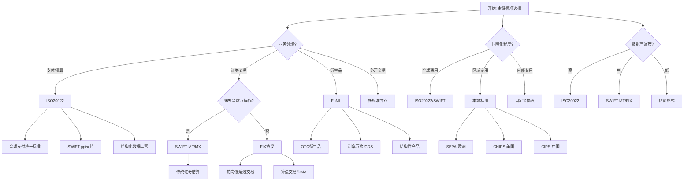
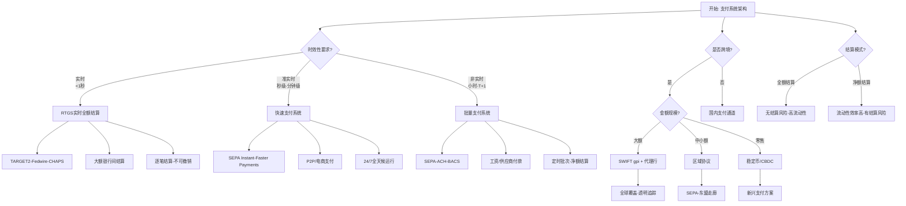
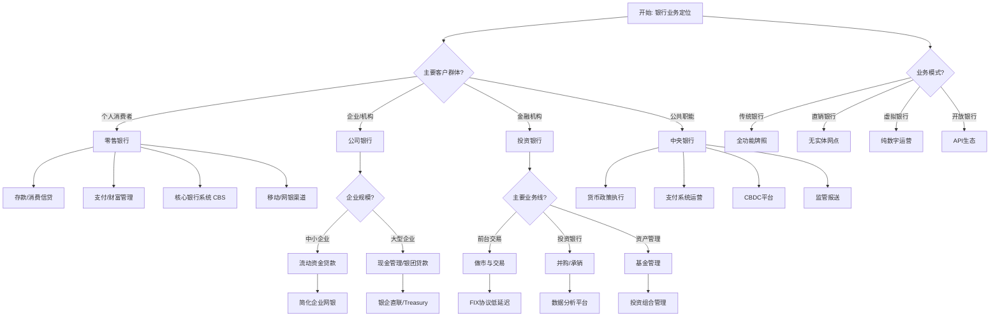
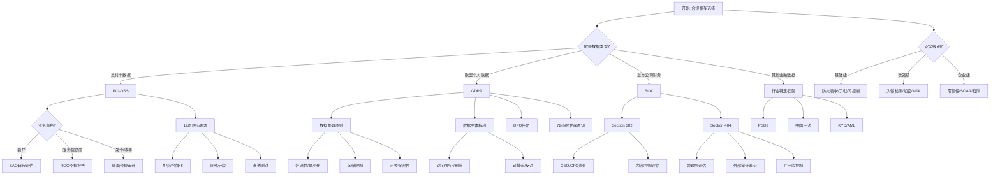
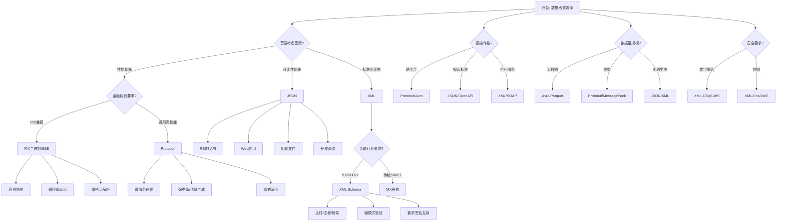

# 金融服务Schema决策树图

**版本**: v1.0
**创建日期**: 2026-02-15
**适用范围**: 金融服务Schema设计和选型

---

## 📑 目录

- [金融服务Schema决策树图](#金融服务schema决策树图)
  - [📑 目录](#-目录)
  - [概览](#概览)
  - [1. 金融标准选择决策树](#1-金融标准选择决策树)
  - [2. 支付系统架构决策树](#2-支付系统架构决策树)
  - [3. 银行业务领域决策树](#3-银行业务领域决策树)
  - [4. 合规与安全级别决策树](#4-合规与安全级别决策树)
  - [5. 数据交换格式决策树](#5-数据交换格式决策树)
  - [6. Mermaid可视化](#6-mermaid可视化)
    - [6.1 金融标准选择流程图](#61-金融标准选择流程图)
    - [6.2 支付系统架构流程图](#62-支付系统架构流程图)
    - [6.3 银行业务领域流程图](#63-银行业务领域流程图)
    - [6.4 合规与安全级别流程图](#64-合规与安全级别流程图)
    - [6.5 数据交换格式流程图](#65-数据交换格式流程图)
  - [使用指南](#使用指南)
    - [如何使用这些决策树](#如何使用这些决策树)
    - [决策树组合使用示例](#决策树组合使用示例)
    - [常见陷阱与建议](#常见陷阱与建议)

---

## 概览

| 决策树 | 适用场景 | 关键决策点 | 输出结果 |
|--------|----------|------------|----------|
| 金融标准选择 | 消息格式标准化 | 业务领域、国际化程度、资产类型 | ISO20022/SWIFT/FIX/FpML |
| 支付系统架构 | 支付系统设计 | 时效性、金额、跨境需求 | RTGS/批量支付/跨境支付 |
| 银行业务领域 | 系统功能定位 | 客户类型、业务复杂度、监管要求 | 零售/投行/央行 |
| 合规与安全级别 | 合规体系设计 | 数据类型、地域、上市状态 | PCI-DSS/GDPR/SOX |
| 数据交换格式 | 技术架构选型 | 性能、可读性、兼容性 | XML/JSON/FIX/Protobuf |

---

## 1. 金融标准选择决策树

```text
开始: 选择金融消息标准
│
├─ Q: 业务领域是什么?
│   │
│   ├─ 支付/清算
│   │   └─ 决策: 优先ISO20022
│   │       ├─ 理由: 全球支付统一标准
│   │       ├─ 适用: SWIFT gpi、实时支付
│   │       └─ 优势: 丰富数据、结构化信息
│   │
│   ├─ 证券交易
│   │   └─ 决策: 选择SWIFT或FIX
│   │       │
│   │       ├─ Q: 需要全球互操作?
│   │       │   ├─ 是 → SWIFT (MT/MX)
│   │       │   │       ├─ MT: 传统证券结算
│   │       │   │       └─ MX (ISO20022): 新一代标准
│   │       │   │
│   │       │   └─ 否 → FIX协议
│   │       │           ├─ 理由: 前向交易低延迟
│   │       │           ├─ 适用: 算法交易、DMA
│   │       │           └─ 版本: FIX.5.0 SP2/FIXT.1.1
│   │
│   ├─ 衍生品/结构性产品
│   │   └─ 决策: 选择FpML
│   │       ├─ 理由: 衍生品领域专用标准
│   │       ├─ 适用: OTC衍生品、CDS、利率互换
│   │       ├─ 版本: FpML 5.12
│   │       └─ 支持资产: 利率、外汇、信用、股权、商品
│   │
│   └─ 外汇交易
│       └─ 决策: 多标准并存
│           ├─ 前台: FIX (低延迟执行)
│           ├─ 确认: SWIFT (MT300/MT304)
│           └─ 结算: ISO20022 (pacs.009)
│
├─ Q: 国际化程度要求?
│   │
│   ├─ 全球通用 → ISO20022或SWIFT
│   ├─ 区域专用 → 本地标准
│   │       ├─ 欧洲: TARGET2/SEPA
│   │       ├─ 美国: CHIPS/Fedwire
│   │       └─ 中国: CIPS/CNAPS
│   └─ 内部专用 → 自定义协议
│
├─ Q: 数据丰富度需求?
│   │
│   ├─ 高 (结构化数据) → ISO20022
│   ├─ 中 (标准字段) → SWIFT MT/FIX
│   └─ 低 (关键数据) → 精简格式
│
└─ Q: 实施复杂度承受度?
    │
    ├─ 高 → ISO20022 (学习曲线陡峭但功能强大)
    ├─ 中 → FIX/FpML (领域专业)
    └─ 低 → SWIFT MT (成熟稳定)
```

---

## 2. 支付系统架构决策树

```text
开始: 设计支付系统架构
│
├─ Q: 支付时效性要求?
│   │
│   ├─ 实时 (<1秒)
│   │   └─ 决策: 实时支付系统 (RTGS/RTNS)
│   │       ├─ 架构: 实时全额结算
│   │       ├─ 代表系统:
│   │       │   ├─ TARGET2 (欧洲)
│   │       │   ├─ Fedwire (美国)
│   │       │   ├─ CHAPS (英国)
│   │       │   └─ 大额支付系统 (中国)
│   │       ├─ 适用场景:
│   │       │   ├─ 大额银行间结算
│   │       │   ├─ 紧急商业支付
│   │       │   └─ 金融市场结算
│   │       └─ 技术特点:
│   │           ├─ 实时消息处理
│   │           ├─ 逐笔结算
│   │           └─ 最终性不可撤销
│   │
│   ├─ 准实时 (秒级-分钟级)
│   │   └─ 决策: 快速支付系统
│   │       ├─ 架构: 24/7实时零售支付
│   │       ├─ 代表系统:
│   │       │   ├─ SEPA Instant (欧洲)
│   │       │   ├─ Faster Payments (英国)
│   │       │   ├─ Zelle/Venmo (美国)
│   │       │   └─ 网联支付 (中国)
│   │       ├─ 适用场景:
│   │       │   ├─ 个人转账
│   │       │   ├─ P2P支付
│   │       │   ├─ 电商支付
│   │       │   └─ 账单支付
│   │       └─ 技术特点:
│   │           ├─ 全天候运行
│   │           ├─ 秒级到账
│   │           └─ 金额限制(通常<10万欧元)
│   │
│   └─ 非实时 (小时级-T+1)
│       └─ 决策: 批量支付系统
│           ├─ 架构: 批量净额结算
│           ├─ 代表系统:
│           │   ├─ SEPA Credit Transfer
│           │   ├─ ACH (美国)
│           │   ├─ BACS (英国)
│           │   └─ 小额支付系统 (中国)
│           ├─ 适用场景:
│           │   ├─ 工资发放
│           │   ├─ 供应商付款
│           │   ├─ 定期扣款
│           │   └─ 批量代付
│           └─ 技术特点:
│               ├─ 定时批次处理
│               ├─ 净额结算降低成本
│               └─ 高吞吐量
│
├─ Q: 是否涉及跨境?
│   │
│   ├─ 是
│   │   └─ 决策: 选择跨境支付方案
│   │       │
│   │       ├─ Q: 金额规模?
│   │       │   │
│   │       │   ├─ 大额 → SWIFT gpi + 代理行
│   │       │   │       ├─ 优势: 全球覆盖
│   │       │   │       ├─ 特点: 透明度追踪
│   │       │   │       └─ 成本: 费用较高
│   │       │   │
│   │       │   ├─ 中小额 → 区域协议
│   │       │   │       ├─ SEPA (欧洲)
│   │       │   │       ├─ 东盟支付走廊
│   │       │   │       └─ 双边货币互换
│   │       │   │
│   │       │   └─ 零售 → 新兴方案
│   │       │           ├─ 稳定币/央行数字货币
│   │       │           ├─ 区块链跨境 (Ripple等)
│   │       │           └─ 第三方支付 (支付宝国际)
│   │       │
│   │       └─ Q: 合规要求?
│   │           ├─ 严格 (制裁筛查) → SWIFT
│   │           └─ 一般 → 本地清算通道
│   │
│   └─ 否 → 国内支付通道
│
├─ Q: 结算模式选择?
│   │
│   ├─ 全额结算 (RTGS)
│   │   ├─ 优势: 无结算风险
│   │   ├─ 劣势: 流动性占用高
│   │   └─ 适用: 大额支付
│   │
│   └─ 净额结算 (DNS)
│       ├─ 优势: 流动性效率高
│       ├─ 劣势: 存在结算风险
│       └─ 适用: 零售/批量支付
│
└─ Q: 技术栈选择?
    │
    ├─ 传统集中式 → 核心银行系统
    ├─ 混合架构 → 微服务+核心
    └─ 创新架构 → 分布式账本(DLT)
```

---

## 3. 银行业务领域决策树

```text
开始: 确定银行业务领域定位
│
├─ Q: 主要客户群体?
│   │
│   ├─ 个人消费者
│   │   └─ 决策: 零售银行 (Retail Banking)
│   │       ├─ 核心产品:
│   │       │   ├─ 存款账户 (活期/定期/储蓄)
│   │       │   ├─ 消费信贷 (信用卡/车贷/房贷)
│   │       │   ├─ 支付服务 (转账/汇款)
│   │       │   ├─ 财富管理 (理财/基金/保险)
│   │       │   └─ 数字银行服务
│   │       │
│   │       ├─ 技术系统重点:
│   │       │   ├─ 核心银行系统 (CBS)
│   │       │   ├─ 渠道系统 (网银/手机/ATM)
│   │       │   ├─ 风控系统 (反欺诈/信用评分)
│   │       │   ├─ CRM系统 (客户管理)
│   │       │   └─ 支付网关
│   │       │
│   │       ├─ 数据标准:
│   │       │   ├─ ISO20022 (支付消息)
│   │       │   ├─ IFX (交互金融交换)
│   │       │   └─ OFX (开放金融交换)
│   │       │
│   │       └─ 监管关注:
│   │           ├─ 消费者保护
│   │           ├─ 存款保险
│   │           ├─ 反洗钱(AML)
│   │           └─ 普惠金融
│   │
│   ├─ 企业/机构客户
│   │   └─ 决策: 公司银行 (Corporate Banking)
│   │       │
│   │       ├─ Q: 企业规模?
│   │       │   │
│   │       │   ├─ 中小企业(SME)
│   │       │   │   ├─ 产品: 流动资金贷款/贸易融资
│   │       │   │   └─ 系统: 简化版企业网银
│   │       │   │
│   │       │   └─ 大型企业
│   │       │       ├─ 产品: 现金管理/银团贷款/债券承销
│   │       │       └─ 系统: 银企直联/Treasury系统
│   │       │
│   │       ├─ 核心产品:
│   │       │   ├─ 现金管理 (流动性/收款/付款)
│   │       │   ├─ 贸易融资 (信用证/保函/福费廷)
│   │       │   ├─ 供应链金融
│   │       │   ├─ 外汇服务
│   │       │   └─ 项目融资
│   │       │
│   │       └─ 技术系统重点:
│   │           ├─ ERP集成 (SAP/Oracle)
│   │           ├─ SWIFT连接
│   │           ├─ 贸易融资平台
│   │           └─ 多银行现金管理平台
│   │
│   └─ 金融机构/专业投资者
│       └─ 决策: 投资银行 (Investment Banking)
│           │
│           ├─ Q: 主要业务线?
│           │   │
│           │   ├─ 前台交易
│           │   │   ├─ 做市与交易 (债券/外汇/衍生品)
│           │   │   ├─ 系统: 低延迟交易平台
│           │   │   ├─ 协议: FIX/FAST
│           │   │   └─ 要求: 微秒级延迟
│           │   │
│           │   ├─ 投资银行部门 (IBD)
│           │   │   ├─ 业务: 并购/承销/咨询
│           │   │   ├─ 系统: 数据分析平台
│           │   │   └─ 标准: FpML (衍生品)
│           │   │
│           │   └─ 资产管理
│           │       ├─ 业务: 基金管理/财富管理
│           │       └─ 系统: 投资组合管理
│           │
│           └─ 技术系统重点:
│               ├─ 电子交易平台
│               ├─ 风险管理系统 (市场风险/信用风险)
│               ├─ 清算结算系统
│               ├─ 算法交易引擎
│               └─ 市场数据系统 (Reuters/Bloomberg)
│
├─ Q: 是否涉及公共职能?
│   │
│   └─ 是 → 中央银行/政策性银行
│       ├─ 职能定位:
│       │   ├─ 货币政策执行
│       │   ├─ 金融稳定维护
│       │   ├─ 支付系统运营
│       │   └─ 监管与监督
│       │
│       ├─ 核心系统:
│       │   ├─ 支付系统运营 (RTGS)
│       │   ├─ 证券结算系统
│       │   ├─ 央行数字货币(CBDC)平台
│       │   └─ 监管报送系统
│       │
│       └─ 数据标准:
│           ├─ ISO20022 (国际协调)
│           ├─ 巴塞尔监管框架
│           └─ 央行统计标准
│
├─ Q: 业务模式选择?
│   │
│   ├─ 传统银行 → 全功能牌照
│   ├─ 直销银行 → 无实体网点
│   ├─ 虚拟银行 → 纯数字运营
│   └─ 开放银行 → API生态
│
└─ Q: 数字化转型重点?
    │
    ├─ 客户体验 → 移动优先
    ├─ 运营效率 → 流程自动化
    ├─ 产品创新 → 嵌入式金融
    └─ 生态构建 → BaaS平台
```

---

## 4. 合规与安全级别决策树

```text
开始: 确定合规与安全框架
│
├─ Q: 处理的敏感数据类型?
│   │
│   ├─ 支付卡数据
│   │   └─ 决策: PCI-DSS (支付卡行业数据安全标准)
│   │       │
│   │       ├─ Q: 业务角色?
│   │       │   │
│   │       │   ├─ 商户 → SAQ (自我评估问卷)
│   │       │   ├─ 服务提供商 → ROC (合规报告)
│   │       │   └─ 发卡/收单机构 → 全面合规
│   │       │
│   │       ├─ 合规等级:
│   │       │   ├─ Level 1: >600万交易/年 → 年度QSA审计
│   │       │   ├─ Level 2: 100-600万 → 年度SAQ
│   │       │   ├─ Level 3: 2-100万 → 年度SAQ
│   │       │   └─ Level 4: <2万 → SAQ建议
│   │       │
│   │       ├─ 12项核心要求:
│   │       │   ├─ 1. 安装维护防火墙
│   │       │   ├─ 2. 不使用供应商默认密码
│   │       │   ├─ 3. 保护存储的持卡人数据
│   │       │   ├─ 4. 加密传输中的数据
│   │       │   ├─ 5. 使用反病毒软件
│   │       │   ├─ 6. 开发维护安全系统
│   │       │   ├─ 7. 限制访问按需知密
│   │       │   ├─ 8. 分配唯一ID
│   │       │   ├─ 9. 限制物理访问
│   │       │   ├─ 10. 监控网络资源
│   │       │   ├─ 11. 定期安全测试
│   │       │   └─ 12. 信息安全政策
│   │       │
│   │       └─ 技术措施:
│   │           ├─ 数据加密 (AES-256)
│   │           ├─ 令牌化 (Tokenization)
│   │           ├─ 网络分段
│   │           └─ 定期渗透测试
│   │
│   ├─ 个人数据 (欧盟公民)
│   │   └─ 决策: GDPR (通用数据保护条例)
│   │       │
│   │       ├─ 适用范围判定:
│   │       │   ├─ 在欧盟境内有业务 → 适用
│   │       │   ├─ 处理欧盟居民数据 → 适用
│   │       │   └─ 监控欧盟用户行为 → 适用
│   │       │
│   │       ├─ 数据处理原则:
│   │       │   ├─ 合法性、公平性、透明性
│   │       │   ├─ 目的限制
│   │       │   ├─ 数据最小化
│   │       │   ├─ 准确性
│   │       │   ├─ 存储限制
│   │       │   └─ 完整性与保密性
│   │       │
│   │       ├─ 核心要求:
│   │       │   ├─ 数据主体权利保障
│   │       │   │   ├─ 访问权
│   │       │   │   ├─ 更正权
│   │       │   │   ├─ 删除权 (被遗忘权)
│   │       │   │   ├─ 限制处理权
│   │       │   │   ├─ 可携带权
│   │       │   │   └─ 反对权
│   │       │   │
│   │       │   ├─ 数据处理记录 (DPIA)
│   │       │   ├─ 数据保护官 (DPO) 任命
│   │       │   ├─ 数据泄露通知 (72小时)
│   │       │   └─ 隐私设计 (Privacy by Design)
│   │       │
│   │       └─ 违规处罚:
│   │           ├─ 轻度: 最高1000万欧元或全球营收2%
│   │           └─ 重度: 最高2000万欧元或全球营收4%
│   │
│   ├─ 财务报告数据 (上市公司)
│   │   └─ 决策: SOX (萨班斯-奥克斯利法案)
│   │       │
│   │       ├─ 适用范围:
│   │       │   ├─ 美国上市公司
│   │       │   ├─ 在美上市外国公司 (ADR)
│   │       │   └─ 准备IPO的公司
│   │       │
│   │       ├─ 关键条款:
│   │       │   │
│   │       │   ├─ Section 302:
│   │       │   │   ├─ CEO/CFO财务报告责任
│   │       │   │   ├─ 内部控制评估
│   │       │   │   └─ 定期合规声明
│   │       │   │
│   │       │   └─ Section 404:
│   │       │       ├─ 管理层内部控制评估
│   │       │       ├─ 外部审计师鉴证
│   │       │       └─ IT一般控制 (ITGC)
│   │       │
│   │       ├─ IT控制重点:
│   │       │   ├─ 访问控制 (逻辑/物理)
│   │       │   ├─ 变更管理
│   │       │   ├─ 计算机运行控制
│   │       │   └─ 应用控制
│   │       │
│   │       └─ 合规活动:
│   │           ├─ 风险评估
│   │           ├─ 控制设计与实施
│   │           ├─ 测试与监控
│   │           └─ 文档与报告
│   │
│   └─ 其他金融数据
│       └─ 决策: 行业特定框架
│           ├─ PSD2 (欧洲支付服务)
│           ├─ CCPA/CPRA (加州隐私)
│           ├─ 中国网络安全法/数据安全法/个保法
│           ├─ 巴塞尔协议 (资本充足率)
│           └─ KYC/AML (客户身份识别/反洗钱)
│
├─ Q: 安全级别分层?
│   │
│   ├─ 基础级:
│   │   ├─ 防火墙与反病毒
│   │   ├─ 定期补丁更新
│   │   └─ 基本访问控制
│   │
│   ├─ 增强级:
│   │   ├─ 入侵检测/防御
│   │   ├─ 数据加密
│   │   ├─ 多因素认证
│   │   └─ 安全监控
│   │
│   └─ 企业级:
│       ├─ 零信任架构
│       ├─ 威胁情报
│       ├─ 安全编排自动化 (SOAR)
│       └─ 红队演练
│
└─ Q: 认证与审计?
    │
    ├─ ISO 27001 (信息安全管理)
    ├─ ISO 27017 (云服务安全)
    ├─ SOC 2 Type II
    ├─ 行业特定认证
    └─ 渗透测试与漏洞评估
```

---

## 5. 数据交换格式决策树

```text
开始: 选择数据交换格式
│
├─ Q: 首要考虑因素?
│   │
│   ├─ 性能优先 (低延迟)
│   │   └─ 决策: 二进制格式
│   │       │
│   │       ├─ Q: 金融协议要求?
│   │       │   │
│   │       │   ├─ FIX协议兼容 → FIX二进制 (FIX/SBE)
│   │       │   │       ├─ 理由: FIX协议原生支持
│   │       │   │       ├─ 特点: 固定位置字段，零拷贝解析
│   │       │   │       ├─ 延迟: 微秒级
│   │       │   │       ├─ 适用: 高频交易、算法交易
│   │       │   │       └─ 版本: FIX 5.0 SP2 / FIXT
│   │       │   │
│   │       │   └─ 通用高性能 → Protobuf
│   │       │           ├─ 理由: 跨平台高效序列化
│   │       │           ├─ 特点: 紧凑二进制，模式演化
│   │       │           ├─ 延迟: 毫秒级
│   │       │           ├─ 适用: 微服务通信、实时流
│   │       │           └─ 优势: 强类型，代码生成
│   │       │
│   │       └─ Q: 吞吐量需求?
│   │           ├─ 极高 (>100万TPS) → SBE/SBE-ETF
│   │           ├─ 高 (10-100万TPS) → Protobuf/Aeron
│   │           └─ 中等 (<10万TPS) → JSON二进制变体
│   │
│   ├─ 可读性优先 (开发调试)
│   │   └─ 决策: JSON
│   │       ├─ 理由: 人类可读，广泛支持
│   │       ├─ 特点: 自描述，灵活模式
│   │       ├─ 适用场景:
│   │       │   ├─ REST API
│   │       │   ├─ Web应用
│   │       │   ├─ 配置文件
│   │       │   └─ 开发/测试环境
│   │       ├─ 变体选择:
│   │       │   ├─ 标准JSON: 通用场景
│   │       │   ├─ JSON Lines: 流处理
│   │       │   └─ BSON: 二进制JSON (MongoDB)
│   │       ├─ 优点:
│   │       │   ├─ 易于调试
│   │       │   ├─ 浏览器原生支持
│   │       │   └─ 丰富工具生态
│   │       └─ 缺点:
│   │           ├─ 无原生模式验证
│   │           ├─ 数字精度问题
│   │           └─ 无日期时间原生类型
│   │
│   └─ 标准化优先 (企业集成)
│       └─ 决策: XML
│           │
│           ├─ Q: 金融行业要求?
│           │   │
│           │   ├─ ISO20022消息 → XML Schema
│           │   │       ├─ 理由: 金融行业标准
│           │   │       ├─ 特点: 丰富数据，强验证
│           │   │       ├─ 标准: XSD 1.0/1.1
│           │   │       └─ 适用: 支付、证券、贸易
│           │   │
│           │   ├─ 传统SWIFT → MX格式 (ISO20022 XML)
│           │   └─ 遗留系统 → MT格式 (文本)
│           │
│           ├─ 优点:
│           │   ├─ 成熟标准生态
│           │   ├─ 强模式验证 (XSD)
│           │   ├─ 命名空间支持
│           │   ├─ 数字签名 (XML-DSig)
│           │   └─ 加密支持 (XML-Enc)
│           │
│           └─ 缺点:
│               ├─ 冗余标记，文件体积大
│               ├─ 解析开销高
│               └─ 学习曲线陡峭
│
├─ Q: 互操作性要求?
│   │
│   ├─ 跨语言/平台 → Protobuf/Avro/Thrift
│   ├─ Web标准 → JSON/OpenAPI
│   ├─ 企业服务 → XML/SOAP
│   └─ 专有系统 → 自定义二进制
│
├─ Q: 模式演化需求?
│   │
│   ├─ 强向后兼容 → Protobuf/Avro
│   ├─ 灵活扩展 → JSON + JSON Schema
│   └─ 版本管理 → XML命名空间
│
├─ Q: 数据量规模?
│   │
│   ├─ 大数据处理 → Avro/Parquet/Protobuf
│   ├─ 流式传输 → Protobuf/MessagePack
│   └─ 小到中等 → JSON/XML
│
└─ Q: 安全要求?
    │
    ├─ 数字签名 → XML-DSig / JSON-JWS
    ├─ 加密 → XML-Enc / JSON-JWE
    └─ 压缩 → 格式内置或Gzip
```

---

## 6. Mermaid可视化

### 6.1 金融标准选择流程图



### 6.2 支付系统架构流程图



### 6.3 银行业务领域流程图



### 6.4 合规与安全级别流程图



### 6.5 数据交换格式流程图



---

## 使用指南

### 如何使用这些决策树

1. **确定决策起点**
   - 根据当前项目阶段，找到对应的决策树
   - 从"开始"节点出发，按层次逐步回答关键问题

2. **评估决策因素**
   - 每个决策节点(菱形)代表一个关键问题
   - 仔细评估组织/项目的具体情况
   - 考虑短期需求和长期战略

3. **对比可选方案**
   - 每个分支末端给出推荐方案
   - 阅读理由说明，理解方案适用场景
   - 必要时参考概览表格快速对比

4. **综合考虑约束**
   - 技术约束: 现有系统兼容性
   - 业务约束: 监管要求、客户期望
   - 资源约束: 预算、时间、技能

### 决策树组合使用示例

**场景: 设计一个新的跨境支付平台**

1. 使用**金融标准选择决策树**
   - 业务领域: 支付 → ISO20022
   - 国际化: 全球 → ISO20022 + SWIFT gpi

2. 使用**支付系统架构决策树**
   - 时效性: 准实时 → 快速支付系统
   - 跨境: 是 → SWIFT gpi + 区域清算

3. 使用**数据交换格式决策树**
   - 标准化: 高 → XML (ISO20022 Schema)
   - API层: 可读性 → JSON (内部API)

4. 使用**合规决策树**
   - 数据处理: 个人数据 → GDPR合规
   - 支付卡: 无 → PCI-DSS不强制

### 常见陷阱与建议

| 陷阱 | 建议 |
|------|------|
| 忽视遗留系统兼容 | 评估迁移成本和过渡期方案 |
| 过度追求技术先进 | 平衡创新性与稳定性 |
| 低估合规复杂度 | 早期引入合规专家参与 |
| 忽视性能基准测试 | 在真实场景下验证选型 |
| 缺乏长期演进规划 | 考虑标准版本升级路径 |

---

**参考文档**:

- `README.md` - 主题概览
- `Core_Banking_Schema/README.md` - 核心银行Schema
- `Payment_Schema/README.md` - 支付Schema
- `../UNIFIED_GLOSSARY.md` - 统一术语表

**维护者**: DSL Schema研究团队
**更新周期**: 随金融标准更新同步修订
