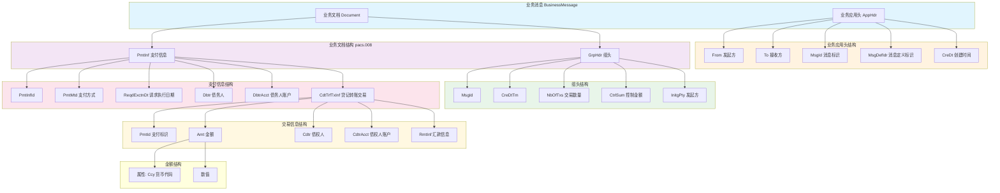
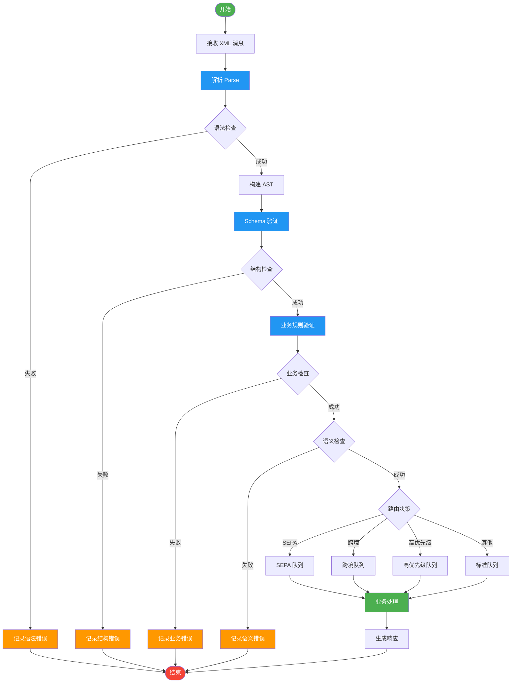

# ISO 20022 Schema 形式语法与语义分析视图

**版本**: v1.0
**创建日期**: 2026-02-15
**标准**: ISO 20022-1:2013, ISO 20022-2:2013, W3C XML Schema 1.1

---

## 📑 目录

- [ISO 20022 Schema 形式语法与语义分析视图](#iso-20022-schema-形式语法与语义分析视图)
  - [📑 目录](#-目录)
  - [1. 形式文法定义 (EBNF)](#1-形式文法定义-ebnf)
    - [1.1 业务消息头文法](#11-业务消息头文法)
    - [1.2 消息定义文法](#12-消息定义文法)
    - [1.3 数据类型文法](#13-数据类型文法)
    - [1.4 消息组件文法](#14-消息组件文法)
  - [2. 类型系统](#2-类型系统)
    - [2.1 基本数据类型](#21-基本数据类型)
    - [2.2 复合数据类型](#22-复合数据类型)
    - [2.3 XML Schema 类型映射](#23-xml-schema-类型映射)
  - [3. 操作语义](#3-操作语义)
    - [3.1 消息解析操作](#31-消息解析操作)
    - [3.2 消息验证操作](#32-消息验证操作)
    - [3.3 消息路由规则](#33-消息路由规则)
  - [4. 指称语义](#4-指称语义)
    - [4.1 消息语义域](#41-消息语义域)
    - [4.2 语义解释函数](#42-语义解释函数)
    - [4.3 XML 表示语义](#43-xml-表示语义)
  - [5. 公理语义](#5-公理语义)
    - [5.1 消息完整性公理](#51-消息完整性公理)
    - [5.2 消息顺序性约束](#52-消息顺序性约束)
    - [5.3 业务规则公理](#53-业务规则公理)
  - [6. Mermaid 可视化](#6-mermaid-可视化)
    - [6.1 ISO 20022 消息结构](#61-iso-20022-消息结构)
    - [6.2 消息处理流程](#62-消息处理流程)

---

## 1. 形式文法定义 (EBNF)

### 1.1 业务消息头文法

```ebnf
(* ISO 20022 业务消息顶层结构 *)
BusinessMessage ::= BusinessApplicationHeader BusinessDocument

(* 业务应用头 *)
BusinessApplicationHeader ::= '<AppHdr>'
                                From To BusinessMessageId
                                MessageDefinitionIdentifier
                                CreationDateTime
                                CopyDuplicate? PossibleDuplicate?
                                Priority? Signature? Related?
                              '</AppHdr>'

(* 参与方标识 *)
From ::= '<From>' Party '</From>'
To   ::= '<To>' Party '</To>'

Party ::= '<OrgId>' OrganisationIdentification '</OrgId>'
        | '<PrvtId>' PersonIdentification '</PrvtId>'

(* 消息标识 *)
BusinessMessageId ::= '<BizMsgIdr>' MessageIdentifier '</BizMsgIdr>'
MessageIdentifier ::= String

(* 消息定义标识符 - pacs, pain, camt, remt 等 *)
MessageDefinitionIdentifier ::= '<MsgDefIdr>'
                                  BusinessArea MessageType
                                  Variant Version
                                '</MsgDefIdr>'

BusinessArea ::= 'pacs' | 'pain' | 'camt' | 'remt' | 'seev' | 'semt' | 'reda'
MessageType  ::= '.' Digit Digit Digit
Variant      ::= '.' Digit Digit Digit
Version      ::= '.' Digit Digit

(* 创建时间 *)
CreationDateTime ::= '<CreDt>' ISODateTime '</CreDt>'
ISODateTime      ::= Date 'T' Time TimeZone?
Date             ::= Year '-' Month '-' Day
Time             ::= Hour ':' Minute ':' Second Fraction?
TimeZone         ::= 'Z' | ('+' | '-') Hour ':' Minute

(* 可选元素 *)
CopyDuplicate      ::= '<CpyDplct>' CopyDuplicateCode '</CpyDplct>'
CopyDuplicateCode  ::= 'CODU' | 'COPY' | 'DUPL'
PossibleDuplicate  ::= '<PssblDplct>' Boolean '</PssblDplct>'
Priority           ::= '<Prty>' PriorityCode '</Prty>'
PriorityCode       ::= 'HIGH' | 'NORM' | 'LOW'
Signature          ::= '<Sgntr>' SignatureEnvelope '</Sgntr>'
Related            ::= '<Rltd>' BusinessApplicationHeader '</Rltd>'
```

### 1.2 消息定义文法

```ebnf
(* 业务文档 - 消息内容 *)
BusinessDocument ::= '<Document>' MessageDefinition '</Document>'

(* 消息定义 - 各业务领域 *)
MessageDefinition ::= CustomerCreditTransferV09
                    | FinancialInstitutionCreditTransferV09
                    | PaymentStatusReportV10
                    | BankToCustomerStatementV08
                    | BankToCustomerDebitCreditNotificationV08
                    | CustomerDirectDebitInitiationV08
                    | CustomerPaymentReversalV09

(* pacs.008 - 客户贷记转账 *)
CustomerCreditTransferV09 ::= '<CstmrCdtTrfInitn>'
                                GroupHeader PaymentInformation+
                              '</CstmrCdtTrfInitn>'

(* pacs.009 - 金融机构贷记转账 *)
FinancialInstitutionCreditTransferV09 ::= '<FICdtTrf>'
                                            GroupHeader
                                            CreditTransferTransaction+
                                          '</FICdtTrf>'

(* pain.002 - 支付状态报告 *)
PaymentStatusReportV10 ::= '<CstmrPmtStsRpt>'
                             GroupHeader
                             OriginalGroupInformationAndStatus
                             OriginalPaymentInformationAndStatus*
                           '</CstmrPmtStsRpt>'

(* camt.053 - 银行对账单 *)
BankToCustomerStatementV08 ::= '<BkToCstmrStmt>'
                                 GroupHeader Statement+
                               '</BkToCstmrStmt>'

(* camt.054 - 银行借记贷记通知 *)
BankToCustomerDebitCreditNotificationV08 ::= '<BkToCstmrDbtCdtNtfctn>'
                                               GroupHeader Notification+
                                             '</BkToCstmrDbtCdtNtfctn>'

(* pain.008 - 客户直接借记发起 *)
CustomerDirectDebitInitiationV08 ::= '<CstmrDrctDbtInitn>'
                                       GroupHeader PaymentInformation+
                                     '</CstmrDrctDbtInitn>'

(* pacs.007 - 客户支付撤销 *)
CustomerPaymentReversalV09 ::= '<CstmrPmtRvsl>'
                                 GroupHeader OriginalGroupInformation
                                 TransactionInformation+
                               '</CstmrPmtRvsl>'
```

### 1.3 数据类型文法

```ebnf
(* ===== 金额数据类型 ===== *)
Amount ::= ActiveCurrencyAndAmount | ActiveOrHistoricCurrencyAndAmount

ActiveCurrencyAndAmount ::= '<Amt Ccy="' CurrencyCode '">'
                              Decimal
                            '</Amt>'

ActiveOrHistoricCurrencyAndAmount ::= '<Amt Ccy="' CurrencyCode '">'
                                        Decimal
                                      '</Amt>'

CurrencyCode ::= UpperCaseLetter UpperCaseLetter UpperCaseLetter

(* ===== 日期时间数据类型 ===== *)
DateTime ::= ISODate | ISODateTime | ISODateTimeOffset

ISODate ::= '<Dt>' Date '</Dt>'
ISODateTime ::= '<DtTm>' ISODateTimeValue '</DtTm>'

DateAndDateTimeChoice ::= ISODate | ISODateTime

(* ===== 标识符数据类型 ===== *)
Identifier ::= '<Id>' IdentificationChoice '</Id>'

IdentificationChoice ::= OrganisationIdentification
                       | PersonIdentification
                       | GenericIdentification

OrganisationIdentification ::= '<OrgId>'
                                 BICOrBEIOrLEIOrOther
                               '</OrgId>'

BICOrBEIOrLEIOrOther ::= '<BICFI>' BICFI '</BICFI>'
                       | '<LEI>' LEI '</LEI>'
                       | '<Othr>' GenericOrganisationIdentification '</Othr>'

BICFI ::= UpperCaseOrDigit{4} UpperCaseOrDigit{2} UpperCaseOrDigit{2}
          (UpperCaseOrDigit{3})?

LEI ::= UpperCaseOrDigit{20}

PersonIdentification ::= '<PrvtId>' PersonIdentificationScheme '</PrvtId>'

GenericIdentification ::= '<Othr>'
                            Id
                            SchemeName?
                            Issuer?
                          '</Othr>'

Id     ::= '<Id>' String '</Id>'
Issuer ::= '<Issr>' String '</Issr>'

(* ===== 代码数据类型 ===== *)
Code ::= ExternalCode | ISOCode

ExternalCode ::= String (* 外部代码集 *)
ISOCode        ::= UpperCaseLetter{1,4}

Priority2Code      ::= 'HIGH' | 'NORM'
SequenceType3Code  ::= 'FNAL' | 'FRST' | 'OOFF' | 'RCUR'
ChargeBearerType1Code ::= 'CRED' | 'DEBT' | 'SHAR' | 'SLEV'
```

### 1.4 消息组件文法

```ebnf
(* ===== 组头组件 ===== *)
GroupHeader ::= '<GrpHdr>'
                  MessageIdentification
                  CreationDateTime
                  NumberOfTransactions?
                  ControlSum?
                  InitiatingParty
                  ForwardingAgent?
                '</GrpHdr>'

MessageIdentification  ::= '<MsgId>' String '</MsgId>'
NumberOfTransactions   ::= '<NbOfTxs>' PositiveInteger '</NbOfTxs>'
ControlSum             ::= '<CtrlSum>' Decimal '</CtrlSum>'
InitiatingParty        ::= '<InitgPty>' PartyIdentification '</InitgPty>'
ForwardingAgent        ::= '<FwdgAgt>' BranchAndFinancialInstitution '</FwdgAgt>'

(* ===== 参与方标识组件 ===== *)
PartyIdentification ::= '<Nm>' String '</Nm>'?
                        PostalAddress?
                        Identification?
                        CountryOfResidence?
                        ContactDetails?

PostalAddress ::= '<PstlAdr>'
                    AddressType?
                    Department?
                    SubDepartment?
                    StreetName?
                    BuildingNumber?
                    PostCode?
                    TownName?
                    CountrySubDivision?
                    Country?
                    AddressLine*
                  '</PstlAdr>'

Country ::= '<Ctry>' CountryCode '</Ctry>'
CountryCode ::= UpperCaseLetter UpperCaseLetter

(* ===== 账户组件 ===== *)
CashAccount ::= '<CdtrAcct>' | '<DbtrAcct>' | '<CdtrAgtAcct>' | '<DbtrAgtAcct>'
                  AccountIdentification
                  Name?
                  Type?
                  Currency?
                '</CdtrAcct>' | '</DbtrAcct>' | '</CdtrAgtAcct>' | '</DbtrAgtAcct>'

AccountIdentification ::= '<Id>' AccountIdentificationChoice '</Id>'

AccountIdentificationChoice ::= IBAN
                              | BBAN
                              | UPIC
                              | GenericAccountIdentification

IBAN ::= '<IBAN>' IBANFormat '</IBAN>'
IBANFormat ::= UpperCaseOrDigit{2,34}

BBAN ::= '<BBAN>' String '</BBAN>'
UPIC ::= '<UPIC>' String '</UPIC>'

GenericAccountIdentification ::= '<Othr>'
                                   Id
                                   SchemeName?
                                   Issuer?
                                 '</Othr>'

(* ===== 金融机构组件 ===== *)
BranchAndFinancialInstitution ::= '<FinInstnId>'
                                    BICFI?
                                    ClearingSystemMemberIdentification?
                                    LEI?
                                    Name?
                                    PostalAddress?
                                  '</FinInstnId>'
                                  BranchData?

ClearingSystemMemberIdentification ::= '<ClrSysMmbId>'
                                         ClearingSystemIdentification?
                                         MemberIdentification
                                       '</ClrSysMmbId>'

(* ===== 交易信息组件 ===== *)
CreditTransferTransaction ::= '<CdtTrfTxInf>'
                                PaymentIdentification
                                PaymentTypeInformation?
                                Amount
                                ChargeBearer?
                                UltimateDebtor?
                                InitiatingParty?
                                Debtor
                                DebtorAccount?
                                DebtorAgent
                                CreditorAgent?
                                Creditor
                                CreditorAccount?
                                UltimateCreditor?
                                Purpose?
                                RemittanceInformation?
                              '</CdtTrfTxInf>'

PaymentIdentification ::= '<PmtId>'
                            InstructionIdentification?
                            EndToEndIdentification
                            TransactionIdentification?
                            ClearingSystemReference?
                          '</PmtId>'

InstructionIdentification ::= '<InstrId>' String '</InstrId>'
EndToEndIdentification    ::= '<EndToEndId>' String '</EndToEndId>'

RemittanceInformation ::= '<RmtInf>'
                            Unstructured*
                            Structured*
                          '</RmtInf>'
```

---

## 2. 类型系统

### 2.1 基本数据类型

```haskell
-- ISO 20022 基本数据类型层次结构
data ISO20022BasicType
  = TextualType TextConstraint
  | NumericType NumericConstraint
  | TemporalType TemporalConstraint
  | BinaryType BinaryConstraint
  | URIType
  | BooleanType

data TextConstraint = TextConstraint
  { minLength :: Maybe Int
  , maxLength :: Maybe Int
  , pattern   :: Maybe Regex
  }

data NumericConstraint = NumericConstraint
  { totalDigits    :: Maybe Int
  , fractionDigits :: Maybe Int
  , minInclusive   :: Maybe Decimal
  , maxInclusive   :: Maybe Decimal
  }

data TemporalConstraint = TemporalConstraint
  { temporalKind :: TemporalKind
  , timezone     :: TimezoneConstraint
  }

data TemporalKind
  = Date
  | DateTime
  | Time
  | Duration
  | GYear
  | GYearMonth
  | GMonth
  | GMonthDay
  | GDay

data BinaryConstraint = BinaryConstraint
  { mimeType :: Maybe String
  , encoding :: BinaryEncoding
  }

data BinaryEncoding = Base64 | HexBinary
```

### 2.2 复合数据类型

```haskell
-- ISO 20022 复合数据类型
data ISO20022ComplexType
  = MessageElement MessageElementDef
  | DataType DataTypeDef
  | Code CodeDef
  | ChoiceType [ISO20022ComplexType]
  | SequenceType [ISO20022ComplexType] Occurrence

data MessageElementDef = MessageElementDef
  { elementName     :: String
  , elementType     :: TypeReference
  , occurrence      :: Occurrence
  , isTechnical     :: Bool
  }

data DataTypeDef
  = AmountType AmountTypeDef
  | QuantityType QuantityTypeDef
  | PartyType PartyTypeDef
  | AccountType AccountTypeDef
  | CodeSetType CodeSetDef
  | IdentifierType IdentifierTypeDef

data AmountTypeDef = AmountTypeDef
  { currencyId :: Maybe String
  , amountKind :: AmountKind
  }

data AmountKind
  = ActiveCurrencyAndAmount
  | ActiveOrHistoricCurrencyAndAmount
  | ImpliedCurrencyAmount
  | Number

data CodeSetDef = CodeSetDef
  { codeSetName    :: String
  , codes          :: [CodeValue]
  , isExternal     :: Bool
  , codeLength     :: Maybe (Int, Int)
  }

data CodeValue = CodeValue
  { codeName        :: String
  , codeValue       :: String
  , codeDescription :: String
  }

data Occurrence = Occurrence
  { minOccurs :: Int
  , maxOccurs :: Maybe Int  -- Nothing means unbounded
  }

-- 常用出现次数模式
optional :: Occurrence
optional = Occurrence 0 (Just 1)

required :: Occurrence
required = Occurrence 1 (Just 1)

unbounded :: Occurrence
unbounded = Occurrence 0 Nothing
```

### 2.3 XML Schema 类型映射

```xml
<!-- ISO 20022 到 W3C XML Schema 1.1 的映射 -->
<xs:schema xmlns:xs="http://www.w3.org/2001/XMLSchema"
           xmlns="urn:iso:std:iso:20022:tech:xsd:head.001.001.02"
           targetNamespace="urn:iso:std:iso:20022:tech:xsd:head.001.001.02"
           elementFormDefault="qualified">

  <!-- 文本类型映射 -->
  <xs:simpleType name="Max35Text">
    <xs:restriction base="xs:string">
      <xs:minLength value="1"/>
      <xs:maxLength value="35"/>
    </xs:restriction>
  </xs:simpleType>

  <xs:simpleType name="Max140Text">
    <xs:restriction base="xs:string">
      <xs:minLength value="1"/>
      <xs:maxLength value="140"/>
    </xs:restriction>
  </xs:simpleType>

  <!-- 金额类型映射 -->
  <xs:complexType name="ActiveCurrencyAndAmount">
    <xs:simpleContent>
      <xs:extension base="ImpliedCurrencyAmount">
        <xs:attribute name="Ccy" type="ActiveCurrencyCode" use="required"/>
      </xs:extension>
    </xs:simpleContent>
  </xs:complexType>

  <xs:simpleType name="ImpliedCurrencyAmount">
    <xs:restriction base="xs:decimal">
      <xs:totalDigits value="18"/>
      <xs:fractionDigits value="5"/>
      <xs:minInclusive value="0"/>
    </xs:restriction>
  </xs:simpleType>

  <xs:simpleType name="ActiveCurrencyCode">
    <xs:restriction base="xs:string">
      <xs:pattern value="[A-Z]{3,3}"/>
    </xs:restriction>
  </xs:simpleType>

  <!-- 日期时间类型映射 -->
  <xs:simpleType name="ISODateTime">
    <xs:restriction base="xs:dateTime">
      <xs:pattern value="\d{4}-\d{2}-\d{2}T\d{2}:\d{2}:\d{2}(\.\d{1,3})?(Z|[+-]\d{2}:\d{2})?"/>
    </xs:restriction>
  </xs:simpleType>

  <xs:simpleType name="ISODate">
    <xs:restriction base="xs:date"/>
  </xs:simpleType>

  <!-- BICFI 类型映射 -->
  <xs:simpleType name="BICFIDec2014Identifier">
    <xs:restriction base="xs:string">
      <xs:pattern value="[A-Z0-9]{4,4}[A-Z]{2,2}[A-Z0-9]{2,2}([A-Z0-9]{3,3}){0,1}"/>
    </xs:restriction>
  </xs:simpleType>

  <!-- IBAN 类型映射 -->
  <xs:simpleType name="IBAN2007Identifier">
    <xs:restriction base="xs:string">
      <xs:pattern value="[A-Z]{2,2}[0-9]{2,2}[a-zA-Z0-9]{1,30}"/>
    </xs:restriction>
  </xs:simpleType>

  <!-- LEI 类型映射 -->
  <xs:simpleType name="LEIIdentifier">
    <xs:restriction base="xs:string">
      <xs:pattern value="[A-Z0-9]{18,18}[0-9]{2,2}"/>
    </xs:restriction>
  </xs:simpleType>

  <!-- 代码类型映射（枚举示例） -->
  <xs:simpleType name="Priority2Code">
    <xs:restriction base="xs:string">
      <xs:enumeration value="HIGH"/>
      <xs:enumeration value="NORM"/>
    </xs:restriction>
  </xs:simpleType>

  <xs:simpleType name="ChargeBearerType1Code">
    <xs:restriction base="xs:string">
      <xs:enumeration value="CRED"/>
      <xs:enumeration value="DEBT"/>
      <xs:enumeration value="SHAR"/>
      <xs:enumeration value="SLEV"/>
    </xs:restriction>
  </xs:simpleType>

</xs:schema>
```

---

## 3. 操作语义

### 3.1 消息解析操作

```haskell
-- 消息解析操作语义
data ParseState = ParseState
  { input    :: XMLDocument
  , position :: XMLNodePath
  , context  :: NamespaceContext
  , errors   :: [ParseError]
  }

data ParseResult a
  = Success a ParseState
  | Failure [ParseError]

-- 解析操作类型
newtype Parser a = Parser (ParseState -> ParseResult a)

-- 基本解析操作
parseBusinessMessage :: Parser BusinessMessage
parseBusinessMessage = do
  header   <- parseElement "AppHdr" parseBusinessApplicationHeader
  document <- parseElement "Document" parseBusinessDocument
  return $ BusinessMessage header document

parseBusinessApplicationHeader :: Parser BusinessApplicationHeader
parseBusinessApplicationHeader = do
  from      <- parseRequiredElement "From" parseParty
  to        <- parseRequiredElement "To" parseParty
  msgId     <- parseRequiredElement "BizMsgIdr" parseIdentifier
  msgDefIdr <- parseRequiredElement "MsgDefIdr" parseMessageDefinitionIdentifier
  creDt     <- parseRequiredElement "CreDt" parseISODateTime
  cpyDplct  <- parseOptionalElement "CpyDplct" parseCopyDuplicateCode
  prty      <- parseOptionalElement "Prty" parsePriorityCode
  return $ BusinessApplicationHeader
    { from = from
    , to = to
    , businessMessageId = msgId
    , messageDefinitionId = msgDefIdr
    , creationDateTime = creDt
    , copyDuplicate = cpyDplct
    , priority = prty
    }

-- 验证驱动的解析
parseWithValidation :: XMLDocument -> ValidationRules -> Either [ValidationError] BusinessMessage
parseWithValidation doc rules =
  case runParser parseBusinessMessage initialState of
    Success msg state ->
      let validationErrors = validateMessage msg rules
      in if null validationErrors
         then Right msg
         else Left validationErrors
    Failure errors -> Left (map toValidationError errors)
  where
    initialState = ParseState doc [] emptyNamespaceContext []
```

### 3.2 消息验证操作

```haskell
-- 消息验证操作语义
data ValidationRule = ValidationRule
  { ruleName    :: String
  , ruleType    :: RuleType
  , ruleCheck   :: BusinessMessage -> [ValidationError]
  }

data RuleType
  = SchemaRule          -- XML Schema 结构规则
  | BusinessRule        -- 业务规则
  | IntegrityRule       -- 完整性规则
  | ConsistencyRule     -- 一致性规则

data ValidationError = ValidationError
  { errorCode    :: String
  , errorMessage :: String
  , errorPath    :: XMLNodePath
  , severity     :: ErrorSeverity
  }

data ErrorSeverity = Error | Warning | Info

-- 核心验证操作
validateMessage :: BusinessMessage -> ValidationRules -> [ValidationError]
validateMessage msg rules = concatMap (\r -> ruleCheck r msg) rules

-- 结构验证规则
validateSchemaStructure :: ValidationRule
validateSchemaStructure = ValidationRule
  { ruleName = "SchemaStructure"
  , ruleType = SchemaRule
  , ruleCheck = \msg ->
      let header = businessApplicationHeader msg
          errors = catMaybes
            [ validateGroupHeaderPresence header
            , validateMessageIdFormat (businessMessageId header)
            , validateCreationDateTime (creationDateTime header)
            ]
      in errors
  }

-- 业务验证规则
validateBusinessRules :: ValidationRule
validateBusinessRules = ValidationRule
  { ruleName = "BusinessRules"
  , ruleType = BusinessRule
  , ruleCheck = \msg ->
      case messageContent msg of
        PaymentMessage pmt -> validatePaymentMessage pmt
        StatementMessage stmt -> validateStatementMessage stmt
  }

-- 金额验证
validateAmount :: Amount -> [ValidationError]
validateAmount amt =
  let value = amountValue amt
      currency = amountCurrency amt
  in catMaybes
       [ validatePositive value
       , validateCurrencyCode currency
       , validateDecimalPrecision value 5
       ]

-- IBAN 验证（模97算法）
validateIBAN :: String -> Maybe ValidationError
validateIBAN iban =
  let rearranged = drop 4 iban ++ take 4 iban
      numeric = convertToNumeric rearranged
  in if mod numeric 97 == 1
     then Nothing
     else Just $ ValidationError
            { errorCode = "INVALID_IBAN"
            , errorMessage = "IBAN failed MOD-97 check"
            , errorPath = []
            , severity = Error
            }

-- 验证状态转换（小步骤操作语义）
stepValidation :: ValidationState -> ValidationState
stepValidation state =
  case validationQueue state of
    [] -> state { validationComplete = True }
    (rule:rest) ->
      let errors = ruleCheck rule (currentMessage state)
          newState = state
            { validationQueue = rest
            , validationErrors = validationErrors state ++ errors
            }
      in newState
```

### 3.3 消息路由规则

```haskell
-- 消息路由操作语义
data RoutingContext = RoutingContext
  { sourceParty      :: Party
  , destinationParty :: Party
  , messageType      :: MessageType
  , businessService  :: Maybe BusinessService
  , priority         :: Priority
  }

data RoutingDecision
  = RouteTo Endpoint
  | RouteToQueue QueueName
  | TransformThenRoute Transformation Endpoint
  | Reject RejectionReason

data Endpoint
  = DirectEndpoint String
  | LoadBalancedEndpoints [String]
  | ServiceMeshEndpoint String

-- 路由规则 DSL
routingRule :: MessagePattern -> RoutingAction -> RoutingRule
routingRule pattern action = RoutingRule
  { pattern = pattern
  , action = action
  , priority = 100
  , conditions = []
  }

-- 消息模式匹配
data MessagePattern = MessagePattern
  { msgBusinessArea  :: Maybe String
  , msgType          :: Maybe String
  , senderBIC        :: Maybe String
  , receiverBIC      :: Maybe String
  , amountRange      :: Maybe (Decimal, Decimal)
  , currency         :: Maybe String
  }

-- 路由操作语义
routeMessage :: BusinessMessage -> RoutingTable -> RoutingContext -> RoutingDecision
routeMessage msg table context =
  let matchingRules = filter (matchesPattern msg context) (rules table)
      sortedRules = sortBy (comparing rulePriority) matchingRules
  in case sortedRules of
       []    -> Reject NoMatchingRoute
       (r:_) -> applyRoutingAction (ruleAction r) msg context

-- 具体路由规则示例
highPriorityRouting :: RoutingRule
highPriorityRouting = routingRule
  (MessagePattern Nothing Nothing Nothing Nothing Nothing Nothing)
  (RouteToQueue "high-priority-queue")
  `withCondition` (\msg ctx -> priority ctx == High)

sepaRouting :: RoutingRule
sepaRouting = routingRule
  (MessagePattern (Just "pacs") (Just "008") Nothing Nothing Nothing (Just "EUR"))
  (RouteTo "sepa-processor")

crossBorderRouting :: RoutingRule
crossBorderRouting = routingRule
  (MessagePattern (Just "pacs") Nothing Nothing Nothing Nothing Nothing)
  (TransformThenRoute (addCorrespondentBankInfo "intermediary-bank")
                      (LoadBalancedEndpoints ["swift-gateway-1", "swift-gateway-2"]))

-- 路由决策的组合语义
composeRouting :: RoutingDecision -> RoutingDecision -> RoutingDecision
composeRouting (Reject _) d2 = d2
composeRouting d1 _ = d1

-- 消息路由的状态转换
routeStep :: RoutingState -> RoutingState
routeStep state =
  case messageQueue state of
    [] -> state
    (msg:rest) ->
      let context = buildRoutingContext msg
          decision = routeMessage msg (routingTable state) context
          (newState, outgoing) = applyDecision state msg decision
      in newState
           { messageQueue = rest
           , outgoingQueue = outgoingQueue newState ++ [outgoing]
           }
```

---

## 4. 指称语义

### 4.1 消息语义域

```
-- ISO 20022 消息语义域定义

Domain D = (M, P, A, T, V)

其中:
  M: 消息语义空间 (Message Semantic Space)
  P: 参与方语义空间 (Party Semantic Space)
  A: 账户语义空间 (Account Semantic Space)
  T: 时间语义空间 (Temporal Semantic Space)
  V: 值语义空间 (Value Semantic Space)

消息语义空间 M:
  M = BusinessHeader × BusinessContent

  BusinessHeader = MessageId × CreationTime × FromParty × ToParty
                 × MessageType × Priority × CorrelationId

  MessageId = String
  CreationTime = Timestamp
  FromParty = Party
  ToParty = Party
  MessageType = BusinessArea × TypeCode × Variant × Version
  Priority = {HIGH, NORM, LOW}
  CorrelationId = Maybe MessageId

业务内容语义:
  BusinessContent = PaymentInstruction | AccountStatement | PaymentStatusReport
                  | DirectDebitInstruction | ...

支付指令语义:
  PaymentInstruction = GroupHeader × [PaymentInformation]

  GroupHeader = MessageId × CreationTime × NbOfTransactions × ControlSum
              × InitiatingParty

  PaymentInformation = PaymentInfoId × PaymentMethod × RequestedExecutionDate
                     × Debtor × DebtorAccount × [CreditTransferTransaction]

  CreditTransferTransaction = TransactionId × Amount × Creditor
                            × CreditorAccount × RemittanceInfo
```

### 4.2 语义解释函数

```haskell
-- 语义解释函数: 语法结构 -> 语义域

-- 顶层解释函数
_ :: ISO20022Message -> D

-- 业务消息解释
BusinessMessage header content =
  (header_header, content_content)

-- 业务头解释
BusinessApplicationHeader from to msgId msgDefId creDt ..._header =
  ( msgId_id      :: MessageId
  , creDt_time    :: CreationTime
  , from_party    :: FromParty
  , to_party      :: ToParty
  , msgDefId_type :: MessageType
  )

-- 参与方解释
Party name address identification ..._party =
  PartySemantics
    { partyName = name_string
    , partyAddress = address_address
    , partyIdentification = identification_id
    }

-- 金额解释（核心金融语义）
Amount currency value_amount =
  MoneySemantics
    { amount = value_decimal
    , currency = currency_currencyCode
    }

-- 货币代码解释（ ISO 4217 语义）
CurrencyCode code_currencyCode =
  CurrencySemantics
    { currencyCode = code
    , currencyName = lookupCurrencyName code
    , minorUnits = lookupMinorUnits code
    }

-- 时间解释（带时区语义）
ISODateTime value_time =
  TemporalSemantics
    { timestamp = parseISO8601 value
    , timezone = extractTimezone value
    , utcEquivalent = convertToUTC value
    }

-- 账户解释
CashAccount identification name type currency_account =
  AccountSemantics
    { accountId = identification_accountId
    , accountName = fmap name_string
    , accountType = fmap type_accountType
    , accountCurrency = fmap currency_currencyCode
    }

-- IBAN 解释（带校验语义）
IBAN value_accountId =
  IBANSemantics
    { ibanString = value
    , countryCode = take 2 value
    , checkDigits = take 2 (drop 2 value)
    , bban = drop 4 value
    , isValid = mod97Check value
    }
```

### 4.3 XML 表示语义

```
-- XML 文档到 ISO 20022 语义域的映射

XML Document                     Semantic Domain
─────────────────────────────────────────────────────────
<AppHdr>                         BusinessApplicationHeader
  <To>                           to: Party
    <OrgId>
      <Id>
        <OrgId>
          <Othr>                 organisationId: GenericId
            <Id>LEI123...</Id>   id: "LEI123..."
          </Othr>
        </OrgId>
      </Id>
    </OrgId>
  </To>
  <BizMsgIdr>MSG001</BizMsgIdr>   messageId: "MSG001"
  <MsgDefIdr>                    messageType:
    pacs.008.001.10              ("pacs", "008", "001", "10")
  </MsgDefIdr>
  <CreDt>2026-02-15T10:30:00Z</CreDt>
                                 creationTime:
                                   2026-02-15 10:30:00 UTC
</AppHdr>

<Document>                       Document
  <CstmrCdtTrfInitn>             CustomerCreditTransfer
    <GrpHdr>                     groupHeader:
      <MsgId>PAY001</MsgId>        messageId: "PAY001"
      <CreDtTm>...</CreDtTm>       creationDateTime: ...
      <NbOfTxs>1</NbOfTxs>         numberOfTransactions: 1
      <CtrlSum>100.00</CtrlSum>    controlSum: 100.00
      <InitgPty>                   initiatingParty: ...
        ...
      </InitgPty>
    </GrpHdr>
    <PmtInf>                     paymentInformation: [...]
      <PmtInfId>PAYINFO001</PmtInfId>
      <PmtMtd>TRF</PmtMtd>        paymentMethod: Transfer
      <ReqdExctnDt>              requestedExecutionDate:
        <Dt>2026-02-16</Dt>        2026-02-16
      </ReqdExctnDt>
      <Dbtr>...</Dbtr>           debtor: Party
      <DbtrAcct>...</DbtrAcct>   debtorAccount: CashAccount
      <CdtTrfTxInf>              creditTransferTransaction:
        <PmtId>                  paymentIdentification:
          <EndToEndId>E2E001</EndToEndId>
                                   endToEndId: "E2E001"
        </PmtId>
        <Amt>                    amount:
          <InstdAmt Ccy="EUR">   instructedAmount:
            100.00                 value: 100.00
          </InstdAmt>              currency: EUR
        </Amt>
        <Cdtr>...</Cdtr>         creditor: Party
        <CdtrAcct>...</CdtrAcct> creditorAccount: CashAccount
      </CdtTrfTxInf>
    </PmtInf>
  </CstmrCdtTrfInitn>
</Document>
```

---

## 5. 公理语义

### 5.1 消息完整性公理

```
-- 公理 1: 消息标识唯一性
∀ m₁, m₂ ∈ BusinessMessage:
  m₁ ≠ m₂ → businessMessageId(m₁) ≠ businessMessageId(m₂)

-- 公理 2: 时间顺序性
∀ m₁, m₂ ∈ BusinessMessage:
  creationDateTime(m₁) < creationDateTime(m₂)
  → m₁ 先于 m₂

-- 公理 3: 组头一致性
∀ m ∈ BusinessMessage:
  let gh = groupHeader(m)
      n = numberOfTransactions(gh)
      s = controlSum(gh)
      txs = transactions(m)
  in length(txs) = n ∧ sum(map amount txs) = s

-- 公理 4: 参与方完整性
∀ m ∈ BusinessMessage:
  hasDefined(fromParty(m)) ∧ hasDefined(toParty(m))

-- 公理 5: 金额正定性
∀ a ∈ Amount:
  amountValue(a) > 0

-- 公理 6: 货币代码有效性
∀ c ∈ CurrencyCode:
  length(c) = 3 ∧ c ∈ ISO4217

-- 公理 7: IBAN 校验
∀ iban ∈ IBAN:
  mod97(iban) = 1

-- 公理 8: 消息关联性
∀ m ∈ BusinessMessage, r ∈ RelatedMessage:
  r ∈ relatedMessages(m) → businessMessageId(r) = relatedMessageId(m)
```

### 5.2 消息顺序性约束

```
-- 公理 9: 支付指令顺序
∀ pmt ∈ PaymentMessage, status ∈ StatusMessage:
  messageType(pmt) = pain.001 ∧ messageType(status) = pain.002
  ∧ originalMessageId(status) = messageId(pmt)
  → creationDateTime(pmt) < creationDateTime(status)

-- 公理 10: 贷记转账与状态报告顺序
∀ transfer ∈ CreditTransfer, status ∈ PaymentStatus:
  messageType(transfer) = pacs.008 ∧ messageType(status) = pacs.002
  ∧ references(status, transfer)
  → creationDateTime(transfer) < creationDateTime(status)

-- 公理 11: 撤销消息顺序
∀ original ∈ PaymentMessage, reversal ∈ ReversalMessage:
  references(reversal, original)
  → creationDateTime(original) < creationDateTime(reversal)
  ∧ status(original) ∈ {PENDING, ACCEPTED}

-- 公理 12: 对账单条目时序
∀ stmt ∈ AccountStatement, entries ∈ statementEntries(stmt):
  ∀ e₁, e₂ ∈ entries:
    entryReference(e₁) < entryReference(e₂)
    → valueDate(e₁) ≤ valueDate(e₂)

-- 公理 13: 执行日期约束
∀ pmt ∈ PaymentInstruction:
  requestedExecutionDate(pmt) ≥ creationDate(groupHeader(pmt))

-- 公理 14: 指令识别顺序
∀ tx ∈ Transaction:
  instructionId(tx) < endToEndId(tx)  -- 逻辑顺序
```

### 5.3 业务规则公理

```
-- 公理 15: SEPA 单笔金额限制
∀ pmt ∈ PaymentMessage:
  isSEPAPayment(pmt) → amount(pmt) ≤ 999999999.99

-- 公理 16: 债务人-债权人不同
∀ tx ∈ CreditTransferTransaction:
  debtor(tx) ≠ creditor(tx)

-- 公理 17: 账户-参与方一致性
∀ tx ∈ CreditTransferTransaction:
  accountHolder(debtorAccount(tx)) = debtor(tx)
  ∧ accountHolder(creditorAccount(tx)) = creditor(tx)

-- 公理 18: 费用承担规则
∀ pmt ∈ PaymentMessage:
  chargeBearer(pmt) ∈ {CRED, DEBT, SHAR, SLEV}
  ∧ (isSEPA(pmt) → chargeBearer(pmt) = SLEV)

-- 公理 19: 清算系统成员资格
∀ fi ∈ FinancialInstitution:
  hasBIC(fi) ∨ hasClearingSystemMemberId(fi)

-- 公理 20: 代理关系传递性
∀ tx ∈ Transaction:
  debtorAgent(tx) ≠ creditorAgent(tx)
  → ∃ intermediary: intermediaryChain(debtorAgent, creditorAgent)

-- 公理 21: 目的代码约束
∀ pmt ∈ PaymentMessage:
  purposeCode(pmt) ∈ ISO20022PurposeCodes
  ∨ externalPurposeCode(pmt) ∈ ExternalPurposeCodeSet

-- 公理 22: 参考信息完整性
∀ tx ∈ Transaction:
  length(endToEndId(tx)) ≥ 1 ∧ length(endToEndId(tx)) ≤ 35

-- 公理 23: 通知相关性
∀ notification ∈ DebitCreditNotification:
  account(notification) ∈ accounts(creditor(notification))
  ∨ account(notification) ∈ accounts(debtor(notification))

-- 公理 24: 状态机一致性
∀ pmt ∈ Payment:
  status(pmt) ∈ {ACCP, RJCT, PDNG, RCVD, ACTC}
  ∧ (status(pmt) = RJCT → rejectionReason(pmt) ≠ ⊥)
  ∧ (status(pmt) = ACCP → rejectionReason(pmt) = ⊥)
```

---

## 6. Mermaid 可视化

### 6.1 ISO 20022 消息结构



### 6.2 消息处理流程



---

**参考文档**：

- `01_Overview.md` - ISO 20022 Schema 概述
- `02_Formal_Definition.md` - 形式化定义
- `03_Standards.md` - 标准对标
- `04_Transformation.md` - 转换体系
- `05_Case_Studies.md` - 实践案例

**相关标准**：

- ISO 20022-1:2013 - 元模型和目录
- ISO 20022-2:2013 - 建模指南
- W3C XML Schema 1.1 - XML Schema 定义
- ISO 4217 - 货币代码
- ISO 13616 - IBAN 注册
- ISO 17442 - LEI 编码

**创建时间**：2026-02-15
**维护者**：DSL Schema 研究团队
