# ISO 20022 Schema 动态行为分析视图

**版本**: v1.0
**创建日期**: 2026-02-15
**标准**: ISO 20022-1:2013, ISO 20022-2:2013, SWIFT MX Standards

---

## 📑 目录

- [ISO 20022 Schema 动态行为分析视图](#iso-20022-schema-动态行为分析视图)
  - [📑 目录](#-目录)
  - [1. 状态机形式化](#1-状态机形式化)
    - [1.1 ISO 20022 消息生命周期状态机](#11-iso-20022-消息生命周期状态机)
    - [1.2 支付指令状态机](#12-支付指令状态机)
    - [1.3 对账单处理状态机](#13-对账单处理状态机)
  - [2. 时序图形式化](#2-时序图形式化)
    - [2.1 ISO 20022 端到端支付流程](#21-iso-20022-端到端支付流程)
    - [2.2 对账单报告流程](#22-对账单报告流程)
    - [2.3 支付状态报告流程](#23-支付状态报告流程)
    - [2.4 支付调查流程 (pacs.028)](#24-支付调查流程-pacs028)
  - [3. 数据流分析](#3-数据流分析)
    - [3.1 MX 消息在支付链中的流动](#31-mx-消息在支付链中的流动)
    - [3.2 消息转换与路由](#32-消息转换与路由)
    - [3.3 数据一致性保证](#33-数据一致性保证)
  - [4. 实时性分析](#4-实时性分析)
    - [4.1 ISO 20022 迁移时间表](#41-iso-20022-迁移时间表)
    - [4.2 处理延迟要求](#42-处理延迟要求)
    - [4.3 性能指标与 SLA](#43-性能指标与-sla)
  - [5. 异常处理](#5-异常处理)
    - [5.1 消息拒绝流程](#51-消息拒绝流程)
    - [5.2 修复请求流程](#52-修复请求流程)
    - [5.3 调查流程 (pacs.028)](#53-调查流程-pacs028)
    - [5.4 撤销与退回流程](#54-撤销与退回流程)

---

## 1. 状态机形式化

### 1.1 ISO 20022 消息生命周期状态机

ISO 20022 消息从创建到最终确认经历完整的状态转换周期：

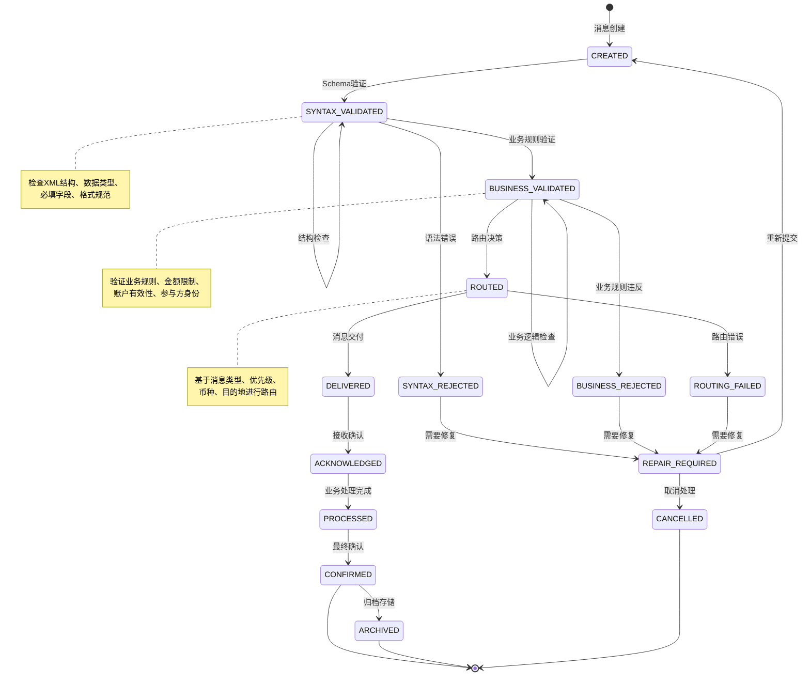
```mermaid
stateDiagram-v2
    [*] --> CREATED: 消息创建

    CREATED --> SYNTAX_VALIDATED: Schema验证
    SYNTAX_VALIDATED --> SYNTAX_VALIDATED: 结构检查
    SYNTAX_VALIDATED --> SYNTAX_REJECTED: 语法错误

    SYNTAX_VALIDATED --> BUSINESS_VALIDATED: 业务规则验证
    BUSINESS_VALIDATED --> BUSINESS_VALIDATED: 业务逻辑检查
    BUSINESS_VALIDATED --> BUSINESS_REJECTED: 业务规则违反

    BUSINESS_VALIDATED --> ROUTED: 路由决策
    ROUTED --> ROUTING_FAILED: 路由错误

    ROUTED --> DELIVERED: 消息交付
    DELIVERED --> ACKNOWLEDGED: 接收确认
    ACKNOWLEDGED --> PROCESSED: 业务处理完成

    PROCESSED --> CONFIRMED: 最终确认
    CONFIRMED --> ARCHIVED: 归档存储

    SYNTAX_REJECTED --> REPAIR_REQUIRED: 需要修复
    BUSINESS_REJECTED --> REPAIR_REQUIRED: 需要修复
    ROUTING_FAILED --> REPAIR_REQUIRED: 需要修复

    REPAIR_REQUIRED --> CREATED: 重新提交
    REPAIR_REQUIRED --> CANCELLED: 取消处理

    CONFIRMED --> [*]
    ARCHIVED --> [*]
    CANCELLED --> [*]

    note right of SYNTAX_VALIDATED
        检查XML结构、数据类型、
        必填字段、格式规范
    end note

    note right of BUSINESS_VALIDATED
        验证业务规则、金额限制、
        账户有效性、参与方身份
    end note

    note right of ROUTED
        基于消息类型、优先级、
        币种、目的地进行路由
    end note
```

**状态定义**：

| 状态 | 代码 | 描述 |
|------|------|------|
| CREATED | CR | 消息已创建，待处理 |
| SYNTAX_VALIDATED | SV | 语法验证通过 |
| SYNTAX_REJECTED | SR | 语法验证失败 |
| BUSINESS_VALIDATED | BV | 业务验证通过 |
| BUSINESS_REJECTED | BR | 业务验证失败 |
| ROUTED | RT | 已路由至目标系统 |
| ROUTING_FAILED | RF | 路由失败 |
| DELIVERED | DL | 消息已交付 |
| ACKNOWLEDGED | AK | 接收方已确认 |
| PROCESSED | PR | 业务处理完成 |
| CONFIRMED | CF | 最终确认状态 |
| REPAIR_REQUIRED | RR | 需要修复后重试 |
| CANCELLED | CN | 已取消 |
| ARCHIVED | AR | 已归档 |

---

### 1.2 支付指令状态机

支付指令（pacs.008/pacs.009）在清算系统中的状态流转：

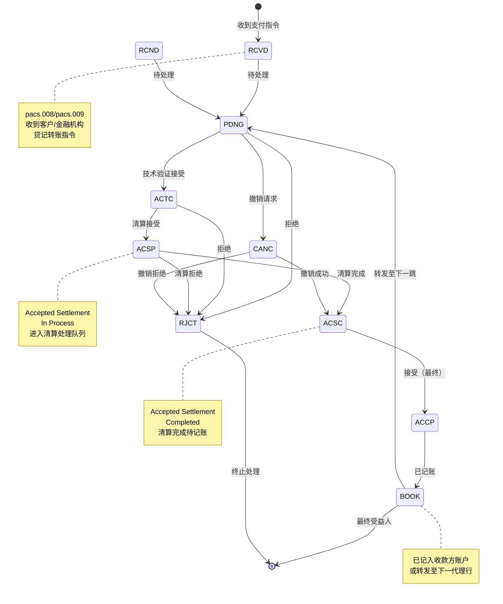
```mermaid
stateDiagram-v2
    [*] --> RCVD: 收到支付指令

    RCVD --> PDNG: 待处理
    RCND --> PDNG: 待处理

    PDNG --> ACTC: 技术验证接受
    PDNG --> RJCT: 拒绝

    ACTC --> ACSP: 清算接受
    ACTC --> RJCT: 拒绝

    ACSP --> ACSC: 清算完成
    ACSP --> RJCT: 清算拒绝

    ACSC --> ACCP: 接受（最终）
    ACCP --> BOOK: 已记账

    BOOK --> PDNG: 转发至下一跳
    BOOK --> [*]: 最终受益人

    PDNG --> CANC: 撤销请求
    CANC --> ACSC: 撤销成功
    CANC --> RJCT: 撤销拒绝

    RJCT --> [*]: 终止处理

    note right of RCVD
        pacs.008/pacs.009
        收到客户/金融机构
        贷记转账指令
    end note

    note right of ACSP
        Accepted Settlement
        In Process
        进入清算处理队列
    end note

    note right of ACSC
        Accepted Settlement
        Completed
        清算完成待记账
    end note

    note right of BOOK
        已记入收款方账户
        或转发至下一代理行
    end note
```

**pacs.008 客户贷记转账状态码**：

| 状态码 | 名称 | 描述 |
|--------|------|------|
| RCVD | Received | 已收到，待处理 |
| PDNG | Pending | 挂起等待进一步处理 |
| ACTC | Accepted Technical Validation | 技术验证通过 |
| ACSP | Accepted Settlement In Process | 清算处理中 |
| ACSC | Accepted Settlement Completed | 清算完成 |
| ACCP | Accepted | 业务接受 |
| BOOK | Booked | 已记账 |
| RJCT | Rejected | 已拒绝 |
| CANC | Cancelled | 已撤销 |

**状态转换规则**：

```text
Transition Rules:
  RCVD → PDNG: 基本验证通过
  PDNG → ACTC: 技术验证(格式、签名、授权)
  PDNG → RJCT: 技术验证失败
  ACTC → ACSP: 资金检查通过
  ACTC → RJCT: 资金不足或限制
  ACSP → ACSC: 清算系统完成
  ACSP → RJCT: 清算失败
  ACSC → ACCP: 业务确认
  ACCP → BOOK: 账户记账完成
  BOOK → PDNG: 非最终受益人，需转发
  PDNG → CANC: 收到撤销请求(pacs.007)
  CANC → ACSC: 撤销成功(未清算)
  CANC → RJCT: 撤销失败(已清算)
```

---

### 1.3 对账单处理状态机

银行对账单（camt.053）和借记贷记通知（camt.054）的处理状态：

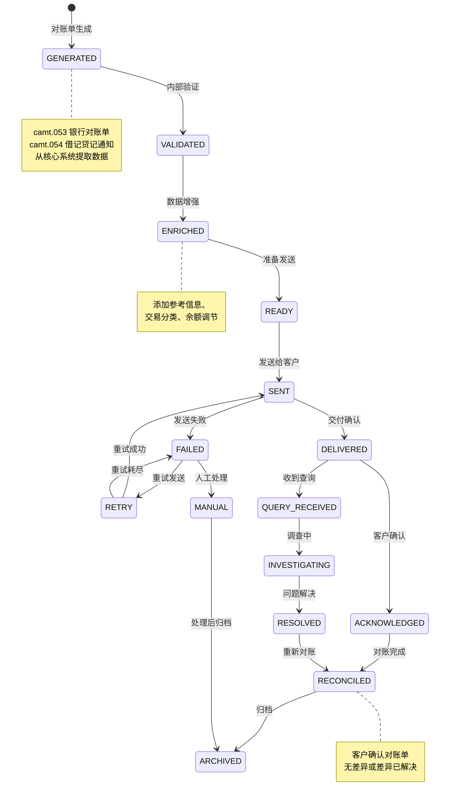
```mermaid
stateDiagram-v2
    [*] --> GENERATED: 对账单生成

    GENERATED --> VALIDATED: 内部验证
    VALIDATED --> ENRICHED: 数据增强

    ENRICHED --> READY: 准备发送
    READY --> SENT: 发送给客户

    SENT --> DELIVERED: 交付确认
    DELIVERED --> ACKNOWLEDGED: 客户确认

    ACKNOWLEDGED --> RECONCILED: 对账完成
    RECONCILED --> ARCHIVED: 归档

    SENT --> FAILED: 发送失败
    FAILED --> RETRY: 重试发送
    RETRY --> SENT: 重试成功
    RETRY --> FAILED: 重试耗尽

    FAILED --> MANUAL: 人工处理
    MANUAL --> ARCHIVED: 处理后归档

    DELIVERED --> QUERY_RECEIVED: 收到查询
    QUERY_RECEIVED --> INVESTIGATING: 调查中
    INVESTIGATING --> RESOLVED: 问题解决
    RESOLVED --> RECONCILED: 重新对账

    note right of GENERATED
        camt.053 银行对账单
        camt.054 借记贷记通知
        从核心系统提取数据
    end note

    note right of ENRICHED
        添加参考信息、
        交易分类、余额调节
    end note

    note right of RECONCILED
        客户确认对账单
        无差异或差异已解决
    end note
```

**camt.053/camt.054 报告条目状态**：

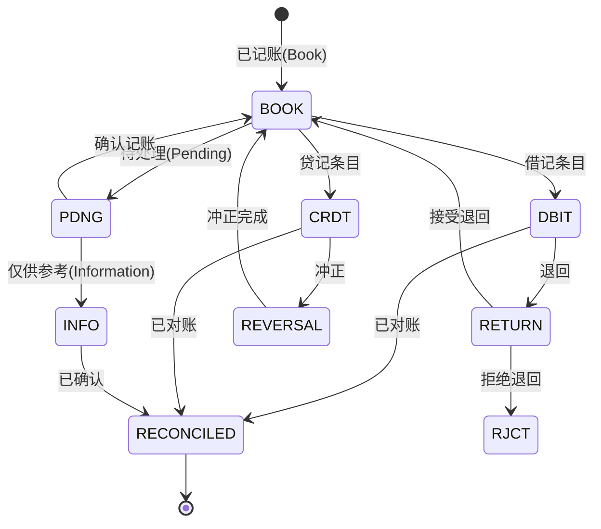
```mermaid
stateDiagram-v2
    [*] --> BOOK: 已记账(Book)

    BOOK --> PDNG: 待处理(Pending)
    PDNG --> BOOK: 确认记账
    PDNG --> INFO: 仅供参考(Information)

    BOOK --> DBIT: 借记条目
    BOOK --> CRDT: 贷记条目

    DBIT --> RECONCILED: 已对账
    CRDT --> RECONCILED: 已对账
    INFO --> RECONCILED: 已确认

    RECONCILED --> [*]

    DBIT --> RETURN: 退回
    RETURN --> RJCT: 拒绝退回
    RETURN --> BOOK: 接受退回

    CRDT --> REVERSAL: 冲正
    REVERSAL --> BOOK: 冲正完成
```

---

## 2. 时序图形式化

### 2.1 ISO 20022 端到端支付流程

跨境/国内支付从发起到结算的完整流程：

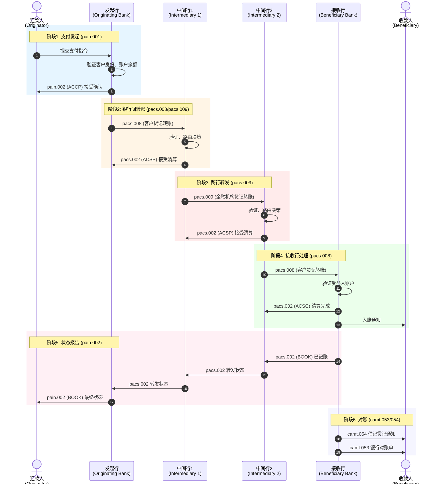
```mermaid
sequenceDiagram
    autonumber
    actor Originator as 汇款人<br/>(Originator)
    participant OB as 发起行<br/>(Originating Bank)
    participant IB1 as 中间行1<br/>(Intermediary 1)
    participant IB2 as 中间行2<br/>(Intermediary 2)
    participant BB as 接收行<br/>(Beneficiary Bank)
    actor Beneficiary as 收款人<br/>(Beneficiary)

    %% 阶段1: 支付发起
    rect rgb(230, 245, 255)
        Note over Originator,OB: 阶段1: 支付发起 (pain.001)
        Originator->>OB: 提交支付指令
        OB->>OB: 验证客户身份、账户余额
        OB->>Originator: pain.002 (ACCP) 接受确认
    end

    %% 阶段2: 贷记转账
    rect rgb(255, 245, 230)
        Note over OB,IB1: 阶段2: 银行间转账 (pacs.008/pacs.009)
        OB->>IB1: pacs.008 (客户贷记转账)
        IB1->>IB1: 验证、路由决策
        IB1->>OB: pacs.002 (ACSP) 接受清算
    end

    %% 阶段3: 中间行转发
    rect rgb(255, 235, 235)
        Note over IB1,IB2: 阶段3: 跨行转发 (pacs.009)
        IB1->>IB2: pacs.009 (金融机构贷记转账)
        IB2->>IB2: 验证、路由决策
        IB2->>IB1: pacs.002 (ACSP) 接受清算
    end

    %% 阶段4: 接收行处理
    rect rgb(235, 255, 235)
        Note over IB2,BB: 阶段4: 接收行处理 (pacs.008)
        IB2->>BB: pacs.008 (客户贷记转账)
        BB->>BB: 验证受益人账户
        BB->>IB2: pacs.002 (ACSC) 清算完成
        BB->>Beneficiary: 入账通知
    end

    %% 阶段5: 状态报告
    rect rgb(255, 240, 245)
        Note over OB,Originator: 阶段5: 状态报告 (pain.002)
        BB->>IB2: pacs.002 (BOOK) 已记账
        IB2->>IB1: pacs.002 转发状态
        IB1->>OB: pacs.002 转发状态
        OB->>Originator: pain.002 (BOOK) 最终状态
    end

    %% 阶段6: 对账
    rect rgb(245, 245, 255)
        Note over BB,Beneficiary: 阶段6: 对账 (camt.053/054)
        BB->>Beneficiary: camt.054 借记贷记通知
        BB->>Beneficiary: camt.053 银行对账单
    end
```

**消息类型说明**：

| 消息 | 类型 | 用途 | 方向 |
|------|------|------|------|
| pain.001 | 客户支付发起 | 客户向银行发起支付 | 客户→银行 |
| pain.002 | 支付状态报告 | 报告支付处理状态 | 银行→客户 |
| pacs.008 | 客户贷记转账 | 客户发起的贷记转账 | 银行→银行 |
| pacs.009 | 金融机构贷记转账 | 银行间的贷记转账 | 银行→银行 |
| pacs.002 | 支付状态报告 | 银行间状态报告 | 银行→银行 |
| camt.053 | 银行对账单 | 账户交易汇总 | 银行→客户 |
| camt.054 | 借记贷记通知 | 单笔交易通知 | 银行→客户 |

---

### 2.2 对账单报告流程

账户服务方向账户持有方发送对账单的流程：

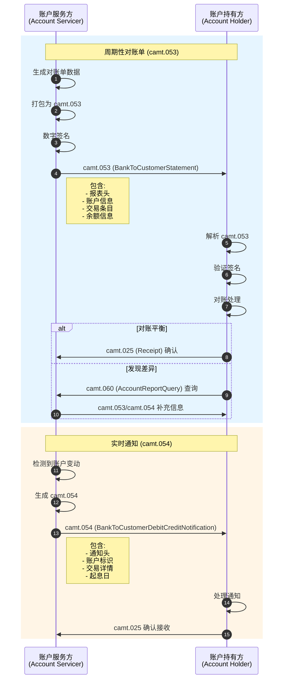
```mermaid
sequenceDiagram
    autonumber
    participant AS as 账户服务方<br/>(Account Servicer)
    participant AH as 账户持有方<br/>(Account Holder)

    rect rgb(230, 245, 255)
        Note over AS,AH: 周期性对账单 (camt.053)

        AS->>AS: 生成对账单数据
        AS->>AS: 打包为 camt.053
        AS->>AS: 数字签名

        AS->>AH: camt.053 (BankToCustomerStatement)
        Note right of AS: 包含:<br/>- 报表头<br/>- 账户信息<br/>- 交易条目<br/>- 余额信息

        AH->>AH: 解析 camt.053
        AH->>AH: 验证签名
        AH->>AH: 对账处理

        alt 对账平衡
            AH->>AS: camt.025 (Receipt) 确认
        else 发现差异
            AH->>AS: camt.060 (AccountReportQuery) 查询
            AS->>AH: camt.053/camt.054 补充信息
        end
    end

    rect rgb(255, 245, 230)
        Note over AS,AH: 实时通知 (camt.054)

        AS->>AS: 检测到账户变动
        AS->>AS: 生成 camt.054

        AS->>AH: camt.054 (BankToCustomerDebitCreditNotification)
        Note right of AS: 包含:<br/>- 通知头<br/>- 账户标识<br/>- 交易详情<br/>- 起息日

        AH->>AH: 处理通知
        AH->>AS: camt.025 确认接收
    end
```

**camt.053 消息结构时序**：

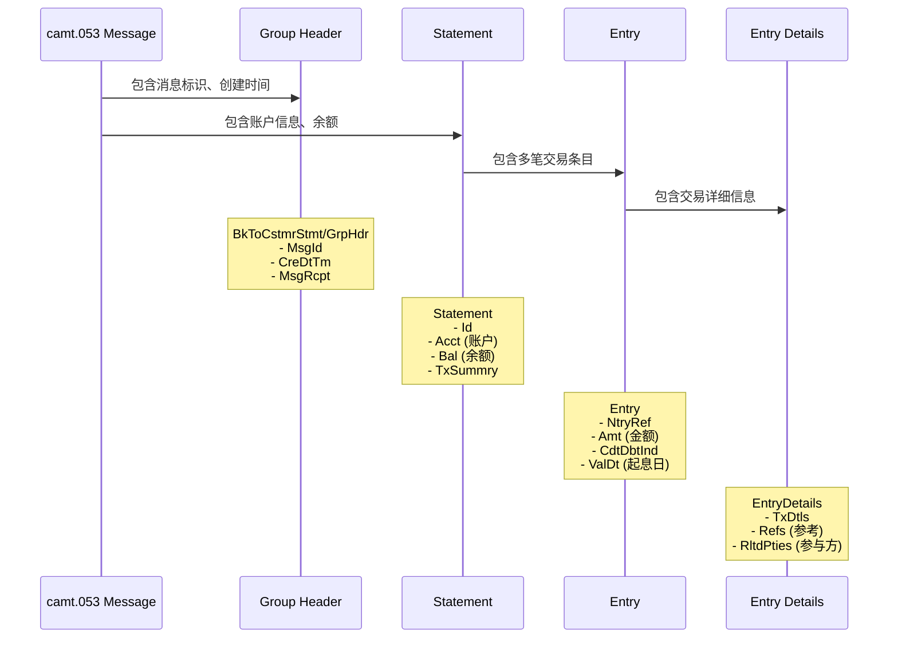
```mermaid
sequenceDiagram
    participant Msg as camt.053 Message
    participant GH as Group Header
    participant Stmt as Statement
    participant Entry as Entry
    participant Dtls as Entry Details

    Msg->>GH: 包含消息标识、创建时间
    Msg->>Stmt: 包含账户信息、余额
    Stmt->>Entry: 包含多笔交易条目
    Entry->>Dtls: 包含交易详细信息

    Note over GH: BkToCstmrStmt/GrpHdr<br/>- MsgId<br/>- CreDtTm<br/>- MsgRcpt

    Note over Stmt: Statement<br/>- Id<br/>- Acct (账户)<br/>- Bal (余额)<br/>- TxSummry

    Note over Entry: Entry<br/>- NtryRef<br/>- Amt (金额)<br/>- CdtDbtInd<br/>- ValDt (起息日)

    Note over Dtls: EntryDetails<br/>- TxDtls<br/>- Refs (参考)<br/>- RltdPties (参与方)
```

---

### 2.3 支付状态报告流程

支付状态报告（pain.002）的详细流程：

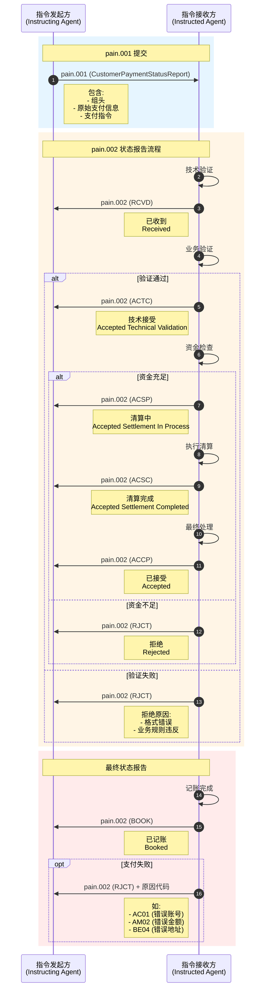
```mermaid
sequenceDiagram
    autonumber
    participant Instructing as 指令发起方<br/>(Instructing Agent)
    participant Instructed as 指令接收方<br/>(Instructed Agent)

    rect rgb(230, 245, 255)
        Note over Instructing,Instructed: pain.001 提交
        Instructing->>Instructed: pain.001 (CustomerPaymentStatusReport)
        Note right of Instructing: 包含:<br/>- 组头<br/>- 原始支付信息<br/>- 支付指令
    end

    rect rgb(255, 245, 230)
        Note over Instructing,Instructed: pain.002 状态报告流程

        Instructed->>Instructed: 技术验证
        Instructed->>Instructing: pain.002 (RCVD)
        Note left of Instructed: 已收到<br/>Received

        Instructed->>Instructed: 业务验证
        alt 验证通过
            Instructed->>Instructing: pain.002 (ACTC)
            Note left of Instructed: 技术接受<br/>Accepted Technical Validation

            Instructed->>Instructed: 资金检查
            alt 资金充足
                Instructed->>Instructing: pain.002 (ACSP)
                Note left of Instructed: 清算中<br/>Accepted Settlement In Process

                Instructed->>Instructed: 执行清算
                Instructed->>Instructing: pain.002 (ACSC)
                Note left of Instructed: 清算完成<br/>Accepted Settlement Completed

                Instructed->>Instructed: 最终处理
                Instructed->>Instructing: pain.002 (ACCP)
                Note left of Instructed: 已接受<br/>Accepted
            else 资金不足
                Instructed->>Instructing: pain.002 (RJCT)
                Note left of Instructed: 拒绝<br/>Rejected
            end
        else 验证失败
            Instructed->>Instructing: pain.002 (RJCT)
            Note left of Instructed: 拒绝原因:<br/>- 格式错误<br/>- 业务规则违反
        end
    end

    rect rgb(255, 235, 235)
        Note over Instructing,Instructed: 最终状态报告

        Instructed->>Instructed: 记账完成
        Instructed->>Instructing: pain.002 (BOOK)
        Note left of Instructed: 已记账<br/>Booked

        opt 支付失败
            Instructed->>Instructing: pain.002 (RJCT) + 原因代码
            Note left of Instructed: 如:<br/>- AC01 (错误账号)<br/>- AM02 (错误金额)<br/>- BE04 (错误地址)
        end
    end
```

**pain.002 状态代码时序**：

```mermaid
sequenceDiagram
    participant Start as 收到pain.001
    participant RCVD as RCVD<br/>收到
    participant ACTC as ACTC<br/>技术接受
    participant ACSP as ACSP<br/>清算中
    participant ACSC as ACSC<br/>清算完成
    participant ACCP as ACCP<br/>接受
    participant BOOK as BOOK<br/>记账
    participant RJCT as RJCT<br/>拒绝

    Start->>RCVD: 立即响应
    RCVD->>ACTC: 技术验证通过
    RCVD->>RJCT: 技术验证失败

    ACTC->>ACSP: 资金检查通过
    ACTC->>RJCT: 资金不足

    ACSP->>ACSC: 清算系统完成
    ACSP->>RJCT: 清算失败

    ACSC->>ACCP: 业务确认
    ACCP->>BOOK: 记账完成

    BOOK->>End: 流程结束
    RJCT->>End: 流程终止
```

---

### 2.4 支付调查流程 (pacs.028)

支付异常时的调查请求与响应流程：

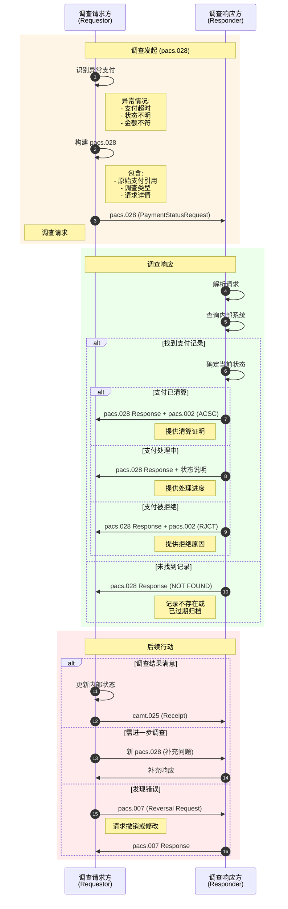
```mermaid
sequenceDiagram
    autonumber
    participant Requestor as 调查请求方<br/>(Requestor)
    participant Responder as 调查响应方<br/>(Responder)

    rect rgb(255, 245, 230)
        Note over Requestor,Responder: 调查发起 (pacs.028)

        Requestor->>Requestor: 识别异常支付
        Note right of Requestor: 异常情况:<br/>- 支付超时<br/>- 状态不明<br/>- 金额不符

        Requestor->>Requestor: 构建 pacs.028
        Note right of Requestor: 包含:<br/>- 原始支付引用<br/>- 调查类型<br/>- 请求详情

        Requestor->>Responder: pacs.028 (PaymentStatusRequest)
        Note left of Requestor: 调查请求
    end

    rect rgb(235, 255, 235)
        Note over Requestor,Responder: 调查响应

        Responder->>Responder: 解析请求
        Responder->>Responder: 查询内部系统

        alt 找到支付记录
            Responder->>Responder: 确定当前状态

            alt 支付已清算
                Responder->>Requestor: pacs.028 Response + pacs.002 (ACSC)
                Note left of Responder: 提供清算证明
            else 支付处理中
                Responder->>Requestor: pacs.028 Response + 状态说明
                Note left of Responder: 提供处理进度
            else 支付被拒绝
                Responder->>Requestor: pacs.028 Response + pacs.002 (RJCT)
                Note left of Responder: 提供拒绝原因
            end
        else 未找到记录
            Responder->>Requestor: pacs.028 Response (NOT FOUND)
            Note left of Responder: 记录不存在或<br/>已过期归档
        end
    end

    rect rgb(255, 235, 235)
        Note over Requestor,Responder: 后续行动

        alt 调查结果满意
            Requestor->>Requestor: 更新内部状态
            Requestor->>Responder: camt.025 (Receipt)
        else 需进一步调查
            Requestor->>Responder: 新 pacs.028 (补充问题)
            Responder->>Requestor: 补充响应
        else 发现错误
            Requestor->>Responder: pacs.007 (Reversal Request)
            Note right of Requestor: 请求撤销或修改
            Responder->>Requestor: pacs.007 Response
        end
    end
```

**调查类型代码**：

| 代码 | 描述 | 使用场景 |
|------|------|----------|
| PSTI | Payment Status Investigation | 支付状态查询 |
| PSTR | Payment Status Report | 支付状态报告 |
| MDNI | Modify Instruction | 修改指令请求 |
| CINI | Cancel Instruction | 取消指令请求 |

---

## 3. 数据流分析

### 3.1 MX 消息在支付链中的流动

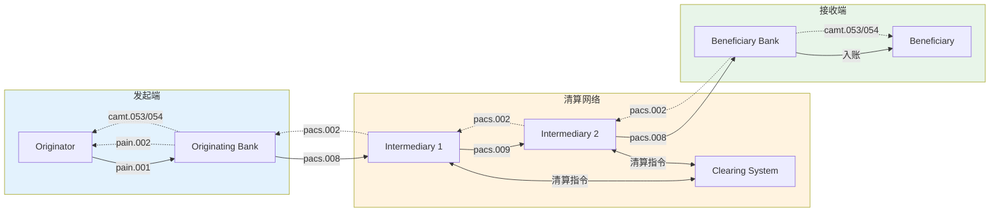
```mermaid
flowchart LR
    subgraph Origin["发起端"]
        O[Originator]
        OB[Originating Bank]
    end

    subgraph Clearing["清算网络"]
        IB1[Intermediary 1]
        IB2[Intermediary 2]
        CSD[Clearing System]
    end

    subgraph Destination["接收端"]
        BB[Beneficiary Bank]
        B[Beneficiary]
    end

    %% 支付指令流
    O -->|pain.001| OB
    OB -->|pacs.008| IB1
    IB1 -->|pacs.009| IB2
    IB2 -->|pacs.008| BB
    BB -->|入账| B

    %% 状态报告流
    BB -.->|pacs.002| IB2
    IB2 -.->|pacs.002| IB1
    IB1 -.->|pacs.002| OB
    OB -.->|pain.002| O

    %% 清算系统
    IB1 <-->|清算指令| CSD
    IB2 <-->|清算指令| CSD

    %% 对账信息流
    BB -.->|camt.053/054| B
    OB -.->|camt.053/054| O

    style Origin fill:#e3f2fd
    style Clearing fill:#fff3e0
    style Destination fill:#e8f5e9
```

**数据流属性**：

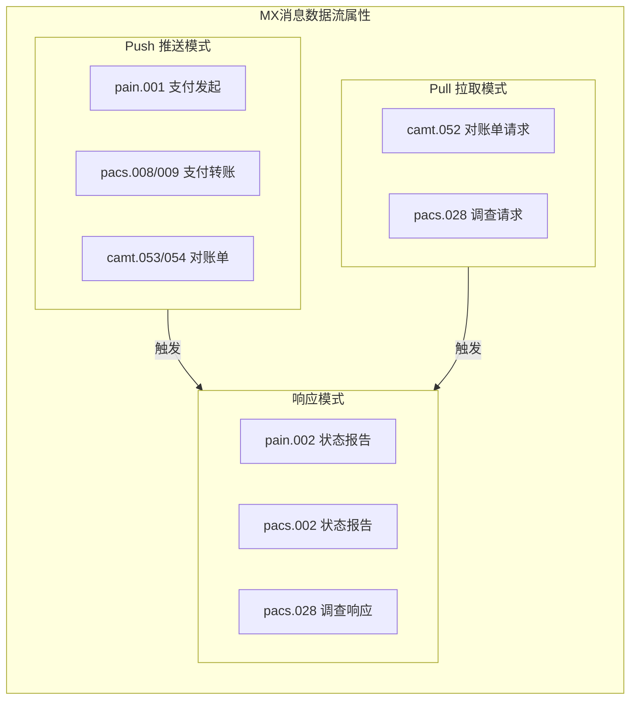
```mermaid
flowchart TD
    subgraph DataFlow["MX消息数据流属性"]
        direction TB

        subgraph Push["Push 推送模式"]
            P1[pain.001 支付发起]
            P2[pacs.008/009 支付转账]
            P3[camt.053/054 对账单]
        end

        subgraph Pull["Pull 拉取模式"]
            L1[camt.052 对账单请求]
            L2[pacs.028 调查请求]
        end

        subgraph Response["响应模式"]
            R1[pain.002 状态报告]
            R2[pacs.002 状态报告]
            R3[pacs.028 调查响应]
        end
    end

    Push -->|触发| Response
    Pull -->|触发| Response
```

---

### 3.2 消息转换与路由

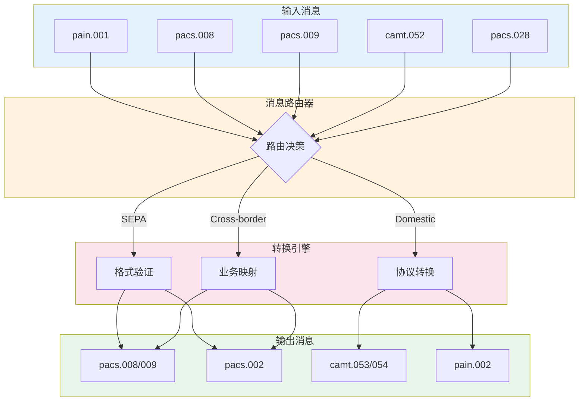
```mermaid
flowchart TD
    subgraph Input["输入消息"]
        I1[pain.001]
        I2[pacs.008]
        I3[pacs.009]
        I4[camt.052]
        I5[pacs.028]
    end

    subgraph Router["消息路由器"]
        R{路由决策}
    end

    subgraph Transform["转换引擎"]
        T1[格式验证]
        T2[业务映射]
        T3[协议转换]
    end

    subgraph Output["输出消息"]
        O1[pacs.008/009]
        O2[pacs.002]
        O3[camt.053/054]
        O4[pain.002]
    end

    I1 --> R
    I2 --> R
    I3 --> R
    I4 --> R
    I5 --> R

    R -->|SEPA| T1
    R -->|Cross-border| T2
    R -->|Domestic| T3

    T1 --> O1
    T1 --> O2
    T2 --> O1
    T2 --> O2
    T3 --> O3
    T3 --> O4

    style Input fill:#e3f2fd
    style Router fill:#fff3e0
    style Transform fill:#fce4ec
    style Output fill:#e8f5e9
```

**消息转换矩阵**：

| 源消息 | 目标消息 | 转换类型 | 场景 |
|--------|----------|----------|------|
| pain.001 | pacs.008 | 客户→银行间 | 支付转发 |
| pacs.008 | pacs.009 | 客户→金融机构 | 跨境转发 |
| pacs.009 | pacs.008 | 金融机构→客户 | 最终交付 |
| pacs.028 | pacs.002 | 调查→状态 | 状态查询响应 |
| camt.052 | camt.053 | 请求→响应 | 对账单请求 |

---

### 3.3 数据一致性保证

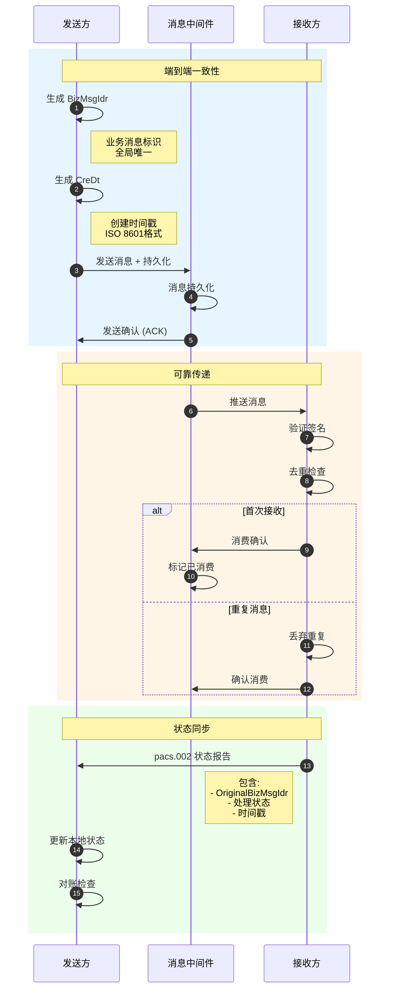
```mermaid
sequenceDiagram
    autonumber
    participant Sender as 发送方
    participant Middleware as 消息中间件
    participant Receiver as 接收方

    rect rgb(230, 245, 255)
        Note over Sender,Receiver: 端到端一致性

        Sender->>Sender: 生成 BizMsgIdr
        Note right of Sender: 业务消息标识<br/>全局唯一

        Sender->>Sender: 生成 CreDt
        Note right of Sender: 创建时间戳<br/>ISO 8601格式

        Sender->>Middleware: 发送消息 + 持久化
        Middleware->>Middleware: 消息持久化
        Middleware->>Sender: 发送确认 (ACK)
    end

    rect rgb(255, 245, 230)
        Note over Sender,Receiver: 可靠传递

        Middleware->>Receiver: 推送消息
        Receiver->>Receiver: 验证签名
        Receiver->>Receiver: 去重检查

        alt 首次接收
            Receiver->>Middleware: 消费确认
            Middleware->>Middleware: 标记已消费
        else 重复消息
            Receiver->>Receiver: 丢弃重复
            Receiver->>Middleware: 确认消费
        end
    end

    rect rgb(235, 255, 235)
        Note over Sender,Receiver: 状态同步

        Receiver->>Sender: pacs.002 状态报告
        Note left of Receiver: 包含:<br/>- OriginalBizMsgIdr<br/>- 处理状态<br/>- 时间戳

        Sender->>Sender: 更新本地状态
        Sender->>Sender: 对账检查
    end
```

---

## 4. 实时性分析

### 4.1 ISO 20022 迁移时间表

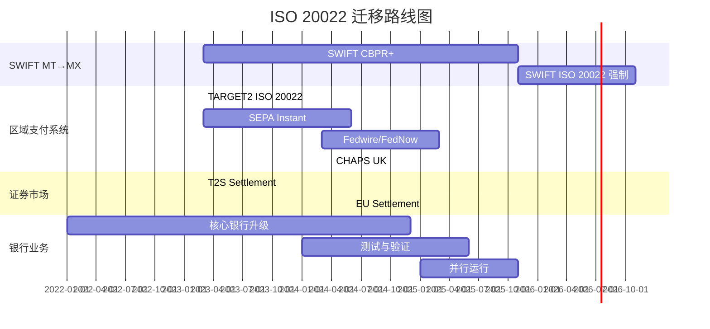
```mermaid
gantt
    title ISO 20022 迁移路线图
    dateFormat YYYY-MM
    section SWIFT MT→MX
    SWIFT CBPR+           :2023-03, 2025-11
    SWIFT ISO 20022 强制   :2025-11, 2026-11

    section 区域支付系统
    TARGET2 ISO 20022     :2023-03, 2023-03
    SEPA Instant          :2023-03, 2024-06
    Fedwire/FedNow        :2024-03, 2025-03
    CHAPS UK              :2024-04, 2024-04

    section 证券市场
    T2S Settlement        :2023-03, 2023-03
    EU Settlement         :2024-06, 2024-06

    section 银行业务
    核心银行升级         :2022-01, 2024-12
    测试与验证           :2024-01, 2025-06
    并行运行             :2025-01, 2025-11
```

**关键里程碑**：

| 日期 | 事件 | 影响范围 |
|------|------|----------|
| 2023-03 | TARGET2/T2S ISO 20022 上线 | 欧洲大额支付 |
| 2023-03 | SWIFT CBPR+ 启动 | 跨境支付共存期 |
| 2024-04 | CHAPS UK ISO 20022 上线 | 英国大额支付 |
| 2024-06 | EU 证券结算强制 | 欧洲证券市场 |
| 2025-03 | Fedwire ISO 20022 上线 | 美国大额支付 |
| 2025-11 | SWIFT MT→MX 强制切换 | 全球跨境支付 |

---

### 4.2 处理延迟要求

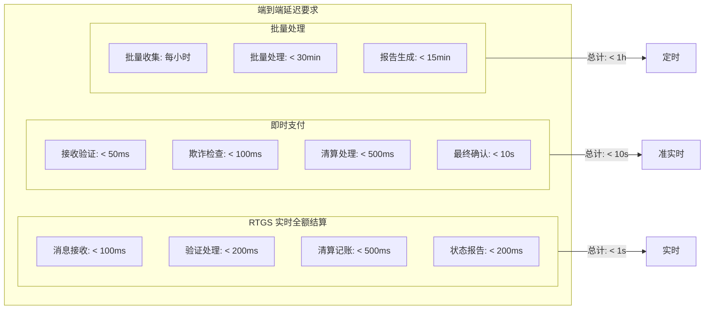
```mermaid
graph LR
    subgraph Latency["端到端延迟要求"]
        direction TB

        subgraph RTGS["RTGS 实时全额结算"]
            R1[消息接收: < 100ms]
            R2[验证处理: < 200ms]
            R3[清算记账: < 500ms]
            R4[状态报告: < 200ms]
        end

        subgraph Instant["即时支付"]
            I1[接收验证: < 50ms]
            I2[欺诈检查: < 100ms]
            I3[清算处理: < 500ms]
            I4[最终确认: < 10s]
        end

        subgraph Batch["批量处理"]
            B1[批量收集: 每小时]
            B2[批量处理: < 30min]
            B3[报告生成: < 15min]
        end
    end

    RTGS -->|总计: < 1s| End1[实时]
    Instant -->|总计: < 10s| End2[准实时]
    Batch -->|总计: < 1h| End3[定时]
```

**各场景延迟 SLA**：

| 场景 | 阶段 | 延迟要求 | 说明 |
|------|------|----------|------|
| RTGS | 接收确认 | < 100ms | TCP ACK |
| RTGS | 语法验证 | < 50ms | Schema验证 |
| RTGS | 业务验证 | < 150ms | 规则检查 |
| RTGS | 清算处理 | < 500ms | 资金划拨 |
| RTGS | 状态报告 | < 200ms | pain.002/pacs.002 |
| 即时支付 | 端到端 | < 10s | 客户感知时间 |
| 即时支付 | 银行间 | < 5s | 系统间处理 |
| 批量支付 | 批量窗口 | 1-4小时 | 收集周期 |
| 批量支付 | 处理时间 | < 30分钟 | 清算处理 |

---

### 4.3 性能指标与 SLA

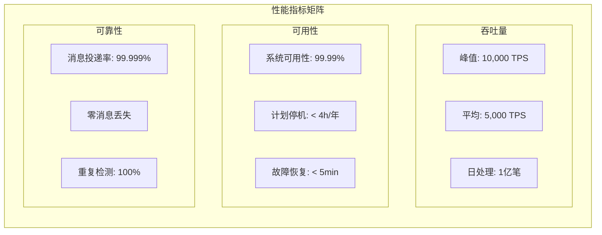
```mermaid
graph TB
    subgraph Performance["性能指标矩阵"]
        direction TB

        subgraph Throughput["吞吐量"]
            T1[峰值: 10,000 TPS]
            T2[平均: 5,000 TPS]
            T3[日处理: 1亿笔]
        end

        subgraph Availability["可用性"]
            A1[系统可用性: 99.99%]
            A2[计划停机: < 4h/年]
            A3[故障恢复: < 5min]
        end

        subgraph Reliability["可靠性"]
            R1[消息投递率: 99.999%]
            R2[零消息丢失]
            R3[重复检测: 100%]
        end
    end
```

**关键性能指标 (KPI)**：

| 指标 | 目标值 | 监控频率 |
|------|--------|----------|
| 交易吞吐量 | > 5,000 TPS | 实时监控 |
| 平均响应时间 | < 200ms | 实时监控 |
| 95分位响应时间 | < 500ms | 分钟级 |
| 99分位响应时间 | < 1s | 分钟级 |
| 系统可用性 | 99.99% | 月度统计 |
| 消息丢失率 | 0% | 实时监控 |
| 错误率 | < 0.01% | 实时监控 |
| 对账差异 | 0 | 日终检查 |

---

## 5. 异常处理

### 5.1 消息拒绝流程

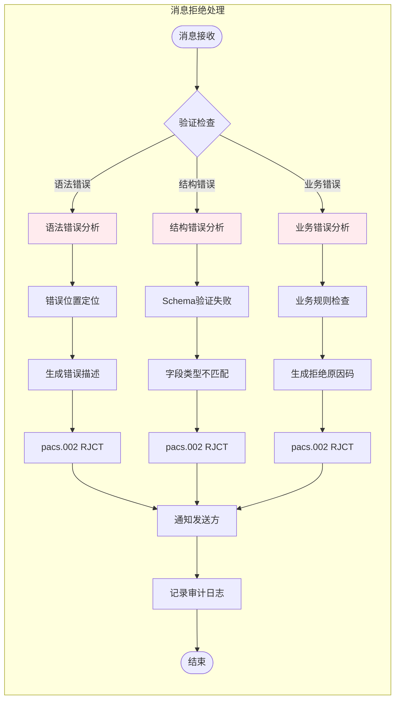
```mermaid
flowchart TD
    subgraph Rejection["消息拒绝处理"]
        direction TB

        Start([消息接收]) --> Validate{验证检查}

        Validate -->|语法错误| SyntaxError[语法错误分析]
        Validate -->|结构错误| StructureError[结构错误分析]
        Validate -->|业务错误| BusinessError[业务错误分析]

        SyntaxError --> SE1[错误位置定位]
        SE1 --> SE2[生成错误描述]
        SE2 --> RJCT1[pacs.002 RJCT]

        StructureError --> ST1[Schema验证失败]
        ST1 --> ST2[字段类型不匹配]
        ST2 --> RJCT2[pacs.002 RJCT]

        BusinessError --> BE1[业务规则检查]
        BE1 --> BE2[生成拒绝原因码]
        BE2 --> RJCT3[pacs.002 RJCT]

        RJCT1 --> Notify[通知发送方]
        RJCT2 --> Notify
        RJCT3 --> Notify

        Notify --> Log[记录审计日志]
        Log --> End([结束])

        style SyntaxError fill:#ffebee
        style StructureError fill:#ffebee
        style BusinessError fill:#ffebee
    end
```

**拒绝原因代码 (ISO 20022)**：

| 代码 | 类别 | 描述 | 示例 |
|------|------|------|------|
| AC01 | 账户 | 账号错误 | IBAN格式无效 |
| AC04 | 账户 | 账户关闭 | 目标账户已关闭 |
| AC06 | 账户 | 账户被冻结 | 账户状态受限 |
| AM02 | 金额 | 金额错误 | 金额与指令不符 |
| AM04 | 金额 | 金额不足 | 资金不足 |
| AM05 | 金额 | 重复支付 | 检测到重复交易 |
| BE04 | 参与方 | 地址错误 | 受益人地址缺失 |
| CH03 | 费用 | 费用类型不支持 | 费用承担方式无效 |
| CUST | 客户 | 客户请求 | 客户发起拒绝 |
| DT01 | 日期 | 日期错误 | 执行日期无效 |
| FF01 | 格式 | 格式错误 | XML格式无效 |
| MD07 | 目的 | 目的代码错误 | 用途代码无效 |
| NOAS | 服务 | 服务不支持 | 消息类型不支持 |
| RR04 | 监管 | 监管原因 | 合规检查失败 |

---

### 5.2 修复请求流程

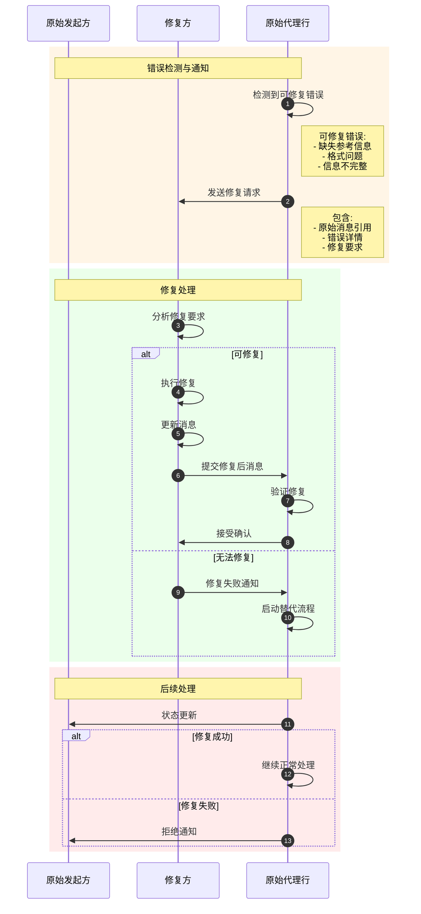
```mermaid
sequenceDiagram
    autonumber
    participant Originator as 原始发起方
    participant Repairer as 修复方
    participant OriginalAgent as 原始代理行

    rect rgb(255, 245, 230)
        Note over Originator,OriginalAgent: 错误检测与通知

        OriginalAgent->>OriginalAgent: 检测到可修复错误
        Note right of OriginalAgent: 可修复错误:<br/>- 缺失参考信息<br/>- 格式问题<br/>- 信息不完整

        OriginalAgent->>Repairer: 发送修复请求
        Note right of OriginalAgent: 包含:<br/>- 原始消息引用<br/>- 错误详情<br/>- 修复要求
    end

    rect rgb(235, 255, 235)
        Note over Originator,OriginalAgent: 修复处理

        Repairer->>Repairer: 分析修复要求

        alt 可修复
            Repairer->>Repairer: 执行修复
            Repairer->>Repairer: 更新消息
            Repairer->>OriginalAgent: 提交修复后消息
            OriginalAgent->>OriginalAgent: 验证修复
            OriginalAgent->>Repairer: 接受确认
        else 无法修复
            Repairer->>OriginalAgent: 修复失败通知
            OriginalAgent->>OriginalAgent: 启动替代流程
        end
    end

    rect rgb(255, 235, 235)
        Note over Originator,OriginalAgent: 后续处理

        OriginalAgent->>Originator: 状态更新

        alt 修复成功
            OriginalAgent->>OriginalAgent: 继续正常处理
        else 修复失败
            OriginalAgent->>Originator: 拒绝通知
        end
    end
```

---

### 5.3 调查流程 (pacs.028)

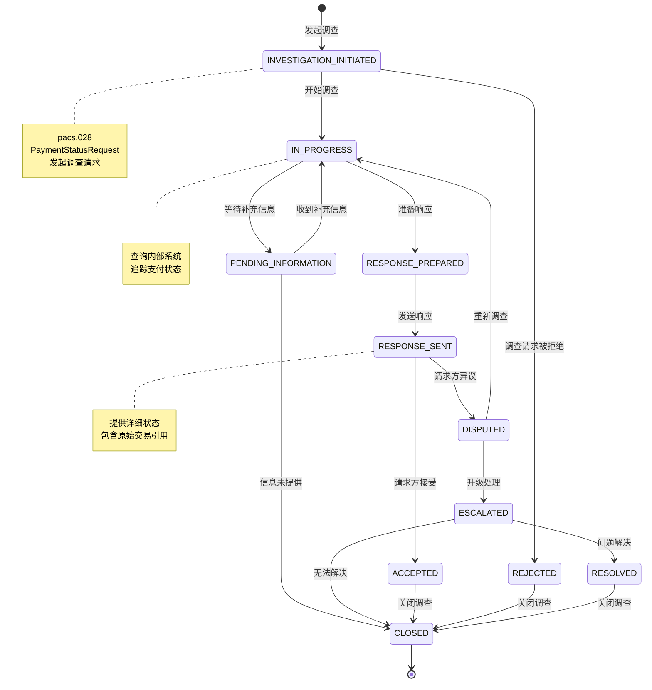
```mermaid
stateDiagram-v2
    [*] --> INVESTIGATION_INITIATED: 发起调查

    INVESTIGATION_INITIATED --> IN_PROGRESS: 开始调查
    INVESTIGATION_INITIATED --> REJECTED: 调查请求被拒绝

    IN_PROGRESS --> PENDING_INFORMATION: 等待补充信息
    IN_PROGRESS --> RESPONSE_PREPARED: 准备响应

    PENDING_INFORMATION --> IN_PROGRESS: 收到补充信息
    PENDING_INFORMATION --> CLOSED: 信息未提供

    RESPONSE_PREPARED --> RESPONSE_SENT: 发送响应
    RESPONSE_SENT --> ACCEPTED: 请求方接受
    RESPONSE_SENT --> DISPUTED: 请求方异议

    DISPUTED --> IN_PROGRESS: 重新调查
    DISPUTED --> ESCALATED: 升级处理

    ESCALATED --> RESOLVED: 问题解决
    ESCALATED --> CLOSED: 无法解决

    ACCEPTED --> CLOSED: 关闭调查
    REJECTED --> CLOSED: 关闭调查
    RESOLVED --> CLOSED: 关闭调查

    CLOSED --> [*]

    note right of INVESTIGATION_INITIATED
        pacs.028
        PaymentStatusRequest
        发起调查请求
    end note

    note right of IN_PROGRESS
        查询内部系统
        追踪支付状态
    end note

    note right of RESPONSE_SENT
        提供详细状态
        包含原始交易引用
    end note
```

**调查请求类型**：

```mermaid
graph TD
    subgraph InvestigationTypes["调查类型"]
        IT1[支付状态查询<br/>Payment Status Query]
        IT2[修改请求<br/>Modification Request]
        IT3[取消请求<br/>Cancellation Request]
        IT4[信息补全<br/>Information Request]
    end

    subgraph ResponseTypes["响应类型"]
        RT1[状态报告<br/>Status Report]
        RT2[修改确认<br/>Modification Ack]
        RT3[取消确认<br/>Cancellation Ack]
        RT4[信息提供<br/>Information]
    end

    IT1 --> RT1
    IT2 --> RT2
    IT3 --> RT3
    IT4 --> RT4

    IT1 -.->|未找到| RT5[Not Found]
    IT2 -.->|无法修改| RT6[Rejection]
    IT3 -.->|无法取消| RT6
```

---

### 5.4 撤销与退回流程

```mermaid
sequenceDiagram
    autonumber
    participant Originator as 原始发起方
    participant Instructing as 发起代理行
    participant Instructed as 接收代理行
    participant Beneficiary as 受益人银行

    rect rgb(255, 245, 230)
        Note over Originator,Beneficiary: 撤销请求 (pacs.007)

        Originator->>Instructing: 请求撤销
        Instructing->>Instructing: 验证撤销资格

        alt 未清算
            Instructing->>Instructed: pacs.007 (Reversal Request)
            Instructed->>Instructed: 验证撤销条件

            alt 可撤销
                Instructed->>Instructing: pacs.007 Response (ACCP)
                Instructed->>Instructed: 撤销原始支付
                Instructed->>Instructing: pacs.002 (CANC)
                Instructing->>Originator: pain.002 (CANC)
            else 已清算
                Instructed->>Instructing: pacs.007 Response (RJCT)
                Note left of Instructed: 拒绝原因:<br/>- 已清算<br/>- 无法撤销
            end
        else 已清算
            Instructing->>Originator: 撤销拒绝
            Note right of Instructing: 建议:<br/>请求受益人退款
        end
    end

    rect rgb(235, 255, 235)
        Note over Originator,Beneficiary: 退款流程 (pacs.004)

        Beneficiary->>Beneficiary: 收到退款请求

        alt 同意退款
            Beneficiary->>Instructed: pacs.004 (Payment Return)
            Instructed->>Instructed: 处理退款
            Instructed->>Instructing: pacs.004 + pacs.002
            Instructing->>Originator: 入账 + pain.002
        else 拒绝退款
            Beneficiary->>Instructed: 拒绝通知
            Instructed->>Instructing: 转发拒绝
            Instructing->>Originator: 退款失败通知
        end
    end
```

**撤销/退回状态码**：

| 代码 | 描述 | 使用场景 |
|------|------|----------|
| CANCEL | 撤销成功 | 原始支付被撤销 |
| MODIFIED | 修改成功 | 支付信息已修改 |
| RETURN | 退回 | 支付被退回发起方 |
| NOOR | 未找到原始交易 | 撤销请求无法匹配 |
| CINV | 撤销无效 | 交易状态不允许撤销 |

---

**参考文档**：

- `01_Overview.md` - ISO 20022 Schema 概述
- `02_Formal_Definition.md` - 形式化定义
- `03_Standards.md` - 标准对标
- `04_Transformation.md` - 转换体系
- `05_Case_Studies.md` - 实践案例
- `06_Formal_Grammar_Semantics.md` - 形式语法与语义

**相关标准**：

- ISO 20022-1:2013 - 元模型和目录
- ISO 20022-2:2013 - 建模指南
- SWIFT MX Standards - SWIFT MX消息标准
- SEPA Rulebooks - SEPA规则手册
- CBPR+ Guidelines - 跨境支付准备指南

**创建时间**：2026-02-15
**维护者**：DSL Schema 研究团队
