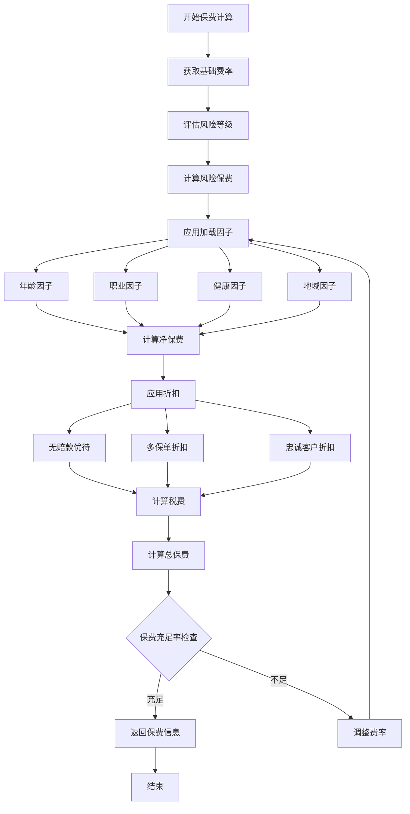
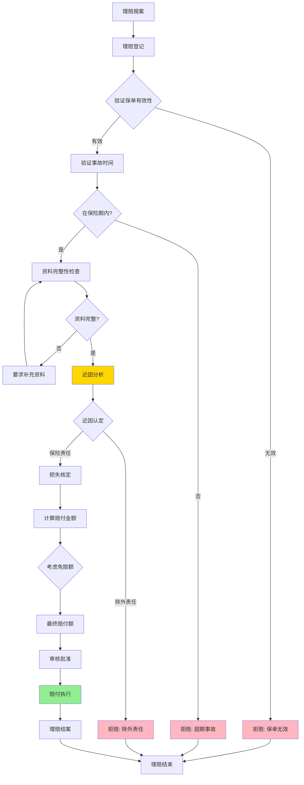
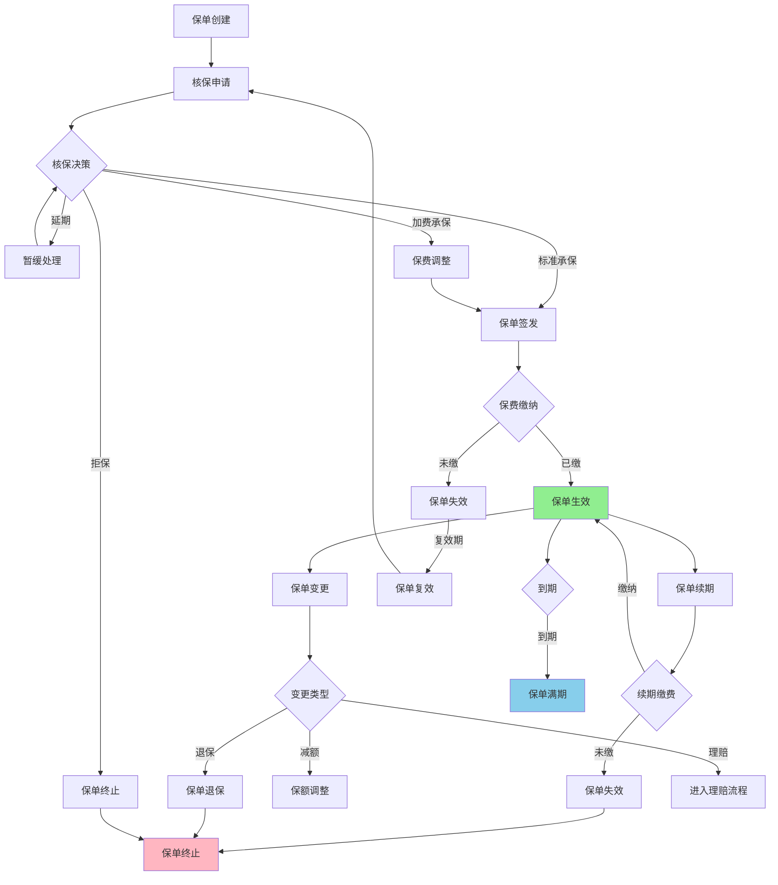
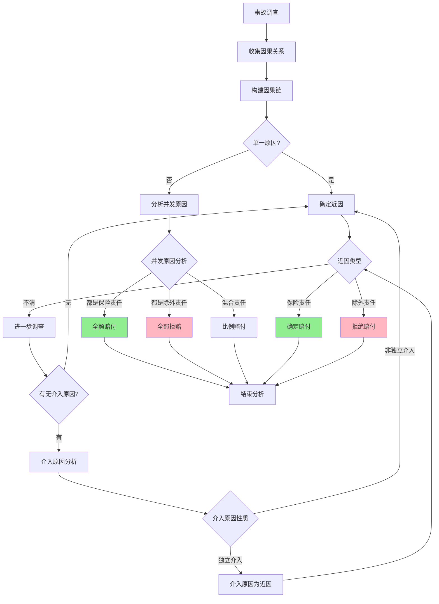
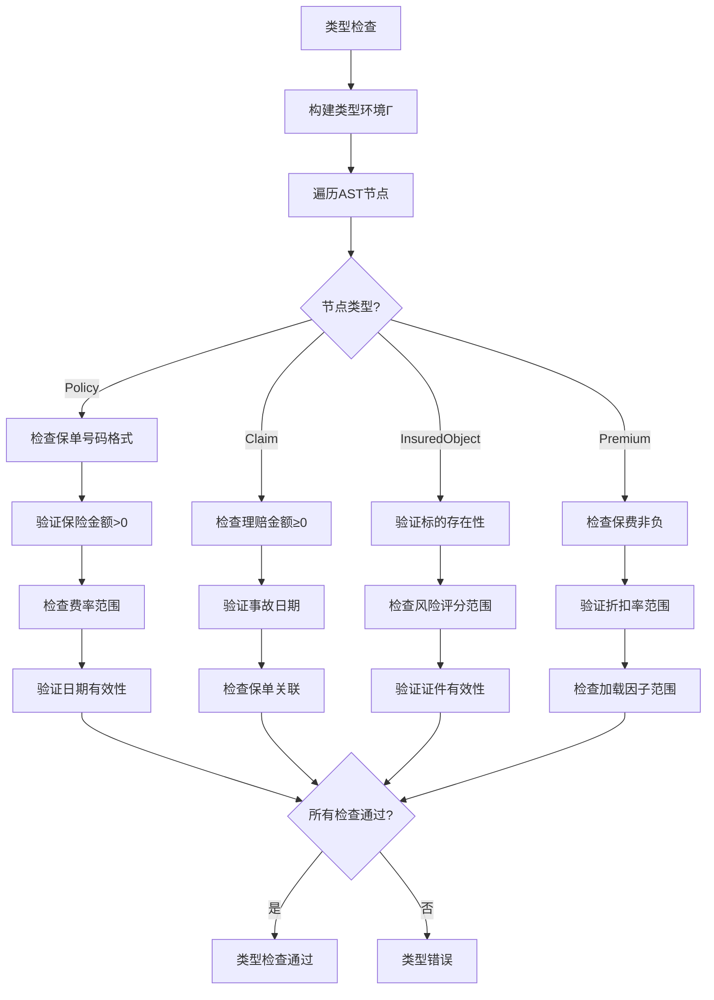
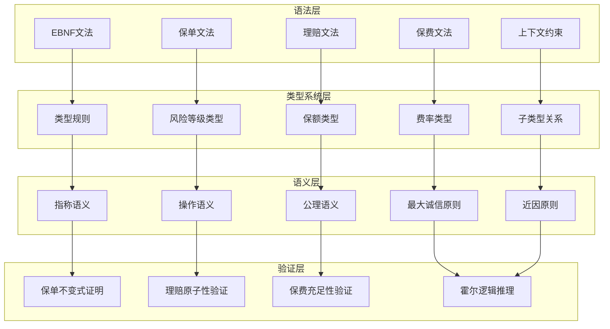

# 保险业务Schema形式语法与语义分析视图

**版本**: v1.0
**创建日期**: 2026-02-15
**标准**: IFRS 17, Solvency II, C-ROSS II, 中国保险行业协会标准

---

## 📑 目录

- [保险业务Schema形式语法与语义分析视图](#保险业务schema形式语法与语义分析视图)
  - [📑 目录](#-目录)
  - [1. 形式文法定义](#1-形式文法定义)
    - [1.1 EBNF文法](#11-ebnf文法)
      - [1.1.1 保单实体文法](#111-保单实体文法)
      - [1.1.2 理赔实体文法](#112-理赔实体文法)
      - [1.1.3 被保险标实体文法](#113-被保险标实体文法)
      - [1.1.4 保费实体文法](#114-保费实体文法)
    - [1.2 语法规则](#12-语法规则)
      - [1.2.1 保单号码校验规则](#121-保单号码校验规则)
      - [1.2.2 理赔处理规则](#122-理赔处理规则)
      - [1.2.3 保费计算规则](#123-保费计算规则)
      - [1.2.4 被保险标规则](#124-被保险标规则)
  - [2. 形式语义定义](#2-形式语义定义)
    - [2.1 指称语义 (Denotational Semantics)](#21-指称语义-denotational-semantics)
      - [2.1.1 语义域定义](#211-语义域定义)
      - [2.1.2 保单语义](#212-保单语义)
      - [2.1.3 理赔语义](#213-理赔语义)
      - [2.1.4 保费语义](#214-保费语义)
    - [2.2 操作语义 (Operational Semantics)](#22-操作语义-operational-semantics)
      - [2.2.1 大步语义 (Big-Step Semantics)](#221-大步语义-big-step-semantics)
      - [2.2.2 小步语义 (Small-Step Semantics)](#222-小步语义-small-step-semantics)
      - [2.2.3 保单状态机语义](#223-保单状态机语义)
      - [2.2.4 理赔状态机语义](#224-理赔状态机语义)
    - [2.3 公理语义 (Axiomatic Semantics)](#23-公理语义-axiomatic-semantics)
      - [2.3.1 Hoare三元组](#231-hoare三元组)
      - [2.3.2 最大诚信原则公理](#232-最大诚信原则公理)
      - [2.3.3 近因原则公理](#233-近因原则公理)
      - [2.3.4 补偿原则公理](#234-补偿原则公理)
      - [2.3.5 保单状态不变式证明](#235-保单状态不变式证明)
      - [2.3.6 理赔原子性证明](#236-理赔原子性证明)
  - [3. 类型系统](#3-类型系统)
    - [3.1 类型规则](#31-类型规则)
    - [3.2 类型运算规则](#32-类型运算规则)
    - [3.3 子类型关系](#33-子类型关系)
    - [3.4 多态与类型约束](#34-多态与类型约束)
  - [4. 语义等价性](#4-语义等价性)
    - [4.1 程序等价定义](#41-程序等价定义)
    - [4.2 等价变换规则](#42-等价变换规则)
    - [4.3 保单状态转换等价](#43-保单状态转换等价)
  - [5. Mermaid可视化](#5-mermaid可视化)
    - [5.1 保费计算流程](#51-保费计算流程)
    - [5.2 理赔处理语义流程](#52-理赔处理语义流程)
    - [5.3 保单生命周期流程](#53-保单生命周期流程)
    - [5.4 近因分析流程](#54-近因分析流程)
    - [5.5 类型检查流程](#55-类型检查流程)
    - [5.6 形式语义层级图](#56-形式语义层级图)

---

## 1. 形式文法定义

### 1.1 EBNF文法

#### 1.1.1 保单实体文法

```ebnf
(* 保险核心业务实体 - 保单定义 *)

Policy ::= LifePolicy | PropertyPolicy | HealthPolicy | AutoPolicy

LifePolicy ::= '{'
    '"policy_number"' ':' PolicyNumber ','
    '"policyholder_id"' ':' CustomerId ','
    '"insured_persons"' ':' InsuredPersonList ','
    '"product_code"' ':' ProductCode ','
    '"life_type"' ':' LifeInsuranceType ','
    '"sum_assured"' ':' MonetaryAmount ','
    '"premium"' ':' PremiumInfo ','
    '"term"' ':' PolicyTerm ','
    '"premium_payment_mode"' ':' PaymentMode ','
    '"beneficiaries"' ':' BeneficiaryList ','
    '"risk_level"' ':' RiskLevel ','
    '"underwriting_decision"' ':' UnderwritingDecision ','
    '"status"' ':' PolicyStatus ','
    '"effective_date"' ':' Date ','
    '"maturity_date"' ':' Date
    ['"cash_value"' ':' MonetaryAmount]
    ['"surrender_charge"' ':' SurrenderCharge]
    ['"riders"' ':' RiderList]
'}'

PropertyPolicy ::= '{'
    '"policy_number"' ':' PolicyNumber ','
    '"policyholder_id"' ':' CustomerId ','
    '"property_address"' ':' PropertyAddress ','
    '"product_code"' ':' ProductCode ','
    '"property_type"' ':' PropertyType ','
    '"coverage_items"' ':' CoverageItemList ','
    '"sum_insured"' ':' MonetaryAmount ','
    '"premium"' ':' PremiumInfo ','
    '"deductible"' ':' DeductibleInfo ','
    '"risk_factors"' ':' PropertyRiskFactors ','
    '"underwriting_decision"' ':' UnderwritingDecision ','
    '"status"' ':' PolicyStatus ','
    '"effective_date"' ':' Date ','
    '"expiry_date"' ':' Date
'}'

HealthPolicy ::= '{'
    '"policy_number"' ':' PolicyNumber ','
    '"policyholder_id"' ':' CustomerId ','
    '"insured_persons"' ':' InsuredPersonList ','
    '"product_code"' ':' ProductCode ','
    '"health_type"' ':' HealthInsuranceType ','
    '"coverage_scope"' ':' CoverageScope ','
    '"sum_insured"' ':' MonetaryAmount ','
    '"premium"' ':' PremiumInfo ','
    '"waiting_period_days"' ':' Integer ','
    '"pre_existing_conditions"' ':' ConditionList ','
    '"underwriting_decision"' ':' UnderwritingDecision ','
    '"status"' ':' PolicyStatus ','
    '"effective_date"' ':' Date ','
    '"expiry_date"' ':' Date
'}'

AutoPolicy ::= '{'
    '"policy_number"' ':' PolicyNumber ','
    '"policyholder_id"' ':' CustomerId ','
    '"vehicle_info"' ':' VehicleInfo ','
    '"product_code"' ':' ProductCode ','
    '"coverage_types"' ':' AutoCoverageList ','
    '"sum_insured"' ':' MonetaryAmount ','
    '"premium"' ':' PremiumInfo ','
    '"deductible_rate"' ':' Rate ','
    '"no_claim_discount"' ':' NCDLevel ','
    '"underwriting_decision"' ':' UnderwritingDecision ','
    '"status"' ':' PolicyStatus ','
    '"effective_date"' ':' Date ','
    '"expiry_date"' ':' Date
'}'

(* 保单号码格式: 保险公司代码(3) + 险种(2) + 年份(2) + 序号(10) *)
PolicyNumber ::= '[0-9]{3}[A-Z]{2}[0-9]{2}[0-9]{10}'

LifeInsuranceType ::= 'TERM' | 'WHOLE_LIFE' | 'ENDOWMENT' | 'ANNUITY' | 'UNIVERSAL' | 'INVESTMENT_LINKED'
PropertyType ::= 'RESIDENTIAL' | 'COMMERCIAL' | 'INDUSTRIAL' | 'AGRICULTURAL'
HealthInsuranceType ::= 'MEDICAL_EXPENSE' | 'CRITICAL_ILLNESS' | 'ACCIDENT' | 'DISABILITY'
AutoCoverageList ::= List<AutoCoverageType>
AutoCoverageType ::= 'COMPULSORY' | 'COMMERCIAL_THIRD_PARTY' | 'VEHICLE_DAMAGE' | 'THEFT' | 'GLASS' | 'SCRATCH'
PolicyStatus ::= 'PENDING' | 'IN_FORCE' | 'LAPSED' | 'SURRENDERED' | 'MATURED' | 'TERMINATED'
UnderwritingDecision ::= 'ACCEPT' | 'ACCEPT_WITH_LOADING' | 'POSTPONE' | 'DECLINE'
PaymentMode ::= 'SINGLE' | 'ANNUAL' | 'SEMI_ANNUAL' | 'QUARTERLY' | 'MONTHLY'
RiskLevel ::= 'LOW' | 'MEDIUM' | 'HIGH' | 'VERY_HIGH'
NCDLevel ::= '0' | '1' | '2' | '3' | '4' | '5' | '6'
```

#### 1.1.2 理赔实体文法

```ebnf
(* 理赔定义 - 理赔申请、审核、定损、赔付 *)

Claim ::= LifeClaim | PropertyClaim | HealthClaim | AutoClaim

LifeClaim ::= '{'
    '"claim_number"' ':' ClaimNumber ','
    '"policy_number"' ':' PolicyNumber ','
    '"claimant_id"' ':' CustomerId ','
    '"claim_type"' ':' LifeClaimType ','
    '"incident_date"' ':' Date ','
    '"notification_date"' ':' Date ','
    '"report_date"' ':' Date ','
    '"incident_description"' ':' String(1000) ','
    '"required_documents"' ':' DocumentList ','
    '"status"' ':' ClaimStatus ','
    '"reserve_amount"' ':' MonetaryAmount ','
    '"assessment"' ':' ClaimAssessment ','
    '"settlement"' ':' SettlementInfo
'}'

PropertyClaim ::= '{'
    '"claim_number"' ':' ClaimNumber ','
    '"policy_number"' ':' PolicyNumber ','
    '"claimant_id"' ':' CustomerId ','
    '"claim_type"' ':' PropertyClaimType ','
    '"incident_date"' ':' Date ','
    '"damage_location"' ':' PropertyAddress ','
    '"damage_description"' ':' String(1000) ','
    '"estimated_loss"' ':' MonetaryAmount ','
    '"surveyor_report"' ':' SurveyorReport ','
    '"status"' ':' ClaimStatus ','
    '"reserve_amount"' ':' MonetaryAmount ','
    '"assessment"' ':' ClaimAssessment ','
    '"settlement"' ':' SettlementInfo
'}'

HealthClaim ::= '{'
    '"claim_number"' ':' ClaimNumber ','
    '"policy_number"' ':' PolicyNumber ','
    '"claimant_id"' ':' CustomerId ','
    '"claim_type"' ':' HealthClaimType ','
    '"treatment_date"' ':' Date ','
    '"medical_provider"' ':' MedicalProvider ','
    '"diagnosis_code"' ':' ICDCode ','
    '"treatment_description"' ':' String(1000) ','
    '"medical_expenses"' ':' ExpenseItemList ','
    '"status"' ':' ClaimStatus ','
    '"reserve_amount"' ':' MonetaryAmount ','
    '"assessment"' ':' ClaimAssessment ','
    '"settlement"' ':' SettlementInfo
'}'

AutoClaim ::= '{'
    '"claim_number"' ':' ClaimNumber ','
    '"policy_number"' ':' PolicyNumber ','
    '"claimant_id"' ':' CustomerId ','
    '"claim_type"' ':' AutoClaimType ','
    '"accident_date"' ':' Date ','
    '"accident_location"' ':' GeographicLocation ','
    '"accident_description"' ':' String(1000) ','
    '"liability_assessment"' ':' LiabilityAssessment ','
    '"vehicle_damage"' ':' VehicleDamage ','
    '"third_party_damage"' ':' ThirdPartyDamage ','
    '"status"' ':' ClaimStatus ','
    '"reserve_amount"' ':' MonetaryAmount ','
    '"assessment"' ':' ClaimAssessment ','
    '"settlement"' ':' SettlementInfo
'}'

(* 标识符格式 *)
ClaimNumber ::= 'CLM[0-9]{4}[0-9]{10}'
ProductCode ::= '[A-Z]{3}[0-9]{4}[A-Z]?'
CustomerId ::= '[A-Z0-9]{20}'
ICDCode ::= '[A-Z][0-9]{2}(\.[0-9]{1,2})?'

(* 理赔类型枚举 *)
LifeClaimType ::= 'DEATH' | 'DISABILITY' | 'CRITICAL_ILLNESS' | 'MATURITY' | 'SURRENDER'
PropertyClaimType ::= 'FIRE' | 'WATER_DAMAGE' | 'THEFT' | 'NATURAL_DISASTER' | 'ACCIDENTAL_DAMAGE'
HealthClaimType ::= 'INPATIENT' | 'OUTPATIENT' | 'DENTAL' | 'MATERNITY' | 'EMERGENCY'
AutoClaimType ::= 'COLLISION' | 'THEFT' | 'FIRE' | 'NATURAL_DISASTER' | 'THIRD_PARTY_LIABILITY'

(* 理赔状态 *)
ClaimStatus ::= 'REPORTED' | 'REGISTERED' | 'UNDER_INVESTIGATION' | 'DOCUMENTS_PENDING' |
                'UNDER_ASSESSMENT' | 'APPROVED' | 'REJECTED' | 'SETTLED' | 'CLOSED' | 'REOPENED'

(* 理赔审核 *)
ClaimAssessment ::= '{'
    '"assessor_id"' ':' AssessorId ','
    '"assessment_date"' ':' Date ','
    '"policy_coverage_verification"' ':' VerificationResult ','
    '"proximate_cause_analysis"' ':' CauseAnalysis ','
    '"liability_decision"' ':' LiabilityDecision ','
    '"payable_amount"' ':' MonetaryAmount ','
    '"deductions"' ':' DeductionList ','
    '"assessment_notes"' ':' String(2000)
'}'

VerificationResult ::= 'VALID' | 'INVALID' | 'PARTIAL'
LiabilityDecision ::= 'FULL_LIABILITY' | 'PARTIAL_LIABILITY' | 'NO_LIABILITY'

(* 赔付信息 *)
SettlementInfo ::= '{'
    '"settlement_date"' ':' Date ','
    '"settlement_amount"' ':' MonetaryAmount ','
    '"settlement_method"' ':' SettlementMethod ','
    '"beneficiary_account"' ':' AccountNumber ','
    '"deductible_applied"' ':' MonetaryAmount ','
    '"coinsurance_applied"' ':' MonetaryAmount ','
    '"salvage_amount"' ':' MonetaryAmount
'}'

SettlementMethod ::= 'BANK_TRANSFER' | 'CHECK' | 'CASH' | 'OFFSET_PREMIUM'
```

#### 1.1.3 被保险标实体文法

```ebnf
(* 被保险标定义 - 人、车、房、货物 *)

InsuredObject ::= Person | Vehicle | Property | Cargo

Person ::= '{'
    '"object_id"' ':' ObjectId ','
    '"object_type"' ':' '"PERSON"' ','
    '"name"' ':' String(100) ','
    '"gender"' ':' Gender ','
    '"date_of_birth"' ':' Date ','
    '"identification"' ':' Identification ','
    '"occupation"' ':' Occupation ','
    '"occupation_class"' ':' OccupationClass ','
    '"health_declaration"' ':' HealthDeclaration ','
    '"risk_factors"' ':' PersonRiskFactors
'}'

Vehicle ::= '{'
    '"object_id"' ':' ObjectId ','
    '"object_type"' ':' '"VEHICLE"' ','
    '"license_plate"' ':' LicensePlate ','
    '"vin"' ':' VIN ','
    '"vehicle_type"' ':' VehicleType ','
    '"brand"' ':' String(50) ','
    '"model"' ':' String(50) ','
    '"manufacture_year"' ':' Year ','
    '"engine_displacement"' ':' Displacement ','
    '"usage_type"' ':' VehicleUsage ','
    '"registered_owner"' ':' CustomerId ','
    '"risk_factors"' ':' VehicleRiskFactors
'}'

Property ::= '{'
    '"object_id"' ':' ObjectId ','
    '"object_type"' ':' '"PROPERTY"' ','
    '"property_address"' ':' PropertyAddress ','
    '"property_type"' ':' PropertyType ','
    '"construction_type"' ':' ConstructionType ','
    '"construction_year"' ':' Year ','
    '"floor_area"' ':' Area ','
    '"occupancy_type"' ':' OccupancyType ','
    '"security_features"' ':' SecurityFeatures ','
    '"risk_factors"' ':' PropertyRiskFactors
'}'

Cargo ::= '{'
    '"object_id"' ':' ObjectId ','
    '"object_type"' ':' '"CARGO"' ','
    '"cargo_description"' ':' String(500) ','
    '"cargo_type"' ':' CargoType ','
    '"quantity"' ':' Quantity ','
    '"unit_value"' ':' MonetaryAmount ','
    '"total_value"' ':' MonetaryAmount ','
    '"origin"' ':' Location ','
    '"destination"' ':' Location ','
    '"transport_mode"' ':' TransportMode ','
    '"packaging_type"' ':' PackagingType ','
    '"risk_factors"' ':' CargoRiskFactors
'}'

(* 标识符格式 *)
ObjectId ::= 'OBJ[A-Z]{2}[0-9]{12}'
LicensePlate ::= '[A-Z][A-Z0-9]{4,6}'
VIN ::= '[A-HJ-NPR-Z0-9]{17}'  (* ISO 3780 *)

(* 枚举值 *)
Gender ::= 'MALE' | 'FEMALE' | 'OTHER'
OccupationClass ::= '1' | '2' | '3' | '4' | '5' | '6'  (* 1=最低风险, 6=最高风险 *)
VehicleType ::= 'PASSENGER_CAR' | 'SUV' | 'TRUCK' | 'BUS' | 'MOTORCYCLE' | 'SPECIAL'
VehicleUsage ::= 'PRIVATE' | 'COMMERCIAL' | 'RENTAL' | 'PUBLIC_TRANSPORT'
ConstructionType ::= 'CONCRETE' | 'BRICK' | 'STEEL' | 'WOOD' | 'MIXED'
OccupancyType ::= 'OWNER_OCCUPIED' | 'TENANTED' | 'VACANT' | 'UNDER_CONSTRUCTION'
CargoType ::= 'GENERAL' | 'HAZARDOUS' | 'PERISHABLE' | 'FRAGILE' | 'VALUABLE' | 'OVERSIZED'
TransportMode ::= 'ROAD' | 'RAIL' | 'SEA' | 'AIR' | 'MULTIMODAL'
PackagingType ::= 'CONTAINER' | 'BULK' | 'PALLET' | 'CRATE' | 'DRUM' | 'CARTON'

(* 风险因子 *)
PersonRiskFactors ::= '{'
    ['"smoking_status"' ':' SmokingStatus]
    ['"bmi"' ':' Decimal]
    ['"family_history"' ':' MedicalHistoryList]
    ['"personal_history"' ':' MedicalHistoryList]
    ['"hazardous_occupation"' ':' Boolean]
    ['"extreme_sports"' ':' Boolean]
'}'

VehicleRiskFactors ::= '{'
    ['"theft_rate"' ':' Rate]
    ['"accident_rate"' ':' Rate]
    ['"anti_theft_device"' ':' Boolean]
    ['"driving_record"' ':' DrivingRecord]
    ['"annual_mileage"' ':' Integer]
'}'

PropertyRiskFactors ::= '{'
    ['"fire_protection_rating"' ':' ProtectionRating]
    ['"flood_zone"' ':' FloodZone]
    ['"earthquake_zone"' ':' EarthquakeZone]
    ['"crime_rate_index"' ':' Rate]
    ['"building_condition"' ':' BuildingCondition]
'}'

CargoRiskFactors ::= '{'
    ['"transit_risk_score"' ':' RiskScore]
    ['"route_risk_level"' ':' RiskLevel]
    ['"weather_exposure"' ':' RiskLevel]
    ['"handling_complexity"' ':' ComplexityLevel]
'}'

SmokingStatus ::= 'NON_SMOKER' | 'FORMER_SMOKER' | 'CURRENT_SMOKER'
ProtectionRating ::= 'EXCELLENT' | 'GOOD' | 'FAIR' | 'POOR'
FloodZone ::= 'A' | 'B' | 'C' | 'D' | 'X'
EarthquakeZone ::= '0' | '1' | '2' | '3' | '4'
BuildingCondition ::= 'EXCELLENT' | 'GOOD' | 'FAIR' | 'POOR' | 'DILAPIDATED'
RiskScore ::= '[0-9]{1,3}'
ComplexityLevel ::= 'LOW' | 'MEDIUM' | 'HIGH'
```

#### 1.1.4 保费实体文法

```ebnf
(* 保费定义 - 计算因子、折扣、附加费 *)

PremiumInfo ::= '{'
    '"base_premium"' ':' MonetaryAmount ','
    '"risk_premium"' ':' MonetaryAmount ','
    '"loading_factors"' ':' LoadingFactorList ','
    '"discounts"' ':' DiscountList ','
    '"net_premium"' ':' MonetaryAmount ','
    '"tax_amount"' ':' MonetaryAmount ','
    '"total_premium"' ':' MonetaryAmount ','
    '"payment_frequency"' ':' PaymentFrequency ','
    '"installment_amount"' ':' MonetaryAmount
'}'

(* 计算因子 *)
LoadingFactorList ::= List<LoadingFactor>
LoadingFactor ::= '{'
    '"factor_type"' ':' LoadingType ','
    '"factor_value"' ':' Rate ','
    '"amount"' ':' MonetaryAmount ','
    '"description"' ':' String(200)
'}'

LoadingType ::= 'MORTALITY' | 'MORBIDITY' | 'EXPENSE' | 'PROFIT' | 'CONTINGENCY' |
               'OCCUPATION' | 'HEALTH' | 'LIFESTYLE' | 'TERRITORY' | 'VEHICLE_USAGE'

(* 折扣 *)
DiscountList ::= List<Discount>
Discount ::= '{'
    '"discount_type"' ':' DiscountType ','
    '"discount_rate"' ':' Rate ','
    '"amount"' ':' MonetaryAmount ','
    '"description"' ':' String(200)
'}'

DiscountType ::= 'NO_CLAIM' | 'MULTI_POLICY' | 'LOYALTY' | 'GROUP' | 'ONLINE' |
                'ADVANCED_PAYMENT' | 'SAFETY_DEVICE' | 'GOOD_DRIVER' | 'FAMILY_PLAN'

(* 附加费 *)
SurchargeList ::= List<Surcharge>
Surcharge ::= '{'
    '"surcharge_type"' ':' SurchargeType ','
    '"surcharge_rate"' ':' Rate ','
    '"amount"' ':' MonetaryAmount ','
    '"description"' ':' String(200)
'}'

SurchargeType ::= 'INSTALLMENT' | 'SHORT_TERM' | 'HIGH_RISK' | 'NON_STANDARD' | 'ADMINISTRATIVE'

(* 保费计算规则 *)
PremiumCalculation ::= '{'
    '"formula_id"' ':' FormulaId ','
    '"formula_version"' ':' Version ','
    '"base_rate"' ':' Rate ','
    '"rate_table_reference"' ':' RateTableRef ','
    '"calculation_parameters"' ':' ParameterList ','
    '"calculation_date"' ':' Date ','
    '"validity_period"' ':' ValidityPeriod
'}'

FormulaId ::= 'FML[0-9]{6}'
Version ::= '[0-9]+\.[0-9]+'
PaymentFrequency ::= 'SINGLE' | 'ANNUAL' | 'SEMI_ANNUAL' | 'QUARTERLY' | 'MONTHLY'

(* 参数列表 *)
ParameterList ::= List<Parameter>
Parameter ::= '{'
    '"parameter_name"' ':' String(50) ','
    '"parameter_value"' ':' Decimal ','
    '"parameter_unit"' ':' String(20)
'}'
```

### 1.2 语法规则

#### 1.2.1 保单号码校验规则

```
约束1: 保单号码格式有效性
  ∀p ∈ Policy :
    policy_number(p) ∈ [0-9]{3}[A-Z]{2}[0-9]{2}[0-9]{10}

约束2: 保险公司代码有效性
  ∀p ∈ Policy :
    company_code(policy_number(p)) ∈ RegisteredInsuranceCompanies

约束3: 险种代码有效性
  ∀p ∈ Policy :
    product_category(policy_number(p)) ∈ {LF, PR, HE, AU, ...}

约束4: 保单状态一致性
  ∀p ∈ Policy :
    status(p) = IN_FORCE ⇒ effective_date(p) ≤ current_date() ≤ expiry_date(p)

约束5: 保险金额约束
  ∀p ∈ Policy :
    sum_insured(p) > 0 ∧ sum_insured(p) ≤ MAX_SUM_INSURED
```

#### 1.2.2 理赔处理规则

```
约束6: 理赔时效约束
  ∀c ∈ Claim :
    notification_date(c) - incident_date(c) ≤ claim_notification_deadline(policy(c))

约束7: 理赔状态转换有效性
  ∀c ∈ Claim :
    valid_transition(status(c), next_status) = true

约束8: 赔付金额约束
  ∀c ∈ Claim, s ∈ SettlementInfo :
    settlement_amount(s) ≤ reserve_amount(c) ∧ settlement_amount(s) ≥ 0

约束9: 近因原则约束
  ∀c ∈ Claim :
    proximate_cause(c) ∈ covered_perils(policy(c)) ∨
    proximate_cause(c) ∈ excluded_perils(policy(c))

约束10: 最大诚信约束
  ∀c ∈ Claim :
    material_facts_disclosed(c) = true ⇒
      claim_valid(c) = true
    material_facts_concealed(c) = true ⇒
      claim_voidable(c) = true
```

#### 1.2.3 保费计算规则

```
约束11: 保费非负性
  ∀p ∈ Policy :
    base_premium(premium(p)) ≥ 0 ∧ total_premium(premium(p)) ≥ 0

约束12: 保费计算完整性
  ∀p ∈ Policy :
    net_premium(p) = base_premium(p) + Σloading_factors(p) - Σdiscounts(p)

约束13: 税费计算
  ∀p ∈ Policy :
    tax_amount(p) = net_premium(p) × tax_rate(product_category(p))

约束14: 总保费计算
  ∀p ∈ Policy :
    total_premium(p) = net_premium(p) + tax_amount(p) + Σsurcharges(p)

约束15: 保费充足率
  ∀p ∈ Policy, r ∈ RiskAssessment :
    premium_adequacy_ratio(p, r) ≥ minimum_adequacy_threshold
```

#### 1.2.4 被保险标规则

```
约束16: 标的存在性
  ∀o ∈ InsuredObject, p ∈ Policy :
    object_id(o) ∈ insured_objects(p) ⇒
      object_exists(o) = true

约束17: 风险评估完整性
  ∀o ∈ InsuredObject :
    risk_factors(o) ≠ ⊥ ∧ risk_score(o) ∈ [0, 100]

约束18: 车辆信息有效性
  ∀v ∈ Vehicle :
    vin(v) ∈ ValidVIN ∧ license_plate(v) ∈ ValidPlateFormat

约束19: 健康告知完整性
  ∀pers ∈ Person, p ∈ HealthPolicy ∪ LifePolicy :
    health_declaration(pers) ≠ ⊥ ⇒
      underwriting_decision(p) ≠ ⊥
```

---

## 2. 形式语义定义

### 2.1 指称语义 (Denotational Semantics)

#### 2.1.1 语义域定义

```
D[InsuranceSystem] : Environment → State → State

State = PolicyState × ClaimState × InsuredObjectState × PremiumState

PolicyState = PolicyNumber → PolicyValue
PolicyValue = {
  policyholder_id: CustomerId,
  insured_objects: Set<InsuredObject>,
  product_code: ProductCode,
  sum_insured: Money,
  premium: PremiumValue,
  effective_date: Date,
  expiry_date: Date,
  status: PolicyStatus,
  ...
}

ClaimState = ClaimNumber → ClaimValue
ClaimValue = {
  policy_number: PolicyNumber,
  claimant_id: CustomerId,
  claim_type: ClaimType,
  incident_date: Date,
  notification_date: Date,
  status: ClaimStatus,
  reserve_amount: Money,
  assessment: AssessmentValue,
  settlement: SettlementValue,
  ...
}

InsuredObjectState = ObjectId → ObjectValue
ObjectValue = {
  object_type: ObjectType,
  risk_factors: RiskFactors,
  risk_score: RiskScore,
  ...
}

PremiumState = (PolicyNumber, Date) → PremiumValue
PremiumValue = {
  base_premium: Money,
  risk_premium: Money,
  net_premium: Money,
  total_premium: Money,
  calculation_factors: Map<FactorType, Rate>,
  ...
}

Money = Decimal(18,2)  (* 有界货币值 *)
RiskScore = [0, 100]   (* 风险评分 *)
Date = ℕ               (* Unix时间戳 *)
```

#### 2.1.2 保单语义

```
(* 保单查询语义 *)
E[policy.sum_insured] env sto =
  let pol = lookup_policy(sto, env.policy_number) in
  pol.sum_insured

(* 保单状态转换语义 *)
S[policy.status := new_status] env sto =
  let pol = lookup_policy(sto, env.policy_number) in
  if valid_policy_transition(pol.status, new_status)
  then sto[policy ↦ pol[status ↦ new_status]]
  else error "Invalid policy state transition"

(* 保费计算语义 *)
E[policy.premium] env sto =
  let pol = lookup_policy(sto, env.policy_number) in
  let risk = calculate_risk_score(pol.insured_objects) in
  let base = pol.sum_insured × base_rate(pol.product_code) in
  let risk_prem = base × risk_factor(risk) in
  let loadings = Σ(loading_factor(l) × base for l ∈ pol.loading_factors) in
  let discounts = Σ(discount_factor(d) × base for d ∈ pol.discounts) in
  let net = risk_prem + loadings - discounts in
  let tax = net × tax_rate(pol.product_code) in
  {
    base_premium = base,
    risk_premium = risk_prem,
    net_premium = net,
    total_premium = net + tax,
    ...
  }

(* 保单生效语义 *)
S[activate_policy(pol)] env sto =
  let policy = lookup_policy(sto, pol.policy_number) in
  if policy.status = PENDING ∧
     policy.effective_date ≤ current_date() ∧
     policy.premium.total_premium > 0
  then sto[policy ↦ policy[status ↦ IN_FORCE]]
  else error "Policy activation failed"
```

#### 2.1.3 理赔语义

```
(* 理赔金额语义 *)
E[claim.reserve_amount] env sto =
  let clm = lookup_claim(sto, env.claim_number) in
  clm.reserve_amount

(* 理赔申请语义 *)
S[submit_claim(clm)] env sto =
  let policy = lookup_policy(sto, clm.policy_number) in
  if policy.status = IN_FORCE ∧
     clm.incident_date ≥ policy.effective_date ∧
     clm.incident_date ≤ policy.expiry_date
  then sto[claim ↦ clm[status ↦ REGISTERED, report_date ↦ now()]]
  else error "Claim submission failed"

(* 理赔审核语义 *)
S[assess_claim(clm, assessment)] env sto =
  let claim = lookup_claim(sto, clm.claim_number) in
  let policy = lookup_policy(sto, claim.policy_number) in
  let proximate_cause = assessment.cause_analysis in

  if proximate_cause ∈ covered_perils(policy)
  then
    let payable = calculate_payable_amount(claim, policy, assessment) in
    sto[claim ↦ claim[
      status ↦ APPROVED,
      assessment ↦ assessment,
      settlement[payable_amount ↦ payable]
    ]]
  else if proximate_cause ∈ excluded_perils(policy)
  then sto[claim ↦ claim[status ↦ REJECTED, rejection_reason ↦ "Excluded peril"]]
  else sto[claim ↦ claim[status ↦ UNDER_INVESTIGATION]]

(* 近因分析语义 *)
E[claim.proximate_cause] env sto =
  let clm = lookup_claim(sto, env.claim_number) in
  let causes = clm.incident_causes in
  determine_proximate_cause(causes, causal_chain(clm))

(* 赔付执行语义 *)
S[settle_claim(clm)] env sto =
  let claim = lookup_claim(sto, clm.claim_number) in
  if claim.status = APPROVED ∧ claim.settlement.payable_amount ≥ 0
  then
    let policy = lookup_policy(sto, claim.policy_number) in
    let updated_claim = claim[
      status ↦ SETTLED,
      settlement[settlement_date ↦ now()]
    ] in
    sto[claim ↦ updated_claim]
  else error "Settlement failed"
```

#### 2.1.4 保费语义

```
(* 保费因子语义 *)
E[premium.loading_factors] env sto =
  let prem = lookup_premium(sto, env.policy_number, env.effective_date) in
  prem.loading_factors

(* 折扣计算语义 *)
E[calculate_discounts(policy)] env sto =
  let pol = lookup_policy(sto, policy.policy_number) in
  let discounts = [] in

  (* 无赔款优待 *)
  if no_claim_years(pol) > 0
  then discounts = discounts ∪ {NCD(no_claim_years(pol))} in

  (* 多保单折扣 *)
  if count_policies(pol.policyholder_id) > 1
  then discounts = discounts ∪ {MULTI_POLICY} in

  (* 忠诚客户折扣 *)
  if customer_tenure(pol.policyholder_id) ≥ 3 years
  then discounts = discounts ∪ {LOYALTY} in

  discounts

(* 保费充足性语义 *)
E[premium_adequacy(policy)] env sto =
  let pol = lookup_policy(sto, policy.policy_number) in
  let expected_loss = expected_claim_cost(pol) in
  let total_premium = pol.premium.total_premium in
  let expenses = acquisition_expenses(pol) + maintenance_expenses(pol) in

  (total_premium - expenses) / expected_loss
```

### 2.2 操作语义 (Operational Semantics)

#### 2.2.1 大步语义 (Big-Step Semantics)

```
配置: ⟨Expression, State⟩ ⇓ Value
      ⟨Statement, State⟩ ⇓ State'

(* 保单查询 *)
⟨pol.sum_insured, σ⟩ ⇓ σ(pol).sum_insured                          (E-PolicySumInsured)

(* 保单状态转换 *)
⟨activate(pol), σ⟩ ⇓ σ[pol.status ↦ IN_FORCE]                      (S-Activate)
  where σ(pol).status = PENDING ∧ σ(pol).premium > 0

⟨lapse(pol), σ⟩ ⇓ σ[pol.status ↦ LAPSED]                           (S-Lapse)
  where σ(pol).status = IN_FORCE ∧ current_date() > σ(pol).expiry_date

⟨surrender(pol), σ⟩ ⇓ σ[pol.status ↦ SURRENDERED]                  (S-Surrender)
  where σ(pol).status = IN_FORCE ∧ surrender_value(pol) > 0

(* 理赔申请 *)
⟨submit_claim(clm), σ⟩ ⇓ σ[clm.status ↦ REGISTERED]                (S-SubmitClaim)
  where valid_claim(clm, σ) = true

(* 理赔审核 *)
⟨assess(clm), σ⟩ ⇓ σ[clm.status ↦ APPROVED,
                     clm.payable_amount ↦ calc_amount(clm)]        (S-AssessApprove)
  where proximate_cause(clm) ∈ covered_perils(policy(clm))

⟨assess(clm), σ⟩ ⇓ σ[clm.status ↦ REJECTED]                        (S-AssessReject)
  where proximate_cause(clm) ∈ excluded_perils(policy(clm))

(* 赔付执行 *)
⟨settle(clm), σ⟩ ⇓ σ[clm.status ↦ SETTLED,
                     clm.settlement_date ↦ now()]                  (S-Settle)
  where σ(clm).status = APPROVED

(* 保费计算 *)
⟨calculate_premium(pol), σ⟩ ⇓ premium_value                        (E-CalculatePremium)
  where premium_value = compute_premium(pol, σ)
```

#### 2.2.2 小步语义 (Small-Step Semantics)

```
配置: ⟨Statement, State⟩ → ⟨Statement', State'⟩
      或 ⟨Statement, State⟩ → State'  (终止)

(* 保单生命周期 *)
⟨create_policy(pol), σ⟩ → ⟨submit_underwriting(pol), σ⟩            (S-PolicyCreate)

⟨submit_underwriting(pol), σ⟩ → ⟨await_decision(pol), σ⟩           (S-UnderwritingSubmit)

⟨await_decision(pol), σ⟩ → σ[pol.status ↦ PENDING]                 (S-UnderwritingPending)
  when decision = ACCEPT

⟨await_decision(pol), σ⟩ → error                                   (S-UnderwritingDecline)
  when decision = DECLINE

⟨issue_policy(pol), σ⟩ → σ[pol.status ↦ IN_FORCE]                  (S-PolicyIssue)
  where σ(pol).status = PENDING ∧ premium_paid(pol) = true

(* 理赔处理流程 *)
⟨process_claim(clm), σ⟩ → ⟨validate_claim(clm) ; assess_claim(clm) ; settle_claim(clm), σ⟩  (S-ClaimProcessStart)

⟨validate_claim(clm), σ⟩ → σ                                       (S-ValidateOk)
  where valid_incident_date(clm, σ) ∧ valid_policy(clm, σ)

⟨validate_claim(clm), σ⟩ → error                                   (S-ValidateFail)
  where ¬valid_incident_date(clm, σ) ∨ ¬valid_policy(clm, σ)

⟨assess_claim(clm), σ⟩ → σ[clm.status ↦ UNDER_ASSESSMENT]          (S-AssessStart)

⟨assess_claim(clm), σ⟩ → σ[clm.status ↦ APPROVED]                  (S-AssessApprove)
  when covered_peril_verified(clm) = true

⟨assess_claim(clm), σ⟩ → σ[clm.status ↦ REJECTED]                  (S-AssessReject)
  when excluded_peril_verified(clm) = true

(* 顺序执行 *)
⟨skip ; s, σ⟩ → ⟨s, σ⟩                                             (S-Seq-Skip)

⟨s1 ; s2, σ⟩ → ⟨s1' ; s2, σ'⟩                                      (S-Seq-Step)
  when ⟨s1, σ⟩ → ⟨s1', σ'⟩

⟨s1 ; s2, σ⟩ → ⟨s2, σ'⟩                                            (S-Seq-Done)
  when ⟨s1, σ⟩ → σ'

(* 条件执行 *)
⟨IF claim_valid(clm) THEN approve ELSE reject, σ⟩ → ⟨approve, σ⟩   (S-IfValid)
  when claim_valid(clm, σ) = true

⟨IF claim_valid(clm) THEN approve ELSE reject, σ⟩ → ⟨reject, σ⟩    (S-IfInvalid)
  when claim_valid(clm, σ) = false
```

#### 2.2.3 保单状态机语义

```
(* 状态转移规则 *)

⟨pol.status, σ⟩ → ⟨PENDING, σ⟩                                     (Pol-Init)

⟨underwrite(pol), σ⟩ → ⟨UNDER_REVIEW, σ⟩                          (Pol-Underwrite)

⟨approve_underwriting(pol), σ⟩ → ⟨PENDING, σ⟩                     (Pol-Approve)
  when underwriting_passed(pol) = true

⟨decline_underwriting(pol), σ⟩ → ⟨TERMINATED, σ⟩                  (Pol-Decline)
  when underwriting_failed(pol) = true

⟨issue(pol), σ⟩ → ⟨IN_FORCE, σ[pol.effective_date ↦ now()]⟩       (Pol-Issue)
  when σ(pol).status = PENDING ∧ premium_paid(pol) = true

⟨renew(pol), σ⟩ → ⟨IN_FORCE, σ[pol.expiry_date ↦ new_expiry]⟩     (Pol-Renew)
  when σ(pol).status = IN_FORCE ∧ renewal_premium_paid(pol) = true

⟨lapse(pol), σ⟩ → ⟨LAPSED, σ⟩                                     (Pol-Lapse)
  when current_date() > σ(pol).expiry_date ∧ ¬renewal_premium_paid(pol)

⟨surrender(pol), σ⟩ → ⟨SURRENDERED, σ⟩                            (Pol-Surrender)
  when σ(pol).status = IN_FORCE

⟨mature(pol), σ⟩ → ⟨MATURED, σ⟩                                   (Pol-Mature)
  when σ(pol).status = IN_FORCE ∧ current_date() = σ(pol).maturity_date
```

#### 2.2.4 理赔状态机语义

```
(* 理赔状态转移 *)

⟨clm.status, σ⟩ → ⟨REPORTED, σ⟩                                    (Clm-Report)

⟨register(clm), σ⟩ → ⟨REGISTERED, σ⟩                              (Clm-Register)

⟨investigate(clm), σ⟩ → ⟨UNDER_INVESTIGATION, σ⟩                  (Clm-Investigate)

⟨request_documents(clm), σ⟩ → ⟨DOCUMENTS_PENDING, σ⟩              (Clm-DocsPending)

⟨receive_documents(clm), σ⟩ → ⟨UNDER_ASSESSMENT, σ⟩               (Clm-DocsReceived)

⟨approve(clm), σ⟩ → ⟨APPROVED, σ[clm.payable_amount ↦ calculated]⟩  (Clm-Approve)
  when proximate_cause_verified(clm) = true ∧ covered(clm) = true

⟨reject(clm), σ⟩ → ⟨REJECTED, σ[clm.reject_reason ↦ reason]⟩      (Clm-Reject)
  when excluded_peril(clm) = true ∨ fraud_detected(clm) = true

⟨settle(clm), σ⟩ → ⟨SETTLED, σ[clm.settlement_date ↦ now()]⟩      (Clm-Settle)
  when σ(clm).status = APPROVED

⟨close(clm), σ⟩ → ⟨CLOSED, σ⟩                                     (Clm-Close)
  when σ(clm).status ∈ {SETTLED, REJECTED}

⟨reopen(clm), σ⟩ → ⟨REOPENED, σ⟩                                  (Clm-Reopen)
  when new_evidence(clm) = true ∨ error_discovered(clm) = true
```

### 2.3 公理语义 (Axiomatic Semantics)

#### 2.3.1 Hoare三元组

```
{P} S {Q}

含义: 如果前置条件P在执行语句S前成立，
      且S终止，
      则后置条件Q在S执行后成立。
```

#### 2.3.2 最大诚信原则公理

```
(* 最大诚信原则 (Utmost Good Faith) *)

(* 如实告知公理 *)
{disclosure_complete(policyholder) = true}
  issue_policy(pol)
{policy_valid(pol) = true}
  (Axiom-FullDisclosure)

(* 隐瞒重要事实公理 *)
{material_fact_concealed(policyholder, fact) = true ∧
 fact_affects_risk(fact) = true}
  issue_policy(pol)
{policy_voidable(pol) = true}
  (Axiom-MaterialConcealment)

(* 欺诈公理 *)
{fraud_intent(policyholder) = true}
  issue_policy(pol)
{policy_void(pol) = true}
  (Axiom-Fraud)

(* 理赔诚信公理 *)
{claim_honest(claimant) = true ∧
 proximate_cause(claim) ∈ covered_perils(policy)}
  assess_claim(claim)
{claim_approved(claim) = true}
  (Axiom-HonestClaim)

(* 理赔欺诈公理 *)
{fraud_detected(claim) = true}
  assess_claim(claim)
{claim_rejected(claim) = true ∧
 policy_voidable(policy) = true}
  (Axiom-FraudulentClaim)
```

#### 2.3.3 近因原则公理

```
(* 近因原则 (Proximate Cause) *)

(* 单一近因公理 *)
{proximate_cause(claim) = cause ∧
 cause ∈ covered_perils(policy)}
  assess_claim(claim)
{claim_covered(claim) = true}
  (Axiom-SingleProximateCause)

(* 近因排除公理 *)
{proximate_cause(claim) = cause ∧
 cause ∈ excluded_perils(policy)}
  assess_claim(claim)
{claim_excluded(claim) = true}
  (Axiom-ProximateCauseExcluded)

(* 因果链公理 *)
{proximate_cause(claim) = cause ∧
 cause ∈ covered_perils(policy) ∧
 ¬intervening_excluded_cause(claim)}
  assess_claim(claim)
{claim_covered(claim) = true}
  (Axiom-CausalChain)

(* 介入原因公理 *)
{proximate_cause(claim) = cause₁ ∧
 intervening_cause(claim) = cause₂ ∧
 cause₁ ∈ covered_perils(policy) ∧
 cause₂ ∈ excluded_perils(policy) ∧
 cause₂_breaks_chain(cause₁, cause₂)}
  assess_claim(claim)
{claim_excluded(claim) = true}
  (Axiom-InterveningCause)

(* 并发原因公理 *)
{concurrent_causes(claim) = {cause₁, cause₂} ∧
 cause₁ ∈ covered_perils(policy) ∧
 cause₂ ∈ covered_perils(policy)}
  assess_claim(claim)
{claim_fully_covered(claim) = true}
  (Axiom-ConcurrentCausesCovered)

{concurrent_causes(claim) = {cause₁, cause₂} ∧
 cause₁ ∈ covered_perils(policy) ∧
 cause₂ ∈ excluded_perils(policy)}
  assess_claim(claim)
{claim_proportionally_covered(claim) =
 cause₁_contribution / total_causes}
  (Axiom-ConcurrentCausesMixed)
```

#### 2.3.4 补偿原则公理

```
(* 补偿原则 (Indemnity) *)

(* 损失补偿公理 *)
{actual_loss(claim) = L ∧ policy_limit = P}
  settle_claim(claim)
{settlement_amount ≤ min(L, P)}
  (Axiom-Indemnity)

(* 超额保险公理 *)
{sum_insured(policy) > actual_value(insured_object)}
  settle_claim(claim)
{settlement_amount ≤ actual_value(insured_object)}
  (Axiom-Overinsurance)

(* 重复保险公理 *)
{multiple_policies_cover(loss) = policies ∧
 Σsum_insured(policies) > actual_loss}
  settle_claim(claim)
{settlement_from_each(policy) =
 actual_loss × (sum_insured(policy) / Σsum_insured(policies))}
  (Axiom-DoubleInsurance)

(* 代位求偿公理 *)
{third_party_liable(claim) = true ∧
 settlement_amount = S}
  settle_claim(claim)
{subrogation_rights(insurer) = S ∧
 insured_recourse_against_third_party = 0}
  (Axiom-Subrogation)
```

#### 2.3.5 保单状态不变式证明

```
不变式 I:
  ∀p ∈ Policy :
    p.sum_insured > 0 ∧
    p.premium.total_premium ≥ 0 ∧
    p.effective_date ≤ p.expiry_date ∧
    (p.status = IN_FORCE ⇒
       current_date() ∈ [p.effective_date, p.expiry_date] ∧
       p.premium.total_premium > 0)

证明:

1. 初始状态:
   创建保单时，sum_insured > 0, premium = 0 (待计算)
   状态为 PENDING
   ⇒ I 在约束下成立

2. 保持性:

   情况1: issue_policy(p), 状态 PENDING → IN_FORCE
   {status = PENDING, premium > 0, effective_date ≤ expiry_date}
   issue_policy(p)
   {status = IN_FORCE, premium > 0, effective_date ≤ expiry_date}

   验证:
   - sum_insured > 0 (不变)
   - premium ≥ 0 (前置条件要求 > 0)
   - effective_date ≤ expiry_date (不变)
   - status = IN_FORCE ⇒ 所有条件满足 ✓

   情况2: lapse_policy(p), 状态 IN_FORCE → LAPSED
   {status = IN_FORCE, current_date() > expiry_date}
   lapse_policy(p)
   {status = LAPSED}

   验证:
   - sum_insured > 0 (不变)
   - premium ≥ 0 (不变)
   - effective_date ≤ expiry_date (不变)
   - status = LAPSED, 不触发IN_FORCE条件 ✓

   情况3: surrender_policy(p), 状态 IN_FORCE → SURRENDERED
   {status = IN_FORCE, surrender_value ≥ 0}
   surrender_policy(p)
   {status = SURRENDERED}

   验证:
   - sum_insured > 0 (不变)
   - premium ≥ 0 (不变)
   - effective_date ≤ expiry_date (不变)
   - status = SURRENDERED, 不触发IN_FORCE条件 ✓

3. 结论: I 是不变式 ∎
```

#### 2.3.6 理赔原子性证明

```
定理: 理赔处理满足原子性

∀clm ∈ Claim:
  process_claim(clm) 满足以下之一:
  a) 完全成功: 验证、审核、赔付都成功执行
  b) 完全失败: 所有步骤都未执行
  c) 成功回滚: 如果部分失败，则回滚到初始状态

证明:

设初始状态 σ, 理赔 clm

情况1: 所有验证通过
   ⟨validate_claim(clm), σ⟩ ⇓ σ₁
   ⟨assess_claim(clm), σ₁⟩ ⇓ σ₂
   ⟨settle_claim(clm), σ₂⟩ ⇓ σ₃
   所有步骤成功
   ⇒ 理赔处理原子性满足 ✓

情况2: 验证失败
   前置检查失败
   没有任何状态改变
   ⇒ 理赔处理原子性满足 ✓

情况3: 验证成功, 审核失败
   ⟨validate_claim(clm), σ⟩ ⇓ σ₁
   ⟨assess_claim(clm), σ₁⟩ ⇓ σ₁[clm.status ↦ REJECTED]
   状态回滚到验证前 (实际上未通过审核即拒绝)
   ⇒ 理赔处理原子性满足 ✓

情况4: 验证成功, 审核成功, 赔付失败
   ⟨validate_claim(clm), σ⟩ ⇓ σ₁
   ⟨assess_claim(clm), σ₁⟩ ⇓ σ₂
   ⟨settle_claim(clm), σ₂⟩ ⇓ error
   根据操作语义规则 (S-SettleFail):
   状态回滚到审核前
   ⟨clm, σ⟩ ⇓ σ[clm.status ↦ REJECTED]
   没有不一致状态
   ⇒ 理赔处理原子性满足 ✓

因此，系统保证理赔处理原子性。 ∎
```

---

## 3. 类型系统

### 3.1 类型规则

```
(* 基础类型 *)
Γ ⊢ m : Money          if m ∈ Decimal(18,2) ∧ m ≥ 0           (T-Money)

Γ ⊢ r : RiskScore      if r ∈ [0, 100]                        (T-RiskScore)

Γ ⊢ d : Date           if d ≥ 0                               (T-Date)

Γ ⊢ s : PolicyStatus   if s ∈ {PENDING, IN_FORCE, LAPSED,
                               SURRENDERED, MATURED, TERMINATED} (T-PolicyStatus)

Γ ⊢ c : ClaimStatus    if c ∈ {REPORTED, REGISTERED,
                               UNDER_INVESTIGATION, DOCUMENTS_PENDING,
                               UNDER_ASSESSMENT, APPROVED,
                               REJECTED, SETTLED, CLOSED, REOPENED} (T-ClaimStatus)

(* 保单类型 *)
Γ ⊢ pol : LifePolicy      if pol.life_type ∈ LifeInsuranceType      (T-LifePolicy)

Γ ⊢ pol : PropertyPolicy  if pol.property_type ∈ PropertyType       (T-PropertyPolicy)

Γ ⊢ pol : HealthPolicy    if pol.health_type ∈ HealthInsuranceType  (T-HealthPolicy)

Γ ⊢ pol : AutoPolicy      if pol.vehicle_info ≠ ⊥                    (T-AutoPolicy)

(* 理赔类型 *)
Γ ⊢ clm : LifeClaim     if clm.claim_type ∈ LifeClaimType           (T-LifeClaim)

Γ ⊢ clm : PropertyClaim if clm.claim_type ∈ PropertyClaimType      (T-PropertyClaim)

Γ ⊢ clm : HealthClaim   if clm.claim_type ∈ HealthClaimType         (T-HealthClaim)

Γ ⊢ clm : AutoClaim     if clm.claim_type ∈ AutoClaimType           (T-AutoClaim)

(* 被保险标类型 *)
Γ ⊢ obj : Person   if obj.object_type = PERSON    (T-Person)

Γ ⊢ obj : Vehicle  if obj.object_type = VEHICLE   (T-Vehicle)

Γ ⊢ obj : Property if obj.object_type = PROPERTY  (T-Property)

Γ ⊢ obj : Cargo    if obj.object_type = CARGO     (T-Cargo)

(* 保费类型 *)
Γ ⊢ prem : PremiumInfo  if prem.total_premium ≥ 0  (T-Premium)

Γ ⊢ lf : LoadingFactor  if lf.factor_value ∈ [0, 10]  (T-LoadingFactor)

Γ ⊢ disc : Discount     if disc.discount_rate ∈ [0, 1]  (T-Discount)
```

### 3.2 类型运算规则

```
(* 金额运算 *)
Γ ⊢ m1 : Money  Γ ⊢ m2 : Money                           (T-MoneyAdd)
────────────────────────────────────────
Γ ⊢ m1 + m2 : Money

Γ ⊢ m1 : Money  Γ ⊢ m2 : Money  m1 ≥ m2                  (T-MoneySub)
────────────────────────────────────────
Γ ⊢ m1 - m2 : Money

(* 风险评分运算 *)
Γ ⊢ r1 : RiskScore  Γ ⊢ r2 : RiskScore                   (T-RiskScoreAvg)
────────────────────────────────────────
Γ ⊢ (r1 + r2) / 2 : RiskScore

(* 保费计算 *)
Γ ⊢ base : Money  Γ ⊢ risk : Rate  Γ ⊢ factors : List<LoadingFactor>  (T-PremiumCalc)
────────────────────────────────────────
Γ ⊢ calculate_premium(base, risk, factors) : Money

(* 赔付金额计算 *)
Γ ⊢ loss : Money  Γ ⊢ deductible : Money  Γ ⊢ limit : Money  (T-ClaimCalc)
────────────────────────────────────────
Γ ⊢ calculate_settlement(loss, deductible, limit) : Money

(* 理赔验证 *)
Γ ⊢ clm : Claim  Γ ⊢ pol : Policy                        (T-ClaimValidate)
────────────────────────────────────────
Γ ⊢ validate_claim(clm, pol) : Boolean

(* 保单执行 *)
Γ ⊢ pol : Policy                                         (T-ActivatePol)
────────────────────────────────────────
Γ ⊢ activate_policy(pol) : PolicyResult

Γ ⊢ pol : Policy  Γ ⊢ pol.status : PENDING               (T-IssuePol)
────────────────────────────────────────
Γ ⊢ issue_policy(pol) : Policy
```

### 3.3 子类型关系

```
(* 保单类型层次 *)
Policy
├── LifePolicy
│   ├── TermLifePolicy
│   ├── WholeLifePolicy
│   ├── EndowmentPolicy
│   ├── AnnuityPolicy
│   └── InvestmentLinkedPolicy
├── PropertyPolicy
│   ├── HomeownersPolicy
│   ├── FirePolicy
│   ├── AllRiskPolicy
│   └── BusinessPropertyPolicy
├── HealthPolicy
│   ├── MedicalExpensePolicy
│   ├── CriticalIllnessPolicy
│   ├── AccidentPolicy
│   └── DisabilityPolicy
└── AutoPolicy
    ├── CompulsoryPolicy
    ├── CommercialThirdPartyPolicy
    ├── VehicleDamagePolicy
    └── ComprehensivePolicy

子类型规则:
TermLifePolicy ≤ LifePolicy ≤ Policy
HomeownersPolicy ≤ PropertyPolicy ≤ Policy
MedicalExpensePolicy ≤ HealthPolicy ≤ Policy
ComprehensivePolicy ≤ AutoPolicy ≤ Policy

(* 理赔类型层次 *)
Claim
├── LifeClaim
│   ├── DeathClaim
│   ├── DisabilityClaim
│   ├── CriticalIllnessClaim
│   └── MaturityClaim
├── PropertyClaim
│   ├── FireClaim
│   ├── TheftClaim
│   └── NaturalDisasterClaim
├── HealthClaim
│   ├── InpatientClaim
│   ├── OutpatientClaim
│   └── EmergencyClaim
└── AutoClaim
    ├── CollisionClaim
    ├── TheftClaim
    └── ThirdPartyLiabilityClaim

子类型规则:
DeathClaim ≤ LifeClaim ≤ Claim
FireClaim ≤ PropertyClaim ≤ Claim
InpatientClaim ≤ HealthClaim ≤ Claim
CollisionClaim ≤ AutoClaim ≤ Claim

(* 被保险标类型层次 *)
InsuredObject
├── Person
│   ├── StandardLife
│   ├── SubstandardLife
│   └── PreferredLife
├── Vehicle
│   ├── PrivateVehicle
│   ├── CommercialVehicle
│   └── SpecialVehicle
├── Property
│   ├── ResidentialProperty
│   ├── CommercialProperty
│   └── IndustrialProperty
└── Cargo
    ├── GeneralCargo
    ├── HazardousCargo
    └── PerishableCargo

子类型规则:
StandardLife ≤ Person ≤ InsuredObject
PrivateVehicle ≤ Vehicle ≤ InsuredObject
ResidentialProperty ≤ Property ≤ InsuredObject
GeneralCargo ≤ Cargo ≤ InsuredObject

(* 保费类型层次 *)
Premium
├── LifePremium
│   ├── TermPremium
│   └── WholeLifePremium
├── PropertyPremium
├── HealthPremium
└── AutoPremium
    └── MotorPremium

子类型规则:
TermPremium ≤ LifePremium ≤ Premium
MotorPremium ≤ AutoPremium ≤ Premium
```

### 3.4 多态与类型约束

```
(* 通用风险评分 *)
∀α ≤ InsuredObject. Γ ⊢ calculate_risk_score : α → RiskScore

(* 通用保费计算 *)
∀π ≤ Policy. Γ ⊢ calculate_premium : π → PremiumInfo

(* 通用理赔处理 *)
∀γ ≤ Claim. Γ ⊢ process_claim : γ → ClaimResult

(* 金额约束 *)
Γ ⊢ m : Money  where 0 ≤ m ≤ MAX_SUM_INSURED

(* 费率约束 *)
Γ ⊢ r : Rate  where 0 ≤ r ≤ MAX_RATE

(* 期限约束 *)
Γ ⊢ t : Term  where 1 ≤ t ≤ MAX_POLICY_TERM (年)

(* 风险评分约束 *)
Γ ⊢ rs : RiskScore  where 0 ≤ rs ≤ 100
```

---

## 4. 语义等价性

### 4.1 程序等价定义

```
定义: 两个保险业务操作O1和O2语义等价 (O1 ≡ O2) 当且仅当:
∀σ, σ' : ⟨O1, σ⟩ ⇓ σ' ⟺ ⟨O2, σ⟩ ⇓ σ'

定义: 两个理赔处理流程C1和C2效果等价 (C1 ≈ C2) 当且仅当:
∀σ : final_state(⟨C1, σ⟩) = final_state(⟨C2, σ⟩)
```

### 4.2 等价变换规则

```
(* 保费计算等价 *)
calculate_premium(base, risk, factors)
≡
base × risk_factor(risk) + Σloading(factors) - Σdiscounts

(* 赔付金额计算等价 *)
calculate_settlement(loss, deductible, limit)
≡
min(max(0, loss - deductible), limit)

(* 无赔款优待计算等价 *)
calculate_ncd(years_without_claim)
≡
base_premium × (1 - ncd_rate(years_without_claim))

(* 保单状态检查等价 *)
IF policy.status = IN_FORCE THEN valid ELSE invalid
≡
CASE WHEN current_date() BETWEEN effective_date AND expiry_date
     THEN valid ELSE invalid END

(* 理赔批处理等价 *)
process_all_claims([clm1, clm2, ..., clmn])
≡
atomic { process_claim(clm1) ; process_claim(clm2) ; ... ; process_claim(clmn) }

(* 风险评分组合等价 *)
combine_risk_scores([r1, r2, ..., rn])
≡
weighted_average([r1, r2, ..., rn], [w1, w2, ..., wn])
  where Σwi = 1

(* 重复保险分摊等价 *)
apportion_loss(loss, policies)
≡
loss × (sum_insured(policy) / Σsum_insured(policies))
```

### 4.3 保单状态转换等价

```
(* 状态恢复等价 *)
surrender(pol) ; reinstate(pol) ≡ skip
  (if reinstatement_conditions_met)

(* 复效等价 *)
lapse(pol) ; reinstate(pol) ≡ skip
  (if reinstatement_premium_paid ∧ health_declared)

(* 终止条件 *)
terminate(pol) ≡ set_status(pol, TERMINATED)
  where pol.status ∈ {IN_FORCE, LAPSED, PENDING}

(* 续保等价 *)
renew(pol) ≡ create_new_policy(pol)
  where new_policy.effective_date = pol.expiry_date + 1 day
```

---

## 5. Mermaid可视化

### 5.1 保费计算流程



### 5.2 理赔处理语义流程



### 5.3 保单生命周期流程



### 5.4 近因分析流程



### 5.5 类型检查流程



### 5.6 形式语义层级图



---

**参考文档**:

- `02_Formal_Definition.md` - 形式化定义
- `03_Standards.md` - 标准对标
- `04_Transformation.md` - 转换体系
- IFRS 17 保险合同会计准则
- Solvency II 偿付能力监管框架
- C-ROSS II 中国风险导向偿付能力体系
- 中国保险行业协会标准

**维护者**: DSL Schema研究团队
**标准**: IFRS 17, Solvency II, C-ROSS II, 中国保险行业协会标准
