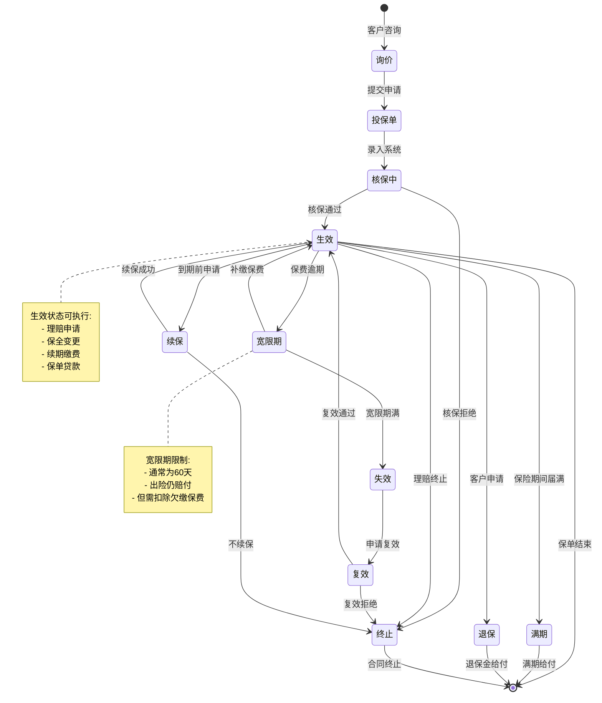
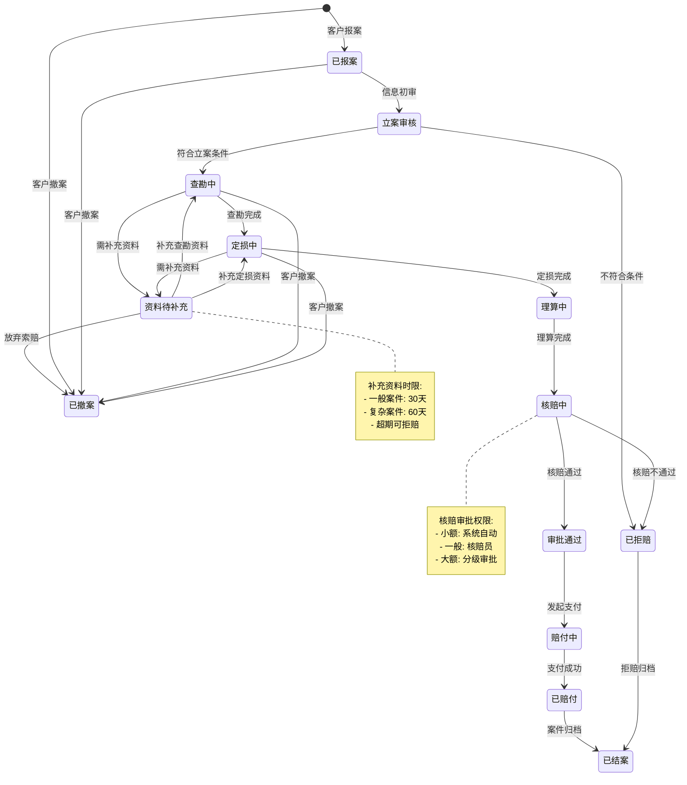
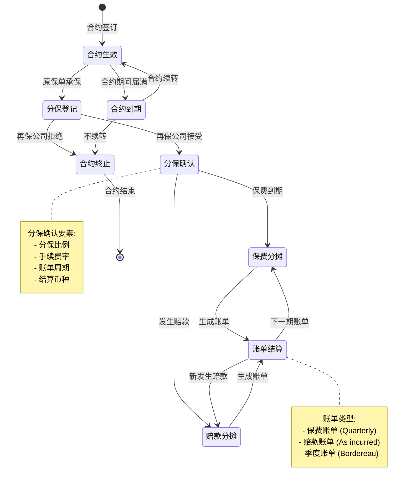
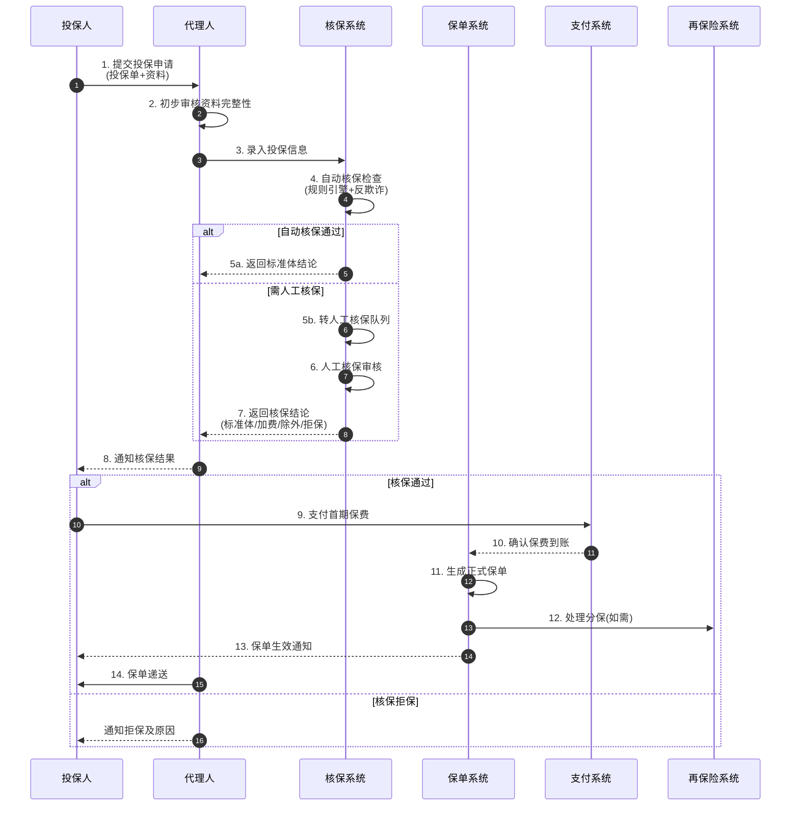
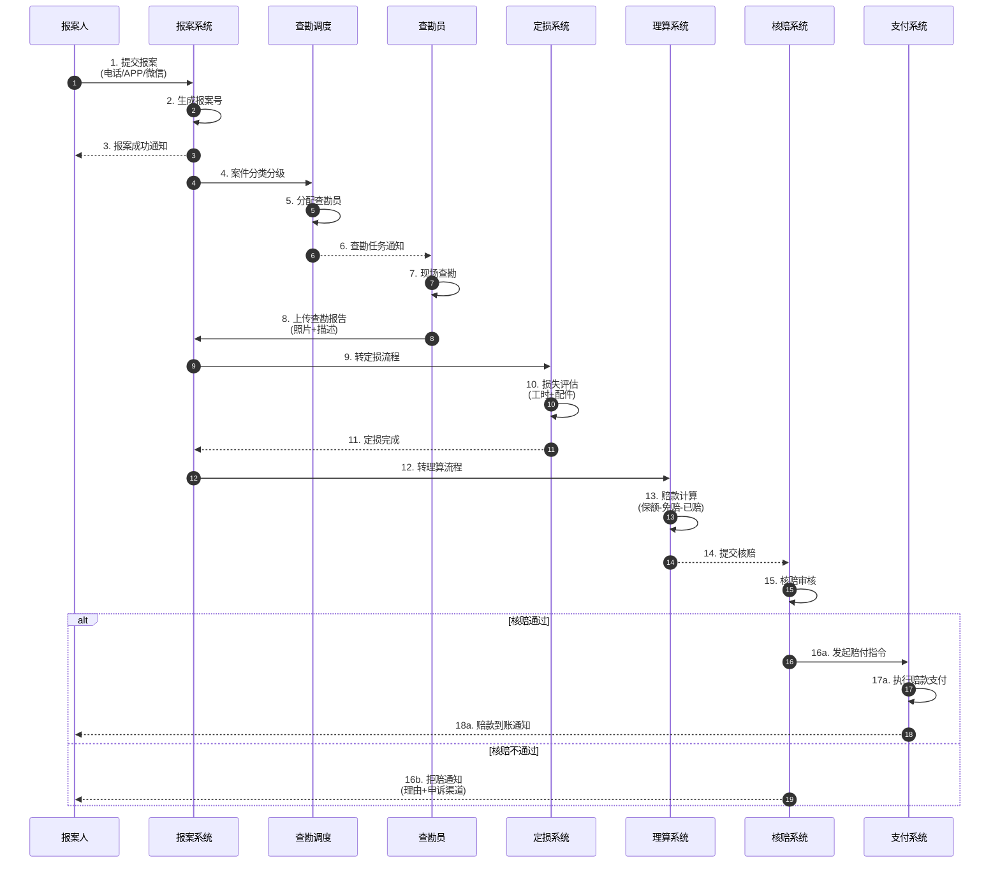
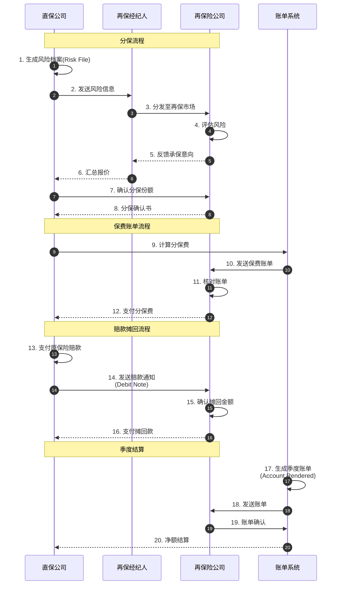
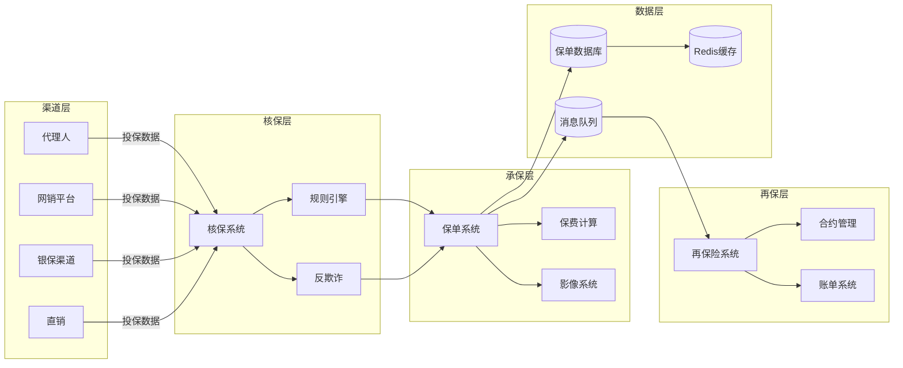
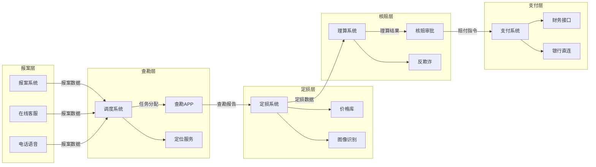
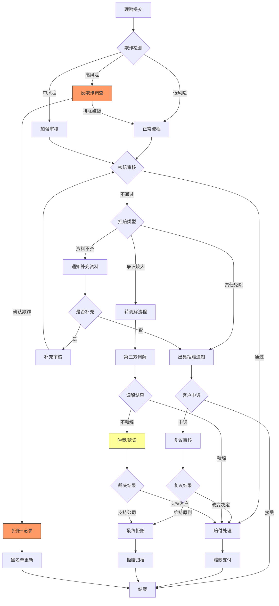

# 保险业务Schema动态动作分析视图

**版本**: v1.0
**创建日期**: 2026-02-15
**标准**: ACORD, IFRS 17, Solvency II, C-ROSS

---

## 📑 目录

- [保险业务Schema动态动作分析视图](#保险业务schema动态动作分析视图)
  - [📑 目录](#-目录)
  - [1. 动态动作分析概述](#1-动态动作分析概述)
  - [2. 状态机形式化](#2-状态机形式化)
    - [2.1 保单生命周期状态机](#21-保单生命周期状态机)
    - [2.2 理赔处理状态机](#22-理赔处理状态机)
    - [2.3 再保险分摊状态机](#23-再保险分摊状态机)
  - [3. 时序交互分析](#3-时序交互分析)
    - [3.1 投保流程完整时序](#31-投保流程完整时序)
    - [3.2 理赔流程时序模型](#32-理赔流程时序模型)
    - [3.3 再保险流程时序模型](#33-再保险流程时序模型)
  - [4. 数据流分析](#4-数据流分析)
    - [4.1 保单数据流动路径](#41-保单数据流动路径)
    - [4.2 理赔数据流动路径](#42-理赔数据流动路径)
    - [4.3 信息熵变化分析](#43-信息熵变化分析)
  - [5. 实时性分析](#5-实时性分析)
    - [5.1 SLA要求定义](#51-sla要求定义)
    - [5.2 核保响应时间分析](#52-核保响应时间分析)
    - [5.3 理赔时效分析](#53-理赔时效分析)
  - [6. 异常处理机制](#6-异常处理机制)
    - [6.1 欺诈检测机制](#61-欺诈检测机制)
    - [6.2 拒赔处理机制](#62-拒赔处理机制)
    - [6.3 争议解决机制](#63-争议解决机制)
    - [6.4 异常处理决策矩阵](#64-异常处理决策矩阵)
  - [7. Mermaid动态视图](#7-mermaid动态视图)
    - [7.1 保单生命周期状态机图](#71-保单生命周期状态机图)
    - [7.2 理赔处理状态机图](#72-理赔处理状态机图)
    - [7.3 再保险分摊状态机图](#73-再保险分摊状态机图)
    - [7.4 投保流程时序图](#74-投保流程时序图)
    - [7.5 理赔流程时序图](#75-理赔流程时序图)
    - [7.6 再保险流程时序图](#76-再保险流程时序图)
    - [7.7 保单数据流图](#77-保单数据流图)
    - [7.8 理赔数据流图](#78-理赔数据流图)
    - [7.9 异常处理流程图](#79-异常处理流程图)

---

## 1. 动态动作分析概述

保险业务系统动态动作分析关注保险核心业务在运行时的行为特征，包括：

- **状态转换**: 保单、理赔、再保险合约在不同状态间的迁移
- **时序交互**: 参与方（投保人、保险公司、代理人、再保公司等）之间的消息传递顺序和因果关系
- **数据流动**: 保单数据和理赔数据在各系统组件间的传递路径
- **实时性能**: 满足SLA要求的核保响应时间和理赔时效保障
- **异常恢复**: 故障场景下的欺诈检测、拒赔处理和争议解决机制

---

## 2. 状态机形式化

### 2.1 保单生命周期状态机

```
状态集合: S = {询价, 投保单, 核保中, 生效, 宽限期, 失效, 复效, 续保, 终止, 满期, 退保}

状态转换函数:
δ(询价)     = 投保单      (客户提交投保申请)
δ(投保单)   = 核保中      (系统接收投保资料)
δ(核保中)   = 生效        (核保通过，保费到账)
δ(核保中)   = 终止        (核保拒绝)
δ(生效)     = 宽限期      (续期保费逾期未缴)
δ(生效)     = 终止        (理赔导致保单终止)
δ(生效)     = 满期        (保险期间届满)
δ(生效)     = 退保        (客户申请退保)
δ(宽限期)   = 生效        (补缴保费)
δ(宽限期)   = 失效        (宽限期届满未缴费)
δ(失效)     = 复效        (客户申请复效并审核通过)
δ(复效)     = 生效        (复效成功)
δ(生效)     = 续保        (保单到期前申请续保)
δ(续保)     = 生效        (续保成功，新保单生效)

状态不变式:
∀保单: 保单状态 ∈ S
∀保单: 生效状态 ⇒ 保费已缴 ≥ 应缴保费
∀保单: 失效状态 ⇒ 当前日期 > 宽限期届满日
```

**保单状态转换矩阵:**

| 当前状态 | 投保申请 | 核保通过 | 核保拒绝 | 保费逾期 | 补缴保费 | 理赔终止 | 满期给付 | 客户退保 | 复效申请 |
|---------|---------|---------|---------|---------|---------|---------|---------|---------|---------|
| **询价** | 投保单 | - | - | - | - | - | - | - | - |
| **投保单** | - | 核保中 | - | - | - | - | - | - | - |
| **核保中** | - | 生效 | 终止 | - | - | - | - | - | - |
| **生效** | - | - | - | 宽限期 | - | 终止 | 满期 | 退保 | - |
| **宽限期** | - | - | - | - | 生效 | - | - | - | - |
| **失效** | - | - | - | - | - | - | - | - | 复效 |
| **复效** | - | 生效 | - | - | - | - | - | - | - |
| **终止** | - | - | - | - | - | - | - | - | - |
| **满期** | - | - | - | - | - | - | - | - | - |
| **退保** | - | - | - | - | - | - | - | - | - |

### 2.2 理赔处理状态机

```
理赔状态集合: C = {已报案, 立案审核, 查勘中, 定损中, 资料待补充, 理算中, 核赔中, 审批通过, 已拒赔, 赔付中, 已赔付, 已结案}

状态转换流程:
1. 报案阶段
   已报案 → 立案审核  (报案信息初步审核)

2. 立案阶段
   立案审核 → 查勘中   (符合立案条件，分配查勘员)
   立案审核 → 已拒赔   (不符合立案条件)

3. 查勘阶段
   查勘中 → 定损中     (完成现场查勘)
   查勘中 → 资料待补充 (需要补充证明材料)

4. 定损阶段
   定损中 → 理算中     (完成损失评估)
   定损中 → 资料待补充 (需要补充损失证明)

5. 资料补充阶段
   资料待补充 → 查勘中 (补充查勘资料)
   资料待补充 → 定损中 (补充定损资料)
   资料待补充 → 已拒赔 (资料不齐且放弃补充)

6. 理算阶段
   理算中 → 核赔中     (完成赔款计算)

7. 核赔阶段
   核赔中 → 审批通过   (核赔通过)
   核赔中 → 已拒赔     (核赔不通过)

8. 赔付阶段
   审批通过 → 赔付中   (发起赔付指令)
   赔付中 → 已赔付     (赔款支付成功)

9. 结案阶段
   已赔付 → 已结案     (完成案件归档)
   已拒赔 → 已结案     (完成拒赔归档)

异常处理:
任意状态 → 已撤案     (客户主动撤案)
已拒赔 → 核赔中       (申诉复议通过)
```

**理赔状态转换条件:**

| 转换 | 触发条件 | 执行动作 | 时间限制 |
|-----|---------|---------|---------|
| 已报案→立案审核 | 报案信息完整 | 生成报案号 | < 30分钟 |
| 立案审核→查勘中 | 符合保险责任 | 分配查勘任务 | < 2小时 |
| 立案审核→已拒赔 | 超出保险责任 | 发送拒赔通知 | < 4小时 |
| 查勘中→定损中 | 查勘完成 | 提交查勘报告 | 视案件类型 |
| 定损中→理算中 | 定损完成 | 生成损失清单 | < 1个工作日 |
| 理算中→核赔中 | 理算完成 | 提交核赔申请 | < 1个工作日 |
| 核赔中→审批通过 | 核赔通过 | 生成赔付指令 | < 2个工作日 |
| 审批通过→已赔付 | 支付成功 | 发送赔付通知 | < 3个工作日 |

### 2.3 再保险分摊状态机

```
再保险状态集合: R = {合约生效, 分保登记, 分保确认, 保费分摊, 赔款分摊, 账单结算, 合约到期, 合约终止}

状态转换规则:

合约生效 → 分保登记    (原保单承保，触发分保)
分保登记 → 分保确认    (再保公司确认接受)
分保登记 → 合约终止    (再保公司拒绝，需重新安排)
分保确认 → 保费分摊    (按期计算分保费)
保费分摊 → 账单结算    (生成分保账单)
赔款分摊 → 账单结算    (发生赔款时计算摊回)
账单结算 → 账单结算    (定期账单循环)
合约生效 → 合约到期    (合约期间届满)
合约到期 → 合约生效    (合约续转成功)

再保险分摊计算:

比例再保险:
分出保费 = 原保费 × 分保比例
摊回赔款 = 赔款金额 × 分保比例

非比例再保险:
摊回赔款 = min(max(赔款 - 起赔点, 0), 层限额)
```

**再保险状态转换矩阵:**

| 当前状态 | 原保单承保 | 再保确认 | 再保拒绝 | 保费到期 | 发生赔款 | 账单生成 | 合约到期 | 合约续转 |
|---------|-----------|---------|---------|---------|---------|---------|---------|---------|
| **合约生效** | 分保登记 | - | - | - | - | - | 合约到期 | - |
| **分保登记** | - | 分保确认 | 合约终止 | - | - | - | - | - |
| **分保确认** | - | - | - | 保费分摊 | 赔款分摊 | - | - | - |
| **保费分摊** | - | - | - | - | - | 账单结算 | - | - |
| **赔款分摊** | - | - | - | - | - | 账单结算 | - | - |
| **账单结算** | - | - | - | 保费分摊 | 赔款分摊 | 账单结算 | 合约到期 | - |
| **合约到期** | - | - | - | - | - | - | - | 合约生效 |
| **合约终止** | - | - | - | - | - | - | - | - |

---

## 3. 时序交互分析

### 3.1 投保流程完整时序

```
参与方:
- 投保人 (Policyholder)
- 保险代理人/经纪人 (Agent/Broker)
- 核保系统 (Underwriting System)
- 保单系统 (Policy System)
- 支付系统 (Payment System)
- 再保险系统 (Reinsurance System)

时序流程:

T0: 投保人提交投保申请
T1 = T0 + Δt1: 代理人接收申请，初步审核资料完整性
T2 = T1 + Δt2: 代理人录入投保信息至核保系统
T3 = T2 + Δt3: 核保系统接收投保数据
T4 = T3 + Δt4: 核保系统执行自动核保检查
    - 规则引擎检查
    - 风险评分计算
    - 反欺诈筛查
T5 = T4 + Δt5: 自动核保通过/转人工核保
T6 = T5 + Δt6: 人工核保审核（如需要）
T7 = T6 + Δt7: 核保决定生成（标准体/加费/除外/拒保）
T8 = T7 + Δt8: 核保结果通知投保人
T9 = T8 + Δt9: 投保人确认承保并支付首期保费
T10 = T9 + Δt10: 支付系统处理保费到账
T11 = T10 + Δt11: 保单系统生成正式保单
T12 = T11 + Δt12: 再保险系统处理分保（如需要）
T13 = T12 + Δt13: 保单生效确认
T14 = T13 + Δt14: 保单递送投保人

总延迟: T_total = ΣΔti (i=1 to 14)
```

### 3.2 理赔流程时序模型

```
理赔时序参与方:
- 被保险人/报案人 (Claimant)
- 理赔受理系统 (FNOL System)
- 查勘调度系统 (Dispatch System)
- 查勘员 (Surveyor)
- 定损系统 (Assessment System)
- 理算系统 (Calculation System)
- 核赔系统 (Approval System)
- 支付系统 (Payment System)

时序流程:

阶段1: 报案受理 (T0 - T2)
├─ T0: 报案人通过电话/APP/微信报案
├─ T1 = T0 + 5min: 系统接收报案，生成报案号
└─ T2 = T1 + 10min: 完成报案信息录入

阶段2: 查勘调度 (T2 - T4)
├─ T3 = T2 + 30min: 案件分类分级
└─ T4 = T3 + 1h: 查勘任务分配给查勘员

阶段3: 现场查勘 (T4 - T6)
├─ T5 = T4 + 4h: 查勘员抵达现场（车险）
└─ T6 = T5 + 2h: 完成查勘报告上传

阶段4: 损失评估 (T6 - T8)
├─ T7 = T6 + 1d: 定损员完成损失评估
└─ T8 = T7 + 4h: 定损报告审核完成

阶段5: 赔款理算 (T8 - T10)
├─ T9 = T8 + 1d: 理算员完成赔款计算
└─ T10 = T9 + 1d: 理算结果审核

阶段6: 核赔审批 (T10 - T12)
├─ T11 = T10 + 2d: 核赔员完成审核
└─ T12 = T11 + 1d: 审批权限人批准

阶段7: 赔款支付 (T12 - T14)
├─ T13 = T12 + 1d: 生成支付指令
└─ T14 = T13 + 2d: 赔款到账

总时效: 小额案件 1-3天，一般案件 5-10天，复杂案件 15-30天
```

### 3.3 再保险流程时序模型

```
再保险参与方:
- 直保公司 (Ceding Company)
- 再保经纪人 (Reinsurance Broker)
- 再保险公司 (Reinsurer)
- 账单系统 (Accounting System)

分保时序流程:

阶段1: 风险信息交换
├─ T0: 直保公司生成风险信息档案(Risk File)
├─ T1 = T0 + 1d: 经纪人接收并分发至再保市场
├─ T2 = T1 + 5d: 再保公司反馈承保意向
└─ T3 = T2 + 3d: 确定再保份额和条件

阶段2: 分保确认
├─ T4 = T3 + 1d: 签发分保确认书
└─ T5 = T4 + 1d: 再保公司确认接受

阶段3: 保费账单
├─ T6 = T5 + 30d: 生成首期保费账单
├─ T7 = T6 + 15d: 再保公司支付分保费
└─ T8 = T7 + 30d: 后续季度账单循环

赔款摊回时序:
├─ T0: 直保公司支付原保险赔款
├─ T1 = T0 + 7d: 生成赔款通知书(Debit Note)
├─ T2 = T1 + 14d: 再保公司确认摊回金额
└─ T3 = T2 + 30d: 再保公司支付摊回款

账单结算时序:
├─ T0: 账单周期截止
├─ T1 = T0 + 15d: 生成季度账单(Account Rendered)
├─ T2 = T1 + 30d: 双方核对账单
└─ T3 = T2 + 30d: 净额结算
```

---

## 4. 数据流分析

### 4.1 保单数据流动路径

```
保单数据生命周期:

1. 投保阶段
   ┌─────────────────────────────────────────┐
   │ 渠道层: 代理人/网销/银保/直销           │
   │   - 客户信息采集                         │
   │   - 投保单录入                           │
   │   - 影像资料上传                         │
   └─────────────────────────────────────────┘
                    │
                    ▼ (投保单数据)
2. 核保阶段
   ┌─────────────────────────────────────────┐
   │ 核保系统:                               │
   │   - 规则引擎校验                         │
   │   - 风险评分计算                         │
   │   - 健康险核保(体检报告)                 │
   │   - 财务核保(资产证明)                   │
   │   - 反欺诈检查                           │
   └─────────────────────────────────────────┘
                    │
                    ▼ (核保决定数据)
3. 承保阶段
   ┌─────────────────────────────────────────┐
   │ 保单系统:                               │
   │   - 保单主数据生成                       │
   │   - 责任明细记录                         │
   │   - 保费计算确认                         │
   │   - 保单影像归档                         │
   └─────────────────────────────────────────┘
                    │
                    ▼ (保单生效数据)
4. 分保阶段
   ┌─────────────────────────────────────────┐
   │ 再保险系统:                             │
   │   - 分保比例计算                         │
   │   - 分保账单生成                         │
   │   - 风险数据交换                         │
   └─────────────────────────────────────────┘
                    │
                    ▼ (保全变更数据)
5. 保全阶段
   ┌─────────────────────────────────────────┐
   │ 保全系统:                               │
   │   - 客户信息变更                         │
   │   - 受益人变更                           │
   │   - 保额变更                             │
   │   - 缴费方式变更                         │
   │   - 补发保单                             │
   └─────────────────────────────────────────┘
```

### 4.2 理赔数据流动路径

```
理赔数据生命周期:

报案数据流:
报案人 → 报案系统 → 案件分配 → 查勘系统
  │          │           │          │
  ▼          ▼           ▼          ▼
多渠道    案件登记    查勘员    查勘报告
          案件分类    分配      影像资料
          优先级      调度

定损数据流:
查勘报告 → 定损系统 → 价格库 → 定损确认
  │           │          │        │
  ▼           ▼          ▼        ▼
损失照片   工时计算    配件价格  定损单
事故描述   材料费用    工时费率  确认签字

理算数据流:
定损单 → 理算系统 → 保单数据 → 理算结果
  │          │          │        │
  ▼          ▼          ▼        ▼
损失金额   计算公式    保额限额  应赔付额
免赔额     折扣率      已赔付额  扣除项

核赔数据流:
理算结果 → 核赔系统 → 审批流 → 赔付指令
  │          │          │        │
  ▼          ▼          ▼        ▼
赔款计算   规则校验    权限审核  支付申请
资料齐全   反欺诈      金额复核  支付审批
```

### 4.3 信息熵变化分析

```
保险数据在系统中的熵变:

原始输入:        H ≈ 200 bits (复杂投保信息)
     │
     │ 数据清洗与验证
     ▼
结构化数据:      H ≈ 100 bits (标准化字段)
     │
     │ 核保决策
     ▼
核保结果:        H ≈ 3 bits (通过/加费/除外/拒保)
     │
     │ 保单生成
     ▼
保单数据:        H ≈ 80 bits (格式化保单信息)
     │
     │ 理赔处理
     ▼
理赔状态:        H ≈ 4 bits (状态编码)
     │
     │ 赔付计算
     ▼
赔付金额:        H ≈ 32 bits (金额数值)
     │
     │ 结案归档
     ▼
案件记录:        H ≈ 20 bits (归档索引)

信息保护点:
1. 投保信息加密: 防止敏感信息泄露
2. 核保规则保护: 保护风控策略
3. 理赔资料管控: 限制访问权限
4. 审计日志: 完整操作追溯
```

---

## 5. 实时性分析

### 5.1 SLA要求定义

```
保险业务服务等级协议 (SLA) 指标:

业务类型        │ 响应时间    │ 可用性     │ 处理时效      │ 准确率
────────────────┼────────────┼───────────┼──────────────┼─────────
自动核保        │ < 3秒      │ 99.9%     │ 实时          │ 99.5%
人工核保        │ < 4小时    │ 99.5%     │ 1-3个工作日   │ 99.0%
小额理赔        │ < 1天      │ 99.5%     │ 1-3个工作日   │ 99.5%
一般理赔        │ < 2天      │ 99.0%     │ 5-10个工作日  │ 99.0%
复杂理赔        │ < 5天      │ 98.0%     │ 15-30个工作日 │ 98.5%
保全变更        │ < 1小时    │ 99.9%     │ 实时-1天      │ 99.9%
续期提醒        │ < 1天      │ 99.9%     │ 提前30天      │ 99.9%
保单查询        │ < 2秒      │ 99.99%    │ 实时          │ 99.99%
理赔查询        │ < 2秒      │ 99.99%    │ 实时          │ 99.99%

业务时段要求:
- 工作日 08:00-18:00: 全功能开放，最高性能
- 工作日 18:00-22:00: 核心功能开放，查询优先
- 非工作日: 自助理赔、查询服务，核保次日处理
```

### 5.2 核保响应时间分析

```
核保处理延迟分解:

总延迟 = 数据录入延迟 + 系统处理延迟 + 规则引擎延迟 + 决策延迟

自动核保 (T_auto):
- 数据解析: 50-100ms
- 规则校验: 100-300ms
- 风险评分: 200-500ms
- 反欺诈检查: 300-800ms
- 决策生成: 50-100ms
- 小计: 700ms - 1.8s (目标: < 3s)

人工核保 (T_manual):
- 任务分配: 1-4小时
- 资料审核: 2-8小时
- 风险评估: 4-16小时
- 决策审批: 2-8小时
- 小计: 9小时 - 36小时 (目标: < 48小时)

复杂核保 (T_complex):
- 体检安排: 1-3天
- 财务调查: 3-7天
- 再保询价: 3-5天
- 综合评审: 1-2天
- 小计: 8-17天 (目标: < 20天)
```

### 5.3 理赔时效分析

```
理赔时效监管要求 (《保险小额理赔服务指引（试行）》):

小额理赔 (索赔金额 < 3000元):
├─ 报案受理: 即时
├─ 索赔资料齐全通知: 1个工作日内
├─ 赔付核定: 5个工作日内
└─ 赔款支付: 核定后1个工作日内
目标: 5日结案率 ≥ 80%

一般理赔:
├─ 报案受理: 即时
├─ 查勘调度: 1个工作日内
├─ 现场查勘: 3个工作日内
├─ 定损完成: 5个工作日内
├─ 核赔完成: 10个工作日内
└─ 赔款支付: 3个工作日内
目标: 平均结案时效 ≤ 10日

复杂理赔:
├─ 报案受理: 即时
├─ 查勘定损: 10个工作日内
├─ 伤残鉴定: 30-60日
├─ 理算核赔: 15个工作日内
└─ 赔款支付: 5个工作日内
目标: 平均结案时效 ≤ 30日

理赔时效计算公式:
平均结案时效 = Σ(结案日期 - 报案日期) / 结案案件数
5日结案率 = 5日内结案数 / 总结案数 × 100%
```

---

## 6. 异常处理机制

### 6.1 欺诈检测机制

```
保险欺诈检测体系:

欺诈类型:
├─ 投保欺诈
│  ├─ 带病投保 (隐瞒既往病史)
│  ├─ 逆选择 (高风险群体集中投保)
│  ├─ 虚假身份 (冒用他人身份)
│  └─ 重复投保 (多家公司高额投保)
├─ 理赔欺诈
│  ├─ 虚构保险事故
│  ├─ 夸大损失程度
│  ├─ 编造虚假事故原因
│  ├─ 故意制造保险事故
│  └─ 伪造证明材料
└─ 内外勾结
   ├─ 代理人虚假承诺
   ├─ 查勘员串通骗赔
   └─ 内部人员泄露信息

检测模型:
1. 规则引擎检测
   - 黑名单比对
   - 异常金额检测
   - 高频报案检测
   - 关联关系检测

2. 机器学习检测
   - 孤立森林 (异常检测)
   - 随机森林 (分类预测)
   - 神经网络 (模式识别)
   - 图神经网络 (关联分析)

3. 社交网络分析
   - 关系图谱构建
   - 团伙欺诈识别
   - 资金流向追踪

欺诈评分计算:
Fraud_Score = Σ(wi × fi)
其中:
- wi: 特征权重
- fi: 特征值 (归一化)

阈值判定:
- Score < 30: 低风险，正常处理
- 30 ≤ Score < 70: 中风险，加强审核
- Score ≥ 70: 高风险，人工调查
```

### 6.2 拒赔处理机制

```
拒赔处理流程:

拒赔类型:
├─ 责任免除拒赔
│  ├─ 免责条款适用
│  ├─ 等待期内出险
│  └─ 未如实告知
├─ 时效拒赔
│  ├─ 报案超期
│  ├─ 索赔超期
│  └─ 诉讼时效届满
├─ 证明不足拒赔
│  ├─ 事故证明缺失
│  ├─ 损失证明不足
│  └─ 关系证明缺失
└─ 其他拒赔
   ├─ 保单失效
   ├─ 保险标的变更
   └─ 欺诈嫌疑

拒赔处理流程:
1. 初步审核 (T+1)
   ├─ 案件资料审核
   ├─ 责任认定分析
   └─ 拒赔理由确认

2. 内部审批 (T+3)
   ├─ 核赔员复核
   ├─ 法务合规审核
   └─ 审批权限人批准

3. 通知客户 (T+5)
   ├─ 拒赔通知书发送
   ├─ 拒赔理由说明
   └─ 申诉渠道告知

4. 客户申诉处理
   ├─ 申诉受理 (T+7)
   ├─ 复议审核 (T+14)
   ├─ 申诉决定 (T+21)
   └─ 最终通知

5. 争议解决
   ├─ 协商和解
   ├─ 调解 (保险纠纷调解委员会)
   ├─ 仲裁
   └─ 诉讼

拒赔申诉成功率:
行业平均: 5-10%
说明: 大部分拒赔决定经复核后维持原判
```

### 6.3 争议解决机制

```
保险争议解决路径:

层级1: 内部协商
├─ 客户投诉受理
├─ 客服部门协调
├─ 业务部门复核
└─ 协商解决方案
时效: 15个工作日
成功率: 60%

层级2: 第三方调解
├─ 保险行业协会调解
├─ 保险纠纷调解委员会
├─ 消费者协会调解
└─ 人民调解委员会
时效: 30个工作日
成功率: 40%

层级3: 仲裁
├─ 提交仲裁申请
├─ 仲裁庭组成
├─ 开庭审理
├─ 仲裁裁决
└─ 裁决执行
时效: 3-6个月
费用: 按标的额收取

层级4: 诉讼
├─ 起诉立案
├─ 庭前准备
├─ 开庭审理
├─ 一审判决
├─ 上诉 (如有)
└─ 终审判决
时效: 6个月 - 2年
费用: 诉讼费 + 律师费

争议数据统计:
- 协商解决: 70%
- 调解解决: 15%
- 仲裁解决: 5%
- 诉讼解决: 10%

争议预防机制:
1. 销售适当性管理
2. 条款通俗化解释
3. 理赔透明化处理
4. 客户教育普及
```

### 6.4 异常处理决策矩阵

```
异常场景分类与处理:

异常类型        │ 检测方式       │ 自动处理       │ 人工介入      │ 通知方式
────────────────┼───────────────┼───────────────┼──────────────┼──────────
投保欺诈嫌疑    │ 规则引擎      │ 标记待审       │ 核保调查      │ 系统提醒
理赔欺诈嫌疑    │ ML模型        │ 转调查队列     │ 反欺诈调查    │ 紧急告警
核保超时        │ 时限监控      │ 升级提醒       │ 主管督办      │ 邮件+短信
理赔超时        │ 时限监控      │ 自动预警       │ 催办处理      │ 系统通知
资料不齐        │ 完整性检查    │ 自动通知       │ 补充收集      │ 短信/邮件
系统故障        │ 健康检查      │ 服务降级       │ 故障恢复      │ 全员告警
数据异常        │ 一致性校验    │ 记录日志       │ 数据修复      │ 运维通知
合规风险        │ 规则检查      │ 阻断流程       │ 合规审核      │ 合规通知
```

---

## 7. Mermaid动态视图

### 7.1 保单生命周期状态机图



### 7.2 理赔处理状态机图



### 7.3 再保险分摊状态机图



### 7.4 投保流程时序图



### 7.5 理赔流程时序图



### 7.6 再保险流程时序图



### 7.7 保单数据流图



### 7.8 理赔数据流图



### 7.9 异常处理流程图



---

**参考文档**:

- `01_Overview.md` - 保险业务Schema概述
- `02_Formal_Definition.md` - 形式化定义
- `03_Standards.md` - 标准对标
- `04_Transformation.md` - 模型转换
- `05_Case_Studies.md` - 案例研究
- ACORD标准
- IFRS 17保险合同准则
- 中国银保监会监管规定

**维护者**: DSL Schema研究团队
